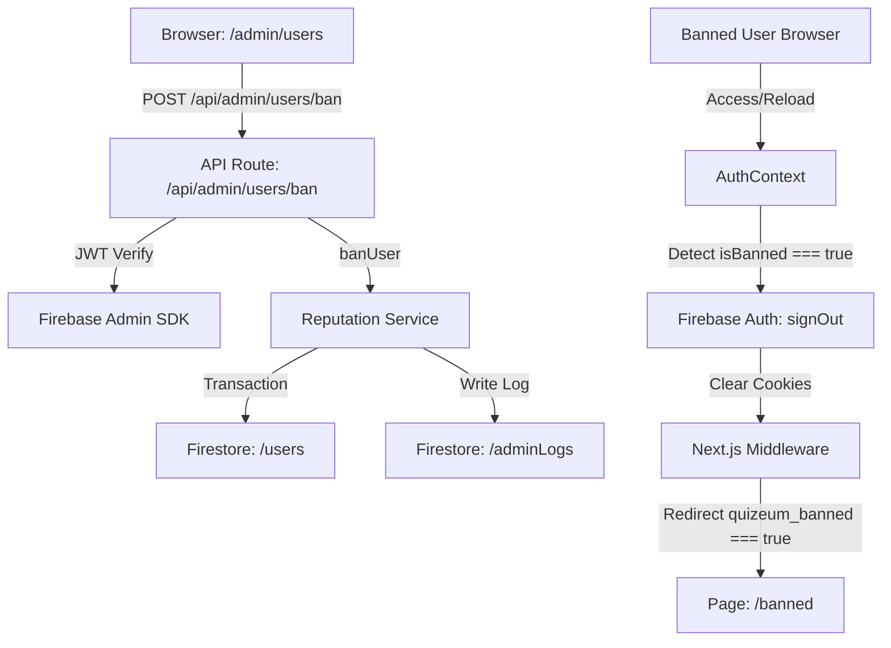

# Design Document: quizeum-admin-users-ui

## Overview
本機能は、システムの健全性を緊急時に維持するために、システム管理者（Super Admin）が特定の不適切なユーザーの評判スコア（`reputationScore`）と権限ティアー（`moderationTier`）を手動で強制リセットし、さらにアカウントの停止（BAN/UNBAN）処理を実行できる管理ツールを提供します。専用画面 `/admin/users` を新設し、実行履歴は `adminLogs` コレクションに監査ログとして永続化されます。また、BANされたユーザーを強制ログアウトの上、専用のアカウント停止メッセージ画面（`/banned`）へ強制リダイレクトしてアクセスを遮断する多重防衛システムを実装します。

### Goals
- 管理者専用の `/admin/users` 画面でユーザーUIDを指定してステータスを表示できること。
- リセット理由（10文字以上）を入力し、対象ユーザーのスコアを `0`、ティアーを `'newcomer'` にアトミックに緊急リセットできること。
- BAN理由（10文字以上）を入力し、対象ユーザーの `isBanned` を `true` に設定（BAN）して、システムから即座にアクセス遮断できること。また、管理者は必要に応じて `isBanned` を `false` に切り替え（UNBAN）できること。
- リセットおよびBAN/UNBAN実行時に、監査ログ（`adminLogs`）をアトミックに永続化すること。
- 一般ユーザーやモデレータからの管理画面アクセスをミドルウェアおよびUI層で完全に遮断すること。
- BANされたユーザーが再度ログインを試みた場合、またはログイン状態で操作を行った場合に、即座にログアウト処理を行い、専用画面 `/banned` に強制遷移させること。

### Non-Goals
- ユーザーのアカウント物理削除機能自体。
- BANされたユーザーが過去に投稿したクイズやコメントの物理削除や非公開化（これらはそのまま残します）。

## Boundary Commitments

### This Spec Owns
- `/admin/users` 画面の UI、フォームコンポーネントおよびスタイル。
- アカウント停止状態をユーザーに通知する `/banned` 画面の UI およびスタイル。
- `/api/admin/users/reset`, `/api/admin/users/ban`, `/api/admin/users/unban` エンドポイント（Next.js Route Handler）の認可ガードおよび実行ロジック。
- `adminLogs` コレクションの定義。
- `src/services/reputation.ts` に追加される `resetUserReputation`、`banUser`、`unbanUser` サービスメソッド。
- `middleware.ts` および `auth-context.tsx` における `isBanned` フラグを監視した強制ログアウト・Cookie管理・`/banned` リダイレクトの連携ガードロジック。

### Out of Boundary
- ユーザー自身が実行するプロフィール編集（`quizeum-auth-profile-ui` が所有）。
- クイズ、リスト、プロフィールの通報モデレーション審査（`quizeum-moderation-governance-ui` が所有）。

### Allowed Dependencies
- `quizeum-core` の Firebase/Firestore 設定および基本型定義。
- Firebase Admin SDK（IDトークンの署名検証および特権Firestore操作用）。

### Revalidation Triggers
- `AdminLog` のデータ構造変更。
- BAN/UNBAN 関連 API のリクエスト/レスポンス形式の変更。
- 認証コンテキストおよびミドルウェアのCookie仕様の変更。

## Architecture

### Architecture Pattern & Boundary Map



**Architecture Integration**:
- **Selected pattern**: API Route + Core Service コントラクト & クッキー駆動型ミドルウェアガード。
- **Domain/feature boundaries**: UI 画面、Route Handler（サーバー）、Core サービスレイヤーを分離し、特権リセット・BAN処理およびログ永続化をサーバーサイドに閉じることで、クライアントによる不正操作を防ぐ。
- **Immediate Termination Strategy**: トークン有効期間（最大1時間）中にユーザーが書き込みを試みるのを防ぐため、Firestoreの各コレクションの Security Rules に `isNotBanned()` チェックを適用し、APIおよびFirestoreのデータストアレベルで即時かつ完全に書き込みを遮断します。

### Technology Stack

| Layer | Choice / Version | Role in Feature | Notes |
|-------|------------------|-----------------|-------|
| Frontend | React 19 / Next.js 16 | 管理者専用 UI 画面、`/banned` 画面 | Vanilla CSS Styling |
| Backend | Next.js API Routes | `/api/admin/users/*` エンドポイント | JWT検証、特権認可チェック |
| Data / Storage | Firestore | `/users` および `/adminLogs` | アトミックトランザクション更新 |
| Infrastructure | Firebase Admin SDK | サーバーサイド特権操作 | IDトークン署名検証 |

## File Structure Plan

### Directory Structure
```
src/
├── app/
│   ├── admin/
│   │   └── users/
│   │       ├── page.tsx               # 管理者専用ユーザー管理画面 (UI)
│   │       └── users.module.css       # 画面専用スタイル (Vanilla CSS)
│   ├── banned/
│   │   ├── page.tsx                   # アカウント停止専用メッセージ表示画面 (UI)
│   │   └── banned.module.css          # 画面専用スタイル (Vanilla CSS)
│   └── api/
│       └── admin/
│           └── users/
│               ├── reset/
│               │   └── route.ts       # 管理者用リセットAPIエンドポイント
│               ├── ban/
│               │   └── route.ts       # 管理者用BAN APIエンドポイント
│               └── unban/
│                   └── route.ts       # 管理者用UNBAN APIエンドポイント
├── services/
│   └── reputation.ts                  # [Modified] resetUserReputation, banUser, unbanUser 関数の追加
├── types/
│   └── index.ts                       # [Modified] AdminLog, User 型定義の追加・更新
├── lib/
│   └── middleware-auth-cookies.ts     # [Modified] quizeum_banned Cookieの同期対応を追加
```

### Modified Files
- `src/services/reputation.ts` — `resetUserReputation`, `banUser`, `unbanUser` 関数を追加し、アトミックなトランザクション処理を実装する。
- `src/types/index.ts` — `AdminLog` インターフェースを追加定義し、`User` インターフェースに `isBanned`、`bannedReason`、`bannedAt` などの型情報を追加。
- `src/lib/middleware-auth-cookies.ts` — 認証 Cookie の同期処理に `quizeum_banned` を追加し、BAN状態が変更された際にクッキーを即時破棄・同期できるようにする。
- `src/middleware.ts` — `quizeum_banned` Cookieが検出された場合に、`/banned` 以外のページへのアクセスを `/banned` に強制リダイレクトするロジックを追加。
- `firestore.rules` — `adminLogs` コレクションに対するセキュリティルールを定義（クライアント直接書込は false）。また、`isBanned` が `true` の場合に書き込み/読み込みを拒否する `isNotBanned()` セキュリティヘルパーを実装。

## Requirements Traceability

| Requirement | Summary | Components | Interfaces | Flows |
|-------------|---------|------------|------------|-------|
| 1.1 | ログイン未済または非管理者アクセス時のリダイレクト・404ガード | Next.js Middleware / AdminUsersPage | Routeガード | Client -> API |
| 1.2 | 管理者ログイン時の画面表示 | AdminUsersPage | UI表示 | Client |
| 2.1 | UIDによる検索・情報取得・表示 | AdminUsersPage | ユーザー情報API/直接参照 | Client -> Firestore |
| 2.2 | 存在しないUID時のエラー表示 | AdminUsersPage | UI表示 | Client |
| 3.1 | リセット理由（10文字以上）のバリデーション | AdminUsersPage | UI表示 | Client |
| 3.2 | 強制リセット実行、`adminLogs` 保存 | ReputationService / API | `resetUserReputation` / `POST /api/admin/users/reset` | Client -> API -> Firestore |
| 3.3 | 処理中のボタン非活性化・ローディング | AdminUsersPage | UI表示 | Client |
| 3.4 | 処理成功時のメッセージ表示、情報再取得 | AdminUsersPage | UI表示 | Client |
| 4.1 | `/admin/moderation` からの遷移リンク | AdminModerationPage | UI表示 | Client |
| 4.2 | `/admin/users` から `/admin/moderation` へのリンク | AdminUsersPage | UI表示 | Client |
| 5.1 | BAN理由（10文字以上）のバリデーション | AdminUsersPage | UI表示 | Client |
| 5.2 | BAN実行、`isBanned: true` 更新、`adminLogs` 保存 | ReputationService / API | `banUser` / `POST /api/admin/users/ban` | Client -> API -> Firestore |
| 5.3 | BAN処理中のUI保護（ボタン非活性・ローディング） | AdminUsersPage | UI表示 | Client |
| 5.4 | BAN完了時の成功表示、UNBAN切り替え制御 | AdminUsersPage | UI表示 | Client |
| 5.5 | UNBAN実行、`isBanned: false` 更新、`adminLogs` 保存 | ReputationService / API | `unbanUser` / `POST /api/admin/users/unban` | Client -> API -> Firestore |
| 5.6 | BAN中のユーザーの機能アクセス完全遮断 | Firestore Rules / AuthContext | `isNotBanned()` / `auth.signOut()` | Backend / Client |
| 6.1 | BAN検知時のログアウトと `/banned` への強制遷移 | AuthContext / Middleware | Cookie同期 / Redirect | Client |
| 6.2 | 非BANユーザー等の `/banned` 直接アクセス時リダイレクト | BannedPage | `/` へのリダイレクト | Client |
| 6.3 | BANユーザーのアカウント機能アクセス遮断 | AuthContext / Middleware | Cookieガード | Client |

## Components and Interfaces

### UI Components

#### AdminUsersPage (Page: `/admin/users`)

| Field | Detail |
|-------|--------|
| Intent | 管理者が特定のUIDを指定して検索、ステータス表示、手動リセット処理およびBAN/UNBAN処理を実行する画面 |
| Requirements | 1.1, 1.2, 2.1, 2.2, 3.1, 3.3, 3.4, 4.2, 5.1, 5.3, 5.4 |

- **Responsibilities & Constraints**:
  - `useAuth` から取得した `user` を用い、クライアント側でも `role === 'admin'` の認可チェックを実行する (1.1, 1.2)。
  - ユーザー検索フォーム、および手動リセットフォーム（理由入力欄、実行ボタン）を表示。
  - アカウント停止（BAN/UNBAN）処理用のフォーム（理由入力欄、実行ボタン）を配置し、現在のユーザーがBAN状態かどうかによって動的にボタン表示を切り替える (5.4)。
  - 処理中の多重送信を防止するため、リクエスト送信中はボタンを非活性化する (3.3, 5.3)。
  - `/admin/moderation` への戻りナビゲーションリンクを配置する (4.2)。

#### BannedPage (Page: `/banned`)

| Field | Detail |
|-------|--------|
| Intent | アカウントが停止されたユーザーに対して、その旨を伝える専用メッセージ表示画面 |
| Requirements | 6.1, 6.2 |

- **Responsibilities & Constraints**:
  - ログイン中のユーザーが非BAN（`isBanned != true`）である場合、または未ログイン（認証情報なし）の場合は即座にホーム画面（`/`）へリダイレクトする (6.2)。
  - BANされた事実および「アカウントが停止されました。不服申し立て等が必要な場合はサポートへご連絡ください」といったメッセージを親しみやすくも厳粛なカジュアルモダンデザインで表示する。

### Backend Services

#### ReputationService

| Field | Detail |
|-------|--------|
| Intent | 信頼スコア、モデレータティアー、およびBAN状態の更新・管理ロジックを提供 |
| Requirements | 3.2, 5.2, 5.5 |

- **Responsibilities & Constraints**:
  - 各更新処理において、対象ユーザーのドキュメント更新と `adminLogs` の書き込みをアトミックに実行する。
  - 実行者の `role === 'admin'` を Firestore の `users/{uid}` ドキュメントから直接引き直して多重防衛的に認可チェックする。

##### Service Interface
```typescript
export interface AdminLog {
  id?: string;
  targetUid: string;
  executorId: string;
  action: 'reputation_reset' | 'ban' | 'unban';
  reason?: string; // unban時は任意
  createdAt: Date;
}

/**
 * 指定ユーザーの信頼スコアとティアーを手動で強制リセットし、監査ログに保存する
 */
export async function resetUserReputation(
  targetUid: string,
  executorId: string,
  reason: string
): Promise<void>;

/**
 * 指定ユーザーのアカウントを停止（BAN）し、監査ログに保存する
 */
export async function banUser(
  targetUid: string,
  executorId: string,
  reason: string
): Promise<void>;

/**
 * 指定ユーザーのアカウント停止を解除（UNBAN）し、監査ログに保存する
 */
export async function unbanUser(
  targetUid: string,
  executorId: string
): Promise<void>;
```

#### Admin Users API Endpoints

| Method | Endpoint | Request | Response | Errors | Requirements |
|--------|----------|---------|----------|--------|--------------|
| POST | `/api/admin/users/reset` | `{ targetUid: string, reason: string }` | `{ success: boolean }` | 400 (Invalid), 401/403 (Auth), 404 (Not Found), 500 (Error) | 3.2 |
| POST | `/api/admin/users/ban` | `{ targetUid: string, reason: string }` | `{ success: boolean }` | 400 (Invalid), 401/403 (Auth), 404 (Not Found), 500 (Error) | 5.2 |
| POST | `/api/admin/users/unban` | `{ targetUid: string }` | `{ success: boolean }` | 401/403 (Auth), 404 (Not Found), 500 (Error) | 5.5 |

## Data Models

### Logical Data Model

#### `users` コレクションの追加フィールド
- `isBanned` (`boolean`, 必須): アカウント停止フラグ。デフォルトは `false`
- `bannedReason` (`string`, 任意): BANされた理由
- `bannedAt` (`timestamp`, 任意): BANされた日時

#### `adminLogs` コレクション
- `id` (`string`, 必須): 自動生成ドキュメントID
- `targetUid` (`string`, 必須): アクション対象ユーザーのUID
- `executorId` (`string`, 必須): アクションを実行した管理者のUID
- `action` (`string`, 必須): 実行アクション名。`'reputation_reset' | 'ban' | 'unban'` のいずれか
- `reason` (`string`, 任意): 実行理由（10文字以上。`unban` アクション時は任意）
- `createdAt` (`timestamp`, 必須): 作成日時

## Error Handling

### Error Categories and Responses
- **400 (Bad Request)**: 入力されたリセット・BAN理由が 10文字未満の場合、バリデーションエラーを表示 (3.1, 5.1)。
- **401/403 (Unauthorized / Forbidden)**: 認証されていないか管理者権限のないユーザーが実行・閲覧を試みた場合、404画面にフォールバック。
- **404 (Not Found)**: 検索・操作対象のUIDのユーザーが Firestore 上に存在しない場合、「ユーザーが見つかりません」のエラーメッセージを表示 (2.2)。

## Testing Strategy

### Unit Tests
- `tests/services/reputation.test.ts`:
  - `banUser` 呼び出しで対象ユーザーの `isBanned` が `true`、理由が書き込まれ、`adminLogs` にアクション `'ban'` のログが保存されること。
  - `unbanUser` 呼び出しで対象ユーザーの `isBanned` が `false` に戻り、理由および `isBanned` フィールドが更新/解除され、`adminLogs` にアクション `'unban'` のログが保存されること。
  - 非管理者による特権操作（`resetUserReputation`, `banUser`, `unbanUser`）に対して適切にエラーがスローされ、ロールバックされること。

### Integration/E2E/UI Tests
- 管理者ユーザーでログイン後、`/admin/users` にアクセスし、モックユーザーのUIDで検索後、手動リセットおよびBAN/UNBANがエラーなく完了すること。
- 一般ユーザーまたはモデレータで `/admin/users` に直接遷移した際、アクセス拒否（リダイレクトまたは404フォールバック）されること。
- ログイン中のユーザーがBANされた（`isBanned: true`）際、画面操作を行ったタイミングまたは自動リフェッチ時に強制的にログアウトされ、Cookie `quizeum_banned === 'true'` の状態で `/banned` に強制遷移すること。
- 非BANユーザーまたは未ログインで `/banned` ページにアクセスした際、即座に `/` にリダイレクトされること。
