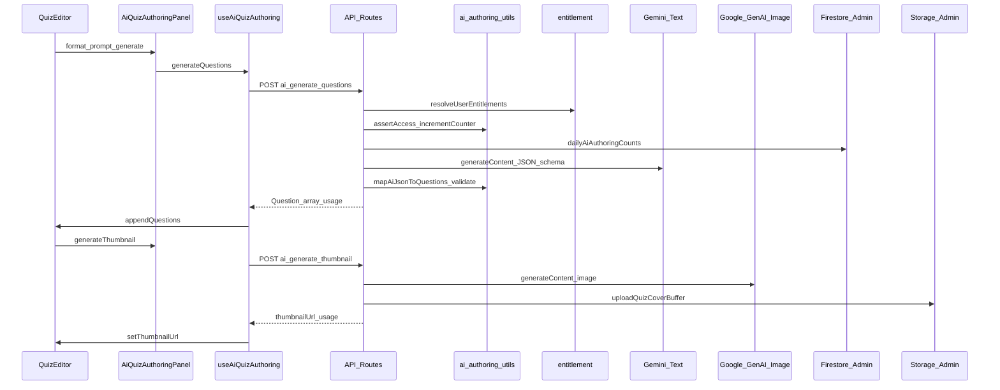
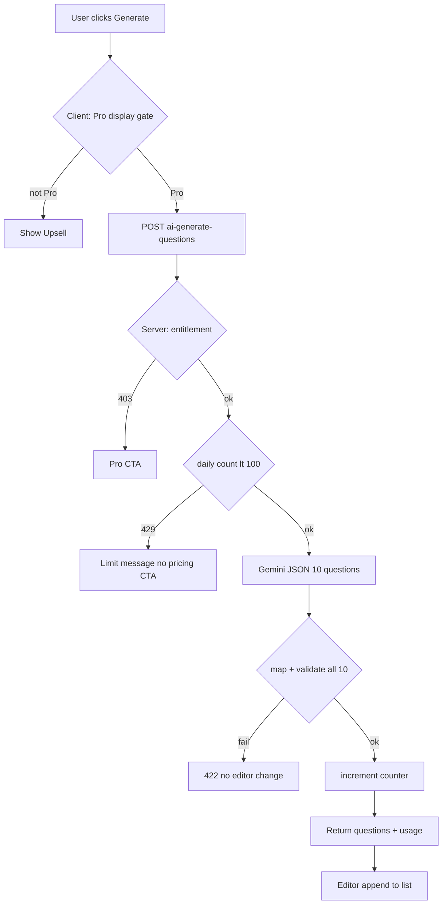
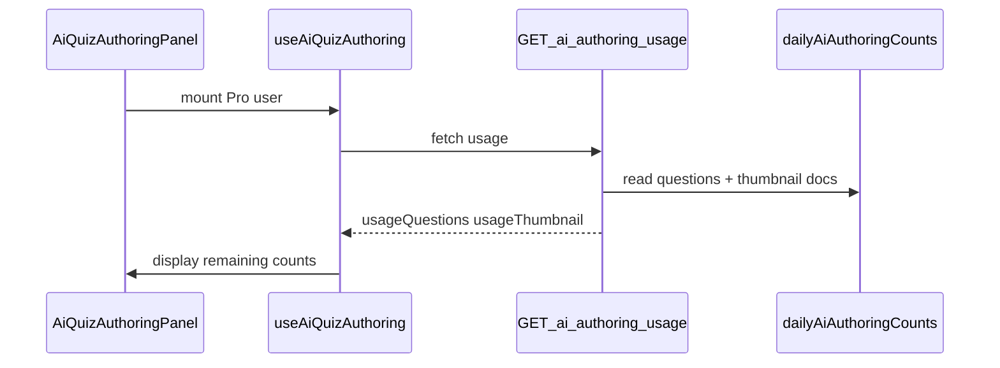

# Technical Design Document: quizeum-ai-quiz-authoring

## Overview

**Purpose**: Pro 契約クリエイターがクイズエディタ内で Gemini による **10問一括 AI 作問**と**タイトル・説明ベースのサムネイル AI 生成**を利用できるようにし、作問効率と Pro プラン価値を高める。

**Users**: 有効な Pro / Premium 契約を持つクイズ作成者が `/quiz/create` および `/quiz/[id]/edit` で利用する。無料・未ログインユーザには Pro 購読 CTA を表示する。

**Impact**: 新規 API 3 本（usage GET + 作問 POST + サムネ POST）、作問用日次カウンタ、エディタ AI パネル、サムネ picsum スタブの置換。プレイ AI（`ask-ai`）とはカウンタ・Route 境界を分離する。

### Goals
- プロンプト 1 回で形式適合の 10 問を生成し、既存問題リスト末尾に追加反映
- タイトル・説明からサムネイルを生成し Storage URL を `thumbnailUrl` に設定
- Pro 限定 + 日次制限（作問 100 / サムネ 20、JST リセット）+ 残り回数表示
- サーバー側 Pro 判定・検証・エラー UX（401/403/429/422/503）

### Non-Goals
- lateral-thinking 一括作問、問題単位画像 AI、無料お試し、自動 Firestore 保存
- プレイ AI 制限変更、Stripe / エンタイトルメント同期本体、リストエディタ AI

## Boundary Commitments

### This Spec Owns
- **エディタ UI**: `AiQuizAuthoringPanel`, `AiQuizProUpsell`, サムネ AI ボタン、ローディング・エラー・残り回数表示
- **クライアント Hook**: `useAiQuizAuthoring`（API 呼び出し、state、エディタへの反映）
- **API 契約定義**: 作問・サムネ 2 エンドポイント + **残り回数 GET** の Request/Response/Error 型（実装は core タスク）
- **E2E 契約**: `data-testid`（要件 7.2–7.3）
- **Core 実装タスクの設計正本**: `ai-authoring-utils`, Route, Admin Storage, Rules（roadmap Phase 25 core 更新と同一設計を参照）

### Out of Boundary
- 水平思考プレイ AI UI・制限（`quizeum-play-flow-ui`）
- 料金画面レイアウト（`quizeum-billing-subscription-ui`）— 特典文言のみ direct update 可
- クイズ保存・公開・バリデーション lib 本体（既存 `quiz-validation` を呼び出すのみ）
- Stripe Webhook / `applySubscriptionFromStripe`

### Allowed Dependencies
- `quizeum-core`: `resolveUserEntitlements`, `verifyFirebaseIdToken`, `quiz-validation`, Firestore Admin, 新規 Storage Admin helper
- `quizeum-ui-editor`: `QuizEditor` / `QuizMetadataSection` への props 差し込み
- `@google/generative-ai`（テキスト作問）、`@google/genai`（サムネ、新規依存）
- `GEMINI_API_KEY`, `GEMINI_MODEL_ID`, `GEMINI_IMAGE_MODEL_ID`（新規 env）

### Revalidation Triggers
- API Request/Response 形状変更
- 日次上限値・カウンタ docId 変更
- 対応 `format` / `Question.type` 追加
- Storage パス規約変更
- Pro 判定条件（`computeUserEntitlements`）変更

## Architecture

### Existing Architecture Analysis
- **Gemini プレイ AI**: `POST /api/attempt/ask-ai` — Bearer 認証、JST カウンタ、`dailyAiTurnCounts`
- **Pro 判定**: `resolveUserEntitlements` → `hasPaidEntitlements` / モデレータ免除
- **エディタ**: `QuizEditor` Container + `editor/*` プレゼンテーション。`addDefaultQuestion` が型別初期値の正本
- **サムネ**: `triggerThumbnail` は picsum ダミー（置換対象）

### Architecture Pattern & Boundary Map



**Architecture Integration**:
- **Selected pattern**: API Route + 純粋 utils（`ask-ai` 同型）+ エディタ Hook/Panel
- **Domain boundaries**: Core = 認可・カウンタ・AI・Storage・マッピング / UI = 入力・表示・state 反映
- **Preserved**: Bearer 認証、JST 日次リセット、モデレータ免除、エディタ `Question` 型
- **Steering**: Tailwind + shadcn（Phase 24 エディタ）、TypeScript strict

### Technology Stack

| Layer | Choice / Version | Role in Feature | Notes |
|-------|------------------|-----------------|-------|
| Frontend | React 19 + shadcn/Tailwind | AI パネル、Upsell、サムネボタン | `QuizEditor` 統合 |
| API Routes | Next.js 16 App Router | 3 endpoints（GET usage + 2 POST） | Server-only secrets |
| Text AI | `@google/generative-ai` ^0.24.1 | 10問 JSON 生成 | `responseSchema` |
| Image AI | `@google/genai`（新規） | サムネ PNG 生成 | env `GEMINI_IMAGE_MODEL_ID` |
| Auth / Tier | `entitlement.ts` + `auth-verify.ts` | Pro ゲート | クライアント tier 盲信禁止 |
| Counter | Firestore Admin | `dailyAiAuthoringCounts` | Rules: client write deny |
| Storage | firebase-admin/storage（新規 helper） | カバー PNG 永続化 | draft / quiz パス |

## File Structure Plan

### Directory Structure
```
src/
├── app/api/quiz/
│   ├── ai-authoring-usage/route.ts      # GET 残り回数（初回表示用）
│   ├── ai-generate-questions/route.ts   # POST 作問一括
│   └── ai-generate-thumbnail/route.ts   # POST サムネ生成
├── services/
│   ├── ai-authoring-utils.ts            # カウンタ・ゲート・JST・マッピング・プロンプト
│   ├── ai-authoring-types.ts            # Request/Response/Error 型
│   └── storage-admin.ts                 # Admin Storage upload helper（新規）
├── hooks/
│   └── useAiQuizAuthoring.ts            # API 呼び出し + エディタ連携
├── components/quiz/editor/
│   ├── ai-quiz-authoring-panel.tsx      # 作問パネル UI
│   ├── ai-quiz-pro-upsell.tsx           # 無料/未ログイン CTA
│   └── quiz-metadata-section.tsx        # サムネ AI ボタン追加（修正）
├── components/quiz/
│   └── quiz-editor.tsx                  # Panel 統合・picsum 削除（修正）
├── lib/firebase/
│   └── admin.ts                         # getAdminStorage 追加（修正）
tests/
├── services/ai-authoring-utils.test.ts
├── services/quiz-validation-ai.test.ts  # validateGeneratedQuestions
├── api/ai-authoring-usage.test.ts
├── api/ai-generate-questions.test.ts
└── api/ai-generate-thumbnail.test.ts
e2e/
└── ai-quiz-authoring.spec.ts
```

### Modified Files
- `src/services/quiz-validation.ts` — `validateGeneratedQuestions` export 追加（AI 生成問題の一括検証）
- `src/components/quiz/quiz-editor.tsx` — `AiQuizAuthoringPanel` 配置、`triggerThumbnail` picsum 削除、Hook 接続
- `src/components/quiz/editor/quiz-metadata-section.tsx` — AI サムネボタン・loading/disabled props
- `src/lib/firebase/admin.ts` — `getAdminStorage()` export
- `firestore.rules` — `dailyAiAuthoringCounts` クライアント書込 deny
- `src/lib/pricing-display.ts` — Pro 特典文言（direct、任意）

## System Flows

### 作問生成（成功パス）



**Key decisions**: 検証失敗は 10 問全体拒否（要件 6.7）。カウンタ増分は AI 成功後トランザクション内。

### 残り回数の初回表示（design review 反映）



Pro 契約ユーザがパネルを開いた時点で残り回数を表示するため、**読み取り専用** `GET /api/quiz/ai-authoring-usage` を追加する。Gemini は呼ばない。生成 POST のレスポンス `usage` も同型で、生成成功後に Hook state を更新する。

## Requirements Traceability

| Requirement | Summary | Components | Interfaces | Flows |
|-------------|---------|------------|------------|-------|
| 1.1–1.5 | Pro 可視性・サーバー判定・モデレータ免除 | `AiQuizProUpsell`, `AiQuizAuthoringPanel`, API `assertAiAuthoringAccess` | Entitlement gate | Upsell vs Panel |
| 2.1–2.13 | 10問一括・形式別スキーマ生成・末尾追加・必須検証 | `AiQuizAuthoringPanel`, `mapAiJsonToQuestions`, `useAiQuizAuthoring`, `validateGeneratedQuestions` | POST questions | 作問 flow |
| 3.1–3.6 | 作問 100/日・独立カウンタ・残り表示 | `ai-authoring-utils`, questions Route, **GET usage Route** | `dailyAiAuthoringCounts/questions` | usage fetch + 429 branch |
| 4.1–4.6 | サムネ・タイトル説明必須 | `QuizMetadataSection`, thumbnail Route | POST thumbnail | サムネ flow |
| 5.1–5.6 | サムネ 20/日 | `ai-authoring-utils`, thumbnail Route, **GET usage Route** | `dailyAiAuthoringCounts/thumbnail` | usage fetch + 429 branch |
| 6.1–6.7 | エラー UX・部分反映禁止 | Hook + Panel error state | 401/403/422/503 | Error branches |
| 7.1–7.5 | エディタ配置・testid | `QuizEditor`, Panel, Metadata | data-testid | — |
| 8.1–8.5 | 隣接スペック整合 | Boundary section | core/ui-editor deps | — |

## Components and Interfaces

| Component | Domain/Layer | Intent | Req Coverage | Key Dependencies (P0/P1) | Contracts |
|-----------|--------------|--------|--------------|--------------------------|-----------|
| `ai-authoring-utils` | Core/service | ゲート・カウンタ・マッピング | 1.4–1.5, 2.5–2.8, 3, 5, 6.7 | entitlement (P0), quiz-validation (P0) | Service |
| `ai-authoring-usage` Route | Core/API | 日次残り回数 read のみ | 3.3, 5.3 | Firestore Admin (P0), utils (P0) | API |
| `ai-generate-questions` Route | Core/API | 10問 Gemini + 検証 | 2, 3, 6 | Gemini (P0), utils (P0) | API |
| `ai-generate-thumbnail` Route | Core/API | 画像生成 + Storage | 4, 5, 6 | @google/genai (P0), storage-admin (P0) | API |
| `useAiQuizAuthoring` | UI/hook | API 呼び出し・反映・**初回 usage fetch** | 2.3, 2.10–2.11, 3.3, 4.3, 5.3, 6 | auth token (P0) | State |
| `AiQuizAuthoringPanel` | UI | プロンプト・生成 UI | 1, 2, 3, 7 | Hook (P0), shadcn (P1) | State |
| `AiQuizProUpsell` | UI | 無料 CTA | 1.1–1.2, 6.2 | pricing link (P1) | — |
| `QuizMetadataSection` | UI | サムネ AI ボタン | 4, 5, 7.3 | Hook (P0) | — |

### Core / API Layer

#### ai-authoring-utils

| Field | Detail |
|-------|--------|
| Intent | 作問 AI の認可・日次カウンタ・JSON→Question マッピング・プロンプト構築 |
| Requirements | 1.4, 1.5, 2.5–2.8, 2.12, 3.1–3.2, 5.1–5.2, 6.7 |

**Constants**
- `AI_QUIZ_PROMPT_MAX_LENGTH = 500`
- `AI_QUIZ_QUESTION_COUNT = 10`
- `PRO_DAILY_QUESTION_GENERATION_LIMIT = 100`
- `PRO_DAILY_THUMBNAIL_GENERATION_LIMIT = 20`
- `DAILY_AUTHORING_DOC_QUESTIONS = 'questions'`
- `DAILY_AUTHORING_DOC_THUMBNAIL = 'thumbnail'`
- `MIXED_ALLOWED_QUESTION_TYPES = ['multiple-choice', 'true-false', 'text-input', 'sorting']` — `quiz-validation.ts` / `quiz-editor.tsx` と同一（quick-press・association は mixed 不可）

**Contracts**: Service [x] / API [ ] / State [x]

##### Service Interface
```typescript
export interface AiAuthoringUsage {
  limit: number;
  usedToday: number;
  remainingToday: number;
}

export interface AssertAiAuthoringAccessResult {
  uid: string;
  hasPaidEntitlements: boolean;
  isModeratorExempt: boolean;
  skipDailyLimit: boolean;
}

export function assertAiAuthoringAccess(
  entitlements: UserEntitlements,
  uid: string
): AssertAiAuthoringAccessResult;

export function checkDailyAuthoringLimit(
  count: number,
  limit: number,
  isExempt: boolean
): { exceeded: boolean; usage: AiAuthoringUsage };

export function mapAiJsonToQuestions(
  raw: unknown,
  format: Quiz['format']
): Question[];

export function buildAiQuizGenerationPrompt(input: {
  prompt: string;
  format: Quiz['format'];
  title?: string;
  description?: string;
  genre?: string;
}): string;

export function readDailyAuthoringUsage(
  questionsCount: number,
  thumbnailCount: number,
  isExempt: boolean
): { questions: AiAuthoringUsage; thumbnail: AiAuthoringUsage };
```
- **Preconditions**: `raw` は Gemini JSON パース済み object
- **Postconditions**: 返却 `Question[]` は長さ 10、`validateGeneratedQuestions(questions, format)` が空配列（エラー 0 件）
- **Invariants**: 各 `Question.id` は新規 UUID 相当、`correctCount/incorrectCount` は 0。`format === 'mixed'` 時は各 `question.type ∈ MIXED_ALLOWED_QUESTION_TYPES`

##### quiz-validation 拡張（design review 反映）

`collectQuestionValidationErrors` は private のため、AI 作問専用の公開関数を追加する。

```typescript
// src/services/quiz-validation.ts（新規 export）
export function validateGeneratedQuestions(
  questions: Question[],
  format: NonNullable<Quiz['format']>
): QuizPublishValidationError[];
```

- 各問題に `collectQuestionValidationErrors(q, idx)` を適用
- `format` が単一形式のときは `q.type === format`（multiple-choice 形式は `true-false` も許容 — 既存 publish ルールと同型）
- `format === 'mixed'` のときは `MIXED_ALLOWED_QUESTION_TYPES` 外の type をエラー
- 10 件未満・超過は呼び出し前に `mapAiJsonToQuestions` で reject（本関数は長さ 10 を前提）

##### API Contract — GET `/api/quiz/ai-authoring-usage`

| Field | Type | Required | Notes |
|-------|------|----------|-------|
| userId | string (query or body) | yes | token と一致 |

**Response 200**
```typescript
{
  questions: AiAuthoringUsage;
  thumbnail: AiAuthoringUsage;
}
```

**Errors**: 401 unauthorized / 403 pro-required（POST と同型）。429 は返さない（読み取りのみ）。

**Behavior**: Firestore `dailyAiAuthoringCounts/questions` と `.../thumbnail` を read。JST 日付不一致 doc は count=0 として扱う。モデレータ免除時は `remainingToday: null` または `limit: null` で「無制限」表示（UI は「無制限」ラベル）。

##### API Contract — POST `/api/quiz/ai-generate-questions`

| Field | Type | Required | Notes |
|-------|------|----------|-------|
| prompt | string | yes | max 500 |
| format | Quiz['format'] | yes | lateral-thinking → 400 |
| title | string | no | コンテキスト |
| description | string | no | コンテキスト |
| genre | string | no | コンテキスト |
| userId | string | yes | token と一致 |

**Response 200**
```typescript
{
  questions: Question[];
  usage: AiAuthoringUsage;
}
```

**Errors**

| Status | error code | When |
|--------|------------|------|
| 400 | missing-params / invalid-format / prompt-too-long | 入力不正 |
| 401 | unauthorized | 未認証 |
| 403 | pro-required | 非 Pro |
| 429 | limit-exceeded | 作問 100/日 |
| 422 | validation-failed | JSON/検証失敗 |
| 503 | ai-unavailable | Gemini 障害 |

##### API Contract — POST `/api/quiz/ai-generate-thumbnail`

| Field | Type | Required | Notes |
|-------|------|----------|-------|
| title | string | yes | 空禁止 |
| description | string | yes | 空禁止 |
| quizId | string | no | あれば `quizzes/{id}/`、なければ draft パス |
| userId | string | yes | token と一致 |

**Response 200**
```typescript
{
  thumbnailUrl: string;
  usage: AiAuthoringUsage;
}
```

**Errors**: 同上（429 はサムネ 20/日）

**Implementation Notes**
- **Integration**: Route 冒頭で `assertAiAuthoringAccess` → 非 Pro は 403。成功後のみカウンタ increment
- **Validation**: `mapAiJsonToQuestions` → `validateGeneratedQuestions` — エラー 1 件でも 422 全体拒否（要件 6.7）
- **Risks**: Gemini モデル deprecation — env で切替

#### ai-authoring-usage Route

| Field | Detail |
|-------|--------|
| Intent | パネル初回表示用の作問・サムネ残り回数（Gemini 非呼び出し） |
| Requirements | 3.3, 5.3 |

**Implementation Notes**
- Pro 契約 + 認証のみ。カウンタ read は `readDailyAuthoringUsage` に委譲
- POST 生成成功後の `usage` 更新と型を共有し、Hook 側 state を上書き

### UI Layer

#### useAiQuizAuthoring

| Field | Detail |
|-------|--------|
| Intent | 作問・サムネ API 呼び出しとエディタ state 更新 |
| Requirements | 2.3, 2.10–2.11, 4.3–4.5, 6.1–6.6 |

**Contracts**: State [x]

##### State Management
- `isGeneratingQuestions`, `isGeneratingThumbnail`, `errorMessage`, `usageQuestions`, `usageThumbnail`, `isUsageLoading`
- **Mount（Pro ユーザ）**: `GET /api/quiz/ai-authoring-usage` で `usageQuestions` / `usageThumbnail` を初期化（要件 3.3, 5.3）
- `generateQuestions(prompt, format, meta)` → 成功時 `onAppendQuestions(questions)` + `usage` 更新
- `generateThumbnail(title, description, quizId?)` → `onSetThumbnailUrl(url)` + `usage` 更新
- 401 → ログイン促し、403 → Upsell、429 → 上限メッセージ（Pro でも pricing 非表示）

#### AiQuizAuthoringPanel

| Field | Detail |
|-------|--------|
| Intent | プロンプト入力・生成・残り回数・lateral 無効メッセージ |
| Requirements | 1.3, 2.1–2.2, 2.7, 2.9–2.11, 3.3, 7.1–7.2 |

**Implementation Notes**
- `format === 'lateral-thinking'` 時: 生成 disabled + 説明文
- `data-testid`: `ai-quiz-authoring-panel`, `ai-quiz-prompt-input`, `ai-quiz-generate-button`
- shadcn `Textarea`, `Button`, `Alert` でエラー表示

#### AiQuizProUpsell

| Field | Detail |
|-------|--------|
| Intent | 無料/未ログイン向け Pro CTA |
| Requirements | 1.1–1.2, 6.2 |

- 未ログイン: `/login?redirect=...` + Pro 説明
- 無料: `/pricing` リンク

## Data Models

### Firestore: dailyAiAuthoringCounts

**Path**: `users/{uid}/dailyAiAuthoringCounts/{docId}`  
**docId**: `questions` | `thumbnail`

```typescript
interface DailyAiAuthoringCountDoc {
  count: number;
  lastUpdatedDate: string; // YYYY-MM-DD JST
}
```

**Rules**: 認証ユーザ read own のみ可、write は false（Admin SDK のみ）

### AI JSON Schema（Gemini responseSchema の動的設計）

Gemini APIに提供する `responseSchema` は、クイズの出題形式（`format`）に合わせて動的に構築し、不要なプロパティを最初から排除することで生成の安定性を担保します。

#### 1. 単一形式クイズにおけるスキーマ構造
出題形式（`format`）ごとに以下のプロパティのみを許容・定義します：

* **`multiple-choice` (選択式)**:
  * `type`: Enum `['multiple-choice', 'true-false']`
  * `questionText`: String（必須）
  * `explanation`: String（必須）
  * `hint`: String（nullable）
  * `choices`: Choice配列（必須。`choiceText`: String, `isCorrect`: Boolean のオブジェクト配列）
* **`true-false` (〇×式)**:
  * `type`: Enum `['true-false']`
  * `questionText`: String（必須）
  * `explanation`: String（必須）
  * `hint`: String（nullable）
  * `choices`: Choice配列（必須。マッピング処理時に 〇✕ 固定に変換されるがスキーマ上は必須）
* **`text-input` (記述式) / `quick-press` (早押し)**:
  * `type`: Enum `[format]`
  * `questionText`: String（必須）
  * `explanation`: String（必須）
  * `hint`: String（nullable）
  * `correctTextAnswerList`: String配列（必須。正解候補リスト）
* **`sorting` (並べ替え)**:
  * `type`: Enum `['sorting']`
  * `questionText`: String（必須）
  * `explanation`: String（必須）
  * `hint`: String（nullable）
  * `sortingItems`: SortingItem配列（必須。`text`: String, `correctOrder`: Integer のオブジェクト配列）
* **`association` (連想)**:
  * `type`: Enum `['association']`
  * `questionText`: String（必須）
  * `explanation`: String（必須）
  * `hint`: String（nullable）
  * `associationHints`: String配列（必須。連想ヒントリスト）
  * `correctTextAnswerList`: String配列（必須。正解テキスト）

#### 2. 複合形式（`mixed`）におけるスキーマ構造 (Union / anyOf)
`format === 'mixed'` の場合は、許容する4種類の問題タイプ（`multiple-choice`, `true-false`, `text-input`, `sorting`）の個別オブジェクト定義を `anyOf` 配列に配置します。

```typescript
// Schemaのイメージ構造（JSON Schema互換）
{
  type: SchemaType.ARRAY,
  items: {
    anyOf: [
      buildSubSchema('multiple-choice'),
      buildSubSchema('true-false'),
      buildSubSchema('text-input'),
      buildSubSchema('sorting')
    ]
  },
  minItems: 10,
  maxItems: 10
}
```

各 `anyOf` のサブスキーマは、対応する問題タイプのみを許容する `type` Enum（例：`['text-input']`）および必須フィールド（例：`correctTextAnswerList`）を定義し、余分なプロパティを含みません。

#### 3. クライアント側マッピングと一括検証
`mapAiJsonToQuestions` 内では受信したJSONをマッピングし、不要なプロパティが除外されて不足している部分はデフォルト値（`Choice` の `selectedCount: 0` など）で補完します。
マッピング後、`quiz-validation` の `validateGeneratedQuestions` を必ず通過させ、問題タイプごとの必須プロパティに欠落がないか厳格に検査し、1件でも違反があれば `422 validation-failed` と判定して10問すべてを拒否します。

### Storage Paths

| Case | Path pattern |
|------|----------------|
| 編集時 | `quizzes/{quizId}/cover_{timestamp}.png` |
| 新規作成 | `quizzes/drafts/{uid}/cover_{timestamp}.png` |

## Error Handling

### Error Strategy
- **Fail closed on validation**: 422 時はエディタ state 不変（要件 6.3, 6.7）
- **Fail closed on limit**: 429 時も不変（要件 3.6, 5.6）
- **User-facing Japanese**: `error` + `message` フィールド（ask-ai 同型）

### Error Categories and Responses

| Category | HTTP | User message pattern |
|----------|------|-------------------|
| Auth | 401 | ログインが必要です |
| Pro | 403 | Pro プランで利用できます + /pricing |
| Limit | 429 | 本日の上限に達しました。明日再試行 |
| Validation | 422 | 生成に失敗しました。プロンプトを変えて再試行 |
| AI outage | 503 | 現在 AI を利用できません |

### Monitoring
- `console.error` with route prefix `[ai-authoring-usage]`, `[ai-generate-questions]`, `[ai-generate-thumbnail]`
- Gemini / Storage 例外は 503 に正規化（スタックはログのみ）

## Testing Strategy

### Unit Tests
1. `checkDailyAuthoringLimit` / `readDailyAuthoringUsage` — 100/20 上限、免除、JST 日付 rollover
2. `validateGeneratedQuestions` — 各 format、mixed 4 種 allowlist、mixed で quick-press 拒否、10 問一括
3. `mapAiJsonToQuestions` — 各 format、mixed 混在（4 種内）、10 件未満で throw
4. `buildAiQuizGenerationPrompt` — lateral 除外指示、mixed allowlist 明記、max length
5. true-false マッピング — 〇✕ choices 固定

### Integration Tests（API Route + mocked Gemini/Storage）
1. **GET usage** — Pro ユーザ 200 + questions/thumbnail usage、非 Pro 403
2. Pro ユーザ POST — 200 + 10 questions + usage decrement
3. 非 Pro — 403
4. 101 回目 — 429、body unchanged
5. 不正 JSON / validate 失敗 — 422
6. mixed + quick-press type in mock — 422
7. サムネ — title/description 空で 400

### E2E (`e2e/ai-quiz-authoring.spec.ts`)
1. Pro fixture — パネル表示時残り回数表示 → プロンプト生成 → 問題数 +10
2. 無料ユーザ — Upsell 表示、生成不可
3. lateral format — 生成 disabled + メッセージ
4. サムネ — タイトル説明入力 → プレビュー URL 更新（API mock 可）

## Security Considerations
- `GEMINI_API_KEY` / 新 SDK キーは Server Route のみ
- `userId` は token verified UID と一致必須
- プロンプトはサーバーで length 検証 + ログに全文を出さない（先頭 N 文字のみ）
- Storage パスに uid を含め、他ユーザ draft へ書込不可（Route で uid 検証）
- Firestore Rules: カウンタ doc クライアント write deny

## Performance & Scalability
- 作問 1 リクエスト ~10–30s 想定 — UI ローディング必須（要件 2.10）
- Route `maxDuration` を 60s に設定（next.config または segment config）
- サムネ生成も同様

## Supporting References

Gemini JSON schema の完全 TypeScript 定義およびプロンプトテンプレート全文は `src/services/ai-authoring-utils.ts` 実装時に正本化する。
