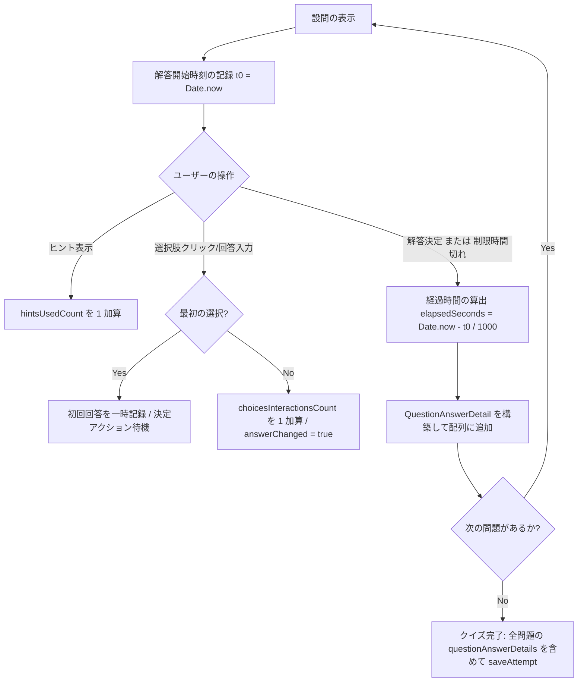
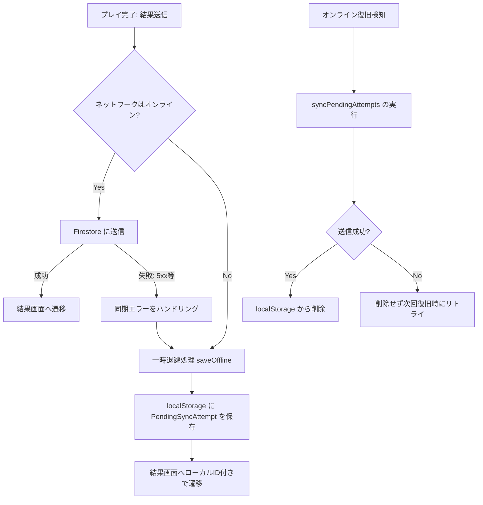

# Design Document: quizeum-analytics-bigquery

## Overview
### 目的
本機能は、将来的な企業やAI企業向けのクイズプレイ統計、解答、およびユーザーの統計データの提供を見据え、クイズプレイ時の回答結果詳細（各設問ごとの解答時間、正誤、ヒント使用履歴、選択順、回答変更の有無、記述回答内容など）をトラッキングして蓄積し、Firebase Extension (`firestore-bigquery-export`) を介してリアルタイムに BigQuery に同期する分析パイプラインおよびデータ構造を提供します。

### 対象ユーザーとワークフロー
- **プレイヤー (クイズ解答者)**: 通常通りクイズをプレイするだけで、裏側で解答行動（解答秒数、ヒント表示、回答変更等）が自動的に蓄積されます。
- **データアナリスト / AI企業**: BigQuery 上でアンネストされたフラットなビューを直接クエリし、設問ごとの解答傾向や学習プロセスの分析を行います。

---

## Boundary Commitments

### 本スペックの所有範囲
- **データモデル**: すべての問題形式に対応した解答詳細 `QuestionAnswerDetail` の型定義と `Attempt` への組み込み。
- **クライアント側トラッキング**: クイズプレイ画面における設問ごとのタイマー計測、ヒント使用監視、回答変更の検知、および詳細構造の組み立て。
- **サーバー側保存・検証**: API 経由でのウミガメスープ解答時 (`verify-truth`, `give-up-lateral`)、および通常クイズ保存時 (`saveAttempt`) における詳細解答情報の正当性検証およびアトミックな Firestore 保存。
- **オフライン同期**: オフラインプレイ完了時の `localStorage` への詳細データ一時退避およびオンライン復旧時のバッチ同期。
- **BigQuery スキーマ定義**: 同期先の BigQuery テーブルスキーマ（STRUCT / REPEATED 構造）の設計、およびアンネスト展開用の分析 SQL ビュー。
- **過去データエクスポート手順**: 既存の `attempts` 履歴データを BigQuery に一括レプリケーションするための移行手順の整備。

### 境界外の範囲
- **プロダクト分析行動ログ**: クイズプレイ中のボタンホバーやページ遷移などの行動イベント（これらは PostHog が管理するため、本 BigQuery パイプラインの対象外）。
- **ユーザー向け統計画面**: BigQuery から直接データを読み取って Next.js 画面にダッシュボードを表示する機能（クエリ負荷やAPIキー管理を考慮し、アプリケーション画面は引き続き Firestore を直接参照）。

### 許容される依存関係 (Allowed Dependencies)
- `quizeum-core` (Firestore スキーマ定義、`saveAttempt` トランザクション、オフライン同期)
- `quizeum-ui-quiz-lifecycle` (クイズプレイ進行UI、タイマー表示、解答ボタン操作)
- Firebase Extension `firestore-bigquery-export` (Firestore の書き込みイベント検知と BigQuery へのストリーミング同期)

### 再検証トリガー (Revalidation Triggers)
- `QuestionAnswerDetail` のプロパティ追加・削除、または型の変更（BigQuery スキーマの更新が必要になるため）。
- 新しいクイズ問題形式（`Question['type']`）の追加。
- プレイ開始・解答決定のトリガー関数のインターフェース変更。

---

## Architecture

Firestore から BigQuery への同期には Firebase Extension `firestore-bigquery-export` を利用します。アプリケーション側は Firestore の `attempts` コレクションに構造化されたドキュメントを保存するだけで、インフラ層が自動的に BigQuery の `attempts_raw` テーブルへ同期を行います。

### アーキテクチャ・データフロー図 (Mermaid)

```mermaid
sequence-diagram
    autonumber
    actor User as ユーザー (Client)
    participant Client as クイズプレイ画面 (Next.js)
    participant Core as Attempt サービス (Next.js API)
    database Firestore as Firestore (attempts コレクション)
    participant Ext as Firebase Extension
    database BigQuery as BigQuery (attempts_raw テーブル)

    User->>Client: クイズプレイ開始
    Client->>Client: 設問表示＆タイマー開始
    User->>Client: 回答クリック/変更/ヒント表示
    Client->>Client: アクションログを蓄積 (解答秒数、変更数、ヒント使用)
    User->>Client: 最終回答決定 (またはクイズ完了)
    Client->>Core: 拡張された Attempt データ (questionAnswerDetails 付) を送信
    Core->>Core: チート防止の二重検証 (問題数、正解数、不正問題IDのチェック)
    Core->>Firestore: トランザクション内で Attempt 保存 & プレイ数加算
    Firestore-->>Ext: 書き込みイベント検知 (Trigger)
    Ext->>BigQuery: リアルタイムにストリーミングインサート (attempts_raw)
    Note over BigQuery: SQLビューで LEFT JOIN UNNEST し、<br/>設問ごとのフラットな統計レコードに変換して分析
```

### 技術スタック

| レイヤー | 技術 / バージョン | 本機能における役割 | 備考 |
|---|---|---|---|
| Frontend | React 19 / Next.js 16 | 解答時間・ヒント表示・回答変更のトラッキング、オフラインセッション保存 | `usePlayState` フックを拡張 |
| Backend | Next.js API Routes | `saveAttempt` サービス、およびウミガメスープAPI (`verify-truth`, `give-up-lateral`) での解答詳細の検証・構築・保存 | Firestore トランザクション処理 |
| Database | Cloud Firestore | 解答詳細配列 `questionAnswerDetails` を含む `attempts` レコードの永続化 | スキーマ拡張 |
| Sync Engine | Firebase Extension | `attempts` の追加・変更を検知し BigQuery へストリーミング転送 | `firestore-bigquery-export` |
| Data Warehouse | Google Cloud BigQuery | 蓄積されたクイズプレイデータの保存、アンネストビュー経由でのデータ分析 | STRUCT / REPEATED 構造 |

---

## File Structure Plan

### 新規ファイル (New Files)
- `.kiro/specs/quizeum-analytics-bigquery/bigquery-schema.json` — BigQuery 同期先テーブルの `questionAnswerDetails` カラム用スキーマ定義 (STRUCT/REPEATED)。
- `.kiro/specs/quizeum-analytics-bigquery/bigquery-views.sql` — `attempts_raw` から `questionAnswerDetails` を UNNEST 展開してフラットな行にする分析用ビューの SQL。
- `scripts/bq-import-guide.md` — 既存の Firestore 内 `attempts` 履歴データを BigQuery に一括移行するためのインポートコマンド・実行手順書。

### 変更ファイル (Modified Files)
- `src/types/index.ts` — `Attempt` インターフェースの拡張、および `QuestionAnswerDetail` 型定義の追加。
- `src/services/attempt-session.ts` — `PlayProgressData` および `PendingSyncAttempt` 型に `questionAnswerDetails` を追加し、シリアライズ対象に含める。
- `src/services/attempt.ts` — `saveAttempt` において `questionAnswerDetails` を受け取り、計算上の正誤数や問題IDが正しいか検証するロジックの追加。
- `src/hooks/usePlayState.ts` — 設問ごとの解答開始時間・経過時間・回答変更有無・ヒント表示数をトラッキングし、`QuestionAnswerDetail[]` 配列を組み立てるステート管理ロジックの追加。
- `src/app/quiz/[id]/play/quiz-play-client.tsx` — プレイ完了時の `buildAttemptData` で詳細データを構築し、`saveAttempt` やオフラインセッションに渡すよう接続。
- `src/app/api/attempt/verify-truth/route.ts` — ウミガメスープ合格時に `QuestionAnswerDetail` オブジェクトを作成し、`questionAnswerDetails` 配列フィールドを Firestore に書き込む処理を追加。
- `src/app/api/attempt/give-up-lateral/route.ts` — ウミガメスープギブアップ時に `QuestionAnswerDetail` オブジェクトを作成し、`questionAnswerDetails` 配列フィールドを Firestore に書き込む処理を追加。

---

## System Flows

### クイズプレイ中の詳細解答情報トラッキングフロー



---

## Requirements Traceability

| 要件 ID | 要件概要 | 該当ファイル / コンポーネント | 実現内容 |
|---|---|---|---|
| **1.1** | 問題解答詳細データのトラッキング開始 | `usePlayState.ts` | 設問表示時の `t0` タイムスタンプ記録、およびタイマー処理。 |
| **1.2** | 解答決定時の秒数測定と記録 | `usePlayState.ts` | `recordAnswer` トリガー時の `elapsedSeconds` 計算。 |
| **1.3** | ヒント表示数のカウント | `usePlayState.ts`, `quiz-play-client.tsx` | ヒント閲覧アクションと連動した `hintsUsedCount` の加算。 |
| **1.4** | 回答変更有無の検知 | `usePlayState.ts` | 選択肢再クリックをカウントし、`answerChanged` を更新。 |
| **1.5** | クイズ完了時の詳細一括保存 | `attempt.ts`, `quiz-play-client.tsx` | `saveAttempt` 呼び出し時に `questionAnswerDetails` 配列をペイロードに組み込み、サーバー側で二重検証した上でアトミックに保存。 |
| **2.1** | 真偽値・選択式の詳細ログ収集 | `usePlayState.ts` | `selectedChoiceId`, `choicesOrder`, `choicesInteractionsCount` の記録。 |
| **2.2** | 記述・短答・連想・早押しの回答内容保存 | `usePlayState.ts` | `userAnswer` にユーザーのテキスト回答を格納。 |
| **2.3** | 早押しクイズの秒数計測 | `usePlayState.ts`, `quiz-play-client.tsx` | ストリーミング表示開始から早押しボタン押下までの `quickPressSeconds` の記録。 |
| **2.4** | 並び替えクイズの並び順記録 | `usePlayState.ts` | 初期表示シャッフル順 (`initialItemOrder`) と決定順 (`finalItemOrder`) の記録。 |
| **2.5** | 水平思考クイズの詳細ログ収集 | `verify-truth/route.ts`, `give-up-lateral/route.ts` | AI判定API側で `aiTurnCount`, `truthSummary`, `lateralPlayEndedStatus` を含む解答詳細を生成し、合格・リタイア時の attempt ドキュメントに保存。 |
| **3.1** | オフライン時のローカル保存 | `attempt-session.ts`, `quiz-play-client.tsx` | `PlayProgressData` および `PendingSyncAttempt` に `questionAnswerDetails` を含め、`localStorage` にシリアライズ保存。 |
| **3.2** | オンライン復旧時の自動同期 | `attempt.ts` | `syncPendingAttempts` 内で拡張された attempt データを Firestore に送信。 |
| **3.3** | 同期失敗時のロールバック保護 | `attempt-session.ts`, `attempt.ts` | 同期失敗時は `localStorage` の未同期リストから削除せず保護を維持。 |
| **4.1** | BigQuery へのリアルタイム転送 | Firebase Extension | Firestore の `attempts` の作成・更新時に BigQuery へのストリーミングをトリガー。 |
| **4.2** | 配列型 (REPEATED) スキーマ | `bigquery-schema.json` | BigQuery 側に `questionAnswerDetails` を STRUCT 配列型として定義。 |
| **4.3** | アンネストビューの提供 | `bigquery-views.sql` | `LEFT JOIN UNNEST` クエリを用いたフラット展開ビューの提供。 |

---

## Components and Interfaces

### データ型定義

[src/types/index.ts](file:///d:/quizeum/src/types/index.ts) に追加する型契約定義です。

```typescript
/**
 * 問題ごとの詳細な解答行動データ（すべての問題形式に対応）
 */
export interface QuestionAnswerDetail {
  questionId: string;
  questionType: 'true-false' | 'multiple-choice' | 'text-input' | 'quick-press' | 'sorting' | 'association' | 'lateral-thinking';
  isCorrect: boolean;
  elapsedSeconds: number;                // この問題の解答にかかった時間（秒、小数点を含む）
  hintsUsedCount: number;                // 使用したヒント数

  // 1. 選択式・真偽値クイズ用 (multiple-choice, true-false)
  selectedChoiceId?: string | null;      // 選択した選択肢ID
  choicesOrder?: string[] | null;        // 提示された選択肢IDのシャッフル順
  choicesInteractionsCount?: number;     // 決定までに選択肢をクリック・変更した回数

  // 2. 記述式・短答・早押しクイズ用 (text-input, quick-press, association)
  userAnswer?: string | null;            // 入力された回答文字列（記述・短答・連想用）
  quickPressSeconds?: number | null;     // 早押しボタンを押すまでの経過時間

  // 3. 並び替えクイズ用 (sorting)
  initialItemOrder?: string[] | null;    // 提示時の初期アイテム順
  finalItemOrder?: string[] | null;      // ユーザーが決定した最終アイテム順

  // 4. 水平思考クイズ用 (lateral-thinking)
  aiTurnCount?: number | null;           // 質問ターン数
  truthSummary?: string | null;          // 真相解答の最終テキスト
  lateralPlayEndedStatus?: 'passed' | 'gave_up' | null; // 合格/リタイアのステータス
}

// Attempt インターフェースの拡張
export interface Attempt {
  // ...既存のフィールド...
  questionAnswerDetails?: QuestionAnswerDetail[]; // 新規追加
}
```

### サービスとAPIのインターフェース変更

#### `usePlayState` の戻り値の拡張
設問ごとに詳細データを記録するため、内部的に `questionAnswerDetails` 状態を蓄積し、クライアントに提供します。
```typescript
export function usePlayState(props: UsePlayStateProps) {
  // 内部状態
  const [questionAnswerDetails, setQuestionAnswerDetails] = useState<QuestionAnswerDetail[]>([]);
  // ...
  return {
    // ...既存の戻り値...
    questionAnswerDetails, // 新規追加
  };
}
```

#### `saveAttempt` のバリデーション
`saveAttempt` ([src/services/attempt.ts](file:///d:/quizeum/src/services/attempt.ts)) 内で、クライアントから送信された `questionAnswerDetails` が以下の条件を満たすかチェックするサーバーサイド二重検証を実装します。
- `questionAnswerDetails` の配列長が、実際のクイズ問題数（`totalQuestions`）と一致すること。
- 各詳細データの `isCorrect` の合計数が、送信された `score` と一致すること。
- 不正な `questionId` が含まれていないこと。

---

## Error Handling

### 例外フローとエラーハンドリング (Mermaid)



---

## Testing Strategy

### 1. 単体テスト (Unit Tests)
- **`usePlayState` タイマー計測テスト**
  - 問題が表示されてから `recordAnswer` を実行するまでの時間が、ミリ秒精度で `elapsedSeconds` に正しく算出されるかをテスト。
- **設問形式別の詳細データ構造テスト**
  - 選択式、記述式、並べ替えなど、各形式に応じた `QuestionAnswerDetail` オブジェクトが要件通り組み立てられるかをアサーション。
- **`saveAttempt` バリデーションテスト**
  - 送信された `questionAnswerDetails` の問題数や正解数が、DB上のクイズおよび送信スコアと不整合である場合に、期待通りトランザクションエラーがスローされるかを検証。

### 2. E2Eテスト (E2E/UI Tests)
- **クイズプレイからBigQuery同期検証**
  - 通常プレイを完了し、Firestore の `attempts` に `questionAnswerDetails` が期待通りの構造で保存されているかを確認。
  - テスト環境の Firebase エミュレータを介して、オフライン状態での `localStorage` 保存およびオンライン復帰後のバッチ同期が機能し、最終的にデータが欠損なく送信されるかを検証。
