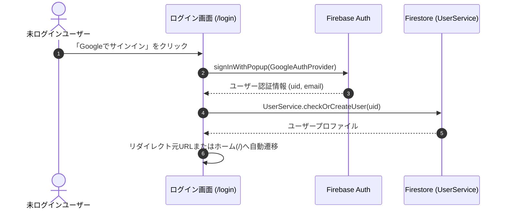
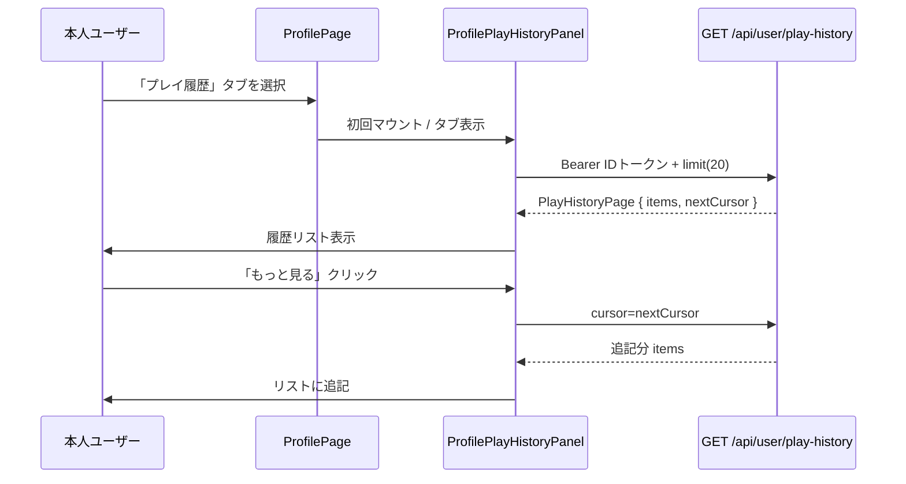

# Technical Design Document: quizeum-auth-profile-ui

## Overview
本ドキュメントは、クイズ投稿SNS「quizeum」におけるユーザー認証・プロフィール関連UIの技術設計仕様を定義します。ユーザー認証の入り口、個人プロフィールの閲覧・編集、ソーシャルフォロー連携、リアクション履歴、およびアクティビティ通知一覧を含む、アプリケーション全体の基本構造となる画面群を構築します。

本システムは、Next.jsのApp RouterおよびReact、TypeScriptのフロントエンド構成に加え、CSS Modulesによる親しみやすく洗練されたデザインシステムを実装し、Firebase AuthおよびFirestore上の `UserService` とのインターフェース接続を行います。

**Phase 5（2026-06）**: 本人プロフィールのコンテンツタブに「プレイ履歴」を追加し、`GET /api/user/play-history` の結果を一覧・ページング表示する（APIは `quizeum-core` 実装済み）。

### Goals
- 画面群の基礎となるデザインシステム（カジュアルモダンなUI）トークンおよびレイアウトの維持。
- ソーシャルサインイン（Google / X / Microsoft）とセッションに基づくリダイレクト。
- プロフィール画面でのアバター、バッジ、評価、投稿クイズ／リスト／**本人のみプレイ履歴**のタブ切替表示。
- 退会処理中（`delete_pending`）の404フォールバック。
- **Phase 5**: プレイ履歴専用タブ、カーソルページング、クイズ詳細へのリンク、E2E `data-testid` 契約。

### Non-Goals
- クイズプレイ・作成・モデレーション画面（各専用スペック）。
- `attempts` 永続化・プレイ履歴API・`test-play` 除外ロジック（`quizeum-core`）。
- 他ユーザープロフィールからのプレイ履歴閲覧。

---

## Boundary Commitments

### This Spec Owns
- **UIルーティング設計**: `/login`, `/profile/[uid]`, `/profile/edit`, `/profile/[uid]/connections`, `/notifications`, `/profile/[uid]/likes` の各ページコンポーネント。
- **デザインシステム**: `globals.css` および共通テーマ。
- **認証連携と状態監視**: `useAuth` によるセッションとリダイレクト。
- **クライアント側権限保護**: `delete_pending` 閲覧時の404。
- **Phase 5**: `ProfilePlayHistoryPanel` — 本人プロフィール第3タブ「プレイ履歴」の取得・表示・追加読み込み。

### Out of Boundary
- Firestoreセキュリティルール、バッジ自動付与サーバー処理。
- プレイ履歴のクエリ実装・`PlayHistoryPage` 生成（`quizeum-core` / `GET /api/user/play-history`）。

### Allowed Dependencies
- **`quizeum-core`**: `UserService`, `AuthContext`, **`PlayHistoryPage` / `PlayHistoryEntry` 型（`@/types`）**
- **`GET /api/user/play-history`**: Bearer ID トークン（`auth.currentUser.getIdToken()`）
- **`lucide-react`**

### Revalidation Triggers
- `UserService` / Firebase Auth インターフェース変更。
- `PlayHistoryPage` レスポンス形状またはカーソル形式の変更。

---

## Architecture

### Existing Architecture Analysis
認証・プロフィール・通知・接続・リアクション履歴の各画面は実装済み。プロフィールのコンテンツタブは `quizzes` / `lists` の2種のみ。Phase 5 では `isMyProfile` 時に `history` タブと子パネルを追加し、API呼び出しは既存の `deleteUserAccount` と同様の Bearer パターンに揃える。

### Technology Stack
- **Frontend**: Next.js v16.2.6 (App Router), React v19.2.4, TypeScript
- **Styling**: Vanilla CSS (CSS Modules)
- **Icons**: `lucide-react`

---

## File Structure Plan

### Directory Structure
```
src/
├── app/
│   ├── globals.css                # 共通CSSトークン定義（硬すぎない親しみやすいフォント・角丸・配色）
│   ├── layout.tsx                 # 共通レイアウト（Headerを包含）
│   ├── login/
│   │   ├── page.tsx               # 認証画面 (1.1, 1.2, 1.3)
│   │   └── login.module.css
│   ├── profile/
│   │   ├── edit/
│   │   │   ├── page.tsx           # プロフィール編集画面 (3.1, 3.2, 3.3)
│   │   │   └── edit.module.css
│   │   └── [uid]/
│   │       ├── connections/
│   │       │   ├── page.tsx       # フォロー/フォロワー一覧画面 (4.1, 4.2)
│   │       │   └── connections.module.css
│   │       ├── likes/
│   │       │   ├── page.tsx       # リアクション履歴画面 (6.1, 6.2)
│   │       │   └── likes.module.css
│   │       ├── page.tsx           # プロフィール画面 (2.x, 7.x)
│   │       └── profile.module.css
│   └── notifications/
│       ├── page.tsx               # 通知一覧 (5.x)
│       └── notifications.module.css
├── components/
│   ├── layout/
│   │   ├── header.tsx
│   │   └── header.module.css
│   └── profile/
│       ├── profile-play-history-panel.tsx   # プレイ履歴タブ (7.x) 【Phase 5】
│       └── profile-play-history-panel.module.css
└── lib/
    └── play-history-client.ts     # API fetch + モードラベル
```

### Modified Files（Phase 5）
- `src/app/profile/[uid]/page.tsx` — `activeTab` に `'history'` を追加（本人のみタブボタン表示）、`ProfilePlayHistoryPanel` をタブパネルに配置。
- `src/app/profile/[uid]/profile.module.css` — 履歴リスト行スタイル（必要に応じてパネルCSSへ移管）。

### Modified Files（既存）
- `src/app/globals.css` — 共通トークン。
- `src/app/login/page.tsx` — マルチプロバイダ認証・リダイレクト。

---

## System Flows

### 認証・ログインリダイレクトフロー


### 本人プレイ履歴タブ表示フロー（Phase 5）


---

## Requirements Traceability

| Requirement | Summary | Components | Interfaces | Flows |
|-------------|---------|------------|------------|-------|
| 1.1 | Google OAuthログイン | `/login` Page | Firebase Auth | 認証フロー |
| 1.2 | ログイン成功時のリダイレクト | `/login` Page | `useAuth`, `useRouter` | 認証フロー |
| 1.3 | ログイン済みのログイン画面アクセス回避 | `/login` Page | `useAuth` | - |
| 2.1 | プロフィール基本情報・バッジ表示 | `/profile/[uid]` Page | `UserService` | - |
| 2.2 | 作成クイズ・リストのタブ表示 | `/profile/[uid]` Page | `UserService`, Tab UI | - |
| 2.3 | 他人のプロフィールのフォローボタン | `/profile/[uid]` Page | `UserService` | - |
| 2.4 | フォロー・フォロー解除のインタラクション | `/profile/[uid]` Page | `UserService.followUser` | - |
| 2.5 | 退会処理中アカウントへのアクセス制御 | `/profile/[uid]` Page | `UserService` (deleteStatus) | - |
| 3.1 | プロフィール編集入力フォーム | `/profile/edit` Page | Input Form | - |
| 3.2 | 表示名30字・自己紹介200字制限 | `/profile/edit` Page | Form Validation (Zod) | - |
| 3.3 | 編集保存とプロフィール画面への遷移 | `/profile/edit` Page | `UserService.updateProfile` | - |
| 4.1 | フォロー・フォロワーのタブ表示 | `/profile/[uid]/connections` Page | Tab UI | - |
| 4.2 | フォローカードとダイレクトトグル | `/profile/[uid]/connections` Page | UserCard, `UserService` | - |
| 5.1 | 通知の時系列一覧表示 | `/notifications` Page | Notification List | - |
| 5.2 | 指摘完了通知クリックによる遷移 | `/notifications` Page | Click-to-QuizDetail | - |
| 6.1 | 送受信リアクションのタブ表示 | `/profile/[uid]/likes` Page | Tab UI | - |
| 6.2 | リアクションカードと遷移 | `/profile/[uid]/likes` Page | LikeCard | - |
| 7.1 | 本人のみ「プレイ履歴」専用タブ | `ProfilePage`, `ProfilePlayHistoryPanel` | Tab `history` | プレイ履歴フロー |
| 7.2 | Bearer で履歴取得 | `play-history-client` | `GET /api/user/play-history` | プレイ履歴フロー |
| 7.3 | 行: タイトルリンク・スコア・モード・日時・時間 | `ProfilePlayHistoryPanel` | `getAttemptModeLabel` | - |
| 7.4 | 空状態 | `ProfilePlayHistoryPanel` | - | - |
| 7.5 | `nextCursor` で追記読み込み | `ProfilePlayHistoryPanel` | Load more | プレイ履歴フロー |
| 7.6 | 401/403/500 のエラーUI | `ProfilePlayHistoryPanel` | - | - |
| 7.7 | E2E testid | `ProfilePlayHistoryPanel` | data-testid | - |
| 7.8 | 永続化ロジックなし | — | Out of boundary | - |

---

## Components and Interfaces

### Component Summary Table

| Component | Domain/Layer | Intent | Req Coverage | Key Dependencies | Contracts |
|-----------|--------------|--------|--------------|------------------|-----------|
| `LoginPage` | UI / Page | 認証の開始とリダイレクト制御 | 1.1, 1.2, 1.3 | `useAuth`, Firebase Auth | State |
| `ProfilePage` | UI / Page | プロフィール閲覧、3タブ（本人時）、フォロー、退会チェック | 2.1–2.6, 7.1 | `UserService`, `useAuth` | State |
| `ProfilePlayHistoryPanel` | UI / Component | プレイ履歴専用タブの一覧・ページング | 7.2–7.7 | `play-history-client` (P0) | State, API |
| `ProfileEditPage` | UI / Page | プロフィール表示名・自己紹介の編集・バリデーション | 3.1, 3.2, 3.3 | `UserService`, Zod Schema | FormState |
| `ConnectionsPage` | UI / Page | フォロー/フォロワーのタブ切替一覧と直接フォロー制御 | 4.1, 4.2 | `UserService` | State |
| `NotificationsPage` | UI / Page | アクティビティ通知一覧の表示と詳細遷移 | 5.1, 5.2 | `NotificationService` | State |
| `LikesPage` | UI / Page | リアクション送信・獲得履歴のタブ表示と遷移 | 6.1, 6.2 | `ReactionService` | State |
| `Header` | UI / Layout | グローバルナビゲーションおよびログインアバターの表示 | - | `useAuth` | State |

#### `ProfilePlayHistoryPanel`（Phase 5）

| Field | Detail |
|-------|--------|
| Intent | 本人プロフィールの「プレイ履歴」タブ内で API 結果を表示する |
| Requirements | 7.1, 7.2, 7.3, 7.4, 7.5, 7.6, 7.7, 7.8 |

**Responsibilities & Constraints**
- 親 `ProfilePage` から `isActive: boolean`（またはタブが `history` のときのみマウント）を受け取り、**初回アクティブ時**にのみ初回フェッチ（不要なAPI呼び出しを避ける）。
- リストは `PlayHistoryEntry[]` をローカル state に保持し、「もっと見る」で `append`。
- クイズタイトルは `/quiz/{quizId}` への `Link`。副CTAとして「もう一度プレイ」は同一リンクでよい（詳細からプレイ開始）。

**Contracts**: API [x], State [x]

##### Client API（`play-history-client.ts`）
```typescript
export function getAttemptModeLabel(mode: PlayHistoryEntry['mode']): string;

export async function fetchPlayHistoryPage(params: {
  cursor?: string | null;
  limit?: number;
}): Promise<PlayHistoryPage>;
```
- `fetchPlayHistoryPage`: `auth.currentUser?.getIdToken()` → `Authorization: Bearer`。`cursor` / `limit` をクエリに付与。401/403/500 は throw または `Result` で Panel がメッセージ表示。
- JSON の `completedAt` は `new Date(...)` に変換して表示。

##### タブ統合（`ProfilePage`）
```typescript
type ProfileContentTab = 'quizzes' | 'lists' | 'history';
```
- `isMyProfile === false` のとき `history` タブボタンは非表示。`activeTab === 'history'` になり得ないようガード。
- タブボタン: `data-testid="profile-tab-history"`（E2E用、要件7と併用可）。

##### `data-testid` 契約
| 要素 | test id |
|------|---------|
| パネル全体 | `play-history-section` |
| 各行 | `play-history-entry` |
| もっと見る | `play-history-load-more` |

**Implementation Notes**
- ローディング: 初回・追加読み込み中はスピナーまたはスケルトン。
- 空状態文言: 「まだプレイ履歴がありません」
- エラー401: ログインへ誘導リンク。403/500: 再試行ボタン。

---

## Data Models
本UIコンポーネント群は、`quizeum-core` で定義されたFirestoreドキュメントスキーマ（`User`, `Badge`, `Follow`, `Notification`, `Reaction` 等）と結合します。

### UI固有の型定義
```typescript
// プロフィール編集フォームの入力型
export interface ProfileEditFormInput {
  displayName: string;
  bio: string;
}
```

---

## Error Handling

### Error Strategy
- **認証エラー (Google Pop-up)**:
  - ユーザーがポップアップを閉じた、ブロックされた等のケースに対し、親しみやすい日本語メッセージ（例：「Googleログインがキャンセルされました。もう一度お試しください。」）を画面上にアラート表示します。
- **バリデーションエラー**:
  - プロフィール編集時、入力値が制限文字数（表示名30字、自己紹介200字）を超えた場合、送信ボタンを非活性化し、テキストの下に赤い警告メッセージをインライン表示します。
- **404フォールバック**:
  - `deleteStatus` が `'delete_pending'` のプロフィールにアクセスした場合、Next.js の `notFound()` をトリガーして即座に親切な404画面へと誘導します。

---

## Testing Strategy

### Unit Tests
- **編集入力長バリデーション**:
  - 表示名30文字、自己紹介200文字のバリデーションが入力時に即座に機能し、ボタン制御が行われるかを単体テスト。

### Integration Tests
- **ログイン状態遷移**:
  - `useAuth` のセッションが確立された時点で、ログイン画面からホーム画面へ、未ログイン時は保護ページからログイン画面へ、それぞれリダイレクトが動作することをテスト。

### E2E/UI Tests
- **プロフィールのタブ切り替え**:
  - 「作成したクイズ」「作成したリスト」タブの切替。
- **プレイ履歴専用タブ（Phase 5）**:
  - 本人プロフィールで `profile-tab-history` / `play-history-section` が表示されること。
  - 履歴ありで `play-history-entry` が存在し、タイトルクリックで `/quiz/[id]` へ遷移できること。
  - `play-history-load-more` で追記読み込み（`nextCursor` がある場合）。
  - 他人プロフィールではプレイ履歴タブが存在しないこと。
