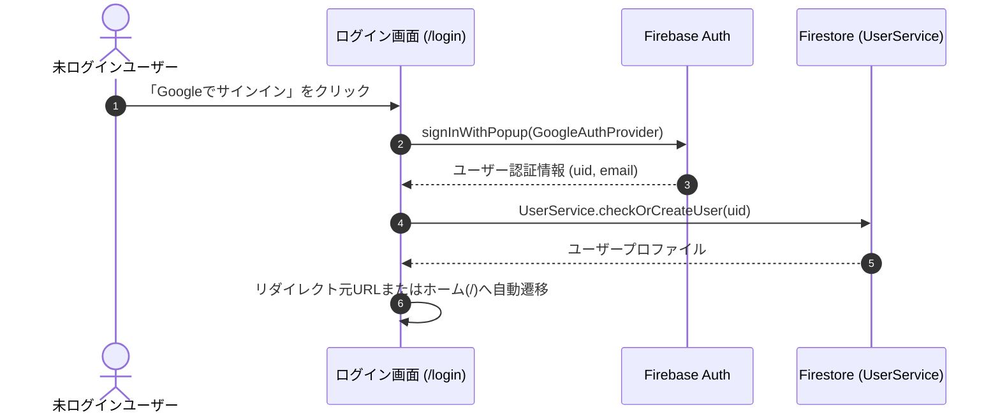
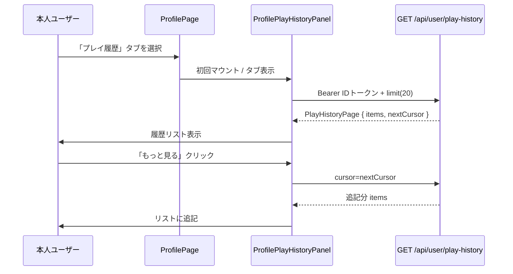
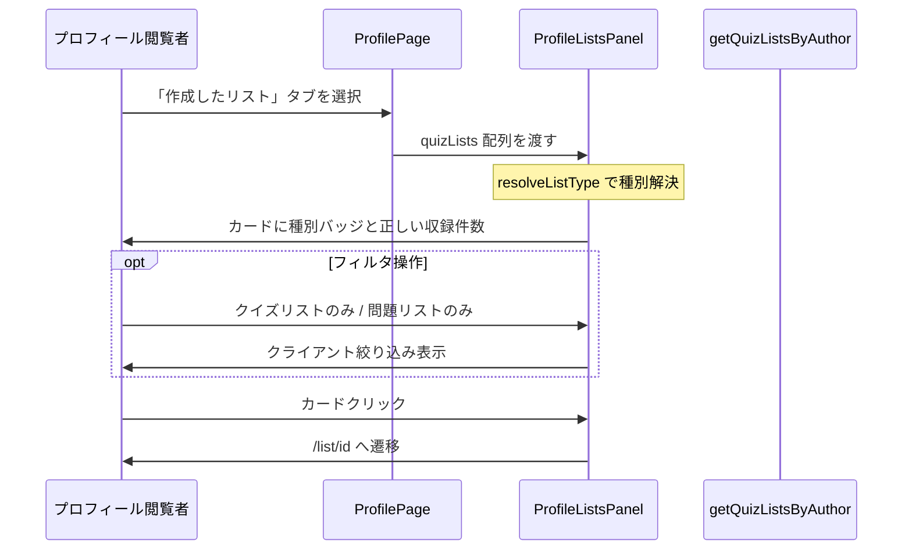
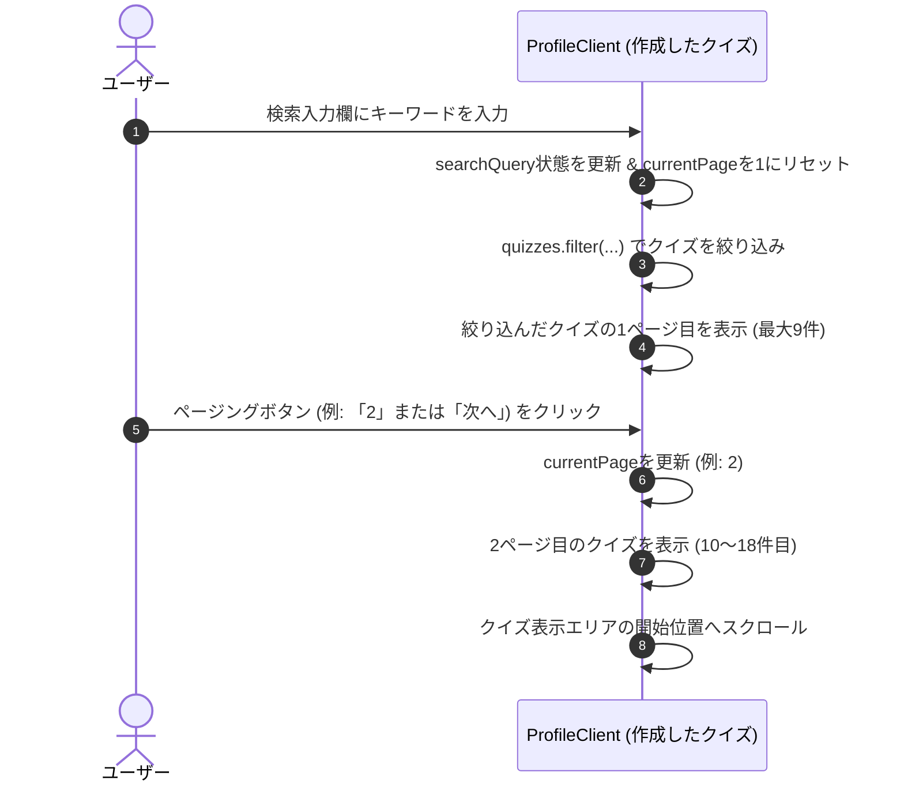

# Technical Design Document: quizetika-auth-profile-ui

## Overview
本ドキュメントは、クイズ投稿SNS「quizetika」におけるユーザー認証・プロフィール関連UIの技術設計仕様を定義します。ユーザー認証の入り口、個人プロフィールの閲覧・編集、ソーシャルフォロー連携、およびアクティビティ通知一覧を含む、アプリケーション全体の基本構造となる画面群を構築します。

**Phase 23（2026-06-09）**: 廃止方向のリアクション機能に伴い、本人プロフィールから「リアクション履歴」UI 導線を削除する。`/profile/[uid]/likes` ルートはレガシーとして存続し、直接 URL アクセス時のみ `LikesPage` が応答する（新規導線の追加・画面改修は行わない）。

本システムは、Next.jsのApp RouterおよびReact、TypeScriptのフロントエンド構成に加え、CSS Modulesによる親しみやすく洗練されたデザインシステムを実装し、Firebase AuthおよびFirestore上の `UserService` とのインターフェース接続を行います。

**Phase 5（2026-06）**: 本人プロフィールのコンテンツタブに「プレイ履歴」を追加し、`GET /api/user/play-history` の結果を一覧・ページング表示する（APIは `quizetika-core` 実装済み）。

**Phase 8（2026-06）**: プロフィール「作成したリスト」タブで、クイズリストと問題リスト（`listType`）を種別ラベル・正しい収録件数で区別表示する（`listType` 永続化・取得は `quizetika-core` / `quizetika-creator-dash-ui` 実装済み）。

### Goals
- 画面群の基礎となるデザインシステム（カジュアルモダンなUI）トークンおよびレイアウトの維持。
- ソーシャルサインイン（Google / X / Microsoft）とセッションに基づくリダイレクト。
- プロフィール画面でのアバター, バッジ, 評価, 投稿クイズ／リスト／**本人のみプレイ履歴**のタブ切替表示。
- 退会処理中（`delete_pending`）の404フォールバック。
- **Phase 5**: プレイ履歴専用タブ、カーソルページング、クイズ詳細へのリンク、E2E `data-testid` 契約。
- **Phase 8**: リストカードの `listType` バッジ、種別に応じた収録件数、任意フィルタ、E2E `data-testid` 契約。
- **Phase 23**: 本人プロフィール `profileActions` からリアクション履歴リンク（Heart アイコン付き）の削除。編集・弱点克服等の現行有効導線は維持。
- **Phase 27**: 「作成したクイズ」タブ内でのキーワード検索とページングUI（1ページあたり9件）、共通クイズカード `QuizCard` の適用とブックマーク状態解決およびトグル機能。
- **Phase 28**: 好きなジャンルの複数選択・保存UI（編集画面）およびアイコン画像付きジャンルチップ表示（詳細画面）。

### Non-Goals
- クイズプレイ・作成・モデレーション画面（各専用スペック）。
- `attempts` 永続化・プレイ履歴API・`test-play` 除外ロジック（`quizetika-core`）。
- 他ユーザープロフィールからのプレイ履歴閲覧。
- **Phase 8**: リスト作成・編集・`listType` 選択 UI（`quizetika-creator-dash-ui`）。ブックマーク3タブ・問題リストプレイ（`quizetika-play-flow-ui`）。
- **Phase 23**: `/profile/[uid]/likes` ルートの削除・404化、`LikesClient` / `ReactionService` の改修、リアクションデータのマイグレーション、E2E F-407 の削除本体（直接実装候補 `remove-reaction-history-e2e` が担当。本スペックは導線削除とテスト方針の整合のみ）。

---

## Boundary Commitments

### This Spec Owns
- **UIルーティング設計**: `/login`, `/profile/[uid]`, `/profile/edit`, `/profile/[uid]/connections`, `/notifications`, `/profile/[uid]/likes` の各ページコンポーネント。
- **デザインシステム**: `globals.css` および共通テーマ。
- **認証連携と状態監視**: `useAuth` によるセッションとリダイレクト。
- **クライアント側権限保護**: `delete_pending` 閲覧時の404。
- **Phase 5**: `ProfilePlayHistoryPanel` — 本人プロフィール第3タブ「プレイ履歴」の取得・表示・追加読み込み。
- **Phase 8**: `ProfileListsPanel` / `ProfileListCard` — 「作成したリスト」タブの `listType` 表示・件数・任意フィルタ・詳細遷移。
- **Phase 23**: `ProfileClient` — 本人 `profileActions` からリアクション履歴導線の削除（`/profile/[uid]/likes` ルート本体はレガシー存続）。
- **Phase 27**: `ProfileClient` — 「作成したクイズ」タブ内でのクライアントサイド検索・ページング状態管理およびUI描画、共通 `QuizCard` のアタッチとブックマーク状態のトグル・遷移処理。
- **Phase 28**: `ProfileEditClient` における好きなジャンル（`followedGenres`）の複数選択および保存、`ProfileClient` における好きなジャンルチップ（マスタ解決後の表示名・アイコン）の表示。

### Out of Boundary
- Firestoreセキュリティルール、バッジ自動付与サーバー処理。
- プレイ履歴のクエリ実装・`PlayHistoryPage` 生成（`quizetika-core` / `GET /api/user/play-history`）。
- **Phase 8**: `listType` の付与・リスト CRUD・問題リスト編集 UI（`quizetika-creator-dash-ui`）。リスト詳細の `listType` 分岐表示本体（`quizetika-play-flow-ui` の `/list/[id]` — 本スペックはプロフィールカードからの遷移のみ）。

### Allowed Dependencies
- **`quizetika-core`**: `UserService`, `AuthContext`, **`PlayHistoryPage` / `PlayHistoryEntry` 型（`@/types`）**
- **`GET /api/user/play-history`**: Bearer ID トークン（`auth.currentUser.getIdToken()`）
- **`@mui/icons-material`**
- **`metadata_genres`**: `useActiveGenres`（`@/hooks/useActiveGenres`）を呼び出し、ジャンルの表示名とアイコン画像を解決する。
- **Phase 8**: `getQuizListsByAuthor`（`@/services/quiz-list`）、`resolveListType`（`@/types`）。任意フィルタ時は既取得配列のクライアント絞り込みを優先（再フェッチは `options.listType` 利用可だが初版は不要）。

### Revalidation Triggers
- `UserService` / Firebase Auth インターフェース変更。
- `PlayHistoryPage` レスポンス形状またはカーソル形式の変更。
- **Phase 8**: `QuizList.listType` / `questionIds` スキーマ変更、`getQuizListsByAuthor` のフィルタ契約変更、`resolveListType` 後方互換規則の変更。

---

## Architecture

### Existing Architecture Analysis
認証・プロフィール・通知・接続・リアクション履歴の各画面は実装済み。プロフィールのコンテンツタブは `quizzes` / `lists` / 本人時 `history`。Phase 5 のプレイ履歴は実装済み。

**Phase 8 ギャップ（現状コード）**: `src/app/profile/[uid]/page.tsx` のリストタブは全カードで `list.quizIds.length` を「収録問題」として表示しており、問題リストで誤表示となる。`listType` バッジ・`data-testid` 未付与。`bookmark-list-grid.tsx` には既に `listType === 'question'` のラベル分岐があり、同パターンをプロフィール用に抽出する。

### Technology Stack
- **Frontend**: Next.js v16.2.6 (App Router), React v19.2.4, TypeScript
- **Styling**: Vanilla CSS (CSS Modules)
- **Icons**: `@mui/icons-material`

---

## File Structure Plan

### Directory Structure
```
src/
├── app/
│   ├── globals.css                # 共通CSSトークン定義（硬すぎない親しみやすいフォント・角丸・配色）
│   ├── layout.tsx                 # 共通レイアウト（Headerを包含）
│   ├── login/
│   │   ├── page.tsx               # 認証画面 (1.1, 1.2, 1.3)
│   │   └── login.module.css
│   ├── profile/
│   │   ├── edit/
│   │   │   ├── page.tsx           # プロフィール編集画面 (3.1, 3.2, 3.3)
│   │   │   └── edit.module.css
│   │   └── [uid]/
│   │       ├── connections/
│   │       │   ├── page.tsx       # フォロー/フォロワー一覧画面 (4.1, 4.2)
│   │       │   └── connections.module.css
│   │       ├── likes/
│   │       │   ├── page.tsx       # リアクション履歴画面 (6.1, 6.2)
│   │       │   └── likes.module.css
│   │       ├── page.tsx           # プロフィール画面 (2.x, 7.x)
│   │       └── profile.module.css
│   └── notifications/
│       ├── page.tsx               # 通知一覧 (5.x)
│       └── notifications.module.css
├── components/
│   ├── layout/
│   │   ├── header.tsx
│   │   └── header.module.css
│   └── profile/
│       ├── profile-play-history-panel.tsx   # プレイ履歴タブ (7.x) 【Phase 5】
│       ├── profile-play-history-panel.module.css
│       ├── profile-list-card.tsx            # リストカード1件 (8.x) 【Phase 8】
│       └── profile-lists-panel.tsx          # リストタブ本体・任意フィルタ (8.x) 【Phase 8】
└── lib/
    ├── play-history-client.ts     # API fetch + モードラベル
    └── profile-list-display.ts    # listType ラベル・収録件数純関数 (8.x) 【Phase 8】
```

### Modified Files（Phase 8）
- `src/app/profile/[uid]/page.tsx` — リストタブインライン描画を `ProfileListsPanel` に委譲。`getQuizListsByAuthor` 取得は現状維持。
- `src/app/profile/[uid]/profile.module.css` — 種別バッジ・フィルタチップ用スタイル（必要最小限）。

### Modified Files（Phase 5）
- `src/app/profile/[uid]/page.tsx` — `activeTab` に `'history'` を追加（本人のみタブボタン表示）、`ProfilePlayHistoryPanel` をタブパネルに配置。
- `src/app/profile/[uid]/profile.module.css` — 履歴リスト行スタイル（必要に応じてパネルCSSへ移管）。

### Modified Files（Phase 28）
- `src/app/profile/edit/profile-edit-client.tsx` — `useActiveGenres` を用いた好きなジャンル選択UI（複数選択可能、保存処理）の追加。
- `src/app/profile/[uid]/profile-client.tsx` — ユーザーの `followedGenres` に対し、マスタ解決を行って好きなジャンルをアイコン付きのチップで表示するUIの追加。

### Modified Files（既存）
- `src/app/globals.css` — 共通トークン。
- `src/app/login/page.tsx` — マルチプロバイダ認証・リダイレクト。

---

## System Flows

### 認証・ログインリダイレクトフロー


### 本人プレイ履歴タブ表示フロー（Phase 5）


### プロフィール作成リスト表示フロー（Phase 8）


---

## Requirements Traceability

| Requirement | Summary                                             | Components                                | Interfaces                              | Flows            |
| ----------- | --------------------------------------------------- | ----------------------------------------- | --------------------------------------- | ---------------- |
| 1.1         | Google OAuthログイン                                | `/login` Page                             | Firebase Auth                           | 認証フロー       |
| 1.2         | ログイン成功時のリダイレクト                        | `/login` Page                             | `useAuth`, `useRouter`                  | 認証フロー       |
| 1.3         | ログイン済みのログイン画面アクセス回避              | `/login` Page                             | `useAuth`                               | -                |
| 1.4         | Firebase 認証エラーの日本語表示                     | `/login` Page                             | Firebase Auth error mapping             | 認証フロー       |
| 1.5         | 開発・E2E 用簡易ログイン（本番非表示）              | `/login` Page                             | `NODE_ENV` / `NEXT_PUBLIC_ENV` ガード   | -                |
| 2.1         | プロフィール基本情報・バッジ表示                    | `/profile/[uid]` Page                     | `UserService`                           | -                |
| 2.2         | 作成クイズ・リストのタブ表示                        | `/profile/[uid]` Page                     | `UserService`, Tab UI                   | -                |
| 2.3         | 他人のプロフィールのフォローボタン                  | `/profile/[uid]` Page                     | `UserService`                           | -                |
| 2.4         | フォロー・フォロー解除のインタラクション            | `/profile/[uid]` Page                     | `UserService.followUser`                | -                |
| 2.5         | 退会処理中アカウントへのアクセス制御                | `/profile/[uid]` Page                     | `UserService` (deleteStatus)            | -                |
| 2.6         | 本人プロフィールのプレイ履歴表示領域                | `ProfilePage`, `ProfilePlayHistoryPanel`  | Tab `history`                           | プレイ履歴フロー |
| 2.7         | 本人プロフィールにリアクション履歴導線なし          | `ProfileClient`                           | `profileActions`（Phase 23）            | -                |
| 3.1         | プロフィール編集入力フォーム                        | `/profile/edit` Page                      | Input Form                              | -                |
| 3.2         | 表示名30字・自己紹介200字制限                       | `/profile/edit` Page                      | Form Validation (Zod)                   | -                |
| 3.3         | 編集保存とプロフィール画面への遷移                  | `/profile/edit` Page                      | `UserService.updateProfile`             | -                |
| 4.1         | フォロー・フォロワーのタブ表示                      | `/profile/[uid]/connections` Page         | Tab UI                                  | -                |
| 4.2         | フォローカードとダイレクトトグル                    | `/profile/[uid]/connections` Page         | UserCard, `UserService`                 | -                |
| 5.1         | 通知の時系列一覧表示                                | `/notifications` Page                     | Notification List                       | -                |
| 5.2         | 指摘完了通知クリックによる遷移                      | `/notifications` Page                     | Click-to-QuizDetail                     | -                |
| 6.1         | プロフィールから likes への新規導線なし（レガシー） | —                                         | 要件 10 優先（Phase 23）                | -                |
| 6.2         | likes ルート存続時の既存表示（改修任意・レガシー）  | `LikesPage`, `LikesClient`                | `ReactionService`（メンテナンス対象外） | -                |
| 7.1         | 本人のみ「プレイ履歴」専用タブ                      | `ProfilePage`, `ProfilePlayHistoryPanel`  | Tab `history`                           | プレイ履歴フロー |
| 7.2         | Bearer で履歴取得                                   | `play-history-client`                     | `GET /api/user/play-history`            | プレイ履歴フロー |
| 7.3         | 行: タイトルリンク・スコア・モード・日時・時間      | `ProfilePlayHistoryPanel`                 | `getAttemptModeLabel`                   | -                |
| 7.4         | 空状態                                              | `ProfilePlayHistoryPanel`                 | -                                       | -                |
| 7.5         | `nextCursor` で追記読み込み                         | `ProfilePlayHistoryPanel`                 | Load more                               | プレイ履歴フロー |
| 7.6         | 401/403/500 のエラーUI                              | `ProfilePlayHistoryPanel`                 | -                                       | -                |
| 7.7         | E2E testid                                          | `ProfilePlayHistoryPanel`                 | data-testid                             | -                |
| 7.8         | 永続化ロジックなし                                  | —                                         | Out of boundary                         | -                |
| 8.1         | 作成リスト全件カード表示                            | `ProfileListsPanel`                       | `getQuizListsByAuthor`                  | リスト表示フロー |
| 8.2         | listType 種別ラベル                                 | `ProfileListCard`, `profile-list-display` | `resolveListType`                       | -                |
| 8.3         | クイズリスト収録クイズ数                            | `profile-list-display`                    | `quizIds.length`                        | -                |
| 8.4         | 問題リスト収録問題数                                | `profile-list-display`                    | `questionIds.length`                    | -                |
| 8.5         | リスト詳細へ遷移                                    | `ProfileListCard`                         | Link `/list/[id]`                       | リスト表示フロー |
| 8.6         | 本人0件時の空状態と作成導線                         | `ProfileListsPanel`                       | `/list/create`                          | -                |
| 8.7         | 任意 listType フィルタ                              | `ProfileListsPanel`                       | クライアント filter                     | リスト表示フロー |
| 8.8         | listType CRUD なし                                  | —                                         | Out of boundary                         | -                |
| 8.9         | E2E testid                                          | `ProfileListCard`                         | data-testid                             | -                |
| 10.1        | 本人プロフィールにリアクション履歴導線なし          | `ProfileClient`                           | `profileActions`                        | -                |
| 10.2        | 編集・弱点克服等の現行有効導線のみ                  | `ProfileClient`                           | Link `/profile/edit`, 復習セクション    | -                |
| 10.3        | 他ユーザープロフィールに likes 導線なし             | `ProfileClient`                           | フォローボタンのみ（従来どおり）        | -                |
| 10.4        | `/profile/[uid]/likes` ルート即時削除不要           | —                                         | Out of boundary（レガシー存続）         | -                |
| 10.5        | リアクションデータ・送信 UI 削除は対象外            | —                                         | Out of boundary                         | -                |
| 10.6        | 導線用 testid を付与しない                          | `ProfileClient`                           | `profile-reaction-history-link` 禁止    | -                |
| 10.7        | E2E F-407 更新は直接実装候補と整合                  | —                                         | `remove-reaction-history-e2e`           | -                |
| 10.8        | 設定・Sidebar 導線は対象外                          | —                                         | `quizetika-user-settings-ui` 等         | -                |

---

## Components and Interfaces

### Component Summary Table

| Component                 | Domain/Layer   | Intent                                               | Req Coverage                 | Key Dependencies           | Contracts      |
| ------------------------- | -------------- | ---------------------------------------------------- | ---------------------------- | -------------------------- | -------------- |
| `LoginPage`               | UI / Page      | 認証の開始とリダイレクト制御                         | 1.1, 1.2, 1.3, 1.4, 1.5      | `useAuth`, Firebase Auth   | State          |
| `ProfileClient`           | UI / Client    | プロフィール閲覧 UI、本人アクション、タブ、フォロー  | 2.1–2.7, 7.1, 8.1, 10.1–10.3, 12.1–12.8, 13.1–13.5, 14.4–14.7 | `UserService`, `useAuth`, `useActiveGenres`, `QuizCard` | State |
| `ProfilePage`             | UI / Page      | プロフィール RSC シェル、Suspense 境界               | 9.9–9.11                     | `ProfileClient`            | Server         |
| `ProfileListsPanel`       | UI / Component | 作成リストタブの一覧・空状態・任意フィルタ           | 8.1, 8.6, 8.7                | `ProfileListCard`          | State          |
| `ProfileListCard`         | UI / Component | リスト1件のカード（種別・件数・リンク）              | 8.2–8.5, 8.9                 | `profile-list-display`     | Presentational |
| `ProfilePlayHistoryPanel` | UI / Component | プレイ履歴専用タブの一覧・ページング                 | 7.2–7.7                      | `play-history-client` (P0) | State, API     |
| `ProfileEditPage`         | UI / Page      | プロフィール表示名・自己紹介の編集・バリデーション   | 3.1, 3.2, 3.3, 14.1–14.3, 14.7 | `UserService`, Zod Schema  | FormState      |
| `ConnectionsPage`         | UI / Page      | フォロー/フォロワーのタブ切替一覧と直接フォロー制御  | 4.1, 4.2                     | `UserService`              | State          |
| `NotificationsPage`       | UI / Page      | アクティビティ通知一覧の表示と詳細遷移               | 5.1, 5.2                     | `NotificationService`      | State          |
| `LikesPage`               | UI / Page      | リアクション履歴（レガシー・直接 URL のみ）          | 6.2（メンテナンス対象外）    | `ReactionService`          | State          |
| `Header`                  | UI / Layout    | グローバルナビゲーションおよびログインアバターの表示 | -                            | `useAuth`                  | State          |

#### `ProfilePlayHistoryPanel`（Phase 5）

| Field        | Detail                                                      |
| ------------ | ----------------------------------------------------------- |
| Intent       | 本人プロフィールの「プレイ履歴」タブ内で API 結果を表示する |
| Requirements | 7.1, 7.2, 7.3, 7.4, 7.5, 7.6, 7.7, 7.8                      |

**Responsibilities & Constraints**
- 親 `ProfilePage` から `isActive: boolean`（またはタブが `history` のときのみマウント）を受け取り、**初回アクティブ時**にのみ初回フェッチ（不要なAPI呼び出しを避ける）。
- リストは `PlayHistoryEntry[]` をローカル state に保持し、「もっと見る」で `append`。
- クイズタイトルは `/quiz/{quizId}` への `Link`。副CTAとして「もう一度プレイ」は同一リンクでよい（詳細からプレイ開始）。

**Contracts**: API [x], State [x]

##### Client API（`play-history-client.ts`）
```typescript
export function getAttemptModeLabel(mode: PlayHistoryEntry['mode']): string;

export async function fetchPlayHistoryPage(params: {
  cursor?: string | null;
  limit?: number;
}): Promise<PlayHistoryPage>;
```
- `fetchPlayHistoryPage`: `auth.currentUser?.getIdToken()` → `Authorization: Bearer`。`cursor` / `limit` をクエリに付与。401/403/500 は throw または `Result` で Panel がメッセージ表示。
- JSON の `completedAt` は `new Date(...)` に変換して表示。

##### タブ統合（`ProfilePage`）
```typescript
type ProfileContentTab = 'quizzes' | 'lists' | 'history';
```
- `isMyProfile === false` のとき `history` タブボタンは非表示。`activeTab === 'history'` になり得ないようガード。
- タブボタン: `data-testid="profile-tab-history"`（E2E用、要件7と併用可）。

##### `data-testid` 契約
| 要素       | test id                  |
| ---------- | ------------------------ |
| パネル全体 | `play-history-section`   |
| 各行       | `play-history-entry`     |
| もっと見る | `play-history-load-more` |

**Implementation Notes**
- ローディング: 初回・追加読み込み中はスピナーまたはスケルトン。
- 空状態文言: 「まだプレイ履歴がありません」
- エラー401: ログインへ誘導リンク。403/500: 再試行ボタン。

#### `ProfileListCard` / `ProfileListsPanel`（Phase 8）

| Field        | Detail                                                                                 |
| ------------ | -------------------------------------------------------------------------------------- |
| Intent       | プロフィール「作成したリスト」タブで `listType` を視覚区別し、正しい収録件数を表示する |
| Requirements | 8.1, 8.2, 8.3, 8.4, 8.5, 8.6, 8.7, 8.8, 8.9                                            |

**Responsibilities & Constraints**
- 種別解決は常に `resolveListType(list)` を使用する（`listType` 未設定は `quiz`）。**`list.listType` の直参照は禁止**（`bookmark-list-grid.tsx` は `list.listType === 'question'` だが、レガシー未設定ドキュメントで誤判定し得るためプロフィール側はコピーしない）。
- `ProfileListCard` では `getProfileListTypeLabel(resolveListType(list))` のみでバッジ文言を決定する。
- 収録件数: `quiz` → `list.quizIds?.length ?? 0`（ラベル「収録クイズ: N 件」）。`question` → `list.questionIds?.length ?? 0`（ラベル「収録問題: N 件」）。問題リストで `quizIds` 件数を表示してはならない（8.4）。
- カード全体は `/list/[id]` への `Link`。クリック領域は既存 `quizCard` スタイルを踏襲。
- 本人プロフィールかつ0件: 既存空状態文言 + `/list/create` 導線を維持（8.6）。
- フィルタ（8.7・任意）: `ProfileListsPanel` 内に `all` | `quiz` | `question` チップ。初版は **既取得 `quizLists` のクライアントフィルタ** とし、追加 API 呼び出しは不要。フィルタ未実装でも種別バッジのみで要件 8.2 は充足する。
- **フィルタ結果0件**（全体は1件以上）: 「該当するリストがありません」等の空状態を表示し、「すべて」に戻すリセット操作（チップ再選択または「フィルタを解除」ボタン）を提供する。8.6 の真の0件空状態（`/list/create` 導線）と区別する。
- リスト CRUD・`listType` 書き込みは行わない（8.8）。

**Contracts**: State [x]（Panel のフィルタ state のみ）

##### 純関数（`profile-list-display.ts`）
```typescript
import type { QuizList, QuizListType } from '@/types';

export function getProfileListTypeLabel(listType: QuizListType): string;

export function getProfileListItemCount(list: Pick<QuizList, 'listType' | 'quizIds' | 'questionIds'>): {
  count: number;
  countLabel: string; // 例: "収録クイズ: 3 件" / "収録問題: 12 件"
};
// 内部で resolveListType(list) を呼び出し、list.listType 直参照は行わない
```

##### Props
```typescript
interface ProfileListCardProps {
  list: QuizList;
}

type ProfileListFilter = 'all' | 'quiz' | 'question';

interface ProfileListsPanelProps {
  lists: QuizList[];
  isMyProfile: boolean;
}
```

##### `data-testid` 契約
| 要素                             | test id                                                                               |
| -------------------------------- | ------------------------------------------------------------------------------------- |
| リストカード                     | `profile-list-card`                                                                   |
| 種別ラベル                       | `profile-list-type-badge`                                                             |
| フィルタ（任意実装時）           | `profile-list-filter-all`, `profile-list-filter-quiz`, `profile-list-filter-question` |
| フィルタ結果0件（全体は1件以上） | `profile-list-filter-empty`                                                           |

**Implementation Notes**
- `bookmark-list-grid.tsx` の種別ラベル**文言**（「クイズリスト」「問題リスト」）と統一するが、種別**判定ロジック**は `resolveListType` 経由のみ（上記 Constraints 参照）。
- タブ見出しの件数 `作成したリスト (N)` はフィルタ適用前の全件数を表示する（フィルタは一覧の見え方のみ変更）。
- テスト: `profile-list-display` 単体 — `listType: undefined` の `QuizList` が `resolveListType` 経由でクイズリスト扱い・`quizIds` 件数になること、`listType: 'question'` で `questionIds` 件数になること。`ProfileListCard` RTL（バッジ・testid・レガシー未設定リスト）。
- Phase 8 統合検証時、既存タブ（クイズ／プレイ履歴）の回帰はスモーク確認とする（1.4, 1.5, 2.5, 2.6 は実装済み領域）。

---

## Data Models
本UIコンポーネント群は、`quizetika-core` で定義されたFirestoreドキュメントスキーマ（`User`, `Badge`, `Follow`, `Notification`, `Reaction` 等）と結合します。

### UI固有の型定義
```typescript
// プロフィール編集フォームの入力型
export interface ProfileEditFormInput {
  displayName: string;
  bio: string;
}
```

---

## Error Handling

### Error Strategy
- **認証エラー (Google Pop-up)**:
  - ユーザーがポップアップを閉じた、ブロックされた等のケースに対し、親しみやすい日本語メッセージ（例：「Googleログインがキャンセルされました。もう一度お試しください。」）を画面上にアラート表示します。
- **バリデーションエラー**:
  - プロフィール編集時、入力値が制限文字数（表示名30字、自己紹介200字）を超えた場合、送信ボタンを非活性化し、テキストの下に赤い警告メッセージをインライン表示します。
- **404フォールバック**:
  - `deleteStatus` が `'delete_pending'` のプロフィールにアクセスした場合、Next.js の `notFound()` をトリガーして即座に親切な404画面へと誘導します。

---

## Testing Strategy

### Unit Tests
- **編集入力長バリデーション**:
  - 表示名30文字、自己紹介200文字のバリデーションが入力時に即座に機能し、ボタン制御が行われるかを単体テスト。

### Integration Tests
- **ログイン状態遷移**:
  - `useAuth` のセッションが確立された時点で、ログイン画面からホーム画面へ、未ログイン時は保護ページからログイン画面へ、それぞれリダイレクトが動作することをテスト。

### E2E/UI Tests
- **プロフィールのタブ切り替え**:
  - 「作成したクイズ」「作成したリスト」タブの切替。
- **プレイ履歴専用タブ（Phase 5）**:
  - 本人プロフィールで `profile-tab-history` / `play-history-section` が表示されること。
  - 履歴ありで `play-history-entry` が存在し、タイトルクリックで `/quiz/[id]` へ遷移できること。
  - `play-history-load-more` で追記読み込み（`nextCursor` がある場合）。
  - 他人プロフィールではプレイ履歴タブが存在しないこと。
- **作成リスト listType 表示（Phase 8）**:
  - `profile-list-card` が存在し、`profile-list-type-badge` がクイズ／問題で異なる文言を示すこと。
  - 問題リストカードで収録件数が `questionIds` ベースであること（`quizIds` を使っていないこと）。
  - カードクリックで `/list/[id]` へ遷移すること。
  - 本人0件時に `/list/create` 導線が表示されること。
- フィルタ適用で0件・全体1件以上のとき `profile-list-filter-empty` が表示され、フィルタ解除で一覧が復帰すること。
- **好きなジャンル（Phase 28）**:
  - `profile-genre-select` でジャンルが複数選択でき、保存完了後にプロフィール詳細画面に遷移すること。
  - プロフィール詳細画面に `profile-favorite-genres` が表示され、設定されたジャンルチップ（表示名とアイコン画像）が表示されること。
  - 未登録時、本人の場合は「好きなジャンルを登録しましょう」が表示され、他人の場合はジャンルエリアが非表示であること。

---

## Phase 12 認証・プロフィール画面の非同期表示最適化設計（2026-06-07）

### 概要
ブックマーク一覧（`/bookmarks`）、通知一覧（`/notifications`）、プロフィール詳細（`/profile/[uid]`）、プロフィール編集（`/profile/edit`）、フォロー/フォロワー一覧（`/profile/[uid]/connections`）、リアクション履歴（`/profile/[uid]/likes`）、およびログイン画面（`/login`）を Next.js の Server Component として構築し、静的外枠（ヘッダー、サイドバー、戻るボタン、タブコンテナ、タイトル等）をサーバー側から即時描画・配信します。その後、非同期に読み込まれる動的データが必要な領域については React Suspense と Skeleton プレースホルダーを組み合わせて順次ロード・描画する設計を行います。

### 1. ページ構造と Suspense 境界の定義

#### A. ブックマーク一覧画面（`/bookmarks`）
* **静的フレーム (RSC)**: 戻るボタン、タイトル、「クイズ」「リスト」「問題」のタブヘッダー。
* **動的 / 非同期ロード領域 (Suspense)**:
  * **ブックマークデータ一覧**: `<Suspense fallback={<BookmarksSkeleton data-testid="bookmarks-skeleton" />}>`
    * 選択されたタブに応じたクイズカード、リストカード、または問題行の一覧。

#### B. 通知一覧画面（`/notifications`）
* **静的フレーム (RSC)**: 戻るボタン、タイトル、「すべて既読にする」ボタン等のヘッダー要素。
* **動的 / 非同期ロード領域 (Suspense)**:
  * **通知リスト**: `<Suspense fallback={<NotificationsSkeleton data-testid="notifications-skeleton" />}>`
    * アクティビティ通知一覧カードリスト。

#### C. プロフィール詳細画面（`/profile/[uid]`）
* **静的フレーム (RSC)**: 戻るボタン、アバター・ヘッダー枠、タブパネル（作成したクイズ、作成したリスト、プレイ履歴など）の静的外枠。
* **動的 / 非同期ロード領域 (Suspense)**:
  * **ユーザープロフィール詳細情報**（アバター画像、自己紹介、フォロー数、バッジ情報等）: `<Suspense fallback={<ProfileDetailSkeleton data-testid="profile-skeleton" />}>`
  * **各タブのコンテンツ**（作成クイズ、作成リスト、プレイ履歴）: 各タブ内の非同期フェッチを Suspense で個別にハンドリング。

#### D. プロフィール編集画面（`/profile/edit`）
* **静的フレーム (RSC)**: 戻るボタン、保存ボタン枠、入力欄の静的フレーム。
* **動的 / 非同期ロード領域 (Suspense)**:
  * **初期入力値となるユーザー情報**: `<Suspense fallback={<FormSkeleton />}>`

#### E. その他の画面（フォロー一覧 `/profile/[uid]/connections`, リアクション履歴 `/profile/[uid]/likes`, ログイン `/login`）
* **フォロー/フォロワー一覧**: ヘッダー、戻るボタン、タブ枠の静的表示。動的リストエリアに `<Suspense fallback={<ConnectionsSkeleton data-testid="connections-skeleton" />}>` を配置。
* **リアクション履歴**: タブ枠、戻るボタンの静的表示。動的リストエリアに `<Suspense fallback={<LikesSkeleton />}>` を配置。
* **ログイン画面**: ヘッダーやロゴ、サインインコンテナの静的枠を即時表示。

### 2. ミドルウェア (Middleware) によるサーバーサイド認証保護
`/bookmarks` や `/notifications`、および `/profile/edit` へのアクセスは認証が必須です。クライアントコンポーネント内でのマウント後認証判定（`useAuth` 等）によるリダイレクトでは、一瞬スケルトンや白紙画面がチラつくため、Next.js Middleware (`src/middleware.ts`) で Firebase セッション Cookie を検証し、無効な場合は即座に `/login?redirect=...` へサーバーサイドリダイレクト（`307`）させます。

### 3. Requirements Traceability

| 要件 ID | 要件サマリー                                      | 該当コンポーネント                                                | インターフェース / 責務                                                      | フロー / 挙動                                            |
| :------ | :------------------------------------------------ | :---------------------------------------------------------------- | :--------------------------------------------------------------------------- | :------------------------------------------------------- |
| 9.1     | ブックマーク画面の静的先行表示                    | `src/app/bookmarks/page.tsx`                                      | Server Component として戻るボタンやタブ等の外枠を即座にレンダリングする。    | ユーザーアクセス時に即時描画・配信                       |
| 9.2     | ブックマークデータのスケルトン表示                | `src/components/bookmark/bookmarks-skeleton.tsx`                  | ブックマークデータのフェッチ中、専用のスケルトンプレースホルダーを表示する。 | `data-testid="bookmarks-skeleton"` を付与                |
| 9.3     | ブックマークデータのコンテンツ置換                | `src/app/bookmarks/page.tsx`                                      | データロード完了後、実際のブックマーク一覧コンテンツに差し替える。           | `<Suspense>` による非同期制御                            |
| 9.4     | 通知画面の静的先行表示                            | `src/app/notifications/page.tsx`                                  | Server Component としてヘッダー等の外枠を即座にレンダリングする。            | ユーザーアクセス時に即時描画・配信                       |
| 9.5     | 通知データのスケルトン表示                        | `src/components/notification/notifications-skeleton.tsx`          | 通知データのロード中、専用のスケルトンプレースホルダーを表示する。           | `data-testid="notifications-skeleton"` を付与            |
| 9.6     | 通知データのコンテンツ置換                        | `src/app/notifications/page.tsx`                                  | データロード完了後、実際の通知カードリストに差し替える。                     | `<Suspense>` による非同期制御                            |
| 9.7     | ブックマーク用スケルトンの testid 付与            | 各スケルトンコンポーネント                                        | テスト自動化用の testid 付与を保証。                                         | `data-testid="bookmarks-skeleton"`                       |
| 9.8     | 通知用スケルトンの testid 付与                    | 各スケルトンコンポーネント                                        | テスト自動化用の testid 付与を保証。                                         | `data-testid="notifications-skeleton"`                   |
| 9.9     | プロフィール関連画面 of 静的先行表示              | `src/app/profile/[uid]/page.tsx`, `src/app/profile/edit/page.tsx` | Server Component として戻るボタンやヘッダー枠を即座にレンダリングする。      | ユーザーアクセス時に即時描画・配信                       |
| 9.10    | プロフィールデータ of スケルトン表示              | `src/components/profile/profile-skeleton.tsx`                     | プロフィールデータ（自己紹介、実績等）のロード中、スケルトンを表示。         | `data-testid="profile-skeleton"` を付与                  |
| 9.11    | プロフィールデータ of コンテンツ置換              | `src/app/profile/[uid]/page.tsx`                                  | ロード完了後、実際のプロフィールコンテンツに差し替える。                     | `<Suspense>` による非同期制御                            |
| 9.12    | その他関連画面 of 静的先行表示                    | 各関連ページ `page.tsx`                                           | Server Component としてヘッダー等の枠組みを即時描画。                        | ユーザーアクセス時に即時描画・配信                       |
| 9.13    | 関連画面データ of スケルトン表示                  | `src/components/profile/connections-skeleton.tsx`                 | フォロー一覧等のロード中、専用スケルトンを表示。                             | `data-testid="connections-skeleton"` を付与              |
| 9.14    | プロフィール・フォロー用スケルトン of testid 付与 | 各スケルトンコンポーネント                                        | テスト自動化用の testid 付与を保証。                                         | `data-testid="profile-skeleton"`, `connections-skeleton` |

---

## Phase 23: リアクション履歴導線削除（2026-06-09）

### 概要
廃止方向のリアクション機能に伴い、本人プロフィール（`/profile/[uid]`）の `profileActions` 領域から「リアクション履歴」ボタン（Heart アイコン付き `Link` → `/profile/[uid]/likes`）を削除する。`/profile/[uid]/likes` ルート、`likes/page.tsx`、`likes-client.tsx`（`LikesClient`）、`ReactionService` は**レガシーとして変更しない**（直接 URL アクセス時の既存表示は存続可）。

### 境界

#### This Phase Owns
- `ProfileClient` の本人向け `profileActions` からリアクション履歴 `Link` の削除。
- 未使用になる `Heart`（`@mui/icons-material`）import の削除。
- 要件 10・要件 2.7・要件 6（レガシー）に対するトレーサビリティ更新。

#### Out of Boundary
- `/profile/[uid]/likes` ルートファイルの削除・404 化。
- `LikesClient` / `LikesPage` / `ReactionService` の改修。
- リアクション送信 UI、Firestore `reactions` データの削除・マイグレーション。
- E2E `e2e/social-features.spec.ts` F-407 の削除・スキップ本体（**直接実装候補** `remove-reaction-history-e2e` が担当。本スペックは方針整合と導線削除のみ）。
- 設定画面（`/settings`）および Sidebar ポップアップ「設定」導線（`quizetika-user-settings-ui` / `quizetika-sidebar-layout`）。

### 現状ギャップ
`src/app/profile/[uid]/profile-client.tsx` L250–257 に、本人プロフィール時のみ表示されるリアクション履歴導線が残存している。

```tsx
<Link href={`/profile/${uid}/likes`} className="btn btn-outline" ...>
  <Heart size={16} />
  <span>リアクション履歴</span>
</Link>
```

Phase 23 実装後、本人プロフィールの `profileActions` は「プロフィールの編集」のみ（弱点克服セクション等の他導線は従来どおり）となる。

### File Structure Plan

| ファイル                                       | 操作                            | 責務                                                                                                                            |
| ---------------------------------------------- | ------------------------------- | ------------------------------------------------------------------------------------------------------------------------------- |
| `src/app/profile/[uid]/profile-client.tsx`     | **Modify**                      | `isMyProfile` 時のリアクション履歴 `Link` 削除、`Heart` import 削除                                                             |
| `src/app/profile/[uid]/likes/page.tsx`         | 変更なし                        | レガシールート（直接 URL）                                                                                                      |
| `src/app/profile/[uid]/likes/likes-client.tsx` | 変更なし                        | レガシー一覧 UI                                                                                                                 |
| `e2e/social-features.spec.ts`                  | **Skip/Update**（直接実装候補） | F-407 — プロフィールから likes へ遷移する前提が無効化されるため削除または `test.skip`                                           |
| プロフィール関連単体テスト                     | 該当なし                        | `ProfileClient` 専用テストは現状未存在。必要なら RTL で `profileActions` に「リアクション履歴」テキストが無いことを検証（任意） |

### 変更詳細（`ProfileClient`）

**Before（本人 `profileActions`）**
- 「プロフィールの編集」
- 「リアクション履歴」（`/profile/[uid]/likes`）

**After（本人 `profileActions`）**
- 「プロフィールの編集」のみ

**制約**
- `data-testid="profile-reaction-history-link"` 等の導線用 testid は付与しない（要件 10.6）。
- 他ユーザープロフィール側は従来どおりフォローボタンのみ（要件 10.3）。

### Requirements Traceability（Phase 23）

| 要件 ID | 要件サマリー                                       | 該当コンポーネント         | インターフェース / 責務                 | フロー / 挙動    |
| :------ | :------------------------------------------------- | :------------------------- | :-------------------------------------- | :--------------- |
| 2.7     | 本人プロフィールにリアクション履歴導線を表示しない | `ProfileClient`            | `profileActions` から likes `Link` 削除 | 本人閲覧時       |
| 6.1     | プロフィールから likes への新規導線を追加しない    | —                          | 要件 10 が優先。導線削除で充足          | —                |
| 6.2     | likes ルート存続時は既存表示可（改修任意）         | `LikesPage`, `LikesClient` | 本フェーズ変更なし                      | 直接 URL のみ    |
| 10.1    | 本人プロフィールにリアクション履歴導線なし         | `ProfileClient`            | `profileActions`                        | —                |
| 10.2    | 編集・現行有効導線のみ                             | `ProfileClient`            | `/profile/edit`、復習セクション         | —                |
| 10.3    | 他ユーザープロフィールに likes 導線なし            | `ProfileClient`            | フォローボタンのみ                      | —                |
| 10.4    | likes ルート即時削除不要                           | —                          | Out of boundary                         | —                |
| 10.5    | リアクションデータ削除は対象外                     | —                          | Out of boundary                         | —                |
| 10.6    | 導線用 testid 付与禁止                             | `ProfileClient`            | testid なし                             | —                |
| 10.7    | E2E F-407 と直接実装候補の整合                     | —                          | `remove-reaction-history-e2e`           | 実装タスクで連携 |
| 10.8    | 設定・Sidebar 導線は対象外                         | —                          | 隣接スペック                            | —                |

### Testing Strategy（Phase 23）

#### 手動確認
- ログイン中ユーザーが自身のプロフィールを開いたとき、`profileActions` に「リアクション履歴」リンクが存在しないこと。
- 「プロフィールの編集」リンクが表示され、`/profile/edit` へ遷移できること。
- `totalFailedQuestionsCount > 0` 時の弱点克服セクションが従来どおり表示されること。
- 他ユーザープロフィールでフォローボタンのみ表示されること（回帰）。

#### E2E 連携（直接実装候補）
- **`remove-reaction-history-e2e`**: `e2e/social-features.spec.ts` の `F-407: リアクション履歴が正常に表示されること` は、プロフィール上の「リアクション履歴」リンククリックを前提としているため、導線削除後は **削除** または **`test.skip` + 理由コメント** とする。
- F-407 は `text=いいね` / `リアクション` テキストでリンクを探索するため、導線削除後は `if (await likesLink.isVisible())` 分岐で実質 no-op になるが、テスト意図が無効化されるため明示的な整理を推奨。
- likes ルート自体の E2E（直接 URL `/profile/{uid}/likes`）は本フェーズの必須範囲外（ルートレガシー存続）。

#### 単体テスト
- 現状 `ProfileClient` 専用テストなし。追加する場合は RTL で本人プロフィール描画時に `リアクション履歴` テキストが DOM に無いことを検証（任意・最小）。

### Revalidation Triggers
- 将来 `/profile/[uid]/likes` を 404 化する follow-up 実施時 — `LikesPage` 行および Phase 12 E 節の likes Suspense 記述を再検証。
- リアクション機能完全削除時 — `ReactionService` 依存コンポーネントの一括整理が別スペック／直接実装候補となる。

---

## Phase 26: プロフィールリストタブの除去（2026-06-10）

### 1. Overview

`quizetika-core` Phase 26 によるリスト機能完全廃止に伴い、プロフィール画面（`/profile/[uid]`）から「作成したリスト」タブおよび関連コンポーネント・取得ロジックを除去する。コンテンツタブは「作成したクイズ」と、本人閲覧時のみ「プレイ履歴」の2タブ構成とする。要件 8（Phase 8 リストタイプ別表示）は **廃止**（履歴参照のみ）。

**現状ギャップ**: `quizetika-play-flow-ui` Phase 28.5 および Core 作業により、`profile-client.tsx` からリストタブは既に除去済みの可能性がある。`ProfileListsPanel` / `ProfileListCard` / `profile-list-display` および関連 Jest も削除済みの可能性がある。本フェーズは auth-profile 境界として仕様を確定し、残存参照・テストの掃除と統合検証を行う。

**前提**: `quizetika-core` Phase 26 完了後（または同一 PR で Core 変更を先にマージ）に着手する。

### 2. Boundary Commitments（Phase 26）

| Owns                                          | Out                                     |
| --------------------------------------------- | --------------------------------------- |
| プロフィール「作成したリスト」タブ除去        | `/list/*` ルート削除（play-flow-ui）    |
| `ProfileClient` のタブ構成・リスト取得削除    | ブックマークリストタブ（play-flow-ui）  |
| リスト専用 profile コンポーネント・テスト削除 | Core データ削除・マイグレーション       |
| `profile-list-display` 削除                   | Sidebar「リスト」ナビ（sidebar-layout） |

### 3. File Structure Plan（Phase 26）

| ファイル                                         | 操作                 | 責務                                                                                                                                                     |
| ------------------------------------------------ | -------------------- | -------------------------------------------------------------------------------------------------------------------------------------------------------- |
| `src/app/profile/[uid]/profile-client.tsx`       | **Modify**           | 「作成したリスト」タブ・トリガー・`TabsContent` 除去。`ProfileContentTab` から `lists` キー削除。`getQuizListsByAuthor` 呼び出し・`quizLists` state 削除 |
| `src/components/profile/profile-lists-panel.tsx` | **Delete**（存在時） | リストタブ本体                                                                                                                                           |
| `src/components/profile/profile-list-card.tsx`   | **Delete**（存在時） | リストカード1件                                                                                                                                          |
| `src/lib/profile-list-display.ts`                | **Delete**（存在時） | 種別ラベル・件数純関数                                                                                                                                   |
| `tests/lib/profile-list-display.test.ts`         | **Delete**（存在時） | —                                                                                                                                                        |
| `tests/components/profile-list-card.test.tsx`    | **Delete**（存在時） | —                                                                                                                                                        |
| `tests/components/profile-lists-panel.test.tsx`  | **Delete**（存在時） | —                                                                                                                                                        |
| `e2e/phase8.spec.ts`                             | **Modify**（該当時） | プロフィールリストタブ前提シナリオ削除                                                                                                                   |

**維持**: `ProfilePlayHistoryPanel`、作成クイズタブ、`ProfileDetailSkeleton`、Phase 12 Suspense 枠、Phase 23 リアクション履歴導線削除済み状態。

### 4. 変更詳細（`ProfileClient`）

**Before（Phase 8）**
- タブ: 「作成したクイズ」「作成したリスト」、本人のみ「プレイ履歴」
- `getQuizListsByAuthor` でリスト取得、`ProfileListsPanel` 描画

**After（Phase 26）**
- タブ: 「作成したクイズ」、本人のみ「プレイ履歴」
- リスト関連 import・state・フェッチなし

**制約**
- `data-testid="profile-list-*"` は DOM に存在しないこと（要件 11.4）。
- Phase 12 設計のタブ静的外枠記述は「作成したクイズ・プレイ履歴」に更新する（実装時）。

### 5. Requirements Traceability（Phase 26）

| 要件 ID | 要件サマリー                 | 該当コンポーネント        | インターフェース / 責務    | フロー / 挙動 |
| :------ | :--------------------------- | :------------------------ | :------------------------- | :------------ |
| 2.2     | リストタブ非表示・2タブ構成  | `ProfileClient`           | `TabsList` / `TabsTrigger` | 全ユーザー    |
| 11.1    | リストタブ除去               | `ProfileClient`           | タブ UI                    | —             |
| 11.2    | 2タブ構成                    | `ProfileClient`           | quizzes + history（本人）  | —             |
| 11.3    | リスト API 呼び出し禁止      | `ProfileClient`           | import 掃除                | —             |
| 11.4    | リスト専用コンポーネント禁止 | 削除対象ファイル          | Delete                     | —             |
| 11.5    | 残存ファイル削除             | 上記 Delete               | —                          | —             |
| 11.6    | 作成クイズタブ維持           | `ProfileClient`           | 既存クイズ一覧             | —             |
| 11.7    | プレイ履歴維持               | `ProfilePlayHistoryPanel` | 要件 7                     | 本人のみ      |
| 11.10   | リスト専用テスト削除         | `tests/`                  | Delete / Modify            | —             |

### 6. Testing Strategy（Phase 26）

| 種別           | 検証                                                                 |
| -------------- | -------------------------------------------------------------------- |
| **Manual**     | プロフィールに「作成したリスト」タブが存在しないこと                 |
| **Manual**     | 本人プロフィールで「作成したクイズ」「プレイ履歴」切替が動作すること |
| **Manual**     | 他ユーザープロフィールで「作成したクイズ」のみ表示されること         |
| **Unit**       | リスト専用テストファイルが除去され、関連 Jest がグリーンであること   |
| **Regression** | プレイ履歴タブ（`profile-tab-history`）、フォロー操作、弱点克服導線  |

**Effort**: **S**（0.5日、Core 完了後。play-flow 28.5 で部分実装済みの場合は検証中心）

**Document Status（Phase 26 設計）**: 本節に反映。要件 8（Phase 8）は **廃止**（履歴参照のみ）。

---

## Phase 27: 作成したクイズのページングと検索機能（2026-06-23）

### 1. Overview
ユーザーがプロフィール詳細画面の「作成したクイズ」タブを閲覧する際、作成したクイズの一覧から目的のクイズを素早く見つけられるように、検索バーとページングUIを追加します。これは完全にクライアントサイドのUI拡張として実装されます。

### 2. Goals
- 「作成したクイズ」タブにキーワード検索入力欄（タイトル、説明、ジャンル、タグに一致）を追加する。
- 検索キーワード変更時に自動的に1ページ目にリセットする。
- 1ページあたり9件でクイズ一覧を分割表示するページングUIを追加する。
- ページング操作時にクイズ表示エリアの開始位置へスムーズにスクロールする。
- 1ページ目および最終ページでの「前へ」「次へ」ボタンの非活性制御を行う。
- E2Eテスト用に指定の `data-testid`（`profile-quiz-search-input`、`profile-quiz-pagination`、`profile-quiz-card`）をアタッチする。

### 3. Boundary Commitments（Phase 27）
- **This Spec Owns**:
  - `src/app/profile/[uid]/profile-client.tsx` 内での検索・ページング状態管理およびUI描画。
  - クイズカード (`profile-quiz-card`) への `data-testid` 追加。
- **Out of Boundary**:
  - Firestoreへの新しい検索クエリやインデックスの作成（すべてクライアントサイドで処理するため不要）。
  - クイズ一覧以外のタブ（プレイ履歴など）への検索フィルタやページング適用。

### 4. File Structure Plan（Phase 27）

| ファイル                                   | 操作       | 責務                                                                                                                                                                                   |
| ------------------------------------------ | ---------- | -------------------------------------------------------------------------------------------------------------------------------------------------------------------------------------- |
| `src/app/profile/[uid]/profile-client.tsx` | **Modify** | 検索キーワード・ページ番号の状態変数を追加。クイズのフィルタリング・ページングロジック、および検索入力欄・ページングボタンのUIを「作成したクイズ」タブ内に追加。`data-testid` を付与。 |

### 5. System Flows（Phase 27）



### 6. Requirements Traceability（Phase 27）

| 要件 ID | 要件サマリー                         | 該当コンポーネント | インターフェース / 責務                               | フロー / 挙動    |
| :------ | :----------------------------------- | :----------------- | :---------------------------------------------------- | :--------------- |
| 12.1    | 検索入力欄とページングUIの表示       | `ProfileClient`    | タブパネル `quizzes` 内に検索入力・ページングUIを描画 | 表示フロー       |
| 12.2    | キーワード検索と1ページ目リセット    | `ProfileClient`    | 入力変更時にフィルタ適用 & ページを1にリセット        | 検索フロー       |
| 12.3    | 空キーワード時の全件表示             | `ProfileClient`    | 検索キーワード未入力時は全クイズを対象とする          | 検索フロー       |
| 12.4    | 1ページあたり9件分割表示             | `ProfileClient`    | 9件ごとにスライス。9件以下の場合はUI制御              | ページングフロー |
| 12.5    | ページ遷移と最上部スクロール         | `ProfileClient`    | ページ切り替え時に表示部最上部へスムーズスクロール    | ページングフロー |
| 12.6    | 1ページ目での「前へ」ボタン非活性化  | `ProfileClient`    | `currentPage === 1` 時に disabled                     | ページングフロー |
| 12.7    | 最終ページでの「次へ」ボタン非活性化 | `ProfileClient`    | `currentPage === totalPages` 時に disabled            | ページングフロー |
| 12.8    | E2E用 `data-testid` 契約             | `ProfileClient`    | 指定の `data-testid` を付与                           | テスト支援       |

### 7. Components and Interfaces（Phase 27）

#### `ProfileClient` の状態変数とロジック設計
```typescript
const [searchQuery, setSearchQuery] = useState('');
const [currentPage, setCurrentPage] = useState(1);

const ITEMS_PER_PAGE = 9;

// キーワードによるフィルタリング
const filteredQuizzes = quizzes.filter(quiz => {
  if (!searchQuery.trim()) return true;
  const q = searchQuery.toLowerCase().trim();
  return (
    quiz.title.toLowerCase().includes(q) ||
    (quiz.description || '').toLowerCase().includes(q) ||
    quiz.genre.toLowerCase().includes(q) ||
    quiz.tags.some(tag => tag.toLowerCase().includes(q))
  );
});

const totalPages = Math.ceil(filteredQuizzes.length / ITEMS_PER_PAGE);

// ページング用スライス
const paginatedQuizzes = filteredQuizzes.slice(
  (currentPage - 1) * ITEMS_PER_PAGE,
  currentPage * ITEMS_PER_PAGE
);

// ページ変更ハンドラ
const handlePageChange = (page: number) => {
  setCurrentPage(page);
  // クイズタブコンテンツの開始位置へスムーズスクロール
  const element = document.getElementById('profile-quizzes-container');
  if (element) {
    element.scrollIntoView({ behavior: 'smooth' });
  }
};
```

### 8. Testing Strategy（Phase 27）

#### 手動確認
- 10件以上のクイズを作成したユーザーのプロフィールを開き、1ページ目に9件表示され、ページングUIが表示されること。
- 検索入力欄にキーワードを入力した際、クイズリストがリアルタイムでフィルタリングされ、ページが1ページ目にリセットされること。
- 空検索で全件表示に戻ること。
- 「次へ」をクリックした際、2ページ目の内容が表示され、クイズ表示エリアの最上部にスクロールすること。
- 1ページ目で「前へ」ボタンが非活性、最終ページで「次へ」ボタンが非活性になっていること。

#### E2Eテスト
- `data-testid="profile-quiz-search-input"` を用いて検索語を入力し、一覧が絞り込まれることを検証する。
- `data-testid="profile-quiz-pagination"` でページ遷移をシミュレートし、表示される `data-testid="quiz-card"` の件数および内容が変化することを検証する。

### 9. 共通クイズカード適用設計（Phase 27 拡張）

#### 概要
プロフィール画面の「作成したクイズ」タブで使用していた独自のクイズカードを廃止し、ホーム・検索画面で共通して使用されている `QuizCard` コンポーネント（`@/components/quiz/quiz-card`）に統一します。これにより、ブックマーク機能や「挑戦する」ボタンなどの操作性がグローバルで統一されます。

#### 状態管理とデータフロー
- **ブックマーク状態の管理**: `ProfileClient` 内に `bookmarkedIds`（`Set<string>`）ステートを追加し、ログインユーザーが存在する場合は `getBookmarkedQuizIds(uid)` から初期値を取得します。
- **トグル処理**: `handleBookmarkToggle(quizId)` を用意し、`toggleBookmark(uid, quizId, 'quiz')` を実行して成功時に `bookmarkedIds` を更新します。未ログイン時は `/login` にリダイレクトします。
- **遷移処理**: `handleCardClick(quizId)` を定義し、クイズ詳細画面（`/quiz/[id]`）へ `router.push` します。

#### インターフェースとコンポーネントパラメータ
```typescript
import { QuizCard } from '@/components/quiz/quiz-card';
import { toggleBookmark, getBookmarkedQuizIds } from '@/services/bookmark';

// レンダリング時
<QuizCard
  key={quiz.id}
  quiz={quiz}
  isBookmarked={bookmarkedIds.has(quiz.id)}
  onBookmarkToggle={handleBookmarkToggle}
  onPlayClick={handleCardClick}
/>
```

#### 10. Requirements Traceability（Phase 27 拡張）

| 要件 ID | 要件サマリー | 該当コンポーネント | インターフェース / 責務 | フロー / 挙動 |
| :--- | :--- | :--- | :--- | :--- |
| 13.1 | 共通 `QuizCard` コンポーネントの適用 | `ProfileClient` | 独自クイズカードを廃止し、`QuizCard` を使用する | 表示フロー |
| 13.2 | ブックマーク状態（`isBookmarked`）の反映 | `ProfileClient` | ログインユーザーの `bookmarkedIds` を解決して `QuizCard` に反映する | データフロー |
| 13.3 | ブックマーク切り替え操作とログイン画面リダイレクト | `ProfileClient` | クリック時に `toggleBookmark` を呼び出す。未ログイン時は `/login` へ | ブックマークフロー |
| 13.4 | クイズカードクリックでの詳細画面遷移 | `ProfileClient` | `QuizCard` のカードまたは「挑戦する」クリックで `/quiz/[id]` へ遷移 | 画面遷移 |
| 13.5 | E2E用 `data-testid="quiz-card"` 契約 | `ProfileClient` | 共通 `QuizCard` が `data-testid="quiz-card"` を持つことを保証 | テスト支援 |

#### 11. Testing Strategy（Phase 27 拡張）

##### 手動確認
- 「作成したクイズ」タブの各クイズカードが、ホームや検索画面と同様の共通 `QuizCard` デザインで表示されること。
- ログイン状態でクイズカードのブックマークアイコンをクリックしたとき、ブックマーク状態が正常にトグルされ、データストア（`bookmarkedIds`）に反映されること。
- 未ログイン状態でブックマークアイコンをクリックしたとき、ログイン画面（`/login`）へリダイレクトされること。
- クイズカードの「挑戦する」ボタンまたはカード自体をクリックしたとき、該当クイズの詳細画面（`/quiz/[id]`）へ遷移すること。

##### E2Eテスト
- `data-testid="quiz-card"` が各クイズカードに付与されており、一覧表示されていることを検証する。
- 共通 `QuizCard` 内のブックマークトグル操作によって状態が変更できることを検証する。

---

## Phase 28: 好きなジャンルの設定と表示設計（2026-06-27）

### 概要
ユーザープロフィールにおいて、ユーザー自身が好きな（関心のある）クイズのジャンルを複数選択して設定し、プロフィール表示画面でそれらをチップ形式で表示する機能を実装します。データモデルには既存の `followedGenres: string[]`（ジャンルIDの配列）を活用し、新設する UI コンポーネントは既存のデザインシステムトークンおよび Vanilla CSS に準拠して構築します。

### 5. Requirements Traceability（Phase 28）

| 要件 ID | 要件サマリー | 該当コンポーネント | インターフェース / 責務 | フロー / 挙動 |
| :--- | :--- | :--- | :--- | :--- |
| 14.1 | 好きなジャンルを複数選択可能なUI表示 | `ProfileEditClient` | `useActiveGenres` を利用し、選択可能なジャンル一覧を表示する | 編集表示フロー |
| 14.2 | 既に登録されているジャンルの選択状態表示 | `ProfileEditClient` | ロード完了時にユーザーの `followedGenres` を選択状態に反映する | データ初期化 |
| 14.3 | ジャンル保存と詳細画面への遷移 | `ProfileEditClient` | 保存時に `updateProfile` を呼び出し、完了後に `/profile/[uid]` へ遷移 | 保存フロー |
| 14.4 | 好きなジャンルチップ一覧（表示名・アイコン画像）の表示 | `ProfileClient` | `followedGenres` をマスタ解決し、基本情報領域にチップ一覧を表示する | 詳細表示フロー |
| 14.5 | ジャンル未設定かつ本人時の登録促し表示 | `ProfileClient` | 好きなジャンルが0件かつマイプロフィールの場合に登録リンクを表示する | 詳細表示フロー |
| 14.6 | ジャンル未設定かつ他人時の表示領域非表示 | `ProfileClient` | 好きなジャンルが0件かつ他ユーザーの場合は領域全体を非表示とする | 詳細表示フロー |
| 14.7 | E2E用 `data-testid` 契約 | `ProfileClient`, `ProfileEditClient` | `profile-genre-select` と `profile-favorite-genres` を付与 | テスト支援 |

### 1. 状態管理とデータフロー

#### A. プロフィール編集画面 (`/profile/edit` の `ProfileEditClient`)
- **ジャンル一覧取得**: `@/hooks/useActiveGenres` を呼び出して `genres: GenreMetadata[]` 一覧を取得します。
- **選択状態管理**: 選択されたジャンルID群をローカルステート（`selectedGenres: string[]`）として管理します。
  - 初期ロード完了時 (`useEffect`): 取得したユーザーデータの `followedGenres` 配列を `selectedGenres` の初期値として設定します。
- **トグル処理**: ジャンル選択時に、該当 ID が `selectedGenres` に存在しなければ追加し、存在すれば削除します。
- **保存処理**: フォーム送信時に、`UserService.updateProfile(uid, { displayName, bio, followedGenres: selectedGenres, snsLinks })` を実行します。

#### B. プロフィール詳細画面 (`/profile/[uid]` の `ProfileClient`)
- **ジャンル一覧取得**: `@/hooks/useActiveGenres` を呼び出し、マスタデータをロードします。
- **表示名の解決**: `profileUser.followedGenres`（ジャンルID配列）に含まれる各IDについて、`useActiveGenres` が提供する `genres`（または `genreLabelById`）から該当する `displayName` および `iconImageUrl` を特定します。
- **レンダリング**: 
  - 1つ以上のジャンルが登録されている場合、アバター・自己紹介エリアの下部（SNSリンクの周辺）に「好きなジャンル」セクションを描画し、アイコン画像とラベルを含むチップを `flex-wrap` レイアウトで表示します。
  - 未登録かつ本人の場合、「好きなジャンルを登録しましょう（編集へのリンク）」等の控えめなプロンプトを表示します。
  - 未登録かつ他人の場合、セクション自体を描画しません。

### 2. インターフェース設計

#### 編集画面でのジャンル選択 UI (JSXイメージ)
```tsx
import { useActiveGenres } from '@/hooks/useActiveGenres';

export function ProfileEditClient() {
  const { genres, loading: genresLoading } = useActiveGenres();
  const [selectedGenres, setSelectedGenres] = useState<string[]>([]);

  // 選択トグル
  const handleGenreToggle = (genreId: string) => {
    setSelectedGenres(prev =>
      prev.includes(genreId)
        ? prev.filter(id => id !== genreId)
        : [...prev, genreId]
    );
  };

  return (
    <div className="flex flex-col gap-2" data-testid="profile-genre-select">
      <Label>好きなジャンル</Label>
      {genresLoading ? (
        <span className="text-sm text-muted-foreground">ジャンル一覧を読み込み中...</span>
      ) : (
        <div className="flex flex-wrap gap-2 mt-2">
          {genres.map(genre => {
            const isSelected = selectedGenres.includes(genre.id);
            return (
              <button
                key={genre.id}
                type="button"
                onClick={() => handleGenreToggle(genre.id)}
                className={cn(
                  "flex items-center gap-2 rounded-full border px-3 py-1 text-sm transition-colors",
                  isSelected
                    ? "bg-primary text-primary-foreground border-primary"
                    : "bg-card text-muted-foreground hover:bg-accent"
                )}
              >
                {genre.iconImageUrl && (
                  
                )}
                <span>{genre.displayName}</span>
              </button>
            );
          })}
        </div>
      )}
    </div>
  );
}
```

#### プロフィール画面でのジャンル表示 UI (JSXイメージ)
```tsx
export function ProfileClient() {
  const { genres, loading: genresLoading } = useActiveGenres();
  
  // profileUser.followedGenres に基づきマスタを解決
  const favoriteGenres = genres.filter(g => profileUser.followedGenres?.includes(g.id));

  return (
    <div data-testid="profile-favorite-genres">
      {favoriteGenres.length > 0 ? (
        <div className="flex flex-col gap-2 mt-4">
          <h3 className="text-sm font-semibold text-muted-foreground">好きなジャンル</h3>
          <div className="flex flex-wrap gap-2">
            {favoriteGenres.map(genre => (
              <div
                key={genre.id}
                className="flex items-center gap-2 rounded-full border bg-card px-3 py-1.5 text-sm font-medium text-foreground shadow-sm"
              >
                {genre.iconImageUrl && (
                  
                )}
                <span>{genre.displayName}</span>
              </div>
            ))}
          </div>
        </div>
      ) : (
        isMyProfile && (
          <div className="mt-4 text-xs text-muted-foreground">
            好きなジャンルが設定されていません。
            <Link href="/profile/edit" className="text-primary hover:underline ml-1">
              登録する
            </Link>
          </div>
        )
      )}
    </div>
  );
}
```

### 3. スタイリングとレスポンシブ対応
- Vanilla CSS / CSS Modules を用い、チップは画面幅に応じて折り返す (`flex-wrap gap-2`) スタイルを適用します。
- アイコン画像は `object-contain size-4` に統一し、画像が未設定またはロード失敗した場合は表示名テキストのみを表示します。
- プレミアムな印象を与えるため、選択時とホバー時のマイクロアニメーション（微細なトランジション）を付与します。

### 4. 開発見積もりとマイルストーン
- **開発工数**: 0.5人日
- **マイルストーン**:
  1. `profile-edit-client.tsx` への `useActiveGenres` 組み込みと複数選択UI実装・テスト。
  2. `profile-client.tsx` への `useActiveGenres` 解決とアイコン付きチップ表示実装・テスト。
  3. 全体結合テスト（RSC サスペンス、E2Eテスト確認）。


