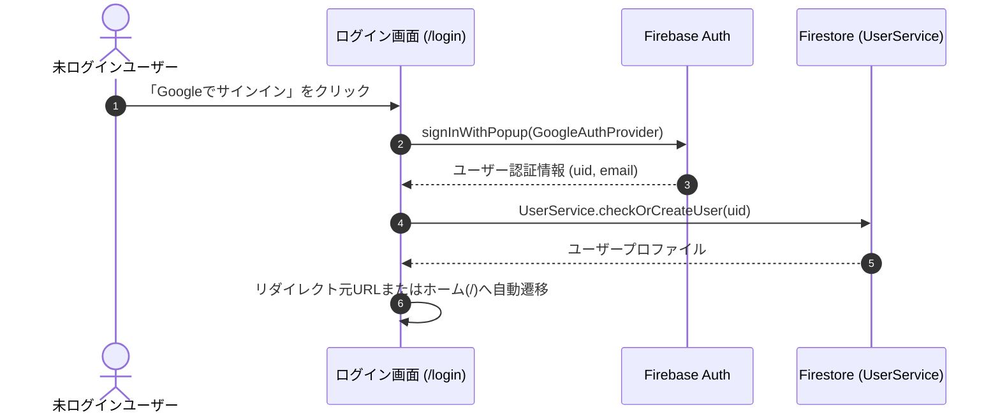
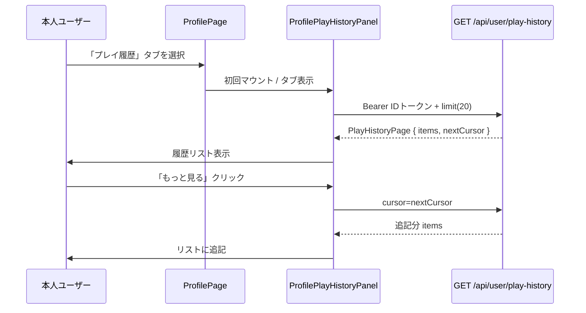
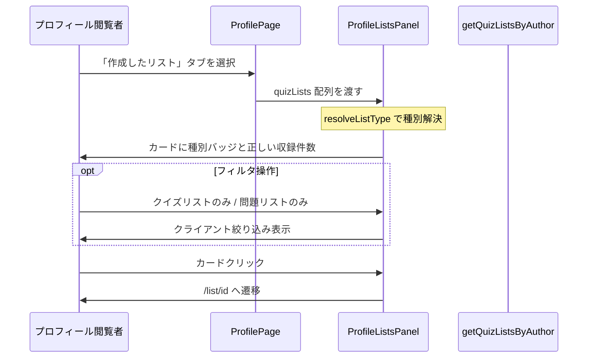

# Technical Design Document: quizeum-auth-profile-ui

## Overview
本ドキュメントは、クイズ投稿SNS「quizeum」におけるユーザー認証・プロフィール関連UIの技術設計仕様を定義します。ユーザー認証の入り口、個人プロフィールの閲覧・編集、ソーシャルフォロー連携、リアクション履歴、およびアクティビティ通知一覧を含む、アプリケーション全体の基本構造となる画面群を構築します。

本システムは、Next.jsのApp RouterおよびReact、TypeScriptのフロントエンド構成に加え、CSS Modulesによる親しみやすく洗練されたデザインシステムを実装し、Firebase AuthおよびFirestore上の `UserService` とのインターフェース接続を行います。

**Phase 5（2026-06）**: 本人プロフィールのコンテンツタブに「プレイ履歴」を追加し、`GET /api/user/play-history` の結果を一覧・ページング表示する（APIは `quizeum-core` 実装済み）。

**Phase 8（2026-06）**: プロフィール「作成したリスト」タブで、クイズリストと問題リスト（`listType`）を種別ラベル・正しい収録件数で区別表示する（`listType` 永続化・取得は `quizeum-core` / `quizeum-creator-dash-ui` 実装済み）。

### Goals
- 画面群の基礎となるデザインシステム（カジュアルモダンなUI）トークンおよびレイアウトの維持。
- ソーシャルサインイン（Google / X / Microsoft）とセッションに基づくリダイレクト。
- プロフィール画面でのアバター、バッジ、評価、投稿クイズ／リスト／**本人のみプレイ履歴**のタブ切替表示。
- 退会処理中（`delete_pending`）の404フォールバック。
- **Phase 5**: プレイ履歴専用タブ、カーソルページング、クイズ詳細へのリンク、E2E `data-testid` 契約。
- **Phase 8**: リストカードの `listType` バッジ、種別に応じた収録件数、任意フィルタ、E2E `data-testid` 契約。

### Non-Goals
- クイズプレイ・作成・モデレーション画面（各専用スペック）。
- `attempts` 永続化・プレイ履歴API・`test-play` 除外ロジック（`quizeum-core`）。
- 他ユーザープロフィールからのプレイ履歴閲覧。
- **Phase 8**: リスト作成・編集・`listType` 選択 UI（`quizeum-creator-dash-ui`）。ブックマーク3タブ・問題リストプレイ（`quizeum-play-flow-ui`）。

---

## Boundary Commitments

### This Spec Owns
- **UIルーティング設計**: `/login`, `/profile/[uid]`, `/profile/edit`, `/profile/[uid]/connections`, `/notifications`, `/profile/[uid]/likes` の各ページコンポーネント。
- **デザインシステム**: `globals.css` および共通テーマ。
- **認証連携と状態監視**: `useAuth` によるセッションとリダイレクト。
- **クライアント側権限保護**: `delete_pending` 閲覧時の404。
- **Phase 5**: `ProfilePlayHistoryPanel` — 本人プロフィール第3タブ「プレイ履歴」の取得・表示・追加読み込み。
- **Phase 8**: `ProfileListsPanel` / `ProfileListCard` — 「作成したリスト」タブの `listType` 表示・件数・任意フィルタ・詳細遷移。

### Out of Boundary
- Firestoreセキュリティルール、バッジ自動付与サーバー処理。
- プレイ履歴のクエリ実装・`PlayHistoryPage` 生成（`quizeum-core` / `GET /api/user/play-history`）。
- **Phase 8**: `listType` の付与・リスト CRUD・問題リスト編集 UI（`quizeum-creator-dash-ui`）。リスト詳細の `listType` 分岐表示本体（`quizeum-play-flow-ui` の `/list/[id]` — 本スペックはプロフィールカードからの遷移のみ）。

### Allowed Dependencies
- **`quizeum-core`**: `UserService`, `AuthContext`, **`PlayHistoryPage` / `PlayHistoryEntry` 型（`@/types`）**
- **`GET /api/user/play-history`**: Bearer ID トークン（`auth.currentUser.getIdToken()`）
- **`lucide-react`**
- **Phase 8**: `getQuizListsByAuthor`（`@/services/quiz-list`）、`resolveListType`（`@/types`）。任意フィルタ時は既取得配列のクライアント絞り込みを優先（再フェッチは `options.listType` 利用可だが初版は不要）。

### Revalidation Triggers
- `UserService` / Firebase Auth インターフェース変更。
- `PlayHistoryPage` レスポンス形状またはカーソル形式の変更。
- **Phase 8**: `QuizList.listType` / `questionIds` スキーマ変更、`getQuizListsByAuthor` のフィルタ契約変更、`resolveListType` 後方互換規則の変更。

---

## Architecture

### Existing Architecture Analysis
認証・プロフィール・通知・接続・リアクション履歴の各画面は実装済み。プロフィールのコンテンツタブは `quizzes` / `lists` / 本人時 `history`。Phase 5 のプレイ履歴は実装済み。

**Phase 8 ギャップ（現状コード）**: `src/app/profile/[uid]/page.tsx` のリストタブは全カードで `list.quizIds.length` を「収録問題」として表示しており、問題リストで誤表示となる。`listType` バッジ・`data-testid` 未付与。`bookmark-list-grid.tsx` には既に `listType === 'question'` のラベル分岐があり、同パターンをプロフィール用に抽出する。

### Technology Stack
- **Frontend**: Next.js v16.2.6 (App Router), React v19.2.4, TypeScript
- **Styling**: Vanilla CSS (CSS Modules)
- **Icons**: `lucide-react`

---

## File Structure Plan

### Directory Structure
```
src/
├── app/
│   ├── globals.css                # 共通CSSトークン定義（硬すぎない親しみやすいフォント・角丸・配色）
│   ├── layout.tsx                 # 共通レイアウト（Headerを包含）
│   ├── login/
│   │   ├── page.tsx               # 認証画面 (1.1, 1.2, 1.3)
│   │   └── login.module.css
│   ├── profile/
│   │   ├── edit/
│   │   │   ├── page.tsx           # プロフィール編集画面 (3.1, 3.2, 3.3)
│   │   │   └── edit.module.css
│   │   └── [uid]/
│   │       ├── connections/
│   │       │   ├── page.tsx       # フォロー/フォロワー一覧画面 (4.1, 4.2)
│   │       │   └── connections.module.css
│   │       ├── likes/
│   │       │   ├── page.tsx       # リアクション履歴画面 (6.1, 6.2)
│   │       │   └── likes.module.css
│   │       ├── page.tsx           # プロフィール画面 (2.x, 7.x)
│   │       └── profile.module.css
│   └── notifications/
│       ├── page.tsx               # 通知一覧 (5.x)
│       └── notifications.module.css
├── components/
│   ├── layout/
│   │   ├── header.tsx
│   │   └── header.module.css
│   └── profile/
│       ├── profile-play-history-panel.tsx   # プレイ履歴タブ (7.x) 【Phase 5】
│       ├── profile-play-history-panel.module.css
│       ├── profile-list-card.tsx            # リストカード1件 (8.x) 【Phase 8】
│       └── profile-lists-panel.tsx          # リストタブ本体・任意フィルタ (8.x) 【Phase 8】
└── lib/
    ├── play-history-client.ts     # API fetch + モードラベル
    └── profile-list-display.ts    # listType ラベル・収録件数純関数 (8.x) 【Phase 8】
```

### Modified Files（Phase 8）
- `src/app/profile/[uid]/page.tsx` — リストタブインライン描画を `ProfileListsPanel` に委譲。`getQuizListsByAuthor` 取得は現状維持。
- `src/app/profile/[uid]/profile.module.css` — 種別バッジ・フィルタチップ用スタイル（必要最小限）。

### Modified Files（Phase 5）
- `src/app/profile/[uid]/page.tsx` — `activeTab` に `'history'` を追加（本人のみタブボタン表示）、`ProfilePlayHistoryPanel` をタブパネルに配置。
- `src/app/profile/[uid]/profile.module.css` — 履歴リスト行スタイル（必要に応じてパネルCSSへ移管）。

### Modified Files（既存）
- `src/app/globals.css` — 共通トークン。
- `src/app/login/page.tsx` — マルチプロバイダ認証・リダイレクト。

---

## System Flows

### 認証・ログインリダイレクトフロー


### 本人プレイ履歴タブ表示フロー（Phase 5）


### プロフィール作成リスト表示フロー（Phase 8）


---

## Requirements Traceability

| Requirement | Summary                                        | Components                                | Interfaces                            | Flows            |
| ----------- | ---------------------------------------------- | ----------------------------------------- | ------------------------------------- | ---------------- |
| 1.1         | Google OAuthログイン                           | `/login` Page                             | Firebase Auth                         | 認証フロー       |
| 1.2         | ログイン成功時のリダイレクト                   | `/login` Page                             | `useAuth`, `useRouter`                | 認証フロー       |
| 1.3         | ログイン済みのログイン画面アクセス回避         | `/login` Page                             | `useAuth`                             | -                |
| 1.4         | Firebase 認証エラーの日本語表示                | `/login` Page                             | Firebase Auth error mapping           | 認証フロー       |
| 1.5         | 開発・E2E 用簡易ログイン（本番非表示）         | `/login` Page                             | `NODE_ENV` / `NEXT_PUBLIC_ENV` ガード | -                |
| 2.1         | プロフィール基本情報・バッジ表示               | `/profile/[uid]` Page                     | `UserService`                         | -                |
| 2.2         | 作成クイズ・リストのタブ表示                   | `/profile/[uid]` Page                     | `UserService`, Tab UI                 | -                |
| 2.3         | 他人のプロフィールのフォローボタン             | `/profile/[uid]` Page                     | `UserService`                         | -                |
| 2.4         | フォロー・フォロー解除のインタラクション       | `/profile/[uid]` Page                     | `UserService.followUser`              | -                |
| 2.5         | 退会処理中アカウントへのアクセス制御           | `/profile/[uid]` Page                     | `UserService` (deleteStatus)          | -                |
| 2.6         | 本人プロフィールのプレイ履歴表示領域           | `ProfilePage`, `ProfilePlayHistoryPanel`  | Tab `history`                         | プレイ履歴フロー |
| 3.1         | プロフィール編集入力フォーム                   | `/profile/edit` Page                      | Input Form                            | -                |
| 3.2         | 表示名30字・自己紹介200字制限                  | `/profile/edit` Page                      | Form Validation (Zod)                 | -                |
| 3.3         | 編集保存とプロフィール画面への遷移             | `/profile/edit` Page                      | `UserService.updateProfile`           | -                |
| 4.1         | フォロー・フォロワーのタブ表示                 | `/profile/[uid]/connections` Page         | Tab UI                                | -                |
| 4.2         | フォローカードとダイレクトトグル               | `/profile/[uid]/connections` Page         | UserCard, `UserService`               | -                |
| 5.1         | 通知の時系列一覧表示                           | `/notifications` Page                     | Notification List                     | -                |
| 5.2         | 指摘完了通知クリックによる遷移                 | `/notifications` Page                     | Click-to-QuizDetail                   | -                |
| 6.1         | 送受信リアクションのタブ表示                   | `/profile/[uid]/likes` Page               | Tab UI                                | -                |
| 6.2         | リアクションカードと遷移                       | `/profile/[uid]/likes` Page               | LikeCard                              | -                |
| 7.1         | 本人のみ「プレイ履歴」専用タブ                 | `ProfilePage`, `ProfilePlayHistoryPanel`  | Tab `history`                         | プレイ履歴フロー |
| 7.2         | Bearer で履歴取得                              | `play-history-client`                     | `GET /api/user/play-history`          | プレイ履歴フロー |
| 7.3         | 行: タイトルリンク・スコア・モード・日時・時間 | `ProfilePlayHistoryPanel`                 | `getAttemptModeLabel`                 | -                |
| 7.4         | 空状態                                         | `ProfilePlayHistoryPanel`                 | -                                     | -                |
| 7.5         | `nextCursor` で追記読み込み                    | `ProfilePlayHistoryPanel`                 | Load more                             | プレイ履歴フロー |
| 7.6         | 401/403/500 のエラーUI                         | `ProfilePlayHistoryPanel`                 | -                                     | -                |
| 7.7         | E2E testid                                     | `ProfilePlayHistoryPanel`                 | data-testid                           | -                |
| 7.8         | 永続化ロジックなし                             | —                                         | Out of boundary                       | -                |
| 8.1         | 作成リスト全件カード表示                       | `ProfileListsPanel`                       | `getQuizListsByAuthor`                | リスト表示フロー |
| 8.2         | listType 種別ラベル                            | `ProfileListCard`, `profile-list-display` | `resolveListType`                     | -                |
| 8.3         | クイズリスト収録クイズ数                       | `profile-list-display`                    | `quizIds.length`                      | -                |
| 8.4         | 問題リスト収録問題数                           | `profile-list-display`                    | `questionIds.length`                  | -                |
| 8.5         | リスト詳細へ遷移                               | `ProfileListCard`                         | Link `/list/[id]`                     | リスト表示フロー |
| 8.6         | 本人0件時の空状態と作成導線                    | `ProfileListsPanel`                       | `/list/create`                        | -                |
| 8.7         | 任意 listType フィルタ                         | `ProfileListsPanel`                       | クライアント filter                   | リスト表示フロー |
| 8.8         | listType CRUD なし                             | —                                         | Out of boundary                       | -                |
| 8.9         | E2E testid                                     | `ProfileListCard`                         | data-testid                           | -                |

---

## Components and Interfaces

### Component Summary Table

| Component                 | Domain/Layer   | Intent                                                    | Req Coverage            | Key Dependencies           | Contracts      |
| ------------------------- | -------------- | --------------------------------------------------------- | ----------------------- | -------------------------- | -------------- |
| `LoginPage`               | UI / Page      | 認証の開始とリダイレクト制御                              | 1.1, 1.2, 1.3, 1.4, 1.5 | `useAuth`, Firebase Auth   | State          |
| `ProfilePage`             | UI / Page      | プロフィール閲覧、3タブ（本人時）、フォロー、退会チェック | 2.1–2.6, 7.1, 8.1       | `UserService`, `useAuth`   | State          |
| `ProfileListsPanel`       | UI / Component | 作成リストタブの一覧・空状態・任意フィルタ                | 8.1, 8.6, 8.7           | `ProfileListCard`          | State          |
| `ProfileListCard`         | UI / Component | リスト1件のカード（種別・件数・リンク）                   | 8.2–8.5, 8.9            | `profile-list-display`     | Presentational |
| `ProfilePlayHistoryPanel` | UI / Component | プレイ履歴専用タブの一覧・ページング                      | 7.2–7.7                 | `play-history-client` (P0) | State, API     |
| `ProfileEditPage`         | UI / Page      | プロフィール表示名・自己紹介の編集・バリデーション        | 3.1, 3.2, 3.3           | `UserService`, Zod Schema  | FormState      |
| `ConnectionsPage`         | UI / Page      | フォロー/フォロワーのタブ切替一覧と直接フォロー制御       | 4.1, 4.2                | `UserService`              | State          |
| `NotificationsPage`       | UI / Page      | アクティビティ通知一覧の表示と詳細遷移                    | 5.1, 5.2                | `NotificationService`      | State          |
| `LikesPage`               | UI / Page      | リアクション送信・獲得履歴のタブ表示と遷移                | 6.1, 6.2                | `ReactionService`          | State          |
| `Header`                  | UI / Layout    | グローバルナビゲーションおよびログインアバターの表示      | -                       | `useAuth`                  | State          |

#### `ProfilePlayHistoryPanel`（Phase 5）

| Field        | Detail                                                      |
| ------------ | ----------------------------------------------------------- |
| Intent       | 本人プロフィールの「プレイ履歴」タブ内で API 結果を表示する |
| Requirements | 7.1, 7.2, 7.3, 7.4, 7.5, 7.6, 7.7, 7.8                      |

**Responsibilities & Constraints**
- 親 `ProfilePage` から `isActive: boolean`（またはタブが `history` のときのみマウント）を受け取り、**初回アクティブ時**にのみ初回フェッチ（不要なAPI呼び出しを避ける）。
- リストは `PlayHistoryEntry[]` をローカル state に保持し、「もっと見る」で `append`。
- クイズタイトルは `/quiz/{quizId}` への `Link`。副CTAとして「もう一度プレイ」は同一リンクでよい（詳細からプレイ開始）。

**Contracts**: API [x], State [x]

##### Client API（`play-history-client.ts`）
```typescript
export function getAttemptModeLabel(mode: PlayHistoryEntry['mode']): string;

export async function fetchPlayHistoryPage(params: {
  cursor?: string | null;
  limit?: number;
}): Promise<PlayHistoryPage>;
```
- `fetchPlayHistoryPage`: `auth.currentUser?.getIdToken()` → `Authorization: Bearer`。`cursor` / `limit` をクエリに付与。401/403/500 は throw または `Result` で Panel がメッセージ表示。
- JSON の `completedAt` は `new Date(...)` に変換して表示。

##### タブ統合（`ProfilePage`）
```typescript
type ProfileContentTab = 'quizzes' | 'lists' | 'history';
```
- `isMyProfile === false` のとき `history` タブボタンは非表示。`activeTab === 'history'` になり得ないようガード。
- タブボタン: `data-testid="profile-tab-history"`（E2E用、要件7と併用可）。

##### `data-testid` 契約
| 要素       | test id                  |
| ---------- | ------------------------ |
| パネル全体 | `play-history-section`   |
| 各行       | `play-history-entry`     |
| もっと見る | `play-history-load-more` |

**Implementation Notes**
- ローディング: 初回・追加読み込み中はスピナーまたはスケルトン。
- 空状態文言: 「まだプレイ履歴がありません」
- エラー401: ログインへ誘導リンク。403/500: 再試行ボタン。

#### `ProfileListCard` / `ProfileListsPanel`（Phase 8）

| Field        | Detail                                                                                 |
| ------------ | -------------------------------------------------------------------------------------- |
| Intent       | プロフィール「作成したリスト」タブで `listType` を視覚区別し、正しい収録件数を表示する |
| Requirements | 8.1, 8.2, 8.3, 8.4, 8.5, 8.6, 8.7, 8.8, 8.9                                            |

**Responsibilities & Constraints**
- 種別解決は常に `resolveListType(list)` を使用する（`listType` 未設定は `quiz`）。**`list.listType` の直参照は禁止**（`bookmark-list-grid.tsx` は `list.listType === 'question'` だが、レガシー未設定ドキュメントで誤判定し得るためプロフィール側はコピーしない）。
- `ProfileListCard` では `getProfileListTypeLabel(resolveListType(list))` のみでバッジ文言を決定する。
- 収録件数: `quiz` → `list.quizIds?.length ?? 0`（ラベル「収録クイズ: N 件」）。`question` → `list.questionIds?.length ?? 0`（ラベル「収録問題: N 件」）。問題リストで `quizIds` 件数を表示してはならない（8.4）。
- カード全体は `/list/[id]` への `Link`。クリック領域は既存 `quizCard` スタイルを踏襲。
- 本人プロフィールかつ0件: 既存空状態文言 + `/list/create` 導線を維持（8.6）。
- フィルタ（8.7・任意）: `ProfileListsPanel` 内に `all` | `quiz` | `question` チップ。初版は **既取得 `quizLists` のクライアントフィルタ** とし、追加 API 呼び出しは不要。フィルタ未実装でも種別バッジのみで要件 8.2 は充足する。
- **フィルタ結果0件**（全体は1件以上）: 「該当するリストがありません」等の空状態を表示し、「すべて」に戻すリセット操作（チップ再選択または「フィルタを解除」ボタン）を提供する。8.6 の真の0件空状態（`/list/create` 導線）と区別する。
- リスト CRUD・`listType` 書き込みは行わない（8.8）。

**Contracts**: State [x]（Panel のフィルタ state のみ）

##### 純関数（`profile-list-display.ts`）
```typescript
import type { QuizList, QuizListType } from '@/types';

export function getProfileListTypeLabel(listType: QuizListType): string;

export function getProfileListItemCount(list: Pick<QuizList, 'listType' | 'quizIds' | 'questionIds'>): {
  count: number;
  countLabel: string; // 例: "収録クイズ: 3 件" / "収録問題: 12 件"
};
// 内部で resolveListType(list) を呼び出し、list.listType 直参照は行わない
```

##### Props
```typescript
interface ProfileListCardProps {
  list: QuizList;
}

type ProfileListFilter = 'all' | 'quiz' | 'question';

interface ProfileListsPanelProps {
  lists: QuizList[];
  isMyProfile: boolean;
}
```

##### `data-testid` 契約
| 要素                             | test id                                                                               |
| -------------------------------- | ------------------------------------------------------------------------------------- |
| リストカード                     | `profile-list-card`                                                                   |
| 種別ラベル                       | `profile-list-type-badge`                                                             |
| フィルタ（任意実装時）           | `profile-list-filter-all`, `profile-list-filter-quiz`, `profile-list-filter-question` |
| フィルタ結果0件（全体は1件以上） | `profile-list-filter-empty`                                                           |

**Implementation Notes**
- `bookmark-list-grid.tsx` の種別ラベル**文言**（「クイズリスト」「問題リスト」）と統一するが、種別**判定ロジック**は `resolveListType` 経由のみ（上記 Constraints 参照）。
- タブ見出しの件数 `作成したリスト (N)` はフィルタ適用前の全件数を表示する（フィルタは一覧の見え方のみ変更）。
- テスト: `profile-list-display` 単体 — `listType: undefined` の `QuizList` が `resolveListType` 経由でクイズリスト扱い・`quizIds` 件数になること、`listType: 'question'` で `questionIds` 件数になること。`ProfileListCard` RTL（バッジ・testid・レガシー未設定リスト）。
- Phase 8 統合検証時、既存タブ（クイズ／プレイ履歴）の回帰はスモーク確認とする（1.4, 1.5, 2.5, 2.6 は実装済み領域）。

---

## Data Models
本UIコンポーネント群は、`quizeum-core` で定義されたFirestoreドキュメントスキーマ（`User`, `Badge`, `Follow`, `Notification`, `Reaction` 等）と結合します。

### UI固有の型定義
```typescript
// プロフィール編集フォームの入力型
export interface ProfileEditFormInput {
  displayName: string;
  bio: string;
}
```

---

## Error Handling

### Error Strategy
- **認証エラー (Google Pop-up)**:
  - ユーザーがポップアップを閉じた、ブロックされた等のケースに対し、親しみやすい日本語メッセージ（例：「Googleログインがキャンセルされました。もう一度お試しください。」）を画面上にアラート表示します。
- **バリデーションエラー**:
  - プロフィール編集時、入力値が制限文字数（表示名30字、自己紹介200字）を超えた場合、送信ボタンを非活性化し、テキストの下に赤い警告メッセージをインライン表示します。
- **404フォールバック**:
  - `deleteStatus` が `'delete_pending'` のプロフィールにアクセスした場合、Next.js の `notFound()` をトリガーして即座に親切な404画面へと誘導します。

---

## Testing Strategy

### Unit Tests
- **編集入力長バリデーション**:
  - 表示名30文字、自己紹介200文字のバリデーションが入力時に即座に機能し、ボタン制御が行われるかを単体テスト。

### Integration Tests
- **ログイン状態遷移**:
  - `useAuth` のセッションが確立された時点で、ログイン画面からホーム画面へ、未ログイン時は保護ページからログイン画面へ、それぞれリダイレクトが動作することをテスト。

### E2E/UI Tests
- **プロフィールのタブ切り替え**:
  - 「作成したクイズ」「作成したリスト」タブの切替。
- **プレイ履歴専用タブ（Phase 5）**:
  - 本人プロフィールで `profile-tab-history` / `play-history-section` が表示されること。
  - 履歴ありで `play-history-entry` が存在し、タイトルクリックで `/quiz/[id]` へ遷移できること。
  - `play-history-load-more` で追記読み込み（`nextCursor` がある場合）。
  - 他人プロフィールではプレイ履歴タブが存在しないこと。
- **作成リスト listType 表示（Phase 8）**:
  - `profile-list-card` が存在し、`profile-list-type-badge` がクイズ／問題で異なる文言を示すこと。
  - 問題リストカードで収録件数が `questionIds` ベースであること（`quizIds` を使っていないこと）。
  - カードクリックで `/list/[id]` へ遷移すること。
  - 本人0件時に `/list/create` 導線が表示されること。
  - （任意）フィルタでクイズリストのみ／問題リストのみに絞れること。
  - フィルタ適用で0件・全体1件以上のとき `profile-list-filter-empty` が表示され、フィルタ解除で一覧が復帰すること。
