# Technical Design Document: quizeum-core

## Overview
本ドキュメントは、クイズ投稿SNS「quizeum」における核心的なコアシステム（`quizeum-core`）の技術設計仕様を定義します。クイズの作成・下書き・厳格な公開バリデーション、ローカルセッション保護と自動同期を備えたプレイ環境、AIを活用したステートレスなウミガメのスープ（水平思考クイズ）対話、退会時のAuth即時物理削除と大規模非同期クレンジング、そしてコミュニティモデレーションやマージ合意によるメタデータ仮想統合を含みます。

本システムは、Next.jsのApp RouterおよびReact、TypeScriptのフルスタック構成に加え、Firebase（Auth, Firestore, Storage）および外部AI（Gemini API）のハイブリッドアーキテクチャを採用し、セキュリティとパフォーマンス、ユーザー体験（UX）を最高レベルで実現します。

**Phase 5（2026-06）**: クイズ単位リーダーボードを初回プレイ／リプレイの二系統に分割し、正解数優先・同点時タイムの順位規則で更新する。全問正解は不要。あわせて本人向けプレイ履歴取得APIをコア層に追加する（表示UIは `quizeum-auth-profile-ui` が担当）。

**Phase 6（2026-06）**: ジャンル・タグメタデータを `docs/` 正本に整合する。公開保存時に `canonicalGenreId` / `canonicalTagIds` を解決・非正規化し、一覧・検索は正規識別子クエリを優先しつつ legacy クイズ向けに `genre in` フォールバックを併用する（C2 方式）。`metadata-resolution` ライブラリに解決ロジックを集約し、`tagMerge.ts` をガバナンスの単一経路とする。
また、悪質ユーザーのBAN（アカウント停止）機能を追加し、Firestore Security Rulesによるデータ書き込みの即時遮断、監査ログ記録、認証セッションの強制無効化（Cookie連携）を設計する。

**Phase 8（2026-06）**: ブックマークをクイズ・クイズリスト・問題の3分類で取得し、問題ブックマークは親クイズ公開時のみ許可する。リストに `listType`（`quiz` | `question`）を追加し、問題リストには他者の公開問題も追加可能とする。問題リスト連続プレイは既存クイズリストと同様に**問題ごとに1 attempt**（`mode: 'question-list'`）を記録する。作問時は自作クイズを検索し、問題を参照リンク（ドキュメント複製なし）で再利用する。参照問題の編集は **Copy-on-Write 切り離し** とする（内容変更時のみ新規 `questions` ドキュメントを作成し、未変更 of 参照は既存 ID を維持）。

**Phase 9（2026-06）**: トップページの統合検索機能（ジャンル、タグ、クイズ名、作者名を単一検索バーで同時検索可能にするハイブリッド検索ロジック）をコア層の設計仕様として追加します。

**Phase 10（2026-06）**: ホーム統合検索のタグチップ化を支える `listActiveTags`（存続タグマスタ一覧）と、`searchQuizzes` への複数タグ AND フィルタ（`SearchFilters.tags`）を追加する。タグ照合は `getQuizzesByTag` / 要件 11.3 と同一の canonical 優先＋legacy フォールバック規則を `quiz-tag-match` に集約する（UI サジェストは `quizeum-play-flow-ui` が担当）。

**Phase 11（2026-06）**: ホーム内フィルタ型探索およびジャンル別一覧 scoped 検索を支える `SearchFilters.format`（出題形式）追加と、`searchQuizzes` 後段での `resolveQuizFormat` 一致フィルタを実装する。形式判定は UI カード表示（`quizeum-play-flow-ui`）と同一 lib 規則を用い、Firestore インデックス新設は行わない。

**Phase 10 スマートサジェスト追記（2026-06-06）**: 検索フィールドの空クエリフォーカス時スマートサジェストを支える集計基盤を追加。`search_logs` コレクションへの検索ログ記録（`searchQuizzes` 内部で fire-and-forget）、週間人気ジャンル Top5 集計 API（`GET /api/genres/weekly-top`）、週間人気ワード／タグ Top5 集計 API（`GET /api/search/weekly-top`）を提供する。ユーザー個人履歴の保存は UI 側 `localStorage` のみで処理する。

### Goals
- ページの初期HTML読み込み時間を通常トラフィック下で平均0.5秒以内に維持する。
- プレイ中の不意なリロードやオフライン切断時における解答データ損失をローカルで保護・復元する。
- ユーザー退会時、アトミックな書き込み制限（最大500件）を回避しつつ即時Auth物理削除と非同期ジョブによる関連データの安全なクレンジングを完了する。
- 水平思考クイズにおいて、セキュアなサーバーサイド呼び出し、ターン制限（1日20回）、および同一質問キャッシュによる低コストで高精度なAI判定を実装する。
- 初回プレイ／リプレイの二系統リーダーボードを、単一の順位比較ロジックで一貫更新し、不正なクライアント改ざんをサーバー側トランザクションで防ぐ。
- 本人プレイ履歴をページング付きで安全に返却する（他ユーザーからの取得は拒否）。
- ジャンル・タグの仮想統合を保存・一覧・弱点克服フィルタまで一貫適用し、canonical 単一クエリで探索性能を確保する（legacy フォールバック併用）。
- BANされたユーザーによるシステムへの不正書き込み（Firestore / API）を即座にブロックし、既存の認証セッションを強制的にログアウトさせる。
- クイズ・リスト・問題の分類ブックマーク、問題リスト CRUD/プレイ、自作クイズ検索、参照リンク問題の保存整合をコア層で一貫提供する。
- 統合検索機能（ユニバーサル検索）のため、タイトル・説明・作者・タグ・ジャンルの並行ハイブリッド検索とクライアントデデュプ・フィルタロジックを最適化する。
- **Phase 10**: タグマスタ一覧 API（`listActiveTags`）と、タグチップ配列による複数タグ AND 複合検索の一貫実装。
- **Phase 11**: 出題形式（`format`）フィルタ付き複合検索。ジャンル固定 scoped 検索（`genreId` + 他条件 AND）の一貫実装。形式判定は `quiz-format-match` + `resolveQuizFormat` に集約。
- **Phase 10 スマートサジェスト**: `search_logs` コレクションへの検索ログ fire-and-forget 実装、週間ジャンル Top5 / 週間ワード·タグ Top5 集計 API Route の提供。
- **Phase 13 難易度5段階化**: `Quiz` 型の `difficulty`（1〜5）、`Attempt` 型の `difficultyVote`（1〜5）のデータモデル変更、公開バリデーションおよび難易度投票サービスの更新。

### Non-Goals
- 外部システムや外部ファイルからのクイズ・クイズリストの一括インポート機能の実装。
- リアルタイムマルチプレイヤー対戦プレイ用の接続・ポーリング基盤の構築。
- 広告配信用のアドサーバー基盤そのものの構築。

---

## Boundary Commitments

### This Spec Owns
- **データ永続化と整合性**: `users`, `quizzes`, `quizLists`, `follows`, `bookmarks`, `attempts`, `feedbackReports`, `flags`, `reactions`, `notifications`, `metadata_genres`, `metadata_tags`, `mergeRequests`, `genreRequests`, `quizReviews`, `reviewResetRequests`, `adminLogs`（BAN/UNBAN等の監査ログ）などのFirestoreスキーマおよびトランザクション設計。
- **アカウント削除プロセス**: Next.js API Routeを経由した即時Auth物理削除と、Cloud Tasks/Cloud Functionsを連動させた非同期ジョブ分割によるアトミックバッチ匿名化。
- **ユーザーBAN/UNBAN処理とアクセス制限**: `users` の `isBanned` 等のアカウント状態管理、管理者用APIルート、Firestore Security Rulesによるデータ書き込み制限（`isNotBanned()`）、および認証セッション無効化のトリガー（クッキー `quizeum_banned` を使用した強制遷移）。
- **水平思考プレイ判定ロジック**: サーバーAPIを仲介するGemini API連携（直近最大20回分の会話履歴参照を伴うステートフル化）、同一質問キャッシュ一致判定、1日同一クイズ20回制限（無料ユーザー）、必須キーワード全一致による即正解チェックとAIフォールバックによるハイブリッド真相判定（B2方式）。
- **メタデータ管理（Phase 6 拡張）**: 表記揺れタグの自動名寄せ、タグマスタ自動 create、ジャンルマスタ検証、`canonicalGenreId` / `canonicalTagIds` 書き込み時解決、C2 一覧クエリ、`listActiveGenres` / `searchQuizzes`、ガバナンス単一経路（`tagMerge.ts`）、`metadata_*` Security Rules。
- **オフライン/セッション保護**: クライアントローカル永続ストレージでの進捗永続化およびオンライン復帰時の自動バッチ同期。
- **クイズリーダーボード（初回／リプレイ）**: `quizzes.leaderboardFirstPlay` / `quizzes.leaderboardReplay` の更新ロジック、順位比較、トランザクション内の attempt 回数判定。
- **プレイ履歴クエリ**: 認証済み本人向け `attempts` 一覧 of ページング取得（クイズタイトル非正規化の解決を含む）。
- **Phase 8 — 分類ブックマーク**: 3種 `toggleBookmark`、公開親クイズ検証、分類一覧取得、問題ブックマーク通知。
- **Phase 8 — 問題リスト**: `listType` 付きリスト CRUD、公開問題追加検証、問題 ID 並び替え、問題リストエクスポート、`question-list` attempt 記録契約。
- **Phase 8 — 参照リンク作問**: `searchAuthorQuizzes`、参照 ID のみの保存パス、Copy-on-Write 切り離し、共有問題の安全な参照解除。
- **Phase 9 — 統合検索コアロジック**: `searchQuizzes` API 内における複数インデックス並行クエリ（タグ、作者名、ジャンル名等）、クライアント側マージ・重複排除、および大文字小文字を区別しない各種項目（タイトル、説明、作者名、タグ、ジャンル）の部分一致フィルタリング処理。
- **Phase 10 — タグマスタ一覧とタグ AND 検索**: `listActiveTags`、`quiz-tag-match` 純関数、`searchQuizzes` の `filters.tags` 拡張。
- **Phase 11 — 出題形式フィルタと scoped 検索**: `SearchFilters.format`、`quiz-format-match` 純関数、`searchQuizzes` 後段形式フィルタ（`resolveQuizFormat` 一致）。ジャンル固定 scoped 検索は既存 `genreId` + `expandGenreIdsForQuery` を維持。
- **Phase 10 スマートサジェスト（2026-06-06 追記）**: `search_logs` コレクションのスキーマ（`userId`, `queryText`, `tags[]`, `genreId`, `loggedAt`）および TTL、`searchQuizzes` 内での fire-and-forget ログ書き込み。`GET /api/genres/weekly-top` / `GET /api/search/weekly-top` の集計 API Route（server-side Firestore Admin SDK、Next.js revalidate: 1800）。ユーザー個人履歴の保存は UI 側 `localStorage` のみ（Core に記録しない）。
- **Phase 13 — 難易度5段階化（2026-06）**: `Quiz.difficulty`（1〜5の整数）および `Attempt.difficultyVote`（1〜5の整数）の範囲制限、ならびに `submitDifficultyVote` および `validateQuizForPublish` におけるバリデーション範囲の更新。

### Out of Boundary
- 外部APIへの直接のクライアント通信（AI呼び出しなど）はSecurity Rulesで拒否され、すべてNext.js API Routeを経由します。
- クイズデータの一括JSONインポートは行わず、手動によるエクスポート（ダウンロード）パッケージ生成のみを担当します。
- プラットフォーム総合リーダーボード（`/leaderboard`）の集計・表示。
- マイページ／プロフィール画面のプレイ履歴UIレイアウト（`quizeum-auth-profile-ui`）。
- クイズ詳細画面のリーダーボードタブUI（`quizeum-play-flow-ui`）。
- 管理者向けBAN/UNBAN操作画面のUIレイアウトおよび表示コンポーネント（`quizeum-admin-users-ui` が担当）。
- **Phase 6**: ホーム/エディタ/ジャンル一覧の UI、ジャンル新設・マージ画面のレイアウト、既存クイズの一括 `genre` 物理書き換え、Cloud Functions への投票移行。
- **Phase 8**: `/bookmarks` タブ UI、リスト/作問エディタのピッカー・DnD・検索パネル（`quizeum-play-flow-ui` / `quizeum-creator-dash-ui`）。プロフィールのリストタイプ別表示（`quizeum-auth-profile-ui`）。
- **Phase 10–11**: ホーム／ジャンルページの探索 UI（タグチップ、アコーディオン、カルーセル、フィルタ状態管理）は `quizeum-play-flow-ui` が担当。
- **Phase 10 スマートサジェスト — 境界外**: ユーザー個人の直近検索履歴の保存（`localStorage` のみ）、スマートサジェスト UI ドロップダウンのレンダリング（`quizeum-play-flow-ui`）。

### Allowed Dependencies
- **外部AI API**: 生成AI自動判定に必要な外部API（Google Gemini API等）。
- **アセットストレージ**: カバー画像やアバター画像を管理する Firebase Storage。
- **バックエンド基盤**: ユーザー認証およびデータの永続化を行う Firebase Auth, Cloud Firestore。

### Revalidation Triggers
- `spec.json` の型定義（`User`, `Quiz`, `Attempt` 等）のスキーマ変更。
- 退会処理時における匿名化対象コレクションの追加。
- AI自動真相判定のプロンプト構成やGemini APIのインターフェース変更。
- `leaderboardFirstPlay` / `leaderboardReplay` フィールド追加および旧 `leaderboard` 読み取り互換の廃止方針。
- プレイ履歴APIのレスポンス形状またはページングカーソル形式の変更。
- `metadata_genres` / `metadata_tags` スキーマ変更、canonical 解決アルゴリズム変更、ジャンル一覧クエリのフォールバック廃止。
- `QuizList.listType` 追加および未設定リストのデフォルト解釈変更。
- `Attempt.mode` に `question-list` 追加、参照リンク問題の Copy-on-Write 契約変更。
- `BookmarkFeed` / `BookmarkedQuestionEntry` レスポンス形状の変更。
- **Phase 10**: `SearchFilters.tags` の意味変更、`listActiveTags` の存続タグ定義（`canonicalId == null`）変更、`quiz-tag-match` 照合規則変更。
- **Phase 11**: `SearchFilters.format` の許容値集合変更、`quiz-format-match` / `resolveQuizFormat` 推定規則変更（`quizeum-play-flow-ui` のカード・カルーセル表示と連動再検証）。
- **Phase 10 スマートサジェスト**: `search_logs` コレクションの TTL・スキーマ変更、`GET /api/genres/weekly-top` / `GET /api/search/weekly-top` のレスポンス形状変更、`searchQuizzes` の fire-and-forget ログ書き込み報啄ルール変更。
- **Phase 13**: `Quiz.difficulty` および `Attempt.difficultyVote` のデータ型変更、公開バリデーション (`validateQuizForPublish`) および投票バリデーション (`submitDifficultyVote`) の上限範囲変更（10から5へ）。

---

## Architecture

### Existing Architecture Analysis
既存のコードベースには、クライアントから直接Firestoreを操作する簡易的なサービス（`src/services/quiz.ts` 等）がすでに実装されています。
本設計はこれを拡張し、重要な更新処理や複雑なビジネスロジック（退会、NGワード検証、AI対話）において、Firestore Security Rulesによる不正書き込みの遮断と、セキュアなサーバーAPI Route（Next.js）および Cloud Functions による二重の検証・処理を強制するハイブリッドモデルを適用します。

### Architecture Pattern & Boundary Map

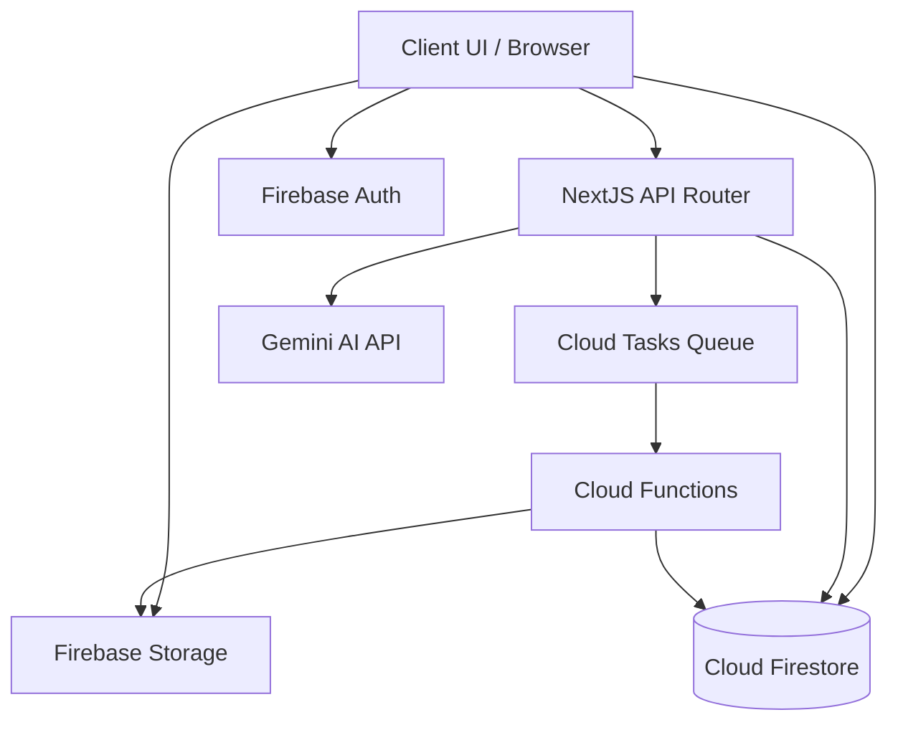

### Technology Stack

| Layer                    | Choice / Version             | Role in Feature                                             | Notes                                             |
| ------------------------ | ---------------------------- | ----------------------------------------------------------- | ------------------------------------------------- |
| Frontend / CLI           | Next.js v16.2.6 (App Router) | ユーザーUIの提供、ローカルセッション永続化                  | React v19.2.4、TypeScript                         |
| Backend / Services       | Next.js API Routes           | セキュアなAI判定プロキシ、即時退会Auth削除、Cloud Tasks登録 | Firebase Admin SDK                                |
| Data / Storage           | Cloud Firestore              | 全データの永続化とアトミックカウント更新                    | `firestore.indexes.json` で複合インデックスを管理 |
| Messaging / Events       | Cloud Tasks                  | 退会時非同期分割匿名化ジョブの遅延実行                      | Cloud Functions と連携                            |
| Infrastructure / Runtime | Firebase Storage             | アバターやカバー画像の保存（上限2MB）                       | Storage Security Rules による認証保護             |

---

## File Structure Plan

### Directory Structure
```
src/
├── app/
│   └── api/
│       ├── admin/
│       │   └── users/
│       │       ├── ban/
│       │       │   └── route.ts  # 管理者ユーザーBAN API (12.1)
│       │       └── unban/
│       │           └── route.ts  # 管理者ユーザーUNBAN API (12.2)
│       ├── attempt/
│       │   ├── ask-ai/
│       │   │   └── route.ts      # AI質問判定API (4.1, 4.2)
│       │   └── verify-truth/
│       │       └── route.ts      # AI真相判定API (4.5, 4.6, 9.8)
│       └── user/
│           ├── delete-account/
│           │   └── route.ts      # 即時退会Auth物理削除API (1.4)
│           └── play-history/
│               └── route.ts      # 本人プレイ履歴API (10.1–10.5)
├── lib/
│   ├── leaderboard-ranking.ts    # 順位比較・マージ・top5抽出 (9.4–9.6)
│   ├── metadata-resolution.ts    # canonical 解決・マージ展開・クイズ保存用メタ適用 (2.x, 11.x) [Phase 6 新規]
│   ├── quiz-format.ts            # resolveQuizFormat（形式推定）(17.x) [既存]
│   ├── quiz-format-match.ts      # クイズ×出題形式照合（検索用）(17.x) [Phase 11 新規]
│   └── quiz-tag-match.ts         # クイズ×タグ照合（AND 検索用）(16.x) [Phase 10 新規]
├── services/
│   ├── attempt.ts                # saveAttempt内LB更新、listUserPlayHistory、review genreFilter (3.x, 9.x, 10.x, 3.7)
│   ├── bookmark.ts               # ブックマークのアトミック管理 (5.3)
│   ├── moderation.ts             # 通報・自動保留のみ (7.1–7.3)。ジャンルAPIスタブ削除 [Phase 6]
│   ├── reputation.ts             # BAN/UNBANサービスと監査ログ記録 (12.1, 12.2)
│   ├── tagMerge.ts               # マージ投票・ジャンル新設（単一経路）(7.4–7.8, 11.7)
│   ├── quiz-list.ts              # リストの管理 (5.4)
│   ├── quiz.ts                   # saveQuiz canonical化、getQuizzesByGenre/Tag、searchQuizzes (2.x, 11.x)
│   ├── storage.ts                # Storageアセット操作、自動クレンジング (1.5, 5.1)
│   └── user.ts                   # バッジ付与、プロフィール編集 (1.2, 1.3)
└── types/
    └── index.ts                  # すべての型定義ファイル (1.1, 2.2, 3.5, etc)
```

### Modified Files
- `src/types/index.ts` — 称号、ウミガメスープ履歴、必須キーワード `truthKeywords` などの型定義を網羅。
- `src/services/quiz.ts` — クイズ公開時バリデーション（ウミガメスープにおけるキーワード設定検証）等を追加。
- `src/services/quiz-validation.ts` — ウミガメスープ形式の時、必須キーワードが最低1つ指定されているかどうかの検証を追加。
- `src/services/ask-ai-utils.ts` — 会話履歴を反映したシステムインラインプロンプト構築と Gemini Chat API 連携用マッピングロジックを追加。
- `src/services/verify-truth-utils.ts` — 登録必須キーワードがすべて含まれているかを検証する `verifyKeywords` 正規化判定関数を追加。
- `src/app/api/attempt/ask-ai/route.ts` — Firestore から履歴を取得して直近20回分の履歴を Gemini に渡しステートフルな呼び出しを行うよう修正。
- `src/app/api/attempt/verify-truth/route.ts` — 必須キーワード一致による即合格（AIバイパス）とAIフォールバックを組み合わせたハイブリッド判定処理を追加。
- `src/components/quiz/quiz-editor.tsx` — ウミガメスープ形式の問題作成時に、タグ風UIで必須キーワードを追加・削除できるフォームを追加。
- `src/types/index.ts` — `leaderboardFirstPlay` / `leaderboardReplay`、`PlayHistoryEntry` 等を追加。
- `src/lib/leaderboard-ranking.ts` — **新規**。順位比較・ユーザー1枠マージ・上位5抽出の純関数。
- `src/services/attempt.ts` — 全問正解ガードを撤廃し、トランザクション内で初回／リプレイLBを更新。`listUserPlayHistory` を追加。
- `src/app/api/attempt/verify-truth/route.ts` — 共通LB更新ヘルパーを利用（重複ロジック削除）。
- `src/app/api/user/play-history/route.ts` — **新規**。IDトークン検証後、本人のみ履歴を返却。
- `firestore.indexes.json`（またはプロジェクト既定のインデックス定義）— `attempts`: `userId` + `completedAt` 降順クエリ用複合インデックスを追加。
- `tests/lib/leaderboard-ranking.test.ts` — **新規**。順位・マージ・top5の単体テスト。
- `tests/services/attempt-leaderboard.test.ts` — **新規**。初回／リプレイ振り分けの統合テスト。
- `src/lib/metadata-resolution.ts` — **新規**（Phase 6）。`resolveCanonicalGenreId`, `resolveCanonicalTagIds`, `expandGenreIdsForQuery`, `assertActiveGenre`, `ensureTagMasters`.
- `src/services/quiz.ts` — `saveQuiz` で canonical 埋め込み、`getQuizzesByGenre` C2 クエリ、`getQuizzesByTag` を `canonicalTagIds` 優先に、`searchQuizzes` 追加。
- `src/services/quiz-validation.ts` — 公開時ジャンルマスタ存在チェック（`assertActiveGenre` 連携）。
- `src/services/attempt.ts` — `getFailedQuestions` の genreFilter を `expandGenreIdsForQuery` 利用に変更。
- `src/services/moderation.ts` — `submitGenreRequest` / `resolveGenreRequest` 削除（`tagMerge.ts` に統一）。
- `src/types/index.ts` — `GenreMetadata`, `TagMetadata` 型追加。
- `firestore.rules` — `metadata_genres`, `metadata_tags`, `mergeRequests`, `genreRequests`（`detailed_design.md` §6.5 準拠）。
- `firestore.indexes.json` — `(status, canonicalGenreId, createdAt|playCount|bookmarksCount)` 複合インデックス。
- `tests/lib/metadata-resolution.test.ts` — **新規**。
- `tests/services/quiz-genre-query.test.ts` — **新規**（canonical + legacy フォールバック union）。

**Phase 8 追加ファイル**:
- `src/lib/question-list-validation.ts` — **新規**。`listType` ガード、親クイズ `published` 検証、タイプ不一致操作拒否。
- `src/lib/linked-question.ts` — **新規**。参照リンク判定、Copy-on-Write 切り離し、共有問題削除ガード。
- `src/services/author-quiz-search.ts` — **新規**。`searchAuthorQuizzes`（自作・下書き含むキーワード/タグ検索）。
- `src/services/bookmark.ts` — 問題登録時検証、分類フィード取得、問題 BM 通知（13.x）。
- `src/services/question.ts` — 問題一覧 enrich、リスト追加を validation 経由に（14.x）。
- `src/services/quiz-list.ts` — `listType`、問題並び替え、タイプ別一覧、問題リストエクスポート（14.x）。
- `src/services/quiz.ts` — 参照リンク保存パス統合（15.x）。また、`searchQuizzes` API を拡張してタグ、作者名、ジャンル名、タイトルを網羅する並行クエリとクライアント側ハイブリッド部分一致フィルタを実装（Phase 9）。
- `src/services/quiz-list-utils.ts` — `buildQuestionListExportPackage`、`reorderQuestionIds`。
- `src/types/index.ts` — `QuizListType`, `listType`, `Attempt.mode` 拡張、`BookmarkFeed` 型。
- `firestore.indexes.json` — `quizLists`: `authorId` + `listType` + `createdAt`（任意、タイプ別一覧用）。
- `tests/services/quiz-search-universal.test.ts` — **新規**。統合検索（ハイブリッド検索）における並行クエリ、重複排除、および部分一致フィルタの単体テスト（Phase 9）。
- `tests/lib/linked-question.test.ts` — **新規**。
- `tests/services/bookmark-phase8.test.ts` — **新規**。
- `tests/services/quiz-list-question-type.test.ts` — **新規**。
- `tests/services/quiz-linked-question.test.ts` — **新規**。
- `tests/services/author-quiz-search.test.ts` — **新規**。

**Phase 10 追加ファイル**:
- `src/lib/quiz-tag-match.ts` — **新規**。クイズが指定タグ（canonical 解決済み）を満たすかの純関数（要件 16.7–16.8）。
- `src/services/quiz.ts` — `listActiveTags()` 追加、`SearchFilters.tags` 拡張、`searchQuizzes` にタグ AND 合成ロジック。
- `tests/lib/quiz-tag-match.test.ts` — **新規**。canonical / legacy / マージ旧タグの照合。
- `tests/services/quiz-list-active-tags.test.ts` — **新規**。存続タグのみ・ソート・空配列。
- `tests/services/quiz-search-tags-and.test.ts` — **新規**。単一/複数タグ AND、キーワード併用、タグのみ、重複除去。

**Phase 11 追加ファイル**:
- `src/lib/quiz-format-match.ts` — **新規**。`resolveQuizFormat` を用いたクイズ×指定形式の一致判定（要件 17.1, 17.6）。
- `src/services/quiz.ts` — `SearchFilters.format` 追加、`searchQuizzes` 後段に形式フィルタを挿入。
- `tests/lib/quiz-format-match.test.ts` — **新規**。`format` フィールドあり／問題から推定／不一致。
- `tests/services/quiz-search-format-filter.test.ts` — **新規**。形式のみ、genreId+format、tags+format+keyword、format 未指定 regression、scoped genre 漏れなし。

---

## System Flows

### タグ AND 複合検索フロー（Phase 10）

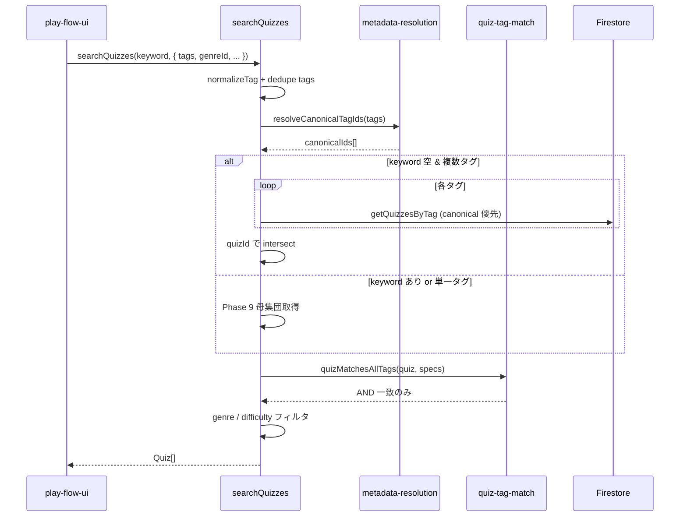

### タグマスタ一覧フロー（Phase 10）

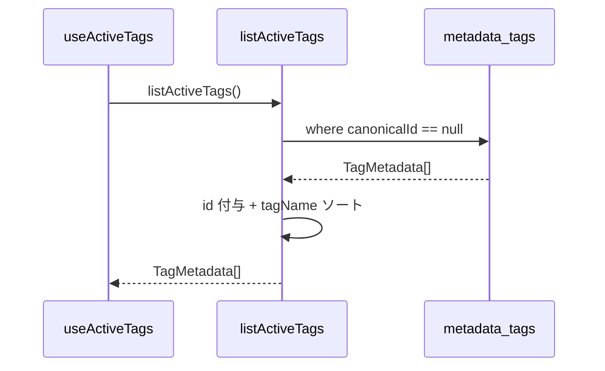

### 出題形式フィルタ付き複合検索フロー（Phase 11）

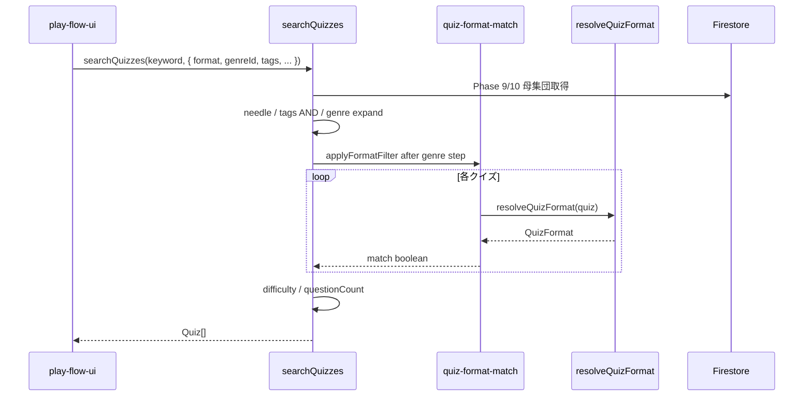

### 検索ログ fire-and-forget フロー（Phase 10 スマートサジェスト追記）

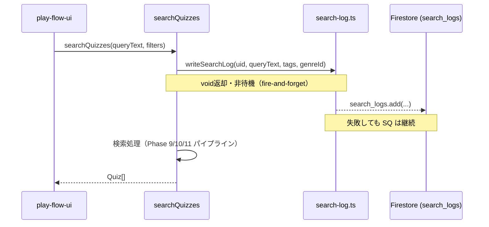

**フロー上の決定**:
- `writeSearchLog` は `async` だが `await` せず `void` で呼び出す。完了を待たないため検索レイテンシに影響しない。
- 未認証（uid なし）または空クエリの場合は `writeSearchLog` を呼び出さず早期リターン。
- `search_logs` ドキュメントの内部エラーは `console.error` のみ（据広げしない）。

### 週間人気ジャンル Top5 集計フロー（Phase 10 スマートサジェスト追記）

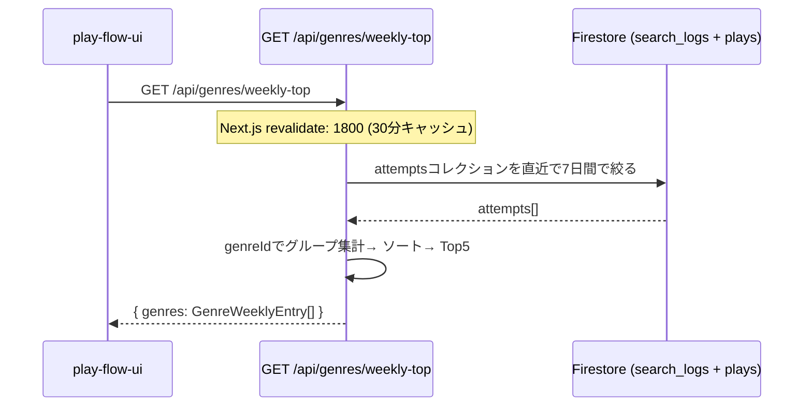

**フロー上の決定**:
- `attempts` コレクションを集計源とする（`completedAt >= now - 7日` フィルタ）。`search_logs` はアクセスログ疲の統計に使わず、実際のプレイ完了数を正確に反映するため `attempts` 連用。
- `status === 'published'` で有効なジャンルがある attempt のみ集計対象（test-play attempt を含む不完全な attempt は失敗してもスキップ）。
- API エラー時は HTTP 500 を返し、代替データフォールバックを和えない（要件 18.5）。

### 週間人気ワード／タグ Top5 集計フロー（Phase 10 スマートサジェスト追記）

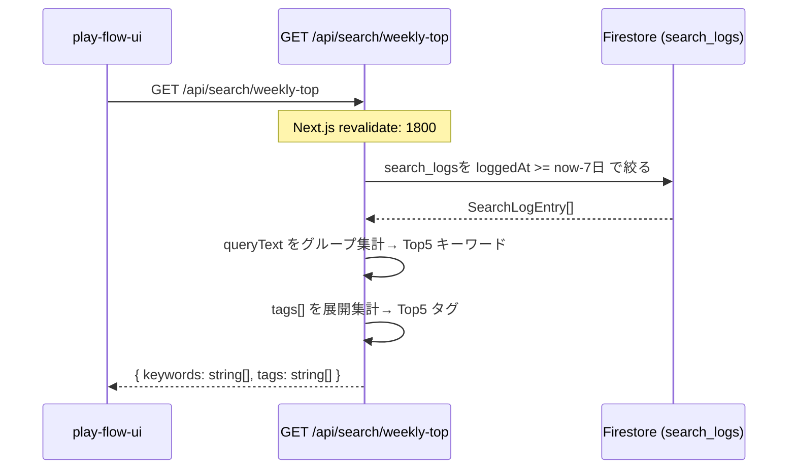

**フロー上の決定**:
- `queryText` が空なログはキーワード集計から除外。`tags` が空のログはタグ集計から除外。
- キーワードとタグは別フィールドで返す（要件 18.8）。
- API エラー時は HTTP 500、代替データフォールバックなし（要件 18.10）。


### クイズリーダーボード更新フロー（`saveAttempt` / `verify-truth` 共通）

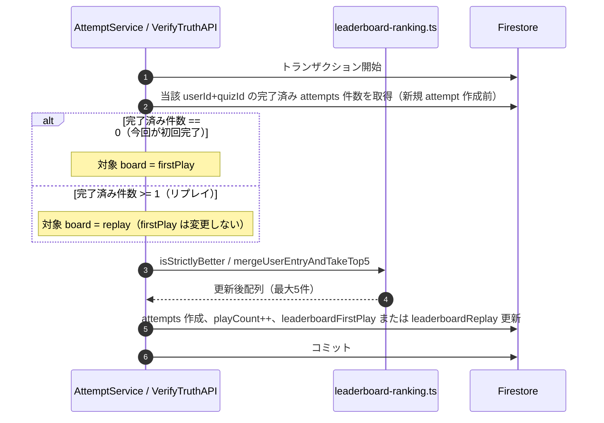

**フロー上の決定**: 全問正解チェックは行わない。ゲスト・`test-play` は LB 更新対象外（attempt 永続化自体が行われない）。

### 水平思考クイズ（ウミガメのスープ）ステートフルAI質問対話フロー

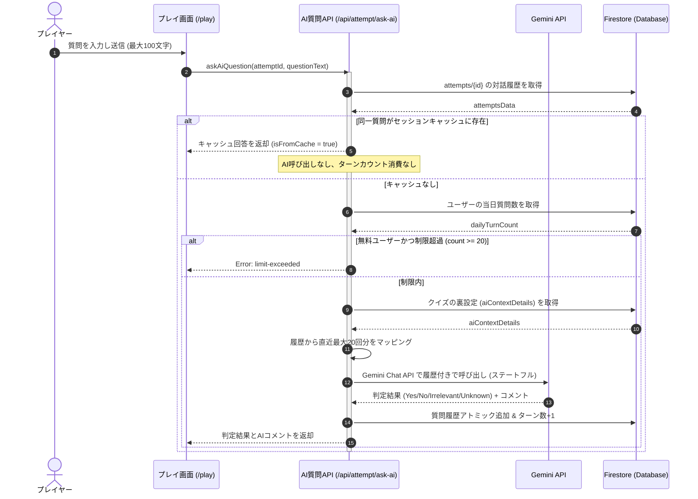

### 水平思考クイズ（ウミガメのスープ）B2 ハイブリッド真相自動判定フロー

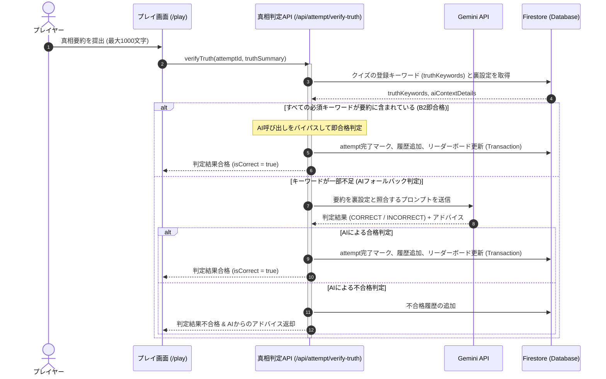

### ユーザー退会・非同期データクレンジングフロー

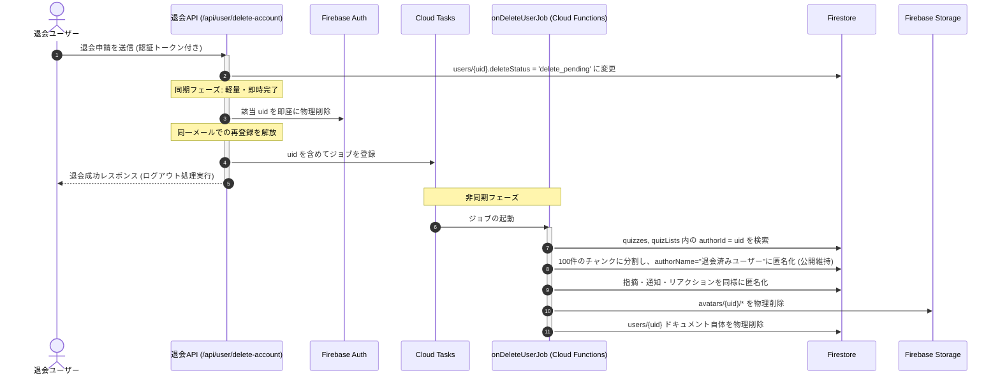

### クイズ保存時のメタデータ解決フロー（Phase 6）

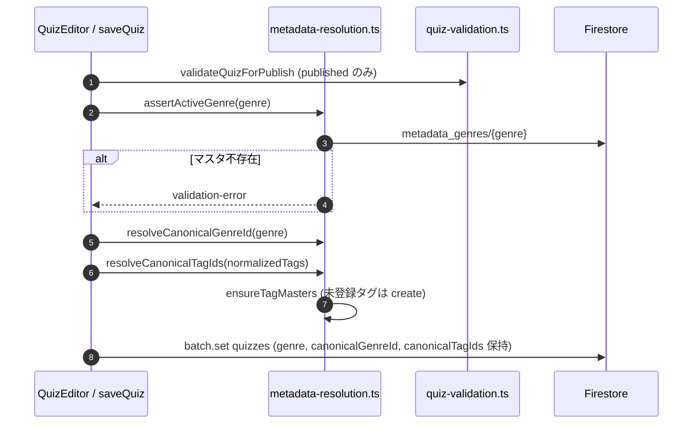

**フロー上の決定**: `genre` 表示用文字列は変更しない。下書きもジャンル必須（要件2.1）。テストプレイは `saveQuiz` を経由せず canonical 未設定を許容。

### ジャンル別公開クイズ一覧（C2 読み取り）フロー（Phase 6）

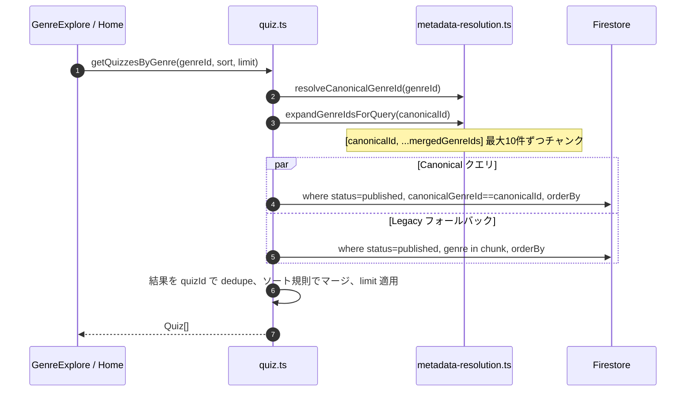

**フロー上の決定**: 正規識別子が空の legacy クイズは `genre in` のみヒット。canonical ヒットと legacy ヒットの重複は `id` で除去。

---

## Requirements Traceability

| Requirement | Summary                                               | Components                         | Interfaces                                  | Flows                           |
| ----------- | ----------------------------------------------------- | ---------------------------------- | ------------------------------------------- | ------------------------------- |
| 1.1         | ユーザー登録および認証                                | User Authentication                | Firebase Auth                               | -                               |
| 1.2         | プロフィール編集                                      | `UserService`                      | `updateProfile`                             | -                               |
| 1.3         | 称号バッジ自動付与                                    | `UserService`                      | `checkAndAwardBadges`                       | -                               |
| 1.4         | 退会時即時Auth削除                                    | `DeleteAccountAPI`                 | `/api/user/delete-account`                  | 退会フロー                      |
| 1.5         | 大規模関連データの非同期匿名化                        | `onDeleteUserJob`                  | Cloud Functions Trigger                     | 退会フロー                      |
| 1.6         | 退会保留中のアクセス遮断                              | Security Rules                     | `deleteStatus != 'delete_pending'`          | -                               |
| 2.1         | 下書き（タイトル・ジャンル・問題文必須）              | `QuizService`                      | `saveQuiz('draft')`                         | メタデータ解決フロー            |
| 2.2         | ジャンルマスタ存在検証                                | `metadata-resolution`              | `assertActiveGenre`                         | メタデータ解決フロー            |
| 2.3         | 公開時バリデーション & NGチェック                     | `QuizService`                      | `saveQuiz('published')`                     | メタデータ解決フロー            |
| 2.4         | 保存時 canonical 非正規化                             | `metadata-resolution`              | `resolveCanonical*`                         | メタデータ解決フロー            |
| 2.5         | 未登録タグのマスタ自動 create                         | `metadata-resolution`              | `ensureTagMasters`                          | メタデータ解決フロー            |
| 2.6         | タグ名寄せ & 類似サジェスト                           | `QuizService`                      | `normalizeTag`, `getSimilarTag`             | -                               |
| 2.7         | クイズタイトル更新時の非正規化同期                    | `QuizService`                      | `updateQuiz`                                | -                               |
| 2.8         | クイズ削除時のカスケードクリーンアップ                | `QuizService`                      | `deleteQuiz`                                | -                               |
| 2.9         | 作成クイズ一括エクスポート                            | `QuizService`                      | `exportQuizzes`                             | -                               |
| 2.10        | 必須キーワード(エッセンス)のタグ風UI入力              | `QuizCreator` / UI                 | `truthKeywords`                             | -                               |
| 2.11        | 公開時必須キーワードバリデーション                    | `QuizService`                      | `validateQuizForPublish`                    | -                               |
| 2.12        | テストプレイは canonical 不要                         | `test-play`                        | sessionStorage 経路                         | -                               |
| 3.1         | 通常モードプレイ                                      | `AttemptService`                   | `saveAttempt`                               | -                               |
| 3.2         | 解答セッションローカル永続化                          | `LocalAttemptSession`              | `saveToLocalStorage`                        | -                               |
| 3.3         | オフラインプレイ結果と自動同期                        | `LocalAttemptSession`              | `syncPendingAttempts`                       | -                               |
| 3.4         | オフラインリストプレイの進行ブロック                  | `LocalAttemptSession`              | `checkConnectivity`                         | -                               |
| 3.5         | プレイ結果画面（良問評価・難易度投票）                | `ReviewService`                    | `submitReview`                              | -                               |
| 3.6         | 永続化試行保存とLB更新委譲                            | `AttemptService`                   | `saveAttempt`                               | リーダーボード更新フロー        |
| 3.7         | 弱点克服ジャンルフィルタ（マージ展開）                | `AttemptService`                   | `getFailedQuestions`                        | -                               |
| 9.1         | 永続化完了時のLB評価                                  | `AttemptService`                   | `saveAttempt`                               | リーダーボード更新フロー        |
| 9.2         | 初回完了は firstPlay のみ                             | `AttemptService`                   | `saveAttempt` (tx)                          | リーダーボード更新フロー        |
| 9.3         | 2回目以降は replay のみ                               | `AttemptService`                   | `saveAttempt` (tx)                          | リーダーボード更新フロー        |
| 9.4         | 正解数優先・同点タイム順                              | `leaderboard-ranking.ts`           | `compareLeaderboard`                        | -                               |
| 9.5         | ユーザー1枠・厳密優位時のみ差し替え                   | `leaderboard-ranking.ts`           | `mergeUserEntryAndTakeTop5`                 | -                               |
| 9.6         | 上位5件保持                                           | `leaderboard-ranking.ts`           | `mergeUserEntryAndTakeTop5`                 | -                               |
| 9.7         | 全問正解不要                                          | `AttemptService`                   | `saveAttempt`                               | -                               |
| 9.8         | ウミガメ合格時の同一LB規則                            | `VerifyTruthAPI`                   | `/api/attempt/verify-truth`                 | 真相判定フロー                  |
| 10.1        | 本人履歴・完了日時降順                                | `AttemptService` / PlayHistoryAPI  | `listUserPlayHistory`                       | -                               |
| 10.2        | test-play 除外                                        | `AttemptService`                   | `listUserPlayHistory`                       | -                               |
| 10.3        | 表示用メタデータ                                      | `AttemptService`                   | `listUserPlayHistory`                       | -                               |
| 10.4        | 初回20件+カーソル                                     | `PlayHistoryAPI`                   | `GET /api/user/play-history`                | -                               |
| 10.5        | 他人の履歴拒否                                        | `PlayHistoryAPI`                   | `GET /api/user/play-history`                | -                               |
| 4.1         | 最大20回分の会話履歴を参照したステートフルAI質問      | `AskAiQuestionAPI`                 | `/api/attempt/ask-ai`                       | 質問対話フロー                  |
| 4.2         | 無料ユーザーの1日20回制限                             | `AskAiQuestionAPI`                 | `/api/attempt/ask-ai`                       | 質問対話フロー                  |
| 4.3         | 同一質問キャッシュ                                    | `AskAiQuestionAPI`                 | `/api/attempt/ask-ai`                       | 質問対話フロー                  |
| 4.4         | プレイ画面2カラムレイアウト                           | UI Component                       | `LateralThinkingPlayView`                   | -                               |
| 4.5         | 必須キーワード一致による即合格(AIバイパス)            | `VerifyTruthAPI`                   | `/api/attempt/verify-truth`                 | 真相判定フロー                  |
| 4.6         | キーワード不足時のAIフォールバック真相判定            | `VerifyTruthAPI`                   | `/api/attempt/verify-truth`                 | 真相判定フロー                  |
| 4.7         | 真相不合格時のAIアドバイスフィードバック              | `VerifyTruthAPI`                   | `/api/attempt/verify-truth`                 | 真相判定フロー                  |
| 5.1         | フォロー/フォロワーアトミック更新                     | `UserService`                      | `followUser`                                | -                               |
| 5.2         | タイムラインフィード表示                              | `QuizService`                      | `getFollowedTimeline`                       | -                               |
| 5.3         | ブックマークアトミック更新                            | `BookmarkService`                  | `toggleBookmark`                            | -                               |
| 5.4         | クイズリスト作成・編集・削除                          | `QuizListService`                  | `createQuizList`                            | -                               |
| 5.5         | リスト連続プレイ (Attempt.listId)                     | `AttemptService`                   | `saveAttempt(mode='list')`                  | -                               |
| 5.6         | クイズリストパッケージエクスポート                    | `QuizListService`                  | `exportQuizList`                            | -                               |
| 6.1         | クローズド指摘フィードバック送信                      | `ReviewService`                    | `submitFeedbackReport`                      | -                               |
| 6.2         | 指摘解決時の修正完了オート通知                        | `ReviewService`                    | `resolveReport`                             | -                               |
| 6.3         | 👍/👎良問投票（作成者除外）                             | `ReviewService`                    | `submitReview`                              | -                               |
| 6.4         | 仮リセット期間中の評価マスク                          | UI Component                       | `QuizDetailView`                            | -                               |
| 6.5         | 評価リセット承認時の非同期クリーンアップ              | `ReviewService`                    | `resetReviews`                              | -                               |
| 7.1         | コンテンツ通報とアトミック更新                        | `ModerationService`                | `flagContent`                               | -                               |
| 7.2         | 5回通報時の自動保留（非公開）                         | `ModerationService`                | `flagContent` (Function)                    | -                               |
| 7.3         | 管理者審査（公開復帰/永久非公開）                     | `ModerationService`                | `resolveFlag`                               | -                               |
| 7.4         | タグ/ジャンル仮想マージ提案・投票                     | `TagMergeService`                  | `createMergeRequest`, `voteMergeRequest`    | -                               |
| 7.5         | マージ可決 70%                                        | `TagMergeService`                  | `voteMergeRequest` (tx)                     | -                               |
| 7.6         | 新ジャンル申請                                        | `TagMergeService`                  | `submitGenreRequest`                        | -                               |
| 7.7         | ジャンルアイコン SVG 禁止                             | `storage.ts` / UI                  | `uploadImage` MIME 検証                     | -                               |
| 7.8         | ジャンル新設可決 80%                                  | `TagMergeService`                  | `voteGenreRequest`                          | -                               |
| 11.1        | ジャンル一覧（マージ統合）                            | `QuizService`                      | `getQuizzesByGenre`                         | C2 読み取りフロー               |
| 11.2        | canonical 優先 + legacy フォールバック                | `QuizService`                      | `getQuizzesByGenre`                         | C2 読み取りフロー               |
| 11.3        | タグ一覧（canonical）                                 | `QuizService`                      | `getQuizzesByTag`                           | -                               |
| 11.4        | 有効ジャンルマスタ一覧                                | `QuizService`                      | `listActiveGenres`                          | -                               |
| 11.5        | 複合検索                                              | `QuizService`                      | `searchQuizzes`                             | -                               |
| 11.6        | メタデータ Rules                                      | `firestore.rules`                  | metadata_* / mergeRequests                  | -                               |
| 11.7        | ガバナンス単一経路                                    | `TagMergeService`                  | `tagMerge.ts` のみ                          | -                               |
| 11.8        | クイズの統合検索 (ユニバーサル検索)                   | `QuizService`                      | `searchQuizzes`                             | -                               |
| 11.9        | ハイブリッド・マルチクエリ検索 (並行クエリとデデュプ) | `QuizService`                      | `searchQuizzes`                             | -                               |
| 16.1–16.5   | 有効タグマスタ一覧                                    | `QuizService`                      | `listActiveTags`                            | タグマスタ読み取りフロー        |
| 16.6–16.13  | 複数タグ AND 複合検索                                 | `QuizService`, `quiz-tag-match`    | `searchQuizzes`, `resolveCanonicalTagIds`   | タグ AND 検索フロー             |
| 16.14–16.15 | サジェスト API 非対象                                 | —                                  | Out of boundary                             | -                               |
| 17.1–17.3   | 出題形式フィルタ                                      | `QuizService`, `quiz-format-match` | `SearchFilters.format`, `resolveQuizFormat` | 形式フィルタ検索フロー          |
| 17.4–17.5   | ジャンル固定 scoped 検索                              | `QuizService`                      | `searchQuizzes` + `expandGenreIdsForQuery`  | 形式フィルタ検索フロー          |
| 17.6        | UI と同一形式判定                                     | `quiz-format-match`                | `resolveQuizFormat`                         | -                               |
| 17.7–17.8   | インデックス/UI Out                                   | —                                  | Out of boundary                             | -                               |
| 18.1–18.5   | 週間人気ジャンル Top5 集計                            | `GenresWeeklyTopAPI`               | `GET /api/genres/weekly-top`                | 週間ジャンル Top5 フロー        |
| 18.6–18.10  | 週間人気ワード／タグ Top5 集計                        | `SearchWeeklyTopAPI`               | `GET /api/search/weekly-top`                | 週間ワード／タグ Top5 フロー    |
| 18.11–18.13 | 検索ログ記録（fire-and-forget）                       | `QuizService`, `search-log`        | `writeSearchLog`                            | 検索ログ fire-and-forget フロー |
| 18.14–18.16 | 境界明示（履歴は UI 側、Core 不保存）                 | —                                  | Out of boundary                             | -                               |
| 12.1        | ユーザーのBANと監査ログ記録                           | `ReputationService` / API Route    | `/api/admin/users/ban`                      | -                               |
| 12.2        | BAN解除と監査ログ記録                                 | `ReputationService` / API Route    | `/api/admin/users/unban`                    | -                               |
| 12.3        | BAN中の書き込み拒否と強制ログアウト                   | Security Rules / AuthContext       | `isNotBanned()`, `quizeum_banned` Cookie    | -                               |
| 8.1         | 初期HTML読み込み速度0.5秒以内                         | Performance                        | SSR Cache / Optimization                    | -                               |
| 8.2         | 高負荷時エラー率0.1%未満                              | Infrastructure                     | High Availability                           | -                               |
| 8.3         | クローラー向け高速HTMLとOGPメタデータ                 | SSR Component                      | `getServerSideProps` / Metadata             | -                               |

---

## Components and Interfaces

### Component Summary Table

| Component                   | Domain/Layer | Intent                                                                 | Req Coverage                                     | Key Dependencies (P0/P1)                                                              | Contracts             |
| --------------------------- | ------------ | ---------------------------------------------------------------------- | ------------------------------------------------ | ------------------------------------------------------------------------------------- | --------------------- |
| `UserService`               | Service      | ユーザープロフィール、称号、フォロー管理                               | 1.2, 1.3, 5.1                                    | Firestore (P0)                                                                        | Service, State        |
| `metadata-resolution`       | Lib          | canonical 解決・マージ ID 展開・タグマスタ ensure                      | 2.2, 2.4, 2.5, 11.x                              | Firestore (P0)                                                                        | Pure functions + IO   |
| `QuizService`               | Service      | クイズ保存・一覧・検索・エクスポート                                   | 2.1–2.9, 11.1–11.5, 16.1–16.13, 17.1–17.5        | metadata-resolution (P0), quiz-tag-match (P0), quiz-format-match (P0), Firestore (P0) | Service               |
| `quiz-tag-match`            | Lib          | クイズ×タグの canonical/legacy 照合（AND 用）                          | 16.7, 16.8                                       | normalizeTag (P0)                                                                     | Pure functions        |
| `quiz-format-match`         | Lib          | クイズ×出題形式の一致判定（`resolveQuizFormat` 使用）                  | 17.1, 17.6                                       | quiz-format (P0)                                                                      | Pure functions        |
| `TagMergeService`           | Service      | マージ投票・ジャンル新設（`tagMerge.ts`）                              | 7.4–7.8, 11.7                                    | Firestore (P0)                                                                        | Service, State        |
| `leaderboard-ranking`       | Lib          | LB順位比較・マージ・top5                                               | 9.4, 9.5, 9.6                                    | -                                                                                     | Pure functions        |
| `AttemptService`            | Service      | 解答永続化、LB更新、本人プレイ履歴、オフライン同期                     | 3.1, 3.2, 3.3, 3.4, 3.6, 5.5, 9.1–9.7, 10.1–10.3 | Firestore (P0), LocalStore (P1), leaderboard-ranking (P0)                             | Service, State, Batch |
| `/api/genres/weekly-top`    | API Route    | 週間人気ジャンル Top5 集計（attemptsコレクションかまの直近 7日間集計） | 18.1–18.5                                        | Firestore Admin SDK (P0)                                                              | HTTP GET, 30min cache |
| `/api/search/weekly-top`    | API Route    | 週間人気ワード／タグ Top5 集計（search_logsから）                      | 18.6–18.10                                       | Firestore Admin SDK (P0)                                                              | HTTP GET, 30min cache |
| `search-log`                | Lib          | fire-and-forget 検索ログ書き込み                                       | 18.11–18.13                                      | Firestore (P0)                                                                        | Pure function + IO    |
| `/api/user/play-history`    | API Route    | 本人プレイ履歴の認可付き取得                                           | 10.1, 10.4, 10.5                                 | AuthAdmin (P0), AttemptService (P0)                                                   | API                   |
| `BookmarkService`           | Service      | クイズ・リストのブックマークアトミック管理                             | 5.3                                              | Firestore (P0)                                                                        | Service, State        |
| `QuizListService`           | Service      | リストの作成、ドラッグ＆ドロップ、パッケージング                       | 5.4, 5.6                                         | Firestore (P0), QuizService (P1)                                                      | Service, State        |
| `ReviewService`             | Service      | 良問評価、間違い指摘、修正通知、リセットバッチ                         | 3.5, 6.1, 6.2, 6.3, 6.5                          | Firestore (P0), CloudTasks (P1)                                                       | Service, State, Batch |
| `ModerationService`         | Service      | 通報、自動保留、審査のみ                                               | 7.1, 7.2, 7.3                                    | Firestore (P0)                                                                        | Service, State        |
| `ReputationService`         | Service      | 信頼スコア、モデレータ資格、BAN/UNBAN、監査ログ記録                    | 12.1, 12.2                                       | Firestore (P0)                                                                        | Service, State, Tx    |
| `/api/admin/users/ban`      | API Route    | 管理者用ユーザーBAN API                                                | 12.1                                             | AuthAdmin (P0), ReputationService (P0)                                                | API                   |
| `/api/admin/users/unban`    | API Route    | 管理者用ユーザーUNBAN API                                              | 12.2                                             | AuthAdmin (P0), ReputationService (P0)                                                | API                   |
| `/api/user/delete-account`  | API Route    | 即時Auth物理削除とCloud Tasksジョブ登録                                | 1.4                                              | AuthAdmin (P0), CloudTasks (P0)                                                       | API                   |
| `/api/attempt/ask-ai`       | API Route    | 水平思考クイズのAI質問判定 (ターン制限・キャッシュ)                    | 4.1, 4.2, 4.3                                    | Gemini API (P0), Firestore (P0)                                                       | API                   |
| `/api/attempt/verify-truth` | API Route    | 水平思考クイズのAI真相自動判定とフィードバック                         | 4.5, 4.6, 4.7                                    | Gemini API (P0), Firestore (P0)                                                       | API                   |

---

### Component Interface Details

#### `UserService`
- **Intent**: ユーザープロフィール情報の管理、アトミックな称号バッジ付与、フォロー管理。
- **Requirements**: `1.2, 1.3, 5.1`

```typescript
export interface UserService {
  // プロフィール更新 (1.2)
  updateProfile(uid: string, data: { displayName: string; bio: string; followedGenres: string[] }): Promise<void>;
  
  // 称号バッジの判定とアトミック付与 (1.3)
  checkAndAwardBadges(uid: string): Promise<Badge[]>;
  
  // ユーザーのフォロー/解除トグル (5.1)
  followUser(followerId: string, followingId: string): Promise<{ isFollowing: boolean }>;
}
```
- **Preconditions**: `uid` が Firebase Auth 上で認証されていること。
- **Postconditions**: 称号バッジ付与時に条件を満たした場合、`users.badges` 配列にアトミックに Badge オブジェクトが追加される。

#### `metadata-resolution`
- **Intent**: ジャンル・タグの canonical 解決、マージ ID 展開、保存時マスタ整合を単一実装に集約。
- **Requirements**: `2.2, 2.4, 2.5, 11.2`

```typescript
export interface GenreMetadata {
  id: string;
  displayName: string;
  iconImageUrl: string | null;
  canonicalId: string | null;
  mergedGenreIds: string[];
  isActive: boolean;
}

/** ジャンルID → 統合先 canonical ID（自身が canonical なら自分） */
export async function resolveCanonicalGenreId(genreId: string): Promise<string>;

/** 正規化タグID配列 → canonicalTagIds（マスタ参照） */
export async function resolveCanonicalTagIds(tagIds: string[]): Promise<string[]>;

/** 一覧用: [canonicalId, ...mergedGenreIds] を dedupe（Firestore in 上限10でチャンク） */
export function chunkIdsForInQuery(ids: string[], chunkSize?: number): string[][];

export async function expandGenreIdsForQuery(genreId: string): Promise<string[]>;

export async function assertActiveGenre(genreId: string): Promise<void>;

/** 未登録タグを metadata_tags に create（canonicalId=null, mergedTagIds=[]） */
export async function ensureTagMasters(
  tagIds: string[],
  createdBy: string
): Promise<void>;
```
- **Invariants**: `resolveCanonicalGenreId` は `canonicalId` チェーンを辿り循環を検出。`genre` 表示値は変更しない。

#### `QuizService`
- **Intent**: クイズの保存、編集、Zod検証、NGワード二重検証付き公開、ジャンル/タグ一覧・複合検索、エクスポート。
- **Requirements**: `2.1–2.9, 11.1–11.5, 16.1–16.13, 17.1–17.5`

```typescript
export type QuizListSort = 'latest' | 'popular' | 'trending';

export interface SearchFilters {
  genreId?: string;
  /** 正規化済みタグ識別子の配列。複数指定時は AND（すべてを含むクイズのみ） */
  tags?: string[];
  /** 出題形式。`resolveQuizFormat` 結果と一致するクイズのみ返す（Phase 11） */
  format?: QuizFormat;
  difficultyMin?: number;
  difficultyMax?: number;
  minQuestions?: number;
  maxQuestions?: number;
}

export interface QuizService {
  saveQuiz(
    quiz: Omit<Quiz, 'id' | 'playCount' | 'bookmarksCount' | 'createdAt' | 'updatedAt'>,
    status: 'draft' | 'published'
  ): Promise<string>;
  normalizeTag(input: string): string;
  getSimilarTagSuggest(tag: string): Promise<string | null>;
  listActiveGenres(): Promise<GenreMetadata[]>;
  /** 存続タグ（canonicalId == null）のみ。UI サジェスト用 */
  listActiveTags(): Promise<TagMetadata[]>;
  getQuizzesByGenre(genreId: string, sort: QuizListSort, limit: number): Promise<Quiz[]>;
  getQuizzesByTag(tagId: string, sort: QuizListSort, limit: number): Promise<Quiz[]>;
  searchQuizzes(
    queryText: string,
    filters: SearchFilters,
    currentUserId?: string
  ): Promise<Quiz[]>;
  deleteQuiz(quizId: string): Promise<void>;
  exportQuizzes(uid: string): Promise<QuizExportPackage>;
}
```
- **Validation Hooks**: `saveQuiz` 内で `assertActiveGenre` → `resolveCanonicalGenreId` / `resolveCanonicalTagIds` → `ensureTagMasters` の順。公開時は既存 Zod + NG チェック。
- **`getQuizzesByGenre`（C2）**: (1) `canonicalGenreId == resolvedCanonicalId` クエリ (2) `genre in expandIds` チャンククエリ (3) `Map<id, Quiz>` で dedupe、(4) `sort` に応じてマージソート。
- **`getQuizzesByTag`**: 第一選択 `where('canonicalTagIds','array-contains', resolvedTagId)`。フォールバック `tags array-contains` は legacy 用に残す。
- **`searchQuizzes` (Phase 9 統合検索)**: 
  - `queryText` が指定された場合、大文字小文字を無視した並行 Firestore クエリを実行して母集団となるクイズ一覧を取得し、クライアントサイドで統合（`id` で dedupe）する：
    1. タグ一致クエリ: `where('tags', 'array-contains', normalizedQuery)` (タグ正規化適用)
    2. 作者名完全一致クエリ: `where('authorName', '==', queryText)`
    3. ジャンル一致クエリ: `getQuizzesByGenre(queryText, 100)` (マージされたジャンルもカバー)
    4. 新着クイズクエリ (全体母集団の担保): `getLatestQuizzes(100)`
  - 重複排除されたクイズ配列に対し、アプリ（サービス）層で `title`, `description`, `authorName`, `genre`, `tags` のいずれかが `queryText` (小文字化された needle) を含むかどうかの部分一致フィルタをかける。
  - さらに、詳細フィルター（`difficultyMin/Max`, `minQuestions/MaxQuestions`）を適用して最終結果を返す。
- **`listActiveTags`（Phase 10）**:
  - `metadata_tags` を `where('canonicalId', '==', null)` で読み取り（マージ吸収済みタグは除外）。
  - 各 doc に `id: doc.id` を付与。`tagName` が無い場合も `id` で返す。
  - `tagName` の `localeCompare('ja')` で昇順ソート（同順時は `id`）。
  - 0 件は `[]`。失敗時は例外をそのまま throw（ハードコードフォールバック禁止）。
- **`searchQuizzes` タグ AND 拡張（Phase 10）**:
  1. `filters.tags` を受け取り、各要素を `normalizeTag` → `Set` で重複除去。
  2. `resolveCanonicalTagIds` で canonical ID 配列を得る（入力と同順、1:1 対応の `TagMatchSpec[]` を構築）。
  3. **母集団 `base` の決定**（既存 Phase 9 ロジックを維持）:
     - `needle` あり → 既存の並行クエリ＋dedupe。
     - `needle` なし・`tags` のみ（1 件）→ `getQuizzesByTag(tags[0], 100, 'latest')` を第一候補。
     - `needle` なし・`tags` 複数 → 各タグで `getQuizzesByTag` を実行し、`quiz.id` で集合積（intersect）して母集団化（上限 100/タグ）。
     - `needle` なし・タグなし → 既存どおり `genreId` または `getLatestQuizzes`。
  4. **キーワード部分一致**（`needle` あり時）— 既存フィルタを適用。
  5. **`quizMatchesAllTags(quiz, specs)`** で AND 絞り込み（`tags` 未指定時はスキップ）。
  6. **ジャンルフィルタ** — `expandGenreIdsForQuery` + `genre` / `canonicalGenreId` 照合（`genreId` 未指定時はスキップ）。
  7. **出題形式フィルタ（Phase 11）** — `filters.format` 指定時のみ `quizMatchesFormat` を適用（未指定時はスキップ）。
  8. **数値フィルタ** — `difficultyMin/Max`, `minQuestions/maxQuestions`。
- **Canonical パイプライン順序（Phase 9–11 統一）**: `母集団取得 → needle 部分一致 → tags AND → genre → format → difficulty/questionCount`。すべて AND 合成。実装はこの順序で後段フィルタを適用すること（デバッグ・テストの期待値固定用）。
- **`searchQuizzes` 出題形式フィルタ拡張（Phase 11）** — 上記ステップ 7 の詳細:
  1. 判定は **`quiz.format` 直読み禁止**。必ず `resolveQuizFormat({ format: quiz.format, questions: quiz.questions })` と比較（要件 17.6）。`QuizCard` / 形式カルーセルと同一 lib を使用。
  2. **scoped 検索（要件 17.4–17.5）**: ジャンル別一覧ページは UI が `genreId` を常に渡す。ステップ 6 により他ジャンルは除外済み。形式・タグ・キーワードは追加 AND。
  3. **母集団と形式のみ指定**: `needle` 空・`tags` 空・`genreId` 空・`format` あり → 既存どおり `getLatestQuizzes(100)` を母集団とし、ステップ 7 で形式フィルタ（上限 100 件は Phase 10 と同型の探索用途許容。Phase 11 Non-Goal）。
- **Note**: リーダーボード更新は `AttemptService` / `verify-truth` に集約。

#### `quiz-tag-match`（`src/lib/quiz-tag-match.ts`）

| Field        | Detail                                                                                  |
| ------------ | --------------------------------------------------------------------------------------- |
| Intent       | 単一クイズが指定タグ（canonical 解決済み）を満たすかを判定。複数タグ AND の共通ロジック |
| Requirements | 16.7, 16.8                                                                              |

```typescript
export interface TagMatchSpec {
  /** resolveCanonicalTagIds の結果 */
  canonicalId: string;
  /** normalizeTag 済みの入力タグ */
  normalizedInput: string;
}

/** 要件 11.3 と同型: canonicalTagIds 優先、legacy tags フォールバック */
export function quizMatchesTag(
  quiz: Pick<Quiz, 'tags' | 'canonicalTagIds'>,
  spec: TagMatchSpec
): boolean;

export function quizMatchesAllTags(
  quiz: Pick<Quiz, 'tags' | 'canonicalTagIds'>,
  specs: TagMatchSpec[]
): boolean;
```

- **照合順序**: (1) `quiz.canonicalTagIds` に `spec.canonicalId` が含まれる → 一致。(2) `quiz.tags` を `normalizeTag` した集合に `spec.normalizedInput` または `spec.canonicalId` が含まれる → 一致。(3) それ以外は不一致。
- **Invariants**: `getQuizzesByTag` と同一規則。UI 層はチップ値として `normalizeTag` 済み `id` を渡す。

#### `quiz-format-match`（`src/lib/quiz-format-match.ts`）

| Field        | Detail                                               |
| ------------ | ---------------------------------------------------- |
| Intent       | 単一クイズの有効出題形式が指定形式と一致するかを判定 |
| Requirements | 17.1, 17.6                                           |

```typescript
import type { QuizFormat } from './quiz-format';

/** resolveQuizFormat 結果と指定 format の厳密一致 */
export function quizMatchesFormat(
  quiz: Pick<Quiz, 'format' | 'questions'>,
  format: QuizFormat
): boolean;

/** format 未指定時は true（フィルタ無効） */
export function applyFormatFilter(
  quizzes: Quiz[],
  format?: QuizFormat
): Quiz[];
```

- **判定規則**: `resolveQuizFormat(quiz) === format`。`quiz.format` が未設定の旧データは問題 `type` から推定（`quiz-format.ts` 既存ロジック）。
- **レガシーデータ（validate-design 2026-06-05 反映）**: `quiz.format` 未設定かつ `questions` が空配列のとき、`resolveQuizFormat` は `'mixed'` を返す（既存 lib 挙動。要件 17.6 と一致）。このため **`format: 'mixed'` フィルタのみヒット**し、他形式フィルタでは不一致となる。テストフィクスチャ `{ format: undefined, questions: [] }` で期待値を固定する。
- **Invariants**: `quizeum-play-flow-ui` の `QuizCard` / 形式カルーセルは同一 `QuizFormat` 型および `getFormatLabel` を使用。コアはラベル変換を行わない。

#### `TagMergeService`（`src/services/tagMerge.ts`）
- **Intent**: マージ提案・投票、ジャンル新設申請・可決の単一実装（`moderation.ts` のジャンルスタブは削除）。
- **Requirements**: `7.4–7.8, 11.7`

```typescript
// 既存 export を維持: createMergeRequest, voteMergeRequest, submitGenreRequest, voteGenreRequest, runMigration
// 可決閾値: merge 70% (weightedFor>=5), genre 80% (weightedFor>=5)
```

#### `leaderboard-ranking`（純関数ライブラリ）
- **Intent**: 要件9の順位規則を単一実装に集約し、`saveAttempt` と `verify-truth` の重複を排除する。
- **Requirements**: `9.4, 9.5, 9.6`

```typescript
export type LeaderboardBoard = 'firstPlay' | 'replay';

/** a が b より上位なら負の数、同順位なら 0、下位なら正の数（sort 用） */
export function compareLeaderboardRecords(
  a: Pick<LeaderboardRecord, 'score' | 'elapsedSeconds'>,
  b: Pick<LeaderboardRecord, 'score' | 'elapsedSeconds'>
): number;

export function isStrictlyBetter(
  candidate: Pick<LeaderboardRecord, 'score' | 'elapsedSeconds'>,
  existing: Pick<LeaderboardRecord, 'score' | 'elapsedSeconds'>
): boolean;

export function mergeUserEntryAndTakeTop5(
  entries: LeaderboardRecord[],
  userId: string,
  incoming: Omit<LeaderboardRecord, 'completedAt'> & { completedAt: Date }
): LeaderboardRecord[];

export function resolveLeaderboardBoard(priorCompletedAttemptCount: number): LeaderboardBoard;
```
- **Invariants**: ソートは `score` 降順 → `elapsedSeconds` 昇順。返却配列は最大5要素。同一 `userId` は最大1件。

#### `AttemptService`
- **Intent**: プレイ結果の永続化、トランザクション内リーダーボード更新、本人プレイ履歴クエリ、オフライン同期。
- **Requirements**: `3.1, 3.2, 3.3, 3.4, 3.6, 5.5, 9.1–9.7, 10.1–10.3`

```typescript
export interface AttemptService {
  saveAttempt(attemptData: Omit<Attempt, 'id' | 'completedAt'>): Promise<string>;
  updateFailedQuestions(uid: string, quizId: string, solvedQuestionIds: string[]): Promise<void>;

  listUserPlayHistory(params: {
    uid: string;
    limit?: number;       // default 20
    cursor?: string | null;
  }): Promise<PlayHistoryPage>;
}

export interface PlayHistoryEntry {
  attemptId: string;
  quizId: string;
  quizTitle: string;
  score: number;
  totalQuestions: number;
  mode: Attempt['mode'];
  completedAt: Date;
  elapsedSeconds: number;
}

export interface PlayHistoryPage {
  items: PlayHistoryEntry[];
  nextCursor: string | null;
}
```
- **Preconditions (`saveAttempt`)**: `userId` がゲストでないこと。`score` / `totalQuestions` / `failedQuestionIds` の整合性検証は現行どおり。
- **Postconditions (`saveAttempt`)**: トランザクション内で prior 完了件数に基づき `firstPlay` または `replay` を更新。新記録が既存ユーザーエントリより優位でない場合は当該ユーザーのエントリは差し替えないが、他ユーザーとの競合で top5 から外れる可能性は許容する。
- **Implementation Notes**: クイズタイトルは `quizzes` を `quizId` でバッチ取得して `PlayHistoryEntry` に埋める。カーソルは `completedAt` + `attemptId` の不透明エンコード（例: Base64 JSON）。
- **Phase 6 (`getFailedQuestions`)**: `genreFilter` 指定時は `expandGenreIdsForQuery(genreFilter)` で ID 集合を得て、`quiz.genre` または `quiz.canonicalGenreId` が集合に含まれるかでフィルタ。

#### `/api/user/play-history`
- **Intent**: クライアントからの本人プレイ履歴取得を ID トークンで保護する。
- **Requirements**: `10.1, 10.4, 10.5`

| Method | Endpoint                 | Request                                                                 | Response          | Errors   |
| ------ | ------------------------ | ----------------------------------------------------------------------- | ----------------- | -------- |
| GET    | `/api/user/play-history` | Query: `limit?`, `cursor?` — Header: `Authorization: Bearer <ID_TOKEN>` | `PlayHistoryPage` | 401, 403 |

- **Preconditions**: `verifyIdToken` 成功。クエリの `uid` を受け付けない（トークンの `uid` のみ使用）。
- **Postconditions**: トークン `uid` と一致する履歴のみ返却。他人指定は 403。

---

## Data Models

### Domain Model

```typescript
// 1. ユーザー情報 (Users)
export interface User {
  id: string;
  email: string;
  displayName: string;
  avatarUrl: string;
  bio: string;
  followedGenres: string[];
  badges: Badge[];
  createdQuizzesCount: number;
  totalPlayCount: number;
  followersCount: number;
  followingCount: number;
  reputationScore: number;
  moderationTier: 'newcomer' | 'contributor' | 'moderator' | 'senior_moderator';
  reputationHistory: ReputationEventLog[];
  lastReputationCalculatedAt: Date | null;
  totalFailedQuestionsCount: number;
  deleteStatus: 'active' | 'delete_pending';
  isBanned?: boolean;            // BAN状態フラグ (12.1)
  bannedReason?: string;          // BAN理由 (12.1)
  bannedAt?: Date;                // BAN実行日時 (12.1)
  createdAt: Date;
  updatedAt: Date;
}

export interface Badge {
  id: string;
  title: string;
  description: string;
  iconName: string;
  unlockedAt: Date;
}

export interface ReputationEventLog {
  eventId: string;
  delta: number;
  reason: string;
  createdAt: Date;
}

// 2. クイズ (Quizzes)
export interface Quiz {
  id: string;
  authorId: string;
  authorName: string;
  authorAvatar: string;
  title: string;
  description: string;
  thumbnailUrl: string | null;
  difficulty: number; // 1〜5 の整数
  genre: string;
  tags: string[];
  originalTags: string[];
  questions: Question[];
  questionCount: number;
  status: 'draft' | 'published' | 'suspended';
  flagsCount: number;
  playCount: number;
  bookmarksCount: number;
  positiveCount: number;
  negativeCount: number;
  tempPositiveCount: number;
  tempNegativeCount: number;
  reviewScore: number | null;
  reviewBadge: string | null;
  isReviewMasked: boolean;
  activeResetRequestId: string | null;
  canonicalGenreId: string;
  canonicalTagIds: string[];
  /** @deprecated 読み取り互換のみ。書き込みは firstPlay / replay を使用 */
  leaderboard?: LeaderboardRecord[];
  leaderboardFirstPlay: LeaderboardRecord[];
  leaderboardReplay: LeaderboardRecord[];
  createdAt: Date;
  updatedAt: Date;
}

export interface Question {
  id: string;
  type: 'true-false' | 'multiple-choice' | 'text-input' | 'sorting' | 'association' | 'lateral-thinking';
  questionText: string;
  explanation: string;
  imageUrl: string | null;
  hint: string | null;
  limitTime: number | null;
  correctTextAnswerList?: string[];
  choices?: Choice[];
  sortingItems?: SortingItem[];
  associationHints?: string[];
  aiContextDetails?: string;
  truthKeywords?: string[]; // ウミガメスープ用必須正解キーワード (2.7)
  correctCount: number;
  incorrectCount: number;
}

export interface Choice {
  id: string;
  choiceText: string;
  isCorrect: boolean;
  selectedCount: number;
}

export interface SortingItem {
  id: string;
  text: string;
  correctOrder: number;
}

export interface LeaderboardRecord {
  userId: string;
  displayName: string;
  score: number;           // 正解数（第1キー）
  elapsedSeconds: number;  // 合計解答時間・秒（第2キー）
  completedAt: Date;
}

// 3. プレイ履歴 (Attempts)
export interface Attempt {
  id: string;
  userId: string;
  quizId: string;
  listId?: string;
  mode: 'normal' | 'exam' | 'flashcard' | 'review' | 'list';
  score: number;
  totalQuestions: number;
  elapsedSeconds: number;
  failedQuestionIds: string[];
  difficultyVote?: number | null;
  aiQuestionsHistory?: AiQuestion[];
  aiTurnCount: number;
  aiTurnLimit: number | null;
  completedAt: Date;
}

export interface AiQuestion {
  id: string;
  questionText: string;
  answerType: 'yes' | 'no' | 'irrelevant' | 'unknown';
  aiComment?: string;
  isFromCache: boolean;
  createdAt: Date;
}

// 4. 指摘レポート (feedbackReports)
export interface FeedbackReport {
  id: string;
  quizId: string;
  quizTitle: string;
  questionId: string;
  questionText: string;
  selectedChoiceText?: string;
  reporterId: string;
  creatorId: string;
  category: 'typo' | 'fact' | 'alternative';
  content: string;
  status: 'open' | 'resolved';
  createdAt: Date;
}
```

### Physical Data Model（Firestore `quizzes` 追記）

| フィールド             | 型                    | 制約              | 説明                             |
| ---------------------- | --------------------- | ----------------- | -------------------------------- |
| `leaderboardFirstPlay` | `LeaderboardRecord[]` | 最大5 / 必須 `[]` | 初回完了 attempt のランキング    |
| `leaderboardReplay`    | `LeaderboardRecord[]` | 最大5 / 必須 `[]` | 2回目以降のランキング            |
| `leaderboard`          | `LeaderboardRecord[]` | 任意              | 移行期間の読み取りフォールバック |

**`attempts` クエリ（プレイ履歴）**: `where('userId','==',uid)` + `orderBy('completedAt','desc')` + `limit` + `startAfter(cursor)`。`mode != 'test-play'` はクエリ後フィルタまたは将来 `where('mode','not-in',...)`（インデックス要検討）。

### Physical Data Model（メタデータ・Phase 6）

**`metadata_genres/{genreId}`**

| フィールド       | 型             | 説明                                 |
| ---------------- | -------------- | ------------------------------------ |
| `id`             | string         | ドキュメントIDと一致                 |
| `displayName`    | string         | 表示名                               |
| `iconImageUrl`   | string \| null | ジャンルアイコン URL                 |
| `canonicalId`    | string \| null | 統合先（自身が canonical なら null） |
| `mergedGenreIds` | string[]       | 統合された旧ジャンルID               |
| `isActive`       | boolean        | 探索・作問で利用可能                 |

**`quizzes` 追記（書き込み時解決）**

| フィールド         | 書き込みタイミング                 |
| ------------------ | ---------------------------------- |
| `canonicalGenreId` | 毎回 `saveQuiz`（draft/published） |
| `canonicalTagIds`  | 毎回 `saveQuiz`、タグ変更時再計算  |

**Firestore 複合インデックス（Phase 6 追加）**

| コレクション | フィールド                                                       | 用途               |
| ------------ | ---------------------------------------------------------------- | ------------------ |
| `quizzes`    | `status` ASC, `canonicalGenreId` ASC, `createdAt` DESC           | ジャンル一覧・新着 |
| `quizzes`    | `status` ASC, `canonicalGenreId` ASC, `playCount` DESC           | 人気               |
| `quizzes`    | `status` ASC, `canonicalGenreId` ASC, `bookmarksCount` DESC      | トレンド           |
| `quizzes`    | `status` ASC, `canonicalTagIds` ARRAY_CONTAINS, `createdAt` DESC | タグ一覧           |

### Migration Strategy

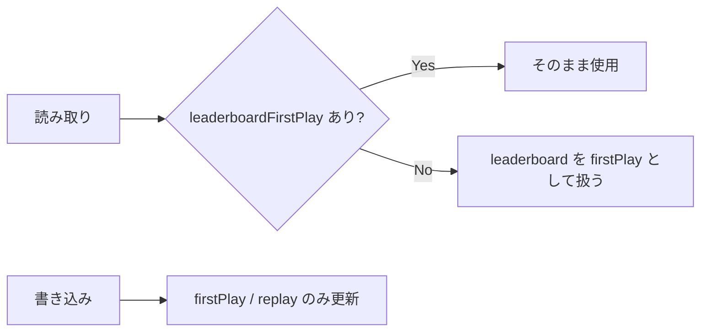

- 新規クイズ作成時は `leaderboardFirstPlay: []`, `leaderboardReplay: []` を初期化。
- 既存ドキュメントの一括移行スクリプトは Phase 5 対象外（手動／別タスク）。読み取り側で `leaderboard ?? []` を `leaderboardFirstPlay` のフォールバックとする。

**Phase 6 canonical バックフィル（任意・Out of scope）**

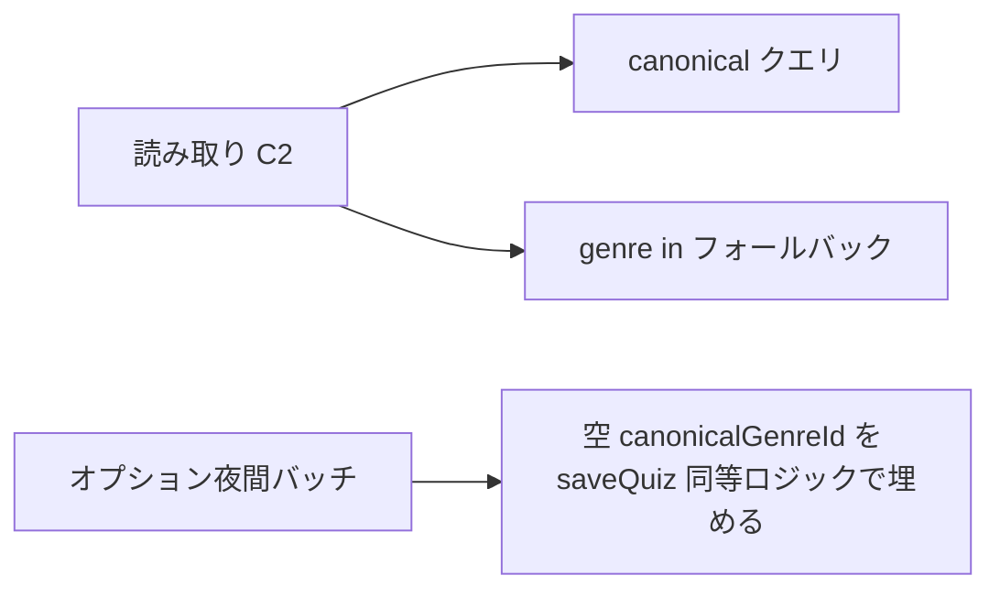

- 必須ではない: C2 フォールバックで legacy は一覧に含まれる。バッチは運用判断で別タスク。

---

## Phase 8: ブックマーク・リスト・問題再利用

### Architecture Pattern（Phase 8）

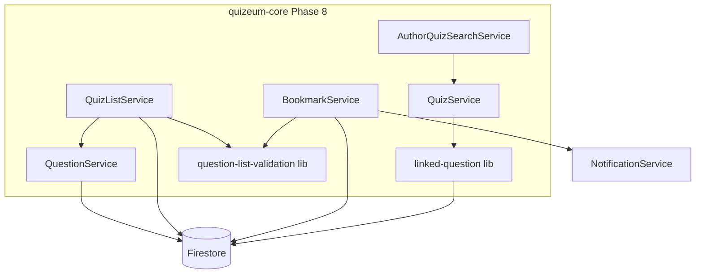

**パターン**: Option C Hybrid（gap 分析推奨）。既存サービスを拡張し、参照リンクと検証は `src/lib/` に純関数集約。UI は呼び出しのみ。

### 問題リストプレイ契約

クイズリスト（要件 5.5）と対称とし、問題リストは**収録問題ごとに1件の attempt** を記録する。

| フィールド       | 値                    |
| ---------------- | --------------------- |
| `mode`           | `'question-list'`     |
| `listId`         | 問題リスト ID         |
| `quizId`         | 当該問題の親クイズ ID |
| `totalQuestions` | 1（問題単位プレイ）   |

プレイ画面ルーティングは隣接 UI が担当。コアは `getQuestionsInList(listId)` で順序付き `Question[]` と親クイズメタを返す。

### 参照リンク保存フロー

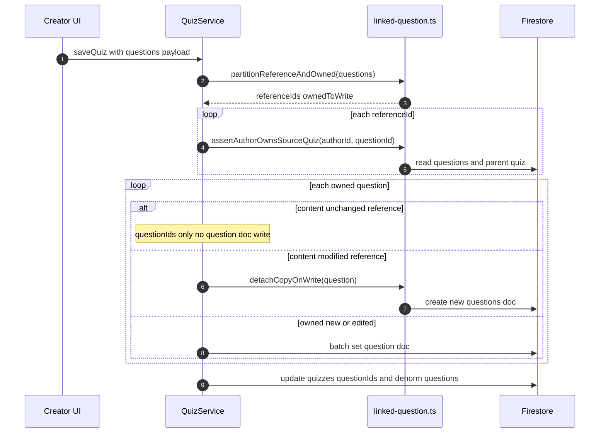

**Copy-on-Write 方針（design 確定）**: エディタが参照問題の内容を変更して保存した場合のみ新規 `questions/{id}` を発行し、当該クイズの `questionIds` を差し替える。未変更の参照は既存 ID をそのまま `questionIds` に追加し、問題ドキュメントへの書き込みは行わない。クイズから参照を外しただけでは問題ドキュメントを削除しない。

### Requirements Traceability（Phase 8）

| Requirement | Summary               | Components                                    | Interfaces                          | Flows            |
| ----------- | --------------------- | --------------------------------------------- | ----------------------------------- | ---------------- |
| 13.1        | 3種 BM トグル         | `BookmarkService`                             | `toggleBookmark`                    | -                |
| 13.2        | 公開問題のみ BM 登録  | `BookmarkService`, `question-list-validation` | `assertQuestionBookmarkable`        | -                |
| 13.3        | 非公開親は BM 拒否    | 同上                                          | 同上                                | -                |
| 13.4        | 3分類一覧             | `BookmarkService`                             | `getBookmarkFeed`                   | -                |
| 13.5        | クイズ BM 公開のみ    | `BookmarkService`                             | `getBookmarkedQuizzes`              | -                |
| 13.6        | 問題 BM に親メタ      | `BookmarkService`                             | `enrichBookmarkedQuestions`         | -                |
| 13.7        | 問題 BM 通知          | `BookmarkService`, `NotificationService`      | `createNotification`                | BM 成功後        |
| 14.1        | 作成時 listType       | `QuizListService`                             | `createQuizList`                    | -                |
| 14.2        | 未設定は quiz 扱い    | `QuizListService`                             | `resolveListType`                   | -                |
| 14.3        | クイズリスト操作      | `QuizListService`                             | `addQuizToList` 等                  | -                |
| 14.4        | 問題リストメンバー    | `QuestionService`                             | `addQuestionToList`                 | -                |
| 14.5–14.6   | 公開問題のみ追加      | `question-list-validation`                    | `assertQuestionListAddable`         | -                |
| 14.7        | タイプ不一致拒否      | `question-list-validation`                    | `assertListTypeOperation`           | -                |
| 14.8        | question-list attempt | `QuizListService`, `AttemptService`           | `getQuestionsInList`, `saveAttempt` | 問題リストプレイ |
| 14.9        | タイプ別一覧          | `QuizListService`                             | `getQuizListsByAuthor`              | -                |
| 14.10       | 問題リスト export     | `QuizListService`                             | `exportQuestionList`                | -                |
| 15.1        | 自作検索              | `AuthorQuizSearchService`                     | `searchAuthorQuizzes`               | -                |
| 15.2        | 問題詳細              | `QuestionService`                             | `getQuestionsByQuiz`                | -                |
| 15.3        | 参照リンク            | `QuizService`, `linked-question`              | `saveQuiz` 参照パス                 | 参照リンク保存   |
| 15.4        | 非自作拒否            | `linked-question`                             | `assertAuthorOwnsSourceQuiz`        | -                |
| 15.5        | 重複 doc 禁止         | `QuizService`                                 | 参照パス                            | 同上             |
| 15.6        | 参照解除のみ          | `linked-question`                             | `canDeleteQuestionDoc`              | -                |

### Components（Phase 8）

| Component                  | Domain  | Intent          | Req                  | Key Dependencies                             | Contracts      |
| -------------------------- | ------- | --------------- | -------------------- | -------------------------------------------- | -------------- |
| `BookmarkService`          | Service | 分類 BM と通知  | 13.1–13.7            | Firestore P0, validation P0, Notification P1 | Service        |
| `QuizListService`          | Service | listType リスト | 14.1–14.10           | Firestore P0, validation P0                  | Service        |
| `AuthorQuizSearchService`  | Service | 自作クイズ検索  | 15.1–15.2            | QuizService P0                               | Service        |
| `linked-question`          | Lib     | 参照リンク保存  | 15.3–15.6            | Firestore read P0                            | Pure functions |
| `question-list-validation` | Lib     | 公開/タイプ検証 | 13.2–13.3, 14.5–14.7 | Firestore read P0                            | Pure functions |

#### BookmarkService（Phase 8 拡張）

| Field        | Detail                                        |
| ------------ | --------------------------------------------- |
| Intent       | 3分類ブックマーク取得と問題 BM のガード・通知 |
| Requirements | 13.1–13.7                                     |

**Contracts**: Service

```typescript
interface BookmarkFeed {
  quizzes: Quiz[];
  lists: QuizList[];
  questions: BookmarkedQuestionEntry[];
}

interface BookmarkedQuestionEntry {
  question: Question;
  parentQuizId: string;
  parentQuizTitle: string;
  bookmarkedAt: Date;
}

interface BookmarkServicePhase8 {
  getBookmarkFeed(userId: string): Promise<BookmarkFeed>;
  toggleBookmark(
    userId: string,
    targetId: string,
    targetType: 'quiz' | 'list' | 'question'
  ): Promise<boolean>;
}
```

- **13.2–13.3**: `targetType === 'question'` のとき `assertQuestionBookmarkable(questionId)` をトランザクション前に実行。
- **13.4**: 既存3 getter を内部利用し `BookmarkFeed` を組み立て。
- **13.6**: `enrichBookmarkedQuestions` が親 `quizzes` を chunk 取得し `status === 'published'` のみ残す。
- **13.7**: 新規 BM かつ `question.authorId !== userId` のとき `createNotification({ type: 'bookmark', ... })`。

#### QuizListService（Phase 8 拡張）

```typescript
type QuizListType = 'quiz' | 'question';

function resolveListType(list: QuizList): QuizListType;

interface QuizListServicePhase8 {
  createQuizList(input: CreateQuizListInput): Promise<string>;
  getQuizListsByAuthor(
    authorId: string,
    options?: { listType?: QuizListType; includeUnpublished?: boolean }
  ): Promise<QuizList[]>;
  getQuestionsInList(listId: string): Promise<QuestionInListEntry[]>;
  reorderQuestionList(listId: string, newOrder: string[]): Promise<void>;
  exportQuestionList(listId: string, authorId: string): Promise<QuestionListExportPackage>;
}

interface QuestionInListEntry {
  question: Question;
  parentQuizId: string;
  parentQuizTitle: string;
}
```

- **14.2**: `listType` 未設定は `'quiz'`。
- **14.7**: `assertListTypeOperation(list, 'quiz' | 'question')` を各 mutate 前に呼ぶ。
- **14.10**: 自作問題はフルデータ、他者問題は ID + 親クイズ参照のみ（クイズリスト export と対称）。

#### AuthorQuizSearchService

```typescript
interface SearchAuthorQuizzesParams {
  authorId: string;
  keyword?: string;
  tag?: string;
  includeDrafts?: boolean; // default true
}

interface AuthorQuizSearchService {
  searchAuthorQuizzes(params: SearchAuthorQuizzesParams): Promise<Quiz[]>;
}
```

- **実装**: `getQuizzesByAuthor(authorId, true)` で取得後、アプリ層で `keyword`（title/description 部分一致）と `tag`（`tags` 配列）をフィルタ。Firestore 全文検索は使わない（初版）。

#### linked-question（lib）

```typescript
type QuestionSavePartition = {
  referenceOnlyIds: string[];
  ownedToWrite: Question[];
  detachCopies: Question[];
};

function partitionQuestionsForSave(
  quizId: string,
  authorId: string,
  questions: Question[],
  priorQuestionIds: string[]
): Promise<QuestionSavePartition>;

function assertAuthorOwnsSourceQuiz(
  authorId: string,
  questionId: string
): Promise<void>;

function canDeleteQuestionDoc(
  questionId: string,
  excludingQuizId: string
): Promise<boolean>;
```

- **15.4**: 参照追加時、問題の `authorId` がリクエスト `authorId` と一致することを要求（自作クイズ内の問題のみリンク可）。
- **15.6**: `updateQuiz` の問題削除で `canDeleteQuestionDoc === false` なら `questions` コレクションからは削除しない。

### Data Models（Phase 8）

**`quizLists` ドキュメント追加**:

| Field      | Type                   | Default                        | Notes      |
| ---------- | ---------------------- | ------------------------------ | ---------- |
| `listType` | `'quiz' \| 'question'` | 既存 doc は読み取り時 `'quiz'` | 作成時必須 |

**`Question`（エディタ送信用、永続化は既存 doc 再利用）**:

| Field      | Type                     | Notes                                          |
| ---------- | ------------------------ | ---------------------------------------------- |
| `linkKind` | `'owned' \| 'reference'` | エディタ→保存 API のみ。Firestore 必須ではない |

**`Attempt.mode`**: `'question-list'` を追加。

**後方互換**: `listType` 未設定の既存リストは CRUD・プレイ・export すべてクイズリストとして動作。

### Migration Strategy（Phase 8）

- **データマイグレーション不要**: 読み取り時 `resolveListType` でデフォルト `'quiz'`。
- **新規作成から** `listType` を必須書き込み。
- **Rules**: `quizLists` create/update で `listType in ['quiz','question']` を推奨（未設定 create は UI から常に送信）。

---

## Error Handling

### Error Strategy
- **通信切断・ネットワーク障害**:
  - `AttemptService` の保存処理に失敗した場合、プレイヤーの進捗および最終結果を `persistent local client storage` (browser local storage) にシリアライズして退避します。
  - オンライン復帰を自動検知した際、バックグラウンドで溜まった未同期履歴を一括で Firestore に同期します。
- **NGワード自動検出・コンテンツ保留**:
  - サーバーサイドでのNGワード検証で不適切表現を検知した場合は、トランザクションを強制ロールバックし、`quizzes.status` を自動的に `'suspended'` に設定した上で、作成者への警告通知を送信します。
- **ウミガメスープ制限超過**:
  - 1日20回の質問上限を超過した場合、API Routeは `429 Too Many Requests` (Error: `limit-exceeded`) を返却し、画面側でプレミアムプランへの誘導を含めた警告ダイアログをインライン表示します。
- **メタデータ検証（Phase 6）**:
  - 無効ジャンル・未解決タグで `saveQuiz` が失敗した場合、`validation-error` としてフィールド `genre` / `tags` にメッセージを返す（クライアントはエディタで表示）。
- **Phase 8 — ブックマーク/リスト**:
  - 非公開親問題の BM・問題リスト追加は `QuestionNotBookmarkableError` / `QuestionNotListAddableError`（422）で拒否。
  - クイズリストへの問題追加・問題リストへのクイズ追加は `ListTypeMismatchError`（422）。
  - 非自作問題のリンクは `ReferenceLinkForbiddenError`（403）。

---

## Testing Strategy

### Unit Tests
- **リーダーボード順位**: `compareLeaderboardRecords` が正解数優先・同点タイム短い方上位を満たすこと。
- **リーダーボードマージ**: 同一ユーザーの非優位記録で差し替えないこと、優位記録で差し替えること、5件超過時に下位が落ちること。
- **`resolveLeaderboardBoard`**: prior 件数 0 → `firstPlay`、1以上 → `replay`。
- **タグ正規化の検証**: `normalizeTag` が全半角トリム、小文字化、記号排除を完璧に行うかを検証。
- **称号バッジ条件判定**: 累計プレイ数が条件（例：100回）を満たした際に、正確に該当バッジを配列に追加するロジックをモック検証。
- **同一質問キャッシュの検証**: 完全一致する質問が `aiQuestionsHistory` に存在する場合に、AIを呼び出さずキャッシュの回答を返すことを単体テスト。
- **必須キーワード検証ロジック**: `verifyKeywords` 関数が全半角正規化を行い、大文字小文字に関わらずキーワード合致を正確に判定できるかをテスト。
- **会話履歴マッピング検証**: 履歴から直近20回の Q&A ペアが正しく Gemini SDK の `Content[]` 型にマッピングされることを単体テスト。
- **canonical 解決**: `resolveCanonicalGenreId` が `canonicalId` チェーンを辿ること、循環で reject すること。
- **in チャンク**: `chunkIdsForInQuery` が 10 件上限で分割すること。
- **C2 union**: canonical のみ・legacy のみ・重複ありの3ケースで dedupe 後件数が期待通り。
- **resolveListType**: 未設定リストが `quiz`、明示 `question` がそのまま返ること。
- **partitionQuestionsForSave**: 参照 ID のみのとき `ownedToWrite` が空であること。
- **canDeleteQuestionDoc**: 他クイズが `questionIds` に含むとき `false`。

### Integration Tests
- **初回プレイLB**: 1回目の `saveAttempt` が `leaderboardFirstPlay` のみ更新し `leaderboardReplay` を変更しないこと。
- **リプレイLB**: 2回目の `saveAttempt` が `leaderboardReplay` のみ更新し、初回LB上の当該ユーザー行を変更しないこと。
- **本人プレイ履歴API**: 有効トークンで 200、他ユーザー指定相当の不正アクセスで 403、test-play 除外を検証。
- **退会時非同期クレンジング**: API Routeに退会リクエストを送信し、Auth物理削除完了とCloud Tasksへのジョブ登録、およびFirestore匿名化が整合性高く動作することを検証。
- **ウミガメスープB2ハイブリッド真相判定**:
  - 必須キーワードが揃っている場合にAIを呼び出さず、即時Firestoreを更新して合格レスポンスを返す統合テスト。
  - キーワードが不足している場合にGemini APIを呼び出し、AIの評価に基づいて合格またはアドバイスを返す統合テスト。
- **saveQuiz canonical**: 下書き保存後 `canonicalGenreId` / `canonicalTagIds` が非空であること。
- **getQuizzesByGenre**: マージ済み旧ジャンル `genre` のクイズが canonical クエリまたは fallback で返ること。
- **voteGenreRequest**: 可決後 `listActiveGenres` に新ジャンルが含まれること。
- **getFailedQuestions**: マージ子ジャンルの誤答が親ジャンルフィルタに含まれること。
- **ユーザーBAN/UNBAN機能の検証**:
  - `banUser` が `isBanned: true`, 理由, 日時を設定し、`adminLogs` に `action: 'ban'` を記録すること。
  - `unbanUser` が BAN解除時に `isBanned: false` を設定し、`bannedReason` / `bannedAt` フィールドを削除し、`adminLogs` に `action: 'unban'` を記録すること。
  - 管理者以外の権限（モデレータ等）によるBAN/UNBAN API呼び出しが `403 Forbidden` / `権限エラー` で拒否されること。
  - `firestore.rules` の `isNotBanned()` チェックにより、`isBanned: true` のユーザーからの全書込が Firestore 上で拒否されること。
- **Phase 8 — ブックマーク分類**: `getBookmarkFeed` が3分類を返し、非公開親の問題が questions から除外されること。
- **Phase 8 — listType**: 問題リストに公開問題追加成功、下書き親問題は拒否、クイズリストへの問題追加は拒否。
- **Phase 8 — 参照リンク**: 同一 `questionId` を2クイズが参照しても `questions` ドキュメントが1つのまま。参照解除後も他クイズ参照時は doc 残存。
- **Phase 8 — searchAuthorQuizzes**: タグ・キーワードで自作下書きがヒットすること。
- **Phase 9 — 統合検索（ユニバーサル検索）**:
  - キーワード「作者名」「タグ名」「ジャンル名」「タイトルの一部」を入力して `searchQuizzes` を呼び出した際に、対象のクイズが漏れなく返ってくること。
  - 複数ソースから取得されたクイズがIDで適切に重複排除（dedupe）されていること。
  - 部分一致フィルタによって大文字小文字に関わらずキーワードがマッチすること。
- **Phase 10 — タグマスタとタグ AND 検索**:
  - `listActiveTags` が `canonicalId != null` のマージ済みタグを含まないこと。
  - `searchQuizzes('', { tags: ['a','b'] })` がタグ a と b の両方を持つクイズのみ返すこと（legacy `tags` のみのクイズも canonical 解決で一致すれば含む）。
  - `searchQuizzes('keyword', { tags: ['x'] })` がキーワード部分一致 **かつ** タグ x を満たすクイズのみ返すこと。
  - `filters.tags` に重複指定しても結果が単一タグ指定と一致すること。
- **Phase 11 — 出題形式フィルタ**:
  - `searchQuizzes('', { format: 'multiple-choice' })` が選択式クイズのみ返すこと（`format` フィールドあり／問題推定の両方）。
  - `searchQuizzes('', { genreId: 'science', format: 'lateral-thinking' })` が当該ジャンル内のウミガメ形式のみ返すこと（他ジャンル混入なし）。
  - `searchQuizzes('keyword', { tags: ['js'], format: 'mixed' })` がキーワード・タグ・形式の AND を満たすこと。
  - `format` 未指定時、Phase 10 regression が維持されること。

### Unit Tests（Phase 10）
- **`quiz-tag-match`**: `canonicalTagIds` のみ一致、legacy `tags` のみ一致、マージ旧タグ文字列一致、不一致。
- **`listActiveTags`**: 空コレクション、ソート安定、`canonicalId` フィルタ。

### Unit Tests（Phase 11）
- **`quiz-format-match`**: `format` フィールド一致、問題 type からの推定一致、不一致、`applyFormatFilter` の未指定パススルー。
- **レガシーフィクスチャ**: `{ format: undefined, questions: [] }` は `mixed` フィルタのみ一致、`multiple-choice` 等では不一致。

### E2E / UI Tests
- **解答中断と自動復旧**: プレイ中にブラウザを強制リロードし、`localStorage` から解答進捗が100%正しく復元され、プレイが継続できるかをシミュレート。

---

## Security Considerations
- **Firestore Security Rules**:
  - ユーザーの `badges`, `reputationScore`, `totalPlayCount` などの重要パラメータは、クライアントからの更新（`update`）を Security Rules で完全に拒否し、サーバーサイド（Cloud Functions）およびトランザクションのみで更新を許可。
  - `deleteStatus == 'delete_pending'` である間、第三者からの読み取りをSecurity Rulesで拒否。
  - **BANユーザーの書き込み拒否 (isNotBanned)**: 
    - `isNotBanned()` ヘルパーを定義し、書き込みアクションを実行する全ルール（`create`, `update`, `delete`）に `&& isNotBanned()` を追加。
    - `isNotBanned()` は、`/users/$(request.auth.uid)` ドキュメントの `isBanned` フィールドが `true` でないことを検証する。これにより、不正アカウントによるデータ改ざんを完全に防ぐ。
  - **Phase 6**: `metadata_tags` / `metadata_genres` は read 全公開。create は認証ユーザー（タグは `canonicalId==null` 初期化）。update は `canonicalId` セットまたは `merged*Ids` の `hasAll` 拡張のみ（`detailed_design.md` §6.5）。`mergeRequests` / `genreRequests` はモデレータ権限で create/update を制限（`isModeratorOrAbove()`）。
  - **Phase 8**: `quizLists` の update は `authorId == request.auth.uid` を維持。`listType` 変更は create 後固定（update でのタイプ変更は拒否可）。問題リストへの追加はサーバー/クライアント双方で公開検証（Rules 単独では親クイズ状態まで検証困難なためサービス層が正本）。
- **APIキーの秘匿**:
  - Google Gemini API キーなどの認証情報はNext.jsのサーバー環境変数としてのみ管理し、クライアントへは一切露出させません。

---

## Performance & Scalability
- **N+1問題の完全排除 (非正規化)**:
  - クイズ一覧表示時にユーザーのアバターや名前を都度フェッチするのを防ぐため、`quizzes` ドキュメント内に `authorName`, `authorAvatar` を非正規化して非同期冗長保持します。
- **Firestore `in` クエリ制限 (10件) の回避**:
  - ジャンルマージ展開・ブックマーク展開では `in` を最大10 ID ごとにチャンクし、並行フェッチ後にアプリ側で dedupe する。
- **canonical 単一クエリ優先（Phase 6）**:
  - バックフィル済みクイズは `canonicalGenreId ==` の単一インデックスクエリのみで済み、マージ展開 `in` の回数を削減する。
