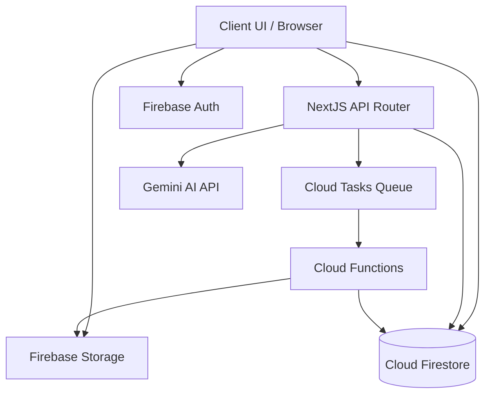
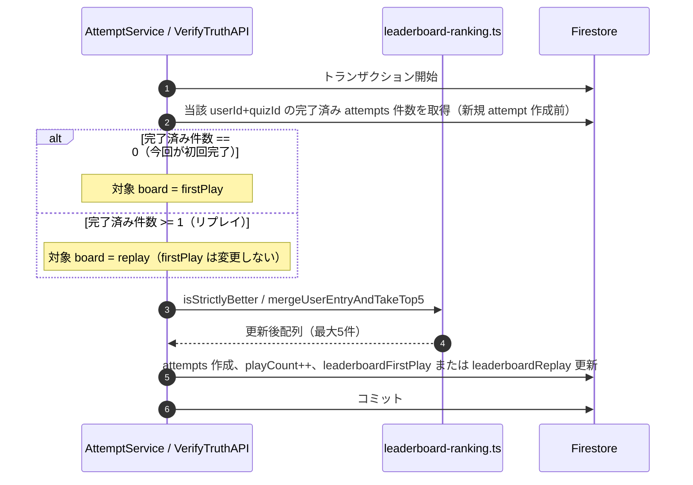
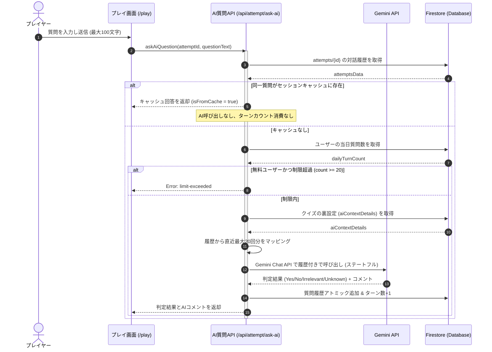
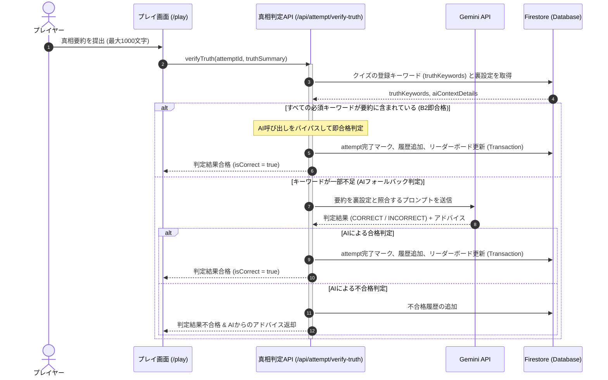
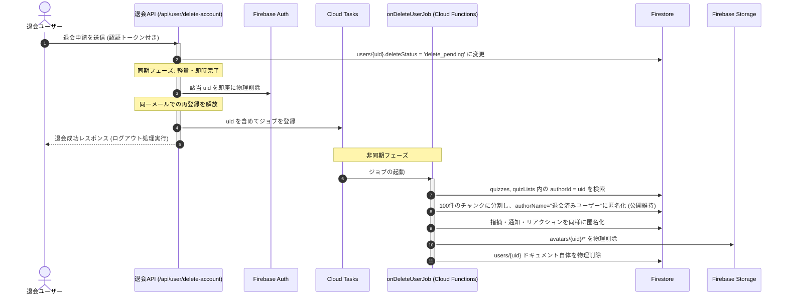
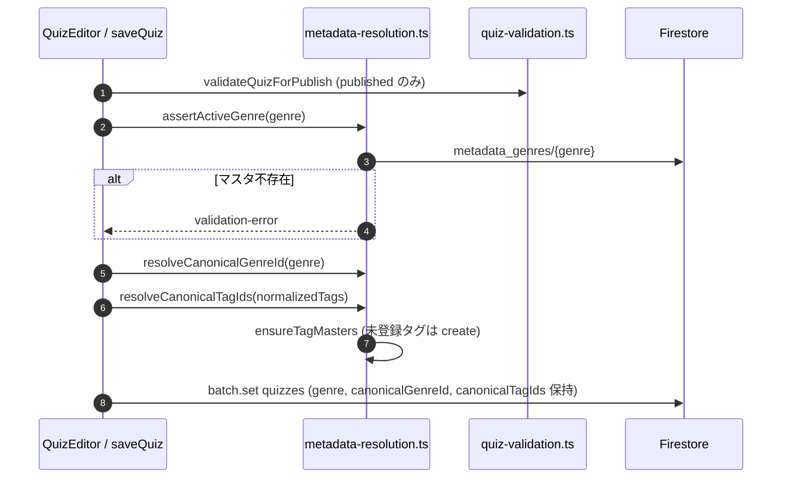
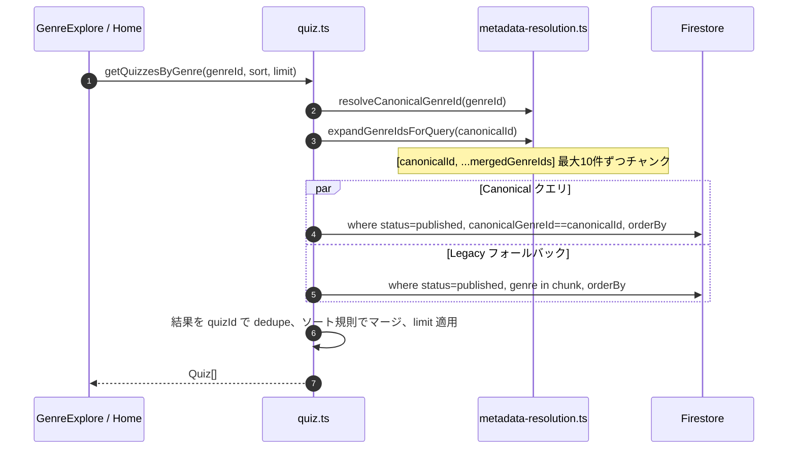
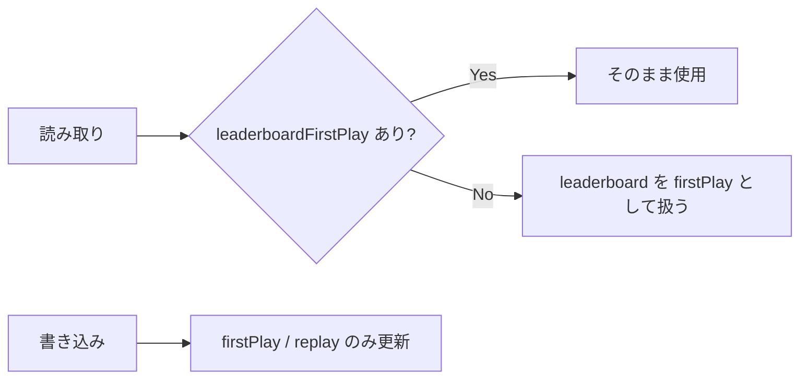
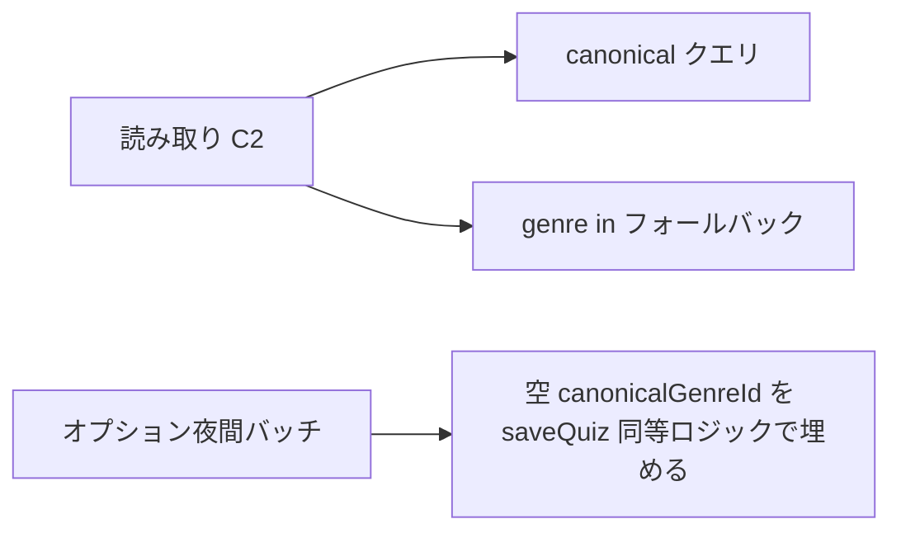

# Technical Design Document: quizeum-core

## Overview
本ドキュメントは、クイズ投稿SNS「quizeum」における核心的なコアシステム（`quizeum-core`）の技術設計仕様を定義します。クイズの作成・下書き・厳格な公開バリデーション、ローカルセッション保護と自動同期を備えたプレイ環境、AIを活用したステートレスなウミガメのスープ（水平思考クイズ）対話、退会時のAuth即時物理削除と大規模非同期クレンジング、そしてコミュニティモデレーションやマージ合意によるメタデータ仮想統合を含みます。

本システムは、Next.jsのApp RouterおよびReact、TypeScriptのフルスタック構成に加え、Firebase（Auth, Firestore, Storage）および外部AI（Gemini API）のハイブリッドアーキテクチャを採用し、セキュリティとパフォーマンス、ユーザー体験（UX）を最高レベルで実現します。

**Phase 5（2026-06）**: クイズ単位リーダーボードを初回プレイ／リプレイの二系統に分割し、正解数優先・同点時タイムの順位規則で更新する。全問正解は不要。あわせて本人向けプレイ履歴取得APIをコア層に追加する（表示UIは `quizeum-auth-profile-ui` が担当）。

**Phase 6（2026-06）**: ジャンル・タグメタデータを `docs/` 正本に整合する。公開保存時に `canonicalGenreId` / `canonicalTagIds` を解決・非正規化し、一覧・検索は正規識別子クエリを優先しつつ legacy クイズ向けに `genre in` フォールバックを併用する（C2 方式）。`metadata-resolution` ライブラリに解決ロジックを集約し、`tagMerge.ts` をガバナンスの単一経路とする。
また、悪質ユーザーのBAN（アカウント停止）機能を追加し、Firestore Security Rulesによるデータ書き込みの即時遮断、監査ログ記録、認証セッションの強制無効化（Cookie連携）を設計する。

### Goals
- ページの初期HTML読み込み時間を通常トラフィック下で平均0.5秒以内に維持する。
- プレイ中の不意なリロードやオフライン切断時における解答データ損失をローカルで保護・復元する。
- ユーザー退会時、アトミックな書き込み制限（最大500件）を回避しつつ即時Auth物理削除と非同期ジョブによる関連データの安全なクレンジングを完了する。
- 水平思考クイズにおいて、セキュアなサーバーサイド呼び出し、ターン制限（1日20回）、および同一質問キャッシュによる低コストで高精度なAI判定を実装する。
- 初回プレイ／リプレイの二系統リーダーボードを、単一の順位比較ロジックで一貫更新し、不正なクライアント改ざんをサーバー側トランザクションで防ぐ。
- 本人プレイ履歴をページング付きで安全に返却する（他ユーザーからの取得は拒否）。
- ジャンル・タグの仮想統合を保存・一覧・弱点克服フィルタまで一貫適用し、canonical 単一クエリで探索性能を確保する（legacy フォールバック併用）。
- BANされたユーザーによるシステムへの不正書き込み（Firestore / API）を即座にブロックし、既存の認証セッションを強制的にログアウトさせる。

### Non-Goals
- 外部システムや外部ファイルからのクイズ・クイズリストの一括インポート機能の実装。
- リアルタイムマルチプレイヤー対戦プレイ用の接続・ポーリング基盤の構築。
- 広告配信用のアドサーバー基盤そのものの構築。

---

## Boundary Commitments

### This Spec Owns
- **データ永続化と整合性**: `users`, `quizzes`, `quizLists`, `follows`, `bookmarks`, `attempts`, `feedbackReports`, `flags`, `reactions`, `notifications`, `metadata_genres`, `metadata_tags`, `mergeRequests`, `genreRequests`, `quizReviews`, `reviewResetRequests`, `adminLogs`（BAN/UNBAN等の監査ログ）などのFirestoreスキーマおよびトランザクション設計。
- **アカウント削除プロセス**: Next.js API Routeを経由した即時Auth物理削除と、Cloud Tasks/Cloud Functionsを連動させた非同期ジョブ分割によるアトミックバッチ匿名化。
- **ユーザーBAN/UNBAN処理とアクセス制限**: `users` の `isBanned` 等のアカウント状態管理、管理者用APIルート、Firestore Security Rulesによるデータ書き込み制限（`isNotBanned()`）、および認証セッション無効化のトリガー（クッキー `quizeum_banned` を使用した強制遷移）。
- **水平思考プレイ判定ロジック**: サーバーAPIを仲介するGemini API連携（直近最大20回分の会話履歴参照を伴うステートフル化）、同一質問キャッシュ一致判定、1日同一クイズ20回制限（無料ユーザー）、必須キーワード全一致による即正解チェックとAIフォールバックによるハイブリッド真相判定（B2方式）。
- **メタデータ管理（Phase 6 拡張）**: 表記揺れタグの自動名寄せ、タグマスタ自動 create、ジャンルマスタ検証、`canonicalGenreId` / `canonicalTagIds` 書き込み時解決、C2 一覧クエリ、`listActiveGenres` / `searchQuizzes`、ガバナンス単一経路（`tagMerge.ts`）、`metadata_*` Security Rules。
- **オフライン/セッション保護**: クライアントローカル永続ストレージでの進捗永続化およびオンライン復帰時の自動バッチ同期。
- **クイズリーダーボード（初回／リプレイ）**: `quizzes.leaderboardFirstPlay` / `quizzes.leaderboardReplay` の更新ロジック、順位比較、トランザクション内の attempt 回数判定。
- **プレイ履歴クエリ**: 認証済み本人向け `attempts` 一覧 of ページング取得（クイズタイトル非正規化の解決を含む）。

### Out of Boundary
- 外部APIへの直接のクライアント通信（AI呼び出しなど）はSecurity Rulesで拒否され、すべてNext.js API Routeを経由します。
- クイズデータの一括JSONインポートは行わず、手動によるエクスポート（ダウンロード）パッケージ生成のみを担当します。
- プラットフォーム総合リーダーボード（`/leaderboard`）の集計・表示。
- マイページ／プロフィール画面のプレイ履歴UIレイアウト（`quizeum-auth-profile-ui`）。
- クイズ詳細画面のリーダーボードタブUI（`quizeum-play-flow-ui`）。
- 管理者向けBAN/UNBAN操作画面のUIレイアウトおよび表示コンポーネント（`quizeum-admin-users-ui` が担当）。
- **Phase 6**: ホーム/エディタ/ジャンル一覧の UI、ジャンル新設・マージ画面のレイアウト、既存クイズの一括 `genre` 物理書き換え、Cloud Functions への投票移行。

### Allowed Dependencies
- **外部AI API**: 生成AI自動判定に必要な外部API（Google Gemini API等）。
- **アセットストレージ**: カバー画像やアバター画像を管理する Firebase Storage。
- **バックエンド基盤**: ユーザー認証およびデータの永続化を行う Firebase Auth, Cloud Firestore。

### Revalidation Triggers
- `spec.json` の型定義（`User`, `Quiz`, `Attempt` 等）のスキーマ変更。
- 退会処理時における匿名化対象コレクションの追加。
- AI自動真相判定のプロンプト構成やGemini APIのインターフェース変更。
- `leaderboardFirstPlay` / `leaderboardReplay` フィールド追加および旧 `leaderboard` 読み取り互換の廃止方針。
- プレイ履歴APIのレスポンス形状またはページングカーソル形式の変更。
- `metadata_genres` / `metadata_tags` スキーマ変更、canonical 解決アルゴリズム変更、ジャンル一覧クエリのフォールバック廃止。

---

## Architecture

### Existing Architecture Analysis
既存のコードベースには、クライアントから直接Firestoreを操作する簡易的なサービス（`src/services/quiz.ts` 等）がすでに実装されています。
本設計はこれを拡張し、重要な更新処理や複雑なビジネスロジック（退会、NGワード検証、AI対話）において、Firestore Security Rulesによる不正書き込みの遮断と、セキュアなサーバーAPI Route（Next.js）および Cloud Functions による二重の検証・処理を強制するハイブリッドモデルを適用します。

### Architecture Pattern & Boundary Map



### Technology Stack

| Layer | Choice / Version | Role in Feature | Notes |
|-------|------------------|-----------------|-------|
| Frontend / CLI | Next.js v16.2.6 (App Router) | ユーザーUIの提供、ローカルセッション永続化 | React v19.2.4、TypeScript |
| Backend / Services | Next.js API Routes | セキュアなAI判定プロキシ、即時退会Auth削除、Cloud Tasks登録 | Firebase Admin SDK |
| Data / Storage | Cloud Firestore | 全データの永続化とアトミックカウント更新 | `firestore.indexes.json` で複合インデックスを管理 |
| Messaging / Events | Cloud Tasks | 退会時非同期分割匿名化ジョブの遅延実行 | Cloud Functions と連携 |
| Infrastructure / Runtime | Firebase Storage | アバターやカバー画像の保存（上限2MB） | Storage Security Rules による認証保護 |

---

## File Structure Plan

### Directory Structure
```
src/
├── app/
│   └── api/
│       ├── admin/
│       │   └── users/
│       │       ├── ban/
│       │       │   └── route.ts  # 管理者ユーザーBAN API (12.1)
│       │       └── unban/
│       │           └── route.ts  # 管理者ユーザーUNBAN API (12.2)
│       ├── attempt/
│       │   ├── ask-ai/
│       │   │   └── route.ts      # AI質問判定API (4.1, 4.2)
│       │   └── verify-truth/
│       │       └── route.ts      # AI真相判定API (4.5, 4.6, 9.8)
│       └── user/
│           ├── delete-account/
│           │   └── route.ts      # 即時退会Auth物理削除API (1.4)
│           └── play-history/
│               └── route.ts      # 本人プレイ履歴API (10.1–10.5)
├── lib/
│   ├── leaderboard-ranking.ts    # 順位比較・マージ・top5抽出 (9.4–9.6)
│   └── metadata-resolution.ts    # canonical 解決・マージ展開・クイズ保存用メタ適用 (2.x, 11.x) [Phase 6 新規]
├── services/
│   ├── attempt.ts                # saveAttempt内LB更新、listUserPlayHistory、review genreFilter (3.x, 9.x, 10.x, 3.7)
│   ├── bookmark.ts               # ブックマークのアトミック管理 (5.3)
│   ├── moderation.ts             # 通報・自動保留のみ (7.1–7.3)。ジャンルAPIスタブ削除 [Phase 6]
│   ├── reputation.ts             # BAN/UNBANサービスと監査ログ記録 (12.1, 12.2)
│   ├── tagMerge.ts               # マージ投票・ジャンル新設（単一経路）(7.4–7.8, 11.7)
│   ├── quiz-list.ts              # リストの管理 (5.4)
│   ├── quiz.ts                   # saveQuiz canonical化、getQuizzesByGenre/Tag、searchQuizzes (2.x, 11.x)
│   ├── storage.ts                # Storageアセット操作、自動クレンジング (1.5, 5.1)
│   └── user.ts                   # バッジ付与、プロフィール編集 (1.2, 1.3)
└── types/
    └── index.ts                  # すべての型定義ファイル (1.1, 2.2, 3.5, etc)
```

### Modified Files
- `src/types/index.ts` — 称号、ウミガメスープ履歴、必須キーワード `truthKeywords` などの型定義を網羅。
- `src/services/quiz.ts` — クイズ公開時バリデーション（ウミガメスープにおけるキーワード設定検証）等を追加。
- `src/services/quiz-validation.ts` — ウミガメスープ形式の時、必須キーワードが最低1つ指定されているかどうかの検証を追加。
- `src/services/ask-ai-utils.ts` — 会話履歴を反映したシステムインラインプロンプト構築と Gemini Chat API 連携用マッピングロジックを追加。
- `src/services/verify-truth-utils.ts` — 登録必須キーワードがすべて含まれているかを検証する `verifyKeywords` 正規化判定関数を追加。
- `src/app/api/attempt/ask-ai/route.ts` — Firestore から履歴を取得して直近20回分の履歴を Gemini に渡しステートフルな呼び出しを行うよう修正。
- `src/app/api/attempt/verify-truth/route.ts` — 必須キーワード一致による即合格（AIバイパス）とAIフォールバックを組み合わせたハイブリッド判定処理を追加。
- `src/components/quiz/quiz-editor.tsx` — ウミガメスープ形式の問題作成時に、タグ風UIで必須キーワードを追加・削除できるフォームを追加。
- `src/types/index.ts` — `leaderboardFirstPlay` / `leaderboardReplay`、`PlayHistoryEntry` 等を追加。
- `src/lib/leaderboard-ranking.ts` — **新規**。順位比較・ユーザー1枠マージ・上位5抽出の純関数。
- `src/services/attempt.ts` — 全問正解ガードを撤廃し、トランザクション内で初回／リプレイLBを更新。`listUserPlayHistory` を追加。
- `src/app/api/attempt/verify-truth/route.ts` — 共通LB更新ヘルパーを利用（重複ロジック削除）。
- `src/app/api/user/play-history/route.ts` — **新規**。IDトークン検証後、本人のみ履歴を返却。
- `firestore.indexes.json`（またはプロジェクト既定のインデックス定義）— `attempts`: `userId` + `completedAt` 降順クエリ用複合インデックスを追加。
- `tests/lib/leaderboard-ranking.test.ts` — **新規**。順位・マージ・top5の単体テスト。
- `tests/services/attempt-leaderboard.test.ts` — **新規**。初回／リプレイ振り分けの統合テスト。
- `src/lib/metadata-resolution.ts` — **新規**（Phase 6）。`resolveCanonicalGenreId`, `resolveCanonicalTagIds`, `expandGenreIdsForQuery`, `assertActiveGenre`, `ensureTagMasters`.
- `src/services/quiz.ts` — `saveQuiz` で canonical 埋め込み、`getQuizzesByGenre` C2 クエリ、`getQuizzesByTag` を `canonicalTagIds` 優先に、`searchQuizzes` 追加。
- `src/services/quiz-validation.ts` — 公開時ジャンルマスタ存在チェック（`assertActiveGenre` 連携）。
- `src/services/attempt.ts` — `getFailedQuestions` の genreFilter を `expandGenreIdsForQuery` 利用に変更。
- `src/services/moderation.ts` — `submitGenreRequest` / `resolveGenreRequest` 削除（`tagMerge.ts` に統一）。
- `src/types/index.ts` — `GenreMetadata`, `TagMetadata` 型追加。
- `firestore.rules` — `metadata_genres`, `metadata_tags`, `mergeRequests`, `genreRequests`（`detailed_design.md` §6.5 準拠）。
- `firestore.indexes.json` — `(status, canonicalGenreId, createdAt|playCount|bookmarksCount)` 複合インデックス。
- `tests/lib/metadata-resolution.test.ts` — **新規**。
- `tests/services/quiz-genre-query.test.ts` — **新規**（canonical + legacy フォールバック union）。

---

## System Flows

### クイズリーダーボード更新フロー（`saveAttempt` / `verify-truth` 共通）



**フロー上の決定**: 全問正解チェックは行わない。ゲスト・`test-play` は LB 更新対象外（attempt 永続化自体が行われない）。

### 水平思考クイズ（ウミガメのスープ）ステートフルAI質問対話フロー



### 水平思考クイズ（ウミガメのスープ）B2 ハイブリッド真相自動判定フロー



### ユーザー退会・非同期データクレンジングフロー



### クイズ保存時のメタデータ解決フロー（Phase 6）



**フロー上の決定**: `genre` 表示用文字列は変更しない。下書きもジャンル必須（要件2.1）。テストプレイは `saveQuiz` を経由せず canonical 未設定を許容。

### ジャンル別公開クイズ一覧（C2 読み取り）フロー（Phase 6）



**フロー上の決定**: 正規識別子が空の legacy クイズは `genre in` のみヒット。canonical ヒットと legacy ヒットの重複は `id` で除去。

---

## Requirements Traceability

| Requirement | Summary | Components | Interfaces | Flows |
|-------------|---------|------------|------------|-------|
| 1.1 | ユーザー登録および認証 | User Authentication | Firebase Auth | - |
| 1.2 | プロフィール編集 | `UserService` | `updateProfile` | - |
| 1.3 | 称号バッジ自動付与 | `UserService` | `checkAndAwardBadges` | - |
| 1.4 | 退会時即時Auth削除 | `DeleteAccountAPI` | `/api/user/delete-account` | 退会フロー |
| 1.5 | 大規模関連データの非同期匿名化 | `onDeleteUserJob` | Cloud Functions Trigger | 退会フロー |
| 1.6 | 退会保留中のアクセス遮断 | Security Rules | `deleteStatus != 'delete_pending'` | - |
| 2.1 | 下書き（タイトル・ジャンル・問題文必須） | `QuizService` | `saveQuiz('draft')` | メタデータ解決フロー |
| 2.2 | ジャンルマスタ存在検証 | `metadata-resolution` | `assertActiveGenre` | メタデータ解決フロー |
| 2.3 | 公開時バリデーション & NGチェック | `QuizService` | `saveQuiz('published')` | メタデータ解決フロー |
| 2.4 | 保存時 canonical 非正規化 | `metadata-resolution` | `resolveCanonical*` | メタデータ解決フロー |
| 2.5 | 未登録タグのマスタ自動 create | `metadata-resolution` | `ensureTagMasters` | メタデータ解決フロー |
| 2.6 | タグ名寄せ & 類似サジェスト | `QuizService` | `normalizeTag`, `getSimilarTag` | - |
| 2.7 | クイズタイトル更新時の非正規化同期 | `QuizService` | `updateQuiz` | - |
| 2.8 | クイズ削除時のカスケードクリーンアップ | `QuizService` | `deleteQuiz` | - |
| 2.9 | 作成クイズ一括エクスポート | `QuizService` | `exportQuizzes` | - |
| 2.10 | 必須キーワード(エッセンス)のタグ風UI入力 | `QuizCreator` / UI | `truthKeywords` | - |
| 2.11 | 公開時必須キーワードバリデーション | `QuizService` | `validateQuizForPublish` | - |
| 2.12 | テストプレイは canonical 不要 | `test-play` | sessionStorage 経路 | - |
| 3.1 | 通常モードプレイ | `AttemptService` | `saveAttempt` | - |
| 3.2 | 解答セッションローカル永続化 | `LocalAttemptSession` | `saveToLocalStorage` | - |
| 3.3 | オフラインプレイ結果と自動同期 | `LocalAttemptSession` | `syncPendingAttempts` | - |
| 3.4 | オフラインリストプレイの進行ブロック | `LocalAttemptSession` | `checkConnectivity` | - |
| 3.5 | プレイ結果画面（良問評価・難易度投票）| `ReviewService` | `submitReview` | - |
| 3.6 | 永続化試行保存とLB更新委譲 | `AttemptService` | `saveAttempt` | リーダーボード更新フロー |
| 3.7 | 弱点克服ジャンルフィルタ（マージ展開） | `AttemptService` | `getFailedQuestions` | - |
| 9.1 | 永続化完了時のLB評価 | `AttemptService` | `saveAttempt` | リーダーボード更新フロー |
| 9.2 | 初回完了は firstPlay のみ | `AttemptService` | `saveAttempt` (tx) | リーダーボード更新フロー |
| 9.3 | 2回目以降は replay のみ | `AttemptService` | `saveAttempt` (tx) | リーダーボード更新フロー |
| 9.4 | 正解数優先・同点タイム順 | `leaderboard-ranking.ts` | `compareLeaderboard` | - |
| 9.5 | ユーザー1枠・厳密優位時のみ差し替え | `leaderboard-ranking.ts` | `mergeUserEntryAndTakeTop5` | - |
| 9.6 | 上位5件保持 | `leaderboard-ranking.ts` | `mergeUserEntryAndTakeTop5` | - |
| 9.7 | 全問正解不要 | `AttemptService` | `saveAttempt` | - |
| 9.8 | ウミガメ合格時の同一LB規則 | `VerifyTruthAPI` | `/api/attempt/verify-truth` | 真相判定フロー |
| 10.1 | 本人履歴・完了日時降順 | `AttemptService` / PlayHistoryAPI | `listUserPlayHistory` | - |
| 10.2 | test-play 除外 | `AttemptService` | `listUserPlayHistory` | - |
| 10.3 | 表示用メタデータ | `AttemptService` | `listUserPlayHistory` | - |
| 10.4 | 初回20件+カーソル | `PlayHistoryAPI` | `GET /api/user/play-history` | - |
| 10.5 | 他人の履歴拒否 | `PlayHistoryAPI` | `GET /api/user/play-history` | - |
| 4.1 | 最大20回分の会話履歴を参照したステートフルAI質問 | `AskAiQuestionAPI` | `/api/attempt/ask-ai` | 質問対話フロー |
| 4.2 | 無料ユーザーの1日20回制限 | `AskAiQuestionAPI` | `/api/attempt/ask-ai` | 質問対話フロー |
| 4.3 | 同一質問キャッシュ | `AskAiQuestionAPI` | `/api/attempt/ask-ai` | 質問対話フロー |
| 4.4 | プレイ画面2カラムレイアウト | UI Component | `LateralThinkingPlayView` | - |
| 4.5 | 必須キーワード一致による即合格(AIバイパス) | `VerifyTruthAPI` | `/api/attempt/verify-truth` | 真相判定フロー |
| 4.6 | キーワード不足時のAIフォールバック真相判定 | `VerifyTruthAPI` | `/api/attempt/verify-truth` | 真相判定フロー |
| 4.7 | 真相不合格時のAIアドバイスフィードバック | `VerifyTruthAPI` | `/api/attempt/verify-truth` | 真相判定フロー |
| 5.1 | フォロー/フォロワーアトミック更新 | `UserService` | `followUser` | - |
| 5.2 | タイムラインフィード表示 | `QuizService` | `getFollowedTimeline` | - |
| 5.3 | ブックマークアトミック更新 | `BookmarkService` | `toggleBookmark` | - |
| 5.4 | クイズリスト作成・編集・削除 | `QuizListService` | `createQuizList` | - |
| 5.5 | リスト連続プレイ (Attempt.listId) | `AttemptService` | `saveAttempt(mode='list')` | - |
| 5.6 | クイズリストパッケージエクスポート | `QuizListService` | `exportQuizList` | - |
| 6.1 | クローズド指摘フィードバック送信 | `ReviewService` | `submitFeedbackReport` | - |
| 6.2 | 指摘解決時の修正完了オート通知 | `ReviewService` | `resolveReport` | - |
| 6.3 | 👍/👎良問投票（作成者除外） | `ReviewService` | `submitReview` | - |
| 6.4 | 仮リセット期間中の評価マスク | UI Component | `QuizDetailView` | - |
| 6.5 | 評価リセット承認時の非同期クリーンアップ| `ReviewService` | `resetReviews` | - |
| 7.1 | コンテンツ通報とアトミック更新 | `ModerationService` | `flagContent` | - |
| 7.2 | 5回通報時の自動保留（非公開） | `ModerationService` | `flagContent` (Function) | - |
| 7.3 | 管理者審査（公開復帰/永久非公開） | `ModerationService` | `resolveFlag` | - |
| 7.4 | タグ/ジャンル仮想マージ提案・投票 | `TagMergeService` | `createMergeRequest`, `voteMergeRequest` | - |
| 7.5 | マージ可決 70% | `TagMergeService` | `voteMergeRequest` (tx) | - |
| 7.6 | 新ジャンル申請 | `TagMergeService` | `submitGenreRequest` | - |
| 7.7 | ジャンルアイコン SVG 禁止 | `storage.ts` / UI | `uploadImage` MIME 検証 | - |
| 7.8 | ジャンル新設可決 80% | `TagMergeService` | `voteGenreRequest` | - |
| 11.1 | ジャンル一覧（マージ統合） | `QuizService` | `getQuizzesByGenre` | C2 読み取りフロー |
| 11.2 | canonical 優先 + legacy フォールバック | `QuizService` | `getQuizzesByGenre` | C2 読み取りフロー |
| 11.3 | タグ一覧（canonical） | `QuizService` | `getQuizzesByTag` | - |
| 11.4 | 有効ジャンルマスタ一覧 | `QuizService` | `listActiveGenres` | - |
| 11.5 | 複合検索 | `QuizService` | `searchQuizzes` | - |
| 11.6 | メタデータ Rules | `firestore.rules` | metadata_* / mergeRequests | - |
| 11.7 | ガバナンス単一経路 | `TagMergeService` | `tagMerge.ts` のみ | - |
| 12.1 | ユーザーのBANと監査ログ記録 | `ReputationService` / API Route | `/api/admin/users/ban` | - |
| 12.2 | BAN解除と監査ログ記録 | `ReputationService` / API Route | `/api/admin/users/unban` | - |
| 12.3 | BAN中の書き込み拒否と強制ログアウト | Security Rules / AuthContext | `isNotBanned()`, `quizeum_banned` Cookie | - |
| 8.1 | 初期HTML読み込み速度0.5秒以内 | Performance | SSR Cache / Optimization | - |
| 8.2 | 高負荷時エラー率0.1%未満 | Infrastructure | High Availability | - |
| 8.3 | クローラー向け高速HTMLとOGPメタデータ | SSR Component | `getServerSideProps` / Metadata | - |

---

## Components and Interfaces

### Component Summary Table

| Component | Domain/Layer | Intent | Req Coverage | Key Dependencies (P0/P1) | Contracts |
|-----------|--------------|--------|--------------|--------------------------|-----------|
| `UserService` | Service | ユーザープロフィール、称号、フォロー管理 | 1.2, 1.3, 5.1 | Firestore (P0) | Service, State |
| `metadata-resolution` | Lib | canonical 解決・マージ ID 展開・タグマスタ ensure | 2.2, 2.4, 2.5, 11.x | Firestore (P0) | Pure functions + IO |
| `QuizService` | Service | クイズ保存・一覧・検索・エクスポート | 2.1–2.9, 11.1–11.5 | metadata-resolution (P0), Firestore (P0) | Service |
| `TagMergeService` | Service | マージ投票・ジャンル新設（`tagMerge.ts`） | 7.4–7.8, 11.7 | Firestore (P0) | Service, State |
| `leaderboard-ranking` | Lib | LB順位比較・マージ・top5 | 9.4, 9.5, 9.6 | - | Pure functions |
| `AttemptService` | Service | 解答永続化、LB更新、本人プレイ履歴、オフライン同期 | 3.1, 3.2, 3.3, 3.4, 3.6, 5.5, 9.1–9.7, 10.1–10.3 | Firestore (P0), LocalStore (P1), leaderboard-ranking (P0) | Service, State, Batch |
| `/api/user/play-history` | API Route | 本人プレイ履歴の認可付き取得 | 10.1, 10.4, 10.5 | AuthAdmin (P0), AttemptService (P0) | API |
| `BookmarkService` | Service | クイズ・リストのブックマークアトミック管理 | 5.3 | Firestore (P0) | Service, State |
| `QuizListService` | Service | リストの作成、ドラッグ＆ドロップ、パッケージング | 5.4, 5.6 | Firestore (P0), QuizService (P1) | Service, State |
| `ReviewService` | Service | 良問評価、間違い指摘、修正通知、リセットバッチ | 3.5, 6.1, 6.2, 6.3, 6.5 | Firestore (P0), CloudTasks (P1) | Service, State, Batch |
| `ModerationService` | Service | 通報、自動保留、審査のみ | 7.1, 7.2, 7.3 | Firestore (P0) | Service, State |
| `ReputationService` | Service | 信頼スコア、モデレータ資格、BAN/UNBAN、監査ログ記録 | 12.1, 12.2 | Firestore (P0) | Service, State, Tx |
| `/api/admin/users/ban` | API Route | 管理者用ユーザーBAN API | 12.1 | AuthAdmin (P0), ReputationService (P0) | API |
| `/api/admin/users/unban` | API Route | 管理者用ユーザーUNBAN API | 12.2 | AuthAdmin (P0), ReputationService (P0) | API |
| `/api/user/delete-account` | API Route | 即時Auth物理削除とCloud Tasksジョブ登録 | 1.4 | AuthAdmin (P0), CloudTasks (P0) | API |
| `/api/attempt/ask-ai` | API Route | 水平思考クイズのAI質問判定 (ターン制限・キャッシュ) | 4.1, 4.2, 4.3 | Gemini API (P0), Firestore (P0) | API |
| `/api/attempt/verify-truth` | API Route | 水平思考クイズのAI真相自動判定とフィードバック | 4.5, 4.6, 4.7 | Gemini API (P0), Firestore (P0) | API |

---

### Component Interface Details

#### `UserService`
- **Intent**: ユーザープロフィール情報の管理、アトミックな称号バッジ付与、フォロー管理。
- **Requirements**: `1.2, 1.3, 5.1`

```typescript
export interface UserService {
  // プロフィール更新 (1.2)
  updateProfile(uid: string, data: { displayName: string; bio: string; followedGenres: string[] }): Promise<void>;
  
  // 称号バッジの判定とアトミック付与 (1.3)
  checkAndAwardBadges(uid: string): Promise<Badge[]>;
  
  // ユーザーのフォロー/解除トグル (5.1)
  followUser(followerId: string, followingId: string): Promise<{ isFollowing: boolean }>;
}
```
- **Preconditions**: `uid` が Firebase Auth 上で認証されていること。
- **Postconditions**: 称号バッジ付与時に条件を満たした場合、`users.badges` 配列にアトミックに Badge オブジェクトが追加される。

#### `metadata-resolution`
- **Intent**: ジャンル・タグの canonical 解決、マージ ID 展開、保存時マスタ整合を単一実装に集約。
- **Requirements**: `2.2, 2.4, 2.5, 11.2`

```typescript
export interface GenreMetadata {
  id: string;
  displayName: string;
  iconImageUrl: string | null;
  canonicalId: string | null;
  mergedGenreIds: string[];
  isActive: boolean;
}

/** ジャンルID → 統合先 canonical ID（自身が canonical なら自分） */
export async function resolveCanonicalGenreId(genreId: string): Promise<string>;

/** 正規化タグID配列 → canonicalTagIds（マスタ参照） */
export async function resolveCanonicalTagIds(tagIds: string[]): Promise<string[]>;

/** 一覧用: [canonicalId, ...mergedGenreIds] を dedupe（Firestore in 上限10でチャンク） */
export function chunkIdsForInQuery(ids: string[], chunkSize?: number): string[][];

export async function expandGenreIdsForQuery(genreId: string): Promise<string[]>;

export async function assertActiveGenre(genreId: string): Promise<void>;

/** 未登録タグを metadata_tags に create（canonicalId=null, mergedTagIds=[]） */
export async function ensureTagMasters(
  tagIds: string[],
  createdBy: string
): Promise<void>;
```
- **Invariants**: `resolveCanonicalGenreId` は `canonicalId` チェーンを辿り循環を検出。`genre` 表示値は変更しない。

#### `QuizService`
- **Intent**: クイズの保存、編集、Zod検証、NGワード二重検証付き公開、ジャンル/タグ一覧・複合検索、エクスポート。
- **Requirements**: `2.1–2.9, 11.1–11.5`

```typescript
export type QuizListSort = 'latest' | 'popular' | 'trending';

export interface SearchFilters {
  genreId?: string;
  difficultyMin?: number;
  difficultyMax?: number;
  minQuestions?: number;
  maxQuestions?: number;
}

export interface QuizService {
  saveQuiz(
    quiz: Omit<Quiz, 'id' | 'playCount' | 'bookmarksCount' | 'createdAt' | 'updatedAt'>,
    status: 'draft' | 'published'
  ): Promise<string>;
  normalizeTag(input: string): string;
  getSimilarTagSuggest(tag: string): Promise<string | null>;
  listActiveGenres(): Promise<GenreMetadata[]>;
  getQuizzesByGenre(genreId: string, sort: QuizListSort, limit: number): Promise<Quiz[]>;
  getQuizzesByTag(tagId: string, sort: QuizListSort, limit: number): Promise<Quiz[]>;
  searchQuizzes(
    queryText: string,
    filters: SearchFilters,
    currentUserId?: string
  ): Promise<Quiz[]>;
  deleteQuiz(quizId: string): Promise<void>;
  exportQuizzes(uid: string): Promise<QuizExportPackage>;
}
```
- **Validation Hooks**: `saveQuiz` 内で `assertActiveGenre` → `resolveCanonicalGenreId` / `resolveCanonicalTagIds` → `ensureTagMasters` の順。公開時は既存 Zod + NG チェック。
- **`getQuizzesByGenre`（C2）**: (1) `canonicalGenreId == resolvedCanonicalId` クエリ (2) `genre in expandIds` チャンククエリ (3) `Map<id, Quiz>` で dedupe、(4) `sort` に応じてマージソート。
- **`getQuizzesByTag`**: 第一選択 `where('canonicalTagIds','array-contains', resolvedTagId)`。フォールバック `tags array-contains` は legacy 用に残す。
- **Note**: リーダーボード更新は `AttemptService` / `verify-truth` に集約。

#### `TagMergeService`（`src/services/tagMerge.ts`）
- **Intent**: マージ提案・投票、ジャンル新設申請・可決の単一実装（`moderation.ts` のジャンルスタブは削除）。
- **Requirements**: `7.4–7.8, 11.7`

```typescript
// 既存 export を維持: createMergeRequest, voteMergeRequest, submitGenreRequest, voteGenreRequest, runMigration
// 可決閾値: merge 70% (weightedFor>=5), genre 80% (weightedFor>=5)
```

#### `leaderboard-ranking`（純関数ライブラリ）
- **Intent**: 要件9の順位規則を単一実装に集約し、`saveAttempt` と `verify-truth` の重複を排除する。
- **Requirements**: `9.4, 9.5, 9.6`

```typescript
export type LeaderboardBoard = 'firstPlay' | 'replay';

/** a が b より上位なら負の数、同順位なら 0、下位なら正の数（sort 用） */
export function compareLeaderboardRecords(
  a: Pick<LeaderboardRecord, 'score' | 'elapsedSeconds'>,
  b: Pick<LeaderboardRecord, 'score' | 'elapsedSeconds'>
): number;

export function isStrictlyBetter(
  candidate: Pick<LeaderboardRecord, 'score' | 'elapsedSeconds'>,
  existing: Pick<LeaderboardRecord, 'score' | 'elapsedSeconds'>
): boolean;

export function mergeUserEntryAndTakeTop5(
  entries: LeaderboardRecord[],
  userId: string,
  incoming: Omit<LeaderboardRecord, 'completedAt'> & { completedAt: Date }
): LeaderboardRecord[];

export function resolveLeaderboardBoard(priorCompletedAttemptCount: number): LeaderboardBoard;
```
- **Invariants**: ソートは `score` 降順 → `elapsedSeconds` 昇順。返却配列は最大5要素。同一 `userId` は最大1件。

#### `AttemptService`
- **Intent**: プレイ結果の永続化、トランザクション内リーダーボード更新、本人プレイ履歴クエリ、オフライン同期。
- **Requirements**: `3.1, 3.2, 3.3, 3.4, 3.6, 5.5, 9.1–9.7, 10.1–10.3`

```typescript
export interface AttemptService {
  saveAttempt(attemptData: Omit<Attempt, 'id' | 'completedAt'>): Promise<string>;
  updateFailedQuestions(uid: string, quizId: string, solvedQuestionIds: string[]): Promise<void>;

  listUserPlayHistory(params: {
    uid: string;
    limit?: number;       // default 20
    cursor?: string | null;
  }): Promise<PlayHistoryPage>;
}

export interface PlayHistoryEntry {
  attemptId: string;
  quizId: string;
  quizTitle: string;
  score: number;
  totalQuestions: number;
  mode: Attempt['mode'];
  completedAt: Date;
  elapsedSeconds: number;
}

export interface PlayHistoryPage {
  items: PlayHistoryEntry[];
  nextCursor: string | null;
}
```
- **Preconditions (`saveAttempt`)**: `userId` がゲストでないこと。`score` / `totalQuestions` / `failedQuestionIds` の整合性検証は現行どおり。
- **Postconditions (`saveAttempt`)**: トランザクション内で prior 完了件数に基づき `firstPlay` または `replay` を更新。新記録が既存ユーザーエントリより優位でない場合は当該ユーザーのエントリは差し替えないが、他ユーザーとの競合で top5 から外れる可能性は許容する。
- **Implementation Notes**: クイズタイトルは `quizzes` を `quizId` でバッチ取得して `PlayHistoryEntry` に埋める。カーソルは `completedAt` + `attemptId` の不透明エンコード（例: Base64 JSON）。
- **Phase 6 (`getFailedQuestions`)**: `genreFilter` 指定時は `expandGenreIdsForQuery(genreFilter)` で ID 集合を得て、`quiz.genre` または `quiz.canonicalGenreId` が集合に含まれるかでフィルタ。

#### `/api/user/play-history`
- **Intent**: クライアントからの本人プレイ履歴取得を ID トークンで保護する。
- **Requirements**: `10.1, 10.4, 10.5`

| Method | Endpoint | Request | Response | Errors |
|--------|----------|---------|----------|--------|
| GET | `/api/user/play-history` | Query: `limit?`, `cursor?` — Header: `Authorization: Bearer <ID_TOKEN>` | `PlayHistoryPage` | 401, 403 |

- **Preconditions**: `verifyIdToken` 成功。クエリの `uid` を受け付けない（トークンの `uid` のみ使用）。
- **Postconditions**: トークン `uid` と一致する履歴のみ返却。他人指定は 403。

---

## Data Models

### Domain Model

```typescript
// 1. ユーザー情報 (Users)
export interface User {
  id: string;
  email: string;
  displayName: string;
  avatarUrl: string;
  bio: string;
  followedGenres: string[];
  badges: Badge[];
  createdQuizzesCount: number;
  totalPlayCount: number;
  followersCount: number;
  followingCount: number;
  reputationScore: number;
  moderationTier: 'newcomer' | 'contributor' | 'moderator' | 'senior_moderator';
  reputationHistory: ReputationEventLog[];
  lastReputationCalculatedAt: Date | null;
  totalFailedQuestionsCount: number;
  deleteStatus: 'active' | 'delete_pending';
  isBanned?: boolean;            // BAN状態フラグ (12.1)
  bannedReason?: string;          // BAN理由 (12.1)
  bannedAt?: Date;                // BAN実行日時 (12.1)
  createdAt: Date;
  updatedAt: Date;
}

export interface Badge {
  id: string;
  title: string;
  description: string;
  iconName: string;
  unlockedAt: Date;
}

export interface ReputationEventLog {
  eventId: string;
  delta: number;
  reason: string;
  createdAt: Date;
}

// 2. クイズ (Quizzes)
export interface Quiz {
  id: string;
  authorId: string;
  authorName: string;
  authorAvatar: string;
  title: string;
  description: string;
  thumbnailUrl: string | null;
  difficulty: number; // 1〜10 の整数
  genre: string;
  tags: string[];
  originalTags: string[];
  questions: Question[];
  questionCount: number;
  status: 'draft' | 'published' | 'suspended';
  flagsCount: number;
  playCount: number;
  bookmarksCount: number;
  positiveCount: number;
  negativeCount: number;
  tempPositiveCount: number;
  tempNegativeCount: number;
  reviewScore: number | null;
  reviewBadge: string | null;
  isReviewMasked: boolean;
  activeResetRequestId: string | null;
  canonicalGenreId: string;
  canonicalTagIds: string[];
  /** @deprecated 読み取り互換のみ。書き込みは firstPlay / replay を使用 */
  leaderboard?: LeaderboardRecord[];
  leaderboardFirstPlay: LeaderboardRecord[];
  leaderboardReplay: LeaderboardRecord[];
  createdAt: Date;
  updatedAt: Date;
}

export interface Question {
  id: string;
  type: 'true-false' | 'multiple-choice' | 'text-input' | 'sorting' | 'association' | 'lateral-thinking';
  questionText: string;
  explanation: string;
  imageUrl: string | null;
  hint: string | null;
  limitTime: number | null;
  correctTextAnswerList?: string[];
  choices?: Choice[];
  sortingItems?: SortingItem[];
  associationHints?: string[];
  aiContextDetails?: string;
  truthKeywords?: string[]; // ウミガメスープ用必須正解キーワード (2.7)
  correctCount: number;
  incorrectCount: number;
}

export interface Choice {
  id: string;
  choiceText: string;
  isCorrect: boolean;
  selectedCount: number;
}

export interface SortingItem {
  id: string;
  text: string;
  correctOrder: number;
}

export interface LeaderboardRecord {
  userId: string;
  displayName: string;
  score: number;           // 正解数（第1キー）
  elapsedSeconds: number;  // 合計解答時間・秒（第2キー）
  completedAt: Date;
}

// 3. プレイ履歴 (Attempts)
export interface Attempt {
  id: string;
  userId: string;
  quizId: string;
  listId?: string;
  mode: 'normal' | 'exam' | 'flashcard' | 'review' | 'list';
  score: number;
  totalQuestions: number;
  elapsedSeconds: number;
  failedQuestionIds: string[];
  difficultyVote?: number | null;
  aiQuestionsHistory?: AiQuestion[];
  aiTurnCount: number;
  aiTurnLimit: number | null;
  completedAt: Date;
}

export interface AiQuestion {
  id: string;
  questionText: string;
  answerType: 'yes' | 'no' | 'irrelevant' | 'unknown';
  aiComment?: string;
  isFromCache: boolean;
  createdAt: Date;
}

// 4. 指摘レポート (feedbackReports)
export interface FeedbackReport {
  id: string;
  quizId: string;
  quizTitle: string;
  questionId: string;
  questionText: string;
  selectedChoiceText?: string;
  reporterId: string;
  creatorId: string;
  category: 'typo' | 'fact' | 'alternative';
  content: string;
  status: 'open' | 'resolved';
  createdAt: Date;
}
```

### Physical Data Model（Firestore `quizzes` 追記）

| フィールド | 型 | 制約 | 説明 |
|-----------|-----|------|------|
| `leaderboardFirstPlay` | `LeaderboardRecord[]` | 最大5 / 必須 `[]` | 初回完了 attempt のランキング |
| `leaderboardReplay` | `LeaderboardRecord[]` | 最大5 / 必須 `[]` | 2回目以降のランキング |
| `leaderboard` | `LeaderboardRecord[]` | 任意 | 移行期間の読み取りフォールバック |

**`attempts` クエリ（プレイ履歴）**: `where('userId','==',uid)` + `orderBy('completedAt','desc')` + `limit` + `startAfter(cursor)`。`mode != 'test-play'` はクエリ後フィルタまたは将来 `where('mode','not-in',...)`（インデックス要検討）。

### Physical Data Model（メタデータ・Phase 6）

**`metadata_genres/{genreId}`**

| フィールド | 型 | 説明 |
|-----------|-----|------|
| `id` | string | ドキュメントIDと一致 |
| `displayName` | string | 表示名 |
| `iconImageUrl` | string \| null | ジャンルアイコン URL |
| `canonicalId` | string \| null | 統合先（自身が canonical なら null） |
| `mergedGenreIds` | string[] | 統合された旧ジャンルID |
| `isActive` | boolean | 探索・作問で利用可能 |

**`quizzes` 追記（書き込み時解決）**

| フィールド | 書き込みタイミング |
|-----------|-------------------|
| `canonicalGenreId` | 毎回 `saveQuiz`（draft/published） |
| `canonicalTagIds` | 毎回 `saveQuiz`、タグ変更時再計算 |

**Firestore 複合インデックス（Phase 6 追加）**

| コレクション | フィールド | 用途 |
|-------------|-----------|------|
| `quizzes` | `status` ASC, `canonicalGenreId` ASC, `createdAt` DESC | ジャンル一覧・新着 |
| `quizzes` | `status` ASC, `canonicalGenreId` ASC, `playCount` DESC | 人気 |
| `quizzes` | `status` ASC, `canonicalGenreId` ASC, `bookmarksCount` DESC | トレンド |
| `quizzes` | `status` ASC, `canonicalTagIds` ARRAY_CONTAINS, `createdAt` DESC | タグ一覧 |

### Migration Strategy



- 新規クイズ作成時は `leaderboardFirstPlay: []`, `leaderboardReplay: []` を初期化。
- 既存ドキュメントの一括移行スクリプトは Phase 5 対象外（手動／別タスク）。読み取り側で `leaderboard ?? []` を `leaderboardFirstPlay` のフォールバックとする。

**Phase 6 canonical バックフィル（任意・Out of scope）**



- 必須ではない: C2 フォールバックで legacy は一覧に含まれる。バッチは運用判断で別タスク。

---

## Error Handling

### Error Strategy
- **通信切断・ネットワーク障害**:
  - `AttemptService` の保存処理に失敗した場合、プレイヤーの進捗および最終結果を `persistent local client storage` (browser local storage) にシリアライズして退避します。
  - オンライン復帰を自動検知した際、バックグラウンドで溜まった未同期履歴を一括で Firestore に同期します。
- **NGワード自動検出・コンテンツ保留**:
  - サーバーサイドでのNGワード検証で不適切表現を検知した場合は、トランザクションを強制ロールバックし、`quizzes.status` を自動的に `'suspended'` に設定した上で、作成者への警告通知を送信します。
- **ウミガメスープ制限超過**:
  - 1日20回の質問上限を超過した場合、API Routeは `429 Too Many Requests` (Error: `limit-exceeded`) を返却し、画面側でプレミアムプランへの誘導を含めた警告ダイアログをインライン表示します。
- **メタデータ検証（Phase 6）**:
  - 無効ジャンル・未解決タグで `saveQuiz` が失敗した場合、`validation-error` としてフィールド `genre` / `tags` にメッセージを返す（クライアントはエディタで表示）。

---

## Testing Strategy

### Unit Tests
- **リーダーボード順位**: `compareLeaderboardRecords` が正解数優先・同点タイム短い方上位を満たすこと。
- **リーダーボードマージ**: 同一ユーザーの非優位記録で差し替えないこと、優位記録で差し替えること、5件超過時に下位が落ちること。
- **`resolveLeaderboardBoard`**: prior 件数 0 → `firstPlay`、1以上 → `replay`。
- **タグ正規化の検証**: `normalizeTag` が全半角トリム、小文字化、記号排除を完璧に行うかを検証。
- **称号バッジ条件判定**: 累計プレイ数が条件（例：100回）を満たした際に、正確に該当バッジを配列に追加するロジックをモック検証。
- **同一質問キャッシュの検証**: 完全一致する質問が `aiQuestionsHistory` に存在する場合に、AIを呼び出さずキャッシュの回答を返すことを単体テスト。
- **必須キーワード検証ロジック**: `verifyKeywords` 関数が全半角正規化を行い、大文字小文字に関わらずキーワード合致を正確に判定できるかをテスト。
- **会話履歴マッピング検証**: 履歴から直近20回の Q&A ペアが正しく Gemini SDK の `Content[]` 型にマッピングされることを単体テスト。
- **canonical 解決**: `resolveCanonicalGenreId` が `canonicalId` チェーンを辿ること、循環で reject すること。
- **in チャンク**: `chunkIdsForInQuery` が 10 件上限で分割すること。
- **C2 union**: canonical のみ・legacy のみ・重複ありの3ケースで dedupe 後件数が期待通り。

### Integration Tests
- **初回プレイLB**: 1回目の `saveAttempt` が `leaderboardFirstPlay` のみ更新し `leaderboardReplay` を変更しないこと。
- **リプレイLB**: 2回目の `saveAttempt` が `leaderboardReplay` のみ更新し、初回LB上の当該ユーザー行を変更しないこと。
- **本人プレイ履歴API**: 有効トークンで 200、他ユーザー指定相当の不正アクセスで 403、test-play 除外を検証。
- **退会時非同期クレンジング**: API Routeに退会リクエストを送信し、Auth物理削除完了とCloud Tasksへのジョブ登録、およびFirestore匿名化が整合性高く動作することを検証。
- **ウミガメスープB2ハイブリッド真相判定**:
  - 必須キーワードが揃っている場合にAIを呼び出さず、即時Firestoreを更新して合格レスポンスを返す統合テスト。
  - キーワードが不足している場合にGemini APIを呼び出し、AIの評価に基づいて合格またはアドバイスを返す統合テスト。
- **saveQuiz canonical**: 下書き保存後 `canonicalGenreId` / `canonicalTagIds` が非空であること。
- **getQuizzesByGenre**: マージ済み旧ジャンル `genre` のクイズが canonical クエリまたは fallback で返ること。
- **voteGenreRequest**: 可決後 `listActiveGenres` に新ジャンルが含まれること。
- **getFailedQuestions**: マージ子ジャンルの誤答が親ジャンルフィルタに含まれること。
- **ユーザーBAN/UNBAN機能の検証**:
  - `banUser` が `isBanned: true`, 理由, 日時を設定し、`adminLogs` に `action: 'ban'` を記録すること。
  - `unbanUser` が BAN解除時に `isBanned: false` を設定し、`bannedReason` / `bannedAt` フィールドを削除し、`adminLogs` に `action: 'unban'` を記録すること。
  - 管理者以外の権限（モデレータ等）によるBAN/UNBAN API呼び出しが `403 Forbidden` / `権限エラー` で拒否されること。
  - `firestore.rules` の `isNotBanned()` チェックにより、`isBanned: true` のユーザーからの全書込が Firestore 上で拒否されること。

### E2E / UI Tests
- **解答中断と自動復旧**: プレイ中にブラウザを強制リロードし、`localStorage` から解答進捗が100%正しく復元され、プレイが継続できるかをシミュレート。

---

## Security Considerations
- **Firestore Security Rules**:
  - ユーザーの `badges`, `reputationScore`, `totalPlayCount` などの重要パラメータは、クライアントからの更新（`update`）を Security Rules で完全に拒否し、サーバーサイド（Cloud Functions）およびトランザクションのみで更新を許可。
  - `deleteStatus == 'delete_pending'` である間、第三者からの読み取りをSecurity Rulesで拒否。
  - **BANユーザーの書き込み拒否 (isNotBanned)**: 
    - `isNotBanned()` ヘルパーを定義し、書き込みアクションを実行する全ルール（`create`, `update`, `delete`）に `&& isNotBanned()` を追加。
    - `isNotBanned()` は、`/users/$(request.auth.uid)` ドキュメントの `isBanned` フィールドが `true` でないことを検証する。これにより、不正アカウントによるデータ改ざんを完全に防ぐ。
  - **Phase 6**: `metadata_tags` / `metadata_genres` は read 全公開。create は認証ユーザー（タグは `canonicalId==null` 初期化）。update は `canonicalId` セットまたは `merged*Ids` の `hasAll` 拡張のみ（`detailed_design.md` §6.5）。`mergeRequests` / `genreRequests` はモデレータ権限で create/update を制限（`isModeratorOrAbove()`）。
- **APIキーの秘匿**:
  - Google Gemini API キーなどの認証情報はNext.jsのサーバー環境変数としてのみ管理し、クライアントへは一切露出させません。

---

## Performance & Scalability
- **N+1問題の完全排除 (非正規化)**:
  - クイズ一覧表示時にユーザーのアバターや名前を都度フェッチするのを防ぐため、`quizzes` ドキュメント内に `authorName`, `authorAvatar` を非正規化して非同期冗長保持します。
- **Firestore `in` クエリ制限 (10件) の回避**:
  - ジャンルマージ展開・ブックマーク展開では `in` を最大10 ID ごとにチャンクし、並行フェッチ後にアプリ側で dedupe する。
- **canonical 単一クエリ優先（Phase 6）**:
  - バックフィル済みクイズは `canonicalGenreId ==` の単一インデックスクエリのみで済み、マージ展開 `in` の回数を削減する。
