# Technical Design Document: quizeum-core

## Overview
本ドキュメントは、クイズ投稿SNS「quizeum」における核心的なコアシステム（`quizeum-core`）の技術設計仕様を定義します。クイズの作成・下書き・厳格な公開バリデーション、ローカルセッション保護と自動同期を備えたプレイ環境、AIを活用したステートレスなウミガメのスープ（水平思考クイズ）対話、退会時のAuth即時物理削除と大規模非同期クレンジング、そしてコミュニティモデレーションやマージ合意によるメタデータ仮想統合を含みます。

本システムは、Next.jsのApp RouterおよびReact、TypeScriptのフルスタック構成に加え、Firebase（Auth, Firestore, Storage）および外部AI（Gemini API）のハイブリッドアーキテクチャを採用し、セキュリティとパフォーマンス、ユーザー体験（UX）を最高レベルで実現します。

**Phase 5（2026-06）**: クイズ単位リーダーボードを初回プレイ／リプレイの二系統に分割し、正解数優先・同点時タイムの順位規則で更新する。全問正解は不要。あわせて本人向けプレイ履歴取得APIをコア層に追加する（表示UIは `quizeum-auth-profile-ui` が担当）。

**Phase 6（2026-06）**: ジャンル・タグメタデータを `docs/` 正本に整合する。公開保存時に `canonicalGenreId` / `canonicalTagIds` を解決・非正規化し、一覧・検索は正規識別子クエリを優先しつつ legacy クイズ向けに `genre in` フォールバックを併用する（C2 方式）。`metadata-resolution` ライブラリに解決ロジックを集約し、`tagMerge.ts` をガバナンスの単一経路とする。
また、悪質ユーザーのBAN（アカウント停止）機能を追加し、Firestore Security Rulesによるデータ書き込みの即時遮断、監査ログ記録、認証セッションの強制無効化（Cookie連携）を設計する。

**Phase 8（2026-06）**: ブックマークをクイズ・クイズリスト・問題の3分類で取得し、問題ブックマークは親クイズ公開時のみ許可する。リストに `listType`（`quiz` | `question`）を追加し、問題リストには他者の公開問題も追加可能とする。問題リスト連続プレイは既存クイズリストと同様に**問題ごとに1 attempt**（`mode: 'question-list'`）を記録する。作問時は自作クイズを検索し、問題を参照リンク（ドキュメント複製なし）で再利用する。参照問題の編集は **Copy-on-Write 切り離し** とする（内容変更時のみ新規 `questions` ドキュメントを作成し、未変更 of 参照は既存 ID を維持）。

**Phase 9（2026-06）**: トップページの統合検索機能（ジャンル、タグ、クイズ名、作者名を単一検索バーで同時検索可能にするハイブリッド検索ロジック）をコア層の設計仕様として追加します。

**Phase 10（2026-06）**: ホーム統合検索のタグチップ化を支える `listActiveTags`（存続タグマスタ一覧）と、`searchQuizzes` への複数タグ AND フィルタ（`SearchFilters.tags`）を追加する。タグ照合は `getQuizzesByTag` / 要件 11.3 と同一の canonical 優先＋legacy フォールバック規則を `quiz-tag-match` に集約する（UI サジェストは `quizeum-play-flow-ui` が担当）。

**Phase 11（2026-06）**: ホーム内フィルタ型探索およびジャンル別一覧 scoped 検索を支える `SearchFilters.format`（出題形式）追加と、`searchQuizzes` 後段での `resolveQuizFormat` 一致フィルタを実装する。形式判定は UI カード表示（`quizeum-play-flow-ui`）と同一 lib 規則を用い、Firestore インデックス新設は行わない。

**Phase 10 スマートサジェスト追記（2026-06-06）**: 検索フィールドの空クエリフォーカス時スマートサジェストを支える集計基盤を追加。`search_logs` コレクションへの検索ログ記録（`searchQuizzes` 内部で fire-and-forget）、週間人気ジャンル Top5 集計 API（`GET /api/genres/weekly-top`）、週間人気ワード／タグ Top5 集計 API（`GET /api/search/weekly-top`）を提供する。ユーザー個人履歴の保存は UI 側 `localStorage` のみで処理する。

**Phase 13（2026-06-07）**: Stripe を前提とした Pro プラン・サブスクリプション基盤をコア層に追加する。`subscriptionTier`（`free` | `pro` | `premium`）によるエンタイトルメント、Checkout Session / Customer Portal Session API、Webhook による契約状態同期、および `ask-ai` の tier ベース制限判定を一貫実装する（プラン表示 UI は `quizeum-billing-subscription-ui` が担当）。

**Phase 14（2026-06-08）**: 水平思考クイズの真相自動判定を、必須キーワード文字列全一致による AI バイパス（旧 B2 ハイブリッド）から、裏設定・真相キーワード・プレイヤー要約を AI に渡す意味判定へ改定する。本番 `/api/attempt/verify-truth` は常に AI 呼び出しとし、テストプレイのローカルキーワード判定は変更しない。

**Phase 16（2026-06）**: 水平思考プレイ画面の UX 改修。真相入力をチャット下部へ統合（「質問する」／「回答する」切替）、諦め API・解説開示、経過時間表示、不合格時の固定2種フィードバック、諦め／合格時の入力ロックとグレーアウト、プレイヤー向けルール説明。

**Phase 17（2026-06-08）**: 水平思考の認証・二層 AI 質問制限・諦めフロー改定。未登録はウミガメのみ会員必須。無料 tier は同一クイズ 30回/日 + 全クイズ横断 150回/日。質問正規化キャッシュで全カウンタ非消費。上限到達時は `limitType` 付き Pro 誘導。諦め時は真相非表示とチャット内ナビ（結果画面へ／リスト文脈で次の問題へ）。Phase 16 の諦め解説開示は本フェーズで上書き廃止。

**Phase 18（2026-06-09）**: 模擬試験（`exam`）・フラッシュカード（`flashcard`）完了試行をクイズ単位リーダーボード（初回プレイ・リプレイ）の登録対象外とする。初回／リプレイ振り分け用の prior 完了件数は**全永続化モード**（test-play 除く）をカウントし、先に exam/flashcard で完了したユーザーは以降の通常モード等の登録対象試行をリプレイ側のみに振り分ける。判定ロジックは `leaderboard-update.ts` に集約する。

**Phase 20（2026-06-09）**: 〇×問題（`true-false`）を第一級出題形式として整備。`Quiz.format` 拡張、`true-false-defaults.ts` による固定「〇」「✕」選択肢の生成・正規化、`resolveQuizFormat` の単一形式解決、探索形式フィルタとの整合。プレイ／作問 UI は隣接スペックが担当。

**Phase 21（2026-06-09）**: ホーム向け公開クイズ一覧の段階的取得 API を追加する。タブ別フィードは Firestore `startAfter` カーソル、複合検索は既存ハイブリッドパイプライン上のオフセットカーソルでページ分割する。共通応答型 `PaginatedQuizResult` を定義し、`quizeum-play-flow-ui` の無限スクロールが単一契約で消費できるようにする。

**Phase 22（2026-06-09）**: ディスカバリーホーム（`/`）向けに既存一覧 API（トレンド Top 10・新着 Top 10・有効ジャンル一覧）を再利用し、検索画面（`/search`）向け URL クエリと探索タブ／フィルタ状態の相互変換 lib（`search-url-state.ts`）を追加する。UI・ナビは隣接スペックが担当。

### Goals
- ページの初期HTML読み込み時間を通常トラフィック下で平均0.5秒以内に維持する。
- プレイ中の不意なリロードやオフライン切断時における解答データ損失をローカルで保護・復元する。
- ユーザー退会時、アトミックな書き込み制限（最大500件）を回避しつつ即時Auth物理削除と非同期ジョブによる関連データの安全なクレンジングを完了する。
- 水平思考クイズにおいて、セキュアなサーバーサイド呼び出し、二層ターン制限（無料：同一クイズ30回/日・全クイズ横断150回/日）、正規化同一質問キャッシュによる低コストで高精度なAI判定を実装する。
- 初回プレイ／リプレイの二系統リーダーボードを、単一の順位比較ロジックで一貫更新し、不正なクライアント改ざんをサーバー側トランザクションで防ぐ。
- 本人プレイ履歴をページング付きで安全に返却する（他ユーザーからの取得は拒否）。
- ジャンル・タグの仮想統合を保存・一覧・弱点克服フィルタまで一貫適用し、canonical 単一クエリで探索性能を確保する（legacy フォールバック併用）。
- BANされたユーザーによるシステムへの不正書き込み（Firestore / API）を即座にブロックし、既存の認証セッションを強制的にログアウトさせる。
- クイズ・リスト・問題の分類ブックマーク、問題リスト CRUD/プレイ、自作クイズ検索、参照リンク問題の保存整合をコア層で一貫提供する。
- 統合検索機能（ユニバーサル検索）のため、タイトル・説明・作者・タグ・ジャンルの並行ハイブリッド検索とクライアントデデュプ・フィルタロジックを最適化する。
- **Phase 10**: タグマスタ一覧 API（`listActiveTags`）と、タグチップ配列による複数タグ AND 複合検索の一貫実装。
- **Phase 11**: 出題形式（`format`）フィルタ付き複合検索。ジャンル固定 scoped 検索（`genreId` + 他条件 AND）の一貫実装。形式判定は `quiz-format-match` + `resolveQuizFormat` に集約。
- **Phase 10 スマートサジェスト**: `search_logs` コレクションへの検索ログ fire-and-forget 実装、週間ジャンル Top5 / 週間ワード·タグ Top5 集計 API Route の提供。
- **Phase 13 Stripe サブスクリプション（2026-06）**: Pro プラン購読（Checkout / Webhook / Customer Portal）、`subscriptionTier` ベースのエンタイトルメント、水平思考 AI 質問制限の tier 連動、課金フィールドの Rules 保護。
- **Phase 14 真相 AI 意味判定（2026-06）**: `buildVerifyTruthPrompt` に `truthKeywords` をエッセンス参照として組み込み、`verify-truth` ルートからキーワード即合格バイパスを除去する。
- **Phase 16 水平思考プレイ UX（2026-06）**: チャット統合入力、諦め API、経過時間、固定不合格メッセージ、`quiz-play-client` レイアウト改修。
- **Phase 17 ウミガメ認証・制限・諦め改定（2026-06）**: 二層日次制限、`normalizeQuestionText` キャッシュ、横断カウンタ、`limitType` 付き 429、諦め API の真相非返却、attempt `listId` 引き継ぎ。
- **Phase 18 模擬試験・フラッシュカード LB 非対象（2026-06）**: `isLeaderboardEligibleAttempt` によるモード除外、全モード prior 件数カウントによる初回権利消滅、`saveAttempt` / `verify-truth` 共通更新パス。
- **Phase 20 〇×問題形式（2026-06）**: `true-false` の第一級 format 化、固定選択肢 lib、公開検証・形式解決・ラベル整合。
- **Phase 21 ホームフィード段階的取得（2026-06）**: `PaginatedQuizResult`、タブ別ページ API、複合検索のページ分割、カーソル encode/decode lib。
- **Phase 22 ホーム／検索 IA（2026-06）**: ディスカバリーホーム向け Top 10 一覧再利用、`search-url-state.ts` による URL ↔ 探索状態変換。

### Non-Goals
- 外部システムや外部ファイルからのクイズ・クイズリストの一括インポート機能の実装。
- リアルタイムマルチプレイヤー対戦プレイ用の接続・ポーリング基盤の構築。
- 広告配信用のアドサーバー基盤そのものの構築。

---

## Boundary Commitments

### This Spec Owns
- **データ永続化と整合性**: `users`, `quizzes`, `quizLists`, `follows`, `bookmarks`, `attempts`, `feedbackReports`, `flags`, `reactions`, `notifications`, `metadata_genres`, `metadata_tags`, `mergeRequests`, `genreRequests`, `quizReviews`, `reviewResetRequests`, `adminLogs`（BAN/UNBAN等の監査ログ）などのFirestoreスキーマおよびトランザクション設計。
- **アカウント削除プロセス**: Next.js API Routeを経由した即時Auth物理削除と、Cloud Tasks/Cloud Functionsを連動させた非同期ジョブ分割によるアトミックバッチ匿名化。
- **ユーザーBAN/UNBAN処理とアクセス制限**: `users` の `isBanned` 等のアカウント状態管理、管理者用APIルート、Firestore Security Rulesによるデータ書き込み制限（`isNotBanned()`）、および認証セッション無効化のトリガー（クッキー `quizeum_banned` を使用した強制遷移）。
- **水平思考プレイ判定ロジック**: サーバーAPIを仲介するGemini API連携（直近最大20回分の会話履歴参照を伴うステートフル化）、**Phase 17**: 正規化同一質問キャッシュ（全カウンタ非消費）、二層日次制限（無料：同一クイズ30回/日・`dailyAiTurnCounts/_global` で横断150回/日）、`limit-exceeded` + `limitType`、**Phase 14**: 真相提出時は裏設定・真相キーワード（エッセンス）・プレイヤー要約を AI に渡す意味判定（常時 AI 呼び出し、文字列一致バイパスなし）。**Phase 17**: 諦め API は不合格完了のみ（`revealText` 非返却）。
- **メタデータ管理（Phase 6 拡張）**: 表記揺れタグの自動名寄せ、タグマスタ自動 create、ジャンルマスタ検証、`canonicalGenreId` / `canonicalTagIds` 書き込み時解決、C2 一覧クエリ、`listActiveGenres` / `searchQuizzes`、ガバナンス単一経路（`tagMerge.ts`）、`metadata_*` Security Rules。
- **オフライン/セッション保護**: クライアントローカル永続ストレージでの進捗永続化およびオンライン復帰時の自動バッチ同期。
- **クイズリーダーボード（初回／リプレイ）**: `quizzes.leaderboardFirstPlay` / `quizzes.leaderboardReplay` の更新ロジック、順位比較、トランザクション内の attempt 回数判定。
- **プレイ履歴クエリ**: 認証済み本人向け `attempts` 一覧 of ページング取得（クイズタイトル非正規化の解決を含む）。
- **Phase 8 — 分類ブックマーク**: 3種 `toggleBookmark`、公開親クイズ検証、分類一覧取得、問題ブックマーク通知。
- **Phase 8 — 問題リスト**: `listType` 付きリスト CRUD、公開問題追加検証、問題 ID 並び替え、問題リストエクスポート、`question-list` attempt 記録契約。
- **Phase 8 — 参照リンク作問**: `searchAuthorQuizzes`、参照 ID のみの保存パス、Copy-on-Write 切り離し、共有問題の安全な参照解除。
- **Phase 9 — 統合検索コアロジック**: `searchQuizzes` API 内における複数インデックス並行クエリ（タグ、作者名、ジャンル名等）、クライアント側マージ・重複排除、および大文字小文字を区別しない各種項目（タイトル、説明、作者名、タグ、ジャンル）の部分一致フィルタリング処理。
- **Phase 10 — タグマスタ一覧とタグ AND 検索**: `listActiveTags`、`quiz-tag-match` 純関数、`searchQuizzes` の `filters.tags` 拡張。
- **Phase 11 — 出題形式フィルタと scoped 検索**: `SearchFilters.format`、`quiz-format-match` 純関数、`searchQuizzes` 後段形式フィルタ（`resolveQuizFormat` 一致）。ジャンル固定 scoped 検索は既存 `genreId` + `expandGenreIdsForQuery` を維持。
- **Phase 10 スマートサジェスト（2026-06-06 追記）**: `search_logs` コレクションのスキーマ（`userId`, `queryText`, `tags[]`, `genreId`, `loggedAt`）および TTL、`searchQuizzes` 内での fire-and-forget ログ書き込み。`GET /api/genres/weekly-top` / `GET /api/search/weekly-top` の集計 API Route（server-side Firestore Admin SDK、Next.js revalidate: 1800）。ユーザー個人履歴の保存は UI 側 `localStorage` のみ（Core に記録しない）。
- **Phase 13 — Stripe サブスクリプション（2026-06）**: `users` の契約 tier・Stripe 識別子・契約状態フィールド、`subscription-plans` マスタ、`resolveUserEntitlements`、Checkout / Portal / Webhook API Routes、Webhook 冪等ログ（`stripe_processed_events`）、Firestore Rules による課金フィールドのクライアント書き込み遮断、`AskAiQuestionAPI` の tier 連動。

### Out of Boundary
- 外部APIへの直接のクライアント通信（AI呼び出しなど）はSecurity Rulesで拒否され、すべてNext.js API Routeを経由します。
- クイズデータの一括JSONインポートは行わず、手動によるエクスポート（ダウンロード）パッケージ生成のみを担当します。
- プラットフォーム総合リーダーボード（`/leaderboard`）の集計・表示。
- マイページ／プロフィール画面のプレイ履歴UIレイアウト（`quizeum-auth-profile-ui`）。
- クイズ詳細画面のリーダーボードタブUI（`quizeum-play-flow-ui`）。
- 管理者向けBAN/UNBAN操作画面のUIレイアウトおよび表示コンポーネント（`quizeum-admin-users-ui` が担当）。
- **Phase 6**: ホーム/エディタ/ジャンル一覧の UI、ジャンル新設・マージ画面のレイアウト、既存クイズの一括 `genre` 物理書き換え、Cloud Functions への投票移行。
- **Phase 8**: `/bookmarks` タブ UI、リスト/作問エディタのピッカー・DnD・検索パネル（`quizeum-play-flow-ui` / `quizeum-creator-dash-ui`）。プロフィールのリストタイプ別表示（`quizeum-auth-profile-ui`）。
- **Phase 10–11**: ホーム／ジャンルページの探索 UI（タグチップ、アコーディオン、カルーセル、フィルタ状態管理）は `quizeum-play-flow-ui` が担当。
- **Phase 10 スマートサジェスト — 境界外**: ユーザー個人の直近検索履歴の保存（`localStorage` のみ）、スマートサジェスト UI ドロップダウンのレンダリング（`quizeum-play-flow-ui`）。
- **Phase 13 — 課金 UI**: `/pricing` 画面、プランカード、購入・契約管理 CTA、Checkout 成功／キャンセル後の画面フィードバック（`quizeum-billing-subscription-ui`）。プレイ画面の残り質問数・制限誘導（`quizeum-play-flow-ui`）。Stripe Dashboard での Product/Price 作成・税設定。
- **Phase 14**: テストプレイのローカル `truthKeywords` 部分一致判定（`checkTruthKeywordsLocally` / `test-play-client.tsx`）。
- **Phase 16**: 水平思考本番プレイ UI（`quiz-play-client.tsx`）のチャット統合入力・諦め・経過時間・ルール説明（`quizeum-play-flow-ui` 境界と重複するが実装はコア play ルート）。
- **Phase 17 — プレイ/課金 UI**: 未登録向けボタン表記、制限到達 Pro 誘導（`/pricing`）、諦め後チャット内ナビ、ルール説明の上限数値更新（`quizeum-play-flow-ui`）。Free プラン上限説明（`quizeum-billing-subscription-ui` の `pricing-display.ts`）。
- **Phase 18 — モード選択警告 UI**: 模擬試験・フラッシュカードのランキング非対象および初回プレイ権利消滅の事前告知（`quizeum-play-flow-ui`）。
- **Phase 20 — 〇× UI**: 専用プレイ回答パネル（`quizeum-play-flow-ui`）、作問正解トグル（`quizeum-creator-dash-ui`）。

### Allowed Dependencies
- **外部AI API**: 生成AI自動判定に必要な外部API（Google Gemini API等）。
- **アセットストレージ**: カバー画像やアバター画像を管理する Firebase Storage。
- **バックエンド基盤**: ユーザー認証およびデータの永続化を行う Firebase Auth, Cloud Firestore。
- **外部決済（Phase 13）**: Stripe Checkout Sessions API、Customer Portal、Webhook（署名検証）。

### Revalidation Triggers
- `spec.json` の型定義（`User`, `Quiz`, `Attempt` 等）のスキーマ変更。
- 退会処理時における匿名化対象コレクションの追加。
- AI自動真相判定のプロンプト構成やGemini APIのインターフェース変更。
- `leaderboardFirstPlay` / `leaderboardReplay` フィールド追加および旧 `leaderboard` 読み取り互換の廃止方針。
- プレイ履歴APIのレスポンス形状またはページングカーソル形式の変更。
- `metadata_genres` / `metadata_tags` スキーマ変更、canonical 解決アルゴリズム変更、ジャンル一覧クエリのフォールバック廃止。
- `QuizList.listType` 追加および未設定リストのデフォルト解釈変更。
- `Attempt.mode` に `question-list` 追加、参照リンク問題の Copy-on-Write 契約変更。
- `BookmarkFeed` / `BookmarkedQuestionEntry` レスポンス形状の変更。
- **Phase 10**: `SearchFilters.tags` の意味変更、`listActiveTags` の存続タグ定義（`canonicalId == null`）変更、`quiz-tag-match` 照合規則変更。
- **Phase 11**: `SearchFilters.format` の許容値集合変更、`quiz-format-match` / `resolveQuizFormat` 推定規則変更（`quizeum-play-flow-ui` のカード・カルーセル表示と連動再検証）。
- **Phase 10 スマートサジェスト**: `search_logs` コレクションの TTL・スキーマ変更、`GET /api/genres/weekly-top` / `GET /api/search/weekly-top` のレスポンス形状変更、`searchQuizzes` の fire-and-forget ログ書き込み報啄ルール変更。
- **Phase 13**: `User` の `subscriptionTier` / 課金関連フィールド追加、`resolveUserEntitlements` の tier 解釈変更、Checkout / Portal / Webhook API のリクエスト・レスポンス形状変更、`subscription-plans` マスタへの `premium` tier 追加。
- **Phase 17**: `FREE_TIER_PER_QUIZ_LIMIT` / `FREE_TIER_GLOBAL_DAILY_LIMIT` の変更、`dailyAiTurnCounts/_global` doc 契約変更、`limit-exceeded` の `limitType` 追加、諦め API 応答形状変更（`revealText` 廃止）、`normalizeQuestionText` 規則変更。
- **Phase 18**: `isLeaderboardEligibleAttempt` の除外モード集合変更、`countPriorCompletedAttempts` のカウント対象（全モード／test-play 除外）変更。

---

## Architecture

### Existing Architecture Analysis
既存のコードベースには、クライアントから直接Firestoreを操作する簡易的なサービス（`src/services/quiz.ts` 等）がすでに実装されています。
本設計はこれを拡張し、重要な更新処理や複雑なビジネスロジック（退会、NGワード検証、AI対話）において、Firestore Security Rulesによる不正書き込みの遮断と、セキュアなサーバーAPI Route（Next.js）および Cloud Functions による二重の検証・処理を強制するハイブリッドモデルを適用します。

### Architecture Pattern & Boundary Map

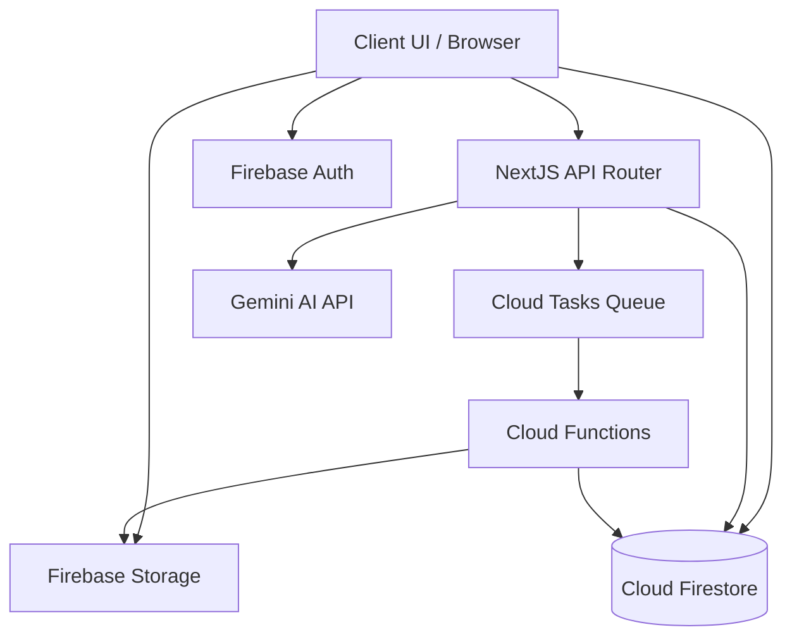
```mermaid
graph TB
    Client[Client UI / Browser]
    ApiRouter[NextJS API Router]
    Storage[Firebase Storage]
    AuthService[Firebase Auth]
    CloudFunctions[Cloud Functions]
    CloudTasks[Cloud Tasks Queue]
    Gemini[Gemini AI API]
    Firestore[(Cloud Firestore)]

    Client --> AuthService
    Client --> Storage
    Client --> Firestore
    Client --> ApiRouter

    ApiRouter --> Gemini
    ApiRouter --> CloudTasks
    ApiRouter --> Firestore

    CloudTasks --> CloudFunctions
    CloudFunctions --> Firestore
    CloudFunctions --> Storage
```

### Technology Stack

| Layer                    | Choice / Version             | Role in Feature                                             | Notes                                             |
| ------------------------ | ---------------------------- | ----------------------------------------------------------- | ------------------------------------------------- |
| Frontend / CLI           | Next.js v16.2.6 (App Router) | ユーザーUIの提供、ローカルセッション永続化                  | React v19.2.4、TypeScript                         |
| Backend / Services       | Next.js API Routes           | セキュアなAI判定プロキシ、即時退会Auth削除、Cloud Tasks登録 | Firebase Admin SDK                                |
| Data / Storage           | Cloud Firestore              | 全データの永続化とアトミックカウント更新                    | `firestore.indexes.json` で複合インデックスを管理 |
| Messaging / Events       | Cloud Tasks                  | 退会時非同期分割匿名化ジョブの遅延実行                      | Cloud Functions と連携                            |
| Infrastructure / Runtime | Firebase Storage             | アバターやカバー画像の保存（上限2MB）                       | Storage Security Rules による認証保護             |

---

## File Structure Plan

### Directory Structure
```
src/
├── app/
│   └── api/
│       ├── admin/
│       │   └── users/
│       │       ├── ban/
│       │       │   └── route.ts  # 管理者ユーザーBAN API (12.1)
│       │       └── unban/
│       │           └── route.ts  # 管理者ユーザーUNBAN API (12.2)
│       ├── attempt/
│       │   ├── ask-ai/
│       │   │   └── route.ts      # AI質問判定API (4.1, 4.2)
│       │   └── verify-truth/
│       │       └── route.ts      # AI真相判定API (4.5, 4.6, 9.8)
│       └── user/
│           ├── delete-account/
│           │   └── route.ts      # 即時退会Auth物理削除API (1.4)
│           └── play-history/
│               └── route.ts      # 本人プレイ履歴API (10.1–10.5)
├── lib/
│   ├── leaderboard-ranking.ts    # 順位比較・マージ・top5抽出 (9.4–9.6)
│   ├── metadata-resolution.ts    # canonical 解決・マージ展開・クイズ保存用メタ適用 (2.x, 11.x) [Phase 6 新規]
│   ├── quiz-format.ts            # resolveQuizFormat（形式推定）(17.x) [既存]
│   ├── quiz-format-match.ts      # クイズ×出題形式照合（検索用）(17.x) [Phase 11 新規]
│   └── quiz-tag-match.ts         # クイズ×タグ照合（AND 検索用）(16.x) [Phase 10 新規]
├── services/
│   ├── attempt.ts                # saveAttempt内LB更新、listUserPlayHistory、review genreFilter (3.x, 9.x, 10.x, 3.7)
│   ├── bookmark.ts               # ブックマークのアトミック管理 (5.3)
│   ├── moderation.ts             # 通報・自動保留のみ (7.1–7.3)。ジャンルAPIスタブ削除 [Phase 6]
│   ├── reputation.ts             # BAN/UNBANサービスと監査ログ記録 (12.1, 12.2)
│   ├── tagMerge.ts               # マージ投票・ジャンル新設（単一経路）(7.4–7.8, 11.7)
│   ├── quiz-list.ts              # リストの管理 (5.4)
│   ├── quiz.ts                   # saveQuiz canonical化、getQuizzesByGenre/Tag、searchQuizzes (2.x, 11.x)
│   ├── storage.ts                # Storageアセット操作、自動クレンジング (1.5, 5.1)
│   └── user.ts                   # バッジ付与、プロフィール編集 (1.2, 1.3)
└── types/
    └── index.ts                  # すべての型定義ファイル (1.1, 2.2, 3.5, etc)
```

### Modified Files
- `src/types/index.ts` — 称号、ウミガメスープ履歴、必須キーワード `truthKeywords` などの型定義を網羅。
- `src/services/quiz.ts` — クイズ公開時バリデーション（ウミガメスープにおけるキーワード設定検証）等を追加。
- `src/services/quiz-validation.ts` — ウミガメスープ形式の時、必須キーワードが最低1つ指定されているかどうかの検証を追加。
- `src/services/ask-ai-utils.ts` — 会話履歴を反映したシステムインラインプロンプト構築と Gemini Chat API 連携用マッピングロジックを追加。
- `src/services/verify-truth-utils.ts` — **Phase 14**: `buildVerifyTruthPrompt` に `truthKeywords` 引数を追加しエッセンス参照をプロンプトへ組み込む。**Phase 16**: 不合格 REASON 指示と固定2種 `advice` 正規化。`verifyKeywords` はテストプレイ向けに維持。
- `src/app/api/attempt/ask-ai/route.ts` — Firestore から履歴を取得して直近20回分の履歴を Gemini に渡しステートフルな呼び出しを行うよう修正。
- `src/app/api/attempt/verify-truth/route.ts` — **Phase 14**: キーワード即合格バイパスを削除し、常に AI 意味判定を実行。**Phase 16**: Admin SDK 化、クライアント計測 `elapsedSeconds` の保存、不合格 `advice` の固定2種正規化。
- `src/app/api/attempt/give-up-lateral/route.ts` — **Phase 16 新規**、**Phase 17**: `revealText` 返却廃止、不合格完了のみ。
- `src/services/lateral-give-up-utils.ts` — **Phase 16 新規**。諦め時表示テキスト解決（`explanation` 優先、未設定時 `aiContextDetails`）。
- `src/hooks/useElapsedSeconds.ts` — **Phase 16 新規**。プレイ中の経過秒数カウント。
- `src/lib/format-play-elapsed.ts` — **Phase 16 新規**。経過時間の表示フォーマットと API 保存用正規化。
- `src/app/quiz/[id]/play/quiz-play-client.tsx` — **Phase 16**: チャット統合入力（質問／回答切替）、諦め UI、経過時間、ルール説明、入力ロック。
- `src/app/quiz/[id]/play/play.module.css` — **Phase 16**: 入力モード切替・統合真相入力・グレーアウト・ルール説明スタイル。
- `src/components/quiz/quiz-editor.tsx` — ウミガメスープ形式の問題作成時に、タグ風UIで必須キーワードを追加・削除できるフォームを追加。
- `src/types/index.ts` — `leaderboardFirstPlay` / `leaderboardReplay`、`PlayHistoryEntry` 等を追加。
- `src/lib/leaderboard-ranking.ts` — **新規**。順位比較・ユーザー1枠マージ・上位5抽出の純関数。
- `src/services/attempt.ts` — 全問正解ガードを撤廃し、トランザクション内で初回／リプレイLBを更新。`listUserPlayHistory` を追加。
- `src/app/api/attempt/verify-truth/route.ts` — 共通LB更新ヘルパーを利用（重複ロジック削除）。
- `src/app/api/user/play-history/route.ts` — **新規**。IDトークン検証後、本人のみ履歴を返却。
- `firestore.indexes.json`（またはプロジェクト既定のインデックス定義）— `attempts`: `userId` + `completedAt` 降順クエリ用複合インデックスを追加。
- `tests/lib/leaderboard-ranking.test.ts` — **新規**。順位・マージ・top5の単体テスト。
- `tests/services/attempt-leaderboard.test.ts` — **新規**。初回／リプレイ振り分けの統合テスト。
- `src/lib/metadata-resolution.ts` — **新規**（Phase 6）。`resolveCanonicalGenreId`, `resolveCanonicalTagIds`, `expandGenreIdsForQuery`, `assertActiveGenre`, `ensureTagMasters`.
- `src/services/quiz.ts` — `saveQuiz` で canonical 埋め込み、`getQuizzesByGenre` C2 クエリ、`getQuizzesByTag` を `canonicalTagIds` 優先に、`searchQuizzes` 追加。
- `src/services/quiz-validation.ts` — 公開時ジャンルマスタ存在チェック（`assertActiveGenre` 連携）。
- `src/services/attempt.ts` — `getFailedQuestions` の genreFilter を `expandGenreIdsForQuery` 利用に変更。
- `src/services/moderation.ts` — `submitGenreRequest` / `resolveGenreRequest` 削除（`tagMerge.ts` に統一）。
- `src/types/index.ts` — `GenreMetadata`, `TagMetadata` 型追加。
- `firestore.rules` — `metadata_genres`, `metadata_tags`, `mergeRequests`, `genreRequests`（`detailed_design.md` §6.5 準拠）。
- `firestore.indexes.json` — `(status, canonicalGenreId, createdAt|playCount|bookmarksCount)` 複合インデックス。
- `tests/lib/metadata-resolution.test.ts` — **新規**。
- `tests/services/quiz-genre-query.test.ts` — **新規**（canonical + legacy フォールバック union）。

**Phase 8 追加ファイル**:
- `src/lib/question-list-validation.ts` — **新規**。`listType` ガード、親クイズ `published` 検証、タイプ不一致操作拒否。
- `src/lib/linked-question.ts` — **新規**。参照リンク判定、Copy-on-Write 切り離し、共有問題削除ガード。
- `src/services/author-quiz-search.ts` — **新規**。`searchAuthorQuizzes`（自作・下書き含むキーワード/タグ検索）。
- `src/services/bookmark.ts` — 問題登録時検証、分類フィード取得、問題 BM 通知（13.x）。
- `src/services/question.ts` — 問題一覧 enrich、リスト追加を validation 経由に（14.x）。
- `src/services/quiz-list.ts` — `listType`、問題並び替え、タイプ別一覧、問題リストエクスポート（14.x）。
- `src/services/quiz.ts` — 参照リンク保存パス統合（15.x）。また、`searchQuizzes` API を拡張してタグ、作者名、ジャンル名、タイトルを網羅する並行クエリとクライアント側ハイブリッド部分一致フィルタを実装（Phase 9）。
- `src/services/quiz-list-utils.ts` — `buildQuestionListExportPackage`、`reorderQuestionIds`。
- `src/types/index.ts` — `QuizListType`, `listType`, `Attempt.mode` 拡張、`BookmarkFeed` 型。
- `firestore.indexes.json` — `quizLists`: `authorId` + `listType` + `createdAt`（任意、タイプ別一覧用）。
- `tests/services/quiz-search-universal.test.ts` — **新規**。統合検索（ハイブリッド検索）における並行クエリ、重複排除、および部分一致フィルタの単体テスト（Phase 9）。
- `tests/lib/linked-question.test.ts` — **新規**。
- `tests/services/bookmark-phase8.test.ts` — **新規**。
- `tests/services/quiz-list-question-type.test.ts` — **新規**。
- `tests/services/quiz-linked-question.test.ts` — **新規**。
- `tests/services/author-quiz-search.test.ts` — **新規**。

**Phase 10 追加ファイル**:
- `src/lib/quiz-tag-match.ts` — **新規**。クイズが指定タグ（canonical 解決済み）を満たすかの純関数（要件 16.7–16.8）。
- `src/services/quiz.ts` — `listActiveTags()` 追加、`SearchFilters.tags` 拡張、`searchQuizzes` にタグ AND 合成ロジック。
- `tests/lib/quiz-tag-match.test.ts` — **新規**。canonical / legacy / マージ旧タグの照合。
- `tests/services/quiz-list-active-tags.test.ts` — **新規**。存続タグのみ・ソート・空配列。
- `tests/services/quiz-search-tags-and.test.ts` — **新規**。単一/複数タグ AND、キーワード併用、タグのみ、重複除去。

**Phase 11 追加ファイル**:
- `src/lib/quiz-format-match.ts` — **新規**。`resolveQuizFormat` を用いたクイズ×指定形式の一致判定（要件 17.1, 17.6）。
- `src/services/quiz.ts` — `SearchFilters.format` 追加、`searchQuizzes` 後段に形式フィルタを挿入。
- `tests/lib/quiz-format-match.test.ts` — **新規**。`format` フィールドあり／問題から推定／不一致。
- `tests/services/quiz-search-format-filter.test.ts` — **新規**。形式のみ、genreId+format、tags+format+keyword、format 未指定 regression、scoped genre 漏れなし。

---

## System Flows

### タグ AND 複合検索フロー（Phase 10）

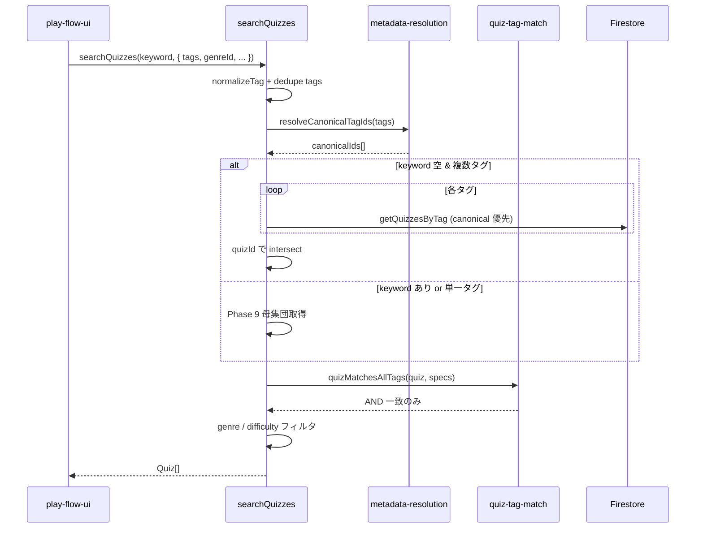
```mermaid
sequenceDiagram
    participant UI as play-flow-ui
    participant QS as searchQuizzes
    participant MR as metadata-resolution
    participant QTM as quiz-tag-match
    participant DB as Firestore

    UI->>QS: searchQuizzes(keyword, { tags, genreId, ... })
    QS->>QS: normalizeTag + dedupe tags
    QS->>MR: resolveCanonicalTagIds(tags)
    MR-->>QS: canonicalIds[]
    alt keyword 空 & 複数タグ
        loop 各タグ
            QS->>DB: getQuizzesByTag (canonical 優先)
        end
        QS->>QS: quizId で intersect
    else keyword あり or 単一タグ
        QS->>QS: Phase 9 母集団取得
    end
    QS->>QTM: quizMatchesAllTags(quiz, specs)
    QTM-->>QS: AND 一致のみ
    QS->>QS: genre / difficulty フィルタ
    QS-->>UI: Quiz[]
```

### タグマスタ一覧フロー（Phase 10）

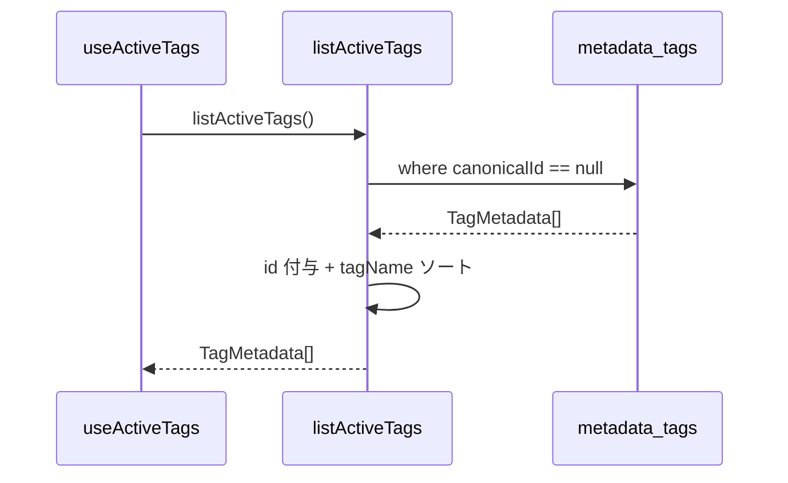
```mermaid
sequenceDiagram
    participant UI as useActiveTags
    participant QS as listActiveTags
    participant DB as metadata_tags

    UI->>QS: listActiveTags()
    QS->>DB: where canonicalId == null
    DB-->>QS: TagMetadata[]
    QS->>QS: id 付与 + tagName ソート
    QS-->>UI: TagMetadata[]
```

### 出題形式フィルタ付き複合検索フロー（Phase 11）

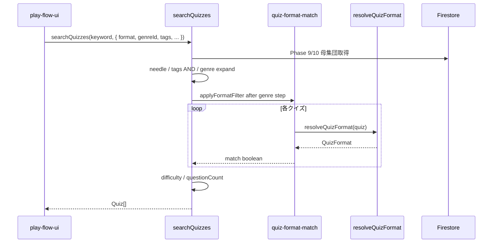
```mermaid
sequenceDiagram
    participant UI as play-flow-ui
    participant QS as searchQuizzes
    participant QFM as quiz-format-match
    participant RF as resolveQuizFormat
    participant DB as Firestore

    UI->>QS: searchQuizzes(keyword, { format, genreId, tags, ... })
    QS->>DB: Phase 9/10 母集団取得
    QS->>QS: needle / tags AND / genre expand
    QS->>QFM: applyFormatFilter after genre step
    loop 各クイズ
        QFM->>RF: resolveQuizFormat(quiz)
        RF-->>QFM: QuizFormat
        QFM-->>QS: match boolean
    end
    QS->>QS: difficulty / questionCount
    QS-->>UI: Quiz[]
```

### 検索ログ fire-and-forget フロー（Phase 10 スマートサジェスト追記）

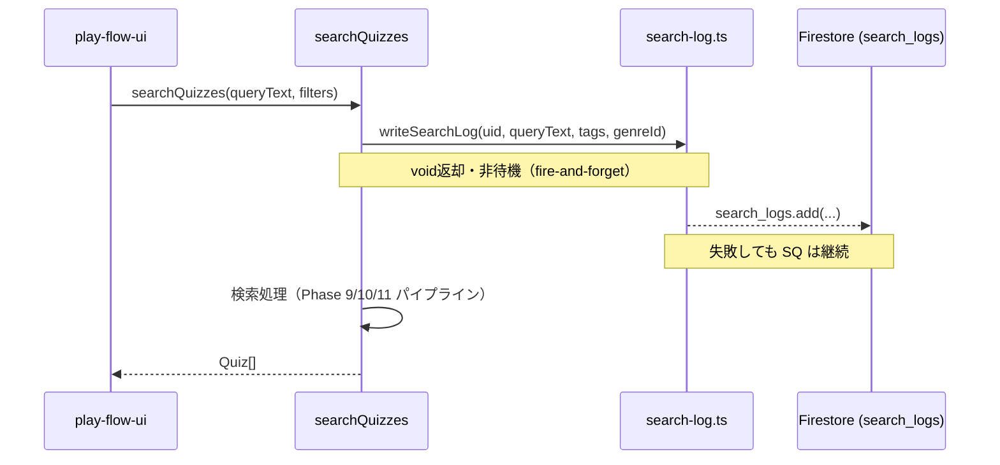
```mermaid
sequenceDiagram
    participant UI as play-flow-ui
    participant SQ as searchQuizzes
    participant SL as search-log.ts
    participant DB as Firestore (search_logs)

    UI->>SQ: searchQuizzes(queryText, filters)
    SQ->>SL: writeSearchLog(uid, queryText, tags, genreId)   
    Note over SQ,SL: void返却・非待機（fire-and-forget）
    SL-->>DB: search_logs.add(...)   
    Note over SL,DB: 失敗しても SQ は継続
    SQ->>SQ: 検索処理（Phase 9/10/11 パイプライン）
    SQ-->>UI: Quiz[]
```

**フロー上の決定**:
- `writeSearchLog` は `async` だが `await` せず `void` で呼び出す。完了を待たないため検索レイテンシに影響しない。
- 未認証（uid なし）または空クエリの場合は `writeSearchLog` を呼び出さず早期リターン。
- `search_logs` ドキュメントの内部エラーは `console.error` のみ（据広げしない）。

### 週間人気ジャンル Top5 集計フロー（Phase 10 スマートサジェスト追記）

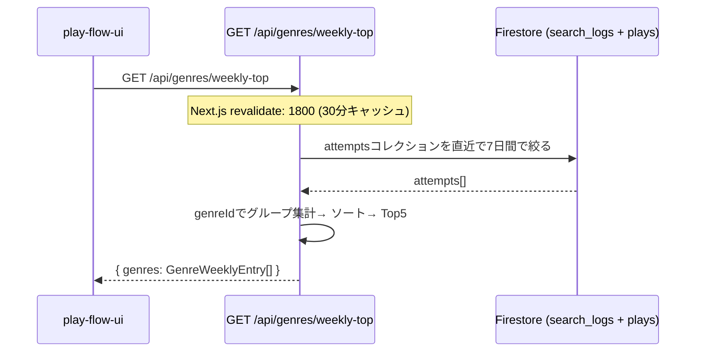
```mermaid
sequenceDiagram
    participant UI as play-flow-ui
    participant API as GET /api/genres/weekly-top
    participant DB as Firestore (search_logs + plays)

    UI->>API: GET /api/genres/weekly-top
    Note over API: Next.js revalidate: 1800 (30分キャッシュ)
    API->>DB: attemptsコレクションを直近で7日間で絞る
    DB-->>API: attempts[]
    API->>API: genreIdでグループ集計→ ソート→ Top5
    API-->>UI: { genres: GenreWeeklyEntry[] }
```

**フロー上の決定**:
- `attempts` コレクションを集計源とする（`completedAt >= now - 7日` フィルタ）。`search_logs` はアクセスログ疲の統計に使わず、実際のプレイ完了数を正確に反映するため `attempts` 連用。
- `status === 'published'` で有効なジャンルがある attempt のみ集計対象（test-play attempt を含む不完全な attempt は失敗してもスキップ）。
- API エラー時は HTTP 500 を返し、代替データフォールバックを和えない（要件 18.5）。

### 週間人気ワード／タグ Top5 集計フロー（Phase 10 スマートサジェスト追記）

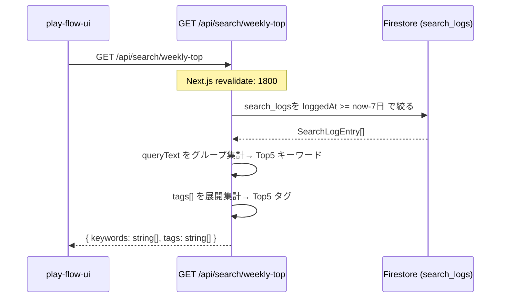
```mermaid
sequenceDiagram
    participant UI as play-flow-ui
    participant API as GET /api/search/weekly-top
    participant DB as Firestore (search_logs)

    UI->>API: GET /api/search/weekly-top
    Note over API: Next.js revalidate: 1800
    API->>DB: search_logsを loggedAt >= now-7日 で絞る
    DB-->>API: SearchLogEntry[]
    API->>API: queryText をグループ集計→ Top5 キーワード
    API->>API: tags[] を展開集計→ Top5 タグ
    API-->>UI: { keywords: string[], tags: string[] }
```

**フロー上の決定**:
- `queryText` が空なログはキーワード集計から除外。`tags` が空のログはタグ集計から除外。
- キーワードとタグは別フィールドで返す（要件 18.8）。
- API エラー時は HTTP 500、代替データフォールバックなし（要件 18.10）。


### クイズリーダーボード更新フロー（`saveAttempt` / `verify-truth` 共通）

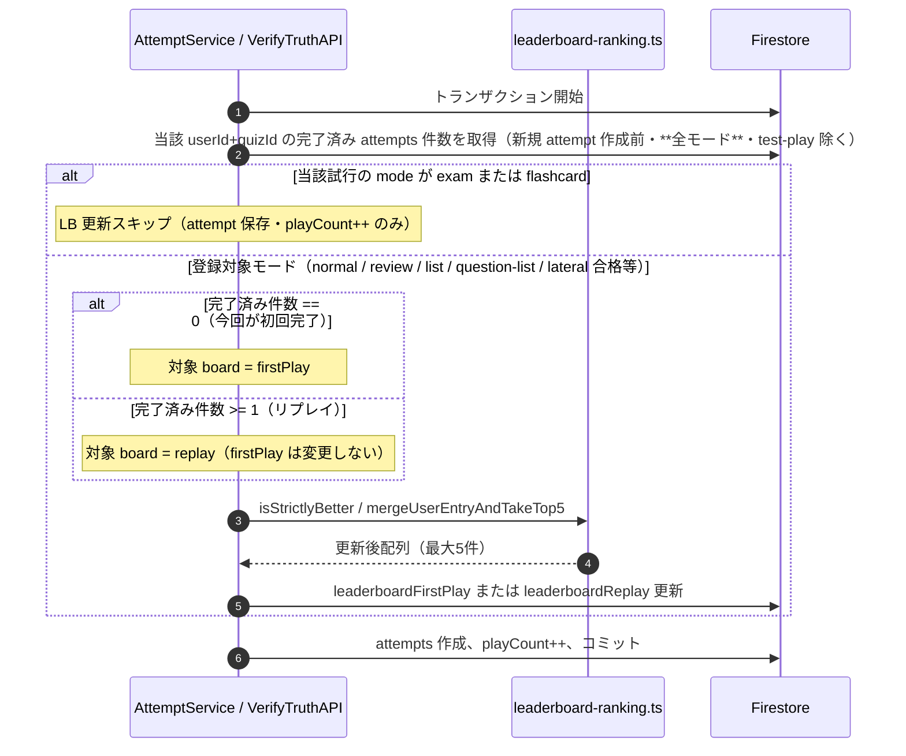
```mermaid
sequenceDiagram
    autonumber
    participant Svc as AttemptService / VerifyTruthAPI
    participant Rank as leaderboard-ranking.ts
    participant DB as Firestore

    Svc->>DB: トランザクション開始
    Svc->>DB: 当該 userId+quizId の完了済み attempts 件数を取得（新規 attempt 作成前・**全モード**・test-play 除く）
    alt 当該試行の mode が exam または flashcard
        Note over Svc: LB 更新スキップ（attempt 保存・playCount++ のみ）
    else 登録対象モード（normal / review / list / question-list / lateral 合格等）
        alt 完了済み件数 == 0（今回が初回完了）
            Note over Svc: 対象 board = firstPlay
        else 完了済み件数 >= 1（リプレイ）
            Note over Svc: 対象 board = replay（firstPlay は変更しない）
        end
        Svc->>Rank: isStrictlyBetter / mergeUserEntryAndTakeTop5
        Rank-->>Svc: 更新後配列（最大5件）
        Svc->>DB: leaderboardFirstPlay または leaderboardReplay 更新
    end
    Svc->>DB: attempts 作成、playCount++、コミット
```

**フロー上の決定（Phase 18 改定）**:
- 全問正解チェックは行わない。ゲスト・`test-play` は LB 更新対象外（attempt 永続化自体が行われない）。
- **`exam` / `flashcard`**: attempt は永続化するが、初回・リプレイいずれの LB も更新しない。
- **prior 件数カウント**: LB 登録対象の試行を保存するときのみ `countPriorCompletedAttempts` を呼ぶが、カウント対象は**モードを問わない**完了済み永続化試行（test-play 除く）。先に exam/flashcard のみ完了したユーザーは、次の normal 等で prior >= 1 となり **replay のみ**更新される。
- **`verify-truth`**: 合格完了時も同一 `buildLeaderboardUpdatesForQuiz` 経路。prior 件数はトランザクション前に全モードで集計（既存実装を維持）。

### 水平思考クイズ（ウミガメのスープ）ステートフルAI質問対話フロー

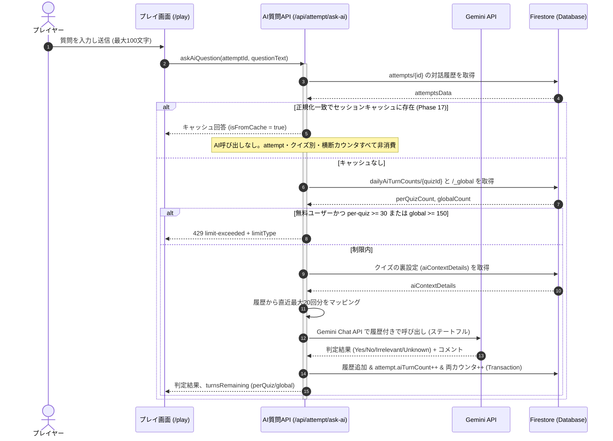
```mermaid
sequenceDiagram
    autonumber
    actor Player as プレイヤー
    participant Client as プレイ画面 (/play)
    participant API as AI質問API (/api/attempt/ask-ai)
    participant AI as Gemini API
    participant DB as Firestore (Database)

    Player->>Client: 質問を入力し送信 (最大100文字)
    Client->>API: askAiQuestion(attemptId, questionText)
    activate API
    API->>DB: attempts/{id} の対話履歴を取得
    DB-->>API: attemptsData
    
    alt 正規化一致でセッションキャッシュに存在 (Phase 17)
        API-->>Client: キャッシュ回答 (isFromCache = true)
        Note over API: AI呼び出しなし。attempt・クイズ別・横断カウンタすべて非消費
    else キャッシュなし
        API->>DB: dailyAiTurnCounts/{quizId} と /_global を取得
        DB-->>API: perQuizCount, globalCount
        alt 無料ユーザーかつ per-quiz >= 30 または global >= 150
            API-->>Client: 429 limit-exceeded + limitType
        else 制限内
            API->>DB: クイズの裏設定 (aiContextDetails) を取得
            DB-->>API: aiContextDetails
            API->>API: 履歴から直近最大20回分をマッピング
            API->>AI: Gemini Chat API で履歴付きで呼び出し (ステートフル)
            AI-->>API: 判定結果 (Yes/No/Irrelevant/Unknown) + コメント
            API->>DB: 履歴追加 & attempt.aiTurnCount++ & 両カウンタ++ (Transaction)
            API-->>Client: 判定結果、turnsRemaining (perQuiz/global)
        end
    end
    deactivate API
```

### 水平思考クイズ（ウミガメのスープ）AI 意味的真相自動判定フロー（Phase 14）

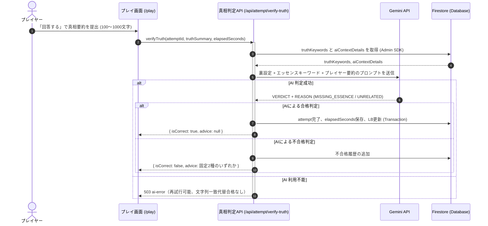
```mermaid
sequenceDiagram
    autonumber
    actor Player as プレイヤー
    participant Client as プレイ画面 (/play)
    participant API as 真相判定API (/api/attempt/verify-truth)
    participant AI as Gemini API
    participant DB as Firestore (Database)

    Player->>Client: 「回答する」で真相要約を提出 (100〜1000文字)
    Client->>API: verifyTruth(attemptId, truthSummary, elapsedSeconds)
    activate API
    API->>DB: truthKeywords と aiContextDetails を取得 (Admin SDK)
    DB-->>API: truthKeywords, aiContextDetails
    API->>AI: 裏設定 + エッセンスキーワード + プレイヤー要約のプロンプトを送信
    alt AI 判定成功
        AI-->>API: VERDICT + REASON (MISSING_ESSENCE / UNRELATED)
        alt AIによる合格判定
            API->>DB: attempt完了、elapsedSeconds保存、LB更新 (Transaction)
            API-->>Client: { isCorrect: true, advice: null }
        else AIによる不合格判定
            API->>DB: 不合格履歴の追加
            API-->>Client: { isCorrect: false, advice: 固定2種のいずれか }
        end
    else AI 利用不能
        API-->>Client: 503 ai-error（再試行可能、文字列一致代替合格なし）
    end
    deactivate API
```

### 水平思考クイズ — 諦めフロー（Phase 17、Phase 16 解説開示を廃止）

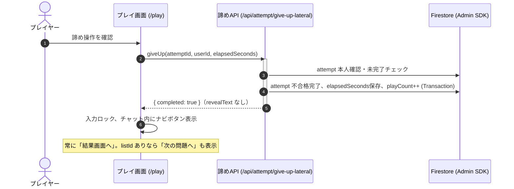
```mermaid
sequenceDiagram
    autonumber
    actor Player as プレイヤー
    participant Client as プレイ画面 (/play)
    participant API as 諦めAPI (/api/attempt/give-up-lateral)
    participant DB as Firestore (Admin SDK)

    Player->>Client: 諦め操作を確認
    Client->>API: giveUp(attemptId, userId, elapsedSeconds)
    activate API
    API->>DB: attempt 本人確認・未完了チェック
    API->>DB: attempt 不合格完了、elapsedSeconds保存、playCount++ (Transaction)
    API-->>Client: { completed: true }（revealText なし）
    deactivate API
    Client->>Client: 入力ロック、チャット内にナビボタン表示
    Note over Client: 常に「結果画面へ」。listId ありなら「次の問題へ」も表示
```

### ユーザー退会・非同期データクレンジングフロー

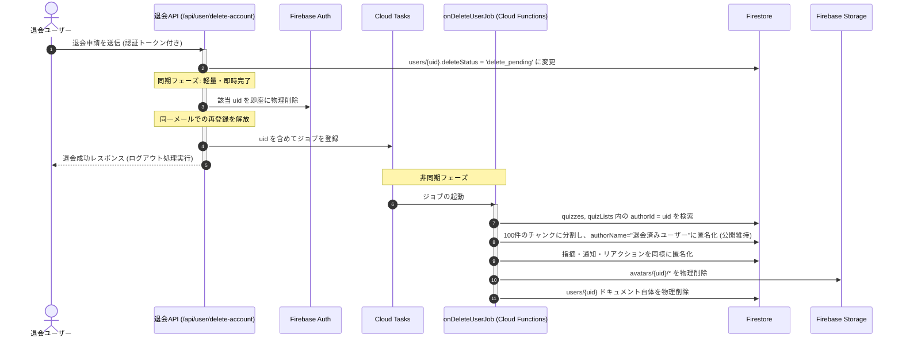
```mermaid
sequenceDiagram
    autonumber
    actor User as 退会ユーザー
    participant API as 退会API (/api/user/delete-account)
    participant Auth as Firebase Auth
    participant CloudTasks as Cloud Tasks
    participant Function as onDeleteUserJob (Cloud Functions)
    participant DB as Firestore
    participant Storage as Firebase Storage

    User->>API: 退会申請を送信 (認証トークン付き)
    activate API
    API->>DB: users/{uid}.deleteStatus = 'delete_pending' に変更
    Note over API: 同期フェーズ: 軽量・即時完了
    API->>Auth: 該当 uid を即座に物理削除
    Note over API: 同一メールでの再登録を解放
    API->>CloudTasks: uid を含めてジョブを登録
    API-->>User: 退会成功レスポンス (ログアウト処理実行)
    deactivate API

    Note over CloudTasks, Function: 非同期フェーズ
    CloudTasks->>Function: ジョブの起動
    activate Function
    Function->>DB: quizzes, quizLists 内の authorId = uid を検索
    Function->>DB: 100件のチャンクに分割し、authorName="退会済みユーザー"に匿名化 (公開維持)
    Function->>DB: 指摘・通知・リアクションを同様に匿名化
    Function->>Storage: avatars/{uid}/* を物理削除
    Function->>DB: users/{uid} ドキュメント自体を物理削除
    deactivate Function
```

### クイズ保存時のメタデータ解決フロー（Phase 6）

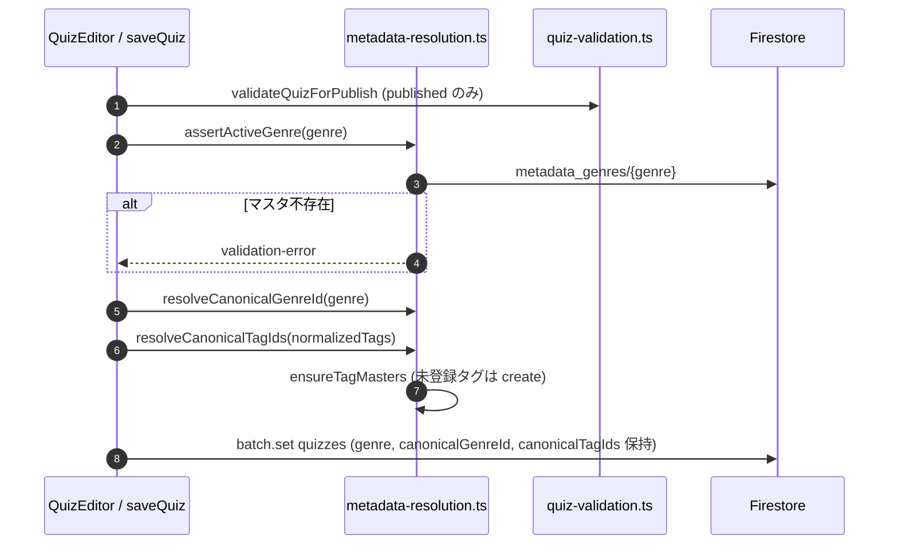
```mermaid
sequenceDiagram
    autonumber
    participant Editor as QuizEditor / saveQuiz
    participant Meta as metadata-resolution.ts
    participant Val as quiz-validation.ts
    participant DB as Firestore

    Editor->>Val: validateQuizForPublish (published のみ)
    Editor->>Meta: assertActiveGenre(genre)
    Meta->>DB: metadata_genres/{genre}
    alt マスタ不存在
        Meta-->>Editor: validation-error
    end
    Editor->>Meta: resolveCanonicalGenreId(genre)
    Editor->>Meta: resolveCanonicalTagIds(normalizedTags)
    Meta->>Meta: ensureTagMasters (未登録タグは create)
    Editor->>DB: batch.set quizzes (genre, canonicalGenreId, canonicalTagIds 保持)
```

**フロー上の決定**: `genre` 表示用文字列は変更しない。下書きもジャンル必須（要件2.1）。テストプレイは `saveQuiz` を経由せず canonical 未設定を許容。

### ジャンル別公開クイズ一覧（C2 読み取り）フロー（Phase 6）

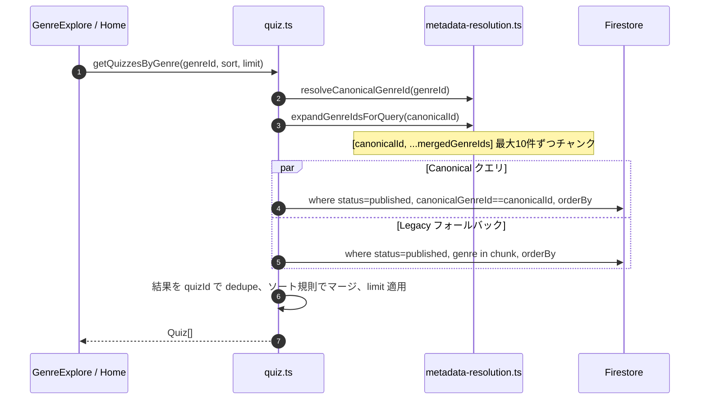
```mermaid
sequenceDiagram
    autonumber
    participant UI as GenreExplore / Home
    participant Quiz as quiz.ts
    participant Meta as metadata-resolution.ts
    participant DB as Firestore

    UI->>Quiz: getQuizzesByGenre(genreId, sort, limit)
    Quiz->>Meta: resolveCanonicalGenreId(genreId)
    Quiz->>Meta: expandGenreIdsForQuery(canonicalId)
    Note over Meta: [canonicalId, ...mergedGenreIds] 最大10件ずつチャンク
    par Canonical クエリ
        Quiz->>DB: where status=published, canonicalGenreId==canonicalId, orderBy
    and Legacy フォールバック
        Quiz->>DB: where status=published, genre in chunk, orderBy
    end
    Quiz->>Quiz: 結果を quizId で dedupe、ソート規則でマージ、limit 適用
    Quiz-->>UI: Quiz[]
```

**フロー上の決定**: 正規識別子が空の legacy クイズは `genre in` のみヒット。canonical ヒットと legacy ヒットの重複は `id` で除去。

---

## Requirements Traceability

| Requirement | Summary                                               | Components                         | Interfaces                                  | Flows                           |
| ----------- | ----------------------------------------------------- | ---------------------------------- | ------------------------------------------- | ------------------------------- |
| 1.1         | ユーザー登録および認証                                | User Authentication                | Firebase Auth                               | -                               |
| 1.2         | プロフィール編集                                      | `UserService`                      | `updateProfile`                             | -                               |
| 1.3         | 称号バッジ自動付与                                    | `UserService`                      | `checkAndAwardBadges`                       | -                               |
| 1.4         | 退会時即時Auth削除                                    | `DeleteAccountAPI`                 | `/api/user/delete-account`                  | 退会フロー                      |
| 1.5         | 大規模関連データの非同期匿名化                        | `onDeleteUserJob`                  | Cloud Functions Trigger                     | 退会フロー                      |
| 1.6         | 退会保留中のアクセス遮断                              | Security Rules                     | `deleteStatus != 'delete_pending'`          | -                               |
| 2.1         | 下書き（タイトル・ジャンル・問題文必須）              | `QuizService`                      | `saveQuiz('draft')`                         | メタデータ解決フロー            |
| 2.2         | ジャンルマスタ存在検証                                | `metadata-resolution`              | `assertActiveGenre`                         | メタデータ解決フロー            |
| 2.3         | 公開時バリデーション & NGチェック                     | `QuizService`                      | `saveQuiz('published')`                     | メタデータ解決フロー            |
| 2.4         | 保存時 canonical 非正規化                             | `metadata-resolution`              | `resolveCanonical*`                         | メタデータ解決フロー            |
| 2.5         | 未登録タグのマスタ自動 create                         | `metadata-resolution`              | `ensureTagMasters`                          | メタデータ解決フロー            |
| 2.6         | タグ名寄せ & 類似サジェスト                           | `QuizService`                      | `normalizeTag`, `getSimilarTag`             | -                               |
| 2.7         | クイズタイトル更新時の非正規化同期                    | `QuizService`                      | `updateQuiz`                                | -                               |
| 2.8         | クイズ削除時のカスケードクリーンアップ                | `QuizService`                      | `deleteQuiz`                                | -                               |
| 2.9         | 作成クイズ一括エクスポート                            | `QuizService`                      | `exportQuizzes`                             | -                               |
| 2.10        | 必須キーワード(エッセンス)のタグ風UI入力              | `QuizCreator` / UI                 | `truthKeywords`                             | -                               |
| 2.11        | 公開時必須キーワードバリデーション                    | `QuizService`                      | `validateQuizForPublish`                    | -                               |
| 2.12        | テストプレイは canonical 不要                         | `test-play`                        | sessionStorage 経路                         | -                               |
| 3.1         | 通常モードプレイ                                      | `AttemptService`                   | `saveAttempt`                               | -                               |
| 3.2         | 解答セッションローカル永続化                          | `LocalAttemptSession`              | `saveToLocalStorage`                        | -                               |
| 3.3         | オフラインプレイ結果と自動同期                        | `LocalAttemptSession`              | `syncPendingAttempts`                       | -                               |
| 3.4         | オフラインリストプレイの進行ブロック                  | `LocalAttemptSession`              | `checkConnectivity`                         | -                               |
| 3.5         | プレイ結果画面（良問評価・難易度投票）                | `ReviewService`                    | `submitReview`                              | -                               |
| 3.6         | 永続化試行保存とLB更新委譲                            | `AttemptService`                   | `saveAttempt`                               | リーダーボード更新フロー        |
| 3.7         | 弱点克服ジャンルフィルタ（マージ展開）                | `AttemptService`                   | `getFailedQuestions`                        | -                               |
| 9.1         | 永続化完了時のLB評価（登録対象モードのみ）                        | `leaderboard-update.ts`            | `isLeaderboardEligibleAttempt`              | リーダーボード更新フロー        |
| 9.2         | exam/flashcard は LB 非登録                                       | `leaderboard-update.ts`            | `isLeaderboardEligibleAttempt`              | リーダーボード更新フロー        |
| 9.3         | prior 件数は全モード（test-play 除く）                            | `AttemptService`, `verify-truth`   | `countPriorCompletedAttempts`               | リーダーボード更新フロー        |
| 9.4         | prior 0 → firstPlay のみ                                          | `leaderboard-ranking.ts`           | `resolveLeaderboardBoard`                   | リーダーボード更新フロー        |
| 9.5         | prior >= 1 → replay のみ                                          | `leaderboard-ranking.ts`           | `resolveLeaderboardBoard`                   | リーダーボード更新フロー        |
| 9.6         | exam 先 → 通常は replay のみ                                      | `AttemptService`                   | `saveAttempt` (tx)                          | リーダーボード更新フロー        |
| 9.7         | 正解数優先・同点タイム順                                          | `leaderboard-ranking.ts`           | `compareLeaderboard`                        | -                               |
| 9.8         | ユーザー1枠・厳密優位時のみ差し替え                               | `leaderboard-ranking.ts`           | `mergeUserEntryAndTakeTop5`                 | -                               |
| 9.9         | 上位5件保持                                                       | `leaderboard-ranking.ts`           | `mergeUserEntryAndTakeTop5`                 | -                               |
| 9.10        | 全問正解不要                                                      | `AttemptService`                   | `saveAttempt`                               | -                               |
| 9.11        | ウミガメ合格時の同一LB規則                                        | `VerifyTruthAPI`                   | `/api/attempt/verify-truth`                 | 真相判定フロー                  |
| 9.12        | review/list/question-list は引き続き登録対象                      | `leaderboard-update.ts`            | `isLeaderboardEligibleAttempt`              | -                               |
| 9.13–9.14   | モード選択警告 UI は Out                                          | —                                  | `quizeum-play-flow-ui`                      | Out of boundary                 |
| 10.1        | 本人履歴・完了日時降順                                | `AttemptService` / PlayHistoryAPI  | `listUserPlayHistory`                       | -                               |
| 10.2        | test-play 除外                                        | `AttemptService`                   | `listUserPlayHistory`                       | -                               |
| 10.3        | 表示用メタデータ                                      | `AttemptService`                   | `listUserPlayHistory`                       | -                               |
| 10.4        | 初回20件+カーソル                                     | `PlayHistoryAPI`                   | `GET /api/user/play-history`                | -                               |
| 10.5        | 他人の履歴拒否                                        | `PlayHistoryAPI`                   | `GET /api/user/play-history`                | -                               |
| 4.1–4.4     | ウミガメ会員必須・attempt 作成                        | `quiz-detail-client`, `AttemptService` | `createLateralAttemptSession`               | 認証フロー                      |
| 4.5         | 最大20回分の会話履歴を参照したステートフルAI質問      | `AskAiQuestionAPI`                 | `/api/attempt/ask-ai`                       | 質問対話フロー                  |
| 4.6–4.7     | 無料 tier 二層制限（30/クイズ・150/日横断）           | `ask-ai-utils`, `AskAiQuestionAPI` | `checkAiTurnLimits`, `dailyAiTurnCounts`    | 質問対話フロー                  |
| 4.8–4.9     | Pro 無制限・サーバー側 tier 参照                      | `EntitlementService`, `AskAiQuestionAPI` | `/api/attempt/ask-ai`                     | 質問対話フロー                  |
| 4.10        | 正規化キャッシュ（全カウンタ非消費）                  | `ask-ai-utils`                     | `normalizeQuestionText`, `findCachedAnswer` | 質問対話フロー                  |
| 4.11        | 上限到達・Pro 誘導（真相提出は継続可）                | `AskAiQuestionAPI`                 | `limit-exceeded` + `limitType`              | 質問対話フロー                  |
| 4.12        | プレイ画面2カラム（チャット＋ルール）                 | UI Component                       | `quiz-play-client` (lateral)                | -                               |
| 4.19        | チャット統合入力（質問／回答切替）                    | UI Component                       | `quiz-play-client`                          | -                               |
| 4.20        | プレイ中経過時間（チャットヘッダー）                  | `useElapsedSeconds`                | `format-play-elapsed`                       | -                               |
| 4.21        | 諦め・真相非表示・不合格完了                          | `GiveUpLateralAPI`                 | `/api/attempt/give-up-lateral`              | 諦めフロー（Phase 17）          |
| 4.22–4.23   | チャット内ナビ（結果／次の問題）                      | UI Component                       | `quiz-play-client`                          | 諦めフロー（play-flow-ui）      |
| 4.24        | 諦め／合格時の入力ロック・グレーアウト                | UI Component                       | `quiz-play-client`                          | -                               |
| 4.25        | 完了時 elapsedSeconds 保存                            | `VerifyTruthAPI`, `GiveUpLateralAPI` | verify-truth, give-up-lateral               | 真相判定／諦めフロー            |
| 4.26        | プレイヤー向けルール説明（右パネル）                  | UI Component                       | `quiz-play-client`                          | -                               |
| 4.27        | 真相／諦め API の認証・本人確認                       | API Routes                         | verify-truth, give-up-lateral               | -                               |
| 4.7         | 裏設定・エッセンス・要約の AI 意味判定                | `VerifyTruthAPI`, `verify-truth-utils` | `buildVerifyTruthPrompt`, `/api/attempt/verify-truth` | 真相判定フロー          |
| 4.8         | 文字列完全一致を合格条件としない                      | `verify-truth-utils`               | `buildVerifyTruthPrompt`                    | 真相判定フロー                  |
| 4.9         | キーワードをエッセンス参照として AI に指示            | `verify-truth-utils`               | `buildVerifyTruthPrompt`                    | 真相判定フロー                  |
| 4.10        | AI 失敗時は再試行・代替合格なし                       | `VerifyTruthAPI`                   | `/api/attempt/verify-truth`                 | 真相判定フロー                  |
| 4.11–4.12   | 真相判定合格/不合格フロー                             | `VerifyTruthAPI`                   | `/api/attempt/verify-truth`                 | 真相判定フロー                  |
| 19.1–19.23  | Stripe サブスクリプション（Phase 13）                  | `EntitlementService`, billing APIs | `/api/billing/*`, `/api/webhooks/stripe`      | 購読・Webhook フロー            |
| 5.1         | フォロー/フォロワーアトミック更新                     | `UserService`                      | `followUser`                                | -                               |
| 5.2         | タイムラインフィード表示                              | `QuizService`                      | `getFollowedTimeline`                       | -                               |
| 5.3         | ブックマークアトミック更新                            | `BookmarkService`                  | `toggleBookmark`                            | -                               |
| 5.4         | クイズリスト作成・編集・削除                          | `QuizListService`                  | `createQuizList`                            | -                               |
| 5.5         | リスト連続プレイ (Attempt.listId)                     | `AttemptService`                   | `saveAttempt(mode='list')`                  | -                               |
| 5.6         | クイズリストパッケージエクスポート                    | `QuizListService`                  | `exportQuizList`                            | -                               |
| 6.1         | クローズド指摘フィードバック送信                      | `ReviewService`                    | `submitFeedbackReport`                      | -                               |
| 6.2         | 指摘解決時の修正完了オート通知                        | `ReviewService`                    | `resolveReport`                             | -                               |
| 6.3         | 👍/👎良問投票（作成者除外）                             | `ReviewService`                    | `submitReview`                              | -                               |
| 6.4         | 仮リセット期間中の評価マスク                          | UI Component                       | `QuizDetailView`                            | -                               |
| 6.5         | 評価リセット承認時の非同期クリーンアップ              | `ReviewService`                    | `resetReviews`                              | -                               |
| 7.1         | コンテンツ通報とアトミック更新                        | `ModerationService`                | `flagContent`                               | -                               |
| 7.2         | 5回通報時の自動保留（非公開）                         | `ModerationService`                | `flagContent` (Function)                    | -                               |
| 7.3         | 管理者審査（公開復帰/永久非公開）                     | `ModerationService`                | `resolveFlag`                               | -                               |
| 7.4         | タグ/ジャンル仮想マージ提案・投票                     | `TagMergeService`                  | `createMergeRequest`, `voteMergeRequest`    | -                               |
| 7.5         | マージ可決 70%                                        | `TagMergeService`                  | `voteMergeRequest` (tx)                     | -                               |
| 7.6         | 新ジャンル申請                                        | `TagMergeService`                  | `submitGenreRequest`                        | -                               |
| 7.7         | ジャンルアイコン SVG 禁止                             | `storage.ts` / UI                  | `uploadImage` MIME 検証                     | -                               |
| 7.8         | ジャンル新設可決 80%                                  | `TagMergeService`                  | `voteGenreRequest`                          | -                               |
| 11.1        | ジャンル一覧（マージ統合）                            | `QuizService`                      | `getQuizzesByGenre`                         | C2 読み取りフロー               |
| 11.2        | canonical 優先 + legacy フォールバック                | `QuizService`                      | `getQuizzesByGenre`                         | C2 読み取りフロー               |
| 11.3        | タグ一覧（canonical）                                 | `QuizService`                      | `getQuizzesByTag`                           | -                               |
| 11.4        | 有効ジャンルマスタ一覧                                | `QuizService`                      | `listActiveGenres`                          | -                               |
| 11.5        | 複合検索                                              | `QuizService`                      | `searchQuizzes`                             | -                               |
| 11.6        | メタデータ Rules                                      | `firestore.rules`                  | metadata_* / mergeRequests                  | -                               |
| 11.7        | ガバナンス単一経路                                    | `TagMergeService`                  | `tagMerge.ts` のみ                          | -                               |
| 11.8        | クイズの統合検索 (ユニバーサル検索)                   | `QuizService`                      | `searchQuizzes`                             | -                               |
| 11.9        | ハイブリッド・マルチクエリ検索 (並行クエリとデデュプ) | `QuizService`                      | `searchQuizzes`                             | -                               |
| 16.1–16.5   | 有効タグマスタ一覧                                    | `QuizService`                      | `listActiveTags`                            | タグマスタ読み取りフロー        |
| 16.6–16.13  | 複数タグ AND 複合検索                                 | `QuizService`, `quiz-tag-match`    | `searchQuizzes`, `resolveCanonicalTagIds`   | タグ AND 検索フロー             |
| 16.14–16.15 | サジェスト API 非対象                                 | —                                  | Out of boundary                             | -                               |
| 17.1–17.3   | 出題形式フィルタ                                      | `QuizService`, `quiz-format-match` | `SearchFilters.format`, `resolveQuizFormat` | 形式フィルタ検索フロー          |
| 17.4–17.5   | ジャンル固定 scoped 検索                              | `QuizService`                      | `searchQuizzes` + `expandGenreIdsForQuery`  | 形式フィルタ検索フロー          |
| 17.6        | UI と同一形式判定                                     | `quiz-format-match`                | `resolveQuizFormat`                         | -                               |
| 17.7–17.8   | インデックス/UI Out                                   | —                                  | Out of boundary                             | -                               |
| 18.1–18.5   | 週間人気ジャンル Top5 集計                            | `GenresWeeklyTopAPI`               | `GET /api/genres/weekly-top`                | 週間ジャンル Top5 フロー        |
| 18.6–18.10  | 週間人気ワード／タグ Top5 集計                        | `SearchWeeklyTopAPI`               | `GET /api/search/weekly-top`                | 週間ワード／タグ Top5 フロー    |
| 18.11–18.13 | 検索ログ記録（fire-and-forget）                       | `QuizService`, `search-log`        | `writeSearchLog`                            | 検索ログ fire-and-forget フロー |
| 18.14–18.16 | 境界明示（履歴は UI 側、Core 不保存）                 | —                                  | Out of boundary                             | -                               |
| 12.1        | ユーザーのBANと監査ログ記録                           | `ReputationService` / API Route    | `/api/admin/users/ban`                      | -                               |
| 12.2        | BAN解除と監査ログ記録                                 | `ReputationService` / API Route    | `/api/admin/users/unban`                    | -                               |
| 12.3        | BAN中の書き込み拒否と強制ログアウト                   | Security Rules / AuthContext       | `isNotBanned()`, `quizeum_banned` Cookie    | -                               |
| 8.1         | 初期HTML読み込み速度0.5秒以内                         | Performance                        | SSR Cache / Optimization                    | -                               |
| 8.2         | 高負荷時エラー率0.1%未満                              | Infrastructure                     | High Availability                           | -                               |
| 8.3         | クローラー向け高速HTMLとOGPメタデータ                 | SSR Component                      | `getServerSideProps` / Metadata             | -                               |

---

## Components and Interfaces

### Component Summary Table

| Component                   | Domain/Layer | Intent                                                                 | Req Coverage                                     | Key Dependencies (P0/P1)                                                              | Contracts             |
| --------------------------- | ------------ | ---------------------------------------------------------------------- | ------------------------------------------------ | ------------------------------------------------------------------------------------- | --------------------- |
| `UserService`               | Service      | ユーザープロフィール、称号、フォロー管理                               | 1.2, 1.3, 5.1                                    | Firestore (P0)                                                                        | Service, State        |
| `metadata-resolution`       | Lib          | canonical 解決・マージ ID 展開・タグマスタ ensure                      | 2.2, 2.4, 2.5, 11.x                              | Firestore (P0)                                                                        | Pure functions + IO   |
| `QuizService`               | Service      | クイズ保存・一覧・検索・エクスポート                                   | 2.1–2.9, 11.1–11.5, 16.1–16.13, 17.1–17.5        | metadata-resolution (P0), quiz-tag-match (P0), quiz-format-match (P0), Firestore (P0) | Service               |
| `quiz-tag-match`            | Lib          | クイズ×タグの canonical/legacy 照合（AND 用）                          | 16.7, 16.8                                       | normalizeTag (P0)                                                                     | Pure functions        |
| `quiz-format-match`         | Lib          | クイズ×出題形式の一致判定（`resolveQuizFormat` 使用）                  | 17.1, 17.6                                       | quiz-format (P0)                                                                      | Pure functions        |
| `TagMergeService`           | Service      | マージ投票・ジャンル新設（`tagMerge.ts`）                              | 7.4–7.8, 11.7                                    | Firestore (P0)                                                                        | Service, State        |
| `leaderboard-ranking`       | Lib          | LB順位比較・マージ・top5・board 振り分け                               | 9.4, 9.5, 9.6, 9.7–9.9                       | -                                                                                     | Pure functions        |
| `leaderboard-update`        | Lib          | LB 登録対象判定・更新ペイロード組み立て                                | 9.1, 9.2, 9.12                               | leaderboard-ranking (P0)                                                              | Pure functions        |
| `AttemptService`            | Service      | 解答永続化、LB更新、本人プレイ履歴、オフライン同期                     | 3.1, 3.2, 3.3, 3.4, 3.6, 5.5, 9.1–9.11, 10.1–10.3 | Firestore (P0), LocalStore (P1), leaderboard-update (P0), leaderboard-ranking (P0)  | Service, State, Batch |
| `/api/genres/weekly-top`    | API Route    | 週間人気ジャンル Top5 集計（attemptsコレクションかまの直近 7日間集計） | 18.1–18.5                                        | Firestore Admin SDK (P0)                                                              | HTTP GET, 30min cache |
| `/api/search/weekly-top`    | API Route    | 週間人気ワード／タグ Top5 集計（search_logsから）                      | 18.6–18.10                                       | Firestore Admin SDK (P0)                                                              | HTTP GET, 30min cache |
| `search-log`                | Lib          | fire-and-forget 検索ログ書き込み                                       | 18.11–18.13                                      | Firestore (P0)                                                                        | Pure function + IO    |
| `/api/user/play-history`    | API Route    | 本人プレイ履歴の認可付き取得                                           | 10.1, 10.4, 10.5                                 | AuthAdmin (P0), AttemptService (P0)                                                   | API                   |
| `BookmarkService`           | Service      | クイズ・リストのブックマークアトミック管理                             | 5.3                                              | Firestore (P0)                                                                        | Service, State        |
| `QuizListService`           | Service      | リストの作成、ドラッグ＆ドロップ、パッケージング                       | 5.4, 5.6                                         | Firestore (P0), QuizService (P1)                                                      | Service, State        |
| `ReviewService`             | Service      | 良問評価、間違い指摘、修正通知、リセットバッチ                         | 3.5, 6.1, 6.2, 6.3, 6.5                          | Firestore (P0), CloudTasks (P1)                                                       | Service, State, Batch |
| `ModerationService`         | Service      | 通報、自動保留、審査のみ                                               | 7.1, 7.2, 7.3                                    | Firestore (P0)                                                                        | Service, State        |
| `ReputationService`         | Service      | 信頼スコア、モデレータ資格、BAN/UNBAN、監査ログ記録                    | 12.1, 12.2                                       | Firestore (P0)                                                                        | Service, State, Tx    |
| `/api/admin/users/ban`      | API Route    | 管理者用ユーザーBAN API                                                | 12.1                                             | AuthAdmin (P0), ReputationService (P0)                                                | API                   |
| `/api/admin/users/unban`    | API Route    | 管理者用ユーザーUNBAN API                                              | 12.2                                             | AuthAdmin (P0), ReputationService (P0)                                                | API                   |
| `/api/user/delete-account`  | API Route    | 即時Auth物理削除とCloud Tasksジョブ登録                                | 1.4                                              | AuthAdmin (P0), CloudTasks (P0)                                                       | API                   |
| `/api/attempt/ask-ai`       | API Route    | 水平思考 AI 質問（二層制限・正規化キャッシュ・Phase 17）               | 4.5–4.11, 4.8–4.9                                | Gemini API (P0), Firestore (P0), ask-ai-utils (P0), EntitlementService (P0)           | API                   |
| `/api/attempt/verify-truth` | API Route    | 水平思考のAI意味的真相判定（Phase 14/16）                              | 4.13–4.18, 4.25, 4.27                            | Gemini API (P0), Firestore Admin (P0), verify-truth-utils (P0)                        | API                   |
| `/api/attempt/give-up-lateral` | API Route | 水平思考の諦め・不合格完了（Phase 17: 真相非返却）                     | 4.21, 4.25, 4.27                                 | Firestore Admin (P0)                                                                  | API                   |

---

### Component Interface Details

#### `UserService`
- **Intent**: ユーザープロフィール情報の管理、アトミックな称号バッジ付与、フォロー管理。
- **Requirements**: `1.2, 1.3, 5.1`

```typescript
export interface UserService {
  // プロフィール更新 (1.2)
  updateProfile(uid: string, data: { displayName: string; bio: string; followedGenres: string[] }): Promise<void>;
  
  // 称号バッジの判定とアトミック付与 (1.3)
  checkAndAwardBadges(uid: string): Promise<Badge[]>;
  
  // ユーザーのフォロー/解除トグル (5.1)
  followUser(followerId: string, followingId: string): Promise<{ isFollowing: boolean }>;
}
```
- **Preconditions**: `uid` が Firebase Auth 上で認証されていること。
- **Postconditions**: 称号バッジ付与時に条件を満たした場合、`users.badges` 配列にアトミックに Badge オブジェクトが追加される。

#### `metadata-resolution`
- **Intent**: ジャンル・タグの canonical 解決、マージ ID 展開、保存時マスタ整合を単一実装に集約。
- **Requirements**: `2.2, 2.4, 2.5, 11.2`

```typescript
export interface GenreMetadata {
  id: string;
  displayName: string;
  iconImageUrl: string | null;
  canonicalId: string | null;
  mergedGenreIds: string[];
  isActive: boolean;
}

/** ジャンルID → 統合先 canonical ID（自身が canonical なら自分） */
export async function resolveCanonicalGenreId(genreId: string): Promise<string>;

/** 正規化タグID配列 → canonicalTagIds（マスタ参照） */
export async function resolveCanonicalTagIds(tagIds: string[]): Promise<string[]>;

/** 一覧用: [canonicalId, ...mergedGenreIds] を dedupe（Firestore in 上限10でチャンク） */
export function chunkIdsForInQuery(ids: string[], chunkSize?: number): string[][];

export async function expandGenreIdsForQuery(genreId: string): Promise<string[]>;

export async function assertActiveGenre(genreId: string): Promise<void>;

/** 未登録タグを metadata_tags に create（canonicalId=null, mergedTagIds=[]） */
export async function ensureTagMasters(
  tagIds: string[],
  createdBy: string
): Promise<void>;
```
- **Invariants**: `resolveCanonicalGenreId` は `canonicalId` チェーンを辿り循環を検出。`genre` 表示値は変更しない。

#### `QuizService`
- **Intent**: クイズの保存、編集、Zod検証、NGワード二重検証付き公開、ジャンル/タグ一覧・複合検索、エクスポート。
- **Requirements**: `2.1–2.9, 11.1–11.5, 16.1–16.13, 17.1–17.5`

```typescript
export type QuizListSort = 'latest' | 'popular' | 'trending';

export interface SearchFilters {
  genreId?: string;
  /** 正規化済みタグ識別子の配列。複数指定時は AND（すべてを含むクイズのみ） */
  tags?: string[];
  /** 出題形式。`resolveQuizFormat` 結果と一致するクイズのみ返す（Phase 11） */
  format?: QuizFormat;
  difficultyMin?: number;
  difficultyMax?: number;
  minQuestions?: number;
  maxQuestions?: number;
}

export interface QuizService {
  saveQuiz(
    quiz: Omit<Quiz, 'id' | 'playCount' | 'bookmarksCount' | 'createdAt' | 'updatedAt'>,
    status: 'draft' | 'published'
  ): Promise<string>;
  normalizeTag(input: string): string;
  getSimilarTagSuggest(tag: string): Promise<string | null>;
  listActiveGenres(): Promise<GenreMetadata[]>;
  /** 存続タグ（canonicalId == null）のみ。UI サジェスト用 */
  listActiveTags(): Promise<TagMetadata[]>;
  getQuizzesByGenre(genreId: string, sort: QuizListSort, limit: number): Promise<Quiz[]>;
  getQuizzesByTag(tagId: string, sort: QuizListSort, limit: number): Promise<Quiz[]>;
  searchQuizzes(
    queryText: string,
    filters: SearchFilters,
    currentUserId?: string
  ): Promise<Quiz[]>;
  deleteQuiz(quizId: string): Promise<void>;
  exportQuizzes(uid: string): Promise<QuizExportPackage>;
}
```
- **Validation Hooks**: `saveQuiz` 内で `assertActiveGenre` → `resolveCanonicalGenreId` / `resolveCanonicalTagIds` → `ensureTagMasters` の順。公開時は既存 Zod + NG チェック。
- **`getQuizzesByGenre`（C2）**: (1) `canonicalGenreId == resolvedCanonicalId` クエリ (2) `genre in expandIds` チャンククエリ (3) `Map<id, Quiz>` で dedupe、(4) `sort` に応じてマージソート。
- **`getQuizzesByTag`**: 第一選択 `where('canonicalTagIds','array-contains', resolvedTagId)`。フォールバック `tags array-contains` は legacy 用に残す。
- **`searchQuizzes` (Phase 9 統合検索)**: 
  - `queryText` が指定された場合、大文字小文字を無視した並行 Firestore クエリを実行して母集団となるクイズ一覧を取得し、クライアントサイドで統合（`id` で dedupe）する：
    1. タグ一致クエリ: `where('tags', 'array-contains', normalizedQuery)` (タグ正規化適用)
    2. 作者名完全一致クエリ: `where('authorName', '==', queryText)`
    3. ジャンル一致クエリ: `getQuizzesByGenre(queryText, 100)` (マージされたジャンルもカバー)
    4. 新着クイズクエリ (全体母集団の担保): `getLatestQuizzes(100)`
  - 重複排除されたクイズ配列に対し、アプリ（サービス）層で `title`, `description`, `authorName`, `genre`, `tags` のいずれかが `queryText` (小文字化された needle) を含むかどうかの部分一致フィルタをかける。
  - さらに、詳細フィルター（`difficultyMin/Max`, `minQuestions/MaxQuestions`）を適用して最終結果を返す。
- **`listActiveTags`（Phase 10）**:
  - `metadata_tags` を `where('canonicalId', '==', null)` で読み取り（マージ吸収済みタグは除外）。
  - 各 doc に `id: doc.id` を付与。`tagName` が無い場合も `id` で返す。
  - `tagName` の `localeCompare('ja')` で昇順ソート（同順時は `id`）。
  - 0 件は `[]`。失敗時は例外をそのまま throw（ハードコードフォールバック禁止）。
- **`searchQuizzes` タグ AND 拡張（Phase 10）**:
  1. `filters.tags` を受け取り、各要素を `normalizeTag` → `Set` で重複除去。
  2. `resolveCanonicalTagIds` で canonical ID 配列を得る（入力と同順、1:1 対応の `TagMatchSpec[]` を構築）。
  3. **母集団 `base` の決定**（既存 Phase 9 ロジックを維持）:
     - `needle` あり → 既存の並行クエリ＋dedupe。
     - `needle` なし・`tags` のみ（1 件）→ `getQuizzesByTag(tags[0], 100, 'latest')` を第一候補。
     - `needle` なし・`tags` 複数 → 各タグで `getQuizzesByTag` を実行し、`quiz.id` で集合積（intersect）して母集団化（上限 100/タグ）。
     - `needle` なし・タグなし → 既存どおり `genreId` または `getLatestQuizzes`。
  4. **キーワード部分一致**（`needle` あり時）— 既存フィルタを適用。
  5. **`quizMatchesAllTags(quiz, specs)`** で AND 絞り込み（`tags` 未指定時はスキップ）。
  6. **ジャンルフィルタ** — `expandGenreIdsForQuery` + `genre` / `canonicalGenreId` 照合（`genreId` 未指定時はスキップ）。
  7. **出題形式フィルタ（Phase 11）** — `filters.format` 指定時のみ `quizMatchesFormat` を適用（未指定時はスキップ）。
  8. **数値フィルタ** — `difficultyMin/Max`, `minQuestions/maxQuestions`。
- **Canonical パイプライン順序（Phase 9–11 統一）**: `母集団取得 → needle 部分一致 → tags AND → genre → format → difficulty/questionCount`。すべて AND 合成。実装はこの順序で後段フィルタを適用すること（デバッグ・テストの期待値固定用）。
- **`searchQuizzes` 出題形式フィルタ拡張（Phase 11）** — 上記ステップ 7 の詳細:
  1. 判定は **`quiz.format` 直読み禁止**。必ず `resolveQuizFormat({ format: quiz.format, questions: quiz.questions })` と比較（要件 17.6）。`QuizCard` / 形式カルーセルと同一 lib を使用。
  2. **scoped 検索（要件 17.4–17.5）**: ジャンル別一覧ページは UI が `genreId` を常に渡す。ステップ 6 により他ジャンルは除外済み。形式・タグ・キーワードは追加 AND。
  3. **母集団と形式のみ指定**: `needle` 空・`tags` 空・`genreId` 空・`format` あり → 既存どおり `getLatestQuizzes(100)` を母集団とし、ステップ 7 で形式フィルタ（上限 100 件は Phase 10 と同型の探索用途許容。Phase 11 Non-Goal）。
- **Note**: リーダーボード更新は `AttemptService` / `verify-truth` に集約。

#### `quiz-tag-match`（`src/lib/quiz-tag-match.ts`）

| Field        | Detail                                                                                  |
| ------------ | --------------------------------------------------------------------------------------- |
| Intent       | 単一クイズが指定タグ（canonical 解決済み）を満たすかを判定。複数タグ AND の共通ロジック |
| Requirements | 16.7, 16.8                                                                              |

```typescript
export interface TagMatchSpec {
  /** resolveCanonicalTagIds の結果 */
  canonicalId: string;
  /** normalizeTag 済みの入力タグ */
  normalizedInput: string;
}

/** 要件 11.3 と同型: canonicalTagIds 優先、legacy tags フォールバック */
export function quizMatchesTag(
  quiz: Pick<Quiz, 'tags' | 'canonicalTagIds'>,
  spec: TagMatchSpec
): boolean;

export function quizMatchesAllTags(
  quiz: Pick<Quiz, 'tags' | 'canonicalTagIds'>,
  specs: TagMatchSpec[]
): boolean;
```

- **照合順序**: (1) `quiz.canonicalTagIds` に `spec.canonicalId` が含まれる → 一致。(2) `quiz.tags` を `normalizeTag` した集合に `spec.normalizedInput` または `spec.canonicalId` が含まれる → 一致。(3) それ以外は不一致。
- **Invariants**: `getQuizzesByTag` と同一規則。UI 層はチップ値として `normalizeTag` 済み `id` を渡す。

#### `quiz-format-match`（`src/lib/quiz-format-match.ts`）

| Field        | Detail                                               |
| ------------ | ---------------------------------------------------- |
| Intent       | 単一クイズの有効出題形式が指定形式と一致するかを判定 |
| Requirements | 17.1, 17.6                                           |

```typescript
import type { QuizFormat } from './quiz-format';

/** resolveQuizFormat 結果と指定 format の厳密一致 */
export function quizMatchesFormat(
  quiz: Pick<Quiz, 'format' | 'questions'>,
  format: QuizFormat
): boolean;

/** format 未指定時は true（フィルタ無効） */
export function applyFormatFilter(
  quizzes: Quiz[],
  format?: QuizFormat
): Quiz[];
```

- **判定規則**: `resolveQuizFormat(quiz) === format`。`quiz.format` が未設定の旧データは問題 `type` から推定（`quiz-format.ts` 既存ロジック）。
- **レガシーデータ（validate-design 2026-06-05 反映）**: `quiz.format` 未設定かつ `questions` が空配列のとき、`resolveQuizFormat` は `'mixed'` を返す（既存 lib 挙動。要件 17.6 と一致）。このため **`format: 'mixed'` フィルタのみヒット**し、他形式フィルタでは不一致となる。テストフィクスチャ `{ format: undefined, questions: [] }` で期待値を固定する。
- **Invariants**: `quizeum-play-flow-ui` の `QuizCard` / 形式カルーセルは同一 `QuizFormat` 型および `getFormatLabel` を使用。コアはラベル変換を行わない。

#### `TagMergeService`（`src/services/tagMerge.ts`）
- **Intent**: マージ提案・投票、ジャンル新設申請・可決の単一実装（`moderation.ts` のジャンルスタブは削除）。
- **Requirements**: `7.4–7.8, 11.7`

```typescript
// 既存 export を維持: createMergeRequest, voteMergeRequest, submitGenreRequest, voteGenreRequest, runMigration
// 可決閾値: merge 70% (weightedFor>=5), genre 80% (weightedFor>=5)
```

#### `leaderboard-ranking`（純関数ライブラリ）
- **Intent**: 要件9の順位規則および初回／リプレイ board 振り分けを単一実装に集約する。
- **Requirements**: `9.4, 9.5, 9.7–9.9`

```typescript
export type LeaderboardBoard = 'firstPlay' | 'replay';

/** a が b より上位なら負の数、同順位なら 0、下位なら正の数（sort 用） */
export function compareLeaderboardRecords(
  a: Pick<LeaderboardRecord, 'score' | 'elapsedSeconds'>,
  b: Pick<LeaderboardRecord, 'score' | 'elapsedSeconds'>
): number;

export function isStrictlyBetter(
  candidate: Pick<LeaderboardRecord, 'score' | 'elapsedSeconds'>,
  existing: Pick<LeaderboardRecord, 'score' | 'elapsedSeconds'>
): boolean;

export function mergeUserEntryAndTakeTop5(
  entries: LeaderboardRecord[],
  userId: string,
  incoming: Omit<LeaderboardRecord, 'completedAt'> & { completedAt: Date }
): LeaderboardRecord[];

export function resolveLeaderboardBoard(priorCompletedAttemptCount: number): LeaderboardBoard;
```
- **Invariants**: ソートは `score` 降順 → `elapsedSeconds` 昇順。返却配列は最大5要素。同一 `userId` は最大1件。

#### `leaderboard-update`（純関数ライブラリ）
- **Intent**: LB 登録対象モードの判定と、`saveAttempt` / `verify-truth` 共通の更新ペイロード組み立てを集約する（Phase 18）。
- **Requirements**: `9.1, 9.2, 9.3, 9.6, 9.12`

```typescript
/** guest / test-play / exam / flashcard を除外。review, list, question-list, normal 等は対象 */
export function isLeaderboardEligibleAttempt(
  attempt: Pick<Attempt, 'userId' | 'mode'>
): boolean;

export function buildLeaderboardUpdatesForQuiz(
  quiz: Quiz,
  priorCompletedCount: number,
  entry: LeaderboardRecord,
  mode: Attempt['mode']
): { board: LeaderboardBoard; updates: LeaderboardFieldUpdates } | null;
```

- **Invariants**:
  - `exam` / `flashcard` は `null` を返し LB フィールド更新なし。
  - `priorCompletedCount` は呼び出し元が**全モード**の完了件数（test-play 除く）を渡す。`resolveLeaderboardBoard(priorCompletedCount)` で `firstPlay` / `replay` を決定。
  - 登録対象外モードでも attempt 永続化・`playCount++` は `AttemptService` 側で継続（本モジュールは LB 更新のみ担当）。

#### `AttemptService`
- **Intent**: プレイ結果の永続化、トランザクション内リーダーボード更新、本人プレイ履歴クエリ、オフライン同期。
- **Requirements**: `3.1, 3.2, 3.3, 3.4, 3.6, 5.5, 9.1–9.11, 10.1–10.3`

```typescript
export interface AttemptService {
  saveAttempt(attemptData: Omit<Attempt, 'id' | 'completedAt'>): Promise<string>;
  updateFailedQuestions(uid: string, quizId: string, solvedQuestionIds: string[]): Promise<void>;

  listUserPlayHistory(params: {
    uid: string;
    limit?: number;       // default 20
    cursor?: string | null;
  }): Promise<PlayHistoryPage>;
}

export interface PlayHistoryEntry {
  attemptId: string;
  quizId: string;
  quizTitle: string;
  score: number;
  totalQuestions: number;
  mode: Attempt['mode'];
  completedAt: Date;
  elapsedSeconds: number;
}

export interface PlayHistoryPage {
  items: PlayHistoryEntry[];
  nextCursor: string | null;
}
```
- **Preconditions (`saveAttempt`)**: `userId` がゲストでないこと。`score` / `totalQuestions` / `failedQuestionIds` の整合性検証は現行どおり。
- **Postconditions (`saveAttempt`)**: トランザクション内で prior 完了件数（全モード・test-play 除く）に基づき、**登録対象モードのみ** `firstPlay` または `replay` を更新。`exam` / `flashcard` は attempt 保存のみ。
- **Implementation Notes（Phase 18）**:
  - `countPriorCompletedAttempts` は LB 登録対象試行保存時のみ呼び出すが、フィルタは `completedAt != null` のみ（モード不問）。
  - 既存の `priorCompletedCount = isLeaderboardEligible ? count(...) : 0` パターンを維持。exam 保存時は count 不要（LB スキップ）。
- **Implementation Notes**: クイズタイトルは `quizzes` を `quizId` でバッチ取得して `PlayHistoryEntry` に埋める。カーソルは `completedAt` + `attemptId` の不透明エンコード（例: Base64 JSON）。
- **Phase 6 (`getFailedQuestions`)**: `genreFilter` 指定時は `expandGenreIdsForQuery(genreFilter)` で ID 集合を得て、`quiz.genre` または `quiz.canonicalGenreId` が集合に含まれるかでフィルタ。

#### `/api/user/play-history`
- **Intent**: クライアントからの本人プレイ履歴取得を ID トークンで保護する。
- **Requirements**: `10.1, 10.4, 10.5`

| Method | Endpoint                 | Request                                                                 | Response          | Errors   |
| ------ | ------------------------ | ----------------------------------------------------------------------- | ----------------- | -------- |
| GET    | `/api/user/play-history` | Query: `limit?`, `cursor?` — Header: `Authorization: Bearer <ID_TOKEN>` | `PlayHistoryPage` | 401, 403 |

- **Preconditions**: `verifyIdToken` 成功。クエリの `uid` を受け付けない（トークンの `uid` のみ使用）。
- **Postconditions**: トークン `uid` と一致する履歴のみ返却。他人指定は 403。

---

## Data Models

### Domain Model

```typescript
// 1. ユーザー情報 (Users)
export interface User {
  id: string;
  email: string;
  displayName: string;
  avatarUrl: string;
  bio: string;
  followedGenres: string[];
  badges: Badge[];
  createdQuizzesCount: number;
  totalPlayCount: number;
  followersCount: number;
  followingCount: number;
  reputationScore: number;
  moderationTier: 'newcomer' | 'contributor' | 'moderator' | 'senior_moderator';
  reputationHistory: ReputationEventLog[];
  lastReputationCalculatedAt: Date | null;
  totalFailedQuestionsCount: number;
  deleteStatus: 'active' | 'delete_pending';
  isBanned?: boolean;            // BAN状態フラグ (12.1)
  bannedReason?: string;          // BAN理由 (12.1)
  bannedAt?: Date;                // BAN実行日時 (12.1)
  createdAt: Date;
  updatedAt: Date;
}

export interface Badge {
  id: string;
  title: string;
  description: string;
  iconName: string;
  unlockedAt: Date;
}

export interface ReputationEventLog {
  eventId: string;
  delta: number;
  reason: string;
  createdAt: Date;
}

// 2. クイズ (Quizzes)
export interface Quiz {
  id: string;
  authorId: string;
  authorName: string;
  authorAvatar: string;
  title: string;
  description: string;
  thumbnailUrl: string | null;
  difficulty: number; // 1〜5 の整数
  genre: string;
  tags: string[];
  originalTags: string[];
  questions: Question[];
  questionCount: number;
  status: 'draft' | 'published' | 'suspended';
  flagsCount: number;
  playCount: number;
  bookmarksCount: number;
  positiveCount: number;
  negativeCount: number;
  tempPositiveCount: number;
  tempNegativeCount: number;
  reviewScore: number | null;
  reviewBadge: string | null;
  isReviewMasked: boolean;
  activeResetRequestId: string | null;
  canonicalGenreId: string;
  canonicalTagIds: string[];
  /** @deprecated 読み取り互換のみ。書き込みは firstPlay / replay を使用 */
  leaderboard?: LeaderboardRecord[];
  leaderboardFirstPlay: LeaderboardRecord[];
  leaderboardReplay: LeaderboardRecord[];
  createdAt: Date;
  updatedAt: Date;
}

export interface Question {
  id: string;
  type: 'true-false' | 'multiple-choice' | 'text-input' | 'sorting' | 'association' | 'lateral-thinking';
  questionText: string;
  explanation: string;
  imageUrl: string | null;
  hint: string | null;
  limitTime: number | null;
  correctTextAnswerList?: string[];
  choices?: Choice[];
  sortingItems?: SortingItem[];
  associationHints?: string[];
  aiContextDetails?: string;
  truthKeywords?: string[]; // ウミガメスープ用必須正解キーワード (2.7)
  correctCount: number;
  incorrectCount: number;
}

export interface Choice {
  id: string;
  choiceText: string;
  isCorrect: boolean;
  selectedCount: number;
}

export interface SortingItem {
  id: string;
  text: string;
  correctOrder: number;
}

export interface LeaderboardRecord {
  userId: string;
  displayName: string;
  score: number;           // 正解数（第1キー）
  elapsedSeconds: number;  // 合計解答時間・秒（第2キー）
  completedAt: Date;
}

// 3. プレイ履歴 (Attempts)
export interface Attempt {
  id: string;
  userId: string;
  quizId: string;
  listId?: string;
  mode: 'normal' | 'exam' | 'flashcard' | 'review' | 'list';
  score: number;
  totalQuestions: number;
  elapsedSeconds: number;
  failedQuestionIds: string[];
  difficultyVote?: number | null;
  aiQuestionsHistory?: AiQuestion[];
  aiTurnCount: number;
  aiTurnLimit: number | null;
  completedAt: Date;
}

export interface AiQuestion {
  id: string;
  questionText: string;
  answerType: 'yes' | 'no' | 'irrelevant' | 'unknown';
  aiComment?: string;
  isFromCache: boolean;
  createdAt: Date;
}

// 4. 指摘レポート (feedbackReports)
export interface FeedbackReport {
  id: string;
  quizId: string;
  quizTitle: string;
  questionId: string;
  questionText: string;
  selectedChoiceText?: string;
  reporterId: string;
  creatorId: string;
  category: 'typo' | 'fact' | 'alternative';
  content: string;
  status: 'open' | 'resolved';
  createdAt: Date;
}
```

### Physical Data Model（Firestore `quizzes` 追記）

| フィールド             | 型                    | 制約              | 説明                             |
| ---------------------- | --------------------- | ----------------- | -------------------------------- |
| `leaderboardFirstPlay` | `LeaderboardRecord[]` | 最大5 / 必須 `[]` | 初回完了 attempt のランキング    |
| `leaderboardReplay`    | `LeaderboardRecord[]` | 最大5 / 必須 `[]` | 2回目以降のランキング            |
| `leaderboard`          | `LeaderboardRecord[]` | 任意              | 移行期間の読み取りフォールバック |

**`attempts` クエリ（プレイ履歴）**: `where('userId','==',uid)` + `orderBy('completedAt','desc')` + `limit` + `startAfter(cursor)`。`mode != 'test-play'` はクエリ後フィルタまたは将来 `where('mode','not-in',...)`（インデックス要検討）。

### Physical Data Model（メタデータ・Phase 6）

**`metadata_genres/{genreId}`**

| フィールド       | 型             | 説明                                 |
| ---------------- | -------------- | ------------------------------------ |
| `id`             | string         | ドキュメントIDと一致                 |
| `displayName`    | string         | 表示名                               |
| `iconImageUrl`   | string \| null | ジャンルアイコン URL                 |
| `canonicalId`    | string \| null | 統合先（自身が canonical なら null） |
| `mergedGenreIds` | string[]       | 統合された旧ジャンルID               |
| `isActive`       | boolean        | 探索・作問で利用可能                 |

**`quizzes` 追記（書き込み時解決）**

| フィールド         | 書き込みタイミング                 |
| ------------------ | ---------------------------------- |
| `canonicalGenreId` | 毎回 `saveQuiz`（draft/published） |
| `canonicalTagIds`  | 毎回 `saveQuiz`、タグ変更時再計算  |

**Firestore 複合インデックス（Phase 6 追加）**

| コレクション | フィールド                                                       | 用途               |
| ------------ | ---------------------------------------------------------------- | ------------------ |
| `quizzes`    | `status` ASC, `canonicalGenreId` ASC, `createdAt` DESC           | ジャンル一覧・新着 |
| `quizzes`    | `status` ASC, `canonicalGenreId` ASC, `playCount` DESC           | 人気               |
| `quizzes`    | `status` ASC, `canonicalGenreId` ASC, `bookmarksCount` DESC      | トレンド           |
| `quizzes`    | `status` ASC, `canonicalTagIds` ARRAY_CONTAINS, `createdAt` DESC | タグ一覧           |

### Migration Strategy

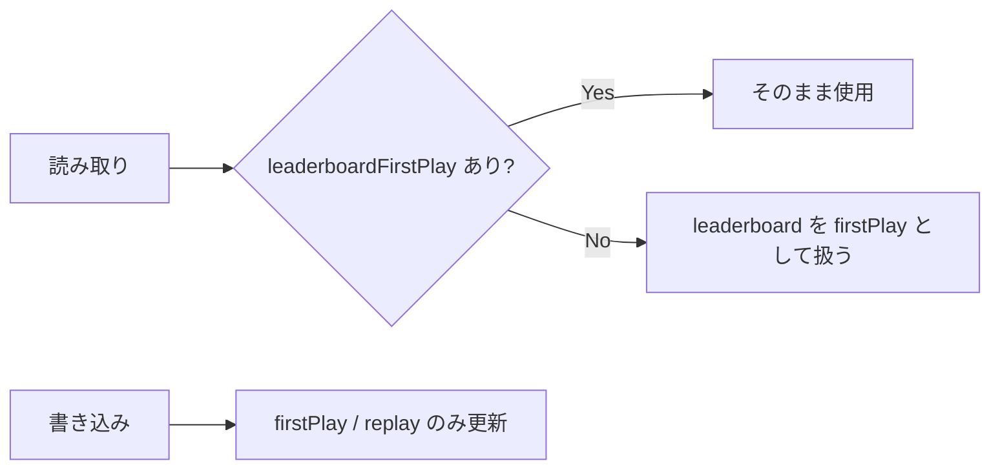
```mermaid
flowchart LR
  A[読み取り] --> B{leaderboardFirstPlay あり?}
  B -->|Yes| C[そのまま使用]
  B -->|No| D[leaderboard を firstPlay として扱う]
  E[書き込み] --> F[firstPlay / replay のみ更新]
```

- 新規クイズ作成時は `leaderboardFirstPlay: []`, `leaderboardReplay: []` を初期化。
- 既存ドキュメントの一括移行スクリプトは Phase 5 対象外（手動／別タスク）。読み取り側で `leaderboard ?? []` を `leaderboardFirstPlay` のフォールバックとする。

**Phase 6 canonical バックフィル（任意・Out of scope）**

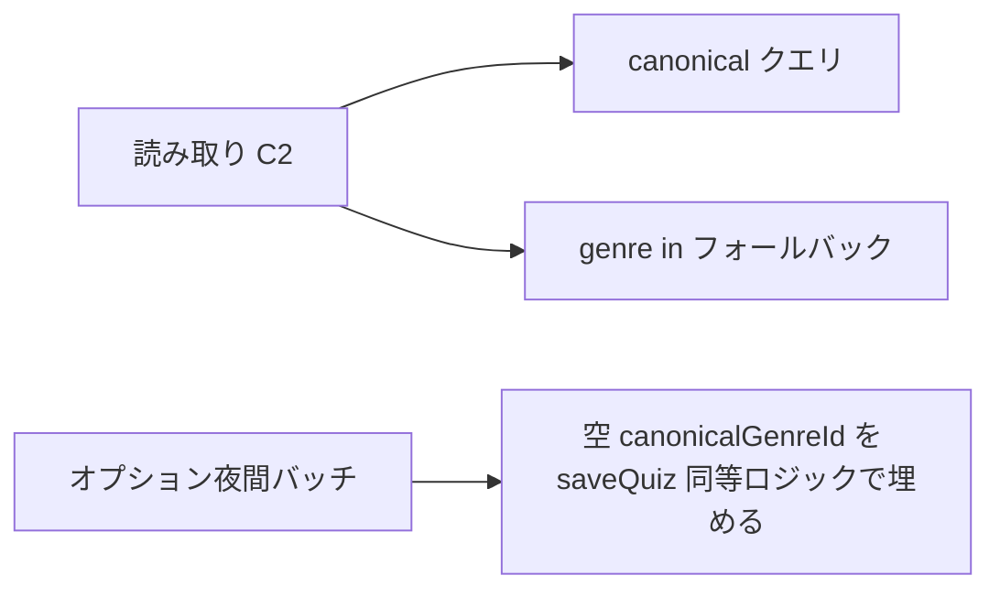
```mermaid
flowchart LR
  A[読み取り C2] --> B[canonical クエリ]
  A --> C[genre in フォールバック]
  D[オプション夜間バッチ] --> E[空 canonicalGenreId を saveQuiz 同等ロジックで埋める]
```

- 必須ではない: C2 フォールバックで legacy は一覧に含まれる。バッチは運用判断で別タスク。

---

## Phase 8: ブックマーク・リスト・問題再利用

### Architecture Pattern（Phase 8）

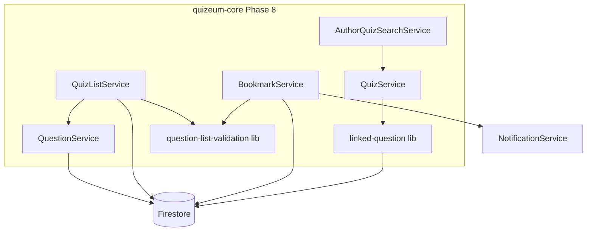
```mermaid
graph TB
    subgraph core [quizeum-core Phase 8]
        BookmarkSvc[BookmarkService]
        QuizListSvc[QuizListService]
        QuestionSvc[QuestionService]
        AuthorSearch[AuthorQuizSearchService]
        LinkedQ[linked-question lib]
        Validation[question-list-validation lib]
        QuizSvc[QuizService]
    end
    Firestore[(Firestore)]
    NotifySvc[NotificationService]

    BookmarkSvc --> Validation
    BookmarkSvc --> NotifySvc
    QuizListSvc --> Validation
    QuizListSvc --> QuestionSvc
    AuthorSearch --> QuizSvc
    QuizSvc --> LinkedQ
    LinkedQ --> Firestore
    BookmarkSvc --> Firestore
    QuizListSvc --> Firestore
    QuestionSvc --> Firestore
```

**パターン**: Option C Hybrid（gap 分析推奨）。既存サービスを拡張し、参照リンクと検証は `src/lib/` に純関数集約。UI は呼び出しのみ。

### 問題リストプレイ契約

クイズリスト（要件 5.5）と対称とし、問題リストは**収録問題ごとに1件の attempt** を記録する。

| フィールド       | 値                    |
| ---------------- | --------------------- |
| `mode`           | `'question-list'`     |
| `listId`         | 問題リスト ID         |
| `quizId`         | 当該問題の親クイズ ID |
| `totalQuestions` | 1（問題単位プレイ）   |

プレイ画面ルーティングは隣接 UI が担当。コアは `getQuestionsInList(listId)` で順序付き `Question[]` と親クイズメタを返す。

### 参照リンク保存フロー

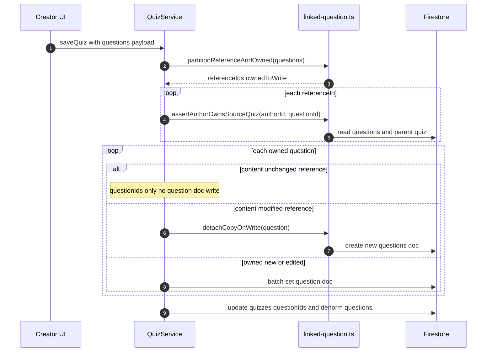
```mermaid
sequenceDiagram
    autonumber
    participant Editor as Creator UI
    participant QuizSvc as QuizService
    participant Linked as linked-question.ts
    participant DB as Firestore

    Editor->>QuizSvc: saveQuiz with questions payload
    QuizSvc->>Linked: partitionReferenceAndOwned(questions)
    Linked-->>QuizSvc: referenceIds ownedToWrite
    loop each referenceId
        QuizSvc->>Linked: assertAuthorOwnsSourceQuiz(authorId, questionId)
        Linked->>DB: read questions and parent quiz
    end
    loop each owned question
        alt content unchanged reference
            Note over QuizSvc: questionIds only no question doc write
        else content modified reference
            QuizSvc->>Linked: detachCopyOnWrite(question)
            Linked->>DB: create new questions doc
        else owned new or edited
            QuizSvc->>DB: batch set question doc
        end
    end
    QuizSvc->>DB: update quizzes questionIds and denorm questions
```

**Copy-on-Write 方針（design 確定）**: エディタが参照問題の内容を変更して保存した場合のみ新規 `questions/{id}` を発行し、当該クイズの `questionIds` を差し替える。未変更の参照は既存 ID をそのまま `questionIds` に追加し、問題ドキュメントへの書き込みは行わない。クイズから参照を外しただけでは問題ドキュメントを削除しない。

### Requirements Traceability（Phase 8）

| Requirement | Summary               | Components                                    | Interfaces                          | Flows            |
| ----------- | --------------------- | --------------------------------------------- | ----------------------------------- | ---------------- |
| 13.1        | 3種 BM トグル         | `BookmarkService`                             | `toggleBookmark`                    | -                |
| 13.2        | 公開問題のみ BM 登録  | `BookmarkService`, `question-list-validation` | `assertQuestionBookmarkable`        | -                |
| 13.3        | 非公開親は BM 拒否    | 同上                                          | 同上                                | -                |
| 13.4        | 3分類一覧             | `BookmarkService`                             | `getBookmarkFeed`                   | -                |
| 13.5        | クイズ BM 公開のみ    | `BookmarkService`                             | `getBookmarkedQuizzes`              | -                |
| 13.6        | 問題 BM に親メタ      | `BookmarkService`                             | `enrichBookmarkedQuestions`         | -                |
| 13.7        | 問題 BM 通知          | `BookmarkService`, `NotificationService`      | `createNotification`                | BM 成功後        |
| 14.1        | 作成時 listType       | `QuizListService`                             | `createQuizList`                    | -                |
| 14.2        | 未設定は quiz 扱い    | `QuizListService`                             | `resolveListType`                   | -                |
| 14.3        | クイズリスト操作      | `QuizListService`                             | `addQuizToList` 等                  | -                |
| 14.4        | 問題リストメンバー    | `QuestionService`                             | `addQuestionToList`                 | -                |
| 14.5–14.6   | 公開問題のみ追加      | `question-list-validation`                    | `assertQuestionListAddable`         | -                |
| 14.7        | タイプ不一致拒否      | `question-list-validation`                    | `assertListTypeOperation`           | -                |
| 14.8        | question-list attempt | `QuizListService`, `AttemptService`           | `getQuestionsInList`, `saveAttempt` | 問題リストプレイ |
| 14.9        | タイプ別一覧          | `QuizListService`                             | `getQuizListsByAuthor`              | -                |
| 14.10       | 問題リスト export     | `QuizListService`                             | `exportQuestionList`                | -                |
| 15.1        | 自作検索              | `AuthorQuizSearchService`                     | `searchAuthorQuizzes`               | -                |
| 15.2        | 問題詳細              | `QuestionService`                             | `getQuestionsByQuiz`                | -                |
| 15.3        | 参照リンク            | `QuizService`, `linked-question`              | `saveQuiz` 参照パス                 | 参照リンク保存   |
| 15.4        | 非自作拒否            | `linked-question`                             | `assertAuthorOwnsSourceQuiz`        | -                |
| 15.5        | 重複 doc 禁止         | `QuizService`                                 | 参照パス                            | 同上             |
| 15.6        | 参照解除のみ          | `linked-question`                             | `canDeleteQuestionDoc`              | -                |

### Components（Phase 8）

| Component                  | Domain  | Intent          | Req                  | Key Dependencies                             | Contracts      |
| -------------------------- | ------- | --------------- | -------------------- | -------------------------------------------- | -------------- |
| `BookmarkService`          | Service | 分類 BM と通知  | 13.1–13.7            | Firestore P0, validation P0, Notification P1 | Service        |
| `QuizListService`          | Service | listType リスト | 14.1–14.10           | Firestore P0, validation P0                  | Service        |
| `AuthorQuizSearchService`  | Service | 自作クイズ検索  | 15.1–15.2            | QuizService P0                               | Service        |
| `linked-question`          | Lib     | 参照リンク保存  | 15.3–15.6            | Firestore read P0                            | Pure functions |
| `question-list-validation` | Lib     | 公開/タイプ検証 | 13.2–13.3, 14.5–14.7 | Firestore read P0                            | Pure functions |

#### BookmarkService（Phase 8 拡張）

| Field        | Detail                                        |
| ------------ | --------------------------------------------- |
| Intent       | 3分類ブックマーク取得と問題 BM のガード・通知 |
| Requirements | 13.1–13.7                                     |

**Contracts**: Service

```typescript
interface BookmarkFeed {
  quizzes: Quiz[];
  lists: QuizList[];
  questions: BookmarkedQuestionEntry[];
}

interface BookmarkedQuestionEntry {
  question: Question;
  parentQuizId: string;
  parentQuizTitle: string;
  bookmarkedAt: Date;
}

interface BookmarkServicePhase8 {
  getBookmarkFeed(userId: string): Promise<BookmarkFeed>;
  toggleBookmark(
    userId: string,
    targetId: string,
    targetType: 'quiz' | 'list' | 'question'
  ): Promise<boolean>;
}
```

- **13.2–13.3**: `targetType === 'question'` のとき `assertQuestionBookmarkable(questionId)` をトランザクション前に実行。
- **13.4**: 既存3 getter を内部利用し `BookmarkFeed` を組み立て。
- **13.6**: `enrichBookmarkedQuestions` が親 `quizzes` を chunk 取得し `status === 'published'` のみ残す。
- **13.7**: 新規 BM かつ `question.authorId !== userId` のとき `createNotification({ type: 'bookmark', ... })`。

#### QuizListService（Phase 8 拡張）

```typescript
type QuizListType = 'quiz' | 'question';

function resolveListType(list: QuizList): QuizListType;

interface QuizListServicePhase8 {
  createQuizList(input: CreateQuizListInput): Promise<string>;
  getQuizListsByAuthor(
    authorId: string,
    options?: { listType?: QuizListType; includeUnpublished?: boolean }
  ): Promise<QuizList[]>;
  getQuestionsInList(listId: string): Promise<QuestionInListEntry[]>;
  reorderQuestionList(listId: string, newOrder: string[]): Promise<void>;
  exportQuestionList(listId: string, authorId: string): Promise<QuestionListExportPackage>;
}

interface QuestionInListEntry {
  question: Question;
  parentQuizId: string;
  parentQuizTitle: string;
}
```

- **14.2**: `listType` 未設定は `'quiz'`。
- **14.7**: `assertListTypeOperation(list, 'quiz' | 'question')` を各 mutate 前に呼ぶ。
- **14.10**: 自作問題はフルデータ、他者問題は ID + 親クイズ参照のみ（クイズリスト export と対称）。

#### AuthorQuizSearchService

```typescript
interface SearchAuthorQuizzesParams {
  authorId: string;
  keyword?: string;
  tag?: string;
  includeDrafts?: boolean; // default true
}

interface AuthorQuizSearchService {
  searchAuthorQuizzes(params: SearchAuthorQuizzesParams): Promise<Quiz[]>;
}
```

- **実装**: `getQuizzesByAuthor(authorId, true)` で取得後、アプリ層で `keyword`（title/description 部分一致）と `tag`（`tags` 配列）をフィルタ。Firestore 全文検索は使わない（初版）。

#### linked-question（lib）

```typescript
type QuestionSavePartition = {
  referenceOnlyIds: string[];
  ownedToWrite: Question[];
  detachCopies: Question[];
};

function partitionQuestionsForSave(
  quizId: string,
  authorId: string,
  questions: Question[],
  priorQuestionIds: string[]
): Promise<QuestionSavePartition>;

function assertAuthorOwnsSourceQuiz(
  authorId: string,
  questionId: string
): Promise<void>;

function canDeleteQuestionDoc(
  questionId: string,
  excludingQuizId: string
): Promise<boolean>;
```

- **15.4**: 参照追加時、問題の `authorId` がリクエスト `authorId` と一致することを要求（自作クイズ内の問題のみリンク可）。
- **15.6**: `updateQuiz` の問題削除で `canDeleteQuestionDoc === false` なら `questions` コレクションからは削除しない。

### Data Models（Phase 8）

**`quizLists` ドキュメント追加**:

| Field      | Type                   | Default                        | Notes      |
| ---------- | ---------------------- | ------------------------------ | ---------- |
| `listType` | `'quiz' \| 'question'` | 既存 doc は読み取り時 `'quiz'` | 作成時必須 |

**`Question`（エディタ送信用、永続化は既存 doc 再利用）**:

| Field      | Type                     | Notes                                          |
| ---------- | ------------------------ | ---------------------------------------------- |
| `linkKind` | `'owned' \| 'reference'` | エディタ→保存 API のみ。Firestore 必須ではない |

**`Attempt.mode`**: `'question-list'` を追加。

**後方互換**: `listType` 未設定の既存リストは CRUD・プレイ・export すべてクイズリストとして動作。

### Migration Strategy（Phase 8）

- **データマイグレーション不要**: 読み取り時 `resolveListType` でデフォルト `'quiz'`。
- **新規作成から** `listType` を必須書き込み。
- **Rules**: `quizLists` create/update で `listType in ['quiz','question']` を推奨（未設定 create は UI から常に送信）。

---

## Error Handling

### Error Strategy
- **通信切断・ネットワーク障害**:
  - `AttemptService` の保存処理に失敗した場合、プレイヤーの進捗および最終結果を `persistent local client storage` (browser local storage) にシリアライズして退避します。
  - オンライン復帰を自動検知した際、バックグラウンドで溜まった未同期履歴を一括で Firestore に同期します。
- **NGワード自動検出・コンテンツ保留**:
  - サーバーサイドでのNGワード検証で不適切表現を検知した場合は、トランザクションを強制ロールバックし、`quizzes.status` を自動的に `'suspended'` に設定した上で、作成者への警告通知を送信します。
- **ウミガメスープ制限超過（Phase 17）**:
  - 無料ユーザーが同一クイズ30回/日または全クイズ横断150回/日のいずれかに到達した場合、API Route は `429`（`error: limit-exceeded`, `limitType: per-quiz | global-daily`）を返却する。真相提出 API は引き続き利用可能。プレイ UI は Pro プラン（`/pricing`）への誘導を表示する（`quizeum-play-flow-ui` 境界）。
- **メタデータ検証（Phase 6）**:
  - 無効ジャンル・未解決タグで `saveQuiz` が失敗した場合、`validation-error` としてフィールド `genre` / `tags` にメッセージを返す（クライアントはエディタで表示）。
- **Phase 8 — ブックマーク/リスト**:
  - 非公開親問題の BM・問題リスト追加は `QuestionNotBookmarkableError` / `QuestionNotListAddableError`（422）で拒否。
  - クイズリストへの問題追加・問題リストへのクイズ追加は `ListTypeMismatchError`（422）。
  - 非自作問題のリンクは `ReferenceLinkForbiddenError`（403）。

---

## Testing Strategy

### Unit Tests
- **リーダーボード順位**: `compareLeaderboardRecords` が正解数優先・同点タイム短い方上位を満たすこと。
- **リーダーボードマージ**: 同一ユーザーの非優位記録で差し替えないこと、優位記録で差し替えること、5件超過時に下位が落ちること。
- **`resolveLeaderboardBoard`**: prior 件数 0 → `firstPlay`、1以上 → `replay`。
- **`isLeaderboardEligibleAttempt`（Phase 18）**: `exam` / `flashcard` が `false` であること。`normal` / `review` / `list` が `true` であること。
- **タグ正規化の検証**: `normalizeTag` が全半角トリム、小文字化、記号排除を完璧に行うかを検証。
- **称号バッジ条件判定**: 累計プレイ数が条件（例：100回）を満たした際に、正確に該当バッジを配列に追加するロジックをモック検証。
- **同一質問キャッシュの検証（Phase 17）**: `normalizeQuestionText` により表記ゆれ一致時に AI を呼び出さず、クイズ別・横断・`aiTurnCount` いずれも増加しないこと。
- **真相判定プロンプト（Phase 14）**: `buildVerifyTruthPrompt` が裏設定・`truthKeywords`・プレイヤー要約を含み、エッセンス意味判定の指示を含むこと。
- **真相判定不合格正規化（Phase 16）**: `parseTruthVerifyResponse` が AI 生出力を固定2文言に正規化すること。
- **必須キーワード検証ロジック（テストプレイ用）**: `verifyKeywords` / `checkTruthKeywordsLocally` が全半角正規化を行い部分一致判定できること（本番 `verify-truth` ルートからは呼び出さない）。
- **会話履歴マッピング検証**: 履歴から直近20回の Q&A ペアが正しく Gemini SDK の `Content[]` 型にマッピングされることを単体テスト。
- **canonical 解決**: `resolveCanonicalGenreId` が `canonicalId` チェーンを辿ること、循環で reject すること。
- **in チャンク**: `chunkIdsForInQuery` が 10 件上限で分割すること。
- **C2 union**: canonical のみ・legacy のみ・重複ありの3ケースで dedupe 後件数が期待通り。
- **resolveListType**: 未設定リストが `quiz`、明示 `question` がそのまま返ること。
- **partitionQuestionsForSave**: 参照 ID のみのとき `ownedToWrite` が空であること。
- **canDeleteQuestionDoc**: 他クイズが `questionIds` に含むとき `false`。

### Integration Tests
- **初回プレイLB**: 1回目の `saveAttempt`（`mode: normal`）が `leaderboardFirstPlay` のみ更新し `leaderboardReplay` を変更しないこと。
- **リプレイLB**: 2回目の `saveAttempt`（`mode: normal`）が `leaderboardReplay` のみ更新し、初回LB上の当該ユーザー行を変更しないこと。
- **exam/flashcard 非登録（Phase 18）**: `mode: exam` または `flashcard` の `saveAttempt` 後、両 LB 配列が更新されないこと（`playCount` は増加）。
- **exam 先 → 通常は replay のみ（Phase 18）**: 同一 user+quiz で exam 完了後に normal 完了すると、`leaderboardReplay` のみ更新され `leaderboardFirstPlay` は空のままであること。
- **normal 先 → exam → normal**: 初回 normal で firstPlay 登録後、exam は LB 不変、3回目 normal は replay のみ更新すること。
- **本人プレイ履歴API**: 有効トークンで 200、他ユーザー指定相当の不正アクセスで 403、test-play 除外を検証。
- **退会時非同期クレンジング**: API Routeに退会リクエストを送信し、Auth物理削除完了とCloud Tasksへのジョブ登録、およびFirestore匿名化が整合性高く動作することを検証。
- **ウミガメスープ AI 意味的真相判定（Phase 14）**:
  - 真相提出時に常に Gemini API を呼び出し、キーワード文言が要約に無くてもエッセンスが捉えられていれば合格となること（モック AI）。
  - キーワードが要約に全て含まれていても、AI が不合格と判定した場合は不合格となること（文字列バイパス廃止の確認）。
  - AI 失敗時に 503 を返し、文字列一致による代替合格を行わないこと。
- **ウミガメスーププレイ UX（Phase 16/17）**:
  - 不合格時 `advice` が「必須要素が足りていません。」または「提出された内容は真相と異なります。」のいずれかのみであること。
  - 諦め API が `revealText` を返さず `completed: true` のみ返し attempt を `score: 0` で完了すること（Phase 17）。
  - 合格・諦め時にクライアント送信 `elapsedSeconds` が attempt に保存されること。
  - `limit-exceeded` が `limitType` を区別し、30回目（per-quiz）と150回目（global）で正しい型を返すこと。
- **saveQuiz canonical**: 下書き保存後 `canonicalGenreId` / `canonicalTagIds` が非空であること。
- **getQuizzesByGenre**: マージ済み旧ジャンル `genre` のクイズが canonical クエリまたは fallback で返ること。
- **voteGenreRequest**: 可決後 `listActiveGenres` に新ジャンルが含まれること。
- **getFailedQuestions**: マージ子ジャンルの誤答が親ジャンルフィルタに含まれること。
- **ユーザーBAN/UNBAN機能の検証**:
  - `banUser` が `isBanned: true`, 理由, 日時を設定し、`adminLogs` に `action: 'ban'` を記録すること。
  - `unbanUser` が BAN解除時に `isBanned: false` を設定し、`bannedReason` / `bannedAt` フィールドを削除し、`adminLogs` に `action: 'unban'` を記録すること。
  - 管理者以外の権限（モデレータ等）によるBAN/UNBAN API呼び出しが `403 Forbidden` / `権限エラー` で拒否されること。
  - `firestore.rules` の `isNotBanned()` チェックにより、`isBanned: true` のユーザーからの全書込が Firestore 上で拒否されること。
- **Phase 8 — ブックマーク分類**: `getBookmarkFeed` が3分類を返し、非公開親の問題が questions から除外されること。
- **Phase 8 — listType**: 問題リストに公開問題追加成功、下書き親問題は拒否、クイズリストへの問題追加は拒否。
- **Phase 8 — 参照リンク**: 同一 `questionId` を2クイズが参照しても `questions` ドキュメントが1つのまま。参照解除後も他クイズ参照時は doc 残存。
- **Phase 8 — searchAuthorQuizzes**: タグ・キーワードで自作下書きがヒットすること。
- **Phase 9 — 統合検索（ユニバーサル検索）**:
  - キーワード「作者名」「タグ名」「ジャンル名」「タイトルの一部」を入力して `searchQuizzes` を呼び出した際に、対象のクイズが漏れなく返ってくること。
  - 複数ソースから取得されたクイズがIDで適切に重複排除（dedupe）されていること。
  - 部分一致フィルタによって大文字小文字に関わらずキーワードがマッチすること。
- **Phase 10 — タグマスタとタグ AND 検索**:
  - `listActiveTags` が `canonicalId != null` のマージ済みタグを含まないこと。
  - `searchQuizzes('', { tags: ['a','b'] })` がタグ a と b の両方を持つクイズのみ返すこと（legacy `tags` のみのクイズも canonical 解決で一致すれば含む）。
  - `searchQuizzes('keyword', { tags: ['x'] })` がキーワード部分一致 **かつ** タグ x を満たすクイズのみ返すこと。
  - `filters.tags` に重複指定しても結果が単一タグ指定と一致すること。
- **Phase 11 — 出題形式フィルタ**:
  - `searchQuizzes('', { format: 'multiple-choice' })` が選択式クイズのみ返すこと（`format` フィールドあり／問題推定の両方）。
  - `searchQuizzes('', { genreId: 'science', format: 'lateral-thinking' })` が当該ジャンル内のウミガメ形式のみ返すこと（他ジャンル混入なし）。
  - `searchQuizzes('keyword', { tags: ['js'], format: 'mixed' })` がキーワード・タグ・形式の AND を満たすこと。
  - `format` 未指定時、Phase 10 regression が維持されること。
- **Phase 13 — Stripe サブスクリプション**:
  - Checkout API: free ユーザーが `sessionUrl` を取得、active pro が 409 を返すこと。
  - Portal API: active pro が `sessionUrl`、free が 404 を返すこと。
  - Webhook: `customer.subscription.updated` で `subscriptionTier` / `isPremium` が同期されること。同一 `eventId` 二重送信で二重更新されないこと。
  - ask-ai: active pro ユーザーが31回目（per-quiz）・151回目（global）も 429 にならないこと。free ユーザーは per-quiz 30回目または global 150回目で 429 + `limitType`。
  - Rules: クライアント SDK から `subscriptionTier` 変更が拒否されること。

### Unit Tests（Phase 10）
- **`quiz-tag-match`**: `canonicalTagIds` のみ一致、legacy `tags` のみ一致、マージ旧タグ文字列一致、不一致。
- **`listActiveTags`**: 空コレクション、ソート安定、`canonicalId` フィルタ。

### Unit Tests（Phase 11）
- **`quiz-format-match`**: `format` フィールド一致、問題 type からの推定一致、不一致、`applyFormatFilter` の未指定パススルー。
- **レガシーフィクスチャ**: `{ format: undefined, questions: [] }` は `mixed` フィルタのみ一致、`multiple-choice` 等では不一致。

### E2E / UI Tests
- **解答中断と自動復旧**: プレイ中にブラウザを強制リロードし、`localStorage` から解答進捗が100%正しく復元され、プレイが継続できるかをシミュレート。

---

## Security Considerations
- **Firestore Security Rules**:
  - ユーザーの `badges`, `reputationScore`, `totalPlayCount` などの重要パラメータは、クライアントからの更新（`update`）を Security Rules で完全に拒否し、サーバーサイド（Cloud Functions）およびトランザクションのみで更新を許可。
  - `deleteStatus == 'delete_pending'` である間、第三者からの読み取りをSecurity Rulesで拒否。
  - **BANユーザーの書き込み拒否 (isNotBanned)**: 
    - `isNotBanned()` ヘルパーを定義し、書き込みアクションを実行する全ルール（`create`, `update`, `delete`）に `&& isNotBanned()` を追加。
    - `isNotBanned()` は、`/users/$(request.auth.uid)` ドキュメントの `isBanned` フィールドが `true` でないことを検証する。これにより、不正アカウントによるデータ改ざんを完全に防ぐ。
  - **Phase 6**: `metadata_tags` / `metadata_genres` は read 全公開。create は認証ユーザー（タグは `canonicalId==null` 初期化）。update は `canonicalId` セットまたは `merged*Ids` の `hasAll` 拡張のみ（`detailed_design.md` §6.5）。`mergeRequests` / `genreRequests` はモデレータ権限で create/update を制限（`isModeratorOrAbove()`）。
  - **Phase 8**: `quizLists` の update は `authorId == request.auth.uid` を維持。`listType` 変更は create 後固定（update でのタイプ変更は拒否可）。問題リストへの追加はサーバー/クライアント双方で公開検証（Rules 単独では親クイズ状態まで検証困難なためサービス層が正本）。
  - **Phase 13 — 課金フィールド保護**: `users` の `subscriptionTier`, `isPremium`, `stripeCustomerId`, `stripeSubscriptionId`, `subscriptionStatus`, `currentPeriodEnd` は owner の create/update で変更不可。書き込みは Admin SDK（Webhook / billing API）のみ。`stripe_processed_events` はクライアントアクセス不可。
- **APIキーの秘匿**:
  - Stripe Secret Key / Webhook Secret はサーバー環境変数のみ。`NEXT_PUBLIC_STRIPE_PUBLISHABLE_KEY` のみクライアント露出可。
  - Google Gemini API キーなどの認証情報はNext.jsのサーバー環境変数としてのみ管理し、クライアントへは一切露出させません。

---

## Performance & Scalability
- **N+1問題の完全排除 (非正規化)**:
  - クイズ一覧表示時にユーザーのアバターや名前を都度フェッチするのを防ぐため、`quizzes` ドキュメント内に `authorName`, `authorAvatar` を非正規化して非同期冗長保持します。
- **Firestore `in` クエリ制限 (10件) の回避**:
  - ジャンルマージ展開・ブックマーク展開では `in` を最大10 ID ごとにチャンクし、並行フェッチ後にアプリ側で dedupe する。
- **canonical 単一クエリ優先（Phase 6）**:
  - バックフィル済みクイズは `canonicalGenreId ==` の単一インデックスクエリのみで済み、マージ展開 `in` の回数を削減する。

---

## Phase 13: Stripe サブスクリプション（Pro プラン）

### Overview（本フェーズ）
ログインユーザーが Pro プランを Stripe Checkout で購読し、Webhook 同期後に水平思考 AI 質問の二層日次制限（無料：30/クイズ・150/日横断）が解除されるエンドツーエンド基盤をコア層に実装する。Free は暗黙デフォルト（`free` tier）。初版販売は Pro のみ。`premium` はスキーマ予約。

### Goals（Phase 13）
- Checkout / Portal / Webhook による信頼できる契約状態の単一正本（Firestore `users`、Admin SDK 書き込み）。
- `subscriptionTier` ベースのエンタイトルメント解決を `ask-ai` に集約適用。
- 課金フィールドのクライアント改ざんを Rules で物理遮断。
- `subscription-plans` マスタにより Premium 追加時の差分を最小化。

### Non-Goals（Phase 13）
- `/pricing` UI、プレイ画面誘導 UI、Stripe Elements によるアプリ内決済。
- Premium 販売、§2.5 の他 Pro 特典、管理者手動 tier 付与。

### Architecture Pattern（Phase 13）

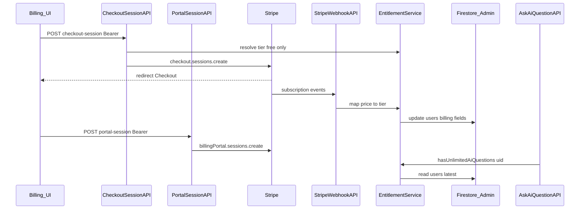
```mermaid
sequenceDiagram
    participant UI as Billing_UI
    participant CheckoutAPI as CheckoutSessionAPI
    participant PortalAPI as PortalSessionAPI
    participant Stripe as Stripe
    participant Webhook as StripeWebhookAPI
    participant Ent as EntitlementService
    participant FS as Firestore_Admin
    participant AskAI as AskAiQuestionAPI

    UI->>CheckoutAPI: POST checkout-session Bearer
    CheckoutAPI->>Ent: resolve tier free only
    CheckoutAPI->>Stripe: checkout.sessions.create
    Stripe-->>UI: redirect Checkout
    Stripe->>Webhook: subscription events
    Webhook->>Ent: map price to tier
    Ent->>FS: update users billing fields
    UI->>PortalAPI: POST portal-session Bearer
    PortalAPI->>Stripe: billingPortal.sessions.create
    AskAI->>Ent: hasUnlimitedAiQuestions uid
    Ent->>FS: read users latest
```

**選択パターン**: Server-authoritative entitlements + Stripe-hosted Checkout/Portal。クライアントはセッション URL のみ受け取り、契約状態は Webhook が正本。

### Technology Stack（Phase 13 追加分）

| Layer | Choice / Version | Role in Feature | Notes |
|-------|------------------|-----------------|-------|
| Backend | `stripe` ^22.2.0 | Checkout / Portal / Webhook 検証 | `new Stripe(secretKey)`、async/await のみ |
| Data | Firestore Admin SDK | 課金フィールド書き込み | 既存 `getAdminFirestore()` を再利用 |
| Config | 環境変数 | Price ID マッピング | `STRIPE_PRICE_PRO_MONTHLY`, `STRIPE_PRICE_PRO_YEARLY` |

Stripe ベストプラクティスに従い、Checkout Sessions API を使用する。`payment_method_types` は指定しない（dynamic payment methods 有効）。

### File Structure Plan（Phase 13）

#### Directory Structure
```
src/
├── lib/
│   ├── subscription-plans.ts       # paid tier 定義・Price ID マッピング
│   └── stripe/
│       └── server.ts               # Stripe シングルトンクライアント
├── services/
│   ├── subscription.ts             # Checkout/Portal 作成、Customer 解決
│   └── entitlement.ts              # resolveUserEntitlements, tier 判定
├── types/
│   └── subscription.ts             # SubscriptionTier, SubscriptionStatus 等
└── app/api/
    ├── billing/
    │   ├── checkout-session/route.ts
    │   └── portal-session/route.ts
    └── webhooks/
        └── stripe/route.ts           # raw body 署名検証・冪等処理
```

#### Modified Files
- `src/types/index.ts` — `User` に課金フィールド追加
- `src/context/auth-context.tsx` — 読み取り時 `subscriptionTier` デフォルト `free`
- `src/app/api/attempt/ask-ai/route.ts` — `resolveUserEntitlements` 利用
- `firestore.rules` — 課金フィールドの owner 書き込み禁止
- `docs/db_design.md` / `docs/api_specification.md` — 同期（direct impl 候補）

### Requirements Traceability（Phase 13）

| Requirement | Summary | Components | Interfaces | Flows |
|-------------|---------|------------|------------|-------|
| 4.6–4.7 | 無料 tier 二層制限（30/150） | `ask-ai-utils`, `AskAiQuestionAPI` | `/api/attempt/ask-ai` | AI 質問フロー |
| 4.8 | Pro 以上は制限なし | `EntitlementService` | `/api/attempt/ask-ai` | AI 質問フロー |
| 4.9 | サーバー側契約参照 | `AskAiQuestionAPI` | `/api/attempt/ask-ai` | AI 質問フロー |
| 19.1–19.4 | tier モデル・状態解釈 | `EntitlementService`, `User` 型 | — | — |
| 19.5–19.8 | Checkout 購読開始 | `CheckoutSessionAPI`, `SubscriptionService` | `POST /api/billing/checkout-session` | 購読フロー |
| 19.9–19.12 | Webhook 同期・冪等 | `StripeWebhookAPI`, `EntitlementService` | `POST /api/webhooks/stripe` | Webhook フロー |
| 19.13–19.14 | Customer Portal | `PortalSessionAPI`, `SubscriptionService` | `POST /api/billing/portal-session` | 契約管理フロー |
| 19.15–19.17 | エンタイトルメント適用 | `EntitlementService`, `AskAiQuestionAPI` | `/api/attempt/ask-ai` | AI 質問フロー |
| 19.18–19.19 | 改ざん防止 | `firestore.rules`, Admin SDK のみ書込 | Rules | — |
| 19.20–19.23 | 境界（UI 外） | — | — | — |

### Components and Interfaces（Phase 13）

| Component | Domain/Layer | Intent | Req Coverage | Key Dependencies | Contracts |
|-----------|--------------|--------|--------------|------------------|-----------|
| `subscription-plans.ts` | lib | paid tier・Price マッピングの単一正本 | 19.2, 19.3 | env Price IDs (P0) | State |
| `EntitlementService` | service | tier 解釈・AI 無制限判定 | 4.2–4.4, 19.1–19.4, 19.15–19.17 | Firestore Admin (P0) | Service |
| `SubscriptionService` | service | Stripe Customer / Session 作成 | 19.5–19.8, 19.13–19.14 | Stripe API (P0), EntitlementService (P0) | Service |
| `CheckoutSessionAPI` | API Route | 購読開始セッション発行 | 19.5–19.8 | SubscriptionService (P0) | API |
| `PortalSessionAPI` | API Route | 契約管理セッション発行 | 19.13–19.14 | SubscriptionService (P0) | API |
| `StripeWebhookAPI` | API Route | 契約イベント同期 | 19.9–19.12 | Stripe, EntitlementService (P0) | API, Event |
| `AskAiQuestionAPI` | API Route（改修） | tier ベース制限 | 4.2–4.4, 19.15–19.17 | EntitlementService (P0) | API |

#### EntitlementService

| Field | Detail |
|-------|--------|
| Intent | ユーザーの契約状態を単一規則で解釈し、機能ゲート判定を提供する |
| Requirements | 4.2, 4.3, 4.4, 19.1–19.4, 19.15–19.17, 19.18, 19.19 |

**Service Interface**
```typescript
type SubscriptionTier = 'free' | 'pro' | 'premium';
type SubscriptionStatus =
  | 'active' | 'trialing' | 'past_due' | 'canceled'
  | 'incomplete' | 'unpaid' | 'paused';

interface UserEntitlements {
  subscriptionTier: SubscriptionTier;
  subscriptionStatus: SubscriptionStatus | null;
  currentPeriodEnd: Date | null;
  hasPaidEntitlements: boolean;
  hasUnlimitedAiQuestions: boolean;
}

interface EntitlementService {
  resolveUserEntitlements(uid: string): Promise<UserEntitlements>;
  applySubscriptionFromStripe(input: StripeSubscriptionSnapshot): Promise<void>;
}
```

- **hasPaidEntitlements**: `subscriptionTier` が `pro` または `premium` かつ `subscriptionStatus` が `active` または `trialing`。
- **hasUnlimitedAiQuestions**: `hasPaidEntitlements` または `moderationTier` が `moderator` / `senior_moderator`。
- **isPremium 導出**: `hasPaidEntitlements` と同値で Webhook 更新時に `users.isPremium` も同期書き込み（`ask-ai` 後方互換）。
- **未設定フィールド**: `subscriptionTier` 未設定は `free` として解釈。

#### SubscriptionService

**Service Interface**
```typescript
interface CreateCheckoutSessionInput {
  uid: string;
  email: string;
  priceInterval: 'monthly' | 'yearly';
}

interface CreateCheckoutSessionResult {
  sessionUrl: string;
}

interface CreatePortalSessionInput {
  uid: string;
}

interface SubscriptionService {
  createCheckoutSession(input: CreateCheckoutSessionInput): Promise<CreateCheckoutSessionResult>;
  createPortalSession(input: CreatePortalSessionInput): Promise<{ sessionUrl: string }>;
  getOrCreateStripeCustomer(uid: string, email: string): Promise<string>;
}
```

**Checkout 契約**:
- `mode: 'subscription'`
- `client_reference_id`: Firebase `uid`
- `customer`: 既存 `stripeCustomerId` または新規作成（`metadata.firebaseUid`）
- `line_items`: `[{ price: envPriceId, quantity: 1 }]`
- `success_url`: `{APP_URL}/pricing?checkout=success`
- `cancel_url`: `{APP_URL}/pricing?checkout=canceled`
- `payment_method_types` は省略（dynamic payment methods）

**重複購読拒否（19.7）**: `resolveUserEntitlements` で `hasPaidEntitlements === true` のとき `409 already-subscribed`。

#### CheckoutSessionAPI / PortalSessionAPI

| Method | Endpoint | Request | Response | Errors |
|--------|----------|---------|----------|--------|
| POST | `/api/billing/checkout-session` | `{ priceInterval: 'monthly' \| 'yearly' }` + Bearer | `{ sessionUrl: string }` | 401, 409, 500 |
| POST | `/api/billing/portal-session` | Bearer のみ | `{ sessionUrl: string }` | 401, 404, 500 |

認証パターンは `ban/route.ts` と同一（`extractBearerToken` → `verifyFirebaseIdToken`）。BAN ユーザーは `403`。

#### StripeWebhookAPI

| Field | Detail |
|-------|--------|
| Intent | Stripe 契約イベントを冪等に Firestore へ反映 |
| Requirements | 19.9–19.12 |

**Runtime**: `nodejs`（Edge 不可）。**Body**: `await request.text()` で raw body を `stripe.webhooks.constructEvent` に渡す。

**処理対象イベント**:
- `checkout.session.completed` — `client_reference_id` から uid、`subscription` ID を取得
- `customer.subscription.created` / `updated` / `deleted`
- `invoice.payment_failed` — `past_due` 反映（grace: 期間終了まで `active` 維持は Stripe デフォルトに従う）

**冪等性**: `stripe_processed_events/{eventId}` に Admin SDK で存在確認後処理。重複は `200` で即返却。

**Price → tier マッピング**: `subscription-plans.ts` の `priceIdToTier` で解決。初版は Pro Price のみ → `pro`。未知 Price はログ警告し更新スキップ。

### Data Models（Phase 13）

#### `users` 追記フィールド

| Field | Type | Writer | Notes |
|-------|------|--------|-------|
| `subscriptionTier` | `'free' \| 'pro' \| 'premium'` | Webhook / Admin | デフォルト `free` |
| `stripeCustomerId` | `string?` | Webhook / Admin | |
| `stripeSubscriptionId` | `string?` | Webhook / Admin | |
| `subscriptionStatus` | `SubscriptionStatus?` | Webhook / Admin | |
| `currentPeriodEnd` | `Timestamp?` | Webhook / Admin | |
| `isPremium` | `boolean?` | Webhook / Admin | `hasPaidEntitlements` と同期 |

#### `stripe_processed_events`（新規）

| Field | Type | Notes |
|-------|------|-------|
| `eventId` | `string` | Stripe `event.id`（ドキュメント ID） |
| `type` | `string` | イベント種別 |
| `processedAt` | `Timestamp` | |

Rules: クライアント read/write 禁止（マッチなし → deny）。

#### subscription-plans マスタ

```typescript
interface PaidTierDefinition {
  tier: 'pro' | 'premium';
  displayName: string;
  priceIds: { monthly: string; yearly: string };
  featureKeys: readonly ('unlimited_ai_questions')[];
}

export const PAID_TIER_DEFINITIONS: readonly PaidTierDefinition[];
export function priceIdToTier(priceId: string): SubscriptionTier | null;
export function hasFeature(tier: SubscriptionTier, feature: string): boolean;
```

初版 `PAID_TIER_DEFINITIONS` は Pro のみ。Premium 追加時は定義配列に1エントリ追加。

### Error Handling（Phase 13）

| Category | Response | Behavior |
|----------|----------|----------|
| 401 | 未認証 Checkout/Portal | ログイン要求メッセージ |
| 409 | 既存有料契約で Checkout | `already-subscribed`、Portal 導線ヒント |
| 404 | Portal で customer 未存在 | `no-subscription` |
| 400 | 無効 `priceInterval` | バリデーションエラー |
| 429 | ask-ai 制限（Phase 17 二層） | `limit-exceeded` + `limitType` + Pro 誘導文言 |
| Webhook 署名失敗 | 400 | 状態更新なし、ログ記録 |

### Security Considerations（Phase 13）

**Firestore Rules（`users/{userId}` 更新）** — owner 更新時に以下を不変条件として追加:
- `subscriptionTier`, `isPremium`, `stripeCustomerId`, `stripeSubscriptionId`, `subscriptionStatus`, `currentPeriodEnd`

**create 時**: 上記フィールドが未設定、または `subscriptionTier == 'free'` かつ `isPremium == false` のみ許可。

**Webhook ルート**: Bearer 認証なし。Stripe 署名のみ。ミドルウェアは `/api` を除外済み。

### Testing Strategy（Phase 13）

**Unit Tests**
- `priceIdToTier` — Pro monthly/yearly 解決、未知 ID → null
- `resolveUserEntitlements` — free / active pro / canceled pro / moderator 免除
- `hasFeature` — pro のみ `unlimited_ai_questions`

**Integration Tests**
- Checkout API: 有効トークン + free user → `sessionUrl`、既存 pro → 409
- Portal API: pro user → `sessionUrl`、free user → 404
- Webhook: 署名付き `customer.subscription.updated` モック → `users.subscriptionTier` 更新
- Webhook 冪等: 同一 `eventId` 二重 POST → 単一更新
- ask-ai: pro ユーザーで 21 回目も 200（カウンタ更新あり、429 なし）

**E2E（Stripe テストモード）**
- `/pricing` から Checkout 開始 URL 取得（UI スペックと連携）

### Migration Strategy（Phase 13）

1. Rules 更新（課金フィールド保護）を先にデプロイ。
2. 型・`EntitlementService` 追加（既存 `isPremium` 読み取り互換）。
3. Webhook エンドポイントを Stripe Dashboard に登録。
4. Checkout / Portal API 有効化。
5. `ask-ai` を `EntitlementService` に切替。

既存 `isPremium: true` 手動設定ユーザーは Webhook 同期まで維持。長期は tier 正本へ移行。

---

## Phase 14: ウミガメのスープ真相判定 — AI 意味判定への改定（2026-06-08）

### Design Decision

| 項目 | 旧（B2 ハイブリッド） | 新（Phase 14） |
|------|----------------------|----------------|
| 合格経路 | `verifyKeywords` 全一致 → AI バイパス即合格 | 常に AI 意味判定 |
| キーワードの役割 | 文字列部分一致のゲート | AI へのエッセンス参照材料 |
| AI 失敗時 | キーワード全一致なら合格可能 | 503 返却、代替合格なし |
| テストプレイ | ローカル部分一致（変更なし） | 同左（Out of boundary） |

**採用理由**: 作問者が登録する `truthKeywords` は「到達すべき核心のヒント」であり、プレイヤーの自然な表現（同義語・言い換え）を文字列一致で弾くと誤不合格が発生する。裏設定とキーワードを併せて AI に渡すことで、意図を保ちつつ表現揺れを許容できる。

**却下した代替案**:
- キーワード全一致時のみバイパス維持 — 要件 4.8「文字列完全一致を合格条件としない」と矛盾。
- クライアント側判定 — セキュリティ・一貫性のためサーバー API のみが正本。

### Architecture Integration

- **変更範囲は VerifyTruthAPI 境界に閉じる**: `verify-truth-utils.ts`（プロンプト）+ `verify-truth/route.ts`（分岐削除）+ 単体テスト。
- **API レスポンス形状は不変**: `{ isCorrect: boolean, advice: string | null }`（`isBypass` は docs のみの記述で実装に存在しない）。
- **LB 更新・認証・履歴追加ロジックは不変**: 合格時トランザクション、不合格時 `aiTruthAttempts` 追加は現行のまま。

### `buildVerifyTruthPrompt` 契約（改修）

```typescript
/**
 * 真相判定プロンプトを構築する（Phase 14: truthKeywords をエッセンス参照に含める）
 */
export function buildVerifyTruthPrompt(
  aiContextDetails: string,
  playerTruth: string,
  truthKeywords: string[]
): string;
```

**プロンプトに追加するセクション（要旨）**:
- `【必須エッセンス（作問者が指定した核心的要素）】` — `truthKeywords` を箇条書き
- 判定基準追記: エッセンスの**意味**がプレイヤー要約に反映されていれば合格可。キーワードの文言そのものの出現は不要。ただし裏設定の核心的因果関係との整合は必須。
- 既存のセキュリティ防衛ルール（プロンプトインジェクション無視）は維持。

### File Structure Plan（Phase 14）

#### Modified Files
| ファイル | 責務 |
|----------|------|
| `src/services/verify-truth-utils.ts` | `buildVerifyTruthPrompt` シグネチャ拡張、エッセンスセクション追加。`verifyKeywords` は export 維持（テストプレイ／単体テスト用） |
| `src/app/api/attempt/verify-truth/route.ts` | `verifyKeywords` 分岐削除。`buildVerifyTruthPrompt(..., truthKeywords)` を常時呼び出し |
| `tests/services/verify-truth-utils.test.ts` | プロンプトにキーワード・エッセンス指示が含まれるテスト追加。`buildVerifyTruthPrompt` 呼び出しを3引数に更新 |

#### Out of Scope（変更しない）
| ファイル | 理由 |
|----------|------|
| `src/lib/test-play.ts` (`checkTruthKeywordsLocally`) | 要件・境界でテストプレイは現状維持 |
| `src/app/quiz/test-play/play/test-play-client.tsx` | 同上 |
| `src/app/quiz/[id]/play/quiz-play-client.tsx` | Phase 14 時点では API 契約不変。Phase 16 でプレイ UX を改修済み |
| `src/types/index.ts` | `truthKeywords` 型は既存のまま |

#### Direct Implementation Candidate
- `docs-sync-truth-verify` — `docs/api_specification.md`, `docs/detailed_design.md`, `docs/requirements_definition.md` の B2 ハイブリッド記述を Phase 14 に同期

### Requirements Traceability（Phase 14）

| Requirement | Summary | Components | Interfaces | Flows |
|-------------|---------|------------|------------|-------|
| 4.7 | 3要素を AI に渡す意味判定 | `VerifyTruthAPI`, `verify-truth-utils` | `buildVerifyTruthPrompt`, `/api/attempt/verify-truth` | 真相判定フロー |
| 4.8 | 文字列一致を合格条件としない | `verify-truth-utils` | `buildVerifyTruthPrompt` | 真相判定フロー |
| 4.9 | キーワードをエッセンス参照に | `verify-truth-utils` | `buildVerifyTruthPrompt` | 真相判定フロー |
| 4.10 | AI 失敗時再試行・代替合格なし | `VerifyTruthAPI` | `/api/attempt/verify-truth` | 真相判定フロー |
| 4.11–4.12 | 合格/不合格後処理 | `VerifyTruthAPI` | `/api/attempt/verify-truth` | 真相判定フロー |

### Testing Strategy（Phase 14）

**Unit**
- `buildVerifyTruthPrompt('裏', '要約', ['キーワードA'])` が裏設定・要約・キーワード・エッセンス判定指示を含む。
- `truthKeywords` が空配列でもプロンプトが生成され、AI 判定可能（公開時は最低1件必須だが実行時フォールバックは `[]` 許容）。

**Integration（モック Gemini）**
- ルートが `verifyKeywords` を呼ばず常に `generateContent` を呼ぶ。
- モック CORRECT → LB 更新・`completedAt` 設定。
- モック INCORRECT → `advice` 返却、attempt 未完了。
- Gemini 例外 → 503 `ai-error`。

### Risks & Mitigations

| Risk | Mitigation |
|------|------------|
| 毎回 AI 呼び出しでコスト・レイテンシ増 | 要件上のトレードオフとして受容。質問キャッシュ（4.5）とは独立 |
| AI の過寛容判定 | エッセンス＋裏設定の両方参照をプロンプトで明示。作問者は `aiContextDetails` で詳細を保持 |
| 回帰: キーワード全一致で即合格していたプレイ | 意図的な仕様変更。E2E で意味判定ケースを追加検討 |

---

## Phase 16: 水平思考プレイ UX 改修（2026-06）

### Design Decision

| 項目 | 方針 |
|------|------|
| 真相入力 | 右カラムの独立フォームを廃止し、チャット下部で「質問する」／「回答する」を切替 |
| 諦め | 専用 API で解説のみ返却（`explanation` 優先）。裏設定は諦め確定後にのみサーバー経由で開示 |
| 不合格フィードバック | AI 生出力をそのまま表示せず、`REASON: MISSING_ESSENCE` / `UNRELATED` を固定2文言に正規化 |
| 経過時間 | クライアントで1秒刻みカウント。チャットヘッダーのみ表示。完了時に API へ送信して永続化 |
| 入力ロック | 合格・諦め（および諦め処理中）で質問・真相・モード切替を無効化。送信ボタンはグレーアウト |
| ルール説明 | 右パネルにプレイヤー向け要点のみ（システム内部のキャッシュ・判定詳細は記載しない） |

### `parseTruthVerifyResponse` 契約（Phase 16 追記）

不合格時の `advice` は常に次のいずれか:

- `TRUTH_FAILURE_MISSING_ESSENCE` → 「必須要素が足りていません。」
- `TRUTH_FAILURE_UNRELATED` → 「提出された内容は真相と異なります。」

プロンプトは AI に `REASON: MISSING_ESSENCE` / `REASON: UNRELATED` のみ出力させ、3行目以降のヒント出力を禁止する。

### `getLateralRevealText` 契約

```typescript
export function getLateralRevealText(question: Question): string;
```

優先順: `question.explanation`（trim 後非空）→ `question.aiContextDetails` → フォールバック文言。

### File Structure Plan（Phase 16）

#### New Files
| ファイル | 責務 |
|----------|------|
| `src/app/api/attempt/give-up-lateral/route.ts` | 諦め・不合格完了・解説返却 |
| `src/services/lateral-give-up-utils.ts` | 解説テキスト解決 |
| `src/hooks/useElapsedSeconds.ts` | 経過秒数フック |
| `src/lib/format-play-elapsed.ts` | 表示フォーマット・`normalizeElapsedSeconds` |
| `tests/api/give-up-lateral.test.ts` | 諦め API テスト |
| `tests/services/lateral-give-up-utils.test.ts` | 解説テキスト単体テスト |
| `tests/lib/format-play-elapsed.test.ts` | フォーマット単体テスト |

#### Modified Files
| ファイル | 責務 |
|----------|------|
| `src/services/verify-truth-utils.ts` | 不合格 REASON 指示、固定メッセージ正規化 |
| `src/app/api/attempt/verify-truth/route.ts` | Admin SDK、`elapsedSeconds` 保存 |
| `src/app/quiz/[id]/play/quiz-play-client.tsx` | 統合入力 UI、諦め、経過時間、ルール説明 |
| `src/app/quiz/[id]/play/play.module.css` | スタイル |

### Requirements Traceability（Phase 16）

| Requirement | Summary | Components | Interfaces |
|-------------|---------|------------|------------|
| 4.6 | 2カラム（チャット＋ルール／解説） | `quiz-play-client` | lateral レイアウト |
| 4.12 | 不合格は固定2種メッセージ | `verify-truth-utils` | `parseTruthVerifyResponse` |
| 4.13 | 質問／回答切替 | `quiz-play-client` | チャット入力欄 |
| 4.14 | 経過時間表示 | `useElapsedSeconds`, `format-play-elapsed` | チャットヘッダー |
| 4.15 | 諦め・解説開示 | `GiveUpLateralAPI`, `lateral-give-up-utils` | `/api/attempt/give-up-lateral` |
| 4.16 | 入力ロック・グレーアウト | `quiz-play-client` | `lateralInputLocked` |
| 4.17 | 経過秒数永続化 | verify-truth, give-up-lateral | `elapsedSeconds` body |
| 4.18 | プレイヤー向けルール説明 | `quiz-play-client` | 右パネル |
| 4.19 | Admin SDK + 本人確認 | API Routes | Bearer + `verifyFirebaseIdToken` |

### Testing Strategy（Phase 16）

**Unit**: `getLateralRevealText` の優先順、`formatPlayElapsedSeconds` / `normalizeElapsedSeconds`、`parseTruthVerifyResponse` の REASON 正規化。

**Integration**: `give-up-lateral` の認証・409（完了済み）・`revealText` 返却。`verify-truth` の不合格 `advice` 固定文言。

---

## Phase 17: ウミガメ認証・二層制限・諦めフロー改定（2026-06-08）

### Design Decision

| 項目 | 方針 |
|------|------|
| 正本モジュール | **Option C（Hybrid）**: 制限定数・正規化・キャッシュ検索を `ask-ai-utils.ts` に集約。API はオーケストレーション、UI は play-flow / billing 境界 |
| 二層制限 | 無料: 同一クイズ **30回/日**（`dailyAiTurnCounts/{quizId}`）+ 全クイズ横断 **150回/日**（`dailyAiTurnCounts/_global`）。JST 深夜0時リセットは既存 `getJstDateKey()` を流用 |
| 制限判定順 | Pro 有効契約 → スキップ。キャッシュヒット → 全カウンタ非消費。新規質問 → per-quiz と global の**両方**をチェックし、先に到達した方の `limitType` を返却 |
| 正規化キャッシュ | `normalizeQuestionText`: trim → lowercase → 空白文字（半角・全角 `\u3000`）除去。サーバー `findCachedAnswer` とクライアント `useAiPlayState` が同一関数を import |
| カウンタ更新 | 新規 AI 呼び出し成功時のみ、同一 Firestore Transaction で `attempt.aiTurnCount++`、`dailyAiTurnCounts/{quizId}.count++`、`dailyAiTurnCounts/_global.count++` |
| `turnsRemaining` | 成功応答に `{ perQuiz: number \| null, globalDaily: number \| null }` を返却（Pro は両方 `null`）。キャッシュヒット時も現残数を返し UI 同期 |
| 諦め API | 成功応答は `{ completed: true }` のみ。`getLateralRevealText` / `revealText` は本番 API から除去（破壊的変更、クライアント同時デプロイ） |
| 諦め UI | 真相・解説を右パネル／チャットに表示しない。チャット内 CTA: 常に「結果画面へ」。`attempt.listId != null` のとき「次の問題へ」も表示（`quizeum-play-flow-ui`） |
| lateral `listId` | `createLateralAttemptSession` がクエリ `listId` を受け取り attempt に保存。リスト連続プレイ文脈のナビ出し分けに使用 |
| 認証 | ウミガメのみ会員必須（他モードはゲスト可）。詳細画面ボタン表記は play-flow-ui。プレイ直アクセスは `/login?redirect=...` で戻り先付与を推奨 |
| entitlements | `quiz-play-client` の `isPremium: false` ハードコードを廃止し、サーバー `resolveUserEntitlements` 結果を props または初期データで受け取る |

### `normalizeQuestionText` 契約

```typescript
/** 前後空白除去・小文字化・空白文字統一（半角/全角） */
export function normalizeQuestionText(text: string): string;

/** 正規化一致で履歴を検索。ヒット時は isFromCache 付きコピーを返す */
export function findCachedAnswer(
  questionText: string,
  history: AiQuestion[]
): AiQuestion | null;
```

クライアントのインライン正規化（`useAiPlayState` L31–36）を廃止し、上記を単一 import に統一する。

### `checkAiTurnLimits` 契約

```typescript
export const FREE_TIER_PER_QUIZ_LIMIT = 30;
export const FREE_TIER_GLOBAL_DAILY_LIMIT = 150;
export const DAILY_AI_TURN_GLOBAL_DOC_ID = '_global' as const;

export type AiTurnLimitType = 'per-quiz' | 'global-daily';

export interface AiTurnLimitCheckInput {
  perQuizCount: number;
  globalDailyCount: number;
  hasUnlimitedAiQuestions: boolean;
}

export interface AiTurnLimitCheckResult {
  exceeded: boolean;
  limitType?: AiTurnLimitType;
  turnsRemaining: { perQuiz: number | null; globalDaily: number | null };
}

export function checkAiTurnLimits(input: AiTurnLimitCheckInput): AiTurnLimitCheckResult;
```

### `ask-ai` API 応答契約（Phase 17 追記）

**成功（200）**:
```typescript
{
  answerType: AiAnswerType;
  aiComment: string;
  isFromCache: boolean;
  turnsRemaining: { perQuiz: number | null; globalDaily: number | null };
}
```

**制限超過（429）**:
```typescript
{
  error: 'limit-exceeded';
  limitType: 'per-quiz' | 'global-daily';
  message: string; // Pro 購読で解除される旨
}
```

真相提出 API（`verify-truth`）は制限対象外。上限到達後も真相検証は継続可能（要件 4.11）。

### `give-up-lateral` API 応答契約（Phase 17 改定）

**成功（200）**:
```typescript
{ completed: true }
```

`revealText` フィールドは返却しない。`lateral-give-up-utils.ts` はテスト・将来用途のため残置可だが本番ルートからは呼ばない。

### Firestore: `dailyAiTurnCounts` スキーマ

パス: `users/{uid}/dailyAiTurnCounts/{docId}`

| docId | 意味 | フィールド |
|-------|------|-----------|
| `{quizId}` | クイズ別日次 | `count: number`, `dateKey: string`（JST `YYYY-MM-DD`） |
| `_global` | 全クイズ横断日次 | 同上 |

`dateKey` が当日と異なる場合は Transaction 内で `count` を 0 にリセットしてから increment。Rules は既存 `users/{uid}` サブコレクション方針に従い Admin SDK のみ書き込み。

### File Structure Plan（Phase 17）

#### Modified Files（コア）
| ファイル | 責務 |
|----------|------|
| `src/services/ask-ai-utils.ts` | 定数 30/150、`normalizeQuestionText`、`checkAiTurnLimits`、`findCachedAnswer` 正規化対応、`AskAiResponse.turnsRemaining` 形状変更 |
| `src/app/api/attempt/ask-ai/route.ts` | 横断カウンタ読み書き、二重制限 429 + `limitType`、Transaction で3カウンタ同期 |
| `src/hooks/useAiPlayState.ts` | 共有正規化 import、クライアント側 20 回ガード削除（サーバー正本）、`limitType` エラー処理 |
| `src/app/api/attempt/give-up-lateral/route.ts` | `revealText` 除去、`{ completed: true }` のみ |
| `src/services/attempt.ts` | `aiTurnLimit: 30`、`createLateralAttemptSession` に `listId` 引き継ぎ |
| `tests/services/ask-ai-utils.test.ts` | 30/150、正規化キャッシュ、二重制限、`limitType` |
| `tests/api/give-up-lateral.test.ts` | `revealText` 非期待、`completed: true` のみ |

#### 隣接スペック境界（本スペックは契約のみ定義、実装は各 UI スペック）
| ファイル | スペック | 責務 |
|----------|---------|------|
| `src/app/quiz/[id]/play/quiz-play-client.tsx` | `quizeum-play-flow-ui` | Pro 誘導（`/pricing`）、諦め後チャット CTA、`entitlements` 連携、ルール説明 30/150 |
| `src/app/quiz/[id]/quiz-detail-client.tsx` | `quizeum-play-flow-ui` | 未登録「会員登録してプレイする」（✅ 実装済） |
| `src/lib/pricing-display.ts` | `quizeum-billing-subscription-ui` | Free プラン「30回/クイズ・150回/日横断」文言 |

#### New Files（推奨）
| ファイル | 責務 |
|----------|------|
| `tests/api/ask-ai-limits.test.ts` | ask-ai 統合テスト（モック Firestore + entitlements） |

### Requirements Traceability（Phase 17）

| Requirement | Summary | Components | Interfaces |
|-------------|---------|------------|------------|
| 4.1 | 未登録ボタン表記 | `quiz-detail-client` | play-flow-ui |
| 4.2 | 未登録ウミガメ→ログイン誘導 | `quiz-detail-client`, `quiz-play-client` | `/login?redirect=` |
| 4.3 | 他モードはゲスト可 | 通常プレイ attempt 作成 | `guest` userId |
| 4.4 | 認証済み lateral attempt | `createLateralAttemptSession` | `attempt.ts` |
| 4.5 | AI 質問（履歴20件） | `AskAiQuestionAPI` | `/api/attempt/ask-ai` |
| 4.6 | 同一クイズ 30回/日 | `ask-ai-utils`, `ask-ai/route` | `FREE_TIER_PER_QUIZ_LIMIT` |
| 4.7 | 横断 150回/日 | `ask-ai-utils`, `ask-ai/route` | `dailyAiTurnCounts/_global` |
| 4.8 | Pro 無制限 | `EntitlementService` | `hasUnlimitedAiQuestions` |
| 4.9 | サーバー側 tier 判定 | `ask-ai/route` | `resolveUserEntitlements` |
| 4.10 | 正規化キャッシュ非消費 | `ask-ai-utils` | `normalizeQuestionText` |
| 4.11 | 上限 Pro 誘導・真相可 | `ask-ai/route`, play UI | `limit-exceeded` |
| 4.12–4.20 | レイアウト・真相・経過時間 | 既存 Phase 14/16 資産 | verify-truth, play UI |
| 4.21 | 諦め真相非表示 | `give-up-lateral/route` | `{ completed: true }` |
| 4.22 | チャット内「結果画面へ」 | `quiz-play-client` | play-flow-ui |
| 4.23 | リスト文脈「次の問題へ」 | `quiz-play-client`, `attempt.listId` | play-flow-ui |
| 4.24–4.27 | 入力ロック・完了保存・認証 | 既存 Phase 16 資産 | verify-truth, give-up |

### Testing Strategy（Phase 17）

**Unit（`ask-ai-utils`）**
- `normalizeQuestionText('  Hello　World  ')` と `'hello world'` が同一キーになること。
- per-quiz 29→30 で `limitType: 'per-quiz'`、global 149→150 で `limitType: 'global-daily'`。
- Pro（`hasUnlimitedAiQuestions: true`）は常に `exceeded: false`。
- 正規化一致キャッシュで `checkAiTurnLimits` を呼ばずに応答組み立て可能であること（API 統合で検証）。

**Integration**
- `ask-ai`: Transaction が per-quiz + global + attempt を原子的に更新すること（モック）。
- `give-up-lateral`: 200 で `revealText` キーが存在しないこと。attempt `score: 0`, `completedAt` 設定。
- `createLateralAttemptSession`: `listId` クエリパラメータが attempt に保存されること。

**Regression**
- Phase 14 真相 AI 意味判定、Phase 16 固定不合格メッセージ・経過秒数は維持。

### Risks & Mitigations

| Risk | Mitigation |
|------|------------|
| 横断カウンタの Transaction 競合 | 読み取り順序を固定（attempt → per-quiz doc → global doc）。失敗時は 503 で再試行可能に |
| `revealText` 廃止の破壊的変更 | API と play UI を同一デプロイ。テストを Phase 17 契約に更新 |
| クライアント/server 正規化不一致 | `normalizeQuestionText` を `ask-ai-utils` に単一化し双方 import |
| `listId` 未伝播で 4.23 未達 | lateral attempt 作成時に URL `listId` を必ず引き継ぐ |
| 結果画面での真相表示 | 要件はプレイ画面のみ明示。結果画面は真相を出さない現行方針を維持（別途確認可） |

---

## Phase 18: 模擬試験・フラッシュカード LB 非対象（2026-06-09）

### 1. Boundary Commitments

| Owns | Out of Boundary |
|------|-----------------|
| `isLeaderboardEligibleAttempt` の `exam` / `flashcard` 除外 | クイズ詳細の警告 UI（`quizeum-play-flow-ui`） |
| prior 件数の全モードカウント契約（`countPriorCompletedAttempts`） | プラットフォーム総合 `/leaderboard` |
| `saveAttempt` / `verify-truth` の LB 更新分岐 | 既存 LB 表示 UI・E2E（play-flow 側は警告のみ追加） |
| `tests/lib/leaderboard-update.test.ts`（新規） | docs 同期（Direct Implementation 可） |

### 2. Design Decision

**採用: 単一関数拡張（Option A）**

`leaderboard-update.ts` の `isLeaderboardEligibleAttempt` に `exam` / `flashcard` を追加除外するのみ。prior 件数は既存 `countPriorCompletedAttempts`（モード不問）を維持し、初回権利消滅を自然に実現する。

| Option | 説明 | 不採用理由 |
|--------|------|-----------|
| A. `isLeaderboardEligibleAttempt` 拡張 | 最小差分、既存フロー維持 | — **採用** |
| B. 別途 `countRankingEligibleAttempts` | 登録対象モードのみカウント | exam 先プレイ後の replay 振り分けが破綻 |
| C. `firstPlayConsumed` ユーザーフラグ | 明示的権利消滅 | スキーマ追加・マイグレーション過大 |

### 3. File Structure Plan（Phase 18）

| ファイル | 操作 | 責務 |
|----------|------|------|
| `src/lib/leaderboard-update.ts` | **Modify** | `exam` / `flashcard` 除外、`buildLeaderboardUpdatesForQuiz` 契約維持 |
| `src/services/attempt.ts` | **Verify** | prior count 呼び出し条件は現状維持（変更不要想定） |
| `src/app/api/attempt/verify-truth/route.ts` | **Verify** | prior 全モードカウントは現状維持 |
| `tests/lib/leaderboard-update.test.ts` | **New** | モード別 eligibility、build 結果 null/非 null |
| `tests/services/attempt-leaderboard.test.ts` | **Modify** | exam 非登録、exam→normal replay の統合ケース |

### 4. Requirements Traceability（Phase 18）

| Req | Summary | Component | Notes |
|-----|---------|-----------|-------|
| 9.1 | 登録対象のみ LB 評価 | `isLeaderboardEligibleAttempt` | |
| 9.2 | exam/flashcard 非登録 | 同上 | 両 board 対象外 |
| 9.3 | 除外モード集合 | 同上 | guest, test-play, exam, flashcard |
| 9.4–9.5 | prior 全モード → board | `countPriorCompletedAttempts` + `resolveLeaderboardBoard` | |
| 9.6 | exam 先 → replay のみ | `saveAttempt` 統合テスト | |
| 9.7–9.11 | 順位規則・ウミガメ | 既存 Phase 5 資産 | 変更なし |
| 9.12 | review/list 等は対象維持 | `isLeaderboardEligibleAttempt` | 明示テスト |
| 9.13–9.14 | 警告 UI Out | play-flow-ui | |

### 5. Testing Strategy（Phase 18）

**Unit（`leaderboard-update.test.ts`）**
- `isLeaderboardEligibleAttempt({ mode: 'exam' })` → `false`
- `isLeaderboardEligibleAttempt({ mode: 'flashcard' })` → `false`
- `isLeaderboardEligibleAttempt({ mode: 'normal' })` → `true`（認証済 userId）
- `buildLeaderboardUpdatesForQuiz(..., mode: 'exam')` → `null`

**Integration（`attempt-leaderboard.test.ts`）**
- exam 完了後 `leaderboardFirstPlay` / `leaderboardReplay` いずれも undefined
- exam → normal: replay のみ更新、firstPlay 空

**Regression**
- 既存初回／リプレイ LB テスト（normal のみ）維持

### 6. Risks & Mitigations

| Risk | Mitigation |
|------|------------|
| 既存 exam 完了データが LB に残存 | 本フェーズは新規更新のみ制御。過去データの手動削除は Out |
| verify-truth と saveAttempt の prior 集計差異 | verify-truth は既に全モードカウント。saveAttempt も count 関数はモード不問で統一 |

**Effort**: **XS**（半日）— 1 関数 + テスト追加

**Document Status（Phase 18 設計）**: 本節に反映。`spec.json` → `phase: design-generated`。

---

## Phase 20: 〇×問題形式（`true-false`）コア整合（2026-06-09）

### 1. Boundary Commitments

| Owns | Out of Boundary |
|------|-----------------|
| `Quiz.format` に `'true-false'` 追加 | 〇／× 専用プレイ UI（`quizeum-play-flow-ui`） |
| `resolveQuizFormat` の単一形式解決 | 作問エディタ正解トグル UI（`quizeum-creator-dash-ui`） |
| `true-false-defaults` による固定選択肢生成・正規化 | `ChoiceAnswerPanel` の改修 |
| 公開検証（2択・正解1件・ラベル正規化） | |
| `quiz-format-labels` の「〇×式」ラベル | |
| 既存 `isChoiceAnswerCorrect` 採点経路の維持 | |

### 2. Architecture Decision

**パターン**: 既存 `choices` モデルを維持し、Core/lib に固定ラベル生成を集約する（Build）。`correctTextAnswerList` への移行は却下（Adopt 不要・データ非互換）。

**`resolveQuizFormat` 改定**:
- `SINGLE_FORMAT_TYPES` に `'true-false'` を追加
- 全問題が `true-false` のみ → `'true-false'`（現状の `mixed` フォールバックを削除）
- `format: 'true-false'` 明示時は公開検証で全問題 `true-false` を要求

### 3. Core Library: `true-false-defaults.ts`

```typescript
export type TrueFalseCorrectSide = 'maru' | 'batsu';

export const TRUE_FALSE_LABELS = { maru: '〇', batsu: '✕' } as const;

/** 新規問題・形式変換時のデフォルト選択肢（正解トグル反映） */
export function createTrueFalseChoices(correctSide: TrueFalseCorrectSide): Choice[];

/** 既存 choices から正解側を推定（読み取り専用・エディタ初期化用） */
export function resolveTrueFalseCorrectSide(choices: Choice[] | undefined): TrueFalseCorrectSide;

/** 保存前正規化: ID は可能な限り維持し choiceText/isCorrect のみ矯正 */
export function normalizeTrueFalseChoices(
  choices: Choice[] | undefined,
  correctSide: TrueFalseCorrectSide
): Choice[];
```

**保存パス**: `QuizService.saveQuiz`（または `quiz-validation` 直前）で `type === 'true-false'` の問題に `normalizeTrueFalseChoices` を適用。`format === 'true-false'` のクイズは `questions[].type` を強制 `true-false`。

### 4. Validation Rules（`quiz-validation.ts` 拡張）

| チェック | 下書き | 公開 |
|----------|--------|------|
| 選択肢件数 === 2 | ✓ | ✓ |
| `isCorrect === true` が1件 | ✓ | ✓ |
| `choiceText` が「〇」「✕」に正規化可能 | 正規化して保存 | 正規化後検証 |
| `format === 'true-false'` → 全問 `true-false` | — | ✓ |

**後方互換**: 既存データでラベルが「○」「×」等の場合、読み取り・採点は `isCorrect` + ID で継続。新規保存時のみ `normalizeTrueFalseChoices` で「〇」「✕」へ統一。

### 5. File Structure Plan（Phase 20）

| ファイル | 操作 | 責務 |
|----------|------|------|
| `src/types/index.ts` | **Modify** | `Quiz.format` に `'true-false'` |
| `src/lib/true-false-defaults.ts` | **New** | 固定選択肢生成・正規化・正解側推定 |
| `src/lib/quiz-format.ts` | **Modify** | `SINGLE_FORMAT_TYPES` 追加、`resolveQuizFormat` 修正 |
| `src/lib/quiz-format-labels.ts` | **Modify** | `true-false` → ラベル「〇×式」、説明・アイコン |
| `src/services/quiz-validation.ts` | **Modify** | `true-false` 公開検証・形式整合 |
| `src/services/quiz.ts` | **Modify** | 保存時 `true-false` 正規化（任意で validation 内集約可） |
| `tests/lib/true-false-defaults.test.ts` | **New** | 生成・正規化・正解側推定 |
| `tests/lib/quiz-format.test.ts` | **Modify** | 単一 `true-false` → format 解決 |
| `tests/services/quiz-validation-true-false.test.ts` | **New** | 公開拒否・正規化 |

**変更なし（確認のみ）**: `choice-answer-utils.ts` / `usePlayState` の `isChoiceAnswerCorrect` 経路、`quiz-format-match.ts`（`resolveQuizFormat` 連動で自動整合）。

### 6. Requirements Traceability（Phase 20）

| Req | Summary | Component |
|-----|---------|-----------|
| 20.1–20.3 | 第一級 format・単一形式解決 | `quiz-format.ts`, `types` |
| 20.4–20.5 | 公開検証・正規化 | `quiz-validation.ts`, `true-false-defaults.ts` |
| 20.6 | 後方互換読み取り | 採点経路維持 |
| 20.7–20.8 | 採点・単一正解 | `choice-answer-utils` |
| 20.9–20.10 | 形式フィルタ・ラベル | `quiz-format-match`, `quiz-format-labels` |
| 20.11–20.12 | mixed 共存 | `quiz-format.ts`, validation |
| 20.13–20.15 | 境界 Out | play-flow / creator-dash |

### 7. Testing Strategy（Phase 20）

| 種別 | 検証 |
|------|------|
| **Unit** | `createTrueFalseChoices('maru')` → 〇正解・✕不正解、`resolveQuizFormat` 全問 true-false |
| **Unit** | `normalizeTrueFalseChoices` が ID 維持しラベル矯正 |
| **Integration** | `validateQuizForPublish` が 3 択・正解0件を拒否 |
| **Regression** | `test_data.json` の既存 `true-false` 問題が採点可能 |

**Effort**: **S**（1日）

**Document Status（Phase 20 設計）**: 本節に反映。

---

## Phase 21: ホーム向け公開クイズ一覧の段階的取得

### 1. Overview

ホーム探索 UI が全件一括取得（limit 30〜100）から初回少量＋続き読み込みへ移行するため、コア層に共通ページング契約を追加する。タブ別フィード（新着・人気・トレンド・フォロー TL）は単一 Firestore クエリに `startAfter` を適用し、複合検索（`searchQuizzes`）は既存ハイブリッド合成結果を安定ソートしたうえでオフセットカーソルによりスライスする（根本置換は行わない）。

**既定ページサイズ**: `HOME_FEED_PAGE_SIZE = 20`（要件 21.15）

### 2. Boundary Commitments（Phase 21）

| Owns | Out |
|------|-----|
| `PaginatedQuizResult` 型 | 無限スクロール UI・IntersectionObserver |
| `quiz-feed-cursor.ts` encode/decode | sticky 検索バー CSS |
| タブ別 `*Page` API | ジャンル別・タグ別一覧の段階的取得 |
| `searchQuizzesPaginated` | プレイ状況クライアント後段フィルタ |
| 無効カーソル時のエラー応答 | 全文検索エンジン新設 |

### 3. Architecture

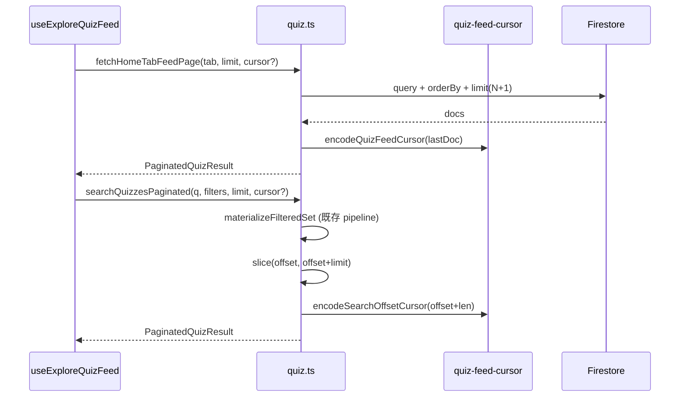
```mermaid
sequenceDiagram
    participant UI as useExploreQuizFeed
    participant QS as quiz.ts
    participant FC as quiz-feed-cursor
    participant FS as Firestore

    UI->>QS: fetchHomeTabFeedPage(tab, limit, cursor?)
    QS->>FS: query + orderBy + limit(N+1)
    FS-->>QS: docs
    QS->>FC: encodeQuizFeedCursor(lastDoc)
    QS-->>UI: PaginatedQuizResult

    UI->>QS: searchQuizzesPaginated(q, filters, limit, cursor?)
    QS->>QS: materializeFilteredSet (既存 pipeline)
    QS->>QS: slice(offset, offset+limit)
    QS->>FC: encodeSearchOffsetCursor(offset+len)
    QS-->>UI: PaginatedQuizResult
```

**パターン選択**:
- **タブフィード**: Firestore ネイティブカーソル（`listUserPlayHistory` と同型の base64url JSON）
- **複合検索**: オフセットカーソル + クエリ／フィルタ fingerprint 検証（条件変更時は UI がリセットする前提）

### 4. Data Models & Contracts

#### `PaginatedQuizResult`（`src/types/index.ts`）

```typescript
export interface PaginatedQuizResult {
  items: Quiz[];
  nextCursor: string | null;
}
```

#### タブフィードカーソル（`QuizFeedCursor`）

```typescript
interface QuizFeedCursorPayload {
  v: 1;
  kind: 'latest' | 'popular' | 'trending' | 'timeline';
  quizId: string;
  /** ソートキー（createdAt ms / playCount / bookmarksCount） */
  sortKey: number | string;
}
```

- encode: `Buffer.from(JSON.stringify(payload)).toString('base64url')`
- decode 失敗・`v` 不一致・`kind` 不一致 → エラー throw（要件 21.6、先頭フォールバック禁止）

#### 検索オフセットカーソル（`SearchOffsetCursor`）

```typescript
interface SearchOffsetCursorPayload {
  v: 1;
  offset: number;
  /** normalize 済み queryText + stable JSON(filters) の短い hash */
  fingerprint: string;
}
```

- 続き要求時、fingerprint が現在リクエストと一致しない場合はエラー（条件変更検知）
- 素材化上限 `SEARCH_MATERIALIZE_CAP = 200`（初版）。offset が cap を超える場合は `nextCursor: null`

### 5. Service API（`src/services/quiz.ts`）

| 関数 | 用途 | カーソル方式 |
|------|------|-------------|
| `getLatestQuizzesPage({ limit?, cursor? })` | 新着タブ | Firestore `startAfter` |
| `getPopularQuizzesPage({ limit?, cursor? })` | 人気タブ | 同上（`playCount` desc） |
| `getTrendingQuizzesPage({ limit?, cursor? })` | トレンドタブ | 同上（`bookmarksCount` desc） |
| `getFollowedTimelinePage({ followerId, limit?, cursor? })` | フォロー TL | 同上（既存 30 author `in` 制限維持） |
| `searchQuizzesPaginated(queryText, filters, { limit?, cursor?, userId? })` | フィルタ／検索有効時 | オフセット |

**実装規則**:
1. 各 `*Page` は `limit + 1` 件取得し、超過分があれば `hasMore` とし最後の1件を捨てる（play history パターン）
2. 既存 `getLatestQuizzes(n)` 等は内部で `getLatestQuizzesPage({ limit: n })` の `.items` を返す薄いラッパーに変更し、呼び出し互換を維持
3. `searchQuizzesPaginated` は既存 `searchQuizzes` のフィルタパイプラインを `materializeSearchQuizzes(queryText, filters)` に抽出し、初回／続きで共有
4. 素材化結果は `sortQuizzesForList(..., 'latest')` で安定ソート（検索モードの既定並び）

**`materializeSearchQuizzes` 抽出**:
- 現行 `searchQuizzes` L754–845 を private 相当の純粋関数へ移動
- `searchQuizzes`（非ページング）は `materializeSearchQuizzes` の全件返却を維持（ジャンル scoped ページ等の既存利用者向け後方互換）

### 6. File Structure Plan（Phase 21）

| ファイル | 操作 | 責務 |
|----------|------|------|
| `src/types/index.ts` | **Modify** | `PaginatedQuizResult` |
| `src/lib/quiz-feed-cursor.ts` | **New** | タブ／検索カーソル encode・decode・fingerprint |
| `src/services/quiz.ts` | **Modify** | `*Page` API、`materializeSearchQuizzes`、`searchQuizzesPaginated` |
| `tests/lib/quiz-feed-cursor.test.ts` | **New** | カーソル round-trip・無効入力 |
| `tests/services/quiz-feed-pagination.test.ts` | **New** | タブページング重複なし、検索 offset、無効カーソルエラー |

### 7. Requirements Traceability（Phase 21）

| Req | Summary | Component |
|-----|---------|-----------|
| 21.1–21.6 | 共通ページング契約 | `PaginatedQuizResult`, `quiz-feed-cursor` |
| 21.7–21.9 | タブ別並び | `get*QuizzesPage` |
| 21.10–21.11 | フォロー TL | `getFollowedTimelinePage` |
| 21.12–21.14 | 複合検索段階取得 | `searchQuizzesPaginated`, `materializeSearchQuizzes` |
| 21.15–21.17 | 件数・重複・published | 各 `*Page` 実装 |
| 21.18–21.21 | 境界 Out | play-flow UI |

### 8. Testing Strategy（Phase 21）

| 種別 | 検証 |
|------|------|
| **Unit** | カーソル encode/decode ラウンドトリップ、壊れた base64 で throw |
| **Unit** | fingerprint 不一致 cursor でエラー |
| **Integration** | `getLatestQuizzesPage` 2ページ連続で ID 重複なし |
| **Integration** | `searchQuizzesPaginated` offset 0/20 で合計件数整合 |
| **Regression** | 既存 `searchQuizzes` / `getLatestQuizzes(10)` 呼び出し互換 |

**Effort**: **M**（2〜3日）

**Document Status（Phase 21 設計）**: 本節に反映。

---

## Phase 22: ディスカバリーホーム向けデータ提供と検索 URL 状態

### 1. Overview

Phase 22 は新規 ranking エンジンを追加せず、既存 `getTrendingQuizzes` / `getLatestQuizzes` / `listActiveGenres` をディスカバリーホーム（`/`）向けに再利用する。検索画面（`/search`）の深いリンク（タブ・ジャンル・フィルタ展開）を支える URL クエリ契約を `src/lib/search-url-state.ts` に1か所集約し、UI は parse/serialize のみを呼び出す。

**定数**:
- `DISCOVERY_CAROUSEL_SIZE = 10`（トレンド・新着カルーセル共通）

### 2. Boundary Commitments（Phase 22）

| Owns | Out |
|------|-----|
| `search-url-state.ts` parse/serialize | ディスカバリーホーム UI |
| `SearchUrlState` 型 | 検索画面 UI・フィルタチップ |
| 既存 API 再利用の件数契約 | Sidebar / BottomNav |
| 無効クエリの正規化 | パーソナライズドおすすめ |

### 3. Architecture

```mermaid
flowchart LR
  subgraph Discovery["/ (play-flow UI)"]
    D1[getTrendingQuizzes(10)]
    D2[getLatestQuizzes(10)]
    D3[listActiveGenres]
  end
  subgraph Search["/search (play-flow UI)"]
    S1[parseSearchUrlState]
    S2[serializeSearchUrlState]
  end
  Lib["search-url-state.ts"]
  S1 --> Lib
  S2 --> Lib
  D1 --> QuizSvc["quiz.ts"]
  D2 --> QuizSvc
  D3 --> GenreSvc["metadata_genres read"]
```

### 4. Data Models & Contracts

#### `SearchUrlState`（`src/lib/search-url-state.ts`）

```typescript
import type { HomeFeedFilters } from '@/lib/home-feed-filters';
import type { HomeFeedTab } from '@/hooks/useExploreQuizFeed';

export interface SearchUrlState {
  tab: HomeFeedTab;
  filters: HomeFeedFilters;
  openFilters: boolean;
  /** UI 専用。URL には `playStatus` として反映可 */
  playStatus: 'all' | 'unplayed' | 'played';
}
```

#### URL クエリマッピング（初版）

| Query key | State field | 既定値 / 正規化 |
|-----------|-------------|-----------------|
| `tab` | `tab` | 未指定 → `latest`。許可: `latest` \| `popular` \| `trending` \| `timeline` |
| `genreId` | `filters.genreId` | 空文字可 |
| `format` | `filters.format` | `QuizFormat` または空 |
| `q` | `filters.searchQuery` | trim |
| `tags` | `filters.tagChips` | カンマ区切り、各要素 `normalizeTag` |
| `difficultyMin` / `difficultyMax` | 数値フィルタ | 1–5、範囲 clamp |
| `minQuestions` / `maxQuestions` | 数値フィルタ | 1–50、範囲 clamp |
| `playStatus` | `playStatus` | `all` \| `unplayed` \| `played` |
| `openFilters` | `openFilters` | `1` のみ true |

**シリアライズ規則**:
- 既定値と同一のパラメータは URL から省略（短い共有 URL）
- `openFilters=1` のみ真を表現（`0` は出力しない）
- `tags` は正規化済み ID をソートしてカンマ連結（順序安定）

**パース規則**:
- 未知キーは無視
- 無効 `tab` → `latest`
- 数値範囲外 → clamp または既定値（design 実装時に単体テストで固定）
- 出力は常に `DEFAULT_HOME_FEED_FILTERS` をベースに merge

#### ディスカバリーホーム向け読み取り

| 用途 | API | 件数 |
|------|-----|------|
| おすすめクイズ（トレンド） | `getTrendingQuizzes(DISCOVERY_CAROUSEL_SIZE)` | 10 |
| 新着クイズ | `getLatestQuizzes(DISCOVERY_CAROUSEL_SIZE)` | 10 |
| おすすめジャンル | `listActiveGenres()` | 全アクティブ |

- いずれも公開中クイズのみ（既存実装をそのまま利用）
- 検索画面 `tab=trending` / `tab=latest` の先頭ページは同一ソート規則（要件 22.12–22.13）

### 5. Public API

```typescript
export const DISCOVERY_CAROUSEL_SIZE = 10;

export function parseSearchUrlState(
  searchParams: URLSearchParams | Readonly<Record<string, string | string[] | undefined>>
): SearchUrlState;

export function serializeSearchUrlState(state: SearchUrlState): URLSearchParams;

/** Next.js router 用: クエリ文字列（先頭 ? なし） */
export function buildSearchUrlQuery(state: Partial<SearchUrlState>): string;
```

- `play-flow-ui` の `useSearchUrlState` hook は本 lib をラップし、`useRouter` / `useSearchParams` で同期する（core は Next.js に非依存）

### 6. File Structure Plan（Phase 22）

| ファイル | 操作 | 責務 |
|----------|------|------|
| `src/lib/search-url-state.ts` | **New** | parse / serialize / 定数 |
| `src/lib/home-feed-filters.ts` | **Modify** | （任意）`cloneHomeFeedFilters` ヘルパ |
| `tests/lib/search-url-state.test.ts` | **New** | 双方向整合・無効 tab・genreId 深いリンク |

**変更なし（再利用）**: `getTrendingQuizzes`, `getLatestQuizzes`, `listActiveGenres` in `quiz.ts` / genre service

### 7. Requirements Traceability（Phase 22）

| Req | Summary | Component |
|-----|---------|-----------|
| 22.1–22.4 | ディスカバリー一覧 | 既存 `quiz.ts` / genre list |
| 22.5–22.11 | URL 契約 | `search-url-state.ts` |
| 22.12–22.13 | Phase 21 整合 | 既存 `*Page` API |
| 22.14–22.17 | 境界 Out | play-flow / sidebar UI |

### 8. Testing Strategy（Phase 22）

| 種別 | 検証 |
|------|------|
| **Unit** | `tab=trending` → parse → serialize → 同一 tab |
| **Unit** | `genreId=prog` + `openFilters=1` round-trip |
| **Unit** | 無効 `tab=foo` → `latest` |
| **Unit** | 既定フィルタ serialize で空クエリ（または `tab` のみ省略） |

**Effort**: **S**（1日）

**Document Status（Phase 22 設計）**: 本節に反映。
