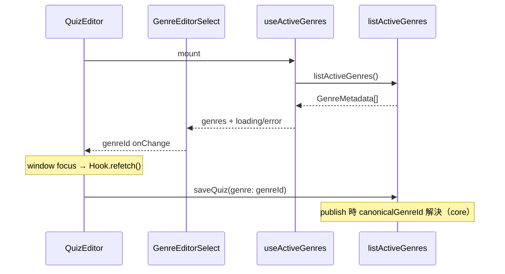
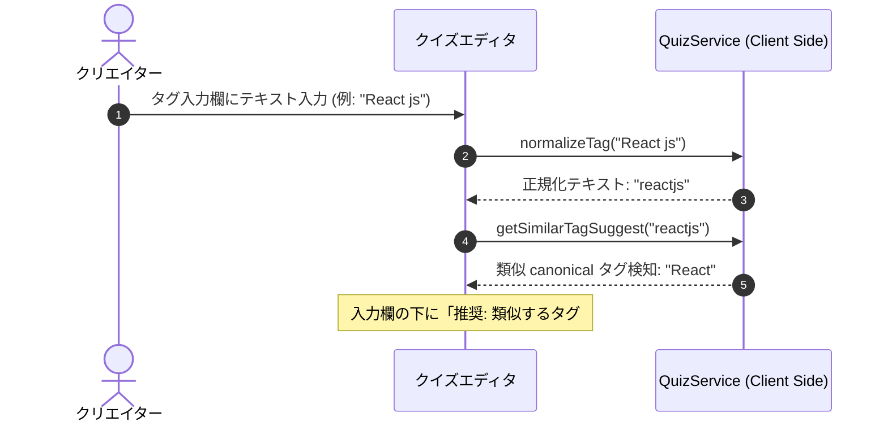
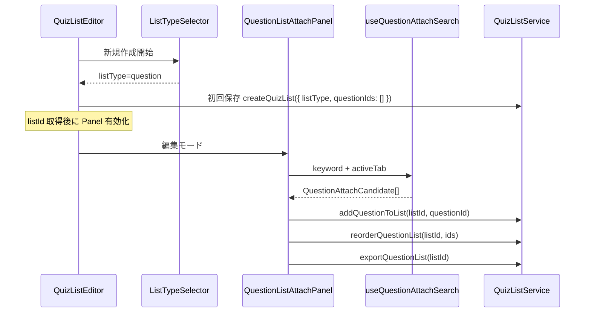
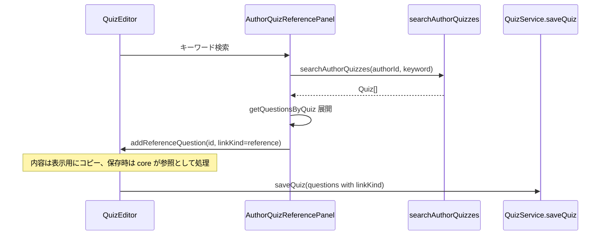
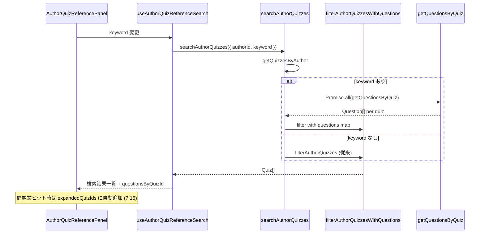
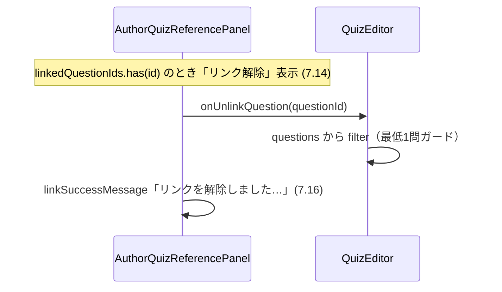
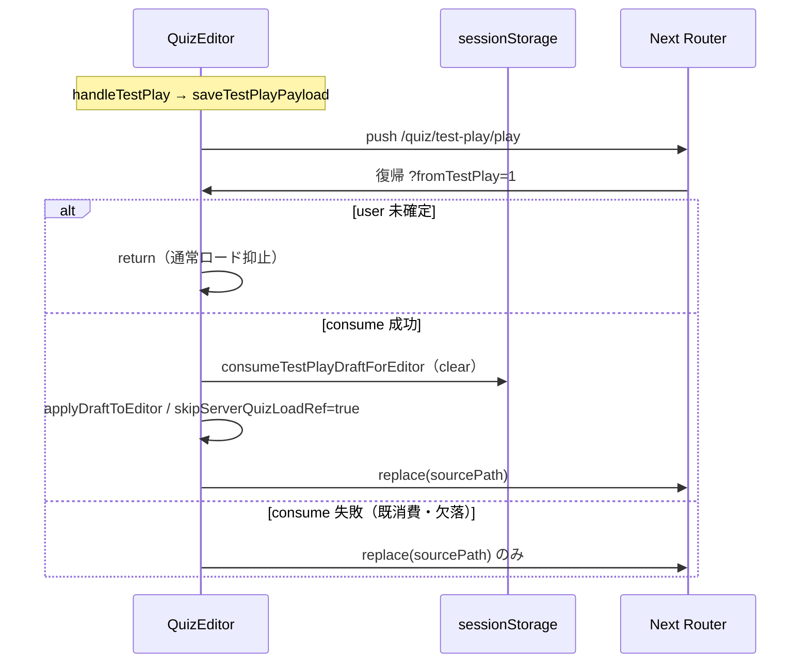
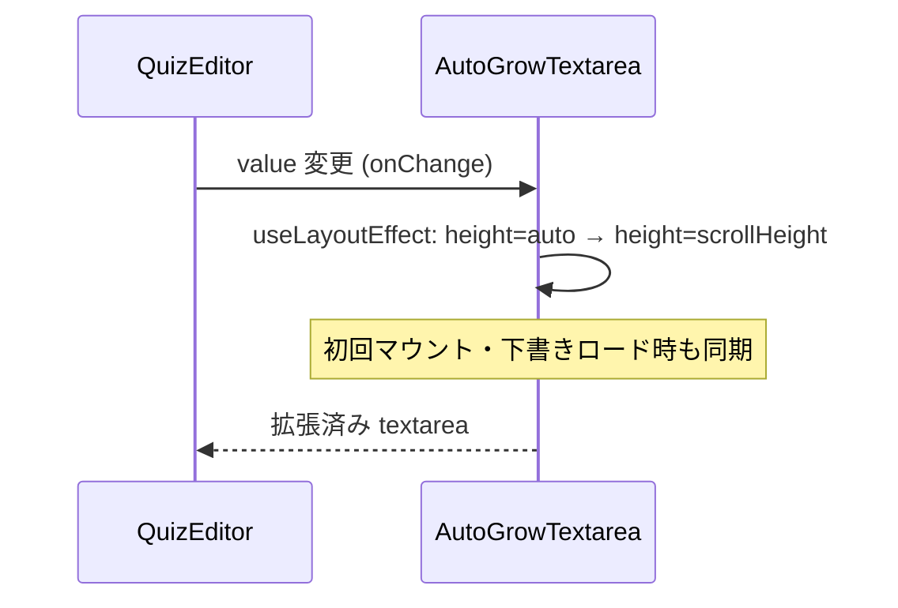

# Technical Design Document: quizeum-creator-dash-ui

## Overview
本ドキュメントは、クイズ投稿SNS「quizeum」におけるクリエイター（作家）向けUIの技術設計仕様を定義します。クイズの作成・下書き・編集機能、ドラッグ＆ドロップによるリストの作成・並べ替え、作家ダッシュボードにおけるアナリティクス可視化、間違い指摘フィードバックの管理、および自作クイズデータの一括パッケージエクスポートを構築します。

本システムは、Next.jsのApp RouterおよびReact、TypeScriptのフロントエンド構成に加え、CSS Modulesによる親しみやすく機能的なデザインシステムを実装し、Firestoreサービス（`QuizService`, `QuizListService`, `ReviewService`等）およびフロントエンド側Zodスキーマと接続します。

**Phase 6（2026-06）**: `QuizEditor` のジャンル `<select>` を `useActiveGenres` + `GenreEditorSelect` に置換。`quizeum-play-flow-ui` と同一の `listActiveGenres` フックを再利用する。

**Phase 8（2026-06）**: リスト作成時の `listType` 選択、問題リスト編集（3ソース問題検索・アタッチ・DnD・エクスポート）、クイズエディタの過去自作クイズ検索パネルと参照リンク追加 UI を追加する。永続化・検証・Copy-on-Write は `quizeum-core`（実装済み）に依存する。

**Phase 12（2026-06）**: 作問エディタの説明文・問題文・真相・解説文テキストエリアの自動伸長、過去自作クイズ検索の問題文・正解テキスト照合拡張、参照リンク成功フィードバック、問題文ヒット時のアコーディオン自動展開、リンク済み問題のリンク解除、テストプレイ後の編集画面ドラフト復元（問題重複防止）を追加する。問題照合の純関数と `searchAuthorQuizzes` パイプライン拡張は lib/service 層が担当し、UI は表示・フィードバックのみ。

### Goals
- 問題の動的追加・削除、クイズタイプトグルを備えた直感的なクイズエディタの構築。
- タグ入力時におけるリアルタイム「自動名寄せ」正規化と類似 canonical タグのインラインサジェスト警告UI。
- Zodバリデーションを用いた、公開申請時における厳格なエラーインラインフィードバック。
- 作家ダッシュボードにおける累計数値アナリティクスおよび個別問題解答割合グラフ（円グラフ等）のビジュアル化。
- クローズド間違い指摘のキュー管理と該当問題の修正動線統合。
- クイズ一括エクスポートおよびリストパッケージエクスポートのクライアント側データダウンロード処理。
- クイズリスト作成における、スムーズなクイズ検索アタッチおよびドラッグ＆ドロップ順序並べ替えUI。
- **Phase 8**: 新規リストの `listType` 必須選択、問題リストのアタッチ／並び替え／エクスポート、自作クイズからの参照リンク問題追加。
- **Phase 12**: 作問エディタ主要テキストエリアの自動伸長、過去自作クイズ検索の問題文・正解テキスト対応、参照リンク成功メッセージ、問題文ヒット時の自動展開、リンク解除、テストプレイ復帰時の問題数保持。
- **Phase 13**: 作問エディタの難易度スライダー入力の 1〜5 制限と表示の更新。

**Phase 20（2026-06-09）**: 〇×問題（`true-false`）を出題形式として選択可能にし、正解トグル（「〇が正解」「×が正解」）のみの作問 UI を追加する。選択肢テキストの自由編集は行わない（永続化・正規化は `quizeum-core` の `true-false-defaults.ts` が担当）。

### Non-Goals
- クイズデータのJSONインポート機能（仕様変更により機能が完全に廃止されたため、インポートに関連するUIエリアは一切設置しません）。
- 管理者モデレーション画面および自治ガバナンスUI（`quizeum-moderation-governance-ui`が担当）。
- **Phase 8**: ブックマーク3タブ・問題リスト連続プレイ遷移（`quizeum-play-flow-ui`）。プロフィールのリストタイプ別タブ（`quizeum-auth-profile-ui`）。
- **Phase 12**: 作問エディタ以外の画面へのテキストエリア自動伸長一括適用。Firestore 全文検索インデックス新設。

---

## Boundary Commitments

### This Spec Owns
- **UIルーティング設計**: `/quiz/create`, `/quiz/[id]/edit`, `/creator/dashboard`, `/list/[id]`, `/list/create`, `/list/[id]/edit` の各ページコンポーネント。
- **クイズ・リスト編集ステート**: 動的な問題配列、ドラッグ＆ドロップアタッチ並び替えステートの管理。
- **フロントエンドバリデーション**: Zodを用いた公開前バリデーションと、警告サジェストUI。
- **エクスポートトリガー**: クイズ一括、リストパッケージのJSONダウンロード処理。
- **アナリティクス表示**: クリエイターダッシュボードのグラフ・ビジュアルパネル。
- **リストタイプ選択（Phase 8）**: 新規作成時の `quiz` / `question` 選択と作成後の読み取り専用表示。
- **問題リスト編集 UI（Phase 8）**: 問題検索（3ソース）、アタッチ一覧、DnD 並び替え、問題リスト JSON エクスポートトリガー。
- **参照リンク作問 UI（Phase 8）**: 自作クイズ検索パネル、参照問題のエディタ状態追加、視覚区別、CoW 保存前通知。
- **テキストエリア自動伸長（Phase 12）**: `AutoGrowTextarea` コンポーネントと `QuizEditor` への適用（説明・問題文・真相・解説）。
- **参照検索 UX 改善（Phase 12）**: 検索プレースホルダー更新、リンク／リンク解除成功インライン通知（7.13, 7.16）、問題文ヒット時のアコーディオン自動展開（7.15）。
- **テストプレイ復帰（Phase 12）**: `sessionStorage` ドラフトの consume と `skipServerQuizLoadRef` による通常ロード抑止（要件 9）。
- **〇×作問 UI（Phase 20）**: 出題形式カード「〇×式」、複合形式の問題タイプ「〇×」、`TrueFalseCorrectToggle` 正解トグル、形式一括変換。

### Out of Boundary
- クイズリストやクイズのJSONインポート用ファイルのアップロード処理（インポート機能は廃止されたため、本UIは一切のインポート機能を包含しません）。
- **Phase 8**: リスト詳細の読み取り表示・連続プレイ開始（`quizeum-play-flow-ui` が実装済み。本スペックは編集導線と `listType` 作成時選択のみ）。
- **Phase 8**: `listType` 永続化検証、参照リンクの Firestore 書き込み、問題 doc の CoW 実行（`quizeum-core`）。
- **Phase 12**: 問題文・正解テキスト照合の純関数実装と `searchAuthorQuizzes` 内の問題バッチ取得（`src/lib/` + `src/services/author-quiz-search.ts`）。本スペックの UI コンポーネントから Firestore 直接クエリしてはならない。
- **Phase 20**: 選択肢ラベルの正規化・`Quiz.format` 永続化・公開検証（`quizeum-core`）。プレイ時 〇／× 1タップ UI（`quizeum-play-flow-ui`）。

### Allowed Dependencies
- **`quizeum-auth-profile-ui`**: `Header`, `useAuth`
- **`quizeum-play-flow-ui`**: `/quiz/[id]` プレイ遷移
- **`quizeum-core`**: `QuizService`, `QuizListService`, `ReviewService`, **`listActiveGenres`（Phase 6）**, **`createQuizList`（`listType`）, `addQuestionToList`, `removeQuestionFromList`, `reorderQuestionList`, `exportQuestionList`, `getQuestionsInList`, `searchAuthorQuizzes`（Phase 12: 問題文・正解テキスト照合拡張）, `getQuestionsByQuiz`, `getBookmarkedQuestions`, `saveQuiz` 参照パス（Phase 8）**
- **`quizeum-core`（Phase 20）**: `createTrueFalseChoices`, `resolveTrueFalseCorrectSide`, `normalizeTrueFalseChoices`（`src/lib/true-false-defaults.ts`）
- **`quizeum-play-flow-ui`（共有）**: `useActiveGenres` フック（`src/hooks/useActiveGenres.ts`）
- **`quizeum-core`（読み取り）**: `searchQuizzes` — 他者公開クイズ経由の問題候補探索（Phase 8・UI 集約のみ）

### Revalidation Triggers
- `QuizService.saveQuiz` または `QuizListService.createQuizList` のシリアライズ仕様変更。
- Zodによる公開バリデーションスキーマ (`quizPublishSchema`) の構成変更。
- **Phase 8**: `CreateQuizListInput.listType` 契約変更、`QuestionListExportPackage` 形状変更、`searchAuthorQuizzes` パラメータ追加、参照リンク `linkKind` セマンティクス変更。
- **Phase 12**: `question-search-text.ts` の正解テキスト抽出ルール変更、`filterAuthorQuizzesWithQuestions` シグネチャ変更、`AutoGrowTextarea` の props 契約変更、`consumeTestPlayDraftForEditor` / `TEST_PLAY_RESTORE_QUERY` 契約変更。

---

## Architecture

### Technology Stack
- **Frontend**: Next.js v16.2.6 (App Router), React v19.2.4, TypeScript
- **Styling**: Vanilla CSS (CSS Modules)
- **Drag-and-Drop**: HTML5 Drag and Drop API (ライブラリ依存を排除し、シンプルかつ確実な動作を実現)
- **Charts**: CSS-driven charts (シンプルな円グラフ・棒グラフのCSSコンポーネント)

---

## File Structure Plan

### Directory Structure
```
src/
├── app/
│   ├── creator/
│   │   └── dashboard/
│   │       ├── page.tsx           # 作家ダッシュボード画面 (2.1, 2.2, 2.3, 2.4, 2.5)
│   │       └── dashboard.module.css
│   ├── list/
│   │   ├── create/
│   │   │   ├── page.tsx           # リスト作成画面 (4.1, 4.2, 4.3)
│   │   │   └── edit.module.css
│   │   └── [id]/
│   │       ├── edit/
│   │       │   ├── page.tsx       # リスト編集画面 (4.1, 4.2, 4.3)
│   │       │   └── edit.module.css
│   │       ├── page.tsx           # クイズリスト詳細画面 (3.1, 3.2, 3.3)
│   │       └── list.module.css
│   └── quiz/
│       ├── create/
│       │   ├── page.tsx           # クイズ作成画面 (1.1, 1.2, 1.3, 1.4, 1.5, 1.6)
│       │   └── create.module.css
│       └── [id]/
│           └── edit/
│               ├── page.tsx       # クイズ編集画面 (1.1, 1.2, 1.3, 1.4, 1.5, 1.6)
│               └── edit.module.css
└── components/
    ├── charts/
    │   ├── analytics-chart.tsx    # 累計アナリティクス用グラフコンポーネント
    │   └── selection-pie.tsx      # 解答選択肢割合用パイチャートコンポーネント
    ├── ui/
    │   └── auto-grow-textarea.tsx       # 自動伸長 textarea (8.x) 【Phase 12 新規】
    ├── quiz/
    │   ├── genre-editor-select.tsx      # マスタ駆動ジャンル select (5.x)
    │   ├── author-quiz-reference-panel.tsx  # 過去自作クイズ検索 (7.x) 【Phase 8 新規】
    │   └── reference-question-badge.tsx     # 参照リンクバッジ (7.6)
    └── quiz-list/
        ├── quiz-list-editor.tsx           # リスト編集（listType 分岐）(4.x, 6.x)
        ├── list-type-selector.tsx         # 新規 listType 選択 (6.1)
        └── question-list-attach-panel.tsx # 問題検索・アタッチ・DnD (6.3–6.9)
hooks/
├── useActiveGenres.ts                 # play-flow と共有（既存）
├── useQuestionAttachSearch.ts         # 3ソース問題候補集約 (6.4)
└── useAuthorQuizReferenceSearch.ts    # 自作クイズ検索 (7.2)
lib/
├── question-attach-search.ts          # キーワードフィルタ純関数 (6.4)
├── question-search-text.ts            # 問題の検索対象テキスト抽出・表示並べ替え (7.11, 7.15) 【Phase 12 新規】
├── test-play.ts                       # テストプレイ payload / 復帰 URL (9.x) 【既存・Phase 12 復帰ガード拡張】
└── author-quiz-search.ts              # 自作クイズフィルタ (7.2, 7.11) 【Phase 12 拡張】
services/
└── author-quiz-search.ts              # searchAuthorQuizzes + 問題バッチ取得 (7.11) 【Phase 12 拡張】
```

### Modified Files（Phase 12）
- `src/components/ui/auto-grow-textarea.tsx`（新規）— `scrollHeight` 同期による自動伸長。`minRows` / `className` を透過。初回マウント時にも高さ同期。
- `src/components/quiz/quiz-editor.tsx` — 説明文・問題文・真相・解説の4 `<textarea>` を `AutoGrowTextarea` に置換。インライン `minHeight` / 固定 `rows` を除去。
- `src/app/quiz/create/create.module.css` — `.textarea` に `resize: vertical` 維持、`min-height` は `AutoGrowTextarea` の `minRows` と整合。
- `src/lib/question-search-text.ts`（新規）— 問題タイプ別の検索対象テキスト抽出純関数。`questionTextMatchesKeyword` / `quizHasQuestionTextMatch` / `sortQuestionsForKeywordDisplay` を追加（7.15）。
- `src/lib/author-quiz-search.ts` — `filterAuthorQuizzesWithQuestions` 追加。クイズメタ + 問題文 + 正解テキストの OR 照合。
- `src/services/author-quiz-search.ts` — キーワード指定時に全自作クイズの `getQuestionsByQuiz` を `Promise.all` で並列取得し、lib フィルタへ渡す。`questionsByQuizId` を hook へ返却（パネル自動展開用）。
- `src/components/quiz/author-quiz-reference-panel.tsx` — プレースホルダー更新、リンク／リンク解除成功 `role="status"` メッセージ（3秒後自動消去）、`onUnlinkQuestion` prop、`data-testid="unlink-reference-{id}"`、キーワード変更時の `expandedQuizIds` 自動設定（7.15）。
- `src/components/quiz/quiz-editor.tsx` — `handleUnlinkReferenceQuestion`（最低1問ガード）、初期ロード effect のテストプレイ復帰競合防止（`skipServerQuizLoadRef` / `prevQuizIdRef` / `fetchQuiz` キャンセル、要件 9）。

### Modified Files（Phase 8）
- `src/components/quiz-list/quiz-list-editor.tsx` — 新規時 `ListTypeSelector`、編集時 `listType` 読み取り専用、`question` 分岐で `QuestionListAttachPanel`（**`listId` 取得後のみ有効**）、初回保存で `createQuizList({ listType, questionIds: [] })`。
- `src/components/quiz-list/list-type-selector.tsx`（新規）— `quiz` / `question` ラジオ、作成後は非表示。
- `src/components/quiz-list/question-list-attach-panel.tsx`（新規）— タブ検索（自作公開／ブックマーク／公開探索）、`addQuestionToList` / `removeQuestionFromList` / `reorderQuestionList` / `exportQuestionList`。
- `src/components/quiz/quiz-editor.tsx` — `AuthorQuizReferencePanel` 統合、参照問題の読み取り専用表示と CoW 警告ダイアログ。
- `src/components/quiz/author-quiz-reference-panel.tsx`（新規）— `searchAuthorQuizzes` + `getQuestionsByQuiz`、リンク追加は `linkKind: 'reference'` のみ。
- `src/hooks/useQuestionAttachSearch.ts`（新規）— 3ソースの非同期取得とクライアントキーワードフィルタ。
- `src/lib/question-attach-search.ts`（新規）— 問題候補の正規化・重複除去。

### Modified Files（Phase 6）
- `src/components/quiz/quiz-editor.tsx` — ハードコード `<option>` 削除、`GenreEditorSelect` 統合、フォーカス時 `refetch`。
- `src/components/quiz/genre-editor-select.tsx`（新規）— loading / error / orphan value 表示。

---

## System Flows

### エディタ・ジャンルマスタ取得フロー（Phase 6）


### タグ入力時のリアルタイム自動名寄せサジェストフロー


### 問題リスト作成・編集フロー（Phase 8）

**UX 方針（確定）**
- 新規作成のみ `listType` を選択。保存後は変更不可（コア `updateQuizList` が拒否）。
- `listType === 'question'` 時はクイズアタッチ UI を非表示。既存 HTML5 DnD パターンを問題行に再利用。
- **問題アタッチの前提（`listId` 必須）**: クイズリストは保存前にクライアント state でアタッチ可能だが、`addQuestionToList` は Firestore 上の `listId` が必要。問題リストは次の順序を固定する。
  1. メタ入力（タイトル等）+ `ListTypeSelector` で `listType` 選択
  2. **初回保存**で `createQuizList({ listType, questionIds: [] })` を実行し `listId` を取得
  3. 以降のみ `QuestionListAttachPanel` を有効化（未保存時は disabled +「先にリストを保存してください」案内）
- 問題検索は3タブ：
  - **自作公開** — `searchAuthorQuizzes` → `status === 'published'` で絞り込み → 各 `getQuestionsByQuiz` → 問題文・親タイトルでキーワードフィルタ
  - **ブックマーク** — `getBookmarkedQuestions` → 問題文・親タイトルでキーワードフィルタ
  - **公開探索** — `getLatestQuizzes(N)`（例: N=30）で公開クイズプールを取得 → 各 `getQuestionsByQuiz` で問題フラット化 → `authorId !== currentUser` かつ親 `status === 'published'` のみ残す → **問題文・親タイトル**でキーワードフィルタ（問題文のみ一致のケースをカバー）。`searchQuizzes` は任意の補助絞り込み（親タイトル／説明一致）に留め、正本の候補プール生成には使わない



### 参照リンク問題追加フロー（Phase 8）



### 過去自作クイズ検索の問題文・正解テキスト照合（Phase 12）

**方針（確定）**
- キーワード未指定時は従来どおりクイズ一覧全件（タグフィルタのみ適用可）。
- キーワード指定時は `getQuizzesByAuthor` 後、**全候補クイズ**に対し `getQuestionsByQuiz` を並列取得（自作クイズ数は通常数十件以下のため許容。Firestore インデックス新設は行わない）。
- 照合は `normalize-search-text` の `searchTextIncludes` を再利用。クイズメタ（title + description）**または** いずれかの問題が `questionMatchesKeyword` で一致すればヒット。
- 正解テキスト抽出（`question-search-text.ts`）:

| 問題タイプ                                 | 検索対象（正解テキスト）                                                |
| ------------------------------------------ | ----------------------------------------------------------------------- |
| `multiple-choice`, `true-false`            | `choices` のうち `isCorrect === true` の `text`                         |
| `text-input`, `quick-press`, `association` | `correctTextAnswerList` の各要素                                        |
| `sorting`                                  | `sortingItems` の各 `text`                                              |
| `lateral-thinking`                         | `truthKeywords` の各要素（`aiContextDetails` は GM 用のため検索対象外） |



### 問題文ヒット時のアコーディオン自動展開（Phase 12 追補）

**方針（確定）**
- `useAuthorQuizReferenceSearch` が返す `questionsByQuizId` をパネルが利用。キーワード変更のたびに `quizHasQuestionTextMatch` で問題文一致クイズを判定。
- 問題文一致があるクイズは `expandedQuizIds` に自動追加し、`questionsByQuiz` キャッシュへ問題を投入。手動展開なしで一致問題を表示（7.15）。
- 展開済みクイズ内の表示順は `sortQuestionsForKeywordDisplay`：問題文ヒット問題を先頭、正解テキストのみヒットを後続。

### 参照リンク解除フロー（Phase 12 追補）



### テストプレイ編集画面復帰フロー（Phase 12 追補）

**方針（確定）**
- テストプレイ開始時 `saveTestPlayPayload(buildTestPlayPayload(quizData, sourcePath, authorId))`。復帰 URL は `buildTestPlayReturnUrl(sourcePath)` → `?fromTestPlay=1`。
- 編集画面マウント時 `consumeTestPlayDraftForEditor` が payload を1回消費し session をクリア。成功時 `skipServerQuizLoadRef = true` で `getQuiz` / `addDefaultQuestion` を抑止。
- **競合防止（バグ修正）**:
  1. `fromTestPlay=1` かつ `user` 未確定の間は通常ロードを開始しない（6）。
  2. `restoringFromTestPlay && user` で consume 失敗時も通常ロードへフォールバックせず `router.replace(sourcePath)` のみ（7）。
  3. `skipServerQuizLoadRef` は `quizId` の**初回マウントではリセットしない**（`prevQuizIdRef` で実変更時のみリセット）。
  4. 進行中 `fetchQuiz` は effect cleanup の `cancelled` と `skipServerQuizLoadRef` で完了後の `applyDraftToEditor` を抑止。



### テキストエリア自動伸長フロー（Phase 12）



---

## Requirements Traceability

| Requirement | Summary                                  | Components                                                                | Interfaces                                      | Flows                    |
| ----------- | ---------------------------------------- | ------------------------------------------------------------------------- | ----------------------------------------------- | ------------------------ |
| 1.1         | メタデータフォーム（タグ制限・難易度等） | Quiz Editor                                                               | Form Input                                      | -                        |
| 1.2         | 新ジャンル申請動線リンク                 | Quiz Editor                                                               | Navigation                                      | -                        |
| 1.3         | タグ名寄せ・ canonical サジェスト警告UI  | Quiz Editor                                                               | `QuizService`                                   | タグサジェストフロー     |
| 1.4         | 動的問題追加・削除・タイプ切替UI         | Quiz Editor                                                               | Form State                                      | -                        |
| 1.5         | 公開時Zod検証とエラーインライン表示      | Quiz Editor                                                               | Zod Schema                                      | -                        |
| 1.6         | 下書き保存機能                           | Quiz Editor                                                               | `QuizService.saveQuiz`                          | -                        |
| 2.1         | 累計アナリティクスビジュアルグラフ       | Creator Dashboard                                                         | `AnalyticsChart`                                | -                        |
| 2.2         | 問題別解答選択割合パイチャート           | Creator Dashboard                                                         | `SelectionPie`                                  | -                        |
| 2.3         | クローズド指摘フィードバック一覧表示     | Creator Dashboard                                                         | Feedback Queue                                  | -                        |
| 2.4         | 指摘「修正する」からのクイズ編集画面遷移 | Creator Dashboard                                                         | `useRouter`                                     | -                        |
| 2.5         | クイズ一括エクスポートダウンロード処理   | Creator Dashboard                                                         | `QuizService.exportQuizzes`                     | -                        |
| 3.1         | リスト情報と収録クイズ一覧               | `/list/[id]` Page                                                         | List Detail                                     | -                        |
| 3.2         | listId 連続プレイのトラッキング開始      | `/list/[id]` Page                                                         | `AttemptService`                                | -                        |
| 3.3         | リスト作成者本人の場合の「編集する」表示 | `/list/[id]` Page                                                         | State Guard                                     | -                        |
| 4.1         | リストメタ情報とクイズ検索アタッチUI     | List Editor                                                               | Search / Attach                                 | -                        |
| 4.2         | HTML5 Drag and Dropによる順序並べ替えUI  | List Editor                                                               | HTML5 D&D API                                   | -                        |
| 4.3         | リストパッケージJSONエクスポート         | List Editor                                                               | `QuizListService.exportQuizList`                | -                        |
| 5.1         | マスタ駆動ジャンル select                | `GenreEditorSelect`                                                       | `useActiveGenres`                               | エディタ・ジャンルフロー |
| 5.2         | ハードコード option 廃止                 | `QuizEditor`                                                              | —                                               | —                        |
| 5.3         | 申請動線リンク維持                       | `QuizEditor`                                                              | `/community/genres`                             | —                        |
| 5.4         | フォーカス復帰時 refetch                 | `useActiveGenres`                                                         | `refetch`                                       | エディタ・ジャンルフロー |
| 5.5         | レガシー genre 値の orphan 表示          | `GenreEditorSelect`                                                       | controlled value                                | —                        |
| 5.6         | 取得失敗時フォールバック禁止             | `GenreEditorSelect`                                                       | error UI                                        | —                        |
| 3.1         | リスト種別表示                           | `QuizListDetail`（play-flow 実装）                                        | `resolveListType`                               | Out of boundary（表示）  |
| 3.2         | クイズリスト収録一覧                     | `QuizListDetail`                                                          | `getQuizzesInList`                              | —                        |
| 3.3         | 問題リスト収録一覧                       | `QuizListDetail`                                                          | `getQuestionsInList`                            | —                        |
| 3.4         | クイズリスト連続プレイ                   | `QuizListDetail`                                                          | `mode=list`                                     | play-flow                |
| 3.5         | 作成者の編集ボタン                       | `QuizListEditor` 導線                                                     | `useAuth`                                       | —                        |
| 6.1         | 新規 listType 必須選択                   | `ListTypeSelector`                                                        | `createQuizList`                                | 問題リスト作成フロー     |
| 6.2         | 作成後 listType 変更不可                 | `QuizListEditor`                                                          | 読み取り専用 UI                                 | —                        |
| 6.3         | question 時クイズパネル非表示            | `QuizListEditor`                                                          | 分岐                                            | —                        |
| 6.4         | 3ソース問題キーワード検索                | `QuestionListAttachPanel`, `useQuestionAttachSearch`                      | 複数 core API                                   | 問題リスト作成フロー     |
| 6.5         | addQuestionToList + 一覧表示             | `QuestionListAttachPanel`                                                 | `addQuestionToList`                             | —                        |
| 6.6         | 非公開親のエラー表示                     | `QuestionListAttachPanel`                                                 | core 検証エラー                                 | —                        |
| 6.7         | removeQuestionFromList                   | `QuestionListAttachPanel`                                                 | `removeQuestionFromList`                        | —                        |
| 6.8         | reorderQuestionList + DnD                | `QuestionListAttachPanel`                                                 | HTML5 D&D                                       | —                        |
| 6.9         | exportQuestionList                       | `QuizListEditor`                                                          | `exportQuestionList`                            | —                        |
| 6.10        | quiz 時は従来 UI 維持                    | `QuizListEditor`                                                          | 既存クイズパネル                                | —                        |
| 7.1         | 折りたたみ参照パネル                     | `AuthorQuizReferencePanel`                                                | —                                               | 参照リンクフロー         |
| 7.2         | searchAuthorQuizzes 一覧                 | `useAuthorQuizReferenceSearch`                                            | `searchAuthorQuizzes`                           | 参照リンクフロー         |
| 7.3         | クイズ展開で問題選択                     | `AuthorQuizReferencePanel`                                                | `getQuestionsByQuiz`                            | —                        |
| 7.4         | linkKind=reference 追加                  | `QuizEditor`                                                              | ローカル state                                  | —                        |
| 7.5         | 非自作問題リンク不可                     | `AuthorQuizReferencePanel`                                                | 自作のみ UI                                     | —                        |
| 7.6         | 参照バッジ表示                           | `ReferenceQuestionBadge`                                                  | `isReferenceLinkQuestion`                       | —                        |
| 7.7         | 編集時 CoW 通知                          | `QuizEditor`                                                              | 保存前ダイアログ                                | —                        |
| 7.8         | 削除は参照解除のみ                       | `QuizEditor`                                                              | ローカル除去                                    | —                        |
| 7.9         | saveQuiz へ参照 ID 送信                  | `QuizEditor`                                                              | `QuizService.saveQuiz`                          | —                        |
| 7.10        | 永続化ロジックなし                       | 全 Phase 8 UI                                                             | core のみ                                       | Out of boundary          |
| 7.11        | 問題文・正解テキスト検索                 | `question-search-text.ts`, `author-quiz-search.ts`, `searchAuthorQuizzes` | `filterAuthorQuizzesWithQuestions`              | 問題照合フロー           |
| 7.12        | 検索対象プレースホルダー                 | `AuthorQuizReferencePanel`                                                | —                                               | —                        |
| 7.13        | リンク成功メッセージ                     | `AuthorQuizReferencePanel`                                                | `linkSuccessMessage` state                      | —                        |
| 7.14        | リンク解除・重複リンク防止               | `AuthorQuizReferencePanel`, `QuizEditor`                                  | `onUnlinkQuestion`, `linkedQuestionIds`         | 参照リンク解除フロー     |
| 7.15        | 問題文ヒット時自動展開                   | `AuthorQuizReferencePanel`, `question-search-text.ts`                     | `quizHasQuestionTextMatch`, `questionsByQuizId` | 問題文ヒット自動展開     |
| 7.16        | リンク解除成功フィードバック             | `AuthorQuizReferencePanel`                                                | `linkSuccessMessage`                            | 参照リンク解除フロー     |
| 8.1         | 4種テキストエリア表示                    | `QuizEditor`, `AutoGrowTextarea`                                          | —                                               | 自動伸長フロー           |
| 8.2         | 入力行数に応じた伸縮                     | `AutoGrowTextarea`                                                        | `syncHeight`                                    | 自動伸長フロー           |
| 8.3         | 手動リサイズ許可                         | `create.module.css` `.textarea`                                           | `resize: vertical`                              | —                        |
| 8.4         | 単一行フィールド除外                     | `QuizEditor`                                                              | 対象4フィールドのみ                             | —                        |
| 8.5         | 下書き初回表示の高さ同期                 | `AutoGrowTextarea`                                                        | mount `useLayoutEffect`                         | 自動伸長フロー           |
| 9.1         | テストプレイ開始時ドラフト保存           | `QuizEditor`, `test-play.ts`                                              | `saveTestPlayPayload`                           | テストプレイ復帰フロー   |
| 9.2         | 復帰 URL に fromTestPlay                 | `test-play/result`, `test-play/play`                                      | `buildTestPlayReturnUrl`                        | テストプレイ復帰フロー   |
| 9.3         | ドラフト1回消費復元                      | `QuizEditor`, `consumeTestPlayDraftForEditor`                             | `TEST_PLAY_RESTORE_QUERY`                       | テストプレイ復帰フロー   |
| 9.4         | 復元後の問題数不変                       | `QuizEditor`                                                              | `skipServerQuizLoadRef`                         | テストプレイ復帰フロー   |
| 9.5         | クエリ除去・重複防止                     | `QuizEditor`                                                              | `router.replace`                                | テストプレイ復帰フロー   |
| 9.6         | ユーザー未確定時ロード抑止               | `QuizEditor`                                                              | auth gate                                       | テストプレイ復帰フロー   |
| 9.7         | payload 欠落時の重複防止                 | `QuizEditor`                                                              | no fallthrough to fetch                         | テストプレイ復帰フロー   |

---

## Components and Interfaces

### Component Summary Table

| Component                          | Domain/Layer   | Intent                                                        | Req Coverage                             | Key Dependencies                                                       | Contracts      |
| ---------------------------------- | -------------- | ------------------------------------------------------------- | ---------------------------------------- | ---------------------------------------------------------------------- | -------------- |
| `QuizEditor`                       | UI / Page      | クイズの新規作成・編集、タグ警告、Zod検証、テストプレイ復帰   | 1.1–1.6, 5.1–5.7, 7.16, 8.1–8.5, 9.1–9.7 | `QuizService`, `GenreEditorSelect`, `AutoGrowTextarea`, `test-play.ts` | FormState      |
| `AutoGrowTextarea`                 | UI / Component | 内容に応じた textarea 高さ同期                                | 8.1–8.5                                  | —                                                                      | Controlled     |
| `GenreEditorSelect`                | UI / Component | マスタ駆動ジャンル `<select>`                                 | 5.1–5.6                                  | `useActiveGenres`                                                      | Controlled     |
| `CreatorDashboard`                 | UI / Page      | 作家アナリティクス、指摘解決、クイズエクスポート              | 2.1, 2.2, 2.3, 2.4, 2.5                  | `ReviewService`, `QuizService`                                         | State          |
| `QuizListDetail`                   | UI / Page      | クイズリストの閲覧、プレイ開始トラッキング                    | 3.1, 3.2, 3.3                            | `QuizListService`, `useAuth`                                           | State          |
| `QuizListEditor`                   | UI / Page      | リストの新規作成・編集、listType 分岐、アタッチ、エクスポート | 4.1–4.3, 6.1–6.3, 6.10                   | `QuizListService`                                                      | State          |
| `ListTypeSelector`                 | UI / Component | 新規リストの `quiz` / `question` 選択                         | 6.1, 6.2                                 | —                                                                      | Controlled     |
| `QuestionListAttachPanel`          | UI / Component | 問題検索・アタッチ・DnD・解除                                 | 6.3–6.9                                  | `useQuestionAttachSearch`, question APIs                               | State          |
| `useQuestionAttachSearch`          | Hook           | 3ソース候補の取得とキーワードフィルタ                         | 6.4                                      | core read APIs                                                         | State          |
| `AuthorQuizReferencePanel`         | UI / Component | 自作クイズ検索、参照リンク追加・解除、自動展開                | 7.1–7.5, 7.12–7.16                       | `searchAuthorQuizzes`, `questionsByQuizId`                             | State          |
| `ReferenceQuestionBadge`           | UI / Component | 参照リンク問題の視覚区別                                      | 7.6                                      | `linkKind`                                                             | Presentational |
| `useAuthorQuizReferenceSearch`     | Hook           | キーワード・タグで自作クイズ検索                              | 7.2, 7.11                                | `searchAuthorQuizzes`                                                  | State          |
| `question-search-text.ts`          | Lib            | 問題タイプ別検索対象テキスト抽出・表示並べ替え                | 7.11, 7.15                               | `Question` 型                                                          | Pure           |
| `test-play.ts`                     | Lib            | テストプレイ payload 保存・復帰 consume                       | 9.1–9.7                                  | `sessionStorage`                                                       | Pure / Browser |
| `filterAuthorQuizzesWithQuestions` | Lib            | クイズ+問題のキーワード OR 照合                               | 7.11                                     | `searchTextIncludes`                                                   | Pure           |

#### `AutoGrowTextarea`（Phase 12）

| Field        | Detail                                       |
| ------------ | -------------------------------------------- |
| Intent       | 複数行テキスト入力の表示高さを内容に同期する |
| Requirements | 8.1, 8.2, 8.3, 8.5                           |

**Responsibilities & Constraints**
- 制御コンポーネント（`value` + `onChange` 必須）。ネイティブ `<textarea>` をラップ。
- `useLayoutEffect` で `textarea.style.height = 'auto'` → `textarea.style.height = scrollHeight + 'px'` を実行。`value` 変更と初回マウントの両方で同期（8.5）。
- `minRows`（デフォルト 3）から算出した `minHeight` を CSS で適用。手動 `resize: vertical` は親 `className` 経由で許可（8.3）。
- `forwardRef` で ref 転送可能（将来のフォーカススクロール用）。追加 npm 依存なし。

**Contracts**: Service [ ]

```typescript
interface AutoGrowTextareaProps
  extends Omit<React.TextareaHTMLAttributes<HTMLTextAreaElement>, 'rows'> {
  value: string;
  onChange: (e: React.ChangeEvent<HTMLTextAreaElement>) => void;
  minRows?: number;
  className?: string;
}
```

##### `data-testid`
| 要素     | test id                                                    |
| -------- | ---------------------------------------------------------- |
| ラッパー | 親から `data-testid` を渡す（例: `auto-grow-description`） |

#### `question-search-text.ts`（Phase 12）

| Field        | Detail                                                 |
| ------------ | ------------------------------------------------------ |
| Intent       | 問題タイプごとにキーワード照合対象の正解テキストを抽出 |
| Requirements | 7.11                                                   |

**Contracts**: Service [x]（純関数）

```typescript
/** 問題の問題文 + タイプ別正解テキストをフラット配列で返す */
export function getQuestionSearchableTexts(question: Question): string[];

/** キーワードが問題文または正解テキストのいずれかに部分一致するか */
export function questionMatchesKeyword(question: Question, keyword: string): boolean;

/** キーワードが問題文に部分一致するか（7.15 自動展開判定用） */
export function questionTextMatchesKeyword(question: Question, keyword: string): boolean;

/** 問題文ヒットを先頭に並べ替えた表示用リスト（7.15） */
export function sortQuestionsForKeywordDisplay(questions: Question[], keyword: string): Question[];

/** クイズ内に問題文ヒット問題が1件以上あるか（7.15） */
export function quizHasQuestionTextMatch(questions: Question[], keyword: string): boolean;
```

#### `AuthorQuizReferencePanel` リンク・解除・自動展開（Phase 12 拡張）

| Field        | Detail                                                         |
| ------------ | -------------------------------------------------------------- |
| Intent       | リンク／解除操作の即時フィードバック、問題文ヒット時の自動展開 |
| Requirements | 7.13, 7.14, 7.15, 7.16                                         |

**Implementation Notes**
- `handleLink` 成功時に `setLinkSuccessMessage(\`問題をリンクしました: …\`)` を設定。
- `handleUnlink` 成功時に `setLinkSuccessMessage(\`リンクを解除しました: …\`)` を設定（7.16）。
- `useEffect` + `setTimeout(3000)` でメッセージを自動クリア。`role="status"`、`data-testid="reference-link-success"`。
- プレースホルダーを「タイトル・説明・問題文・正解で検索」に更新（7.12）。
- 7.14: `linkedQuestionIds.has(q.id)` のとき「リンク解除」ボタン（`data-testid="unlink-reference-{id}"`）を表示。`onUnlinkQuestion(questionId)` を親へ委譲。重複リンクは `handleLink` 先頭で `return`。
- 7.15: `keyword` / `questionsByQuizId` 変更時、`quizHasQuestionTextMatch` が true のクイズを `expandedQuizIds` に自動追加。`getDisplayQuestions` は `sortQuestionsForKeywordDisplay` を適用。

##### `data-testid`（追補）
| 要素       | test id                         |
| ---------- | ------------------------------- |
| リンク解除 | `unlink-reference-{questionId}` |

#### `ListTypeSelector`（Phase 8）

| Field        | Detail                                                     |
| ------------ | ---------------------------------------------------------- |
| Intent       | 新規リスト作成時に `quiz` または `question` を必須選択する |
| Requirements | 6.1, 6.2                                                   |

**Contracts**: State [x]

```typescript
type ListTypeChoice = 'quiz' | 'question';

interface ListTypeSelectorProps {
  value: ListTypeChoice;
  onChange: (value: ListTypeChoice) => void;
  disabled?: boolean; // 編集モードでは true（表示のみ）
}
```

##### `data-testid`
| 要素         | test id              |
| ------------ | -------------------- |
| ラッパー     | `list-type-selector` |
| クイズリスト | `list-type-quiz`     |
| 問題リスト   | `list-type-question` |

#### `QuestionListAttachPanel`（Phase 8）

| Field        | Detail                                                             |
| ------------ | ------------------------------------------------------------------ |
| Intent       | 問題リストの検索タブ、アタッチ一覧、DnD 並び替え、エクスポート連携 |
| Requirements | 6.3, 6.4, 6.5, 6.6, 6.7, 6.8, 6.9                                  |

**Responsibilities & Constraints**
- **`listId` ガード**: `listId` 未確定時は検索・アタッチ・DnD をすべて disabled。親 `QuizListEditor` が初回保存完了後に `listId` を渡す。
- 検索タブ: `own-published` | `bookmarked` | `public-explore`。キーワードはクライアント側で `questionText` / 親タイトルに部分一致（3タブ共通）。
- `own-published`: `searchAuthorQuizzes` 結果から `status === 'published'` のみ → `getQuestionsByQuiz` → キーワードフィルタ。
- `bookmarked`: `getBookmarkedQuestions` → キーワードフィルタ（親タイトルは `question.quizId` から解決済みメタを使用）。
- `public-explore`: `getLatestQuizzes(N)` でプール取得 → 問題フラット化 → 他者・公開のみ → **問題文・親タイトル**でキーワードフィルタ。UI に「探索は直近公開クイズの問題から検索します（全件保証なし）」注記を表示。デバウンス 300ms 推奨。
- アタッチ成功後は `getQuestionsInList` で一覧を再同期（または楽観的 append）。`addQuestionToList` 失敗時はコアメッセージをインライン表示。
- DnD 完了時に `reorderQuestionList(listId, newOrder)` を呼び出す。既存 `QuizListEditor` の HTML5 DnD ハンドラパターンを踏襲。

**Contracts**: State [x]

```typescript
interface QuestionAttachCandidate {
  questionId: string;
  questionText: string;
  parentQuizId: string;
  parentQuizTitle: string;
  source: 'own-published' | 'bookmarked' | 'public-explore';
}

interface QuestionListAttachPanelProps {
  listId: string;
  authorId: string;
  attached: QuestionInListEntry[];
  onAttachedChange: (entries: QuestionInListEntry[]) => void;
}
```

#### `AuthorQuizReferencePanel`（Phase 8）

| Field        | Detail                                                             |
| ------------ | ------------------------------------------------------------------ |
| Intent       | 認証作成者が過去自作クイズから問題を参照リンクとしてエディタに追加 |
| Requirements | 7.1, 7.2, 7.3, 7.4, 7.5                                            |

**Responsibilities & Constraints**
- 折りたたみ `<details>` またはアコーディオン。未認証時は非表示。
- 検索結果は `searchAuthorQuizzes` のみ（他者クイズは UI に出さない → 7.5）。
- リンク追加時、エディタ state に `{ ...sourceQuestion, linkKind: 'reference' }` を追加。同一 `questionId` の二重追加は防止。
- 参照問題行は `ReferenceQuestionBadge` を表示する。

**Contracts**: State [x]

```typescript
interface AuthorQuizReferencePanelProps {
  authorId: string;
  onLinkQuestion: (question: Question) => void;
  onUnlinkQuestion: (questionId: string) => void;
  linkedQuestionIds: Set<string>;
}
```

#### `QuizEditor` 参照リンク保存（Phase 8）

| Field        | Detail                                |
| ------------ | ------------------------------------- |
| Intent       | 参照問題の編集・削除・保存前 CoW 通知 |
| Requirements | 7.6, 7.7, 7.8, 7.9, 7.10              |

**参照問題の表示・編集状態機械（確定）**

| 状態                               | UI                                                                                                          | 遷移                                       |
| ---------------------------------- | ----------------------------------------------------------------------------------------------------------- | ------------------------------------------ |
| `reference-readonly`（デフォルト） | 全フィールド `readOnly`。`ReferenceQuestionBadge` 表示。削除ボタンのみ有効（7.8: エディタ上の参照解除のみ） | 「内容を編集（コピーに切り離し）」クリック |
| `reference-detaching`              | 7.7 通知を表示（モーダルまたは問題行上部のインライン）:「保存時に独自コピーとして切り離されます」           | ユーザーが編集を続行                       |
| `reference-owned-draft`            | 通常問題と同様に編集可能。`linkKind` はローカルで `'owned'` に遷移（保存前の UI 状態）                      | `saveQuiz` 成功で core が CoW 処理         |

**Implementation Notes**
- 参照行では問題タイプ切替・新規追加と同列のインライン編集は**デフォルト無効**。CoW 意図が明示された後のみ通常フォームへ。
- Zod 公開検証は `reference-readonly` 行をスキップ（参照先の正解定義を信頼）。`reference-owned-draft` 行は通常問題として検証。
- 下書き保存／公開保存は既存 `saveQuiz` 呼び出しのまま。`linkKind: 'reference'` と元 `id` を payload に含める（7.9）。
- エディタから参照を外す操作はローカル配列から除去するのみ（7.8）。`questions` コレクションの削除は行わない（7.10）。
- 検索パネルからのリンク解除は `handleUnlinkReferenceQuestion` が `questions` を filter。問題が1問のみのときは `alert('最低1問は必要です。')` で抑止（7.14）。

#### `QuizEditor` テストプレイ復帰（Phase 12 追補）

| Field        | Detail                                                                   |
| ------------ | ------------------------------------------------------------------------ |
| Intent       | テストプレイ後に sessionStorage ドラフトを復元し、問題重複なく編集を継続 |
| Requirements | 9.1–9.7                                                                  |

**Responsibilities & Constraints**
- `handleTestPlay` で現行エディタ状態を `buildTestPlayPayload` → `saveTestPlayPayload`。
- 初期ロード `useEffect` は `TEST_PLAY_RESTORE_QUERY`（`fromTestPlay`）を最優先で処理。`consumeTestPlayDraftForEditor` 成功時のみ `applyDraftToEditor`。
- `skipServerQuizLoadRef` が true の間は `getQuiz` / `addDefaultQuestion` を実行しない。`prevQuizIdRef` により同一 `quizId` の再マウントでは skip を維持。
- `fetchQuiz` は非同期完了前に effect が cleanup された場合、または復帰後に `skipServerQuizLoadRef` が true になった場合は `applyDraftToEditor` しない。

**Contracts**: Service [x]（`src/lib/test-play.ts`）

```typescript
export const TEST_PLAY_RESTORE_QUERY = 'fromTestPlay';

export function buildTestPlayReturnUrl(sourcePath: string): string;
export function consumeTestPlayDraftForEditor(
  expectedAuthorId: string,
  sourcePath: string
): (Omit<Quiz, 'id'> & { id?: string }) | null;
```

---

## Error Handling

### Error Strategy
- **公開バリデーションエラー**:
  - タイトル未入力、問題が1つもない、正解が1つも選択されていないなどの状態のまま「公開」をクリックした場合、保存処理を完全にブロックし、画面上部に赤いボックスで「公開するには以下のエラーを修正してください：」とリスト表示して、問題のある箇所をスクロール表示します。
- **インポートの完全排除**:
  - インポート機能は仕様により廃止されたため、アップロードエラーのハンドリング自体を設計から完全に除外します。
- **問題リストアタッチ失敗（Phase 8）**:
  - `addQuestionToList` が非公開親等で失敗した場合、トーストまたはインラインエラーでコアメッセージを表示し、一覧は変更しない。
- **参照リンク保存失敗（Phase 8）**:
  - `saveQuiz` が `ReferenceLinkForbiddenError` 等で失敗した場合、公開をブロックしエラーリストに追加する。
- **過去自作クイズ検索の問題取得失敗（Phase 12）**:
  - 個別クイズの `getQuestionsByQuiz` が失敗した場合、当該クイズは問題照合なし（メタのみ）で評価し、全体検索は継続する。全件失敗時のみ `error` を表示。
- **自動伸長の極端な長文（Phase 12）**:
  - `maxLength` 属性は従来どおり適用（問題文 500 文字等）。高さは内容に追従するが、親スクロールで画面外に出る場合はブラウザ標準スクロールに委ねる。
- **テストプレイ復帰の競合（Phase 12 追補）**:
  - `fromTestPlay=1` 中に `user` 未確定で通常ロードが走ると問題が重複し得るため、認証確定まで effect を return する。
  - payload 欠落時はクエリ除去のみ行い、`addDefaultQuestion` の連続実行や `fetchQuiz` との競合で問題数が増えないようフォールバックを禁止する。
- **参照リンク解除（Phase 12 追補）**:
  - エディタ上の問題が1問のみのときリンク解除は `alert` でブロックし、空クイズ状態を防ぐ。

---

## Testing Strategy

### Unit Tests
- **Zodスキーマバリデーション**:
  - `quizPublishSchema` に対し、問題なしのクイズデータ、正解がない問題を含むクイズデータ、問題がないクイズデータを流し込み、意図通りバリデーションがパス/失敗するかをテスト。

### Integration Tests
- **タグのリアルタイムサジェスト警告表示**:
  - エディタ上でタグ入力後、`getSimilarTagSuggest` のモックが canonical タグを検知した際に、警告UIがDOM上に表示されるかを統合テスト。

### E2E/UI Tests
- **HTML5 Drag and Dropによる並び替え**:
  - リスト編集画面で、収録クイズカードの並び替えハンドルをドラッグ＆ドロップした際に、データのインデックス順序が正しく入れ替わるかをテスト。
- **Phase 6 ジャンルセレクト**:
  - `data-testid="genre-editor-select"` がマスタ取得後に option を描画すること（ハードコード「programming」固定 option に依存しないこと）。
  - `/community/genres` リンクが維持されていること。
- **Phase 8 リストタイプ・問題リスト**:
  - 新規作成で `[data-testid="list-type-question"]` 選択後、保存されたリストが `listType: 'question'` で作成されること。
  - 問題アタッチ後に DnD で順序変更し、再読み込み後も順序が保持されること。
- **Phase 8 参照リンク**:
  - 自作クイズ検索から問題をリンク追加すると、エディタに「参照リンク」バッジが表示されること。
  - 参照問題の内容編集後に保存すると、CoW 通知が表示されること（モーダルまたはインライン）。

### Unit Tests（Phase 8）
- **`question-attach-search.ts`**:
  - 3ソース候補のマージで `questionId` 重複が除去されること。キーワード部分一致が期待どおりフィルタされること。
- **`filterAuthorQuizzes` 連携**:
  - `useAuthorQuizReferenceSearch` がキーワードを `searchAuthorQuizzes` に渡すこと（モック検証）。

### Unit Tests（Phase 12）
- **`question-search-text.ts`**:
  - 各問題タイプで正解テキストのみが抽出されること（非正解選択肢・`aiContextDetails` は含まれないこと）。
  - `questionMatchesKeyword` が問題文一致・正解テキスト一致・不一致を正しく判定すること。
  - `quizHasQuestionTextMatch` / `sortQuestionsForKeywordDisplay` が問題文ヒット優先の並べ替えを行うこと（7.15）。
- **`author-quiz-search.ts`（拡張）**:
  - タイトル不一致でも問題文一致でクイズがヒットすること。
  - タイトル・問題とも不一致のクイズが除外されること。
- **`auto-grow-textarea.tsx`**:
  - 複数行 `value` 設定時に `scrollHeight` 以上の `style.height` が適用されること（jsdom では `scrollHeight` モック）。

### Integration / Component Tests（Phase 12）
- **`AuthorQuizReferencePanel`**:
  - リンククリック後 `[data-testid="reference-link-success"]` が表示され、問題文抜粋を含むこと。
  - プレースホルダーが「問題文」「正解」を示す文言に更新されていること。
  - 問題文キーワード一致時に `[data-testid="reference-quiz-questions-{quizId}"]` が手動展開なしで表示されること（7.15）。
  - リンク済み問題に `[data-testid="unlink-reference-{id}"]` が表示され、クリックでエディタから除去されること（7.14）。
- **`QuizEditor`（スモーク）**:
  - 説明文・問題文フィールドが `AutoGrowTextarea`（または `data-testid`）で描画されること。
- **テストプレイ復帰（9.x）**:
  - `tests/lib/test-play.test.ts`: `consumeTestPlayDraftForEditor` が一致ドラフトを復元し session をクリアすること。
- 手動スモーク: 2問状態でテストプレイ → 編集画面復帰後も問題数が2問のままであること（重複 4 問化の再発防止）。

---

## Phase 12 クリエイター管理画面の非同期表示最適化設計（2026-06-07）

### 概要
作家ダッシュボード（`/creator/dashboard`）、クイズ作成・編集画面（`/quiz/create`, `/quiz/[id]/edit`）、およびリスト詳細・編集画面（`/list/...`）を Next.js App Router の Server Component として構築し、静的ページレイアウト（ヘッダー、タイトル枠、アクションボタン、サイドバー等）をサーバー側から即時描画・配信します。動的・非同期データが必要な領域については React Suspense と Skeleton を配置して順次ロード・描画を行います。

### 1. ページ構造と Suspense 境界の定義

#### A. 作家ダッシュボード画面（`/creator/dashboard`）
* **静的フレーム (RSC)**: クリエイターヘッダー、サイドバー、「新規クイズ作成」「一括エクスポート」等のアクションメニュー。
* **動的 / 非同期ロード領域 (Suspense)**:
  * **累計統計データ**: `<Suspense fallback={<StatsSkeleton data-testid="stats-skeleton" />}>`
    * プレイ数、いいね数、ブックマーク数などの集計数カード。
  * **作成クイズ一覧**: `<Suspense fallback={<QuizListSkeleton data-testid="quiz-list-skeleton" />}>`
    * クライアント側で作成した下書きおよび公開済みクイズのリスト行。
  * **間違い指摘フィードバックキュー**: `<Suspense fallback={<FeedbackSkeleton data-testid="feedback-list-skeleton" />}>`
    * 他ユーザーから寄せられた間違い指摘の一覧フィードバックカード。
  * **アナリティクスグラフ**: `<Suspense fallback={<ChartsSkeleton data-testid="charts-skeleton" />}>`
    * プレイ履歴のグラフや正解選択肢割合のビジュアルチャート（CSSベース）。

#### B. クイズ作成・編集画面（`/quiz/create`, `/quiz/[id]/edit`）
* **静的フレーム (RSC)**: 戻るボタン、入力フォームの静的枠（メタデータ入力枠、問題管理枠、保存・公開アクションエリア）。
* **動的 / 非同期ロード領域 (Suspense)**:
  * **編集対象のクイズデータおよびジャンル・タグマスタ**: `<Suspense fallback={<EditorFormSkeleton data-testid="quiz-editor-skeleton" />}>`
    * 編集時の既存データ復元、動的なマスタプルダウンおよびサジェスト処理。

#### C. リスト詳細・編集画面（`/list/[id]`, `/list/create`, `/list/[id]/edit`）
* **静的フレーム (RSC)**: 戻るボタン、タイトル、コンテナのアウトライン。
* **動的 / 非同期ロード領域 (Suspense)**:
  * **リストデータおよび収録クイズ・問題データ**: `<Suspense fallback={<ListEditorSkeleton data-testid="list-editor-skeleton" />}>`
    * アタッチ候補クイズ一覧や Drag & Drop リスト行。

### 2. ミドルウェアによるサーバーサイド認証保護
作家ダッシュボード（`/creator/dashboard`）やクイズ編集（`/quiz/[id]/edit`）は作成者本人の認証および認可が必要なため、Middleware (`src/middleware.ts`) を用いて Firebase セッションCookie を評価し、無効な場合は即座に `/login` にサーバーサイドリダイレクト（`307`）させます。マウント後のクライアントサイドリダイレクトによる白紙表示を防ぎます。

### 3. Requirements Traceability

| 要件 ID | 要件サマリー | 該当コンポーネント | インターフェース / 責務 | フロー / 挙動 |
| :--- | :--- | :--- | :--- | :--- |
| 10.1 | 作家ダッシュボードの静的先行表示 | `src/app/creator/dashboard/page.tsx` | Server Component としてヘッダー等の枠組みを即時レンダリング。 | ユーザーアクセス時に即時描画・配信 |
| 10.2 | 累計統計データのスケルトン表示 | `src/components/charts/stats-skeleton.tsx` | 統計データのロード中、カード用のスケルトンを表示する。 | `data-testid="stats-skeleton"` を付与 |
| 10.3 | 累計統計データのコンテンツ置換 | `src/app/creator/dashboard/page.tsx` | データロード完了後、統計カードを実データに差し替える。 | `<Suspense>` による非同期制御 |
| 10.4 | 作成クイズ一覧のスケルトン表示 | `src/components/quiz/quiz-list-skeleton.tsx` | 自作クイズ一覧の取得中、リスト用のスケルトンを表示する。 | `data-testid="quiz-list-skeleton"` を付与 |
| 10.5 | 作成クイズ一覧のコンテンツ置換 | `src/app/creator/dashboard/page.tsx` | ロード完了後、スケルトンから実際のクイズ行に差し替える。 | `<Suspense>` による非同期制御 |
| 10.6 | 指摘キューのスケルトン表示 | `src/components/quiz/feedback-skeleton.tsx` | 指摘フィードバックデータのロード中、スケルトンを表示する。 | `data-testid="feedback-list-skeleton"` を付与 |
| 10.7 | 指摘キューのコンテンツ置換 | `src/app/creator/dashboard/page.tsx` | ロード完了後、指摘フィードバックキューに差し替える。 | `<Suspense>` による非同期制御 |
| 10.8 | アナリティクスグラフのスケルトン表示 | `src/components/charts/charts-skeleton.tsx` | チャート用データのロード中、グラフ用スケルトンを表示する。 | `data-testid="charts-skeleton"` を付与 |
| 10.9 | アナリティクスグラフのコンテンツ置換 | `src/app/creator/dashboard/page.tsx` | ロード完了後、実際のグラフ（CSSベース）に差し替える。 | `<Suspense>` による非同期制御 |
| 10.10 | ダッシュボード用スケルトンの testid 付与 | 各スケルトンコンポーネント | テスト自動化用の testid 付与を保証。 | `data-testid="stats-skeleton"`, `quiz-list-skeleton` 等 |
| 10.11 | 指摘・グラフ用スケルトンの testid 付与 | 各スケルトンコンポーネント | テスト自動化用の testid 付与を保証。 | `data-testid="feedback-list-skeleton"`, `charts-skeleton` |
| 10.12 | クイズ作成・編集画面の静的先行表示 | `src/app/quiz/create/page.tsx`, `src/app/quiz/[id]/edit/page.tsx` | Server Component として戻るボタンやフォーム枠を即時描画。 | ユーザーアクセス時に即時描画・配信 |
| 10.13 | クイズエディタデータのスケルトン表示 | `src/components/quiz/editor-skeleton.tsx` | クイズデータやマスタロード中、フォーム内にスケルトンを表示。 | `data-testid="quiz-editor-skeleton"` を付与 |
| 10.14 | クイズエディタデータのコンテンツ置換 | `src/app/quiz/[id]/edit/page.tsx` | データロード完了後、実際のフォーム入力要素に差し替える。 | `<Suspense>` による非同期制御 |
| 10.15 | リスト詳細・編集画面の静的先行表示 | 各リストページ `page.tsx` | Server Component として戻るボタンやコンテナ枠を即時描画。 | ユーザーアクセス時に即時描画・配信 |
| 10.16 | リストデータのスケルトン表示 | `src/components/quiz-list/list-skeleton.tsx` | リストデータやアタッチ対象のロード中、スケルトンを表示。 | `data-testid="list-editor-skeleton"` を付与 |

---

## Phase 20: 〇×問題の作問 UI（2026-06-09）

### 1. Boundary Commitments

| Owns | Out of Boundary |
|------|-----------------|
| 出題形式カード「〇×式」 | 選択肢永続化正規化（core） |
| 複合形式トグル「〇×」 | プレイ回答パネル（play-flow） |
| `TrueFalseCorrectToggle` | 公開検証ロジック（core） |
| `handleFormatChange` / `handleToggleQuestionType` 拡張 | |

### 2. UI Design

**出題形式カード**（既存グリッドに1枚追加）:
```typescript
{ id: 'true-false', label: '〇×式', icon: '⭕' }
```
`format` state 型に `'true-false'` を追加。選択時は全問題を `true-false` に固定し、問題タイプトグルを非表示（選択式と同パターン）。

**複合形式 — 問題タイプトグル**:
既存「選択式／記述式／並び替え」に **「〇×」** ボタンを追加（`data-testid="question-type-true-false"`）。

**正解トグル**（`type === 'true-false'` 時のみ、選択肢入力欄の代替）:
```tsx
<TrueFalseCorrectToggle
  value={resolveTrueFalseCorrectSide(q.choices) ?? 'maru'}
  onChange={(side) => setTrueFalseCorrect(qIdx, side)}
  disabled={isReferenceReadOnly}
  data-testid="true-false-correct-toggle"
/>
```
- 2つの大きなトグルボタン: 「〇が正解」「✕が正解」
- 変更時に `createTrueFalseChoices(side)` で `choices` を丸ごと置換（ID は安定生成: `tf-maru` / `tf-batsu` 等）

**形式変換**（`handleFormatChange`）:
- → `true-false`: 全問を `true-false` + デフォルト正解 `maru`
- `mixed` へ: 既存 `true-false` 問題は維持（allowedTypes に含まれる）

### 3. File Structure Plan（Phase 20）

| ファイル | 操作 | 責務 |
|----------|------|------|
| `src/components/quiz/true-false-correct-toggle.tsx` | **New** | 正解トグル UI |
| `src/components/quiz/true-false-correct-toggle.module.css` | **New** | トグルスタイル |
| `src/components/quiz/quiz-editor.tsx` | **Modify** | 形式カード・トグル・`addDefaultQuestion`・形式変換 |
| `src/components/quiz/quiz-editor.module.css` | **Modify** | 〇×式カード（既存グリッド流用可） |
| `e2e/quiz-creation.spec.ts` | **Modify** | 〇×形式作問→保存 |

### 4. Requirements Traceability（Phase 20）

| Req | Summary | Component |
|-----|---------|-----------|
| 11.1–11.3 | 全体形式「〇×式」 | `QuizEditor` format grid |
| 11.4–11.5 | 複合トグル | `typeToggle` |
| 11.6–11.9 | 正解トグル・保存 | `TrueFalseCorrectToggle` |
| 11.10–11.11 | 参照・複合変換 | `QuizEditor` |
| 11.14 | testid | 上記 |

### 5. Testing Strategy（Phase 20）

| 種別 | 検証 |
|------|------|
| **Component** | トグル変更で `choices` が2件・正解1件 |
| **E2E** | 〇×形式選択 → 正解トグル → 下書き保存 |

**Effort**: **S**（1日）

**Document Status（Phase 20 設計）**: 本節に反映。

