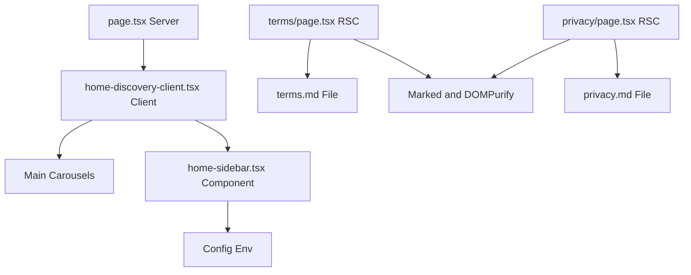
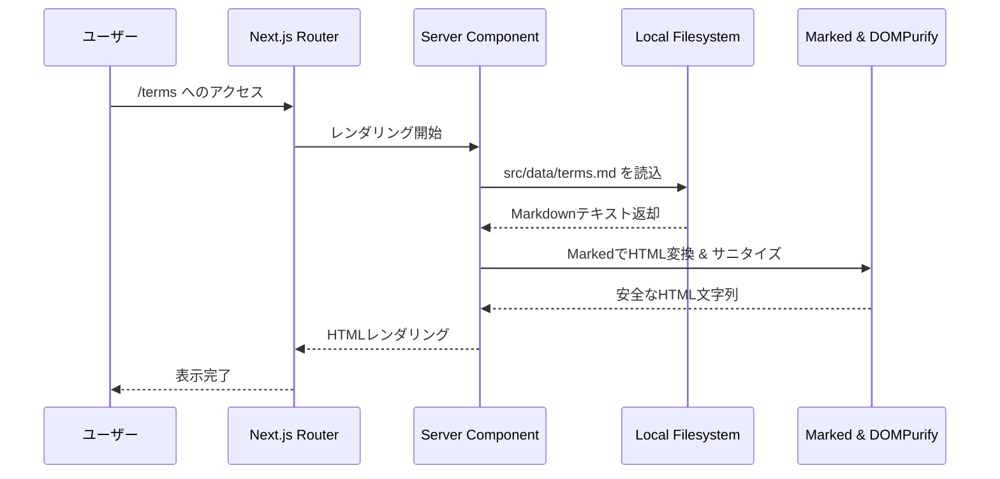

# Design Document: quizeum-legal-and-home-sidebar

## Overview

### Purpose
本機能は、quizeumの一般ユーザー向けに、サービスに関する法的な情報（利用規約、プライバシーポリシー）およびサポート・問い合わせ窓口へのアクセスを提供します。これにより、サービス運営の透明性と法的コンプライアンスを担保し、ユーザーが安心して利用できる環境を提供します。

### Users
quizeumを訪れるすべてのユーザー（ログイン済み、未ログインの双方）が、トップページおよびそれぞれの専用ページから利用規約等を確認できます。

### Impact
トップページ（`/`）のレイアウトが、従来の1カラム型から、PC表示時に右カラム（サイドバー）を持つ2カラム型へと変更されます。モバイル表示時には、既存のカルーセル構造の下部へ追加コンテンツとして自動で配置されます。また、新規ルートとして `/terms` および `/privacy` へのアクセスが可能になります。

### Goals
- PCなどの大画面において、トップページに幅300pxの右カラムを並列に配置し、規約・問合せへのリンクを提供する。
- モバイル端末などの小画面において、右カラムのコンテンツがカルーセルの下部に流れる形で適切に表示される。
- 共通のレイアウト（左サイドバー等）を適用した状態で、利用規約（`/terms`）およびプライバシーポリシー（`/privacy`）の専用ページを表示する。
- お問い合わせリンクからGoogleフォーム（環境変数で上書き可能）へ新しいタブで遷移できる。

### Non-Goals
- クイズプレイ画面（`/play`）やクイズ作成・編集画面などの画面に右カラムを配置することは行いません。
- 法的ドキュメントの動的編集機能や管理画面の提供は行わず、ファイルベースの静的マークダウン管理とします。

---

## Boundary Commitments

### This Spec Owns
- **新規コンポーネント**: `src/components/explore/home-sidebar.tsx`
- **新規ルーティング**: `src/app/terms/page.tsx` および `src/app/privacy/page.tsx`
- **ドキュメントソース**: `src/data/terms.md` および `src/data/privacy.md`
- **トップページUIの調整**: `src/app/home-discovery-client.tsx` のレイアウト変更と `HomeSidebar` の組み込み
- **お問い合わせURLの解決ロジック**: 環境変数 `NEXT_PUBLIC_CONTACT_FORM_URL` の検出およびデフォルトURLへのフォールバック

### Out of Boundary
- 既存のグローバル共通レイアウト（`LayoutWrapper`、`Sidebar`、`BottomNav`、`Header`）の直接のレイアウト仕様変更。
- トップページ以外の主要ページ（`/search`、`/leaderboard`等）への右カラムの導入。

### Allowed Dependencies
- `marked` (v13.0.3) — Markdownパース用
- `isomorphic-dompurify` (v2.20.0) — HTMLサニタイズ用
- `@/components/ui/card` (shadcn) — カードUIプリミティブ
- `@/components/ui/button` (shadcn) — ボタンUIプリミティブ

### Revalidation Triggers
- 共通のレイアウトコンポーネント（左サイドバー等）の幅や構造が変わり、トップページ全体の表示幅に大きな干渉が発生した時。
- Markdownパーサー（`marked`）がバージョン変更などにより異なるHTML構造を出力するようになった時。

---

## Architecture

### Existing Architecture Analysis
- アプリケーション全体は Next.js App Router で構築されています。
- `LayoutWrapper` によって、ログイン状態に関わらずPCでは左サイドバー、モバイルではボトムナビが表示されます。
- `Home` ページは `src/app/page.tsx` の Server Component でデータをフェッチし、`HomeDiscoveryClient` という Client Component でレンダリングされます。本設計ではこの Client Component の外枠にグリッドレイアウトを組み込む形で拡張します。

### Architecture Pattern & Boundary Map



### Technology Stack

| Layer | Choice / Version | Role in Feature | Notes |
|-------|------------------|-----------------|-------|
| Frontend / UI | Next.js App Router | ルーティングおよびページ・コンポーネントの構築 | `src/app/` ディレクトリ配下の配置 |
| Styling | Tailwind CSS v4 | レスポンシブ配置、プレミアムなカードスタイリング | `lg:grid` 等を用いた2カラム制御 |
| Content Data | Markdown | 利用規約・プライバシーポリシーのコンテンツデータ | `src/data/` ディレクトリ配下 |
| MD Parser | marked (v13.0.3) + DOMPurify | MarkdownをHTMLに安全に変換してレンダリング | XSSを防ぐためのサニタイズを含む |

---

## File Structure Plan

### Directory Structure
```
src/
├── app/
│   ├── terms/
│   │   └── page.tsx       # NEW: 利用規約表示ページ (Server Component)
│   ├── privacy/
│   │   └── page.tsx       # NEW: プライバシーポリシー表示ページ (Server Component)
│   └── home-discovery-client.tsx # MODIFY: 2カラムレイアウトへの拡張
├── components/
│   └── explore/
│       └── home-sidebar.tsx # NEW: 右カラム用リンク集コンポーネント
└── data/
    ├── terms.md           # NEW: 利用規約のソーステキスト
    └── privacy.md         # NEW: プライバシーポリシーのソーステキスト
```

### Modified Files
- `src/app/home-discovery-client.tsx`
  - 現在のカルーセル一覧の外側に `flex flex-col lg:grid lg:grid-cols-[1fr_300px] lg:gap-8` 等のラッパーを導入します。
  - `HomeSidebar` をインポートし、メインカルーセル群の右側（PC）または下部（モバイル）に配置します。

---

## System Flows

### Markdownドキュメント表示フロー (RSC)
利用規約やプライバシーポリシーにアクセスされた際の、サーバーサイドでのドキュメント読み込みとレンダリングの流れです。



---

## Requirements Traceability

| Requirement | Summary | Components | Interfaces | Flows |
|-------------|---------|------------|------------|-------|
| 1.1 | PC表示時の右側300pxカラム配置 | `home-discovery-client` | CSS Grid Layout | - |
| 1.2 | モバイル表示時の下部配置 | `home-discovery-client` | CSS flex/grid order | - |
| 1.3 | 既存ネオンデザインへの調和 | `HomeSidebar` | Tailwind v4 (shadcn card) | - |
| 2.1 | 「利用規約」リンクから `/terms` へ遷移 | `HomeSidebar` | Next.js Link | - |
| 2.2 | 「プライバシーポリシー」リンクから `/privacy` | `HomeSidebar` | Next.js Link | - |
| 2.3 | 共通レイアウト適用とマークダウン描画 | `TermsPage`, `PrivacyPage` | Server Component / marked | Markdownドキュメント表示フロー |
| 2.4 | 各ページ独自のメタデータ (SEO) | `TermsPage`, `PrivacyPage` | Next.js Metadata API | - |
| 3.1 | 新しいタブでお問い合わせフォームを開く | `HomeSidebar` | Next.js Link (target="_blank") | - |
| 3.2 | 環境変数 `NEXT_PUBLIC_CONTACT_FORM_URL` 利用 | `HomeSidebar` | Config Env | - |
| 3.3 | 未定義時のデフォルトURLへのフォールバック | `HomeSidebar` | Config Env | - |

---

## Components and Interfaces

### explore

#### HomeSidebar
| Field | Detail |
|-------|--------|
| Intent | トップページの右側（PC）または下部（モバイル）に表示する、利用規約、プライバシーポリシー、お問い合わせなどのリンクおよびコピーライトをまとめたカードコンポーネント |
| Requirements | 1.3, 2.1, 2.2, 3.1, 3.2, 3.3 |

**Responsibilities & Constraints**
- トップページ専用のウィジェットとして表示され、利用規約・プライバシーポリシー・お問い合わせへのナビゲーションを提供します。
- カードは shadcn/ui の `Card` コンポーネントを使用し、背景には少し透過性を持たせたグラスモルフィズム風のスタイリング（`bg-card/80 backdrop-blur-md` 等）を適用します。
- お問い合わせフォームのURLについて、環境変数 `NEXT_PUBLIC_CONTACT_FORM_URL` が取得できた場合はそれをリンク先とし、無効または存在しない場合はデフォルトのGoogleフォームURL `https://docs.google.com/forms/d/e/1FAIpQLSfP1E1_dummy_form/viewform` を返します。

**Dependencies**
- Outbound: `@/components/ui/card` — カード外枠描画 (P0)
- Outbound: `@/components/ui/separator` — リンク間の区切り線 (P1)

**Contracts**: State [x]
- **State Management**:
  - クライアントサイドでお問い合わせURLを特定するための解決処理を行います。
  ```typescript
  // 解決関数の例
  export function resolveContactUrl(): string {
    return process.env.NEXT_PUBLIC_CONTACT_FORM_URL || 'https://docs.google.com/forms/d/e/1FAIpQLSfP1E1_dummy_form/viewform';
  }
  ```

---

### Pages (RSC)

#### TermsPage (`src/app/terms/page.tsx`)
| Field | Detail |
|-------|--------|
| Intent | 利用規約（`/terms`）にアクセスした際に、`src/data/terms.md` からテキストデータをロードし、パースしてユーザーに表示するページコンポーネント。 |
| Requirements | 2.1, 2.3, 2.4 |

**Responsibilities & Constraints**
- Next.js の Server Component として実装し、サーバー側で安全にファイル読み込みおよびHTML変換を行います。
- ファイル読み込みエラー時には `try-catch` で処理し、フォールバックメッセージ（「ドキュメントの読み込み中にエラーが発生しました。時間を置いて再度お試しください」）を表示します。

**Dependencies**
- External: `marked` — Markdownテキストのパース (P0)
- External: `isomorphic-dompurify` — HTMLサニタイズ (P0)

#### PrivacyPage (`src/app/privacy/page.tsx`)
| Field | Detail |
|-------|--------|
| Intent | プライバシーポリシー（`/privacy`）にアクセスした際に、`src/data/privacy.md` からテキストデータをロードし、パースしてユーザーに表示するページコンポーネント。 |
| Requirements | 2.2, 2.3, 2.4 |

**Responsibilities & Constraints**
- `TermsPage` と同様の設計パターン（RSCでのファイル読込、パース、サニタイズ）で実装します。

---

## Data Models

### Physical Data Model (Markdown Data Source)
法的ドキュメントの本文は、データベースを使用せずローカルファイルシステム上のMarkdownファイルを正とします。

- **利用規約ドキュメントファイル**: `src/data/terms.md`
- **プライバシーポリシードキュメントファイル**: `src/data/privacy.md`

#### Markdownドキュメントのマークアップ仕様
見出し（`#`, `##`）、箇条書き（`-`）、段落を用いて構成し、ブラウザでレンダリングする際には `prose` (Tailwind Typography風のカスタムCSSスタイル) を適用して美しいデザインを適用します。

---

## Error Handling

### Error Strategy
静的ファイルの読み込みエラーやお知らせURLの例外処理に対して、ユーザーにシステムエラー画面を直接露出させることなく、親切なエラー通知UIでフォールバックします。

### Error Categories and Responses
- **ドキュメントファイルの読み込み失敗 (5xx)**:
  - 原因: `src/data/terms.md` が削除された、あるいはパーミッションエラー等で読み込みに失敗した場合。
  - 対応: ページ全体をクラッシュさせず、`try-catch` 内でエラーを捕捉し、「ドキュメントを一時的に読み込めません。時間を置いてから再度アクセスしてください。」という警告カードをレンダリングします。
- **お問い合わせ設定URLの欠落 (Config Error)**:
  - 原因: `NEXT_PUBLIC_CONTACT_FORM_URL` が未設定。
  - 対応: 自動的にデフォルトのGoogle Forms URLへフォールバックして開くため、例外処理は行いません。

---

## Testing Strategy

### Unit Tests
- **お問い合わせURL解決のテスト**: `src/components/explore/home-sidebar.tsx` 内の解決関数が、環境変数の有無に応じて正しいURLを返すことをJestで検証します。

### E2E/UI Tests
Playwright を用いて、実際のブラウザ操作での挙動とレイアウトを検証します。
- **レスポンシブ検証**:
  - PCサイズ（1280px以上）でブラウザを開き、おすすめクイズの右側に `HomeSidebar` が配置されていること、および `home-sidebar` テストIDの要素が存在することを確認します。
  - モバイルサイズ（480px以下）でブラウザを開き、`HomeSidebar` がメインカルーセルの下部に折りたたまれて縦並びで表示されていることを確認します。
- **遷移検証**:
  - 右サイドバーにある「利用規約」リンクをクリックし、`/terms` ページへ遷移すること。
  - `/terms` ページで規約テキストがレンダリングされていること。
  - 「プライバシーポリシー」リンクをクリックし、`/privacy` ページへ遷移すること。
  - `/privacy` ページでプライバシーポリシーがレンダリングされていること。
  - 「お問い合わせ」リンクをクリックし、別タブでお問い合わせ用URLが開かれること。
