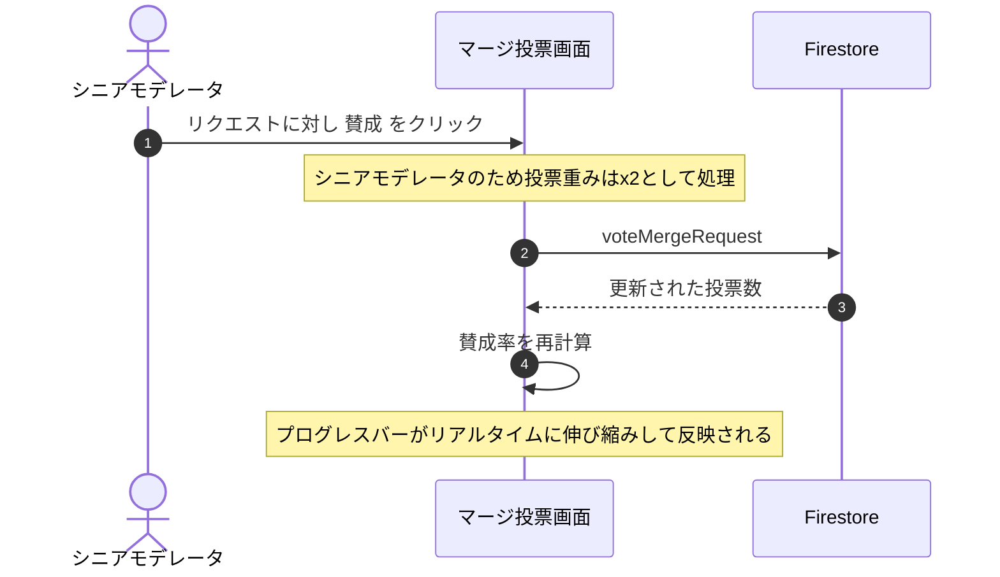
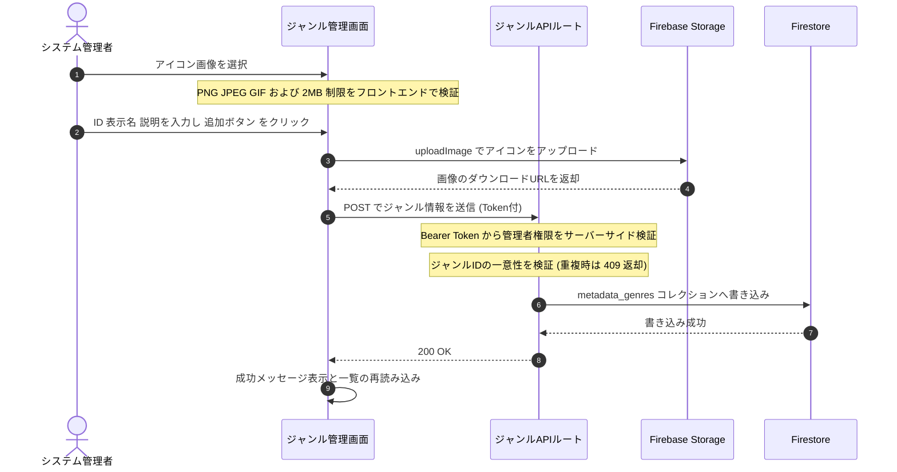

# Technical Design Document: quizeum-moderation-governance-ui

## Overview
本ドキュメントは、クイズ投稿SNS「quizeum」における管理者モデレーションおよびコミュニティ自治（ガバナンス）に関する専用UIの技術設計仕様を定義します。5回通報され一時保留状態にあるクイズ等の審査を行う管理者専用のモデレーションキュー、表記揺れタグやジャンルのマージ提案および加重投票UI、認証ユーザーによる新ジャンル新設申請フォームとモデレータ投票による自治承認UI、および管理者専用のジャンル直接追加・管理画面を構築します。

本システムは、Next.jsのApp RouterおよびReact、TypeScriptのフロントエンド構成に加え、Tailwind CSSおよびshadcn/uiコンポーネントを用いた親しみやすく機能的なガバナンスUIを実装し、Firestoreサービス（`ModerationService`等）およびサーバーサイドAPIと接続します。

**Phase 6（2026-06）**: ジャンルアイコンアップロードの設計・エラーメッセージを **SEC-08（SVG 禁止、PNG/JPEG/GIF のみ、2MB）** に仕様統一。`src/lib/genre-icon-upload.ts` でクライアント検証を共通化。
**管理者ジャンル直接追加機能の追加（2026-06-18 追加）**: システム管理者が直接ジャンルを定義・新設できる専用画面（`/admin/genres`）と、そこへの相互ナビゲーションを追加する。

### Goals
- 不適切通報審査キューおよび管理者特別審査閲覧ビューの構築。
- タグ/ジャンルの仮想マージ提案起案、モデレータ加重投票（シニアモデレータの重みx2）、および賛成率プログレスバー表示の構築。
- 新ジャンル申請フォーム（ID、日本語名、画像アップロード）および投票、可決条件達成時の自動有効化フィードバック。
- 初期ジャンルの一括投入（シード）および個別ジャンルの直接追加機能の構築。
- ユーザーの `moderationTier` または管理者ロールに基づいた、厳格なディレクトリ・ページ保護（403または404フォールバック）の実装。

### Non-Goals
- 一般ユーザーがクイズをプレイする画面、またはクイズ作成画面のUI設計そのもの（別スペックが担当）。
- 既存ジャンルの物理的な削除機能（不要になったジャンルは非表示または非アクティブ化で対応し、物理削除は本要件の対象外とする）。

---

## Boundary Commitments

### This Spec Owns
- **UIルーティング設計**: `/admin/moderation`, `/admin/genres`, `/community/merge`, `/community/genres` の各ページコンポーネント。
- **権限ガード**: クライアントサイドおよび Next.js Server Components での `moderationTier` または `role` に基づくページアクセス制御（403/404表示）。
- **アップロードUI**: ジャンル申請時および管理者直接追加時の **PNG/JPEG/GIF** ファイルアップロード（Firebase Storage、`uploadImage` / `storage.rules` と整合, SVG 禁止）。
- **投票インタラクション**: 賛成・反対投票時の加重値計算とプログレスバーの描画。
- **ジャンルデータ管理**: 初期ジャンルの一括投入（シード）および個別ジャンルの直接追加APIルート `/api/admin/genres` および `/api/admin/seed-genres`。

### Out of Boundary
- Cloud Functions を用いた非同期の投票可決バックエンドトリガー処理（`quizeum-core`が担当）。

### Allowed Dependencies
- **`quizeum-auth-profile-ui`**: `Header`, `useAuth`, プロフィール権限バッジ
- **`quizeum-play-flow-ui`**: `/quiz/[id]` 審査用特別閲覧ビュー
- **`quizeum-core`**: `ModerationService`, Firebase Storage, `tagMerge` (シードロジック)
- **Static Assets**: `src/data/initial_genres.json` (初期ジャンル定義データ)

### Revalidation Triggers
- `ModerationService` またはジャンル管理 API のシグネチャ変更。
- ユーザーロール・ `moderationTier` の種別追加。

---

## Architecture

### Technology Stack
- **Frontend**: Next.js v16.2.6 (App Router), React v19.2.4, TypeScript
- **Styling**: Tailwind CSS / shadcn/ui (Radix Primitives)
- **Asset Storage**: Firebase Storage (ジャンルアイコン用)
- **Backend / API**: Next.js API Routes (Firebase Admin SDK 経由の Firestore 書き込み)

---

## File Structure Plan

### Directory Structure
```
src/
├── app/
│   ├── admin/
│   │   ├── page.tsx           # [NEW] 管理者メニューポータル画面 (8.1, 8.2, 8.3)
│   │   ├── moderation/
│   │   │   └── page.tsx           # 管理者モデレーション審査画面 (1.1, 1.2, 1.3, 1.4, 1.5, 5.1, 5.2, 5.3, 5.6, 5.7, 7.8, 6.13)
│   │   ├── users/
│   │   │   └── page.tsx           # 管理者ユーザー管理画面 (7.8) - 既存修正（相互リンク追加）
│   │   └── genres/
│   │       └── page.tsx           # [NEW] 管理者専用ジャンル管理・直接追加画面 (7.1, 7.2, 7.3, 7.4, 7.5, 7.6, 7.7, 6.10, 6.11, 6.12, 6.16)
│   ├── api/
│   │   └── admin/
│   │       ├── seed-genres/
│   │       │   └── route.ts       # 初期ジャンル一括投入APIルート (5.1, 5.3, 5.4, 5.5)
│   │       ├── genres/
│   │       │   └── route.ts       # 管理者専用ジャンル管理・登録APIルート (7.1, 7.4, 7.5)
│   │       └── generate-icon/
│   │           └── route.ts       # [NEW] AIジャンルアイコン生成APIルート (9.1, 9.4, 9.5, 9.6)
│   └── community/
│       ├── merge/
│       │   └── page.tsx           # タグ/ジャンルマージリクエスト画面 (2.1, 2.2, 2.3, 2.4, 2.5, 2.6, 2.7, 6.4, 6.5, 6.6, 6.14)
│       └── genres/
│           └── page.tsx           # ジャンル新設申請・投票画面 (3.1, 3.2, 3.3, 3.4, 3.5, 4.2, 4.3, 6.7, 6.8, 6.9, 6.15)
├── services/
│   └── tagMerge.ts                # シード投入サービス関数 seedInitialGenres 追加 (5.4, 5.5)
└── middleware.ts                  # ロール別ルートガードミドルウェア (1.1, 2.1, 7.1)
```

---

## System Flows

### モデレータ加重投票とプログレスバー表示フロー


### 管理者によるジャンル直接追加フロー


---

## Requirements Traceability

| Requirement | Summary | Components | Interfaces | Flows |
|-------------|---------|------------|------------|-------|
| 1.1 | 管理者・シニアモデレータ専用アクセス制限 | `/admin/moderation` Page | `middleware.ts` | - |
| 1.2 | 通報5回到達コンテンツの審査キュー表示 | `/admin/moderation` Page | Flagged Queue | - |
| 1.3 | 通報理由および詳細内容の表示 | `/admin/moderation` Page | Flagged Queue | - |
| 1.4 | 公開復帰（通報リセット）およびコンテンツ削除 | `/admin/moderation` Page | `ModerationService` | - |
| 1.5 | 審査用特別閲覧ビュー遷移 | `/admin/moderation` Page | Special Quiz View | - |
| 2.1 | モデレータ資格ルートガード | `/community/merge` Page | `middleware.ts` | - |
| 2.2 | マージ提案起案フォーム | `/community/merge` Page | Form Input | - |
| 2.3 | 保留中マージリクエスト投票一覧表示 | `/community/merge` Page | Request Queue | - |
| 2.4 | ソースタグ/ジャンル分割一覧閲覧 | `/community/merge` Page | Split List View | - |
| 2.5 | 賛成/反対加重投票UI | `/community/merge` Page | `ModerationService` | 投票フロー |
| 2.6 | シニアモデレータ「重みx2」表示と計算 | `/community/merge` Page | `ModerationService` | 投票フロー |
| 2.7 | 賛成率のリアルタイムプログレスバー表示 | `/community/merge` Page | CSS Progress Bar | 投票フロー |
| 3.1 | 認証ユーザー向け新ジャンル申請フォーム | `/community/genres` Page | Form (PNG/JPEG/GIF upload) | - |
| 4.1 | SEC-08 仕様文言整合 | Spec docs | — | — |
| 4.2 | MIME/size クライアント検証 | `genre-icon-upload` / Page | `validateGenreIconFile` | — |
| 4.3 | SVG 拒否 UX | `/community/genres` Page | inline error | — |
| 3.2 | 保留中ジャンル新設申請の一覧と投票UI | `/community/genres` Page | `ModerationService` | - |
| 3.3 | モデレータ賛否投票 | `/community/genres` Page | `ModerationService` | - |
| 3.4 | 可決条件判定とシステム反映通知 | `/community/genres` Page | Cloud Functions / UI | - |
| 3.5 | 承認/否決履歴タブ表示 | `/community/genres` Page | History Tab | - |
| 5.1 | 管理者専用シードUIアクセス制限 | `/admin/moderation` Page / API | check admin role | - |
| 5.2 | 一括投入セクション・ボタン表示 | `/admin/moderation` Page | Button | - |
| 5.3 | 一括登録APIへのリクエスト送信 | `/admin/moderation` Page | `fetch()` request | - |
| 5.4 | Firestore一括書き込みと冪等性 | `tagMerge.ts` | `seedInitialGenres` | - |
| 5.5 | 重複回避（スキップ/アップデート） | `tagMerge.ts` | `seedInitialGenres` | - |
| 5.6 | 実行時ローディング表示とボタン無効化 | `/admin/moderation` Page | UI state | - |
| 5.7 | 結果（件数）または失敗アラート表示 | `/admin/moderation` Page | Alert Messages | - |
| 6.4 | マージ画面アクセス時の静的フレーム描画 | `/community/merge` Page | Suspense / Streaming | - |
| 6.5 | マージ一覧取得中のスケルトン表示 | `/community/merge` Page | merge-requests-skeleton | - |
| 6.6 | マージ一覧取得後のコンテンツ描画 | `/community/merge` Page | React rendering | - |
| 6.7 | ジャンル申請画面アクセス時の静的フレーム描画 | `/community/genres` Page | Suspense / Streaming | - |
| 6.8 | ジャンル申請一覧取得中のスケルトン表示 | `/community/genres` Page | genres-moderation-skeleton | - |
| 6.9 | ジャンル申請一覧取得後のコンテンツ描画 | `/community/genres` Page | React rendering | - |
| 6.10 | ジャンル管理画面アクセス時の静的フレーム描画 | `/admin/genres` Page | Suspense / Streaming | 直接追加フロー |
| 6.11 | ジャンル管理画面の一覧取得中のスケルトン表示 | `/admin/genres` Page | genres-management-skeleton | 直接追加フロー |
| 6.12 | ジャンル管理画面の一覧取得後のコンテンツ描画 | `/admin/genres` Page | React rendering | 直接追加フロー |
| 6.13 | 通報審査キューのスケルトン属性付与 | `/admin/moderation` Page | moderation-queue-skeleton | - |
| 6.14 | マージ投票スケルトン属性付与 | `/community/merge` Page | merge-requests-skeleton | - |
| 6.15 | ジャンル申請スケルトン属性付与 | `/community/genres` Page | genres-moderation-skeleton | - |
| 6.16 | ジャンル管理画面スケルトン属性付与 | `/admin/genres` Page | genres-management-skeleton | 直接追加フロー |
| 7.1 | 管理者以外のジャンル管理画面アクセス制限 | `/admin/genres` Page / API | middleware.ts / guard | 直接追加フロー |
| 7.2 | ジャンル管理画面ロード中インジケータ表示 | `/admin/genres` Page | UI spinner | - |
| 7.3 | 登録済みジャンル一覧および追加フォーム提供 | `/admin/genres` Page | UI Card / Form | 直接追加フロー |
| 7.4 | 有効値入力時のFirestore直接書き込み | `/admin/genres` Page / API | api-genres API | 直接追加フロー |
| 7.5 | 重複ジャンルIDのエラーハンドリング | `/admin/genres` Page / API | api-genres API | 直接追加フロー |
| 7.6 | アイコン画像のPNG/JPEG/GIF制限と容量制限 | `/admin/genres` Page | `validateGenreIconFile` | 直接追加フロー |
| 7.7 | 登録成功時のジャンル一覧自動更新 | `/admin/genres` Page | React state refresh | 直接追加フロー |
| 7.8 | モデレーション画面でのジャンル管理リンク表示 | `/admin/moderation` Page | Navigation link | 直接追加フロー |
| 8.1 | 管理者以外のポータル画面アクセス制限 | `/admin` Page | middleware.ts / guard | ポータル表示フロー |
| 8.2 | ポータル画面ロード中インジケータ表示 | `/admin` Page | UI spinner | ポータル表示フロー |
| 8.3 | 各管理者メニューカードおよびリンクの表示 | `/admin` Page | UI Card | ポータル表示フロー |
| 9.1 | AI生成時入力バリデーション（インラインエラー） | `/admin/genres` Page / `/community/genres` | Button interaction | AI生成フロー |
| 9.2 | 生成中ローディングインジケータと非活性化 | `/admin/genres` Page / `/community/genres` | Button / Spinner | AI生成フロー |
| 9.3 | 生成成功画像プレビューとフォーム値設定 | `/admin/genres` Page / `/community/genres` | Preview / State | AI生成フロー |
| 9.4 | 生成失敗エラー表示とボタン活性化復帰 | `/admin/genres` Page / `/community/genres` | Error banner / State | AI生成フロー |
| 9.5 | 一般ユーザーデイリー生成上限制限（1日5回） | `/api/genres/generate-icon` | checkDailyLimit | AI生成フロー |
| 9.6 | 管理者生成上限免除（無制限） | `/api/genres/generate-icon` | skipDailyLimit | AI生成フロー |

---

## Components and Interfaces

### Component Summary Table

| Component | Domain/Layer | Intent | Req Coverage | Key Dependencies | Contracts |
|-----------|--------------|--------|--------------|------------------|-----------|
| `AdminPortal` | UI / Page | 各種管理者用サブ画面へのナビゲーションポータル | 8.1-8.3 | `useAuth` | UI State |
| `AdminModeration` | UI / Page | 通報審査、初期ジャンル投入UI | 1.1-1.5, 5.1-5.3, 5.6, 5.7, 7.8, 6.13 | `useAuth`, `/api/admin/seed-genres` | UI State |
| `AdminGenres` | UI / Page | 登録済みジャンル一覧、ジャンル直接登録フォーム | 7.1-7.7, 6.10-6.12, 6.16 | `useAuth`, `/api/admin/genres`, `uploadImage`, `validateGenreIconFile` | UI State / TSX |
| `CommunityMerge` | UI / Page | マージ起案、加重投票、進捗可視化 | 2.1-2.7, 6.4-6.6, 6.14 | `ModerationService`, `useAuth` | UI State |
| `CommunityGenres` | UI / Page | ジャンル新設申請（画像付）、投票、履歴閲覧 | 3.1-3.5, 4.1-4.3, 6.7-6.9, 6.15, 9.1-9.5 | `ModerationService`, Storage, `/api/genres/generate-icon` | UI State |
| `seed-genres API` | API Route | 初期ジャンル一括登録認可・実行 | 5.1, 5.3, 5.4, 5.5 | `tagMerge` service, Firebase Admin Auth | JSON response |
| `admin-genres API` | API Route | 全ジャンル取得、新規ジャンル直接登録 | 7.1, 7.4, 7.5 | Firebase Admin Auth / Firestore | JSON response |
| `generate-icon API` | API Route | AIによるジャンルアイコン画像生成 | 9.5, 9.6 | Gemini GenAI, Admin SDK Auth / Storage | JSON response |

---

### UI Page / Components

#### AdminPortalPage Component (`src/app/admin/page.tsx`)
- **Intent**: 管理者が各種管理ツール（モデレーション審査、ユーザー評判管理、ジャンル直接管理）に容易に遷移できるポータルメニューを提供する。
- **Requirements**: 8.1, 8.2, 8.3
- **Responsibilities & Constraints**:
  - `isAdminUser` ガードにより、`admin` ロール以外のユーザーのアクセスを遮断し `/not-found` へ遷移させる。
  - PC/タブレット左 Sidebar、モバイル BottomNav 共通レイアウトを踏襲する。
  - 各種管理者用機能への遷移カード（タイトル、説明、 Lucide アイコン、ホバーエフェクト付き）を表示する。

#### AdminGenresPage Component (`src/app/admin/genres/page.tsx`)
- **Intent**: 管理者が現在登録されているすべてのジャンルを一覧表示し、新しいジャンルを即時に作成・追加するためのインターフェースを提供。
- **Requirements**: 7.1, 7.2, 7.3, 7.4, 7.5, 7.6, 7.7, 6.10, 6.11, 6.12, 6.16
- **Responsibilities & Constraints**:
  - `isAuthorized` ガードにより、`admin` ロール以外のユーザーのアクセスを遮断し 404 または 403 画面へ遷移。
  - `listActiveGenres` ではなく、無効なジャンルも含えた全ジャンルデータを取得する内部API `/api/admin/genres` をコールしてテーブル形式で一覧表示。
  - ジャンル追加フォームを提供（ID、表示名、説明、アイコンファイル選択）。
  - アイコン選択時、`validateGenreIconFile` を使用して PNG/JPEG/GIF の MIME タイプおよび 2MB 上限をクライアント側で厳密にチェック。
  - 追加処理は `uploadImage` (パス: `genres/{genreId}/icon_{timestamp}.png`) を実行後、ダウンロード URL を含めた情報を `/api/admin/genres` に POST。
  - 登録が成功すると、ジャンル一覧のステートを更新して画面表示に即時反映。

**Dependencies**
- Inbound: なし
- Outbound: `uploadImage` (P0), `getGenreIconPath` (P0), `validateGenreIconFile` (P0)
- External: Firebase Client Auth, Firestore Client SDK (GET / POSTリクエスト用)

**Contracts**: State [x] / Service [ ]

---

### API Routes

#### admin-genres API (`src/app/api/admin/genres/route.ts`)
- **Intent**: 管理者認証（Bearer Token 検証）を行い、全ジャンル情報の取得、および一意性バリデーションを経た新規ジャンル情報の登録処理を提供する。
- **Requirements**: 7.1, 7.4, 7.5

##### API Contract

| Method | Endpoint | Request | Response | Errors |
|--------|----------|---------|----------|--------|
| GET | `/api/admin/genres` | なし (Auth Token 必須) | `GenreMetadata[]` | 401 (Unauthorized), 403 (Forbidden), 500 (Internal Server Error) |
| POST | `/api/admin/genres` | `{ id: string, displayName: string, description: string, iconImageUrl: string \| null }` | `{ success: boolean, data: GenreMetadata }` | 400 (Bad Request), 401 (Unauthorized), 403 (Forbidden), 409 (Conflict), 500 |

- **GET 処理**:
  1. Authorization ヘッダーから Bearer トークンを抽出し、Firebase Admin Auth で検証。
  2. 実行者UIDの `users` ドキュメントを確認し、ロールまたは `moderationTier` が `admin` であるかを検証。
  3. `metadata_genres` コレクションの全ドキュメントを取得し、配列としてレスポンス。
- **POST 処理**:
  1. トークンの検証および管理者権限（上記GETと同様）を検証。
  2. リクエストボディのバリデーション:
     - `id`: 空不可、正規表現 `^[a-z0-9-]+$` にマッチすること。
     - `displayName`: 空不可。
  3. Firestore ドキュメント `metadata_genres/{id}` がすでに存在するかどうかを検証。
     - 存在する場合、ステータス `409` で `{ error: 'duplicate-id', message: 'このジャンルIDはすでに存在します。' }` を返す。
  4. 存在しない場合、以下ドキュメントを作成保存する:
     - `id`: (String)
     - `displayName`: (String)
     - `description`: (String, デフォルト空文字)
     - `iconImageUrl`: (String | null)
     - `canonicalId`: null
     - `mergedGenreIds`: `[]`
     - `isActive`: true
     - `createdAt`: (Timestamp / Date)
     - `updatedAt`: (Timestamp / Date)
  5. 登録完了後、ステータス `200` で成功レスポンスを返す。

#### generate-icon API (`src/app/api/genres/generate-icon/route.ts`)
- **Intent**: 認証済みセッションのもとで、Gemini (Imagen) モデルを呼び出してジャンル名や説明に応じたアイコン画像（PNG）を生成・一時保存し、画像 URL を返却する。
- **Requirements**: 9.4, 9.5, 9.6

##### API Contract

| Method | Endpoint | Request | Response | Errors |
|--------|----------|---------|----------|--------|
| POST | `/api/genres/generate-icon` | `{ displayName: string, description: string, userId: string }` | `{ success: boolean, iconImageUrl: string, usage?: { current: number, limit: number } }` | 400 (Bad Request), 401 (Unauthorized), 429 (Too Many Requests), 503 (Service Unavailable), 500 |

- **処理フロー**:
  1. セッション認証トークン（Bearer Token）から UID および `users/{uid}` から権限（`moderationTier`, `role`）を検証。
  2. 一般ユーザーの場合、Firestore のトランザクションを使用してデイリー生成制限（上限5回、パス: `users/{uid}/authoring_limits/genre-icon`）を確認。上限超過時は `429 Too Many Requests` を返却。管理者の場合はチェックを免除。
  3. `displayName` と `description` の中身をチェックし、空の場合は `400 Bad Request`。
  4. `gemini-2.5-flash-image` (Imagen) モデルを呼び出し、ジャンルに適したプロンプトを構築して画像生成（PNG）を実行。
  5. 生成された画像を Admin Cloud Storage の `temp/genre-icons/{uid}_{timestamp}.png` に保存し、パブリック URL を取得。
  6. Firestore の生成カウンタをインクリメント（管理者はスキップ）。
  7. 生成成功メッセージと画像 URL をステータス `200` で返却。

---

## Data Models

### Domain Model: GenreMetadata (`src/types/index.ts`)
ジャンル情報の構造は以下の通り定義されています。

```typescript
export interface GenreMetadata {
  id: string;                  // 一意なジャンルID
  displayName: string;         // 表示名（日本語）
  description?: string;        // 説明文（任意）
  iconImageUrl: string | null; // アイコン画像の Storage ダウンロードURL
  canonicalId: string | null;  // マージ先の canonicalId（直接追加時は null）
  mergedGenreIds: string[];    // マージされたジャンルID配列（直接追加時は空配列）
  isActive: boolean;           // 有効フラグ（直接追加時は true）
  createdAt?: Date;
  updatedAt?: Date;
}
```

---

## Error Handling

### Error Strategy
- **管理者以外のアクセス**:
  - `/admin/genres` ページ遷移時、`admin` でないユーザーに対してはルートガードにより即時 `404` ページ表示、または API 側での `403 Forbidden` の返却とフロントエンドでのエラーハンドリングによる制御を行う。
- **重複ID登録**:
  - `/api/admin/genres` の POST 時に一意性チェックに引っかかった場合、`409 Conflict` を返し、フロントエンド側で「このジャンルIDはすでに登録されています」という分かりやすいアラートを表示する。
- **画像アップロードエラー**:
  - 画像選択時に `validateGenreIconFile` で非許容フォーマット（SVG含む）や2MB容量超過を検知した場合、フォーム送信をロックしてインラインでエラーを表示する。

---

## Testing Strategy

### Unit Tests
- **ジャンルアイコン・バリデーション (validateGenreIconFile)**:
  - SVGファイルの指定時に `{ ok: false, error: '...' }` が返ること。
  - PNG/JPEG/GIFファイルかつ2MB以内の場合に `{ ok: true }` が返ること。
  - 2.1MBのファイル指定時に容量制限エラーが返ることをテスト。

### Integration Tests
- **管理者ジャンル API (`/api/admin/genres`)**:
  - 一般ユーザーの認証トークンを用いた GET/POST が `403 Forbidden` でブロックされること。
  - 重複する ID を指定して POST した場合に `409 Conflict` が返ること。
  - 有効な管理者トークンを用いた POST により、Firestore 上に新規ドキュメントが正しく生成されること。

### E2E/UI Tests
- **ジャンル直接追加と一覧更新フロー**:
  - 管理者として `/admin/genres` にアクセスした際、現在登録されているジャンル一覧がテーブル表示されること。
  - フォームに新規 ID・表示名を入力し、PNG アイコン画像を選択して登録した際、画像が Storage に保存され、一覧テーブルへ自動的かつ即時に行が追加・反映されること。
  - SVG ファイル選択時に、エラー警告メッセージが表示され「ジャンルを追加」ボタンが非活性になること。
