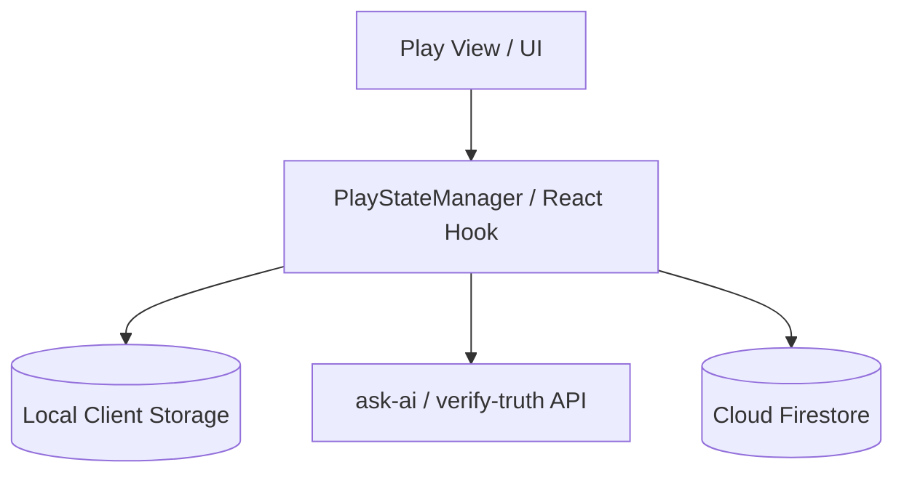
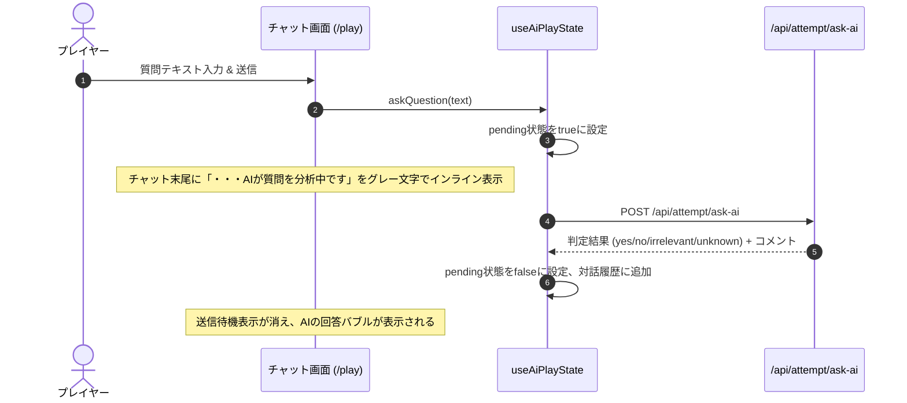
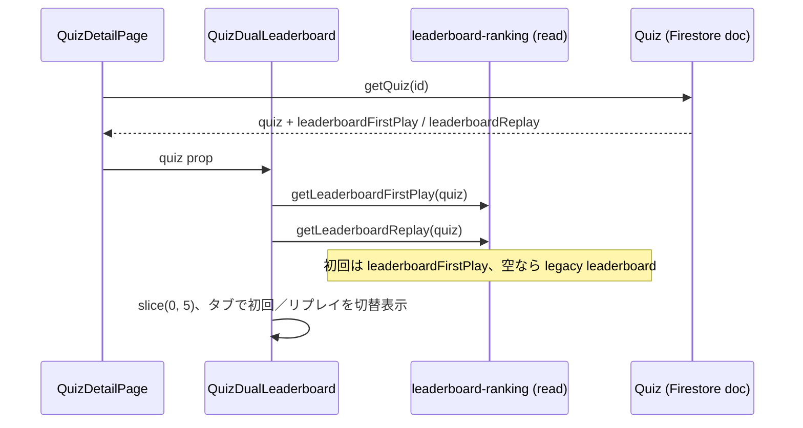

# Technical Design Document: quizeum-play-flow-ui

## Overview
本ドキュメントは、クイズ投稿SNS「quizeum」におけるメインプレイフローおよび探索関連UIの技術設計仕様を定義します。エントランスとなるホーム画面から、クイズ詳細、インタラクティブな各種プレイモード（通常、模擬試験、フラッシュカード）、AIチャットを活用した水平思考プレイ（ウミガメのスープ）、結果表示と評価フィードバック、過去の誤答の復習プレイ、各種探索（ブックマーク、タグ別、ジャンル別）、およびリーダーボードを構築します。

本システムは、Next.jsのApp RouterおよびReact、TypeScriptのフロントエンド構成に加え、CSS Modulesによる親しみやすく遊び心のあるUIを実装し、Firestoreサービス（`AttemptService`, `BookmarkService`等）およびサーバーサイドAPI Routesと接続します。

**Phase 5（2026-06）**: クイズ詳細の単位リーダーボードを初回プレイ／リプレイの二系統表示に刷新する。永続化・順位計算は `quizeum-core`（`leaderboard-ranking.ts`）が完了済みのため、本スペックは読み取り・表示・E2E契約の仕上げを担当する。

### Goals
- 複合検索フィルタ、タブ切替タイムラインを備えた軽快なホーム画面の構築。
- プレイ中のブラウザ再読み込みや切断をカバーする、`localStorage` を用いた解答セッションのクライアントサイド一時保護と同期。
- ウミガメのスーププレイにおける、2カラムレイアウトおよびAI回答生成中の「・・・AIが質問を分析中です」（グレー文字表示）を含むリッチなチャットインタラクション。
- クイズ完了後の👍/👎評価、難易度投票、クローズド間違い指摘、作家への感謝のリアクションUIの実装。
- オフライン時におけるプレイ進行・結果確認のフォールバック処理。
- クイズ作成者本人に対する編集動線UIの提供、および他ユーザーによる直接編集URLアクセス時の認可保護（ガード）。
- **Phase 5**: クイズ詳細における初回プレイ／リプレイ二系統リーダーボードのタブUI、列表示（正解数・合計時間・達成日）、`data-testid` 契約、E2Eの旧仕様（ハイスコア／最速）からの更新。

### Non-Goals
- クイズおよびクイズリストの作成・編集UIそのもの（ただし、詳細画面での作成者判定ボタン表示と、編集画面における他ユーザーによる直接アクセス時の認可保護ガード処理は本スペックで担当し、実際のエディタ処理自体は `quizeum-creator-dash-ui` に委ねます）。
- 管理者モデレーション、タグ・ジャンル仮想マージなどの自治ガバナンスUI（`quizeum-moderation-governance-ui`が担当）。
- **Phase 5**: `leaderboardFirstPlay` / `leaderboardReplay` の更新・マージ・順位判定（`quizeum-core`）。マイページのプレイ履歴UI（`quizeum-auth-profile-ui`）。プラットフォーム総合 `/leaderboard` の集計ロジック変更。

---

## Boundary Commitments

### This Spec Owns
- **UIルーティング設計**: `/`, `/quiz/[id]`, `/quiz/[id]/play`, `/quiz/[id]/result`, `/quiz/review`, `/leaderboard`, `/bookmarks`, `/tags/[tagName]`, `/genres/[genreName]`, `/quiz/[id]/edit` の各ページコンポーネント。
- **クライアントサイドセッション保護**: プレイ進捗の `localStorage` シリアライズ・復元・オンライン復帰時のバックグラウンド自動同期。
- **AI対話インタラクション**: ウミガメチャットUI、ターン制限・キャッシュバッジ、および回答生成待機メッセージのグレー文字表示制御。
- **評価フィードバックUI**: 良問評価投票、難易度投票、指摘フォームモーダル、作家感謝リアクション。
- **クイズ編集認可ガード**: 編集画面（`/quiz/[id]/edit`）における、ログイン状態および作成者所有権（`quiz.authorId === user.id`）に基づく直接アクセスの制限とアクセス拒否UI表示の制御。
- **クイズ単位リーダーボード表示（Phase 5）**: `QuizDualLeaderboard` コンポーネントによる初回／リプレイの読み取り専用表示、タブ切替、空状態、E2E用 `data-testid`。

### Out of Boundary
- Gemini APIとの対話やプロンプト生成のバックエンドロジック本体。
- 認証状態の監視およびユーザープロフィールそのものの編集UI（`quizeum-auth-profile-ui`が担当）。
- Firestore へのリーダーボード書き込み、`compareLeaderboardRecords` / `mergeUserEntryAndTakeTop5` の呼び出し（`quizeum-core`）。

### Allowed Dependencies
- **`quizeum-auth-profile-ui`**: `Header`, `useAuth`
- **`quizeum-core`**: `AttemptService`, `BookmarkService`, `ReviewService`, **`getLeaderboardFirstPlay` / `getLeaderboardReplay`（`@/lib/leaderboard-ranking`、読み取りのみ）**
- **サーバーAPIプロキシ**: `/api/attempt/ask-ai`, `/api/attempt/verify-truth`

### Revalidation Triggers
- AI質問判定API (`/api/attempt/ask-ai`) または真相判定API (`/api/attempt/verify-truth`) の入出力スキーマ変更。
- `AttemptService` のデータ格納スキーマ変更。
- `LeaderboardRecord` のフィールド追加・意味変更、または `leaderboard` レガシーフォールバック廃止。

---

## Architecture

### Architecture Pattern & Boundary Map
プレイ画面はクライアントサイドでのインタラクティブな状態管理（ステート）が極めて重要であり、通常プレイ用の `PlayStateManager` フックおよびウミガメスープ用の `AiPlayStateManager` フックを介して `localStorage` への永続化とAPI通信を統制します。



### Technology Stack
- **Frontend**: Next.js v16.2.6 (App Router), React v19.2.4, TypeScript
- **Styling**: Vanilla CSS (CSS Modules)
- **Local Storage**: `localStorage` (クライアントサイドセッション保護用)

---

## File Structure Plan

### Directory Structure
```
src/
├── app/
│   ├── page.tsx                   # ホーム画面 (1.1, 1.2, 1.3, 1.4)
│   ├── page.module.css
│   ├── bookmarks/
│   │   ├── page.tsx               # ブックマーク一覧画面 (7.3)
│   │   └── bookmarks.module.css
│   ├── leaderboard/
│   │   ├── page.tsx               # 総合リーダーボード画面 (7.1)
│   │   └── leaderboard.module.css
│   ├── tags/
│   │   └── [tagName]/
│   │       └── page.tsx           # タグ別クイズ一覧画面 (7.2)
│   ├── genres/
│   │   └── [genreName]/
│   │       └── page.tsx           # ジャンル別クイズ一覧画面 (7.2)
│   └── quiz/
│       ├── review/
│       │   ├── page.tsx           # 弱点克服プレイ画面 (6.1, 6.2, 6.3)
│       │   └── review.module.css
│       └── [id]/
│           ├── page.tsx           # クイズ詳細画面 (2.1–2.6); LBは子コンポーネントへ委譲 (9.x)
│           ├── page.module.css    # LB用スタイルは quiz-dual-leaderboard.module.css へ移管
│           ├── edit/
│           │   └── page.tsx       # クイズ編集画面ルーティング (8.1, 8.2)
│           ├── play/
│           │   ├── page.tsx       # クイズプレイ画面 (3.1, 3.2, 3.3, 3.4, 3.5, 4.1, 4.2, 4.3, 4.4, 4.5, 4.6)
│           │   └── play.module.css
│           └── result/
│               ├── page.tsx       # クイズ結果画面 (5.1, 5.2, 5.3, 5.4, 5.5)
│               └── result.module.css
components/
├── quiz/
│   ├── quiz-editor.tsx            # クイズエディタコンポーネント (8.1, 8.2 認可ガード)
│   ├── quiz-dual-leaderboard.tsx  # 初回／リプレイLB表示 (9.1–9.8) 【Phase 5 新規】
│   └── quiz-dual-leaderboard.module.css
└── hooks/
    ├── usePlayState.ts            # 通常プレイのセッション管理フック (3.4)
    └── useAiPlayState.ts          # ウミガメチャットのステート管理フック (4.3, 4.4)
e2e/
└── leaderboard.spec.ts            # クイズ詳細LB: 旧「最速」→リプレイへ更新 (9.x)
```

### Modified Files（Phase 5）
- `src/app/quiz/[id]/page.tsx` — インラインLB表を `QuizDualLeaderboard` に置換。`sortLb` 等のクライアント並び替えを削除。
- `src/app/quiz/[id]/page.module.css` — LB専用スタイルをコンポーネント用CSSへ移管（または共有クラスを残す最小差分）。
- `e2e/leaderboard.spec.ts` — `fastest-leaderboard` / `highscore-entry` を Phase 5 の `data-testid` に合わせて更新。

---

## System Flows

### ウミガメスープ AI回答生成中インタラクションフロー


### クイズ詳細リーダーボード表示フロー（Phase 5・読み取りのみ）


---

## Requirements Traceability

| Requirement | Summary | Components | Interfaces | Flows |
|-------------|---------|------------|------------|-------|
| 1.1 | ホームタブ表示（新着・人気・トレンド・フォローTL） | `/` Page | `QuizService` | - |
| 1.2 | 主要ジャンルナビゲーション | `/` Page | `metadata_genres` | - |
| 1.3 | 複合検索フィルタ | `/` Page | `QuizService` | - |
| 1.4 | 未ログイン時ブックマーク制限 | `/` Page | `useAuth`, `/login` | - |
| 2.1 | クイズ詳細メタ情報表示 | `/quiz/[id]` Page | `QuizService` | - |
| 2.2 | 良問評価バッジとマスク制御 | `/quiz/[id]` Page | `ReviewService` | - |
| 2.3 | 3つのプレイモード選択UI | `/quiz/[id]` Page | Mode Panel | - |
| 2.4 | プレイ画面へのリダイレクト遷移 | `/quiz/[id]` Page | `useRouter` | - |
| 2.5 | 作成者本人用「クイズ編集」ボタンの表示 | `/quiz/[id]` Page | `useAuth` | - |
| 2.6 | 編集ボタンクリック時のクイズ編集画面遷移 | `/quiz/[id]` Page | `useRouter` | - |
| 3.1 | 個別/全体カウントダウンタイマー | `/quiz/[id]/play` Page | Timer Hook | - |
| 3.2 | ヒント表示ポップアップ | `/quiz/[id]/play` Page | Dialog UI | - |
| 3.3 | `localStorage` セッション保護と復元 | `/quiz/[id]/play` Page | `usePlayState` | - |
| 3.4 | オフライン時のローカル解答進行 | `/quiz/[id]/play` Page | `AttemptService` | - |
| 4.1 | ウミガメスープ2カラムレイアウト | `/quiz/[id]/play` Page | AI Component | - |
| 4.2 | 未ログイン時のウミガメスープ制限リダイレクト | `/quiz/[id]/play` Page | Auth Guard | - |
| 4.3 | AI回答生成中待機「・・・AIが質問を分析中です」表示 | `/quiz/[id]/play` Page | `useAiPlayState` | インタラクションフロー |
| 4.4 | 同一質問キャッシュバッジ表示 | `/quiz/[id]/play` Page | AI Component | - |
| 4.5 | 無料ユーザーのターン制限表示と無効化 | `/quiz/[id]/play` Page | AI Component | - |
| 4.6 | 真相回答と自動真相判定・クリア演出 | `/quiz/[id]/play` Page | `verify-truth` | - |
| 5.1 | プレイ結果表示と解説マークダウン | `/quiz/[id]/result` Page | Result Component | - |
| 5.2 | 👍/👎良問評価および難易度投票 | `/quiz/[id]/result` Page | `ReviewService` | - |
| 5.3 | 問題の間違い指摘フォーム | `/quiz/[id]/result` Page | Feedback Dialog | - |
| 5.4 | 作家感謝リアクション送信 | `/quiz/[id]/result` Page | `ReactionService` | - |
| 5.5 | オフライン結果画面表示と機能制限 | `/quiz/[id]/result` Page | Offline Handler | - |
| 6.1 | 弱点克服ジャンルフィルタ選択 | `/quiz/review` Page | Genre Selector | - |
| 6.2 | 間違い設問のフェッチと復習プレイ | `/quiz/review` Page | `AttemptService` | - |
| 6.3 | 復習完了時の誤答リストアトミック削除 | `/quiz/review` Page | `AttemptService` | - |
| 7.1 | 総合リーダーボード各種ランキング | `/leaderboard` Page | Ranking Tab | - |
| 7.2 | タグ別・ジャンル別クイズ一覧表示 | `/tags/[tagName]`, `/genres/[genreName]` | Quiz Card Grid | - |
| 7.3 | ブックマーク一覧とお気に入り解除 | `/bookmarks` Page | `BookmarkService` | - |
| 8.1 | 未ログイン時のクイズ編集画面リダイレクト制限 | `QuizEditor` / `QuizEditPage` | `useAuth`, `useRouter` | - |
| 8.2 | 非所有者のクイズ編集画面アクセス制限 | `QuizEditor` / `QuizEditPage` | `useAuth`, `QuizService` | - |
| 9.1 | 初回／リプレイの別表示（タブ） | `QuizDualLeaderboard` | Tab state | クイズLB表示フロー |
| 9.2 | 順位・表示名・正解数・時間・達成日 | `QuizDualLeaderboard` | Table markup | - |
| 9.3 | 表示順（サーバー保存順を信頼） | `QuizDualLeaderboard` | `getLeaderboard*` + slice | - |
| 9.4 | 空状態 | `QuizDualLeaderboard` | Empty UI | - |
| 9.5 | 初回: `leaderboardFirstPlay` + legacy fallback | `QuizDualLeaderboard` | `getLeaderboardFirstPlay` | - |
| 9.6 | リプレイ: `leaderboardReplay` のみ | `QuizDualLeaderboard` | `getLeaderboardReplay` | - |
| 9.7 | E2E `data-testid` | `QuizDualLeaderboard` | test ids | - |
| 9.8 | 更新・マージなし（表示のみ） | `QuizDualLeaderboard` | — | Out of boundary |

---

## Components and Interfaces

### Component Summary Table

| Component | Domain/Layer | Intent | Req Coverage | Key Dependencies | Contracts |
|-----------|--------------|--------|--------------|------------------|-----------|
| `HomePage` | UI / Page | クイズ探索・複合検索・タブ切替 | 1.1, 1.2, 1.3, 1.4 | `QuizService`, `useAuth` | State |
| `QuizDetailPage` | UI / Page | クイズのメタデータおよび良問評価、プレイモード選択、作成者編集動線 | 2.1–2.6 | `QuizService`, `ReviewService`, `useAuth` | State |
| `QuizDualLeaderboard` | UI / Component | 初回／リプレイLBのタブ表示（読み取り専用） | 9.1–9.8 | `getLeaderboardFirstPlay`, `getLeaderboardReplay` (P0) | State |
| `QuizPlayPage` | UI / Page | クイズ解答画面（通常タイマー、ヒント、ウミガメスープチャット） | 3.1, 3.2, 3.3, 3.4, 4.1, 4.2, 4.3, 4.4, 4.5, 4.6 | `usePlayState`, `useAiPlayState` | State, API |
| `QuizEditor` | UI / Component | クイズ編集の認可ガード処理およびエディタUIの保護 | 8.1, 8.2 | `useAuth`, `QuizService`, `useRouter` | State |
| `QuizResultPage` | UI / Page | 正誤解説、評価・難易度投票、指摘フォーム、お礼送信 | 5.1, 5.2, 5.3, 5.4, 5.5 | `ReviewService`, `ReactionService` | State, API |
| `ReviewPage` | UI / Page | 間違えた設問の復習プレイとフィルタ制御 | 6.1, 6.2, 6.3 | `AttemptService` | State |
| `LeaderboardPage` | UI / Page | プラットフォームランキングの可視化 | 7.1 | `QuizService` | State |
| `BookmarksPage` | UI / Page | ブックマークしたアイテムの管理と解除 | 7.3 | `BookmarkService` | State |

#### `QuizDualLeaderboard`（Phase 5）

| Field | Detail |
|-------|--------|
| Intent | クイズドキュメントから初回／リプレイ上位5名をタブ切替で表示する |
| Requirements | 9.1, 9.2, 9.3, 9.4, 9.5, 9.6, 9.7, 9.8 |

**Responsibilities & Constraints**
- `quiz: Quiz` を受け取り、初回タブ・リプレイタブでそれぞれ最大5行のテーブルを描画する。
- 並び替え・マージ・Firestore更新は行わない（`quizeum-core` が保存時に順位付け済みの配列を信頼し `slice(0, 5)` のみ）。
- 全問正解限定のラベルや空状態メッセージは使わない。

**Dependencies**
- Inbound: `QuizDetailPage` — `quiz` prop（Criticality P0）
- Outbound: `@/lib/leaderboard-ranking` — `getLeaderboardFirstPlay`, `getLeaderboardReplay`（Criticality P0）

**Contracts**: State [x]

##### Props
```typescript
interface QuizDualLeaderboardProps {
  quiz: Quiz;
}
```

##### `data-testid` 契約（E2E）
| 要素 | test id | 備考 |
|------|---------|------|
| 全体ラッパー | `quiz-leaderboard` | 既存E2E互換 |
| タブ（初回） | `quiz-leaderboard-tab-first` | ラベル: 初回プレイランキング |
| タブ（リプレイ） | `quiz-leaderboard-tab-replay` | ラベル: リプレイランキング |
| 初回テーブルラッパー | `highscore-leaderboard` | 後方互換のため初回側に維持 |
| リプレイテーブルラッパー | `replay-leaderboard` | 旧 `fastest-leaderboard` を置換 |
| 各行 | `leaderboard-entry` | 初回・リプレイ両方 |

**Implementation Notes**
- デフォルト表示タブ: 初回プレイ。
- 日付は `completedAt` を `toLocaleDateString('ja-JP')` で表示（既存ページと同様）。
- 表示名欠落時は `名無しさん`。
- スタイルは `quiz-dual-leaderboard.module.css` に集約し、既存 `page.module.css` の `.leaderboardSection` 等を移管または `@compose` 相当のクラス再利用。

---

## Error Handling

### Error Strategy
- **AI回答生成中のタイムアウト・切断**:
  - API呼び出しに失敗した場合、待機表示（「・・・AIが質問を分析中です」）を解除し、「通信エラーが発生しました。もう一度質問を送信してください。」と赤文字のバブルをチャットに追加表示して親切にフォローします。
- **オフライン時の制限処理**:
  - オフラインでのプレイ中、結果画面に遷移した際は、「現在オフラインのため、良問評価や間違い指摘、作家リアクションは送信できません。オンライン復帰後に自動同期されます。」と優しいトーンで警告ヘッダーを表示し、関連ボタンを非活性化（disabled）します。
- **非作成者によるクイズ編集画面への直接アクセス保護**:
  - ログイン中ユーザーが対象クイズの作成者ではない場合（`user.id !== quiz.authorId`）、編集コンポーネント（`QuizEditor`）は編集フォームをレンダリングせず、「アクセス権限がありません。このクイズは他のユーザーが作成したものです。」という警告メッセージUIを表示して操作を完全にブロックします。

---

## Testing Strategy

### Unit Tests
- **`localStorage` セッションの保存と復旧**:
  - `usePlayState` フックが、指定の解答データ（設問ID、解答インデックス、経過秒数）を正しく `localStorage` にシリアライズし、ページ初期化時に正確にデシリアライズできるかをテスト。

### Integration Tests
- **ウミガメスープ AI回答中の状態監視**:
  - プレイヤーが質問を送信した瞬間、`useAiPlayState` の `pending` フラグが `true` となり、UI上にグレー文字の「・・・AIが質問を分析中です」が表示されることを検証。
  - APIレスポンス完了時に、`pending` フラグが `false` となり、結果テキストがチャットバブルに正しくマッピングされることを結合テスト。
- **クイズ編集の認可ガード検証**:
  - ログイン中ユーザーのID（`user.id`）とクイズの `authorId` が一致しない状態で編集画面をロードした際、編集フォームが表示されず、警告エラーUIが表示されることを結合テストで検証。
  - 未ログイン状態で直接アクセスした際、直ちに `/login` へリダイレクトされることを検証。

### E2E/UI Tests
- **複合検索フィルタ**:
  - ホーム画面でジャンルアイコンをクリック、または難易度スライダーを動かした際に、表示されるクイズカードの一覧が意図通りにフィルタリングされるかをブラウザシミュレートしてテスト。
- **クイズ詳細・二系統リーダーボード（Phase 5）**:
  - `[data-testid="quiz-leaderboard"]` が表示されること。
  - 初回タブで `[data-testid="highscore-leaderboard"]`、リプレイタブ切替後に `[data-testid="replay-leaderboard"]` が表示されること。
  - エントリがある場合、各行に `[data-testid="leaderboard-entry"]` が存在し、列に正解数・秒数が含まれること（テキストマッチは緩く、存在確認中心）。
  - 旧テスト「最速全問正解ランキング」「`fastest-leaderboard`」は削除またはリプレイ仕様へ差し替え。
