# Technical Design Document: quizeum-play-flow-ui

## Overview
本ドキュメントは、クイズ投稿SNS「quizeum」におけるメインプレイフローおよび探索関連UIの技術設計仕様を定義します。エントランスとなるホーム画面から、クイズ詳細、インタラクティブな各種プレイモード（通常、模擬試験、フラッシュカード）、AIチャットを活用した水平思考プレイ（ウミガメのスープ）、結果表示と評価フィードバック、過去の誤答の復習プレイ、各種探索（ブックマーク、タグ別、ジャンル別）、およびリーダーボードを構築します。

本システムは、Next.jsのApp RouterおよびReact、TypeScriptのフロントエンド構成に加え、CSS Modulesによる親しみやすく遊び心のあるUIを実装し、Firestoreサービス（`AttemptService`, `BookmarkService`等）およびサーバーサイドAPI Routesと接続します。

**Phase 5（2026-06）**: クイズ詳細の単位リーダーボードを初回プレイ／リプレイの二系統表示に刷新する。永続化・順位計算は `quizeum-core`（`leaderboard-ranking.ts`）が完了済みのため、本スペックは読み取り・表示・E2E契約の仕上げを担当する。

**Phase 6（2026-06）**: 探索 UI を `metadata_genres` 駆動に切り替える。`listActiveGenres` / `getQuizzesByGenre`（C2）/ `getQuizzesByTag` / `searchQuizzes` を UI から呼び出し、ハードコード `GENRES` を除去する。

**Phase 8（2026-06）**: ブックマーク画面をクイズ・リスト・問題の3タブに拡張し、プレイ／結果画面からの問題ブックマーク、および問題リスト（`listType: 'question'`）の連続プレイ導線を追加する。データ取得・`attempts` 永続化は `quizeum-core`（実装済み）に依存し、本スペックは UI・セッション状態・遷移のみを担当する。

**Phase 9（2026-06）**: トップページレイアウトのスタイリッシュ化、統合検索バーの上部配置、ピル形式の横スクロールカテゴリー、サムネイル・プレイボタン付きのクイズカード、検索中スケルトン、ネオン調インタラクションを UI スペックの要件として追加・更新します。

**Phase 10（2026-06）**: ホーム統合検索のタグチップ化（スペース確定）とタグ・ジャンル名サジェスト、クイズカードの難易度を数値併記星表記（`★ N`）へ変更しジャンル・出題形式を表示、ジャンル／タグ一覧での `QuizCard` 共通化。タグマスタ読み取りおよび `searchQuizzes` の複数タグ AND 合成は `quizeum-core` Phase 10 に依存する。

**Phase 11（2026-06）**: ホーム検索バー直下のアコーディオン（「ジャンルで絞り込む」「出題形式で絞り込む」）と横スクロールカードカルーセルによる**ホーム内フィルタ型**探索、`GenreNav` ピルナビの置換、ジャンル別一覧（`/genres/[genreName]`）への scoped 検索 UI 追加。出題形式フィルタは `quizeum-core` Phase 11（`SearchFilters.format`）に依存する。

**Phase 12（2026-06-06）**: クイズプレイ画面から結果画面への自動遷移、難易度（★）の等幅ゲージのグラデーションカラー表示（詳細・結果共通）、結果画面でのヒント・質問回数表示、もう一度プレイするボタン、作者プロフィールリンク、同じ作者の他のクイズ推薦、お疲れ様でしたカード上のクイズブックマークボタン、指摘カテゴリの「別解の追加要望」のクイズ全体指摘時の除外、指摘ボタン横の通報ボタン表示と通報モーダル連携。

**Phase 12 追補（2026-06-07）**: 本番プレイ（`/quiz/[id]/play`）およびテストプレイ（`/quiz/test-play/play`）の RSC シェル + Suspense + `PlaySkeleton` 最適化。`QuizPlayLoader` / `QuizPlayClient` / `TestPlayClient` 分割。

### Goals
- 複合検索フィルタ、タブ切替タイムラインを備えた軽快なホーム画面の構築。
- プレイ中のブラウザ再読み込みや切断をカバーする、`localStorage` を用いた解答セッションのクライアントサイド一時保護と同期。
- ウミガメのスーププレイにおける、2カラムレイアウトおよびAI回答生成中の「・・・AIが質問を分析中です」（グレー文字表示）を含むリッチなチャットインタラクション。
- クイズ完了後の👍/👎評価、難易度投票、クローズド間違い指摘、作成者フォローボタン表示UIの実装。
- オフライン時におけるプレイ進行・結果確認のフォールバック処理。
- クイズ作成者本人に対する編集動線UIの提供、および他ユーザーによる直接編集URLアクセス時の認可保護（ガード）。
- **Phase 5**: クイズ詳細における初回プレイ／リプレイ二系統リーダーボードのタブUI、列表示（正解数・合計時間・達成日）、`data-testid` 契約、E2Eの旧仕様（ハイスコア／最速）からの更新。
- **Phase 6**: ホームの動的ジャンルナビ、`searchQuizzes` 連携、ジャンル／タグ一覧のソートタブ、弱点克服のマスタ駆動ジャンル選択。
- **Phase 8**: `/bookmarks` の3分類タブ、`getBookmarkFeed` 駆動の一覧、プレイ／結果画面の問題ブックマークトグル、問題リスト詳細の連続プレイ（`question-list` セッション + 次問題遷移）。
- **Phase 9**: ホーム画面のファーストビュー最適化、検索バー上部優先、1行横スクロールジャンルピル、主要ジャンル以外の「すべて見る」折りたたみ、サムネイル・評価スター・「プレイする」ボタン付きクイズカードグリッド表示、検索中スケルトンプレースホルダー、クリアボタン・ネオン発光エフェクト付き統合検索。
- **Phase 10**: `UnifiedSearchField` によるタグチップ＋タグ／ジャンルサジェスト、クイックサーチチップからのタグチップ追加、`QuizCard` の `★ N` 難易度・ジャンル・出題形式表示、探索一覧ページでのカード統一。
- **Phase 11**: ホームのアコーディオン＋ジャンル／形式カルーセル（ホーム内フィルタ）、`GenreNav` ホーム参照の除去、探索フィルタ状態の一元管理（`format` 含む）、ジャンルページ scoped 検索（`ExploreSearchSection` 再利用）。
- **Phase 12**: プレイ終了画面の削除と最後の問題解答時の自動遷移、難易度（★）の等幅ゲージのグラデーションカラー表示（詳細・結果）、結果画面でのヒント・質問回数表示、もう一度プレイするボタン、作者へのリンクと他のクイズおすすめ表示、結果ヘッダーでのクイズブックマーク、指摘カテゴリ別解除外、指摘ボタン横の通報ボタン表示と送信機能。
- **Phase 13**: 難易度の5段階化（1〜10から1〜5への変更）に合わせて、詳細画面・結果画面・クイズカードの星ゲージ表示と難易度投票の選択肢を1〜5に変更し、HSLカラー算出も5分割に適合させます。
- **Phase 14**: 結果画面の問題ごと回答・解説アコーディオン（初期 closed）、体感難易度投票の ★ クリック UI、`ResultQuestionDetailsAccordion` / `DifficultyVoteStars` コンポーネント抽出。

**Phase 14（2026-06-08）**: クイズ結果画面（本番・テストプレイ）において、各問題の回答サマリーと解説（および連想／ウミガメの結果詳細）をアコーディオン化（初期は閉じた状態）し、体感難易度投票 UI をクリック可能な ★5個に置き換える。`difficultyVote` 永続化は既存 `handleDifficultyVote` / Firestore `updateDoc` を維持。


### Non-Goals
- クイズおよびクイズリストの作成・編集UIそのもの（ただし、詳細画面での作成者判定ボタン表示と、編集画面における他ユーザーによる直接アクセス時の認可保護ガード処理は本スペックで担当し、実際のエディタ処理自体は `quizeum-creator-dash-ui` に委ねます）。
- 管理者モデレーション、タグ・ジャンル仮想マージなどの自治ガバナンスUI（`quizeum-moderation-governance-ui`が担当）。
- **Phase 5**: `leaderboardFirstPlay` / `leaderboardReplay` の更新・マージ・順位判定（`quizeum-core`）。マイページのプレイ履歴UI（`quizeum-auth-profile-ui`）。プラットフォーム総合 `/leaderboard` の集計ロジック変更。
- **Phase 6**: `metadata-resolution`・Firestore Rules・canonical 書き込み（`quizeum-core`）。クイズエディタのジャンルセレクト（`quizeum-creator-dash-ui`）。
- **Phase 8**: リスト作成・`listType` 選択・問題のリストへの追加 UI（`quizeum-creator-dash-ui`）。`bookmarksCount` 更新・`attempts` 書き込みロジック（`quizeum-core`）。プロフィールのリストタイプ表示（`quizeum-auth-profile-ui`）。
- **Phase 10**: `listActiveTags`（存続タグのみ・`quizeum-core` 要件 16）・`searchQuizzes.tags` AND 合成（`quizeum-core` 要件 16）。ジャンル／タグ一覧ページへの検索バー新設。クイズ詳細・プレイ画面の難易度表示変更。タグ新設申請・マージ UI（`quizeum-moderation-governance-ui`）。
- **Phase 11**: 出題形式専用一覧ルート（`/formats/[format]`）、URL クエリによるフィルタ共有可能化、タグ別一覧への検索バー追加、カルーセル自動スライド・外部 carousel ライブラリ導入。`searchQuizzes` の形式照合ロジック（`quizeum-core`）。
- **Phase 12**: 指摘フィードバック・通報・ブックマークのFirestoreへの物理的な保存・カウントアップ・自動審査（`quizeum-core` が担当）。
- **Phase 13**: 既存の難易度 6〜10 を持つクイズの自動マイグレーションスクリプトは UI スペックの対象外とします（読み取り互換/テストデータ修正に委ねます）。
- **Phase 14**: `difficultyVote` の永続化ロジック・API・スキーマ変更、難易度スケール変更、クイズ詳細／クイズカードの難易度表示変更、探索画面アコーディオンの変更。


---

## Boundary Commitments

### This Spec Owns
- **UIルーティング設計**: `/`, `/quiz/[id]`, `/quiz/[id]/play`, `/quiz/[id]/result`, `/quiz/review`, `/leaderboard`, `/bookmarks`, `/tags/[tagName]`, `/genres/[genreName]`, `/quiz/[id]/edit` の各ページコンポーネント。
- **クライアントサイドセッション保護**: プレイ進捗の `localStorage` シリアライズ・復元・オンライン復帰時のバックグラウンド自動同期。
- **AI対話インタラクション**: ウミガメチャットUI、ターン制限・キャッシュバッジ、および回答生成待機メッセージのグレー文字表示制御。
- **評価フィードバックUI**: 良問評価投票、難易度投票、指摘フォームモーダル、作成者フォロー機能。
- **クイズ編集認可ガード**: 編集画面（`/quiz/[id]/edit`）における、ログイン状態および作成者所有権（`quiz.authorId === user.id`）に基づく直接アクセスの制限とアクセス拒否UI表示の制御。
- **クイズ単位リーダーボード表示（Phase 5）**: `QuizDualLeaderboard` コンポーネントによる初回／リプレイの読み取り専用表示、タブ切替、空状態、E2E用 `data-testid`。
- **ジャンルマスタ駆動探索（Phase 6）**: `GenreNav` / `useActiveGenres`、ホーム・ジャンル一覧・弱点克服のマスタ連携、探索ソート UI。
- **分類ブックマーク UI（Phase 8）**: `/bookmarks` の3タブ、`BookmarkFeed` 表示、問題カードの親クイズメタ表示、ブックマーク解除トグル。
- **問題ブックマーク操作（Phase 8）**: プレイ画面・結果画面の問題行トグル（`toggleBookmark` `targetType: 'question'`）。
- **問題リストプレイ導線（Phase 8）**: リスト詳細の `listType` 分岐、問題リスト開始ボタン、`question-list` セッション保持、結果画面からの次問題遷移。
- **ホーム画面・クイズ探索 UI の最適化（Phase 9）**: 検索バー上部配置、1行横スクロールジャンルナビ（ピル形式）、主要以外の折りたたみ（すべて見る）、サムネイル・評価スター・「プレイ」ボタン付き `QuizCard` コンポーネント、ローディング時の `SkeletonCard`、統合検索入力・クリア・フォーカス時のネオンエフェクトおよびクイックサーチチップ。
- **統合検索のタグチップ化とサジェスト（Phase 10）**: `UnifiedSearchField`、タグチップ状態管理、`useActiveTags`、探索一覧での `QuizCard` 共通化とメタ表示拡張。
- **探索アコーディオン・カルーセル（Phase 11）**: `ExploreAccordionsPanel`、`GenreCarousel`、`FormatCarousel`、ホーム内フィルタ型ジャンル／形式選択、`GenreNav` ホームからの除去。
- **ジャンルページ scoped 検索 UI（Phase 11）**: `ExploreSearchSection`（`lockedGenreId` 付き）、`useExploreQuizFeed`、ソートタブと scoped 検索の分岐。
- **自動結果遷移 (Phase 12)**: プレイ画面（`/play`）での最後の問題解答時、全問終了待ち画面を挟まずに `handlePlayComplete` に自動リダイレクト。
- **難易度★グラデーションカラー表示 (Phase 12)**: クイズ詳細画面および結果画面（難易度表示、難易度投票）の★ゲージの色を難易度の値に応じて動的変更。
- **結果詳細情報の拡充 (Phase 12)**: 連想クイズのヒント一覧（開示数）、ウミガメスープの質問回数の表示。
- **結果画面の各種ナビゲーション・おすすめ (Phase 12)**: もう一度プレイするボタン、作者のプロフィールリンク、作者の他の公開クイズを取得して `QuizCard` で最大3件表示するおすすめセクション。
- **結果画面のアクション強化 (Phase 12)**: 結果サマリーカード上のクイズ全体のブックマークトグル、指摘モーダルの全体指摘時「別解の追加」カテゴリ非表示、指摘ボタン横の通報ボタン表示と通報モーダル連携。
- **結果画面の回答・解説アコーディオン (Phase 14)**: 各問題行の回答サマリー・解説・ヒント履歴の折りたたみ（初期 closed）、問題ごとの独立開閉状態。
- **体感難易度投票 ★ UI (Phase 14)**: 数値ボタングリッドの廃止、クリック可能な ★5個、`getDifficultyColor` によるグラデーション表示、オフライン非活性。


### Out of Boundary
- Gemini APIとの対話やプロンプト生成のバックエンドロジック本体。
- 認証状態の監視およびユーザープロフィールそのものの編集UI（`quizeum-auth-profile-ui`が担当）。
- Firestore へのリーダーボード書き込み、`compareLeaderboardRecords` / `mergeUserEntryAndTakeTop5` の呼び出し（`quizeum-core`）。

### Allowed Dependencies
- **`quizeum-auth-profile-ui`**: `Header`, `useAuth`
- **`quizeum-core`**: `AttemptService`, `BookmarkService`, `ReviewService`, **`getLeaderboardFirstPlay` / `getLeaderboardReplay`（読み取りのみ）**, **`listActiveGenres`, `getQuizzesByGenre`, `getQuizzesByTag`, `searchQuizzes`（Phase 6）**, **`getBookmarkFeed`, `toggleBookmark`, `getQuestionsInList`, `saveAttempt`（`mode: 'question-list'`）（Phase 8）**, **`listActiveTags`（Phase 10）**, **`searchQuizzes` の `tags?: string[]` AND フィルタ（Phase 10）**, **`searchQuizzes` の `format?: QuizFormat` フィルタ（Phase 11・実装済み）**, **`sortQuizzesForList`（scoped 検索結果のクライアントソート・Phase 11）**
- **サーバーAPIプロキシ**: `/api/attempt/ask-ai`, `/api/attempt/verify-truth`

### Revalidation Triggers
- AI質問判定API (`/api/attempt/ask-ai`) または真相判定API (`/api/attempt/verify-truth`) の入出力スキーマ変更。
- `AttemptService` のデータ格納スキーマ変更。
- `LeaderboardRecord` のフィールド追加・意味変更、または `leaderboard` レガシーフォールバック廃止。
- **Phase 6**: `GenreMetadata` フィールド変更、`getQuizzesByGenre` の C2 契約変更、`listActiveGenres` のフィルタ条件変更。
- **Phase 8**: `BookmarkFeed` / `BookmarkedQuestionEntry` 形状変更、`QuestionInListEntry` 契約変更、`question-list` attempt フィールド追加、問題リストセッションキー仕様変更。
- **Phase 10**: `TagMetadata` フィールド変更、`listActiveTags` フィルタ条件変更、`searchQuizzes` の `tags` AND 契約変更、`normalizeTag` 規則変更。
- **Phase 11**: `SearchFilters.format` 許容値変更、`resolveQuizFormat` / `getFormatLabel` 規則変更（カルーセルラベルと連動）、要件 1.2 / 10.3 のホームジャンル遷移ルール改定（`GenreNav` 非表示）。

---

## Architecture

### Architecture Pattern & Boundary Map
プレイ画面はクライアントサイドでのインタラクティブな状態管理（ステート）が極めて重要であり、通常プレイ用の `PlayStateManager` フックおよびウミガメスープ用の `AiPlayStateManager` フックを介して `localStorage` への永続化とAPI通信を統制します。

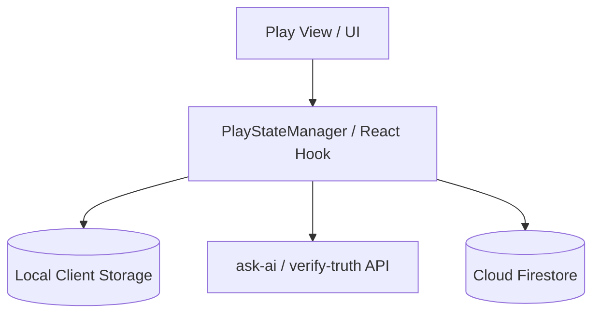

### Technology Stack
- **Frontend**: Next.js v16.2.6 (App Router), React v19.2.4, TypeScript
- **Styling**: Vanilla CSS (CSS Modules)
- **Local Storage**: `localStorage` (クライアントサイドセッション保護用)

---

## File Structure Plan

### Directory Structure
```
src/
├── app/
│   ├── page.tsx                   # ホーム画面 (1.1, 1.2, 1.3, 1.4)
│   ├── page.module.css
│   ├── bookmarks/
│   │   ├── page.tsx               # ブックマーク一覧画面 (7.3, 11.1–11.5)
│   │   └── bookmarks.module.css
│   ├── list/
│   │   └── [id]/
│   │       └── page.tsx           # リスト詳細 (クイズ/問題分岐) (11.7–11.9)
│   ├── leaderboard/
│   │   ├── page.tsx               # 総合リーダーボード画面 (7.1)
│   │   └── leaderboard.module.css
│   ├── tags/
│   │   └── [tagName]/
│   │       └── page.tsx           # タグ別クイズ一覧画面 (7.2)
│   ├── genres/
│   │   └── [genreName]/
│   │       └── page.tsx           # ジャンル別クイズ一覧画面 (7.2)
│   └── quiz/
│       ├── review/
│       │   ├── page.tsx           # 弱点克服プレイ画面 (6.1, 6.2, 6.3)
│       │   └── review.module.css
│       └── [id]/
│           ├── page.tsx           # クイズ詳細画面 (2.1–2.6); LBは子コンポーネントへ委譲 (9.x)
│           ├── page.module.css    # LB用スタイルは quiz-dual-leaderboard.module.css へ移管
│           ├── edit/
│           │   └── page.tsx       # クイズ編集画面ルーティング (8.1, 8.2)
│           ├── play/
│           │   ├── page.tsx       # クイズプレイ画面 (3.x, 4.x, 11.6, 11.10–11.12)
│           │   └── play.module.css
│           └── result/
│               ├── page.tsx       # クイズ結果画面 (5.x, 11.6, 11.11–11.13)
│               └── result.module.css
components/
├── bookmark/
│   ├── bookmarks-tabs.tsx         # クイズ/リスト/問題タブ (11.1)
│   ├── bookmark-quiz-grid.tsx     # 既存グリッドの抽出 (11.2)
│   ├── bookmark-list-grid.tsx     # リストカード (11.3)
│   ├── bookmark-question-list.tsx # 問題カード一覧 (11.4, 11.5)
│   └── question-bookmark-toggle.tsx # 問題BMトグル (11.6)
components/
├── quiz/
│   ├── quiz-card.tsx              # サムネイル・スター評価・プレイボタン付きクイズカード (1.5) 【Phase 9 新規】
│   ├── quiz-card.module.css
│   ├── quiz-editor.tsx            # クイズエディタコンポーネント (8.1, 8.2 認可ガード)
│   ├── quiz-dual-leaderboard.tsx  # 初回／リプレイLB表示 (9.1–9.8) 【Phase 5 新規】
│   └── quiz-dual-leaderboard.module.css
├── ui/
│   ├── skeleton-card.tsx          # 検索読み込み中のスケルトンプレースホルダー (1.4) 【Phase 9 新規】
│   └── skeleton-card.module.css
└── hooks/
    ├── usePlayState.ts            # 通常プレイのセッション管理フック (3.4)
    └── useAiPlayState.ts          # ウミガメチャットのステート管理フック (4.3, 4.4)
e2e/
└── leaderboard.spec.ts            # クイズ詳細LB: 旧「最速」→リプレイへ更新 (9.x)
components/
└── explore/
    ├── genre-nav.tsx              # アイコン一覧 → /genres/[id] 遷移のみ (10.x)
    ├── genre-search-field.tsx     # サジェスト付きジャンル選択（複合検索パネル用）
    └── genre-nav.module.css
hooks/
├── useActiveGenres.ts             # listActiveGenres キャッシュ (10.x)
├── useActiveTags.ts               # listActiveTags キャッシュ (12.x) 【Phase 10 新規】
├── useHomeQuizFeed.ts             # タブ取得 vs searchQuizzes（フィルタ変更・デバウンス）
└── usePlayedQuizIds.ts            # 認証ユーザーのプレイ済み quizId 集合（1.3 playStatus）
lib/
├── question-list-session.ts       # 問題リスト連続プレイ sessionStorage (11.8–11.13)
├── filter-tag-suggestions.ts      # タグサジェスト (12.x) 【Phase 10 新規】
├── filter-search-suggestions.ts   # 統合検索サジェスト (12.x) 【Phase 10 新規】
└── quiz-format-labels.ts          # 出題形式ラベル共有 (12.18) 【Phase 10 新規】
components/
└── explore/
    ├── unified-search-field.tsx   # タグチップ＋サジェスト統合検索 (12.x) 【Phase 10 新規】
    └── unified-search-field.module.css
hooks/
└── useBookmarkFeed.ts               # getBookmarkFeed ラッパー + 楽観更新 (11.1–11.5)
```

### Modified Files（Phase 8）
- `src/app/bookmarks/page.tsx` — `getBookmarkedQuizzes` を `getBookmarkFeed` + `BookmarksTabs` に置換。3タブ空状態・解除トグル。
- `src/app/list/[id]/page.tsx` — `resolveListType` で分岐。問題リストは `getQuestionsInList` 表示 + 連続プレイ開始（`question-list` セッション初期化）。
- `src/app/quiz/[id]/play/page.tsx` — `mode=question-list` / `questionId` / `qIndex` クエリ対応。単一問題プレイ、`saveAttempt` の `mode: 'question-list'`、`totalQuestions: 1`。問題行に `QuestionBookmarkToggle`。
- `src/app/quiz/[id]/result/page.tsx` — 問題リスト次問題判定（`question-list-session`）。`QuestionBookmarkToggle`。ブックマークからの `startAtQuestionId` 再プレイ導線。
- `src/lib/question-list-session.ts`（新規）— `read` / `write` / `advance` / `clear` 純関数。
- `src/hooks/useBookmarkFeed.ts`（新規）— フィード取得とタブ別楽観更新。
- `src/components/bookmark/*`（新規）— タブ・カード・トグル UI。

### Modified Files（Phase 9）
- `src/app/page.tsx` — 巨大バナーの廃止・縮小。検索バーの最上部移動。`GenreNav` を1行横スクロールピル形状に修正、および「すべて見る」トグル追加。クイズ一覧を `QuizCard` と `SkeletonCard` に置き換え。クイックサーチチップの追加、フォーカス時・ホバー時のネオン調スタイルの統合。
- `src/app/page.module.css` — 検索バー上部レイアウト、ピルスクロールスタイル、クイックサーチチップ、バナー縮小スタイル。
- `src/components/explore/genre-nav.tsx` — 1行横スクロール対応、「すべて見る」展開表示。

### New Files（Phase 10）
- `src/components/explore/unified-search-field.tsx` — タグチップ＋自由入力＋タグ／ジャンルサジェスト（要件 12.1–12.11, 12.21–12.22）
- `src/components/explore/unified-search-field.module.css` — チップ行・サジェストドロップダウン・ネオン枠のスタイル
- `src/hooks/useActiveTags.ts` — `listActiveTags` のマウント時取得とエラー状態（`useActiveGenres` 対称）
- `src/lib/filter-tag-suggestions.ts` — タグマスタの部分一致フィルタ（`id` マッチ正本、表示は `tagName ?? id`。`filter-genre-suggestions` 対称）
- `src/lib/filter-search-suggestions.ts` — 統合検索用のタグ＋ジャンル候補マージとランキング
- `src/lib/quiz-format-labels.ts` — `getFormatLabel` の共有エクスポート（エディタ・カード共通）
- `tests/components/unified-search-field.test.tsx` — チップ確定・サジェスト選択・クリア・testid
- `tests/lib/filter-tag-suggestions.test.ts` — タグ候補フィルタの単体テスト
- `tests/lib/filter-search-suggestions.test.ts` — タグ／ジャンル混在サジェストの単体テスト

### Modified Files（Phase 10）
- `src/app/page.tsx` — プレーン `<input>` を `UnifiedSearchField` に置換。`tagChips` 状態、`useActiveTags`、クイックチップ→タグチップ追加、ジャンル ID と `GenreSearchField` の双方向同期、クリア時のチップリセット。
- `src/lib/home-feed-filters.ts` — `tagChips: string[]` 追加、`hasActiveHomeSearchFilters` にチップ有無を含める。
- `src/hooks/useHomeQuizFeed.ts` — `searchQuizzes(keyword, { tags, genreId, ... })` へチップ配列を渡す。依存配列に `tagChips` を追加。
- `src/components/quiz/quiz-card.tsx` / `quiz-card.module.css` — 難易度を `★ N` 表示へ変更（プログレスバー削除）、ジャンル・出題形式行追加、`data-testid` 付与。任意 prop `genreDisplayName`。
- `src/components/quiz/quiz-editor.tsx` — ローカル `getFormatLabel` を `quiz-format-labels` へ委譲（重複排除）。
- `src/app/genres/[genreName]/page.tsx` — インライン `Link` カードを `QuizCard` グリッドに置換。各カードに `href={/quiz/${id}}` を渡しカード全体を詳細へ遷移。`useActiveGenres` で `genreDisplayName` 解決、ローディング時 `SkeletonCard`。
- `src/app/tags/[tagName]/page.tsx` — 同上（`href` + `genreDisplayName` パターンでホームと統一）。
- `tests/components/quiz-card.test.tsx` — `★ N`、ジャンル、出題形式、testid の検証追加。
- `tests/components/home-page.test.tsx` — タグチップ・サジェスト・クイックチップ連携の更新。
- `e2e/quiz-search.spec.ts` — Phase 10 検索チップ・カードメタの E2E 追加。

### New Files（Phase 11）
- `src/lib/explore-formats.ts` — カルーセル用出題形式定数（7 種、`QuizFormat` + `getFormatLabel` ラベル、アイコン情報含む `ExploreFormatOption` 定義）。（13.9）
- `src/lib/explore-filter-active.ts` — `hasActiveExploreFilters` / `hasActiveScopedExploreFilters`（ホーム vs ジャンルページ scoped 判定）（13.15–13.17, 13.22）
- `src/components/explore/explore-accordion.tsx` — 単一アコーディオン見出し＋パネル（`aria-expanded`）（13.1–13.3）
- `src/components/explore/explore-accordions-panel.tsx` — ジャンル／形式の2アコーディオン＋カルーセル配置（13.1, 13.4, 13.9）
- `src/components/explore/genre-carousel.tsx` — ジャンル横スクロールカード、`selectedGenreId`、トグル選択（13.4–13.8, 13.26）
- `src/components/explore/format-carousel.tsx` — 出題形式横スクロールカード、`selectedFormat`、トグル選択（13.9–13.12, 13.26）
- `src/components/explore/explore-search-section.tsx` — `UnifiedSearchField` + フィルタパネル（`lockedGenreId` 時ジャンルセレクト非表示）（13.15, 13.19–13.21, 13.27）
- `src/components/explore/explore-carousel.module.css` — カルーセル scroll-snap・選択ハイライト共通スタイル
- `src/hooks/useExploreQuizFeed.ts` — ホーム／scoped の取得分岐、`searchQuizzes` に `format` 渡し（13.16, 13.21）
- `tests/components/genre-carousel.test.tsx` — 選択・再選択トグル・testid
- `tests/components/format-carousel.test.tsx` — 形式選択・ラベル表示・testid
- `tests/components/explore-search-section.test.tsx` — `lockedGenreId` 時ジャンル非表示
- `tests/lib/explore-filter-active.test.ts` — scoped active 判定（固定ジャンルのみでは false）
- `tests/hooks/useExploreQuizFeed.test.ts` — ホーム／scoped 分岐モック

### Modified Files（Phase 11）
- `src/lib/home-feed-filters.ts` — `format?: QuizFormat | ''` 追加。`hasActiveExploreFilters` を export（`hasActiveHomeSearchFilters` は format 非考慮のエイリアスまたは統合）。
- `src/hooks/useHomeQuizFeed.ts` — `format` を `searchQuizzes` に渡す。後方互換のため `useExploreQuizFeed` へロジック移譲し re-export 可。
- `src/app/page.tsx` — `GenreNav` 削除。`ExploreAccordionsPanel` + `ExploreSearchSection` 配置。`filterFormat` 状態、カルーセル↔検索バー同期、クリア時に形式選択も解除（13.13–13.18）。
- `src/app/page.module.css` — アコーディオン・カルーセル余白スタイル。
- `src/app/genres/[genreName]/page.tsx` — `ExploreSearchSection`（`lockedGenreId={genreId}`）追加。scoped 検索時 `useExploreQuizFeed`、未指定時 `getQuizzesByGenre` 維持（13.19–13.23）。
- `src/components/explore/genre-nav.tsx` — `@deprecated Phase 11: ホームから除去。参照用にファイル残置` コメント追加。
- `src/components/explore/format-carousel.tsx` — 出題形式横スクロールカードにアイコン（絵文字）を追加表示。（13.9）
- `src/app/quiz/[id]/page.tsx` — ジャンル表示をIDから日本語名＋ミニアイコンに変更、難易度を10段階の星（★/☆）ゲージに変更、出題形式バッジ（アイコン＋ラベル）を表示。（2.1）
- `src/app/quiz/[id]/page.module.css` — クイズ詳細画面のジャンルミニアイコンおよびインライン配置用スタイルを追加。（2.1）
- `src/lib/quiz-format-labels.ts` — 各形式に対応する絵文字アイコンを返却する `getFormatIcon` を追加。
- `tests/components/home-page.test.tsx` — `GenreNav` 非表示、カルーセルフィルタ、クリア連動。
- `e2e/quiz-search.spec.ts` — ジャンルカルーセルが `/genres` に遷移しないこと、形式カルーセル絞り込み。

### New Files（Phase 12）
- [difficulty-color.ts](file:///d:/quizeum/src/lib/difficulty-color.ts) — 難易度(1〜5)に応じた HSL カラーを算出する共通ヘルパー。 (2.1b-1)
- [report-modal.tsx](file:///d:/quizeum/src/components/quiz/report-modal.tsx) / [report-modal.module.css](file:///d:/quizeum/src/components/quiz/report-modal.module.css) — 通報理由を入力・送信でき、`quizeum-core` の `flagContent`（または同等 API）を呼び出す通報モーダル。 (5.11a)

### Modified Files（Phase 12）
- [play/page.tsx](file:///d:/quizeum/src/app/quiz/[id]/play/page.tsx) — 全問終了時の自動結果画面遷移。連想クイズ解答完了時に表示したヒント一覧を `localStorage`（例：`quizeum_attempt_hints_{attemptId}`）へ保存。 (3.6, 5.6)
- [page.tsx](file:///d:/quizeum/src/app/quiz/[id]/page.tsx) — クイズ詳細の難易度（★）の等幅ゲージグラデーションカラー適用。 (2.1b-1)
- [result/page.tsx](file:///d:/quizeum/src/app/quiz/[id]/result/page.tsx) / [result.module.css](file:///d:/quizeum/src/app/quiz/[id]/result/result.module.css) — 難易度表示・難易度投票のグラデーションカラー適用、連想クイズのヒント一覧・ウミガメスープ質問回数表示、もう一度プレイするボタン、作者へのリンクと他のクイズおすすめ表示、結果サマリーカード上のクイズブックマークトグル、全体指摘時の「別解の追加」カテゴリ非表示、通報ボタン表示と通報モーダル連携。 (5.2a, 5.3a, 5.6, 5.7, 5.7a, 5.8, 5.9, 5.10, 5.11)

### Modified Files（Phase 6）
- `src/app/page.tsx` — `GENRES` 定数削除、`GenreNav`（遷移専用）+ `GenreSearchField` + `useHomeQuizFeed` + `usePlayedQuizIds`。
- `src/app/api/user/played-quiz-ids/route.ts`（新規）— 本人の完了済み `quizId` 一覧（プレイ状況フィルタ用、読み取りのみ）。
- `src/services/attempt.ts` — `listUserPlayedQuizIds(uid)`（既存 `attempts` 読み取り、UI 支援用）。
- `src/app/genres/[genreName]/page.tsx` — マスタメタ表示、ソートタブ、`getQuizzesByGenre(..., sort)`。
- `src/app/tags/[tagName]/page.tsx` — `getQuizzesByTag` + ソートタブ（任意でホームと同型）。
- `src/app/quiz/review/page.tsx` — `REVIEW_GENRES` を `listActiveGenres` に置換。

### Modified Files（Phase 5）
- `src/app/quiz/[id]/page.tsx` — インラインLB表を `QuizDualLeaderboard` に置換。`sortLb` 等のクライアント並び替えを削除。
- `src/app/quiz/[id]/page.module.css` — LB専用スタイルをコンポーネント用CSSへ移管（または共有クラスを残す最小差分）。
- `e2e/leaderboard.spec.ts` — `fastest-leaderboard` / `highscore-entry` を Phase 5 の `data-testid` に合わせて更新。

---

## System Flows

### ウミガメスープ AI回答生成中インタラクションフロー
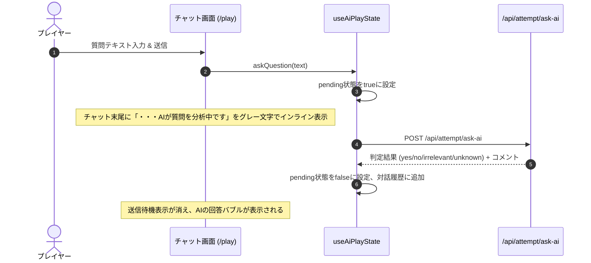

### クイズ詳細リーダーボード表示フロー（Phase 5・読み取りのみ）
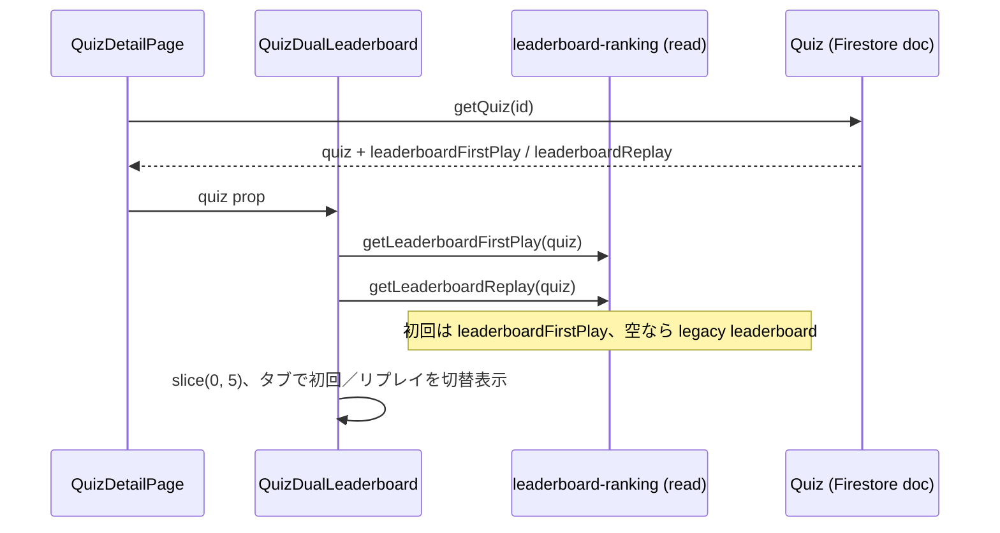

### ホーム・ジャンル探索フロー（Phase 6）

**UX 方針（確定）**
- **ジャンルアイコン**: クリックは常に `/genres/[genreId]` へ遷移。ホーム上のインライン絞り込みには使わない。
- **ジャンル（複合検索）**: `GenreSearchField` でマスタをサジェスト検索し、選択した `genreId` をフィルタに載せる（件数増加時も操作可能）。
- **`searchQuizzes`**: フィルタ（ジャンル ID・難易度・問題数・キーワード）変更時にデバウンス（例: 300ms）後に再取得。全フィルタ未指定時はタブ別 API。
- **プレイ状況（要件 1.3）**: 認証時は `usePlayedQuizIds` で取得した `Set<quizId>` を、タブ取得／`searchQuizzes` 結果の**後段**で適用。未認証は `all` 固定または select 無効＋案内。

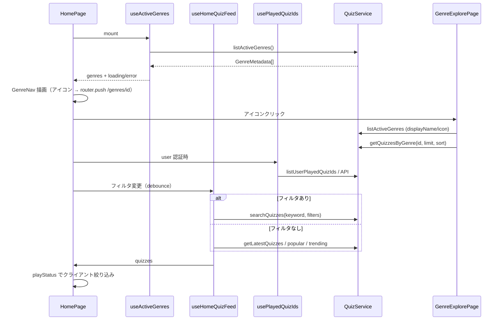

### 問題リスト連続プレイフロー（Phase 8）

**UX 方針（確定）**
- 問題リストは**収録問題ごとに1 attempt**（`mode: 'question-list'`, `totalQuestions: 1`）。コア契約に準拠。
- 連続プレイの進行状態は `sessionStorage` キー `quizeum_question_list_session` に保持（タブ閉鎖まで有効。`localStorage` の通常プレイ復元とは別キー）。
- プレイ URL: `/quiz/{parentQuizId}/play?listId={listId}&mode=question-list&questionId={qId}&qIndex={n}`。
- 結果 URL: 既存 `listId` クエリを維持し、結果画面がセッションから次エントリを解決して「次の問題へ」を表示。

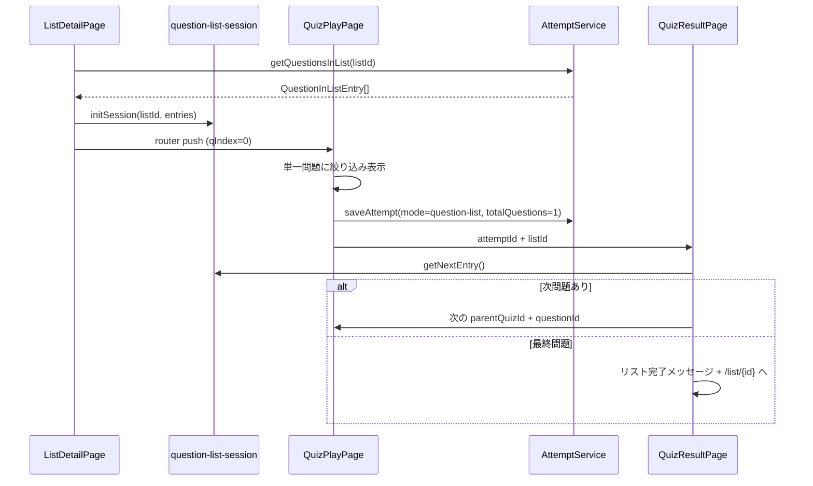

### ホーム統合検索・タグチップフロー（Phase 10）

**UX 方針（確定）**
- **チップ確定**: スペースで直前トークンを `normalizeTag` 後にチップ追加。空トークン・重複は拒否。
- **Enter 優先順位（確定）**: サジェストが open かつ候補が 1 件以上 → Enter はハイライト候補を選択（`GenreSearchField` 同型）。それ以外 → Enter はスペースと同一規則でタグチップ確定。
- **サジェスト**: 自由入力 1 文字以上でタグ候補（`listActiveTags`：core 要件 16 の存続タグのみ）とジャンル候補（`useActiveGenres`）をセクション分けまたはラベル付きで表示。タグ候補の**照合キーは `id`**、**表示ラベルは `tagName ?? id`**（`filter-tag-suggestions`）。
- **ジャンル選択**: サジェストからジャンル選択時は `filters.genreId` を更新し、フィルタパネル内 `GenreSearchField` と同期。
- **検索合成**: `searchQuizzes(keyword, { tags: tagChips, genreId, ... })` でキーワード・タグ AND・ジャンル・数値フィルタを AND 適用。全未指定時はタブ別 API。
- **難易度表示**: カード上は `★ {difficulty}`（1〜5 整数）。プログレスバーは使用しない。

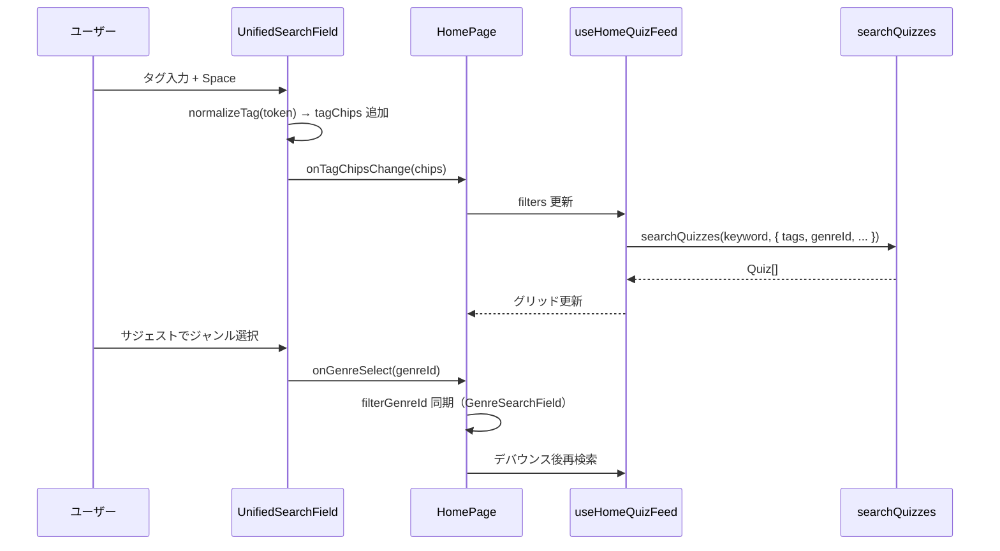

### ホーム探索アコーディオン・カルーセルフロー（Phase 11）

**UX 方針（確定）**
- **レイアウト**: 統合検索バー直下に `ExploreAccordionsPanel`（ジャンル／形式）。`GenreNav` はホームから**描画しない**（要件 13.13）。
- **ジャンルカード**: クリックで `filterGenreId` を設定／再クリックで解除。**`router.push('/genres/...')` 禁止**（要件 13.14）。`UnifiedSearchField` のジャンルサジェスト・`GenreCarousel`・フィルタパネルで `filterGenreId` を共有。
- **形式カード**: クリックで `filterFormat` を設定／再クリックで解除。7 形式は `explore-formats.ts` 定数（`getFormatLabel` と一致）。
- **検索合成**: Phase 10 に加え `searchQuizzes(..., { format: filterFormat })`（コア Phase 11）。全未指定時はタブ別 API。
- **一括クリア**: 検索バー消去でキーワード・タグ・ジャンル・**形式**・カルーセル選択状態を解除（要件 13.18）。
- **カルーセル UX**: CSS `overflow-x: auto` + `scroll-snap-type: x mandatory`。外部 carousel ライブラリ・自動スライドは Non-Goal。

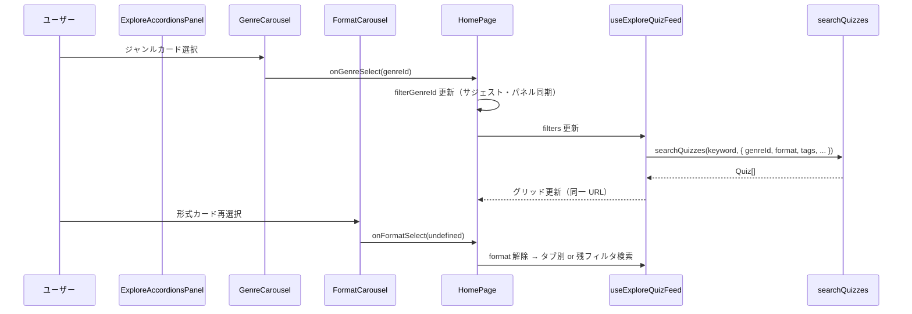

### ジャンルページ scoped 検索フロー（Phase 11）

**分岐規則（確定）**
- **固定ジャンル**: URL `genreName` を `lockedGenreId` として常に `searchQuizzes` の `genreId` に渡す（要件 13.20–13.21）。
- **active 判定**: `hasActiveScopedExploreFilters(filters, lockedGenreId)` — キーワード・タグ・形式・数値フィルタ・プレイ状況のいずれかが指定されたときのみ scoped 検索。固定ジャンルのみでは **false**（要件 13.22）。
- **取得**: active=false → `getQuizzesByGenre(lockedGenreId, limit, activeSort)`。active=true → `searchQuizzes` → **`sortQuizzesForList` でクライアント再ソート**（コア `searchQuizzes` に sort 引数なしのため）。
- **UI**: `ExploreSearchSection` でジャンルセレクト非表示。プレイ状況フィルタはホーム同型で提供（要件 13.19 の「同型」解釈）。

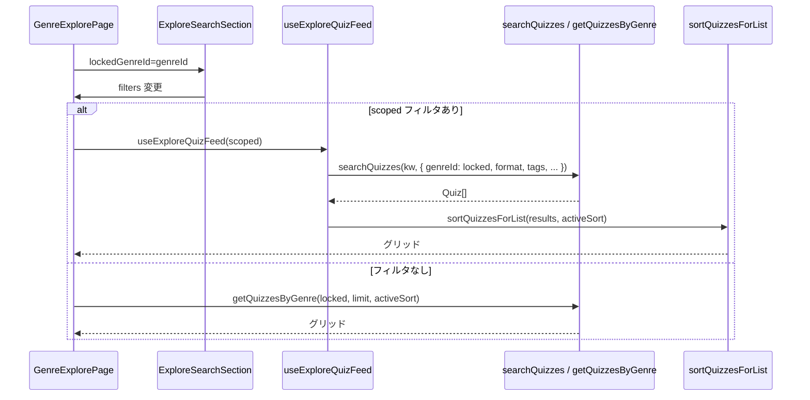

### ブックマーク3タブ読み込みフロー（Phase 8）

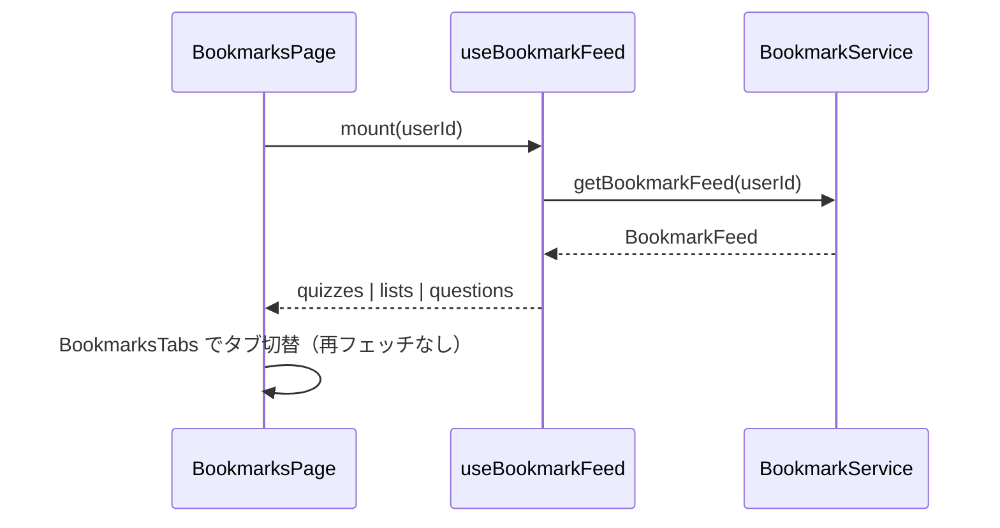

### 連想クイズヒント履歴永続化バイパスフロー（Phase 12）
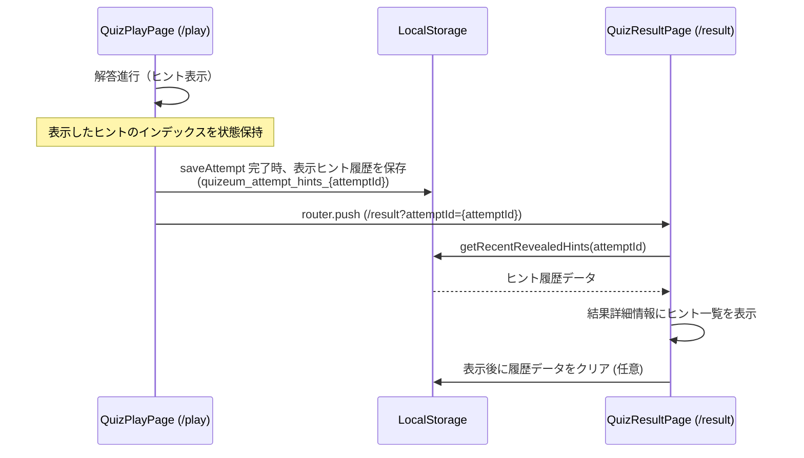

### コンテンツ通報フロー（Phase 12）
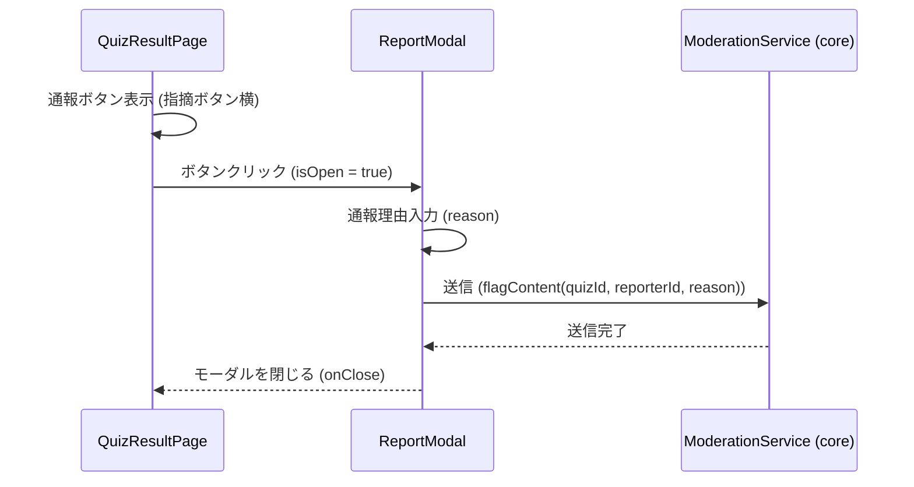

---

## Requirements Traceability

| Requirement  | Summary                                                                                         | Components                                                                          | Interfaces                                       | Flows                                      |
| ------------ | ----------------------------------------------------------------------------------------------- | ----------------------------------------------------------------------------------- | ------------------------------------------------ | ------------------------------------------ |
| 1.1          | ファーストビューの最適化 (バナー縮小・検索バー最上部配置)                                       | `/` Page                                                                            | CSS / DOM layout                                 | -                                          |
| 1.2          | カテゴリー表示（Phase 11 で `GenreNav` 非表示。ジャンル探索はアコーディオン・カルーセルが正本） | `ExploreAccordionsPanel`, `GenreCarousel`                                           | `listActiveGenres`                               | ホーム探索アコーディオン・カルーセルフロー |
| 1.3          | コンテンツ優先レイアウト (グリッド表示・タブ視認性)                                             | `/` Page                                                                            | CSS grid layout                                  | -                                          |
| 1.4          | 統合検索機能および UI/UX (検索クリア・ネオン・クイックサーチ・スケルトン)                       | `/` Page, `GenreSearchField`, `SkeletonCard`                                        | `searchQuizzes`, `useHomeQuizFeed`               | ホーム・ジャンル探索フロー                 |
| 1.5          | クイズカード魅力向上 (サムネイル・プレイボタン・情報整理)                                       | `QuizCard`                                                                          | `Quiz` data representation                       | -                                          |
| 2.1          | クイズ詳細メタ情報表示                                                                          | `/quiz/[id]` Page                                                                   | `QuizService`                                    | -                                          |
| 2.2          | 良問評価バッジとマスク制御                                                                      | `/quiz/[id]` Page                                                                   | `ReviewService`                                  | -                                          |
| 2.3          | 3つのプレイモード選択UI                                                                         | `/quiz/[id]` Page                                                                   | Mode Panel                                       | -                                          |
| 2.4          | プレイ画面へのリダイレクト遷移                                                                  | `/quiz/[id]` Page                                                                   | `useRouter`                                      | -                                          |
| 2.5          | 作成者本人用「クイズ編集」ボタンの表示                                                          | `/quiz/[id]` Page                                                                   | `useAuth`                                        | -                                          |
| 2.6          | 編集ボタンクリック時のクイズ編集画面遷移                                                        | `/quiz/[id]` Page                                                                   | `useRouter`                                      | -                                          |
| 3.1          | 個別/全体カウントダウンタイマー                                                                 | `/quiz/[id]/play` Page                                                              | Timer Hook                                       | -                                          |
| 3.2          | ヒント表示ポップアップ                                                                          | `/quiz/[id]/play` Page                                                              | Dialog UI                                        | -                                          |
| 3.3          | `localStorage` セッション保護と復元                                                             | `/quiz/[id]/play` Page                                                              | `usePlayState`                                   | -                                          |
| 3.4          | オフライン時のローカル解答進行                                                                  | `/quiz/[id]/play` Page                                                              | `AttemptService`                                 | -                                          |
| 4.1          | ウミガメスープ2カラムレイアウト                                                                 | `/quiz/[id]/play` Page                                                              | AI Component                                     | -                                          |
| 4.2          | 未ログイン時のウミガメスープ制限リダイレクト                                                    | `/quiz/[id]/play` Page                                                              | Auth Guard                                       | -                                          |
| 4.3          | AI回答生成中待機「・・・AIが質問を分析中です」表示                                              | `/quiz/[id]/play` Page                                                              | `useAiPlayState`                                 | インタラクションフロー                     |
| 4.4          | 同一質問キャッシュバッジ表示                                                                    | `/quiz/[id]/play` Page                                                              | AI Component                                     | -                                          |
| 4.5          | 無料ユーザーのターン制限表示と無効化                                                            | `/quiz/[id]/play` Page                                                              | AI Component                                     | -                                          |
| 4.6          | 真相回答と自動真相判定・クリア演出                                                              | `/quiz/[id]/play` Page                                                              | `verify-truth`                                   | -                                          |
| 5.1          | プレイ結果表示と解説マークダウン                                                                | `/quiz/[id]/result` Page                                                            | Result Component                                 | -                                          |
| 5.2          | 👍/👎良問評価および難易度投票                                                                     | `/quiz/[id]/result` Page                                                            | `ReviewService`                                  | -                                          |
| 5.3          | 問題の間違い指摘フォーム                                                                        | `/quiz/[id]/result` Page                                                            | Feedback Dialog                                  | -                                          |
| 5.4          | 作家フォローボタン表示およびトグル制御                                                          | `/quiz/[id]/result` Page                                                            | `UserService`                                    | -                                          |
| 5.5          | オフライン結果画面表示と機能制限（フォロー操作含む）                                            | `/quiz/[id]/result` Page                                                            | Offline Handler                                  | -                                          |
| 6.1          | 弱点克服ジャンルフィルタ選択                                                                    | `/quiz/review` Page                                                                 | Genre Selector                                   | -                                          |
| 6.2          | 間違い問題のフェッチと復習プレイ                                                                | `/quiz/review` Page                                                                 | `AttemptService`                                 | -                                          |
| 6.3          | 復習完了時の誤答リストアトミック削除                                                            | `/quiz/review` Page                                                                 | `AttemptService`                                 | -                                          |
| 7.1          | 総合リーダーボード各種ランキング                                                                | `/leaderboard` Page                                                                 | Ranking Tab                                      | -                                          |
| 7.2          | タグ別・ジャンル別クイズ一覧表示                                                                | `/tags/[tagName]`, `/genres/[genreName]`                                            | Quiz Card Grid                                   | -                                          |
| 7.3          | ブックマーク一覧とお気に入り解除                                                                | `/bookmarks` Page                                                                   | `BookmarkService`                                | -                                          |
| 8.1          | 未ログイン時のクイズ編集画面リダイレクト制限                                                    | `QuizEditor` / `QuizEditPage`                                                       | `useAuth`, `useRouter`                           | -                                          |
| 8.2          | 非所有者のクイズ編集画面アクセス制限                                                            | `QuizEditor` / `QuizEditPage`                                                       | `useAuth`, `QuizService`                         | -                                          |
| 9.1          | 初回／リプレイの別表示（タブ）                                                                  | `QuizDualLeaderboard`                                                               | Tab state                                        | クイズLB表示フロー                         |
| 9.2          | 順位・表示名・正解数・時間・達成日                                                              | `QuizDualLeaderboard`                                                               | Table markup                                     | -                                          |
| 9.3          | 表示順（サーバー保存順を信頼）                                                                  | `QuizDualLeaderboard`                                                               | `getLeaderboard*` + slice                        | -                                          |
| 9.4          | 空状態                                                                                          | `QuizDualLeaderboard`                                                               | Empty UI                                         | -                                          |
| 9.5          | 初回: `leaderboardFirstPlay` + legacy fallback                                                  | `QuizDualLeaderboard`                                                               | `getLeaderboardFirstPlay`                        | -                                          |
| 9.6          | リプレイ: `leaderboardReplay` のみ                                                              | `QuizDualLeaderboard`                                                               | `getLeaderboardReplay`                           | -                                          |
| 9.7          | E2E `data-testid`                                                                               | `QuizDualLeaderboard`                                                               | test ids                                         | -                                          |
| 9.8          | 更新・マージなし（表示のみ）                                                                    | `QuizDualLeaderboard`                                                               | —                                                | Out of boundary                            |
| 10.1         | 動的ジャンルナビ（Phase 11: ホームは `GenreCarousel`。`GenreNav` は非正本）                     | `GenreCarousel`, `useActiveGenres`                                                  | `listActiveGenres`                               | ホーム探索アコーディオン・カルーセルフロー |
| 10.2         | ハードコード GENRES 廃止                                                                        | `HomePage`, `GenreCarousel`                                                         | —                                                | —                                          |
| 10.3         | ジャンル探索（Phase 11: ホームカルーセルは遷移せずフィルタ）                                    | `GenreCarousel`                                                                     | —                                                | ホーム探索アコーディオン・カルーセルフロー |
| 10.4         | `searchQuizzes`（フィルタ変更）                                                                 | `useHomeQuizFeed`                                                                   | `searchQuizzes`                                  | —                                          |
| 10.4b        | ジャンルサジェスト                                                                              | `GenreSearchField`                                                                  | `useActiveGenres`                                | —                                          |
| 10.4c        | プレイ状況                                                                                      | `usePlayedQuizIds`                                                                  | `listUserPlayedQuizIds`                          | —                                          |
| 10.5         | ジャンル一覧メタ表示                                                                            | `GenreExplorePage`                                                                  | `listActiveGenres`                               | —                                          |
| 10.6         | ジャンル一覧ソート                                                                              | `GenreExplorePage`                                                                  | `getQuizzesByGenre`                              | —                                          |
| 10.7         | タグ一覧 canonical + sort                                                                       | `TagExplorePage`                                                                    | `getQuizzesByTag`                                | —                                          |
| 10.8         | 弱点克服ジャンル選択                                                                            | `ReviewPage`                                                                        | `listActiveGenres`                               | —                                          |
| 10.9         | 空・エラー状態                                                                                  | `GenreNav`, `HomePage`                                                              | —                                                | —                                          |
| 10.10        | ハードコードへサイレントフォールバック禁止                                                      | 全探索 UI                                                                           | —                                                | Out of boundary                            |
| 11.1         | ブックマーク画面3タブ                                                                           | `BookmarksTabs`, `BookmarksPage`                                                    | `useBookmarkFeed`                                | ブックマーク3タブフロー                    |
| 11.2         | 未認証時 `/login` リダイレクト                                                                  | `BookmarksPage`                                                                     | `useAuth`                                        | —                                          |
| 11.3         | クイズタブ（feed + 解除 + 詳細遷移）                                                            | `BookmarkQuizGrid`                                                                  | `getBookmarkFeed`                                | —                                          |
| 11.4         | リストタブ（解除 + `/list/[id]`）                                                               | `BookmarkListGrid`                                                                  | `BookmarkFeed.lists`                             | —                                          |
| 11.5         | 問題タブ（抜粋・親タイトル・日時降順）                                                          | `BookmarkQuestionList`                                                              | `BookmarkFeed.questions`                         | —                                          |
| 11.6         | 問題カード → 親クイズプレイ開始                                                                 | `BookmarkQuestionList`                                                              | `startAtQuestionId`                              | —                                          |
| 11.7         | プレイ中の問題BMトグル                                                                          | `QuestionBookmarkToggle` on `QuizPlayPage`                                          | `toggleBookmark('question')`                     | —                                          |
| 11.8         | 結果画面の問題行BMトグル                                                                        | `QuestionBookmarkToggle` on `QuizResultPage`                                        | `toggleBookmark('question')`                     | —                                          |
| 11.9         | 未認証の問題BM → `/login`                                                                       | `QuestionBookmarkToggle`                                                            | `useAuth`                                        | —                                          |
| 11.10        | 問題リスト詳細（順序一覧 + 開始ボタン）                                                         | `ListDetailPage`                                                                    | `getQuestionsInList`                             | 問題リスト連続プレイフロー                 |
| 11.11        | 問題リストプレイ開始（セッション保持）                                                          | `ListDetailPage`                                                                    | `question-list-session`                          | 問題リスト連続プレイフロー                 |
| 11.12        | 結果後の次問題遷移／完了                                                                        | `QuizResultPage`                                                                    | `advanceQuestionListSession`                     | 問題リスト連続プレイフロー                 |
| 11.13        | クイズリストは従来のリストプレイ                                                                | `ListDetailPage`                                                                    | `getQuizzesInList`, `mode=list`                  | —                                          |
| 11.14        | BM カウント・attempt 永続化なし                                                                 | 全 Phase 8 UI                                                                       | コアサービス呼び出しのみ                         | Out of boundary                            |
| 12.1–12.6    | タグチップ入力・確定・削除・クリア                                                              | `UnifiedSearchField`, `HomePage`                                                    | `normalizeTag`                                   | ホーム統合検索フロー                       |
| 12.7–12.10   | タグ／ジャンルサジェスト・エラー                                                                | `UnifiedSearchField`, `useActiveTags`, `useActiveGenres`                            | `filter-search-suggestions`                      | ホーム統合検索フロー                       |
| 12.11        | クイックサーチ→タグチップ                                                                       | `HomePage`, `UnifiedSearchField`                                                    | —                                                | —                                          |
| 12.12–12.15  | チップ＋キーワード＋フィルタ AND 検索                                                           | `useHomeQuizFeed`, `home-feed-filters`                                              | `searchQuizzes`                                  | ホーム統合検索フロー                       |
| 12.16–12.18  | カード難易度★N・ジャンル・出題形式                                                              | `QuizCard`, `quiz-format-labels`                                                    | `resolveQuizFormat`, `useActiveGenres`           | —                                          |
| 12.19        | 探索一覧で QuizCard 統一                                                                        | `GenreExplorePage`, `TagExplorePage`                                                | `QuizCard`                                       | —                                          |
| 12.20        | 読み込み中スケルトン                                                                            | `SkeletonCard`                                                                      | —                                                | —                                          |
| 12.21–12.22  | a11y・data-testid                                                                               | `UnifiedSearchField`, `QuizCard`                                                    | —                                                | —                                          |
| 13.1–13.3    | アコーディオン2セクション独立開閉                                                               | `ExploreAccordion`, `ExploreAccordionsPanel`                                        | —                                                | ホーム探索アコーディオン・カルーセルフロー |
| 13.4–13.8    | ジャンルカルーセル・ホーム内フィルタ・同期                                                      | `GenreCarousel`, `HomePage`                                                         | `filterGenreId`                                  | ホーム探索アコーディオン・カルーセルフロー |
| 13.9–13.12   | 形式カルーセル・ホーム内フィルタ                                                                | `FormatCarousel`, `explore-formats`                                                 | `filterFormat`, `searchQuizzes.format`           | ホーム探索アコーディオン・カルーセルフロー |
| 13.13–13.14  | GenreNav 非表示・カルーセル遷移禁止                                                             | `HomePage`                                                                          | —                                                | —                                          |
| 13.15–13.18  | フィルタ状態共有・AND 検索・クリア連動                                                          | `ExploreSearchSection`, `useExploreQuizFeed`, `home-feed-filters`                   | `searchQuizzes`                                  | ホーム統合検索フロー                       |
| 13.19–13.23  | ジャンルページ scoped 検索 UI                                                                   | `GenreExplorePage`, `ExploreSearchSection`                                          | `lockedGenreId`, `hasActiveScopedExploreFilters` | ジャンルページ scoped 検索フロー           |
| 13.24–13.25  | Out of boundary（形式専用ルート・サーバー照合なし）                                             | —                                                                                   | `quizeum-core`                                   | —                                          |
| 13.26–13.27  | testid 契約                                                                                     | `ExploreAccordionsPanel`, `GenreCarousel`, `FormatCarousel`, `ExploreSearchSection` | —                                                | —                                          |
| 2.1b-1       | 難易度に応じた星（★）の等幅ゲージグラデーションカラー表示                                       | `QuizDetailPage`                                                                    | `getDifficultyColor`                             | —                                          |
| 3.6          | 解答完了時の自動結果画面遷移                                                                    | `QuizPlayPage`                                                                      | `handlePlayComplete`                             | —                                          |
| 5.2a         | 結果画面難易度表示・投票星（★）のグラデーションカラー表示                                       | `QuizResultPage`                                                                    | `getDifficultyColor`                             | —                                          |
| 5.3a         | クイズ全体指摘時の「別解の追加」カテゴリ非表示                                                  | `QuizResultPage`, 指摘ダイアログ                                                    | category filter                                  | —                                          |
| 5.6          | 結果画面のヒント一覧表示（連想）および質問回数表示（ウミガメ）                                  | `QuizResultPage`                                                                    | `localStorage` 連携, `attempt.aiTurnCount`       | 連想クイズヒント履歴永続化バイパスフロー   |
| 5.7 / 5.7a   | 結果画面「もう一度プレイする」ボタン (詳細画面遷移)                                             | `QuizResultPage`                                                                    | `useRouter`                                      | —                                          |
| 5.8          | 結果画面作者プロフィールリンク表示                                                              | `QuizResultPage`                                                                    | `Link`                                           | —                                          |
| 5.9          | 同じ作者の他クイズおすすめ表示                                                                  | `QuizResultPage`, `QuizCard`                                                        | `getQuizzesByAuthor`                             | —                                          |
| 5.10         | 結果「お疲れ様でした」カードのクイズブックマークボタン                                          | `QuizResultPage`                                                                    | `toggleBookmark`                                 | —                                          |
| 5.11 / 5.11a | 指摘横の通報ボタン表示と通報モーダル連携                                                        | `QuizResultPage`, `ReportModal`                                                     | `flagContent`                                    | コンテンツ通報フロー                       |

---

## Components and Interfaces

### Component Summary Table

| Component                | Domain/Layer   | Intent                                                                    | Req Coverage                                     | Key Dependencies                                                                                                        | Contracts  |
| ------------------------ | -------------- | ------------------------------------------------------------------------- | ------------------------------------------------ | ----------------------------------------------------------------------------------------------------------------------- | ---------- |
| `HomePage`               | UI / Page      | クイズ探索・複合検索・タブ切替                                            | 1.1–1.5, 10.2–10.4, 12.1–12.15, 13.1–13.18       | `ExploreSearchSection`, `ExploreAccordionsPanel`, `useExploreQuizFeed`, `useActiveTags`, `usePlayedQuizIds`, `QuizCard` | State      |
| `ExploreAccordionsPanel` | UI / Component | ジャンル／形式アコーディオン＋カルーセル                                  | 13.1–13.12, 13.26                                | `GenreCarousel`, `FormatCarousel`, `useActiveGenres`                                                                    | State      |
| `GenreCarousel`          | UI / Component | ジャンル横スクロールカード・ホーム内フィルタ                              | 13.4–13.8, 13.26                                 | `listActiveGenres`                                                                                                      | State      |
| `FormatCarousel`         | UI / Component | 出題形式横スクロールカード                                                | 13.9–13.12, 13.26                                | `explore-formats`, `getFormatLabel`                                                                                     | State      |
| `ExploreSearchSection`   | UI / Component | 統合検索＋フィルタパネル（ホーム／ジャンル共通）                          | 13.15–13.21, 13.27                               | `UnifiedSearchField`, `GenreSearchField`                                                                                | State      |
| `GenreExplorePage`       | UI / Page      | ジャンル固定 scoped 探索                                                  | 7.2, 10.5–10.6, 13.19–13.23                      | `ExploreSearchSection`, `useExploreQuizFeed`, `ExploreSortTabs`                                                         | State      |
| `useExploreQuizFeed`     | Hook           | タブ／scoped／searchQuizzes 分岐（format 含む）                           | 1.3, 10.4, 12.12–12.15, 13.16, 13.21–13.22       | `searchQuizzes`, tab APIs, `sortQuizzesForList`                                                                         | State      |
| `UnifiedSearchField`     | UI / Component | タグチップ＋キーワード＋タグ／ジャンルサジェスト                          | 12.1–12.11, 12.21–12.22, 13.8                    | `useActiveTags`, `useActiveGenres`, `filter-search-suggestions`                                                         | State      |
| `GenreSearchField`       | UI / Component | マスタ駆動ジャンルサジェスト（フィルタパネル用、検索バーと genreId 同期） | 1.4, 10.4, 12.9                                  | `useActiveGenres`                                                                                                       | State      |
| `QuizCard`               | UI / Component | サムネイル・★N 難易度・ジャンル・出題形式・プレイ導線                     | 1.5, 7.2, 12.16–12.19, 12.22                     | `quiz-format-labels`, `toggleBookmark`                                                                                  | State      |
| `useActiveTags`          | Hook           | `listActiveTags` 取得とエラー                                             | 12.7, 12.10                                      | `listActiveTags` (P0)                                                                                                   | State      |
| `SkeletonCard`           | UI / Component | 検索ロード中の骨組みアニメーション                                        | 1.4                                              | —                                                                                                                       | State      |
| `useHomeQuizFeed`        | Hook           | タブ取得 / `searchQuizzes` 切替・デバウンス（tags AND 含む）              | 1.3, 10.4, 12.12–12.15                           | `searchQuizzes`, tab APIs                                                                                               | State      |
| `usePlayedQuizIds`       | Hook           | プレイ済み quizId 集合                                                    | 1.3                                              | `/api/user/played-quiz-ids`                                                                                             | State      |
| `QuizDetailPage`         | UI / Page      | クイズのメタデータおよび良問評価、プレイモード選択、作成者編集動線        | 2.1–2.6                                          | `QuizService`, `ReviewService`, `useAuth`                                                                               | State      |
| `QuizDualLeaderboard`    | UI / Component | 初回／リプレイLBのタブ表示（読み取り専用）                                | 9.1–9.8                                          | `getLeaderboardFirstPlay`, `getLeaderboardReplay` (P0)                                                                  | State      |
| `QuizPlayPage`           | UI / Page      | クイズ解答画面（通常タイマー、ヒント、ウミガメスープチャット）            | 3.1, 3.2, 3.3, 3.4, 4.1, 4.2, 4.3, 4.4, 4.5, 4.6 | `usePlayState`, `useAiPlayState`                                                                                        | State, API |
| `QuizEditor`             | UI / Component | クイズ編集の認可ガード処理およびエディタUIの保護                          | 8.1, 8.2                                         | `useAuth`, `QuizService`, `useRouter`                                                                                   | State      |
| `QuizResultPage`         | UI / Page      | 正誤解説、評価・難易度投票、指摘フォーム、作成者フォローボタン            | 5.1, 5.2, 5.3, 5.4, 5.5                          | `ReviewService`, `UserService`                                                                                          | State, API |
| `ReviewPage`             | UI / Page      | 間違えた問題の復習プレイとフィルタ制御                                    | 6.1, 6.2, 6.3                                    | `AttemptService`                                                                                                        | State      |
| `LeaderboardPage`        | UI / Page      | プラットフォームランキングの可視化                                        | 7.1                                              | `QuizService`                                                                                                           | State      |
| `BookmarksPage`          | UI / Page      | 3分類ブックマークの表示と解除                                             | 7.3, 11.1–11.6                                   | `useBookmarkFeed`, `BookmarkService`                                                                                    | State      |
| `BookmarksTabs`          | UI / Component | クイズ／リスト／問題タブ切替                                              | 11.1                                             | `useBookmarkFeed`                                                                                                       | State      |
| `BookmarkQuizGrid`       | UI / Component | クイズカードグリッド（既存UI再利用）                                      | 11.3                                             | `toggleBookmark`                                                                                                        | State      |
| `BookmarkListGrid`       | UI / Component | リストカード + `/list/[id]` リンク                                        | 11.4                                             | `toggleBookmark`                                                                                                        | State      |
| `BookmarkQuestionList`   | UI / Component | 問題カード（親タイトル・日時・プレイ導線）                                | 11.5, 11.6                                       | `toggleBookmark`                                                                                                        | State      |
| `QuestionBookmarkToggle` | UI / Component | 問題行のBMオン／オフ                                                      | 11.7, 11.8, 11.9                                 | `toggleBookmark`, `useAuth`                                                                                             | State      |
| `ListDetailPage`         | UI / Page      | クイズリスト／問題リスト詳細とプレイ開始                                  | 11.10–11.13                                      | `resolveListType`, `getQuestionsInList`                                                                                 | State      |
| `question-list-session`  | Lib            | 問題リスト連続プレイの sessionStorage                                     | 11.11, 11.12                                     | —                                                                                                                       | Service    |
| `useBookmarkFeed`        | Hook           | `getBookmarkFeed` 取得と楽観更新                                          | 11.1–11.6                                        | `BookmarkService`                                                                                                       | State      |

#### `QuizCard`（Phase 9 + Phase 10）

| Field        | Detail                                                                                    |
| ------------ | ----------------------------------------------------------------------------------------- |
| Intent       | 探索一覧共通のクイズカード（サムネイル・★N 難易度・ジャンル・出題形式・評価・プレイ導線） |
| Requirements | 1.5, 7.2, 12.16–12.19, 12.22                                                              |

**Responsibilities & Constraints**
- クイズ固有の `thumbnailUrl` がある場合はアスペクト比を保って表示、ない場合はジャンルに基づくグラデーションプレースホルダーを表示。
- タイトル、作成者名、**難易度（`★ {difficulty}`、1〜5 整数。プログレスバー禁止）**、**ジャンル表示名**、**出題形式ラベル**（形式絵文字アイコンと日本語ラベルの併記、`getFormatIcon(resolveQuizFormat(quiz))` + `getFormatLabel(resolveQuizFormat(quiz))`）、評価（`reviewScore`）、「プレイする」ボタンを整理して表示。
- `genreDisplayName` prop が渡された場合はそれを優先。未指定時は `quiz.genre` をフォールバック表示。
- ホバー時のネオン発光トランジション（Phase 9）を維持。
- **ナビゲーション（確定）**: 任意 prop `href` が渡されたとき、カードルートを Next.js `Link` でラップしカード全体クリックでクイズ詳細へ遷移する。`href` 未指定時（ホーム）は従来どおり `div` + `onPlayClick`。いずれも「挑戦する」ボタンに `data-testid="play-btn"` を付与。
- ブックマーク操作は `stopPropagation`（`href` あり時は `preventDefault` も）+ `toggleBookmark`。未認証時は `/login`。
- ジャンル／タグ探索ページでは親が `useActiveGenres` で解決した `genreDisplayName` と `href={`/quiz/${quiz.id}`}` を渡す。

**Dependencies**
- Inbound: `HomePage`, `GenreExplorePage`, `TagExplorePage`, `BookmarkQuizGrid` — `quiz` prop
- Outbound: `@/lib/quiz-format-labels` — `getFormatLabel`; `@/lib/quiz-format` — `resolveQuizFormat`

**Contracts**: State [x]

##### Props
```typescript
interface QuizCardProps {
  quiz: Quiz;
  /** 指定時はカード全体を Link 化（探索一覧ページ用） */
  href?: string;
  /** ジャンルマスタ解決済み表示名。未指定時は quiz.genre を表示 */
  genreDisplayName?: string;
  isBookmarked: boolean;
  onBookmarkToggle: (quizId: string) => Promise<void>;
  onPlayClick: (quizId: string) => void;
}
```

##### `data-testid` 契約（Phase 10）
| 要素     | test id                                         |
| -------- | ----------------------------------------------- |
| カード根 | `quiz-card`（既存）                             |
| 難易度   | `quiz-card-difficulty`（テキスト `★ N` を含む） |
| ジャンル | `quiz-card-genre`                               |
| 出題形式 | `quiz-card-format`                              |
| プレイ   | `play-btn`（既存）                              |

#### `UnifiedSearchField`（Phase 10）

| Field        | Detail                                                                           |
| ------------ | -------------------------------------------------------------------------------- |
| Intent       | ホーム統合検索バー：タグチップ行、自由入力、タグ／ジャンルサジェスト、クリア連携 |
| Requirements | 12.1–12.11, 12.21–12.22                                                          |

**Responsibilities & Constraints**
- チップ行（`data-testid="search-tag-chips"`）に確定タグを表示。各チップに `data-testid="search-tag-chip"` と削除用 `aria-label`。
- 自由入力欄で Space により `normalizeTag` したタグをチップ追加。`#` プレフィックスは除去。
- **Enter**: サジェスト open かつ候補あり → ハイライト候補を選択。それ以外 → Space と同規則でチップ確定（要件 12.2–12.3）。
- 入力 1 文字以上で `filterSearchSuggestions(tags, genres, query)` を呼び出し、タグ候補（`search-suggest-tag-{id}`、ラベル `tagName ?? id`）とジャンル候補（`search-suggest-genre-{id}`）を listbox 表示。タグ候補のフィルタは `filter-tag-suggestions`（`id` 部分一致優先、`tagName` 部分一致は副次）。
- タグ候補選択 → チップ追加＋入力クリア。ジャンル候補選択 → `onGenreSelect(genreId)`＋入力クリア。
- 親から渡された `onClear` と連携し、消去ボタンでチップ・キーワード・ジャンル状態を一括クリア可能にする。
- マスタ取得失敗時はサジェストを空またはエラーメッセージ表示（ハードコード候補禁止）。

**Dependencies**
- Inbound: `HomePage` — tags/genres データ、filter 状態（P0）
- Outbound: `@/services/quiz-validation` — `normalizeTag`（P0）

**Contracts**: State [x]

##### Props
```typescript
interface UnifiedSearchFieldProps {
  tagChips: string[];
  onTagChipsChange: (chips: string[]) => void;
  keyword: string;
  onKeywordChange: (value: string) => void;
  genres: GenreMetadata[];
  tags: TagMetadata[];
  genresLoading: boolean;
  tagsLoading: boolean;
  genresError: string | null;
  tagsError: string | null;
  selectedGenreId: string;
  onGenreSelect: (genreId: string) => void;
  onClearAll: () => void;
  disabled?: boolean;
}
```

##### State helpers（`home-feed-filters.ts` 拡張 — Phase 10 + Phase 11）
```typescript
import type { QuizFormat } from '@/lib/quiz-format';

export interface HomeFeedFilters {
  genreId: string;
  format: QuizFormat | '';
  searchQuery: string;
  tagChips: string[];
  difficultyMin: number;
  difficultyMax: number;
  minQuestions: number;
  maxQuestions: number;
}

/** ホーム: いずれかの探索フィルタが active（format 含む） */
export function hasActiveExploreFilters(filters: HomeFeedFilters): boolean;

/** ジャンルページ: lockedGenreId 以外の条件が active のとき true */
export function hasActiveScopedExploreFilters(
  filters: HomeFeedFilters,
  lockedGenreId: string
): boolean;

// searchQuizzes 呼び出し契約（quizeum-core Phase 10–11）
export interface SearchFilters {
  genreId?: string;
  tags?: string[];
  format?: QuizFormat;
  difficultyMin?: number;
  difficultyMax?: number;
  minQuestions?: number;
  maxQuestions?: number;
}
```

##### `filter-tag-suggestions` 契約
```typescript
/** listActiveTags 結果を id / tagName で部分一致。表示・チップ値は id（正規化済み） */
export function filterTagSuggestions(
  tags: Pick<TagMetadata, 'id' | 'tagName'>[],
  query: string,
  maxResults?: number
): Pick<TagMetadata, 'id' | 'tagName'>[];
```

##### `useActiveTags` 契約
- `listActiveTags()` をマウント時に 1 回取得（`useActiveGenres` 対称）。
- 返却タグは core 要件 16.1 の存続タグ（`canonicalId == null`）のみ。UI は追加フィルタしない。
- `tagLabelById: Map<string, string>` を `tagName ?? id` で構築しサジェスト表示に利用。

#### `ExploreAccordionsPanel` / `GenreCarousel` / `FormatCarousel`（Phase 11）

| Field        | Detail                                                            |
| ------------ | ----------------------------------------------------------------- |
| Intent       | ホーム検索バー直下の2アコーディオンと横スクロールカードカルーセル |
| Requirements | 13.1–13.14, 13.26                                                 |

**Responsibilities & Constraints**
- `ExploreAccordion`: 見出しボタン（`aria-expanded`）+ 折りたたみパネル。2 インスタンスは独立開閉（一方が他方を閉じない）。
- `GenreCarousel`: `useActiveGenres` 由来のジャンルをカード表示（`displayName`, `iconImageUrl`, `description` 任意）。`selectedGenreId` と一致するカードに選択スタイル。クリックは `onGenreSelect(id | '')` — 再選択で空文字（解除）。**`useRouter` 禁止**。
- `FormatCarousel`: `EXPLORE_FORMAT_OPTIONS`（7 形式）をカード表示。`selectedFormat` と一致でハイライト。再クリックで解除。
- testid: `explore-accordion-genre` / `explore-accordion-format`、`genre-carousel`、`format-carousel`、`genre-carousel-card-{id}`、`format-carousel-card-{format}`。

**Implementation Notes**
- `GenreNav` のピル UI はホームから除去。`genre-nav.tsx` は `@deprecated` コメントのみ残置。
- カルーセルは CSS scroll-snap。左右矢印は任意（Non-Goal 未指定のため初版は省略可）。

#### `ExploreSearchSection`（Phase 11）

| Field        | Detail                                                     |
| ------------ | ---------------------------------------------------------- |
| Intent       | 統合検索バー＋フィルタパネルをホーム／ジャンルページで共有 |
| Requirements | 13.15–13.21, 13.27                                         |

**Contracts**: State [x]

```typescript
interface ExploreSearchSectionProps {
  filters: HomeFeedFilters;
  onFiltersChange: (patch: Partial<HomeFeedFilters>) => void;
  onClearAll: () => void;
  /** 指定時ジャンルセレクト非表示・scoped 固定 */
  lockedGenreId?: string;
  genres: GenreMetadata[];
  tags: TagMetadata[];
  genresLoading: boolean;
  tagsLoading: boolean;
  genresError: string | null;
  tagsError: string | null;
  playStatus: 'all' | 'unplayed' | 'played';
  onPlayStatusChange: (v: 'all' | 'unplayed' | 'played') => void;
  playStatusDisabled?: boolean;
}
```

**Implementation Notes**
- `lockedGenreId` 指定時、`UnifiedSearchField` のジャンルサジェスト選択は `lockedGenreId` を上書きしない（または非表示）。フィルタパネルの `GenreSearchField` は描画しない。
- ジャンルページ root に `data-testid="genre-explore-search"`。

#### `useExploreQuizFeed`（Phase 11）

| Field        | Detail                                                               |
| ------------ | -------------------------------------------------------------------- |
| Intent       | ホームタブ取得 vs `searchQuizzes` vs scoped 分岐（300ms デバウンス） |
| Requirements | 13.16, 13.21, 13.22                                                  |

```typescript
type ExploreFeedMode = 'home' | 'scoped';

interface UseExploreQuizFeedOptions {
  mode: ExploreFeedMode;
  activeTab?: HomeFeedTab;
  userId?: string;
  filters: HomeFeedFilters;
  lockedGenreId?: string;
  activeSort?: QuizListSort;
}

function useExploreQuizFeed(options: UseExploreQuizFeedOptions): {
  quizzes: Quiz[];
  loading: boolean;
  error: string | null;
};
```

**分岐**
- `mode: 'home'`: `hasActiveExploreFilters` → `searchQuizzes`（`format` 含む）。それ以外はタブ別 API。
- `mode: 'scoped'`: `hasActiveScopedExploreFilters` → `searchQuizzes({ genreId: locked, format, ... })` → `sortQuizzesForList(..., activeSort)`。それ以外は `getQuizzesByGenre(locked, limit, activeSort)`。

**Implementation Notes**
- `useHomeQuizFeed` は thin wrapper として残すか、呼び出し元を `useExploreQuizFeed` に置換。
- プレイ状況フィルタは hook 外で `applyPlayStatusFilter`（既存パターン維持）。

#### `explore-formats.ts`（Phase 11）

```typescript
import type { QuizFormat } from '@/lib/quiz-format';

export interface ExploreFormatOption {
  id: QuizFormat;
  label: string;
  icon: string;
}

export const EXPLORE_FORMAT_OPTIONS: ExploreFormatOption[];
// mixed, multiple-choice, text-input, quick-press, sorting, association, lateral-thinking
// label は getFormatLabel(id) と同一文字列
```

#### `SkeletonCard`（Phase 9）

| Field        | Detail                                               |
| ------------ | ---------------------------------------------------- |
| Intent       | 検索結果フェッチ中のカード型骨組みアニメーション表示 |
| Requirements | 1.4                                                  |

**Responsibilities & Constraints**
- クイズカードの物理レイアウト（サムネイルエリア、タイトルエリア、メタデータエリア）と同一寸法のプレースホルダーを、点滅（pulse）アニメーションを適用したグレー背景で描画する。
- 検索実行中（`loading === true`）のときに、グリッド表示数分の `SkeletonCard` をマップ展開して表示する。

**Contracts**: State [x]

#### `QuizDualLeaderboard`（Phase 5）

| Field        | Detail                                                          |
| ------------ | --------------------------------------------------------------- |
| Intent       | クイズドキュメントから初回／リプレイ上位5名をタブ切替で表示する |
| Requirements | 9.1, 9.2, 9.3, 9.4, 9.5, 9.6, 9.7, 9.8                          |

**Responsibilities & Constraints**
- `quiz: Quiz` を受け取り、初回タブ・リプレイタブでそれぞれ最大5行のテーブルを描画する。
- 並び替え・マージ・Firestore更新は行わない（`quizeum-core` が保存時に順位付け済みの配列を信頼し `slice(0, 5)` のみ）。
- 全問正解限定のラベルや空状態メッセージは使わない。

**Dependencies**
- Inbound: `QuizDetailPage` — `quiz` prop（Criticality P0）
- Outbound: `@/lib/leaderboard-ranking` — `getLeaderboardFirstPlay`, `getLeaderboardReplay`（Criticality P0）

**Contracts**: State [x]

##### Props
```typescript
interface QuizDualLeaderboardProps {
  quiz: Quiz;
}
```

##### `data-testid` 契約（E2E）
| 要素                     | test id                       | 備考                            |
| ------------------------ | ----------------------------- | ------------------------------- |
| 全体ラッパー             | `quiz-leaderboard`            | 既存E2E互換                     |
| タブ（初回）             | `quiz-leaderboard-tab-first`  | ラベル: 初回プレイランキング    |
| タブ（リプレイ）         | `quiz-leaderboard-tab-replay` | ラベル: リプレイランキング      |
| 初回テーブルラッパー     | `highscore-leaderboard`       | 後方互換のため初回側に維持      |
| リプレイテーブルラッパー | `replay-leaderboard`          | 旧 `fastest-leaderboard` を置換 |
| 各行                     | `leaderboard-entry`           | 初回・リプレイ両方              |

**Implementation Notes**
- デフォルト表示タブ: 初回プレイ。
- 日付は `completedAt` を `toLocaleDateString('ja-JP')` で表示（既存ページと同様）。
- 表示名欠落時は `名無しさん`。
- スタイルは `quiz-dual-leaderboard.module.css` に集約し、既存 `page.module.css` の `.leaderboardSection` 等を移管または `@compose` 相当のクラス再利用。

#### `BookmarksTabs` / `useBookmarkFeed`（Phase 8）

| Field        | Detail                                                                     |
| ------------ | -------------------------------------------------------------------------- |
| Intent       | 1回の `getBookmarkFeed` で3分類を取得し、タブ切替はクライアント state のみ |
| Requirements | 11.1, 11.3, 11.4, 11.5                                                     |

**Responsibilities & Constraints**
- マウント時に `getBookmarkFeed(userId)` を1回呼び出す。タブ変更で再フェッチしない（解除時は楽観的に該当配列から除去）。
- 空タブには要件どおりの案内文（「ブックマークしたクイズ／リスト／問題がありません」）を表示。
- 未ログインは既存どおり `/login` へリダイレクト。

**Contracts**: State [x]

```typescript
type BookmarkTab = 'quiz' | 'list' | 'question';

interface UseBookmarkFeedResult {
  feed: BookmarkFeed | null;
  loading: boolean;
  activeTab: BookmarkTab;
  setActiveTab: (tab: BookmarkTab) => void;
  removeBookmark: (targetType: BookmarkTargetType, targetId: string) => Promise<void>;
}
```

##### `data-testid` 契約
| 要素           | test id                    |
| -------------- | -------------------------- |
| タブバー       | `bookmarks-tabs`           |
| クイズタブ     | `bookmarks-tab-quiz`       |
| リストタブ     | `bookmarks-tab-list`       |
| 問題タブ       | `bookmarks-tab-question`   |
| 空状態（問題） | `bookmarks-empty-question` |

#### `QuestionBookmarkToggle`（Phase 8）

| Field        | Detail                                                                                      |
| ------------ | ------------------------------------------------------------------------------------------- |
| Intent       | 問題行に星アイコンを表示し、ログイン時のみ `toggleBookmark(userId, questionId, 'question')` |
| Requirements | 11.7, 11.8, 11.9                                                                            |

**Responsibilities & Constraints**
- 未ログイン時は非表示または disabled + ツールチップ（ホーム BM と同方針）。
- 親クイズが非公開化された問題はコア側で BM 解除済みのため、一覧に出ない。プレイ中に検出した場合はトグル失敗をトースト表示。
- 初期状態は `getBookmarkFeed` の `questionIds` Set または `isQuestionBookmarked`（コアに単体 API がなければ feed 由来の props で渡す）。

**Contracts**: State [x]

```typescript
interface QuestionBookmarkToggleProps {
  questionId: string;
  initialBookmarked: boolean;
  onToggle?: (bookmarked: boolean) => void;
}
```

#### `question-list-session`（Phase 8）

| Field        | Detail                                                         |
| ------------ | -------------------------------------------------------------- |
| Intent       | 問題リスト連続プレイの進行インデックスを sessionStorage で保持 |
| Requirements | 11.11, 11.12                                                   |

**Contracts**: Service [x]

```typescript
interface QuestionListSessionEntry {
  questionId: string;
  parentQuizId: string;
}

interface QuestionListSession {
  listId: string;
  entries: QuestionListSessionEntry[];
  currentIndex: number;
}

const QUESTION_LIST_SESSION_KEY = 'quizeum_question_list_session';

function initQuestionListSession(listId: string, entries: QuestionListSessionEntry[]): void;
function readQuestionListSession(): QuestionListSession | null;
function advanceQuestionListSession(): QuestionListSessionEntry | null;
function clearQuestionListSession(): void;
function buildQuestionListPlayUrl(session: QuestionListSession, index: number): string;
```

**Implementation Notes**
- `ListDetailPage` の「連続プレイ開始」で `initQuestionListSession` → `buildQuestionListPlayUrl(..., 0)` へ遷移。
- `QuizPlayPage` は `mode=question-list` 時、`questionId` に一致する1問のみを `usePlayState` に渡す（`totalQuestions` 表示も 1）。
- `QuizResultPage` は `listId` かつセッション存在時、クイズリスト（`quizIds`）分岐より**先に**問題リスト分岐を評価。`advanceQuestionListSession` で次 URL を生成。最終問題後は `clearQuestionListSession` + 完了 UI。
- ブックマーク問題からの単体プレイ（11.6）: `/quiz/{parentQuizId}/play?startAtQuestionId={id}`。セッションは作成しない。
- `QuizPlayPage` は `mode=question-list` 時に `saveAttempt` で `mode: 'question-list'`, `totalQuestions: 1` を送信（11.12 の attempt 記録はコア契約に従いプレイ完了ハンドラで実施）。

#### `ListDetailPage` 問題リスト分岐（Phase 8）

| Field        | Detail                                                                            |
| ------------ | --------------------------------------------------------------------------------- |
| Intent       | `resolveListType(quizList)` が `'question'` のとき問題一覧と連続プレイ CTA を表示 |
| Requirements | 11.10, 11.11, 11.13                                                               |

**Responsibilities & Constraints**
- `listType === 'quiz'`（または未設定の legacy）は既存 `getQuizzesInList` フローを維持。
- 問題行は `QuestionInListEntry` の `questionText`（先頭80文字）、親 `quizTitle`、`genre` を表示。
- 空リスト時は「問題が収録されていません」と編集画面へのリンク（作成者のみ）。

---

## Error Handling

### Error Strategy
- **AI回答生成中のタイムアウト・切断**:
  - API呼び出しに失敗した場合、待機表示（「・・・AIが質問を分析中です」）を解除し、「通信エラーが発生しました。もう一度質問を送信してください。」と赤文字のバブルをチャットに追加表示して親切にフォローします。
- **オフライン時の制限処理**:
  - オフラインでのプレイ中、結果画面に遷移した際は、「現在オフラインのため、良問評価や間違い指摘、作家リアクションは送信できません。オンライン復帰後に自動同期されます。」と優しいトーンで警告ヘッダーを表示し、関連ボタンを非活性化（disabled）します。
- **非作成者によるクイズ編集画面への直接アクセス保護**:
  - ログイン中ユーザーが対象クイズの作成者ではない場合（`user.id !== quiz.authorId`）、編集コンポーネント（`QuizEditor`）は編集フォームをレンダリングせず、「アクセス権限がありません。このクイズは他のユーザーが作成したものです。」という警告メッセージUIを表示して操作を完全にブロックします。
- **問題ブックマーク／問題リストプレイの失敗（Phase 8）**:
  - `toggleBookmark` 失敗時はトグルを元に戻し、「ブックマークの更新に失敗しました」と表示。親クイズ非公開などコア検証エラーはそのままメッセージを表示。
  - 問題リストセッション欠落時（直接 URL アクセス等）は結果画面で「リストの続きを再生できません」とリスト詳細へのリンクを表示。`saveAttempt` 失敗時は既存オフラインフォールバックを維持。

---

## Testing Strategy

### Unit Tests
- **`localStorage` セッションの保存と復旧**:
  - `usePlayState` フックが、指定の解答データ（問題ID、解答インデックス、経過秒数）を正しく `localStorage` にシリアライズし、ページ初期化時に正確にデシリアライズできるかをテスト。

### Integration Tests
- **ウミガメスープ AI回答中の状態監視**:
  - プレイヤーが質問を送信した瞬間、`useAiPlayState` の `pending` フラグが `true` となり、UI上にグレー文字の「・・・AIが質問を分析中です」が表示されることを検証。
  - APIレスポンス完了時に、`pending` フラグが `false` となり、結果テキストがチャットバブルに正しくマッピングされることを結合テスト。
- **クイズ編集の認可ガード検証**:
  - ログイン中ユーザーのID（`user.id`）とクイズの `authorId` が一致しない状態で編集画面をロードした際、編集フォームが表示されず、警告エラーUIが表示されることを結合テストで検証。
  - 未ログイン状態で直接アクセスした際、直ちに `/login` へリダイレクトされることを検証。

### E2E/UI Tests
- **複合検索フィルタ（Phase 6）**:
  - ~~ジャンルアイコンクリックで `/genres/[id]` に遷移すること~~ → **Phase 11 改定**: ジャンルカルーセル選択で同一 URL のままグリッドが絞り込まれること（`/genres` へ遷移しないこと）。
  - `GenreSearchField` / `UnifiedSearchField` でサジェスト選択後、デバウンス経由でグリッドが更新されること。
  - 認証済みで「未プレイのみ」選択時、プレイ済みクイズが一覧から除外されること。
- **クイズ詳細・二系統リーダーボード（Phase 5）**:
  - `[data-testid="quiz-leaderboard"]` が表示されること。
  - 初回タブで `[data-testid="highscore-leaderboard"]`、リプレイタブ切替後に `[data-testid="replay-leaderboard"]` が表示されること。
  - エントリがある場合、各行に `[data-testid="leaderboard-entry"]` が存在し、列に正解数・秒数が含まれること（テキストマッチは緩く、存在確認中心）。
  - 旧テスト「最速全問正解ランキング」「`fastest-leaderboard`」は削除またはリプレイ仕様へ差し替え。
- **ホーム画面 UI 最最適化 (Phase 9)**:
  - 巨大バナーが削除または大幅に縮小されて描画されること。
  - 検索バーがカテゴリナビゲーション（`[data-testid="genre-nav"]`）より上位に配置されていること。
  - カテゴリーが1行のピル形状（`[data-testid="genre-pill-container"]`）で横スクロール可能なCSS構造になっていること。
  - クイズカード（`[data-testid="quiz-card"]`）内にサムネイル画像、難易度、評価スター、および `data-testid="play-btn"` のプレイボタンが含まれていること。
  - 検索バーに文字列を入力した際、クリア用 `[data-testid="search-clear-btn"]` ボタンが表示され、クリックすると入力が空になること。
  - 検索バー下部のクイックサーチバッジチップをクリックしたとき、そのキーワードが検索インプットに反映され、検索が自動的にトリガーされること。
  - 検索実行中、`[data-testid="skeleton-card"]` が表示されること。

- **ブックマーク3タブ（Phase 8）**:
  - `[data-testid="bookmarks-tabs"]` で3タブが表示され、問題タブで親クイズタイトルがカードに含まれること。
  - 問題タブで解除後、当該カードが一覧から消えること（楽観更新）。
- **問題リスト連続プレイ（Phase 8）**:
  - 問題リスト詳細からプレイ開始 → 1問完了 → 結果画面に「次の問題へ」→ 次の親クイズのプレイ画面へ遷移すること。
  - 最終問題完了後にリスト完了メッセージが表示されること。
- **問題ブックマークトグル（Phase 8）**:
  - 結果画面の問題行でトグル操作後、`/bookmarks` の問題タブに反映されること（再読み込み後）。

- **統合検索タグチップ・サジェスト（Phase 10）**:
  - 検索欄で `JavaScript` + Space 後、`[data-testid="search-tag-chip"]` にチップが表示されること。
  - クイックサーチ `#ウミガメのスープ` クリックで入力欄ではなくチップが追加されること。
  - サジェストからジャンル選択後、フィルタパネルのジャンル表示と同期すること。
  - 消去ボタンでチップとキーワードがクリアされ、タブ別一覧に復帰すること。
  - 複数タグチップ時、両方のタグを含むクイズのみ表示されること（AND）。
- **クイズカードメタ拡充（Phase 10）**:
  - `[data-testid="quiz-card-difficulty"]` が `★ 4` 形式（例）を含み、プログレスバー要素が存在しないこと。
  - `[data-testid="quiz-card-genre"]` と `[data-testid="quiz-card-format"]` がホーム・ジャンル一覧・タグ一覧のいずれでも表示されること。
  - ジャンル／タグ一覧で `QuizCard` の `href` によりカードクリックで `/quiz/[id]` へ遷移すること。`[data-testid="play-btn"]` が存在すること。

- **探索アコーディオン・カルーセル（Phase 11）**:
  - `[data-testid="explore-accordion-genre"]` 展開で `[data-testid="genre-carousel"]` が表示されること。
  - ジャンルカード選択後 URL が `/` のまま、グリッド件数が絞り込まれること（`/genres/` へ遷移しないこと）。
  - `[data-testid="format-carousel-card-multiple-choice"]` 選択で選択式クイズのみ表示されること。
  - 検索バー消去でカルーセル選択ハイライトが解除されること。
  - ホームに `[data-testid="genre-nav"]` が**存在しない**こと。
- **ジャンルページ scoped 検索（Phase 11）**:
  - `[data-testid="genre-explore-search"]` が表示され、キーワード入力で当該ジャンル内のみ結果が変わること。
  - フィルタ未指定時はソートタブ切替で `getQuizzesByGenre` 相当の一覧が維持されること。

- **プレイ・結果画面および難易度UI改善（Phase 12）**:
  - `[data-testid="quiz-card-difficulty"]` 等の星（★）ゲージに、難易度に応じたグラデーションカラー（`getDifficultyColor` 算出値）が適用されていること。
  - 最後の問題解答時に「全問終了しました！」待機画面を挟まずに自動で結果画面（`/result`）へ遷移すること。
  - 結果画面で連想クイズのヒント一覧（開示されたもの）、またはウミガメスープの質問回数が正しく表示されていること。
  - 「もう一度プレイする」ボタンを押したときに `/quiz/[id]` に遷移すること。
  - 作者のプロフィールページへのリンクおよびおすすめクイズ（最大3件）が正しく表示されること。
  - 結果画面の「お疲れ様でした」カード領域に `data-testid="quiz-result-bookmark-btn"` を持つブックマークボタンが表示され、登録・解除ができること。
  - クイズ全体指摘時に「指摘カテゴリ」から「別解の追加要望」が除外されていること。
  - 指摘ボタンの隣に `data-testid="quiz-report-btn"` が表示され、クリックで通報モーダルが表示されること。通報モーダルから `flagContent` が正しく呼び出せること。

### Unit Tests（Phase 12）
- **`difficulty-color`**:
  - 難易度1（緑）から難易度5（赤）まで、期待される HSL カラーコードが正しく算出されることを検証。
- **`report-modal`**:
  - モーダル表示、通報理由入力、送信時の `flagContent` 呼び出しおよび引数を検証。

### Unit Tests（Phase 11）
- **`explore-filter-active`**: format 指定で active、scoped で locked genre のみでは false。
- **`GenreCarousel` / `FormatCarousel`**: 選択・再選択トグル、testid、選択スタイル class。
- **`ExploreSearchSection`**: `lockedGenreId` 時 `GenreSearchField` 非表示。
- **`useExploreQuizFeed`**: home/scoped 分岐、`format` 引数、`sortQuizzesForList` 呼び出し（scoped + active）。

### Unit Tests（Phase 10）
- **`filter-tag-suggestions` / `filter-search-suggestions`**:
  - 部分一致、大文字小文字無視、空クエリ時の挙動、タグ／ジャンルの混在ランキング。
- **`UnifiedSearchField`**:
  - Space 確定、重複拒否、空トークン拒否、サジェスト選択、キーボード Enter 選択、`normalizeTag` 連携。
- **`QuizCard`**:
  - `★ N` 表示、genreDisplayName 優先、format ラベル、testid 存在。

### Unit Tests（Phase 8）
- **`question-list-session`**:
  - `init` → `read` → `advance` が順序どおりエントリを返し、最終後 `null` になること。`clear` で storage が空になること。
  - `buildQuestionListPlayUrl` が `mode=question-list` と `questionId` / `qIndex` を含むこと。

---

## Phase 10 スマートサジェスト追加設計 — 検索フィールドのフォーカス時スマートサジェスト（2026-06）

### 概要
ユーザーがジャンル検索フィールドまたは統合検索フィールドをフォーカスし、入力欄が空のときに、ブラウザの `localStorage` から直近の検索履歴を取得し、さらにサーバーの週間の人気トレンド（人気ジャンル、人気タグ、人気ワード）を取得して、セクション別にドロップダウンへ描画します。
本機能により、検索ワードを打ち込む前の状態でも直観的な探索を開始できるようになります。

### 追加・修正されるファイル
#### [NEW] `src/lib/search-history.ts`
* `localStorage` を使用して直近の検索履歴（ジャンル履歴最大3件、ワード/タグ履歴最大5件）を管理する純関数群。
* `getRecentGenres()`, `saveRecentGenre(genreId)`, `getRecentKeywords()`, `saveRecentKeyword(keywordOrTag)` を定義。
* 重複を排除し、新しいエントリを配列の先頭に追加し、最大件数を超えた古いエントリを削除する。

#### [NEW] `src/hooks/useSearchHistory.ts`
* `search-history.ts` を React の state としてラップし、選択時に履歴へ追加し、最新の履歴を UI コンポーネントへ提供するカスタムフック。

#### [NEW] `src/hooks/useWeeklyTrends.ts`
* サーバー API から週間人気ジャンル (`GET /api/genres/weekly-top`) および週間人気タグ・ワード (`GET /api/search/weekly-top`) を取得し、キャッシュ（30分）しつつ、loading/error 状態とともに返却するカスタムフック。

#### [MODIFY] `src/components/explore/genre-search-field.tsx`
* フィールドフォーカス時かつ入力空のとき、`data-testid="genre-smart-suggest"` を持つスマートサジェストドロップダウンを表示。
* 以下の2セクションを上から順に表示：
  1. 最近検索したジャンル: `data-testid="recent-genres-section"` (履歴が存在する場合のみ表示)
  2. 今週の人気ジャンル: `data-testid="weekly-top-genres-section"` (API 取得中はローディング表示。API 失敗時は非表示またはエラー表示とし、全ジャンル一覧へのフォールバックは行わない)
* スマートサジェスト選択時は、ジャンルフィルタを適用し、テキストを保持したまま履歴へ保存する。入力が始まれば従来の部分一致サジェストに切り替える。

#### [MODIFY] `src/components/explore/unified-search-field.tsx`
* フィールドフォーカス時、入力空かつタグチップがないとき、`data-testid="search-smart-suggest"` を持つスマートサジェストドロップダウンを表示。
* 以下の3セクションを順に表示：
  1. 最近の検索: `data-testid="recent-keywords-section"` (履歴が存在する場合のみ)
  2. 今週の人気タグ: `data-testid="weekly-top-tags-section"`
  3. 今週の人気キーワード: `data-testid="weekly-top-keywords-section"`
* 人気タグ・キーワードは API から取得し、取得中はローディングを表示。API 失敗時は週間人気セクションを非表示にし、直近履歴のみを表示する。
* 入力またはチップが存在する場合は、スマートサジェストを表示せず、従来のタグサジェストのみを表示。

### 画面遷移・データフロー

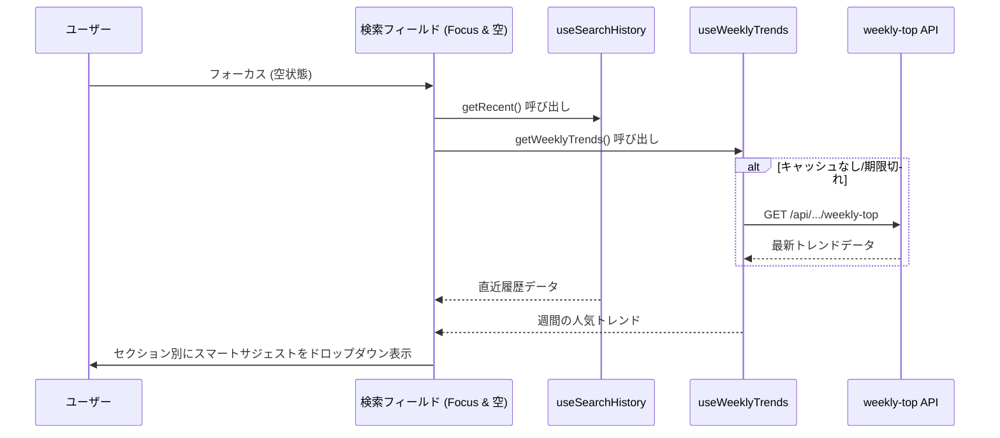

### 追加のテスト設計

#### Unit/Integration Tests
* **`search-history`**:
  - `localStorage` のモックを使用し、重複なし、最大件数（ジャンル3件、ワード5件）の切り詰め、先頭への追加を検証。
* **`GenreSearchField` (Smart Suggest)**:
  - フォーカス時に `data-testid="genre-smart-suggest"` が表示されること。
  - 最近検索したジャンルが存在しない場合に `recent-genres-section` が表示されないこと。
  - API が取得中およびエラー時にドロップダウンの表示状態が要件を満たすこと。
  - サジェスト選択時にジャンルが `localStorage` 履歴に追加されること。
* **`UnifiedSearchField` (Smart Suggest)**:
  - フォーカス、空入力、チップなしのときに `data-testid="search-smart-suggest"` が表示されること。
  - チップが1点以上ある、または入力があるときはスマートサジェストが非表示になり、従来のタグサジェストが表示されること。
  - API 失敗時に `recent-keywords-section` のみが表示されること。

### 実装・結合上の補足事項（2026-06-06 追記）

#### `filterGenreSuggestions` のジェネリクス化 (`src/lib/filter-genre-suggestions.ts`)
型安全性およびコンパイルエラーを回避するため、部分一致サジェストフィルタリングユーティリティをジェネリクスを用いて再定義：
```typescript
export function filterGenreSuggestions<T extends Pick<GenreMetadata, 'id' | 'displayName'>>(
  genres: T[],
  query: string,
  maxResults = 8
): T[];
```
これにより、ホーム画面のカルーセルにマスタデータを渡す際、元の `GenreMetadata[]` の型情報（`iconImageUrl`, `isActive` 等）が維持され、UIコンポーネント間での安全なデータ共有が保障されます。

#### 履歴保存タイミングの統制
- **ジャンル選択**: オートコンプリートのドロップダウンリストからジャンルを選択して確定したタイミング（`pick` および `pickSmart` 関数内）で `addRecentGenre` を実行し、`localStorage` へ保存。
- **統合検索**: 
  - 検索サジェストからタグをクリックして確定したタイミング (`pickTag`)
  - 手動入力によるタグチップ化（Enterキーまたはスペースによるチップ追加確定タイミング、`tryAddChip`）
  - チップ化できないが、フリーワードとして Enter キーで検索を確定したタイミング (`input` の `onKeyDown` ハンドラにて)
  以上のタイミングで `addRecentKeyword` を呼び出し、確実に `localStorage` に履歴を記録します。

---

## Phase 12 クイズプレイ・結果画面および難易度UI改善設計（2026-06-06）

### 概要
プレイから結果画面への自動遷移、難易度（★）の等幅ゲージのグラデーションカラー表示（詳細・結果共通）、結果詳細でのヒント・質問回数表示、もう一度プレイするボタン、作者へのリンクと他のクイズおすすめ表示、結果ヘッダーでのクイズブックマーク、指摘カテゴリ別解除外、指摘ボタン横の通報ボタン表示と送信機能の実装を行います。

### 1. 難易度星ゲージ（★）のグラデーションカラー
難易度（1〜5）の値に応じて HSL カラースペースを用いて算出したカラーを `color` スタイルプロパティに適用します。
* 算出ロジック:
  [difficulty-color.ts](file:///d:/quizeum/src/lib/difficulty-color.ts) に `getDifficultyColor(difficulty: number): string` を定義します。
  ```typescript
  export function getDifficultyColor(difficulty: number): string {
    // 難易度1のとき Hue=120(緑), 難易度5のとき Hue=0(赤)
    const hue = Math.max(0, 120 - (difficulty - 1) * 30);
    return `hsl(${hue}, 100%, 45%)`;
  }
  ```
* 適用箇所:
  * クイズ詳細画面 ([page.tsx](file:///d:/quizeum/src/app/quiz/[id]/page.tsx)) の10段階等幅星ゲージ
  * クイズ結果画面 ([result/page.tsx](file:///d:/quizeum/src/app/quiz/[id]/result/page.tsx)) の難易度投票セクション内の星UI
  * クイズカード ([quiz-card.tsx](file:///d:/quizeum/src/components/quiz/quiz-card.tsx)) 内の難易度星アイコン (任意で適用)

### 2. クイズプレイ画面から結果への自動遷移
通常プレイ ([play/page.tsx](file:///d:/quizeum/src/app/quiz/[id]/play/page.tsx)) において、最後の問題解答を送信したタイミングで、「全問終了しました！」といった待機用の中間画面をレンダリングせず、自動的に結果の保存処理を実行して結果画面 (`/quiz/[id]/result?attemptId={attemptId}`) へ遷移させます。
* 状態管理:
  `usePlayState` の完了ハンドラ `handlePlayComplete` が発火した際、即座に保存APIのレスポンス完了（またはクライアント側完了処理）を待って `router.replace` で結果画面へリダイレクトします。

### 3. 結果画面での詳細情報表示 (ヒント履歴・質問回数)
連想クイズ (association) および水平思考 (lateral-thinking) にて、プレイヤーの解答プロセス詳細を表示します。
* **連想クイズのヒント履歴**:
  Firestore へのスキーマ追加を回避するため、プレイ中のヒント表示情報 (`activeHintIdx` または表示済みの `revealedHints`) を解答完了時に `localStorage` に保存します。
  * キー: `quizeum_attempt_hints_{attemptId}`
  * 保存データ: `revealedHintTexts: string[]`（またはインデックスの配列）
  * 結果画面ロード時、クエリパラメータの `attemptId` から対応するローカルデータを取得して表示します。
* **ウミガメスープの質問回数**:
  `attempt` オブジェクトに保持されている質問回数 (`aiTurnCount`) をそのまま流用し、結果画面のサマリー情報に「質問回数: {count} 回」として表示します。

### 4. 結果画面のナビゲーション・おすすめ表示
* **もう一度プレイする**:
  詳細画面へ遷移するボタンを配置します (`router.push('/quiz/[id]')`)。
* **作者リンク**:
  作成者 ID に基づき、作者プロフィールページへのリンクを表示します。
* **おすすめクイズ**:
  `getQuizzesByAuthor(authorId)` を呼び出して、同じ作者の他の公開クイズを最大3件取得します。
  * 取得したクイズのうち、現在プレイしたクイズを除外し、上位3件を `QuizCard` グリッドで描画します。
  * 取得中やエラー時にはローディングまたは代替UIを表示し、クラッシュを防ぎます。

### 5. 結果画面でのアクション強化 (ブックマーク・指摘・通報)
* **お疲れ様でしたカードのブックマーク**:
  結果サマリーカード領域に、クイズ全体のブックマークトグルボタンを配置します。`toggleBookmark` (コアAPI) を利用して、登録/解除を切り替えます。
* **指摘カテゴリ制限**:
  間違い指摘モーダルを開く際、対象が「クイズ全体への指摘」の場合のみ、カテゴリから「別解の追加要望」を除外または非表示にします (問題個別への指摘時のみ表示)。
* **通報ボタンと通報モーダル**:
  指摘ボタンの横に通報用のボタン (`data-testid="quiz-report-btn"`) を新設します。
  * `ReportModal` は通報理由 (reason) テキスト入力を提供し、送信時に `quizeum-core` の `flagContent(quizId, reporterId, reason)` を呼び出します。

### 5. Requirements Traceability

| 要件 ID | 要件サマリー | 該当コンポーネント | インターフェース / 責務 | フロー / 挙動 |
| :--- | :--- | :--- | :--- | :--- |
| 15.1 | 詳細画面の静的フレーム先行表示 | `src/app/quiz/[id]/page.tsx` | Server Component として戻るボタンや外枠を即座にレンダリングする。 | ユーザーアクセス時に即時描画・配信 |
| 15.2 | 詳細データのスケルトン表示 | `src/components/quiz/detail-skeleton.tsx` | 詳細メタデータのロード中、専用プレースホルダーを表示する。 | `data-testid="quiz-detail-skeleton"` を付与 |
| 15.3 | 詳細データのコンテンツ置換 | `src/app/quiz/[id]/page.tsx` | データロード完了後、スケルトンからコンテンツに差し替える。 | Suspense によるロード完了検知 |
| 15.4 | リーダーボードの非同期スケルトン表示 | `src/components/quiz/leaderboard-skeleton.tsx` | リーダーボードデータのフェッチ中にスケルトンを表示する。 | `data-testid="leaderboard-skeleton"` を付与 |
| 15.5 | リーダーボードのコンテンツ置換 | `src/app/quiz/[id]/page.tsx` | リーダーボードデータロード完了後、実際の表に差し替える。 | `<Suspense>` による非同期制御 |
| 15.6 | 結果画面の静的フレーム先行表示 | `src/app/quiz/[id]/result/page.tsx` | Server Component としてヘッダー等の外枠を即座にレンダリングする。 | ユーザーアクセス時に即時描画・配信 |
| 15.7 | 結果データのスケルトン表示 | `src/components/quiz/result-skeleton.tsx` | 結果データのロード中、専用プレースホルダーを表示する。 | `data-testid="quiz-result-skeleton"` を付与 |
| 15.8 | 結果データのコンテンツ置換 | `src/app/quiz/[id]/result/page.tsx` | データロード完了後、スケルトンから結果コンテンツに差し替える。 | `<Suspense>` による非同期制御 |
| 15.9 | おすすめクイズのスケルトン表示 | `src/components/ui/skeleton-card.tsx` | おすすめクイズのフェッチ中、カード用のスケルトンを表示する。 | `data-testid="recommend-skeleton"` を付与 |
| 15.10 | おすすめクイズのコンテンツ置換 | `src/app/quiz/[id]/result/page.tsx` | おすすめクイズロード完了後、実際のクイズカードに差し替える。 | `<Suspense>` による非同期制御 |
| 15.11 | 詳細・LB用スケルトンの testid 付与 | 各スケルトンコンポーネント | テスト自動化用の testid 付与を保証。 | `data-testid="quiz-detail-skeleton"`, `data-testid="leaderboard-skeleton"` |
| 15.12 | 結果・おすすめ用スケルトンの testid 付与 | 各スケルトンコンポーネント | テスト自動化用の testid 付与を保証。 | `data-testid="quiz-result-skeleton"`, `data-testid="recommend-skeleton"` |
| 15.13 | ホーム画面の静的フレーム先行表示 | `src/app/page.tsx` | Server Component としてヘッダーやサイドバー、検索バー枠を即座にレンダリングする。 | ユーザーアクセス時に即時描画・配信 |
| 15.14 | ホームフィード・カルーセルのスケルトン表示 | `src/components/explore/carousel-skeleton.tsx`, `GridSkeleton` | データロード中、クイズグリッドやカルーセルにスケルトンを表示する。 | `data-testid="home-feed-skeleton"` を付与 |
| 15.15 | ホームコンテンツの置換 | `src/app/page.tsx` | データロード完了後、スケルトンからフィードやカルーセルに差し替える。 | `<Suspense>` による非同期制御 |
| 15.16 | ジャンル・タグページの静的フレーム先行表示 | `src/app/genres/[genreName]/page.tsx`, `src/app/tags/[tagName]/page.tsx` | Server Component として戻るボタンや検索バー等を即時描画する。 | ユーザーアクセス時に即時描画・配信 |
| 15.17 | ジャンル・タグフィードのスケルトン表示 | `GridSkeleton` | クイズ一覧のロード中、カード用のスケルトンを表示する。 | `data-testid="explore-list-skeleton"` を付与 |
| 15.18 | 弱点克服・総合LBの静的フレーム先行表示 | `src/app/quiz/review/page.tsx`, `src/app/leaderboard/page.tsx` | Server Component としてヘッダー等の枠組みを即時描画する。 | ユーザーアクセス時に即時描画・配信 |
| 15.19 | 弱点克服・総合LBデータのスケルトン表示 | `ReviewSkeleton`, `GlobalLeaderboardSkeleton` | データロード中、各専用スケルトンを表示する。 | `data-testid="review-skeleton"`, `data-testid="leaderboard-global-skeleton"` を付与 |

---

## Phase 12 主要画面およびその他全画面の非同期表示最適化設計（2026-06-07）

### 概要
主要画面（クイズ詳細、結果、ホーム、探索、ブックマーク、通知、プロフィール、総合リーダーボード、弱点克服）を App Router の Server Component として構成し、Next.js の Streaming レンダリングを通じて静的な外枠（ヘッダー、戻るボタン、サイドバー等）をクライアントに即座に送信・表示します。その後、非同期に読み込まれる動的領域について React Suspense と Skeleton プレースホルダーを組み合わせて順次ロード・描画するシステム設計を行います。

### 1. ページ構造と Suspense 境界の定義

#### A. ホーム画面（`/`）
* **静的フレーム (RSC)**: ヘッダー、サイドバー枠、検索バー枠（`UnifiedSearchField` 静的状態）、アコーディオンパネル枠。
* **動的 / 非同期ロード領域 (Suspense)**:
  * アコーディオン展開内のジャンル/形式カルーセル: `<Suspense fallback={<CarouselSkeleton />}>`
  * クイズグリッド（新着/人気/トレンド等）: `<Suspense fallback={<GridSkeleton data-testid="home-feed-skeleton" />}>`

#### B. クイズ詳細画面（`/quiz/[id]`）
* **静的フレーム (RSC)**: 戻るボタン、大枠のコンテナ背景、およびメタ情報のアウトライン。
* **動的 / 非同期ロード領域 (Suspense)**:
  * クイズ詳細メタ情報（タイトル、説明、アバター、難易度等）: `<Suspense fallback={<DetailSkeleton data-testid="quiz-detail-skeleton" />}>`
  * クイズ単位リーダーボード（`QuizDualLeaderboard`）: `<Suspense fallback={<LeaderboardSkeleton data-testid="leaderboard-skeleton" />}>`

#### C. クイズ結果画面（`/quiz/[id]/result`）
* **静的フレーム (RSC)**: 戻るボタン、ヘッダー、全体レイアウトフレーム。
* **動的 / 非同期ロード領域 (Suspense)**:
  * 結果詳細（スコア、経過時間、問題別正誤、マークダウン解説等）: `<Suspense fallback={<ResultSkeleton data-testid="quiz-result-skeleton" />}>`
  * おすすめクイズ（同じ作者の他の公開クイズ）: `<Suspense fallback={<RecommendSkeleton data-testid="recommend-skeleton" />}>`

#### D. 探索画面（ジャンル `/genres/[genreName]`, タグ `/tags/[tagName]`）
* **静的フレーム (RSC)**: 戻るボタン、検索バー、ソートタブ、コンテナ。
* **動的 / 非同期ロード領域 (Suspense)**:
  * クイズカードグリッド: `<Suspense fallback={<GridSkeleton data-testid="explore-list-skeleton" />}>`

#### E. その他の画面（ブックマーク `/bookmarks`, 通知 `/notifications`, 弱点克服 `/quiz/review`, 総合リーダーボード `/leaderboard`）
* **ブックマーク**: タブヘッダー、戻るボタン等の静的枠を即時表示。動的エリアに `<Suspense fallback={<BookmarksSkeleton data-testid="bookmarks-skeleton" />}>` を配置。
* **通知**: ヘッダー、既読ボタン等の枠を即時表示。動的エリアに `<Suspense fallback={<NotificationsSkeleton data-testid="notifications-skeleton" />}>` を配置。
* **弱点克服**: ヘッダー、タイトル枠等の静的表示。動的エリアに `<Suspense fallback={<ReviewSkeleton data-testid="review-skeleton" />}>` を配置。
* **総合リーダーボード**: タイトル、タブヘッダー等の静的表示。動的エリアに `<Suspense fallback={<GlobalLeaderboardSkeleton data-testid="leaderboard-global-skeleton" />}>` を配置。

### 2. ミドルウェア (Middleware) によるサーバーサイド認証リダイレクト保護
クライアントサイド（RSC から `<Suspense>` 内の Client Component に到達した後）で認証を判定してリダイレクト（`useAuth` によるログイン画面への遷移等）を行うと、一瞬白紙画面や不正なスケルトンが表示されてしまうため、サーバーサイドのミドルウェア (`src/middleware.ts`) でアクセス遮断を制御します。
* **対象パス**: `/bookmarks`, `/notifications`, `/creator/dashboard` 等のログイン必須ルート。
* **処理ロジック**: Firebase Session Cookie または 認証トークン Cookie を検証し、トークンが欠落または無効な場合は即座にステータスコード `307` で `/login?redirect=...` にサーバーサイドリダイレクトを行います。

### 3. スケルトン（Skeleton）コンポーネント設計
既存の `src/components/ui/skeleton-card.tsx` を拡張または別コンポーネントとして以下の Skeleton プレースホルダーを設計します：
1. `StatsSkeleton`: ダッシュボードの統計数値カード用の脈動（pulsing）アニメーション枠。
2. `FeedbackSkeleton`: 指摘フィードバックキューの一覧用のスケルトン行。
3. `LeaderboardSkeleton`: ランキング順位とユーザー名のリストを模したスケルトンテーブル。
4. `ProfileSkeleton`: アバター、フォロー数、実績バッジ領域をプレースホルダー描画するスケルトン。
```css
/* アニメーション共通クラス */
.skeletonPulse {
  background: linear-gradient(90deg, var(--neon-dark-bg) 25%, var(--neon-glow-dim) 50%, var(--neon-dark-bg) 75%);
  background-size: 200% 100%;
  animation: loadingPulse 1.5s infinite;
}
@keyframes loadingPulse {
  0% { background-position: 200% 0; }
  100% { background-position: -200% 0; }
}
```

### 4. テスト＆検証計画
* **E2E自動テスト (Playwright / Jest)**:
  * 各ページのテストケースにおいて、ローディング中（`data-testid` のスケルトンが存在する状態）および描画完了後（スケルトンが `hidden` または DOM から削除され、実データが存在する状態）を検証。
  * 例: `await expect(page.locator('[data-testid="quiz-detail-skeleton"]')).toBeVisible();` から、ロード完了後に `toBeHidden()` となるフローを保証する。

---

## Phase 12 追補: プレイ画面の Suspense 最適化設計（2026-06-07）

### 概要
本番プレイ（`/quiz/[id]/play`）とテストプレイ（`/quiz/test-play/play`）を、Phase 12 で確立した **RSC シェル + Suspense + Skeleton** パターンに統合する。1130 行規模の Client モノリスを分割し、データ取得境界のみ Server / Suspense に移す。ゲーム進行（`usePlayState` / `useAiPlayState`、localStorage セッション、タイマー、AI チャット）は Client に閉じ込める。

### Boundary Commitments

| 境界 | 所有者 | 責務 |
|------|--------|------|
| `page.tsx`（Server） | Play-flow UI | 静的フレーム即時 HTML ストリーミング |
| `QuizPlayLoader`（async Server） | Play-flow UI | `getQuiz`、quick-press 難読化、シリアライズ |
| `QuizPlayClient`（Client） | Play-flow UI | 全プレイモードのインタラクション |
| `TestPlayPage`（Server シェル） | Play-flow UI | 静的フレーム + Suspense ラップ |
| `TestPlayClient`（Client） | Play-flow UI | sessionStorage payload 解決、テストプレイ UI |
| `PlaySkeleton` | Play-flow UI | 本番・test-play 共有ロード UI |
| `obfuscateQuickPressQuestions`（lib） | Play-flow UI | quick-press 難読化の共通化 |

**Out of boundary**: `getQuiz` API 変更（Core）、Stripe tier UI（Phase 13）、`/quiz/test-play/result`

### 1. ファイル構成

```
src/
├── app/quiz/[id]/play/
│   ├── page.tsx              # Server Component（静的フレーム + Suspense）
│   └── quiz-play-client.tsx  # Client（既存 page.tsx ロジック移管）
├── app/quiz/test-play/play/
│   ├── page.tsx              # Server Component（静的フレーム + Suspense）
│   └── test-play-client.tsx  # Client（sessionStorage ロード + UI）
├── components/quiz/
│   ├── play-skeleton.tsx
│   └── play-skeleton.module.css
└── lib/
    └── quick-press-obfuscate.ts   # quick-press 問題の難読化ユーティリティ
```

### 2. 本番プレイ画面（`/quiz/[id]/play`）

#### A. 静的フレーム (RSC)
`page.tsx` が即時描画する要素:
- 戻るリンク（クイズ詳細または探索へ）
- プログレスバー枠（問題 n / 全 m のプレースホルダー）
- 問題カード外枠（`play.module.css` の `.container` 相当）
- ウミガメモード用 2 カラム外枠（モード判定前は通常枠で可。Client マウント後に lateral レイアウトへ切替）

#### B. Suspense 境界

```tsx
// page.tsx（概念）
export default async function QuizPlayPage({ params, searchParams }) {
  const { id } = await params;
  return (
    <div className={styles.container}>
      <PlayStaticFrame quizId={id} />
      <Suspense fallback={<PlaySkeleton data-testid="quiz-play-skeleton" />}>
        <QuizPlayLoader quizId={id} searchParams={await searchParams} />
      </Suspense>
    </div>
  );
}
```

#### C. QuizPlayLoader（async Server Component）
1. `getQuiz(quizId)` を await
2. `obfuscateQuickPressQuestions(quiz.questions)` を適用（既存 Client useEffect ロジックを lib へ抽出）
3. クイズ未存在時はエラー UI を返す（スケルトンではなくメッセージ）
4. `JSON.parse(JSON.stringify(quiz))` で Client へ渡す（結果画面と同型）
5. `QuizPlayClient` に `initialQuiz` と `quizId` を props 渡し

#### D. QuizPlayClient（Client Component）
- 既存 `QuizPlayPageContent` を移管
- `useState` + `useEffect` による `getQuiz` 呼び出しを**削除**し、`initialQuiz` prop を使用
- `useSearchParams` は Client 内で維持（`mode`, `listId`, `questionId`, `qIndex` 等）
- `useAuth` によるウミガメ未ログインリダイレクトは Client 内で維持
- ブックマーク状態取得（`getBookmarkFeed`）は Client 内非同期のまま可

### 3. テストプレイ画面（`/quiz/test-play/play`）

sessionStorage の draft は Server から読めないため、データ境界は Client 内に置く。

#### A. 静的フレーム (RSC)
本番プレイと同一の `PlayStaticFrame` を共有（戻る先 URL のみ prop で差し替え）。

#### B. Suspense 境界

```tsx
export default function TestPlayPage() {
  return (
    <div className={styles.container}>
      <PlayStaticFrame backHref="/quiz/create" />
      <Suspense fallback={<PlaySkeleton data-testid="quiz-play-skeleton" />}>
        <TestPlayClient />
      </Suspense>
    </div>
  );
}
```

#### C. TestPlayClient
1. `useSearchParams` + `useAuth` で認証・モード検証（既存ロジック維持）
2. `loadTestPlayPayload(user.id)` で sessionStorage から draft 取得
3. `prepareQuizForTestPlay` + `obfuscateQuickPressQuestions` を適用
4. payload 欠落時はエラー UI（要件 29）
5. 既存テストプレイ UI・`saveTestPlayResult` フローを維持

### 4. PlaySkeleton コンポーネント

`ResultSkeleton` / `DetailSkeleton` と同様の pulsing アニメーション（`.skeletonPulse` または既存 CSS 変数）を使用。

| 要素 | 説明 |
|------|------|
| ヘッダー行 | 戻るボタン + タイマー枠 |
| プログレスバー | 全幅バーの pulse |
| 問題文 | 2〜3 行のテキストプレースホルダー |
| 選択肢 | 4 行のボタン型プレースホルダー（通常モード想定。ウミガメは Client マウント後に 2 カラムへ切替） |

- `data-testid="quiz-play-skeleton"`（デフォルト）
- 本番・test-play で同一コンポーネントを import

### 5. quick-press 難読化ユーティリティ

```typescript
// lib/quick-press-obfuscate.ts（概念）
export function obfuscateQuickPressQuestions(questions: Question[]): Question[] {
  return questions.map((q) => {
    if (q.type !== 'quick-press') return q;
    return {
      ...q,
      questionText: '',
      correctTextAnswerList: q.correctTextAnswerList?.map((ans) =>
        btoa(unescape(encodeURIComponent(ans)))
      ) ?? [],
    };
  });
}
```

- `QuizPlayLoader`（Server）と `TestPlayClient`（Client）の両方で呼び出す
- 既存 `review-client.tsx` の inline 難読化とも将来的に共有可能（本フェーズでは play / test-play のみ）

### 6. シーケンス（本番プレイ）

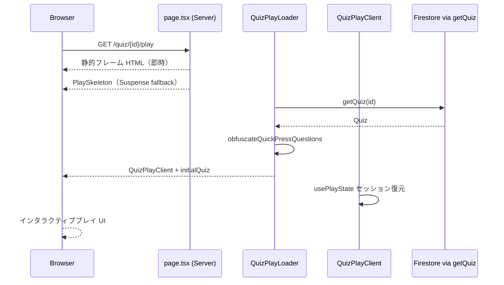

### 7. テスト計画

| testid | 検証 |
|--------|------|
| `quiz-play-skeleton` | ロード中 visible → データ到着後 hidden |
| 本番プレイ E2E | 詳細からプレイ開始 → スケルトン → 問題 UI 表示 |
| test-play E2E | エディタからテストプレイ → スケルトン → 問題 UI 表示 |

### 8. トレーサビリティ

| Req | 設計要素 |
|-----|----------|
| 15.22 | `page.tsx` 静的フレーム |
| 15.23–15.24 | `QuizPlayLoader` + `PlaySkeleton` |
| 15.25 | `QuizPlayClient`（既存 hooks 維持） |
| 15.26–15.29 | `TestPlayPage` + `TestPlayClient` |
| 15.30–15.32 | `PlaySkeleton` testid、レイアウト除外 |

---

## Phase 14: 結果画面の解説アコーディオン化と難易度投票 UI 改善

### 1. 概要

本番結果画面（`QuizResultClient`）およびテストプレイ結果画面（`test-play/result/page.tsx`）の UX を改善する。**Presentation-only** の変更であり、Core API・`Attempt` スキーマ・`handleDifficultyVote` の永続化契約は変更しない。

| 変更 | 現状 | 目標 |
|------|------|------|
| 問題詳細 | 回答・解説が常時展開 | 回答サマリー・解説・ヒント履歴をアコーディオン内に配置、**初期 closed** |
| 難易度投票 | `difficultyBar` + 数値 `diffCell`（1〜5） | クリック可能な ★5個（`DifficultyVoteStars`） |

### 2. Boundary Commitments（Phase 14）

**This Spec Owns**
- `ResultQuestionDetailsAccordion` — 問題行内の折りたたみ UI と開閉状態
- `DifficultyVoteStars` — 体感難易度投票の ★ インタラクション表示
- `result.module.css` のアコーディオン・星投票スタイル
- 本番・テストプレイ結果画面への組み込み

**Out of Boundary**
- `difficultyVote` の Firestore 書き込みロジック（既存 `updateDoc` 維持）
- `getDifficultyColor` の色計算アルゴリズム変更（既存 lib 再利用）
- クイズ詳細・`QuizCard` の難易度表示
- `ExploreAccordion`（ホーム探索）の変更

**Allowed Dependencies**
- `getDifficultyColor`（`src/lib/difficulty-color.ts`）
- 既存 `handleDifficultyVote(level: number)` コールバック
- 既存 `formatUserAnswer` / `formatCorrectAnswer` / `parseMarkdownToHtml`

**Revalidation Triggers**
- 要件 16 のアコーディオン折りたたみ対象範囲の変更（問題文を含める等）
- 難易度スケール（1〜5 以外）への変更

### 3. Architecture Pattern

**Selected**: 既存結果画面 Client コンポーネントへの **子コンポーネント抽出**（Extension / Simple UI）

- 新規 npm 依存なし
- `ExploreAccordion` は `explore-carousel.module.css` に結合しており、結果画面スタイルと責務が異なるため**直接再利用しない**
- ARIA パターン（`button` + `aria-expanded` + `aria-controls`）は `ExploreAccordion` と同型で新規実装

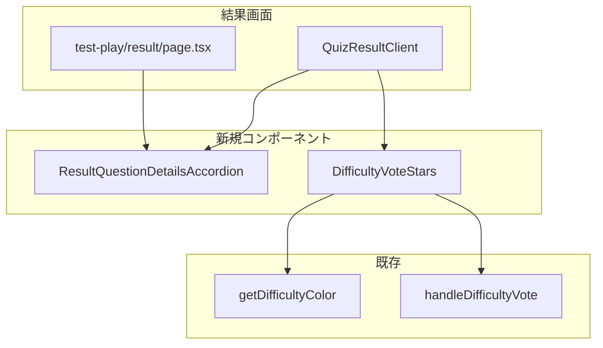

### 4. File Structure Plan

```
src/
├── components/quiz/
│   ├── result-question-details-accordion.tsx   # 新規: 回答・解説・ヒントの折りたたみ
│   ├── result-question-details-accordion.module.css
│   ├── difficulty-vote-stars.tsx               # 新規: ★5個投票 UI
│   └── difficulty-vote-stars.module.css
├── app/quiz/[id]/result/
│   ├── quiz-result-client.tsx                  # 変更: アコーディオン・星投票へ差し替え
│   └── result.module.css                       # 変更: diffCell 廃止、accordion 調整
└── app/quiz/test-play/result/
    └── page.tsx                                # 変更: ResultQuestionDetailsAccordion 適用
```

| ファイル | 責務 |
|----------|------|
| `result-question-details-accordion.tsx` | 折りたたみトリガー、パネル表示、`aria-expanded`、`data-testid` |
| `difficulty-vote-stars.tsx` | ★1〜5 のクリック、`disabled`（オフライン）、選択状態の塗りつぶし表示 |
| `quiz-result-client.tsx` | 問題 map 内で `answerSummary` / `explanationBox` / `hintHistoryBox` を Accordion に移管；`difficultyBar` を `DifficultyVoteStars` に置換 |
| `test-play/result/page.tsx` | 本番と同型のアコーディオン構造を適用（難易度投票はテストプレイに無い場合は対象外） |

### 5. Component Contracts

#### ResultQuestionDetailsAccordion

```typescript
export interface ResultQuestionDetailsAccordionProps {
  questionId: string;
  /** 初期は false（要件 16.2） */
  defaultOpen?: boolean;
  children: React.ReactNode;
}
```

**表示構造（各 `questionItem` 内）**

| 常時表示 | アコーディオン内（初期 closed） |
|----------|--------------------------------|
| `itemHeader`（第N問・正誤・早押し時間） | `answerSummary`（あなたの回答 / 正解） |
| `questionText`（MarkdownContent） | `explanationBox`（解説がある場合） |
| ブックマーク・指摘ボタン | `hintHistoryBox`（連想クイズ時） |

**State**: 親またはコンポーネント内 `useState<boolean>`。問題ごとに独立（要件 16.4）。親で `Record<string, boolean>` を保持しても可。

**Trigger ラベル**: 「回答と解説を表示」／「回答と解説を隠す」（展開状態で切替）。Chevron（▸ / ▾）を併記。

**testid**: `data-testid={`result-question-accordion-${questionId}`}`（要件 16.14）

#### DifficultyVoteStars

```typescript
export interface DifficultyVoteStarsProps {
  value: number | null;
  onVote: (level: number) => void;
  disabled?: boolean;
  maxLevel?: number; // default 5
}
```

**Interaction**
- 第 N 個の ★ をクリック → `onVote(N)` を呼ぶ（要件 16.8）
- `value === k` のとき ★1〜k を塗りつぶし、`k+1`〜5 を空星 ☆（要件 16.10）
- 各 ★ の色は `getDifficultyColor(starIndex)` を適用（ホバー時は該当レベル色、選択済みは `value` の色で強調）（要件 16.9）
- `disabled === true`（オフライン）時は `pointer-events: none` + `opacity` 低下（要件 16.11）

**testid**: コンテナ `difficulty-vote-stars`、各星 `difficulty-vote-star-{N}`（要件 16.14）

**削除対象**: `quiz-result-client.tsx` 内の `difficultyBar` / `diffCell` マークアップおよび `result.module.css` の `.difficultyBar` / `.diffCell` / `.diffCellSelected`（未使用化後に削除）

### 6. System Flow

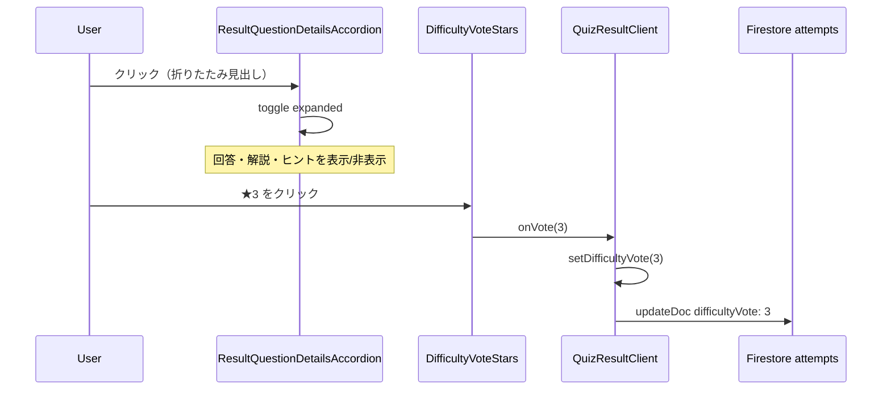

### 7. Requirements Traceability（要件 16）

| Req | 設計要素 |
|-----|----------|
| 16.1 | `itemHeader` + `questionText` 常時表示、`ResultQuestionDetailsAccordion` はその下 |
| 16.2 | `defaultOpen={false}` |
| 16.3 | Accordion `onToggle` |
| 16.4 | 問題ごと独立 state |
| 16.5 | `hintHistoryBox` を Accordion `children` に含める |
| 16.6 | `test-play/result/page.tsx` へ同一コンポーネント |
| 16.7–16.11 | `DifficultyVoteStars` |
| 16.12 | Out of boundary（設計 §2） |
| 16.13–16.14 | ARIA + testid |

### 8. Testing Strategy

| 種別 | 検証項目 |
|------|----------|
| **Unit** | `DifficultyVoteStars`: クリックで `onVote(N)`、オフライン `disabled`、投票済み `value=3` で ★3+☆2 表示 |
| **Unit** | `ResultQuestionDetailsAccordion`: 初期 closed、トグルで children 表示、`aria-expanded` 切替 |
| **E2E** | 本番結果画面: 各問題の回答・解説が初期非表示 → 見出しクリックで表示 |
| **E2E** | 本番結果画面: ★4 クリック → 投票表示更新（既存 difficulty vote フロー維持） |
| **E2E** | テストプレイ結果: アコーディオン挙動が本番と一致 |

### 9. Error Handling & Risks

| リスク | 緩和 |
|--------|------|
| 解説なし・回答のみの問題で空アコーディオン | 見出しは常に表示。中身が空でも開閉可能（回答サマリーは常に存在） |
| 長いクイズで state 肥大化 | `Record<string, boolean>` は展開した問題のみ true — 問題数上限は既存クイズ制約に従う |
| 既存 E2E が数値ボタンを参照 | `difficulty-vote-star-{N}` testid へセレクタ更新 |

**Effort**: S（1〜2 日）— 新規 2 コンポーネント + 2 画面差し替え + 軽量テスト

---

## Phase 15: 通常モード即時フィードバック・スキップ・楽観的結果遷移設計（2026-06-08）

### 1. 概要

通常モード（`mode=normal`）のプレイフローを、**回答記録 → 即時正誤表示 → ユーザー操作（次へ／結果を見る）** に変更する。わからない問題はスキップ（空回答＝不正解）。全問完了時の「解答データを送信中...」を廃止し、結果画面 RSC シェル + `ResultSkeleton` を即時表示しつつ `saveAttempt` をバックグラウンド実行する。

**対象外**: exam / flashcard / lateral / question-list / test-play

### 2. Boundary Commitments

| 境界 | 所有者 | 責務 |
|------|--------|------|
| `usePlayState` | Play-flow UI | 回答記録（`recordAnswer`）と進行（`advanceToNext`）の分離。通常モードのみ自動 `currentIdx` 進行を停止 |
| `PostAnswerFeedback` | Play-flow UI | 正誤バッジ、解説、正解表示、次へ／結果を見る CTA |
| `QuizPlayClient` | Play-flow UI | 通常モードの問題形式別 UI をフィードバックフローに統合、スキップボタン配置 |
| `handlePlayComplete` | Play-flow UI | 楽観的データ保存 → 即遷移 → バックグラウンド `saveAttempt` |
| `optimistic-attempt.ts`（lib） | Play-flow UI | sessionStorage への完了 attempt 一時保存・読取・削除 |
| `QuizResultClient` | Play-flow UI | `localId` / optimistic データ優先表示、Firestore 到着後に置換 |
| `saveAttempt` | quizeum-core | 既存 API をそのまま呼び出し（変更なし） |

**Out of boundary**: Core API 変更、exam/flashcard/lateral のフロー、test-play

### 3. `usePlayState` リファクタ

#### 現状
`handleAnswerSubmit` が正誤判定・スコア更新・`answeredIds` 追加・`currentIdx` 進行を一括実行。

#### 変更後

```typescript
// 通常モード: record のみ（進行しない）
recordAnswer(answer: string): { isCorrect: boolean; judgeable: boolean }

// 明示進行（通常モードの「次へ」「結果を見る」から呼ぶ）
advanceToNext(): void

// スキップ = recordAnswer('')
skipQuestion(): { isCorrect: false }

// exam / flashcard / lateral 用: 従来の一体処理を維持
handleAnswerSubmit(answer: string): void
```

**通常モード分岐（`QuizPlayClient`）**:
- 各問題形式の submit → `recordAnswer` → `pendingFeedback` state をセット
- 「次へ」→ `advanceToNext` + feedback リセット
- 最終問「結果を見る」→ `handlePlayComplete`（楽観的遷移）

**exam 等**: 既存 `handleAnswerSubmit`（自動進行）をそのまま使用。

**タイムアウト（0秒）**: `recordAnswer('')` + フィードバック表示（要件 17.8）。

### 4. `PostAnswerFeedback` コンポーネント

**パス**: `src/components/quiz/post-answer-feedback.tsx` + `post-answer-feedback.module.css`

**Props**:
```typescript
interface PostAnswerFeedbackProps {
  isCorrect: boolean;
  explanation?: string;
  correctAnswerDisplay?: string;
  isLastQuestion: boolean;
  onNext: () => void;
  onViewResults: () => void;
  quickPressTime?: number | null; // 早押しのみ任意
}
```

**UI**:
- 正解: 緑系バッジ + CheckCircle（早押し既存スタイル踏襲）
- 不正解: 赤系バッジ + 正解表示
- 解説: マークダウン（`parseMarkdownToHtml` / `MarkdownContent`）
- CTA: 最終問以外 `play-next-question`、最終問 `play-view-results`

早押し専用のインライン feedback UI は本コンポーネントへ統合し重複を削除。

### 5. スキップボタン

**配置**: 問題カード内、アクションバー（ヒントボタン近傍）または各入力フォーム下。

**挙動**: `skipQuestion()` → `recordAnswer('')` 同等。`failedQuestionIds` 追加、スコア不変、即時不正解フィードバック。

**表示条件**: 通常モードかつ `pendingFeedback === null`（未回答状態）。

### 6. 楽観的結果遷移フロー

#### sessionStorage キー
`quizeum_optimistic_attempt_{localId}` — シリアライズ済み `Attempt` 相当オブジェクト（`id` 未確定）

#### シーケンス

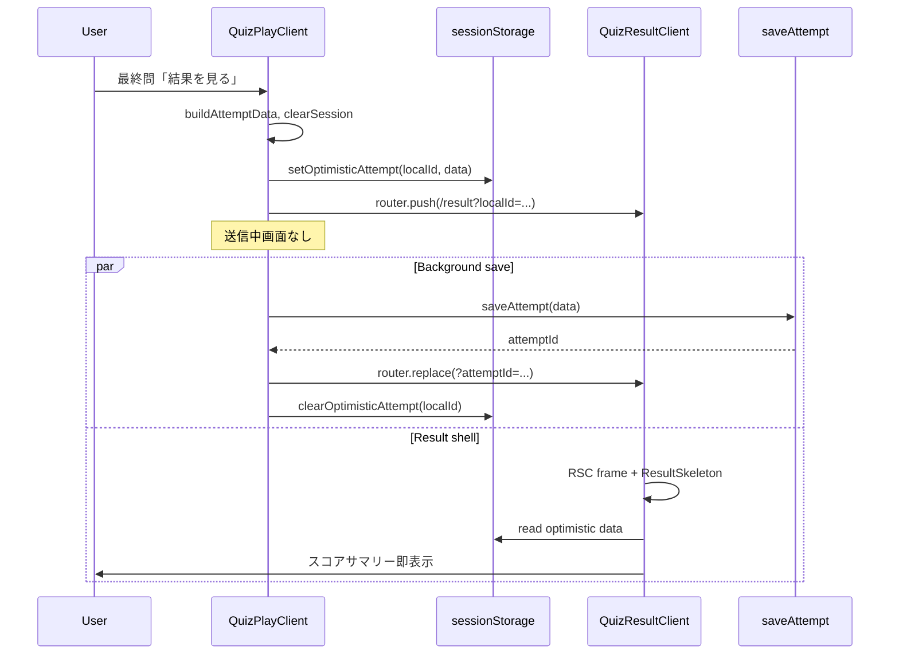

**オンライン成功時**: `router.replace` で `attemptId` に更新。quick-press times / association hints の localStorage キーも `localId` → `attemptId` に移行（既存パターン拡張）。

**オンライン失敗時**: `addPendingSyncAttempt` フォールバック（既存 `saveOffline`）。URL は `localId` のまま。

**オフライン**: 既存 `saveOffline` と同型だが遷移は即時。

### 7. `QuizResultClient` 変更

**読み取り優先順位**:
1. `initialAttempt`（Server Loader）
2. `getOptimisticAttempt(localId)`（sessionStorage）
3. Firestore `getDoc(attempts/{attemptId})`
4. pending sync 一覧

**表示**: optimistic データがある場合は `attemptLoading=false` でサマリーを即描画。バックグラウンドで Firestore 取得し、到着後に state 更新（差分があれば置換）。

**削除**: プレイ完了待ち UI は `QuizPlayClient` から除去（`isFinished || completing` ブロック削除）。

### 8. クイズ詳細トグル

通常モードでは `feedback` クエリパラメータを無視（常に新フロー）。早押し専用トグル UI は通常モード選択時に非表示、または無効化表示とする（要件 17.20）。

### 9. Requirements Traceability（要件 17）

| Req | 設計要素 |
|-----|----------|
| 17.1–17.3 | モード分岐（`effectivePlayMode === 'normal'` かつ `playMode === 'normal'`） |
| 17.4–17.8 | `recordAnswer` + `PostAnswerFeedback`、全問題形式統合 |
| 17.9–17.11 | `play-skip-question` → `skipQuestion` |
| 17.12–17.15 | `advanceToNext` / `handlePlayComplete` |
| 17.16–17.19 | 楽観的遷移、`optimistic-attempt.ts`、送信中 UI 削除 |
| 17.20 | 詳細画面トグル無効化 |
| 17.21–17.22 | Out of boundary |
| 17.23 | testid |

**改定する既存要件**:
- 要件 3.6 → 3.6 / 3.6a（モード別）
- 要件 5.1a / 5.1b → 楽観的結果表示
- 要件 15.25 → 通常モードは要件 17 優先

### 10. Testing Strategy

| 種別 | 検証項目 |
|------|----------|
| **Unit** | `usePlayState`: 通常モードで `recordAnswer` 後に `currentIdx` 不変、`advanceToNext` で進行 |
| **Unit** | `optimistic-attempt`: 保存・読取・削除 |
| **Unit** | `PostAnswerFeedback`: 正解/不正解表示、最終問 CTA ラベル |
| **Integration** | 通常プレイ: 回答 → フィードバック → 次へ × N → 結果を見る → 結果 skeleton → サマリー |
| **Integration** | スキップ → 不正解フィードバック → failedIds に含まれる |
| **Regression** | exam / flashcard / lateral の自動遷移維持 |
| **E2E** | `play-answer-feedback`, `play-view-results`, 送信中テキスト非表示 |

**Effort**: M（2〜3 日）— hook 分離 + コンポーネント + 楽観的遷移 + 結果 Client 統合

---

## Phase 16: 早押し形式の区間累計経過時間・制限時間・フィードバック・レイアウト設計（2026-06-09）

### 1. 概要

通常モード（`mode=normal`）で早押し形式（`quick-press`）の問題をプレイする際、画面上部の経過時間（⏱️）を **壁時計ではなく各問題区間の累計** として計測・表示する。問読み開始前・制限時間終了後・不正解／正解確定後のフィードバック中は加算を停止する。制限時間（`limitTime`）カウントダウンは問読み修了後に開始する。不正解フィードバックでは正解を表示せず、問題カードは問読み前から十分な横幅で表示する。

**対象外**: 早押しタイム（押下〜回答秒数）、テストプレイ、exam / flashcard / lateral / question-list、復習プレイ、`saveAttempt` スキーマ変更。

### 2. Boundary Commitments

| 境界 | 所有者 | 責務 |
|------|--------|------|
| `play-elapsed.ts`（lib） | Play-flow UI | 区間累計の純関数（確定秒数 + 進行中区間の算出） |
| `usePlayState` | Play-flow UI | 区間累計タイマーの tick 制御、`limitTime` の遅延開始 API、セッション永続化への `elapsedSeconds` 反映 |
| `useQuickPressStream` | Play-flow UI | 問読み修了イベントの親への通知（`onReadingComplete`） |
| `QuizPlayClient` | Play-flow UI | 早押しフェーズ遷移のオーケストレーション、レイアウトクラス付与、`PostAnswerFeedback` への正解非表示 |
| `PostAnswerFeedback` | Play-flow UI | 呼び出し側が `correctAnswerDisplay` を渡さない場合の既存挙動維持（変更最小） |
| `play.module.css` | Play-flow UI | 早押しプレイ時のコンテナ／カード横幅拡大 |
| `saveAttempt` / リーダーボード | quizeum-core | 既存 `elapsedSeconds` フィールドを読み取り（値の意味が区間累計になるのみ） |

**Out of boundary**: `quizeum-core` API 変更、早押しタイム計測、テストプレイ、復習画面、結果画面の正誤一覧（結果画面は従来どおり正解表示可）

**Revalidation Triggers**:
- `elapsedSeconds` のセッション復元形式変更 → `LocalAttemptSession` / `usePlayState` 復元ロジックの再検証
- 混合クイズでの非早押し区間ルール変更 → 要件 18.6 と整合確認

### 3. Architecture Pattern & State Model

**Selected pattern**: 区間累計タイマー（Segment Accumulator）— 既存 `useElapsedSeconds` の単純 `enabled` フラグを拡張し、問題種別と早押しフェーズで tick をゲートする。

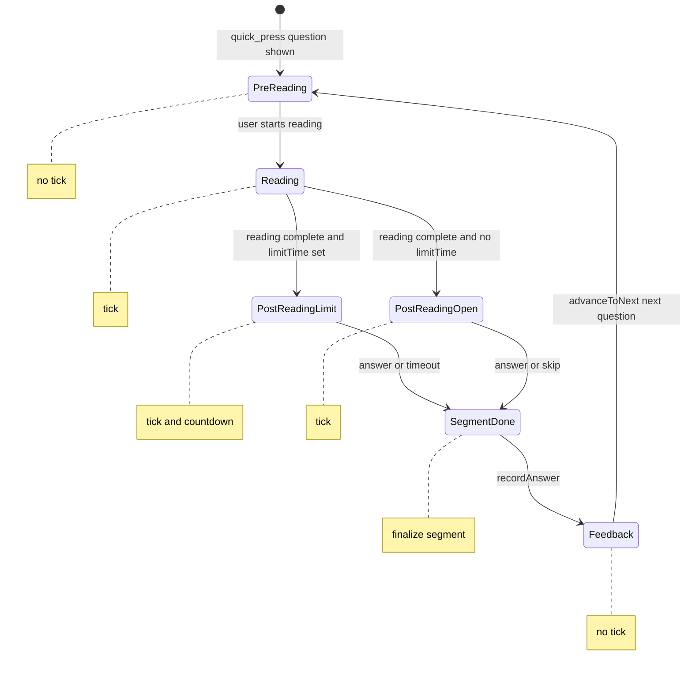

**非早押し問題（混合クイズ）**: 問題表示から `recordAnswer` 確定まで tick（従来の要件 3 相当）。フィードバック中は tick 停止。確定時に区間を累計へ加算。

**表示値**:

```typescript
type ElapsedSegmentState = {
  finalizedSeconds: number;
  segmentStartedAtMs: number | null;
};

// display = finalizedSeconds + (ticking ? floor((now - segmentStartedAtMs) / 1000) : 0)
```

1 秒 `setInterval` は `segmentTicking === true` のときのみ動作。tick 停止時に `finalizeSegment()` で進行中区間を `finalizedSeconds` へ加算し `segmentStartedAtMs` を null にする。

### 4. File Structure Plan

```
src/
├── lib/
│   └── play-elapsed.ts              # NEW: 区間累計の純関数
├── hooks/
│   ├── usePlayState.ts              # MOD: 区間累計 tick、limitTime 遅延開始 API
│   └── useQuickPressStream.ts       # MOD: onReadingComplete コールバック
├── app/quiz/[id]/play/
│   ├── quiz-play-client.tsx         # MOD: フェーズ制御、レイアウト、feedback props
│   └── play.module.css              # MOD: .containerQuickPress 等
└── components/quiz/
    └── post-answer-feedback.tsx     # 変更なし（呼び出し側で correctAnswerDisplay 省略）

tests/
├── lib/play-elapsed.test.ts         # NEW
└── hooks/usePlayState-elapsed.test.ts  # NEW または usePlayState.test.ts 拡張
```

### 5. Components and Interfaces

#### Component Summary

| Component | Layer | Intent | Req Coverage | Key Dependencies |
|-----------|-------|--------|--------------|------------------|
| `play-elapsed.ts` | lib | 区間の開始・確定・表示秒算出 | 18.4, 18.5, 18.13, 18.15 | なし |
| `usePlayState` | hook | 累計 `elapsedSeconds`、ゲート付き tick、`timeLeft` 遅延 | 18.4–18.16, 3.1a | `play-elapsed`, `LocalAttemptSession` |
| `useQuickPressStream` | hook | 問読み修了通知 | 18.10, 18.11 | 既存 stream config |
| `QuizPlayClient` | UI | フェーズ遷移、レイアウト、feedback 制御 | 18.7–18.20, 17.6 | `usePlayState`, `useQuickPressStream`, `PostAnswerFeedback` |

#### `play-elapsed.ts`

```typescript
export type ElapsedSegmentState = {
  finalizedSeconds: number;
  segmentStartedAtMs: number | null;
};

export function createElapsedSegmentState(
  finalizedSeconds?: number
): ElapsedSegmentState;

export function startElapsedSegment(
  state: ElapsedSegmentState,
  nowMs?: number
): ElapsedSegmentState;

export function finalizeElapsedSegment(
  state: ElapsedSegmentState,
  nowMs?: number
): ElapsedSegmentState;

export function getElapsedDisplaySeconds(
  state: ElapsedSegmentState,
  ticking: boolean,
  nowMs?: number
): number;
```

- **Preconditions**: `segmentStartedAtMs` が null のとき `finalizeElapsedSegment` は no-op。
- **Postconditions**: `finalizeElapsedSegment` 後、`segmentStartedAtMs` は null。加算分は秒単位（`Math.floor`）で `finalizedSeconds` へ合算。
- **Invariants**: `finalizedSeconds >= 0`。

#### `usePlayState` 拡張

**追加オプション**:

```typescript
type QuestionElapsedPolicy =
  | { kind: 'standard' } // 非早押し: 問題表示から回答確定まで tick
  | { kind: 'quick-press'; phase: QuickPressElapsedPhase };

type QuickPressElapsedPhase =
  | 'pre_reading'
  | 'reading'
  | 'post_reading'
  | 'feedback';

interface UsePlayStateProps {
  // 既存 props ...
  /** 現在問題の経過時間ポリシー（QuizPlayClient が question type + QP phase で供給） */
  elapsedPolicy?: QuestionElapsedPolicy;
}
```

**追加返却値**:

```typescript
beginLimitCountdown: () => void;
// quick-press: 問読み修了後に QuizPlayClient から呼び、limitTime を timeLeft にセット
```

**変更点**:
1. `currentIdx` 変化時、`elapsedPolicy.kind === 'quick-press'` なら `timeLeft` を即セットしない（要件 3.1a / 18.10）。
2. タイマー `useEffect`: `segmentTicking` を `elapsedPolicy` から導出。tick 時のみ `getElapsedDisplaySeconds` で `elapsedSeconds` state を更新。
3. `recordAnswer` 成功時: 自動 `finalizeElapsedSegment`（18.13, 18.15）。
4. `advanceToNext` 時: フィードバック中 tick は既に停止済み。次問で policy 再評価。
5. `LocalAttemptSession` 保存の `elapsedSeconds` は表示値と同一（18.5）。

**`segmentTicking` 導出規則**:

| Policy | Phase | Ticking |
|--------|-------|---------|
| `standard` | 未回答 | true |
| `standard` | `feedbackPending` | false |
| `quick-press` | `pre_reading` | false |
| `quick-press` | `reading` | true |
| `quick-press` | `post_reading` | true |
| `quick-press` | `feedback` | false |

#### `useQuickPressStream` 拡張

```typescript
type UseQuickPressStreamOptions = {
  // 既存 ...
  onReadingComplete?: () => void;
};
```

- **Trigger**: `run()` の `finally` で `setIsStreaming(false)` かつエラーでない正常完了時に `onReadingCompleteRef.current?.()` を呼ぶ。
- **Abort / cancel / 早押しボタン**: `onReadingComplete` は呼ばない（ストリーム中断は問読み未修了扱い）。ただし早押しボタン押下後も回答入力フェーズでは `post_reading` tick を継続（limitTime カウントダウンと並行）。

**追加返却値（任意）**: `isReadingComplete: boolean` — UI テスト用。

#### `QuizPlayClient` オーケストレーション

**早押しフェーズ遷移**:

| イベント | 次フェーズ | 副作用 |
|----------|-----------|--------|
| 問題表示 / `currentIdx` 変化 | `pre_reading` | `isReadingStarted=false`、tick 停止 |
| 「問読みを開始する」 | `reading` | `setIsReadingStarted(true)`、`startElapsedSegment` |
| `onReadingComplete` | `post_reading` | `beginLimitCountdown()`（`limitTime` あり時） |
| 「押して回答する！」（ストリーム未完了含む） | `post_reading` | `cancelStream()`。未修了でも回答フェーズへ移行し tick 継続 |
| `recordAnswer`（正誤問わず） | `feedback` | `finalizeElapsedSegment`、tick 停止 |
| `advanceToNext` | 次問の policy | QP なら `pre_reading` へ |

**`PostAnswerFeedback` 呼び出し**（不正解・早押し）:

```typescript
correctAnswerDisplay={
  currentQuestion.type === 'quick-press' || lastAnswerResult.isCorrect
    ? undefined
    : formatCorrectAnswer(currentQuestion) || undefined
}
```

要件 17.6 の早押し例外を呼び出し側で実装（コンポーネント変更不要）。

**レイアウト**（要件 18.19）:

- 現在の問題が `quick-press` のとき、ルート `container` に `styles.containerQuickPress` を付与。
- `play.module.css` に `max-width: 1200px`（または `1400px`、ウミガメ `lateralContainer` より控えめ）を定義。`.quizCard` に `min-width` または `width: 100%` を明示し、問読み前の空問題文でもカード幅が縮まないようにする。

**経過時間 testid**（要件 18.24）:

```tsx
<span data-testid="play-elapsed-seconds">
  経過時間: {formatPlayElapsedSeconds(elapsedSeconds)}
</span>
```

### 6. System Flows

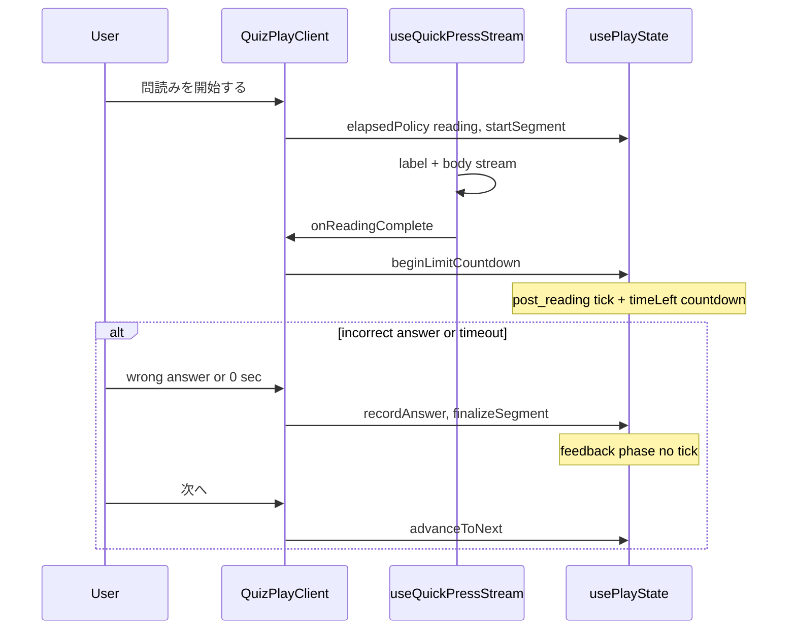

### 7. Requirements Traceability（要件 18）

| Req | 設計要素 |
|-----|----------|
| 18.1–18.3 | スコープ表、早押しタイム Out of boundary |
| 18.4–18.5 | `play-elapsed.ts` + `usePlayState` 区間累計、`buildAttemptData` |
| 18.6 | `QuestionElapsedPolicy.standard` 分岐 |
| 18.7–18.9 | `pre_reading` / `reading` フェーズ、`segmentTicking` |
| 18.10–18.12 | `onReadingComplete` + `beginLimitCountdown`、timeout → `recordAnswer('')` |
| 18.13–18.16 | `finalizeSegment` on answer、`feedback` no tick、`advanceToNext` |
| 18.17–18.18 | `QuizPlayClient` が `correctAnswerDisplay` を省略 |
| 18.19–18.20 | `containerQuickPress`、ストリーム演出維持 |
| 18.21–18.23 | Out of boundary 表 |
| 18.24 | `data-testid="play-elapsed-seconds"` |

**改定する既存設計要素**:
- 要件 3.1 / 3.1a → `usePlayState` の `timeLeft` 初期化分岐
- Phase 15 `PostAnswerFeedback` → 早押し不正解時は `correctAnswerDisplay` 未渡し（17.6 例外）

### 8. Error Handling

| ケース | 応答 |
|--------|------|
| ストリームエラー | `onReadingComplete` 不発火。`pre_reading` または `reading` のまま。ユーザーは再試行または中断 |
| `limitTime` 未設定 | `post_reading` で tick のみ継続、カウントダウン UI 非表示 |
| セッション復元 | `elapsedSeconds` は保存済み累計を `finalizedSeconds` として復元。進行中区間は 0 から再開（リロード時の微小誤差は許容） |

### 9. Testing Strategy

| 種別 | 検証項目 |
|------|----------|
| **Unit** | `play-elapsed`: start / finalize / display 算出、連続 finalize の idempotency |
| **Unit** | `usePlayState` + `elapsedPolicy`: `pre_reading` で tick なし、`reading` で加算、`feedback` で停止 |
| **Unit** | `usePlayState`: quick-press 問題で `currentIdx` 変化時に `timeLeft` 即セットされない |
| **Unit** | `useQuickPressStream`: 正常完了で `onReadingComplete` 1 回、abort で未呼び出し |
| **Component** | `QuizPlayClient`: 早押し不正解で `PostAnswerFeedback` に正解行なし |
| **Regression** | 非早押し通常モードの経過時間・limitTime 挙動維持 |
| **Regression** | 早押しタイム表示・記録（正解時のみ）が Phase 16 変更後も維持 |

**Effort**: S（1〜2 日）— lib 純関数 + hook 拡張 + Client フェーズ配線 + CSS

### 10. Design Synthesis Notes

| レンズ | 決定 |
|--------|------|
| **Generalization** | `QuestionElapsedPolicy` で早押し／標準を統一インターフェース化。実装は 2 分岐のみ |
| **Build vs Adopt** | 新規 npm 依存なし。`play-elapsed.ts` は既存 `useElapsedSeconds` パターンの純関数抽出 |
| **Simplification** | `PostAnswerFeedback` は変更せず呼び出し側で正解非表示。専用フラグ prop は追加しない |

