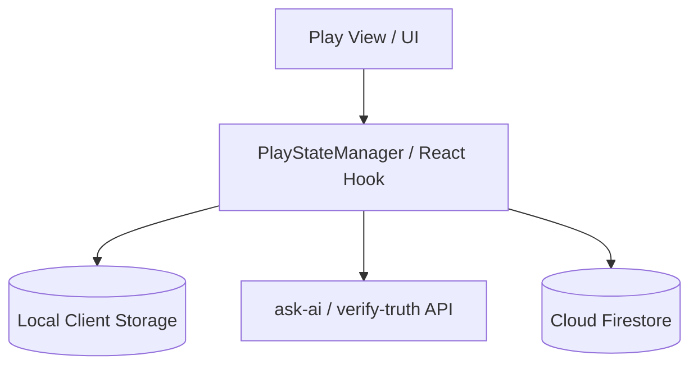
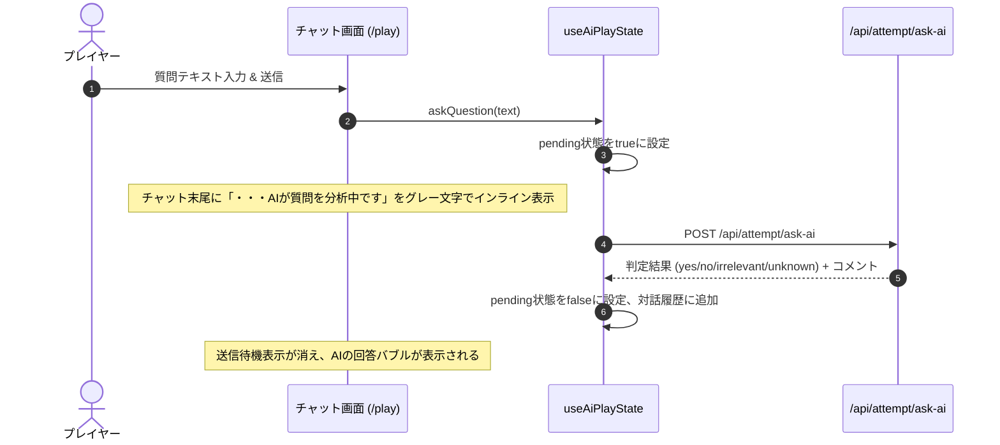
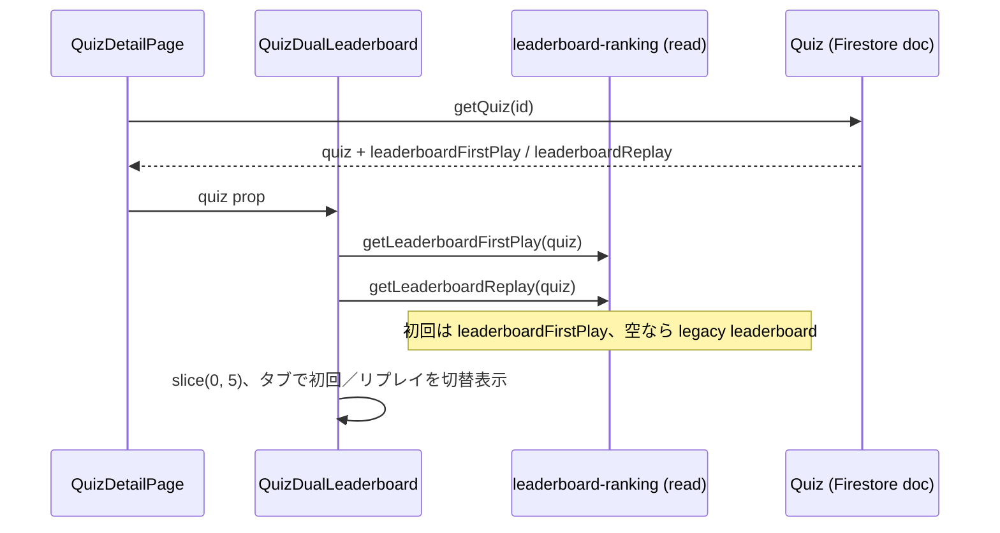
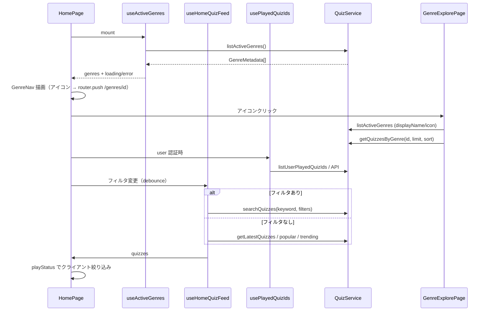
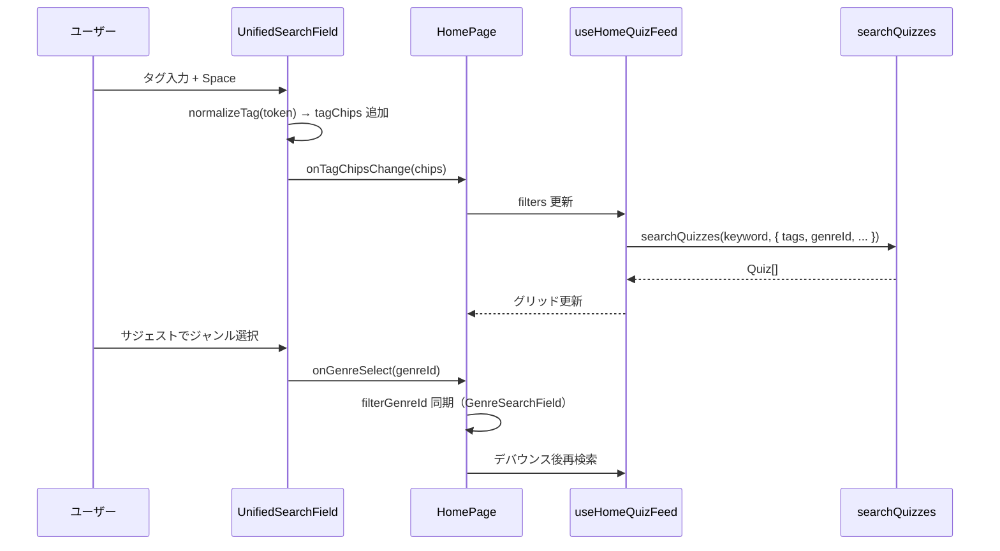
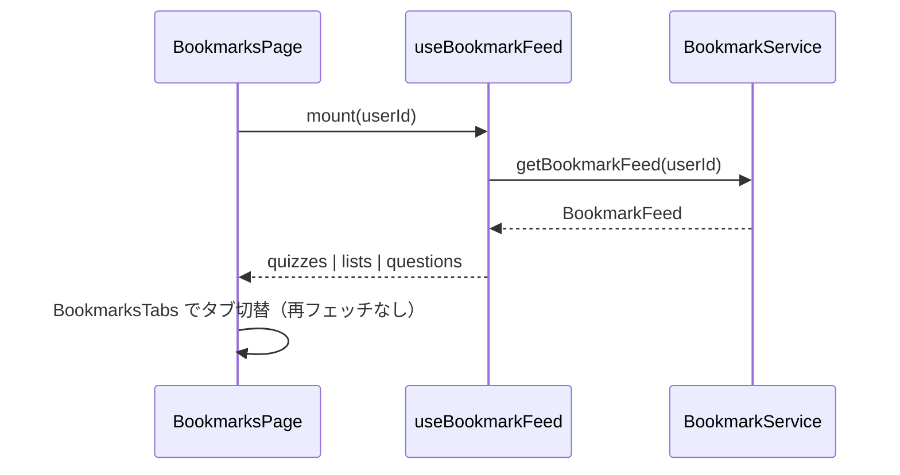

# Technical Design Document: quizeum-play-flow-ui

## Overview
本ドキュメントは、クイズ投稿SNS「quizeum」におけるメインプレイフローおよび探索関連UIの技術設計仕様を定義します。エントランスとなるホーム画面から、クイズ詳細、インタラクティブな各種プレイモード（通常、模擬試験、フラッシュカード）、AIチャットを活用した水平思考プレイ（ウミガメのスープ）、結果表示と評価フィードバック、過去の誤答の復習プレイ、各種探索（ブックマーク、タグ別、ジャンル別）、およびリーダーボードを構築します。

本システムは、Next.jsのApp RouterおよびReact、TypeScriptのフロントエンド構成に加え、CSS Modulesによる親しみやすく遊び心のあるUIを実装し、Firestoreサービス（`AttemptService`, `BookmarkService`等）およびサーバーサイドAPI Routesと接続します。

**Phase 5（2026-06）**: クイズ詳細の単位リーダーボードを初回プレイ／リプレイの二系統表示に刷新する。永続化・順位計算は `quizeum-core`（`leaderboard-ranking.ts`）が完了済みのため、本スペックは読み取り・表示・E2E契約の仕上げを担当する。

**Phase 6（2026-06）**: 探索 UI を `metadata_genres` 駆動に切り替える。`listActiveGenres` / `getQuizzesByGenre`（C2）/ `getQuizzesByTag` / `searchQuizzes` を UI から呼び出し、ハードコード `GENRES` を除去する。

**Phase 8（2026-06）**: ブックマーク画面をクイズ・リスト・設問の3タブに拡張し、プレイ／結果画面からの設問ブックマーク、および設問リスト（`listType: 'question'`）の連続プレイ導線を追加する。データ取得・`attempts` 永続化は `quizeum-core`（実装済み）に依存し、本スペックは UI・セッション状態・遷移のみを担当する。

**Phase 9（2026-06）**: トップページレイアウトのスタイリッシュ化、統合検索バーの上部配置、ピル形式の横スクロールカテゴリー、サムネイル・プレイボタン付きのクイズカード、検索中スケルトン、ネオン調インタラクションを UI スペックの要件として追加・更新します。

**Phase 10（2026-06）**: ホーム統合検索のタグチップ化（スペース確定）とタグ・ジャンル名サジェスト、クイズカードの難易度を数値併記星表記（`★ N`）へ変更しジャンル・出題形式を表示、ジャンル／タグ一覧での `QuizCard` 共通化。タグマスタ読み取りおよび `searchQuizzes` の複数タグ AND 合成は `quizeum-core` Phase 10 に依存する。

### Goals
- 複合検索フィルタ、タブ切替タイムラインを備えた軽快なホーム画面の構築。
- プレイ中のブラウザ再読み込みや切断をカバーする、`localStorage` を用いた解答セッションのクライアントサイド一時保護と同期。
- ウミガメのスーププレイにおける、2カラムレイアウトおよびAI回答生成中の「・・・AIが質問を分析中です」（グレー文字表示）を含むリッチなチャットインタラクション。
- クイズ完了後の👍/👎評価、難易度投票、クローズド間違い指摘、作家への感謝のリアクションUIの実装。
- オフライン時におけるプレイ進行・結果確認のフォールバック処理。
- クイズ作成者本人に対する編集動線UIの提供、および他ユーザーによる直接編集URLアクセス時の認可保護（ガード）。
- **Phase 5**: クイズ詳細における初回プレイ／リプレイ二系統リーダーボードのタブUI、列表示（正解数・合計時間・達成日）、`data-testid` 契約、E2Eの旧仕様（ハイスコア／最速）からの更新。
- **Phase 6**: ホームの動的ジャンルナビ、`searchQuizzes` 連携、ジャンル／タグ一覧のソートタブ、弱点克服のマスタ駆動ジャンル選択。
- **Phase 8**: `/bookmarks` の3分類タブ、`getBookmarkFeed` 駆動の一覧、プレイ／結果画面の設問ブックマークトグル、設問リスト詳細の連続プレイ（`question-list` セッション + 次設問遷移）。
- **Phase 9**: ホーム画面のファーストビュー最適化、検索バー上部優先、1行横スクロールジャンルピル、主要ジャンル以外の「すべて見る」折りたたみ、サムネイル・評価スター・「プレイする」ボタン付きクイズカードグリッド表示、検索中スケルトンプレースホルダー、クリアボタン・ネオン発光エフェクト付き統合検索。
- **Phase 10**: `UnifiedSearchField` によるタグチップ＋タグ／ジャンルサジェスト、クイックサーチチップからのタグチップ追加、`QuizCard` の `★ N` 難易度・ジャンル・出題形式表示、探索一覧ページでのカード統一。

### Non-Goals
- クイズおよびクイズリストの作成・編集UIそのもの（ただし、詳細画面での作成者判定ボタン表示と、編集画面における他ユーザーによる直接アクセス時の認可保護ガード処理は本スペックで担当し、実際のエディタ処理自体は `quizeum-creator-dash-ui` に委ねます）。
- 管理者モデレーション、タグ・ジャンル仮想マージなどの自治ガバナンスUI（`quizeum-moderation-governance-ui`が担当）。
- **Phase 5**: `leaderboardFirstPlay` / `leaderboardReplay` の更新・マージ・順位判定（`quizeum-core`）。マイページのプレイ履歴UI（`quizeum-auth-profile-ui`）。プラットフォーム総合 `/leaderboard` の集計ロジック変更。
- **Phase 6**: `metadata-resolution`・Firestore Rules・canonical 書き込み（`quizeum-core`）。クイズエディタのジャンルセレクト（`quizeum-creator-dash-ui`）。
- **Phase 8**: リスト作成・`listType` 選択・設問のリストへの追加 UI（`quizeum-creator-dash-ui`）。`bookmarksCount` 更新・`attempts` 書き込みロジック（`quizeum-core`）。プロフィールのリストタイプ表示（`quizeum-auth-profile-ui`）。
- **Phase 10**: `listActiveTags`（存続タグのみ・`quizeum-core` 要件 16）・`searchQuizzes.tags` AND 合成（`quizeum-core` 要件 16）。ジャンル／タグ一覧ページへの検索バー新設。クイズ詳細・プレイ画面の難易度表示変更。タグ新設申請・マージ UI（`quizeum-moderation-governance-ui`）。

---

## Boundary Commitments

### This Spec Owns
- **UIルーティング設計**: `/`, `/quiz/[id]`, `/quiz/[id]/play`, `/quiz/[id]/result`, `/quiz/review`, `/leaderboard`, `/bookmarks`, `/tags/[tagName]`, `/genres/[genreName]`, `/quiz/[id]/edit` の各ページコンポーネント。
- **クライアントサイドセッション保護**: プレイ進捗の `localStorage` シリアライズ・復元・オンライン復帰時のバックグラウンド自動同期。
- **AI対話インタラクション**: ウミガメチャットUI、ターン制限・キャッシュバッジ、および回答生成待機メッセージのグレー文字表示制御。
- **評価フィードバックUI**: 良問評価投票、難易度投票、指摘フォームモーダル、作家感謝リアクション。
- **クイズ編集認可ガード**: 編集画面（`/quiz/[id]/edit`）における、ログイン状態および作成者所有権（`quiz.authorId === user.id`）に基づく直接アクセスの制限とアクセス拒否UI表示の制御。
- **クイズ単位リーダーボード表示（Phase 5）**: `QuizDualLeaderboard` コンポーネントによる初回／リプレイの読み取り専用表示、タブ切替、空状態、E2E用 `data-testid`。
- **ジャンルマスタ駆動探索（Phase 6）**: `GenreNav` / `useActiveGenres`、ホーム・ジャンル一覧・弱点克服のマスタ連携、探索ソート UI。
- **分類ブックマーク UI（Phase 8）**: `/bookmarks` の3タブ、`BookmarkFeed` 表示、設問カードの親クイズメタ表示、ブックマーク解除トグル。
- **設問ブックマーク操作（Phase 8）**: プレイ画面・結果画面の設問行トグル（`toggleBookmark` `targetType: 'question'`）。
- **設問リストプレイ導線（Phase 8）**: リスト詳細の `listType` 分岐、設問リスト開始ボタン、`question-list` セッション保持、結果画面からの次設問遷移。
- **ホーム画面・クイズ探索 UI の最適化（Phase 9）**: 検索バー上部配置、1行横スクロールジャンルナビ（ピル形式）、主要以外の折りたたみ（すべて見る）、サムネイル・評価スター・「プレイ」ボタン付き `QuizCard` コンポーネント、ローディング時の `SkeletonCard`、統合検索入力・クリア・フォーカス時のネオンエフェクトおよびクイックサーチチップ。
- **統合検索のタグチップ化とサジェスト（Phase 10）**: `UnifiedSearchField`、タグチップ状態管理、`useActiveTags`、探索一覧での `QuizCard` 共通化とメタ表示拡張。

### Out of Boundary
- Gemini APIとの対話やプロンプト生成のバックエンドロジック本体。
- 認証状態の監視およびユーザープロフィールそのものの編集UI（`quizeum-auth-profile-ui`が担当）。
- Firestore へのリーダーボード書き込み、`compareLeaderboardRecords` / `mergeUserEntryAndTakeTop5` の呼び出し（`quizeum-core`）。

### Allowed Dependencies
- **`quizeum-auth-profile-ui`**: `Header`, `useAuth`
- **`quizeum-core`**: `AttemptService`, `BookmarkService`, `ReviewService`, **`getLeaderboardFirstPlay` / `getLeaderboardReplay`（読み取りのみ）**, **`listActiveGenres`, `getQuizzesByGenre`, `getQuizzesByTag`, `searchQuizzes`（Phase 6）**, **`getBookmarkFeed`, `toggleBookmark`, `getQuestionsInList`, `saveAttempt`（`mode: 'question-list'`）（Phase 8）**, **`listActiveTags`（Phase 10）**, **`searchQuizzes` の `tags?: string[]` AND フィルタ（Phase 10）**
- **サーバーAPIプロキシ**: `/api/attempt/ask-ai`, `/api/attempt/verify-truth`

### Revalidation Triggers
- AI質問判定API (`/api/attempt/ask-ai`) または真相判定API (`/api/attempt/verify-truth`) の入出力スキーマ変更。
- `AttemptService` のデータ格納スキーマ変更。
- `LeaderboardRecord` のフィールド追加・意味変更、または `leaderboard` レガシーフォールバック廃止。
- **Phase 6**: `GenreMetadata` フィールド変更、`getQuizzesByGenre` の C2 契約変更、`listActiveGenres` のフィルタ条件変更。
- **Phase 8**: `BookmarkFeed` / `BookmarkedQuestionEntry` 形状変更、`QuestionInListEntry` 契約変更、`question-list` attempt フィールド追加、設問リストセッションキー仕様変更。
- **Phase 10**: `TagMetadata` フィールド変更、`listActiveTags` フィルタ条件変更、`searchQuizzes` の `tags` AND 契約変更、`normalizeTag` 規則変更。

---

## Architecture

### Architecture Pattern & Boundary Map
プレイ画面はクライアントサイドでのインタラクティブな状態管理（ステート）が極めて重要であり、通常プレイ用の `PlayStateManager` フックおよびウミガメスープ用の `AiPlayStateManager` フックを介して `localStorage` への永続化とAPI通信を統制します。



### Technology Stack
- **Frontend**: Next.js v16.2.6 (App Router), React v19.2.4, TypeScript
- **Styling**: Vanilla CSS (CSS Modules)
- **Local Storage**: `localStorage` (クライアントサイドセッション保護用)

---

## File Structure Plan

### Directory Structure
```
src/
├── app/
│   ├── page.tsx                   # ホーム画面 (1.1, 1.2, 1.3, 1.4)
│   ├── page.module.css
│   ├── bookmarks/
│   │   ├── page.tsx               # ブックマーク一覧画面 (7.3, 11.1–11.5)
│   │   └── bookmarks.module.css
│   ├── list/
│   │   └── [id]/
│   │       └── page.tsx           # リスト詳細 (クイズ/設問分岐) (11.7–11.9)
│   ├── leaderboard/
│   │   ├── page.tsx               # 総合リーダーボード画面 (7.1)
│   │   └── leaderboard.module.css
│   ├── tags/
│   │   └── [tagName]/
│   │       └── page.tsx           # タグ別クイズ一覧画面 (7.2)
│   ├── genres/
│   │   └── [genreName]/
│   │       └── page.tsx           # ジャンル別クイズ一覧画面 (7.2)
│   └── quiz/
│       ├── review/
│       │   ├── page.tsx           # 弱点克服プレイ画面 (6.1, 6.2, 6.3)
│       │   └── review.module.css
│       └── [id]/
│           ├── page.tsx           # クイズ詳細画面 (2.1–2.6); LBは子コンポーネントへ委譲 (9.x)
│           ├── page.module.css    # LB用スタイルは quiz-dual-leaderboard.module.css へ移管
│           ├── edit/
│           │   └── page.tsx       # クイズ編集画面ルーティング (8.1, 8.2)
│           ├── play/
│           │   ├── page.tsx       # クイズプレイ画面 (3.x, 4.x, 11.6, 11.10–11.12)
│           │   └── play.module.css
│           └── result/
│               ├── page.tsx       # クイズ結果画面 (5.x, 11.6, 11.11–11.13)
│               └── result.module.css
components/
├── bookmark/
│   ├── bookmarks-tabs.tsx         # クイズ/リスト/設問タブ (11.1)
│   ├── bookmark-quiz-grid.tsx     # 既存グリッドの抽出 (11.2)
│   ├── bookmark-list-grid.tsx     # リストカード (11.3)
│   ├── bookmark-question-list.tsx # 設問カード一覧 (11.4, 11.5)
│   └── question-bookmark-toggle.tsx # 設問BMトグル (11.6)
components/
├── quiz/
│   ├── quiz-card.tsx              # サムネイル・スター評価・プレイボタン付きクイズカード (1.5) 【Phase 9 新規】
│   ├── quiz-card.module.css
│   ├── quiz-editor.tsx            # クイズエディタコンポーネント (8.1, 8.2 認可ガード)
│   ├── quiz-dual-leaderboard.tsx  # 初回／リプレイLB表示 (9.1–9.8) 【Phase 5 新規】
│   └── quiz-dual-leaderboard.module.css
├── ui/
│   ├── skeleton-card.tsx          # 検索読み込み中のスケルトンプレースホルダー (1.4) 【Phase 9 新規】
│   └── skeleton-card.module.css
└── hooks/
    ├── usePlayState.ts            # 通常プレイのセッション管理フック (3.4)
    └── useAiPlayState.ts          # ウミガメチャットのステート管理フック (4.3, 4.4)
e2e/
└── leaderboard.spec.ts            # クイズ詳細LB: 旧「最速」→リプレイへ更新 (9.x)
components/
└── explore/
    ├── genre-nav.tsx              # アイコン一覧 → /genres/[id] 遷移のみ (10.x)
    ├── genre-search-field.tsx     # サジェスト付きジャンル選択（複合検索パネル用）
    └── genre-nav.module.css
hooks/
├── useActiveGenres.ts             # listActiveGenres キャッシュ (10.x)
├── useActiveTags.ts               # listActiveTags キャッシュ (12.x) 【Phase 10 新規】
├── useHomeQuizFeed.ts             # タブ取得 vs searchQuizzes（フィルタ変更・デバウンス）
└── usePlayedQuizIds.ts            # 認証ユーザーのプレイ済み quizId 集合（1.3 playStatus）
lib/
├── question-list-session.ts       # 設問リスト連続プレイ sessionStorage (11.8–11.13)
├── filter-tag-suggestions.ts      # タグサジェスト (12.x) 【Phase 10 新規】
├── filter-search-suggestions.ts   # 統合検索サジェスト (12.x) 【Phase 10 新規】
└── quiz-format-labels.ts          # 出題形式ラベル共有 (12.18) 【Phase 10 新規】
components/
└── explore/
    ├── unified-search-field.tsx   # タグチップ＋サジェスト統合検索 (12.x) 【Phase 10 新規】
    └── unified-search-field.module.css
hooks/
└── useBookmarkFeed.ts               # getBookmarkFeed ラッパー + 楽観更新 (11.1–11.5)
```

### Modified Files（Phase 8）
- `src/app/bookmarks/page.tsx` — `getBookmarkedQuizzes` を `getBookmarkFeed` + `BookmarksTabs` に置換。3タブ空状態・解除トグル。
- `src/app/list/[id]/page.tsx` — `resolveListType` で分岐。設問リストは `getQuestionsInList` 表示 + 連続プレイ開始（`question-list` セッション初期化）。
- `src/app/quiz/[id]/play/page.tsx` — `mode=question-list` / `questionId` / `qIndex` クエリ対応。単一設問プレイ、`saveAttempt` の `mode: 'question-list'`、`totalQuestions: 1`。設問行に `QuestionBookmarkToggle`。
- `src/app/quiz/[id]/result/page.tsx` — 設問リスト次設問判定（`question-list-session`）。`QuestionBookmarkToggle`。ブックマークからの `startAtQuestionId` 再プレイ導線。
- `src/lib/question-list-session.ts`（新規）— `read` / `write` / `advance` / `clear` 純関数。
- `src/hooks/useBookmarkFeed.ts`（新規）— フィード取得とタブ別楽観更新。
- `src/components/bookmark/*`（新規）— タブ・カード・トグル UI。

### Modified Files（Phase 9）
- `src/app/page.tsx` — 巨大バナーの廃止・縮小。検索バーの最上部移動。`GenreNav` を1行横スクロールピル形状に修正、および「すべて見る」トグル追加。クイズ一覧を `QuizCard` と `SkeletonCard` に置き換え。クイックサーチチップの追加、フォーカス時・ホバー時のネオン調スタイルの統合。
- `src/app/page.module.css` — 検索バー上部レイアウト、ピルスクロールスタイル、クイックサーチチップ、バナー縮小スタイル。
- `src/components/explore/genre-nav.tsx` — 1行横スクロール対応、「すべて見る」展開表示。

### New Files（Phase 10）
- `src/components/explore/unified-search-field.tsx` — タグチップ＋自由入力＋タグ／ジャンルサジェスト（要件 12.1–12.11, 12.21–12.22）
- `src/components/explore/unified-search-field.module.css` — チップ行・サジェストドロップダウン・ネオン枠のスタイル
- `src/hooks/useActiveTags.ts` — `listActiveTags` のマウント時取得とエラー状態（`useActiveGenres` 対称）
- `src/lib/filter-tag-suggestions.ts` — タグマスタの部分一致フィルタ（`id` マッチ正本、表示は `tagName ?? id`。`filter-genre-suggestions` 対称）
- `src/lib/filter-search-suggestions.ts` — 統合検索用のタグ＋ジャンル候補マージとランキング
- `src/lib/quiz-format-labels.ts` — `getFormatLabel` の共有エクスポート（エディタ・カード共通）
- `tests/components/unified-search-field.test.tsx` — チップ確定・サジェスト選択・クリア・testid
- `tests/lib/filter-tag-suggestions.test.ts` — タグ候補フィルタの単体テスト
- `tests/lib/filter-search-suggestions.test.ts` — タグ／ジャンル混在サジェストの単体テスト

### Modified Files（Phase 10）
- `src/app/page.tsx` — プレーン `<input>` を `UnifiedSearchField` に置換。`tagChips` 状態、`useActiveTags`、クイックチップ→タグチップ追加、ジャンル ID と `GenreSearchField` の双方向同期、クリア時のチップリセット。
- `src/lib/home-feed-filters.ts` — `tagChips: string[]` 追加、`hasActiveHomeSearchFilters` にチップ有無を含める。
- `src/hooks/useHomeQuizFeed.ts` — `searchQuizzes(keyword, { tags, genreId, ... })` へチップ配列を渡す。依存配列に `tagChips` を追加。
- `src/components/quiz/quiz-card.tsx` / `quiz-card.module.css` — 難易度を `★ N` 表示へ変更（プログレスバー削除）、ジャンル・出題形式行追加、`data-testid` 付与。任意 prop `genreDisplayName`。
- `src/components/quiz/quiz-editor.tsx` — ローカル `getFormatLabel` を `quiz-format-labels` へ委譲（重複排除）。
- `src/app/genres/[genreName]/page.tsx` — インライン `Link` カードを `QuizCard` グリッドに置換。各カードに `href={/quiz/${id}}` を渡しカード全体を詳細へ遷移。`useActiveGenres` で `genreDisplayName` 解決、ローディング時 `SkeletonCard`。
- `src/app/tags/[tagName]/page.tsx` — 同上（`href` + `genreDisplayName` パターンでホームと統一）。
- `tests/components/quiz-card.test.tsx` — `★ N`、ジャンル、出題形式、testid の検証追加。
- `tests/components/home-page.test.tsx` — タグチップ・サジェスト・クイックチップ連携の更新。
- `e2e/quiz-search.spec.ts` — Phase 10 検索チップ・カードメタの E2E 追加。

### Modified Files（Phase 6）
- `src/app/page.tsx` — `GENRES` 定数削除、`GenreNav`（遷移専用）+ `GenreSearchField` + `useHomeQuizFeed` + `usePlayedQuizIds`。
- `src/app/api/user/played-quiz-ids/route.ts`（新規）— 本人の完了済み `quizId` 一覧（プレイ状況フィルタ用、読み取りのみ）。
- `src/services/attempt.ts` — `listUserPlayedQuizIds(uid)`（既存 `attempts` 読み取り、UI 支援用）。
- `src/app/genres/[genreName]/page.tsx` — マスタメタ表示、ソートタブ、`getQuizzesByGenre(..., sort)`。
- `src/app/tags/[tagName]/page.tsx` — `getQuizzesByTag` + ソートタブ（任意でホームと同型）。
- `src/app/quiz/review/page.tsx` — `REVIEW_GENRES` を `listActiveGenres` に置換。
```

### Modified Files（Phase 5）
- `src/app/quiz/[id]/page.tsx` — インラインLB表を `QuizDualLeaderboard` に置換。`sortLb` 等のクライアント並び替えを削除。
- `src/app/quiz/[id]/page.module.css` — LB専用スタイルをコンポーネント用CSSへ移管（または共有クラスを残す最小差分）。
- `e2e/leaderboard.spec.ts` — `fastest-leaderboard` / `highscore-entry` を Phase 5 の `data-testid` に合わせて更新。

---

## System Flows

### ウミガメスープ AI回答生成中インタラクションフロー


### クイズ詳細リーダーボード表示フロー（Phase 5・読み取りのみ）


### ホーム・ジャンル探索フロー（Phase 6）

**UX 方針（確定）**
- **ジャンルアイコン**: クリックは常に `/genres/[genreId]` へ遷移。ホーム上のインライン絞り込みには使わない。
- **ジャンル（複合検索）**: `GenreSearchField` でマスタをサジェスト検索し、選択した `genreId` をフィルタに載せる（件数増加時も操作可能）。
- **`searchQuizzes`**: フィルタ（ジャンル ID・難易度・問題数・キーワード）変更時にデバウンス（例: 300ms）後に再取得。全フィルタ未指定時はタブ別 API。
- **プレイ状況（要件 1.3）**: 認証時は `usePlayedQuizIds` で取得した `Set<quizId>` を、タブ取得／`searchQuizzes` 結果の**後段**で適用。未認証は `all` 固定または select 無効＋案内。



### 設問リスト連続プレイフロー（Phase 8）

**UX 方針（確定）**
- 設問リストは**収録設問ごとに1 attempt**（`mode: 'question-list'`, `totalQuestions: 1`）。コア契約に準拠。
- 連続プレイの進行状態は `sessionStorage` キー `quizeum_question_list_session` に保持（タブ閉鎖まで有効。`localStorage` の通常プレイ復元とは別キー）。
- プレイ URL: `/quiz/{parentQuizId}/play?listId={listId}&mode=question-list&questionId={qId}&qIndex={n}`。
- 結果 URL: 既存 `listId` クエリを維持し、結果画面がセッションから次エントリを解決して「次の設問へ」を表示。


### ホーム統合検索・タグチップフロー（Phase 10）

**UX 方針（確定）**
- **チップ確定**: スペースで直前トークンを `normalizeTag` 後にチップ追加。空トークン・重複は拒否。
- **Enter 優先順位（確定）**: サジェストが open かつ候補が 1 件以上 → Enter はハイライト候補を選択（`GenreSearchField` 同型）。それ以外 → Enter はスペースと同一規則でタグチップ確定。
- **サジェスト**: 自由入力 1 文字以上でタグ候補（`listActiveTags`：core 要件 16 の存続タグのみ）とジャンル候補（`useActiveGenres`）をセクション分けまたはラベル付きで表示。タグ候補の**照合キーは `id`**、**表示ラベルは `tagName ?? id`**（`filter-tag-suggestions`）。
- **ジャンル選択**: サジェストからジャンル選択時は `filters.genreId` を更新し、フィルタパネル内 `GenreSearchField` と同期。
- **検索合成**: `searchQuizzes(keyword, { tags: tagChips, genreId, ... })` でキーワード・タグ AND・ジャンル・数値フィルタを AND 適用。全未指定時はタブ別 API。
- **難易度表示**: カード上は `★ {difficulty}`（1〜10 整数）。プログレスバーは使用しない。



### ブックマーク3タブ読み込みフロー（Phase 8）



---

## Requirements Traceability

| Requirement | Summary | Components | Interfaces | Flows |
|-------------|---------|------------|------------|-------|
| 1.1 | ファーストビューの最適化 (バナー縮小・検索バー最上部配置) | `/` Page | CSS / DOM layout | - |
| 1.2 | カテゴリー表示の整理 (ピル・横スクロール・「すべて見る」) | `GenreNav` | `listActiveGenres`, `useRouter` | - |
| 1.3 | コンテンツ優先レイアウト (グリッド表示・タブ視認性) | `/` Page | CSS grid layout | - |
| 1.4 | 統合検索機能および UI/UX (検索クリア・ネオン・クイックサーチ・スケルトン) | `/` Page, `GenreSearchField`, `SkeletonCard` | `searchQuizzes`, `useHomeQuizFeed` | ホーム・ジャンル探索フロー |
| 1.5 | クイズカード魅力向上 (サムネイル・プレイボタン・情報整理) | `QuizCard` | `Quiz` data representation | - |
| 2.1 | クイズ詳細メタ情報表示 | `/quiz/[id]` Page | `QuizService` | - |
| 2.2 | 良問評価バッジとマスク制御 | `/quiz/[id]` Page | `ReviewService` | - |
| 2.3 | 3つのプレイモード選択UI | `/quiz/[id]` Page | Mode Panel | - |
| 2.4 | プレイ画面へのリダイレクト遷移 | `/quiz/[id]` Page | `useRouter` | - |
| 2.5 | 作成者本人用「クイズ編集」ボタンの表示 | `/quiz/[id]` Page | `useAuth` | - |
| 2.6 | 編集ボタンクリック時のクイズ編集画面遷移 | `/quiz/[id]` Page | `useRouter` | - |
| 3.1 | 個別/全体カウントダウンタイマー | `/quiz/[id]/play` Page | Timer Hook | - |
| 3.2 | ヒント表示ポップアップ | `/quiz/[id]/play` Page | Dialog UI | - |
| 3.3 | `localStorage` セッション保護と復元 | `/quiz/[id]/play` Page | `usePlayState` | - |
| 3.4 | オフライン時のローカル解答進行 | `/quiz/[id]/play` Page | `AttemptService` | - |
| 4.1 | ウミガメスープ2カラムレイアウト | `/quiz/[id]/play` Page | AI Component | - |
| 4.2 | 未ログイン時のウミガメスープ制限リダイレクト | `/quiz/[id]/play` Page | Auth Guard | - |
| 4.3 | AI回答生成中待機「・・・AIが質問を分析中です」表示 | `/quiz/[id]/play` Page | `useAiPlayState` | インタラクションフロー |
| 4.4 | 同一質問キャッシュバッジ表示 | `/quiz/[id]/play` Page | AI Component | - |
| 4.5 | 無料ユーザーのターン制限表示と無効化 | `/quiz/[id]/play` Page | AI Component | - |
| 4.6 | 真相回答と自動真相判定・クリア演出 | `/quiz/[id]/play` Page | `verify-truth` | - |
| 5.1 | プレイ結果表示と解説マークダウン | `/quiz/[id]/result` Page | Result Component | - |
| 5.2 | 👍/👎良問評価および難易度投票 | `/quiz/[id]/result` Page | `ReviewService` | - |
| 5.3 | 問題の間違い指摘フォーム | `/quiz/[id]/result` Page | Feedback Dialog | - |
| 5.4 | 作家感謝リアクション送信 | `/quiz/[id]/result` Page | `ReactionService` | - |
| 5.5 | オフライン結果画面表示と機能制限 | `/quiz/[id]/result` Page | Offline Handler | - |
| 6.1 | 弱点克服ジャンルフィルタ選択 | `/quiz/review` Page | Genre Selector | - |
| 6.2 | 間違い設問のフェッチと復習プレイ | `/quiz/review` Page | `AttemptService` | - |
| 6.3 | 復習完了時の誤答リストアトミック削除 | `/quiz/review` Page | `AttemptService` | - |
| 7.1 | 総合リーダーボード各種ランキング | `/leaderboard` Page | Ranking Tab | - |
| 7.2 | タグ別・ジャンル別クイズ一覧表示 | `/tags/[tagName]`, `/genres/[genreName]` | Quiz Card Grid | - |
| 7.3 | ブックマーク一覧とお気に入り解除 | `/bookmarks` Page | `BookmarkService` | - |
| 8.1 | 未ログイン時のクイズ編集画面リダイレクト制限 | `QuizEditor` / `QuizEditPage` | `useAuth`, `useRouter` | - |
| 8.2 | 非所有者のクイズ編集画面アクセス制限 | `QuizEditor` / `QuizEditPage` | `useAuth`, `QuizService` | - |
| 9.1 | 初回／リプレイの別表示（タブ） | `QuizDualLeaderboard` | Tab state | クイズLB表示フロー |
| 9.2 | 順位・表示名・正解数・時間・達成日 | `QuizDualLeaderboard` | Table markup | - |
| 9.3 | 表示順（サーバー保存順を信頼） | `QuizDualLeaderboard` | `getLeaderboard*` + slice | - |
| 9.4 | 空状態 | `QuizDualLeaderboard` | Empty UI | - |
| 9.5 | 初回: `leaderboardFirstPlay` + legacy fallback | `QuizDualLeaderboard` | `getLeaderboardFirstPlay` | - |
| 9.6 | リプレイ: `leaderboardReplay` のみ | `QuizDualLeaderboard` | `getLeaderboardReplay` | - |
| 9.7 | E2E `data-testid` | `QuizDualLeaderboard` | test ids | - |
| 9.8 | 更新・マージなし（表示のみ） | `QuizDualLeaderboard` | — | Out of boundary |
| 10.1 | 動的ジャンルナビ | `GenreNav`, `useActiveGenres` | `listActiveGenres` | ホーム・ジャンル探索フロー |
| 10.2 | ハードコード GENRES 廃止 | `HomePage` | — | — |
| 10.3 | `/genres/[id]` 遷移（アイコンのみ） | `GenreNav` | `useRouter` | — |
| 10.4 | `searchQuizzes`（フィルタ変更） | `useHomeQuizFeed` | `searchQuizzes` | — |
| 10.4b | ジャンルサジェスト | `GenreSearchField` | `useActiveGenres` | — |
| 10.4c | プレイ状況 | `usePlayedQuizIds` | `listUserPlayedQuizIds` | — |
| 10.5 | ジャンル一覧メタ表示 | `GenreExplorePage` | `listActiveGenres` | — |
| 10.6 | ジャンル一覧ソート | `GenreExplorePage` | `getQuizzesByGenre` | — |
| 10.7 | タグ一覧 canonical + sort | `TagExplorePage` | `getQuizzesByTag` | — |
| 10.8 | 弱点克服ジャンル選択 | `ReviewPage` | `listActiveGenres` | — |
| 10.9 | 空・エラー状態 | `GenreNav`, `HomePage` | — | — |
| 10.10 | ハードコードへサイレントフォールバック禁止 | 全探索 UI | — | Out of boundary |
| 11.1 | ブックマーク画面3タブ | `BookmarksTabs`, `BookmarksPage` | `useBookmarkFeed` | ブックマーク3タブフロー |
| 11.2 | 未認証時 `/login` リダイレクト | `BookmarksPage` | `useAuth` | — |
| 11.3 | クイズタブ（feed + 解除 + 詳細遷移） | `BookmarkQuizGrid` | `getBookmarkFeed` | — |
| 11.4 | リストタブ（解除 + `/list/[id]`） | `BookmarkListGrid` | `BookmarkFeed.lists` | — |
| 11.5 | 設問タブ（抜粋・親タイトル・日時降順） | `BookmarkQuestionList` | `BookmarkFeed.questions` | — |
| 11.6 | 設問カード → 親クイズプレイ開始 | `BookmarkQuestionList` | `startAtQuestionId` | — |
| 11.7 | プレイ中の設問BMトグル | `QuestionBookmarkToggle` on `QuizPlayPage` | `toggleBookmark('question')` | — |
| 11.8 | 結果画面の設問行BMトグル | `QuestionBookmarkToggle` on `QuizResultPage` | `toggleBookmark('question')` | — |
| 11.9 | 未認証の設問BM → `/login` | `QuestionBookmarkToggle` | `useAuth` | — |
| 11.10 | 設問リスト詳細（順序一覧 + 開始ボタン） | `ListDetailPage` | `getQuestionsInList` | 設問リスト連続プレイフロー |
| 11.11 | 設問リストプレイ開始（セッション保持） | `ListDetailPage` | `question-list-session` | 設問リスト連続プレイフロー |
| 11.12 | 結果後の次設問遷移／完了 | `QuizResultPage` | `advanceQuestionListSession` | 設問リスト連続プレイフロー |
| 11.13 | クイズリストは従来のリストプレイ | `ListDetailPage` | `getQuizzesInList`, `mode=list` | — |
| 11.14 | BM カウント・attempt 永続化なし | 全 Phase 8 UI | コアサービス呼び出しのみ | Out of boundary |
| 12.1–12.6 | タグチップ入力・確定・削除・クリア | `UnifiedSearchField`, `HomePage` | `normalizeTag` | ホーム統合検索フロー |
| 12.7–12.10 | タグ／ジャンルサジェスト・エラー | `UnifiedSearchField`, `useActiveTags`, `useActiveGenres` | `filter-search-suggestions` | ホーム統合検索フロー |
| 12.11 | クイックサーチ→タグチップ | `HomePage`, `UnifiedSearchField` | — | — |
| 12.12–12.15 | チップ＋キーワード＋フィルタ AND 検索 | `useHomeQuizFeed`, `home-feed-filters` | `searchQuizzes` | ホーム統合検索フロー |
| 12.16–12.18 | カード難易度★N・ジャンル・出題形式 | `QuizCard`, `quiz-format-labels` | `resolveQuizFormat`, `useActiveGenres` | — |
| 12.19 | 探索一覧で QuizCard 統一 | `GenreExplorePage`, `TagExplorePage` | `QuizCard` | — |
| 12.20 | 読み込み中スケルトン | `SkeletonCard` | — | — |
| 12.21–12.22 | a11y・data-testid | `UnifiedSearchField`, `QuizCard` | — | — |

---

## Components and Interfaces

### Component Summary Table

| Component | Domain/Layer | Intent | Req Coverage | Key Dependencies | Contracts |
|-----------|--------------|--------|--------------|------------------|-----------|
| `HomePage` | UI / Page | クイズ探索・複合検索・タブ切替 | 1.1–1.5, 10.2–10.4, 12.1–12.15 | `UnifiedSearchField`, `useHomeQuizFeed`, `useActiveTags`, `usePlayedQuizIds`, `useAuth`, `QuizCard`, `SkeletonCard` | State |
| `UnifiedSearchField` | UI / Component | タグチップ＋キーワード＋タグ／ジャンルサジェスト | 12.1–12.11, 12.21–12.22 | `useActiveTags`, `useActiveGenres`, `filter-search-suggestions` | State |
| `GenreSearchField` | UI / Component | マスタ駆動ジャンルサジェスト（フィルタパネル用、検索バーと genreId 同期） | 1.4, 10.4, 12.9 | `useActiveGenres` | State |
| `QuizCard` | UI / Component | サムネイル・★N 難易度・ジャンル・出題形式・プレイ導線 | 1.5, 7.2, 12.16–12.19, 12.22 | `quiz-format-labels`, `toggleBookmark` | State |
| `useActiveTags` | Hook | `listActiveTags` 取得とエラー | 12.7, 12.10 | `listActiveTags` (P0) | State |
| `SkeletonCard` | UI / Component | 検索ロード中の骨組みアニメーション | 1.4 | — | State |
| `useHomeQuizFeed` | Hook | タブ取得 / `searchQuizzes` 切替・デバウンス（tags AND 含む） | 1.3, 10.4, 12.12–12.15 | `searchQuizzes`, tab APIs | State |
| `usePlayedQuizIds` | Hook | プレイ済み quizId 集合 | 1.3 | `/api/user/played-quiz-ids` | State |
| `QuizDetailPage` | UI / Page | クイズのメタデータおよび良問評価、プレイモード選択、作成者編集動線 | 2.1–2.6 | `QuizService`, `ReviewService`, `useAuth` | State |
| `QuizDualLeaderboard` | UI / Component | 初回／リプレイLBのタブ表示（読み取り専用） | 9.1–9.8 | `getLeaderboardFirstPlay`, `getLeaderboardReplay` (P0) | State |
| `QuizPlayPage` | UI / Page | クイズ解答画面（通常タイマー、ヒント、ウミガメスープチャット） | 3.1, 3.2, 3.3, 3.4, 4.1, 4.2, 4.3, 4.4, 4.5, 4.6 | `usePlayState`, `useAiPlayState` | State, API |
| `QuizEditor` | UI / Component | クイズ編集の認可ガード処理およびエディタUIの保護 | 8.1, 8.2 | `useAuth`, `QuizService`, `useRouter` | State |
| `QuizResultPage` | UI / Page | 正誤解説、評価・難易度投票、指摘フォーム、お礼送信 | 5.1, 5.2, 5.3, 5.4, 5.5 | `ReviewService`, `ReactionService` | State, API |
| `ReviewPage` | UI / Page | 間違えた設問の復習プレイとフィルタ制御 | 6.1, 6.2, 6.3 | `AttemptService` | State |
| `LeaderboardPage` | UI / Page | プラットフォームランキングの可視化 | 7.1 | `QuizService` | State |
| `BookmarksPage` | UI / Page | 3分類ブックマークの表示と解除 | 7.3, 11.1–11.6 | `useBookmarkFeed`, `BookmarkService` | State |
| `BookmarksTabs` | UI / Component | クイズ／リスト／設問タブ切替 | 11.1 | `useBookmarkFeed` | State |
| `BookmarkQuizGrid` | UI / Component | クイズカードグリッド（既存UI再利用） | 11.3 | `toggleBookmark` | State |
| `BookmarkListGrid` | UI / Component | リストカード + `/list/[id]` リンク | 11.4 | `toggleBookmark` | State |
| `BookmarkQuestionList` | UI / Component | 設問カード（親タイトル・日時・プレイ導線） | 11.5, 11.6 | `toggleBookmark` | State |
| `QuestionBookmarkToggle` | UI / Component | 設問行のBMオン／オフ | 11.7, 11.8, 11.9 | `toggleBookmark`, `useAuth` | State |
| `ListDetailPage` | UI / Page | クイズリスト／設問リスト詳細とプレイ開始 | 11.10–11.13 | `resolveListType`, `getQuestionsInList` | State |
| `question-list-session` | Lib | 設問リスト連続プレイの sessionStorage | 11.11, 11.12 | — | Service |
| `useBookmarkFeed` | Hook | `getBookmarkFeed` 取得と楽観更新 | 11.1–11.6 | `BookmarkService` | State |

#### `QuizCard`（Phase 9 + Phase 10）

| Field | Detail |
|-------|--------|
| Intent | 探索一覧共通のクイズカード（サムネイル・★N 難易度・ジャンル・出題形式・評価・プレイ導線） |
| Requirements | 1.5, 7.2, 12.16–12.19, 12.22 |

**Responsibilities & Constraints**
- クイズ固有の `thumbnailUrl` がある場合はアスペクト比を保って表示、ない場合はジャンルに基づくグラデーションプレースホルダーを表示。
- タイトル、作成者名、**難易度（`★ {difficulty}`、1〜10 整数。プログレスバー禁止）**、**ジャンル表示名**、**出題形式ラベル**（`getFormatLabel(resolveQuizFormat(quiz))`）、評価（`reviewScore`）、「プレイする」ボタンを整理して表示。
- `genreDisplayName` prop が渡された場合はそれを優先。未指定時は `quiz.genre` をフォールバック表示。
- ホバー時のネオン発光トランジション（Phase 9）を維持。
- **ナビゲーション（確定）**: 任意 prop `href` が渡されたとき、カードルートを Next.js `Link` でラップしカード全体クリックでクイズ詳細へ遷移する。`href` 未指定時（ホーム）は従来どおり `div` + `onPlayClick`。いずれも「挑戦する」ボタンに `data-testid="play-btn"` を付与。
- ブックマーク操作は `stopPropagation`（`href` あり時は `preventDefault` も）+ `toggleBookmark`。未認証時は `/login`。
- ジャンル／タグ探索ページでは親が `useActiveGenres` で解決した `genreDisplayName` と `href={`/quiz/${quiz.id}`}` を渡す。

**Dependencies**
- Inbound: `HomePage`, `GenreExplorePage`, `TagExplorePage`, `BookmarkQuizGrid` — `quiz` prop
- Outbound: `@/lib/quiz-format-labels` — `getFormatLabel`; `@/lib/quiz-format` — `resolveQuizFormat`

**Contracts**: State [x]

##### Props
```typescript
interface QuizCardProps {
  quiz: Quiz;
  /** 指定時はカード全体を Link 化（探索一覧ページ用） */
  href?: string;
  /** ジャンルマスタ解決済み表示名。未指定時は quiz.genre を表示 */
  genreDisplayName?: string;
  isBookmarked: boolean;
  onBookmarkToggle: (quizId: string) => Promise<void>;
  onPlayClick: (quizId: string) => void;
}
```

##### `data-testid` 契約（Phase 10）
| 要素 | test id |
|------|---------|
| カード根 | `quiz-card`（既存） |
| 難易度 | `quiz-card-difficulty`（テキスト `★ N` を含む） |
| ジャンル | `quiz-card-genre` |
| 出題形式 | `quiz-card-format` |
| プレイ | `play-btn`（既存） |

#### `UnifiedSearchField`（Phase 10）

| Field | Detail |
|-------|--------|
| Intent | ホーム統合検索バー：タグチップ行、自由入力、タグ／ジャンルサジェスト、クリア連携 |
| Requirements | 12.1–12.11, 12.21–12.22 |

**Responsibilities & Constraints**
- チップ行（`data-testid="search-tag-chips"`）に確定タグを表示。各チップに `data-testid="search-tag-chip"` と削除用 `aria-label`。
- 自由入力欄で Space により `normalizeTag` したタグをチップ追加。`#` プレフィックスは除去。
- **Enter**: サジェスト open かつ候補あり → ハイライト候補を選択。それ以外 → Space と同規則でチップ確定（要件 12.2–12.3）。
- 入力 1 文字以上で `filterSearchSuggestions(tags, genres, query)` を呼び出し、タグ候補（`search-suggest-tag-{id}`、ラベル `tagName ?? id`）とジャンル候補（`search-suggest-genre-{id}`）を listbox 表示。タグ候補のフィルタは `filter-tag-suggestions`（`id` 部分一致優先、`tagName` 部分一致は副次）。
- タグ候補選択 → チップ追加＋入力クリア。ジャンル候補選択 → `onGenreSelect(genreId)`＋入力クリア。
- 親から渡された `onClear` と連携し、消去ボタンでチップ・キーワード・ジャンル状態を一括クリア可能にする。
- マスタ取得失敗時はサジェストを空またはエラーメッセージ表示（ハードコード候補禁止）。

**Dependencies**
- Inbound: `HomePage` — tags/genres データ、filter 状態（P0）
- Outbound: `@/services/quiz-validation` — `normalizeTag`（P0）

**Contracts**: State [x]

##### Props
```typescript
interface UnifiedSearchFieldProps {
  tagChips: string[];
  onTagChipsChange: (chips: string[]) => void;
  keyword: string;
  onKeywordChange: (value: string) => void;
  genres: GenreMetadata[];
  tags: TagMetadata[];
  genresLoading: boolean;
  tagsLoading: boolean;
  genresError: string | null;
  tagsError: string | null;
  selectedGenreId: string;
  onGenreSelect: (genreId: string) => void;
  onClearAll: () => void;
  disabled?: boolean;
}
```

##### State helpers（`home-feed-filters.ts` 拡張）
```typescript
export interface HomeFeedFilters {
  genreId: string;
  searchQuery: string;
  tagChips: string[];
  difficultyMin: number;
  difficultyMax: number;
  minQuestions: number;
  maxQuestions: number;
}

// searchQuizzes 呼び出し契約（quizeum-core 要件 16）
export interface SearchFilters {
  genreId?: string;
  tags?: string[]; // normalizeTag 済み、AND 一致（core が canonical 解決）
  difficultyMin?: number;
  difficultyMax?: number;
  minQuestions?: number;
  maxQuestions?: number;
}
```

##### `filter-tag-suggestions` 契約
```typescript
/** listActiveTags 結果を id / tagName で部分一致。表示・チップ値は id（正規化済み） */
export function filterTagSuggestions(
  tags: Pick<TagMetadata, 'id' | 'tagName'>[],
  query: string,
  maxResults?: number
): Pick<TagMetadata, 'id' | 'tagName'>[];
```

##### `useActiveTags` 契約
- `listActiveTags()` をマウント時に 1 回取得（`useActiveGenres` 対称）。
- 返却タグは core 要件 16.1 の存続タグ（`canonicalId == null`）のみ。UI は追加フィルタしない。
- `tagLabelById: Map<string, string>` を `tagName ?? id` で構築しサジェスト表示に利用。

#### `SkeletonCard`（Phase 9）

| Field | Detail |
|-------|--------|
| Intent | 検索結果フェッチ中のカード型骨組みアニメーション表示 |
| Requirements | 1.4 |

**Responsibilities & Constraints**
- クイズカードの物理レイアウト（サムネイルエリア、タイトルエリア、メタデータエリア）と同一寸法のプレースホルダーを、点滅（pulse）アニメーションを適用したグレー背景で描画する。
- 検索実行中（`loading === true`）のときに、グリッド表示数分の `SkeletonCard` をマップ展開して表示する。

**Contracts**: State [x]

#### `QuizDualLeaderboard`（Phase 5）

| Field | Detail |
|-------|--------|
| Intent | クイズドキュメントから初回／リプレイ上位5名をタブ切替で表示する |
| Requirements | 9.1, 9.2, 9.3, 9.4, 9.5, 9.6, 9.7, 9.8 |

**Responsibilities & Constraints**
- `quiz: Quiz` を受け取り、初回タブ・リプレイタブでそれぞれ最大5行のテーブルを描画する。
- 並び替え・マージ・Firestore更新は行わない（`quizeum-core` が保存時に順位付け済みの配列を信頼し `slice(0, 5)` のみ）。
- 全問正解限定のラベルや空状態メッセージは使わない。

**Dependencies**
- Inbound: `QuizDetailPage` — `quiz` prop（Criticality P0）
- Outbound: `@/lib/leaderboard-ranking` — `getLeaderboardFirstPlay`, `getLeaderboardReplay`（Criticality P0）

**Contracts**: State [x]

##### Props
```typescript
interface QuizDualLeaderboardProps {
  quiz: Quiz;
}
```

##### `data-testid` 契約（E2E）
| 要素 | test id | 備考 |
|------|---------|------|
| 全体ラッパー | `quiz-leaderboard` | 既存E2E互換 |
| タブ（初回） | `quiz-leaderboard-tab-first` | ラベル: 初回プレイランキング |
| タブ（リプレイ） | `quiz-leaderboard-tab-replay` | ラベル: リプレイランキング |
| 初回テーブルラッパー | `highscore-leaderboard` | 後方互換のため初回側に維持 |
| リプレイテーブルラッパー | `replay-leaderboard` | 旧 `fastest-leaderboard` を置換 |
| 各行 | `leaderboard-entry` | 初回・リプレイ両方 |

**Implementation Notes**
- デフォルト表示タブ: 初回プレイ。
- 日付は `completedAt` を `toLocaleDateString('ja-JP')` で表示（既存ページと同様）。
- 表示名欠落時は `名無しさん`。
- スタイルは `quiz-dual-leaderboard.module.css` に集約し、既存 `page.module.css` の `.leaderboardSection` 等を移管または `@compose` 相当のクラス再利用。

#### `BookmarksTabs` / `useBookmarkFeed`（Phase 8）

| Field | Detail |
|-------|--------|
| Intent | 1回の `getBookmarkFeed` で3分類を取得し、タブ切替はクライアント state のみ |
| Requirements | 11.1, 11.3, 11.4, 11.5 |

**Responsibilities & Constraints**
- マウント時に `getBookmarkFeed(userId)` を1回呼び出す。タブ変更で再フェッチしない（解除時は楽観的に該当配列から除去）。
- 空タブには要件どおりの案内文（「ブックマークしたクイズ／リスト／設問がありません」）を表示。
- 未ログインは既存どおり `/login` へリダイレクト。

**Contracts**: State [x]

```typescript
type BookmarkTab = 'quiz' | 'list' | 'question';

interface UseBookmarkFeedResult {
  feed: BookmarkFeed | null;
  loading: boolean;
  activeTab: BookmarkTab;
  setActiveTab: (tab: BookmarkTab) => void;
  removeBookmark: (targetType: BookmarkTargetType, targetId: string) => Promise<void>;
}
```

##### `data-testid` 契約
| 要素 | test id |
|------|---------|
| タブバー | `bookmarks-tabs` |
| クイズタブ | `bookmarks-tab-quiz` |
| リストタブ | `bookmarks-tab-list` |
| 設問タブ | `bookmarks-tab-question` |
| 空状態（設問） | `bookmarks-empty-question` |

#### `QuestionBookmarkToggle`（Phase 8）

| Field | Detail |
|-------|--------|
| Intent | 設問行に星アイコンを表示し、ログイン時のみ `toggleBookmark(userId, questionId, 'question')` |
| Requirements | 11.7, 11.8, 11.9 |

**Responsibilities & Constraints**
- 未ログイン時は非表示または disabled + ツールチップ（ホーム BM と同方針）。
- 親クイズが非公開化された設問はコア側で BM 解除済みのため、一覧に出ない。プレイ中に検出した場合はトグル失敗をトースト表示。
- 初期状態は `getBookmarkFeed` の `questionIds` Set または `isQuestionBookmarked`（コアに単体 API がなければ feed 由来の props で渡す）。

**Contracts**: State [x]

```typescript
interface QuestionBookmarkToggleProps {
  questionId: string;
  initialBookmarked: boolean;
  onToggle?: (bookmarked: boolean) => void;
}
```

#### `question-list-session`（Phase 8）

| Field | Detail |
|-------|--------|
| Intent | 設問リスト連続プレイの進行インデックスを sessionStorage で保持 |
| Requirements | 11.11, 11.12 |

**Contracts**: Service [x]

```typescript
interface QuestionListSessionEntry {
  questionId: string;
  parentQuizId: string;
}

interface QuestionListSession {
  listId: string;
  entries: QuestionListSessionEntry[];
  currentIndex: number;
}

const QUESTION_LIST_SESSION_KEY = 'quizeum_question_list_session';

function initQuestionListSession(listId: string, entries: QuestionListSessionEntry[]): void;
function readQuestionListSession(): QuestionListSession | null;
function advanceQuestionListSession(): QuestionListSessionEntry | null;
function clearQuestionListSession(): void;
function buildQuestionListPlayUrl(session: QuestionListSession, index: number): string;
```

**Implementation Notes**
- `ListDetailPage` の「連続プレイ開始」で `initQuestionListSession` → `buildQuestionListPlayUrl(..., 0)` へ遷移。
- `QuizPlayPage` は `mode=question-list` 時、`questionId` に一致する1問のみを `usePlayState` に渡す（`totalQuestions` 表示も 1）。
- `QuizResultPage` は `listId` かつセッション存在時、クイズリスト（`quizIds`）分岐より**先に**設問リスト分岐を評価。`advanceQuestionListSession` で次 URL を生成。最終設問後は `clearQuestionListSession` + 完了 UI。
- ブックマーク設問からの単体プレイ（11.6）: `/quiz/{parentQuizId}/play?startAtQuestionId={id}`。セッションは作成しない。
- `QuizPlayPage` は `mode=question-list` 時に `saveAttempt` で `mode: 'question-list'`, `totalQuestions: 1` を送信（11.12 の attempt 記録はコア契約に従いプレイ完了ハンドラで実施）。

#### `ListDetailPage` 設問リスト分岐（Phase 8）

| Field | Detail |
|-------|--------|
| Intent | `resolveListType(quizList)` が `'question'` のとき設問一覧と連続プレイ CTA を表示 |
| Requirements | 11.10, 11.11, 11.13 |

**Responsibilities & Constraints**
- `listType === 'quiz'`（または未設定の legacy）は既存 `getQuizzesInList` フローを維持。
- 設問行は `QuestionInListEntry` の `questionText`（先頭80文字）、親 `quizTitle`、`genre` を表示。
- 空リスト時は「設問が収録されていません」と編集画面へのリンク（作成者のみ）。

---

## Error Handling

### Error Strategy
- **AI回答生成中のタイムアウト・切断**:
  - API呼び出しに失敗した場合、待機表示（「・・・AIが質問を分析中です」）を解除し、「通信エラーが発生しました。もう一度質問を送信してください。」と赤文字のバブルをチャットに追加表示して親切にフォローします。
- **オフライン時の制限処理**:
  - オフラインでのプレイ中、結果画面に遷移した際は、「現在オフラインのため、良問評価や間違い指摘、作家リアクションは送信できません。オンライン復帰後に自動同期されます。」と優しいトーンで警告ヘッダーを表示し、関連ボタンを非活性化（disabled）します。
- **非作成者によるクイズ編集画面への直接アクセス保護**:
  - ログイン中ユーザーが対象クイズの作成者ではない場合（`user.id !== quiz.authorId`）、編集コンポーネント（`QuizEditor`）は編集フォームをレンダリングせず、「アクセス権限がありません。このクイズは他のユーザーが作成したものです。」という警告メッセージUIを表示して操作を完全にブロックします。
- **設問ブックマーク／設問リストプレイの失敗（Phase 8）**:
  - `toggleBookmark` 失敗時はトグルを元に戻し、「ブックマークの更新に失敗しました」と表示。親クイズ非公開などコア検証エラーはそのままメッセージを表示。
  - 設問リストセッション欠落時（直接 URL アクセス等）は結果画面で「リストの続きを再生できません」とリスト詳細へのリンクを表示。`saveAttempt` 失敗時は既存オフラインフォールバックを維持。

---

## Testing Strategy

### Unit Tests
- **`localStorage` セッションの保存と復旧**:
  - `usePlayState` フックが、指定の解答データ（設問ID、解答インデックス、経過秒数）を正しく `localStorage` にシリアライズし、ページ初期化時に正確にデシリアライズできるかをテスト。

### Integration Tests
- **ウミガメスープ AI回答中の状態監視**:
  - プレイヤーが質問を送信した瞬間、`useAiPlayState` の `pending` フラグが `true` となり、UI上にグレー文字の「・・・AIが質問を分析中です」が表示されることを検証。
  - APIレスポンス完了時に、`pending` フラグが `false` となり、結果テキストがチャットバブルに正しくマッピングされることを結合テスト。
- **クイズ編集の認可ガード検証**:
  - ログイン中ユーザーのID（`user.id`）とクイズの `authorId` が一致しない状態で編集画面をロードした際、編集フォームが表示されず、警告エラーUIが表示されることを結合テストで検証。
  - 未ログイン状態で直接アクセスした際、直ちに `/login` へリダイレクトされることを検証。

### E2E/UI Tests
- **複合検索フィルタ（Phase 6）**:
  - ジャンルアイコンクリックで `/genres/[id]` に遷移すること（ホーム URL のまま絞り込まないこと）。
  - `GenreSearchField` でサジェスト選択後、デバウンス経由でグリッドが更新されること。
  - 認証済みで「未プレイのみ」選択時、プレイ済みクイズが一覧から除外されること。
- **クイズ詳細・二系統リーダーボード（Phase 5）**:
  - `[data-testid="quiz-leaderboard"]` が表示されること。
  - 初回タブで `[data-testid="highscore-leaderboard"]`、リプレイタブ切替後に `[data-testid="replay-leaderboard"]` が表示されること。
  - エントリがある場合、各行に `[data-testid="leaderboard-entry"]` が存在し、列に正解数・秒数が含まれること（テキストマッチは緩く、存在確認中心）。
  - 旧テスト「最速全問正解ランキング」「`fastest-leaderboard`」は削除またはリプレイ仕様へ差し替え。
- **ホーム画面 UI 最最適化 (Phase 9)**:
  - 巨大バナーが削除または大幅に縮小されて描画されること。
  - 検索バーがカテゴリナビゲーション（`[data-testid="genre-nav"]`）より上位に配置されていること。
  - カテゴリーが1行のピル形状（`[data-testid="genre-pill-container"]`）で横スクロール可能なCSS構造になっていること。
  - クイズカード（`[data-testid="quiz-card"]`）内にサムネイル画像、難易度、評価スター、および `data-testid="play-btn"` のプレイボタンが含まれていること。
  - 検索バーに文字列を入力した際、クリア用 `[data-testid="search-clear-btn"]` ボタンが表示され、クリックすると入力が空になること。
  - 検索バー下部のクイックサーチバッジチップをクリックしたとき、そのキーワードが検索インプットに反映され、検索が自動的にトリガーされること。
  - 検索実行中、`[data-testid="skeleton-card"]` が表示されること。

- **ブックマーク3タブ（Phase 8）**:
  - `[data-testid="bookmarks-tabs"]` で3タブが表示され、設問タブで親クイズタイトルがカードに含まれること。
  - 設問タブで解除後、当該カードが一覧から消えること（楽観更新）。
- **設問リスト連続プレイ（Phase 8）**:
  - 設問リスト詳細からプレイ開始 → 1問完了 → 結果画面に「次の設問へ」→ 次の親クイズのプレイ画面へ遷移すること。
  - 最終設問完了後にリスト完了メッセージが表示されること。
- **設問ブックマークトグル（Phase 8）**:
  - 結果画面の設問行でトグル操作後、`/bookmarks` の設問タブに反映されること（再読み込み後）。

- **統合検索タグチップ・サジェスト（Phase 10）**:
  - 検索欄で `JavaScript` + Space 後、`[data-testid="search-tag-chip"]` にチップが表示されること。
  - クイックサーチ `#ウミガメのスープ` クリックで入力欄ではなくチップが追加されること。
  - サジェストからジャンル選択後、フィルタパネルのジャンル表示と同期すること。
  - 消去ボタンでチップとキーワードがクリアされ、タブ別一覧に復帰すること。
  - 複数タグチップ時、両方のタグを含むクイズのみ表示されること（AND）。
- **クイズカードメタ拡充（Phase 10）**:
  - `[data-testid="quiz-card-difficulty"]` が `★ 7` 形式（例）を含み、プログレスバー要素が存在しないこと。
  - `[data-testid="quiz-card-genre"]` と `[data-testid="quiz-card-format"]` がホーム・ジャンル一覧・タグ一覧のいずれでも表示されること。
  - ジャンル／タグ一覧で `QuizCard` の `href` によりカードクリックで `/quiz/[id]` へ遷移すること。`[data-testid="play-btn"]` が存在すること。

### Unit Tests（Phase 10）
- **`filter-tag-suggestions` / `filter-search-suggestions`**:
  - 部分一致、大文字小文字無視、空クエリ時の挙動、タグ／ジャンルの混在ランキング。
- **`UnifiedSearchField`**:
  - Space 確定、重複拒否、空トークン拒否、サジェスト選択、キーボード Enter 選択、`normalizeTag` 連携。
- **`QuizCard`**:
  - `★ N` 表示、genreDisplayName 優先、format ラベル、testid 存在。

### Unit Tests（Phase 8）
- **`question-list-session`**:
  - `init` → `read` → `advance` が順序どおりエントリを返し、最終後 `null` になること。`clear` で storage が空になること。
  - `buildQuestionListPlayUrl` が `mode=question-list` と `questionId` / `qIndex` を含むこと。
