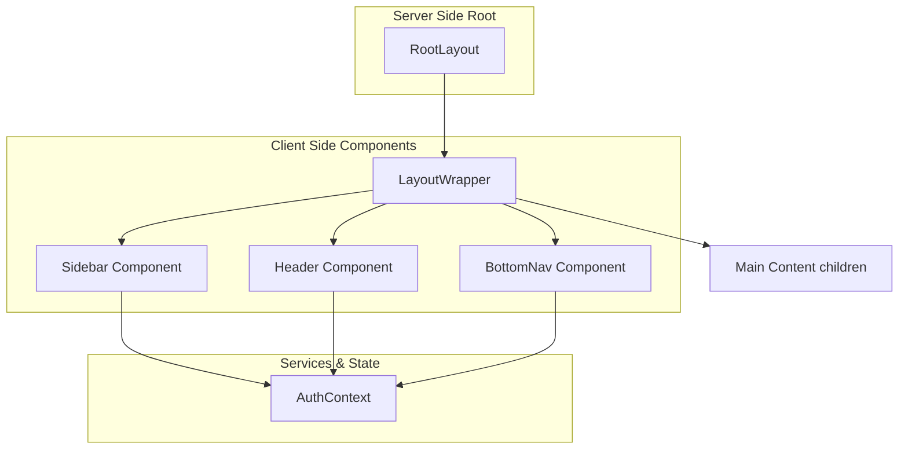
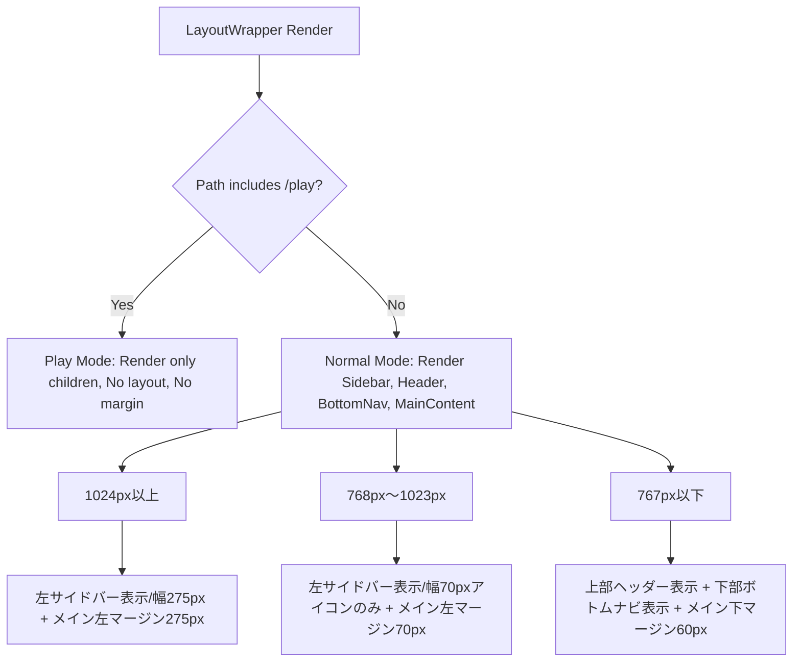

# Design Document: quizeum-sidebar-layout

## Overview
本機能は、Quizeumのグローバルナビゲーションおよび全体レイアウトを刷新し、PC/モバイルそれぞれの画面サイズに最適化したハイブリッドレイアウトへと移行するものです。

**Phase 22（2026-06-09）**: ディスカバリーホーム（`/`）と検索画面（`/search`）の IA 分離に伴い、Sidebar / BottomNav に「検索」導線を追加し、アクティブ状態を区別する。

### Goals
- PC/タブレットサイズにおいて、画面左端にナビゲーション項目を一元化した左サイドバーを導入する。
- モバイルサイズ（767px以下）において、画面下部に主要遷移先を配置したボトムナビゲーションを導入し、上部ヘッダーを軽量なミニヘッダーへとリファクタリングする。
- 各デバイスサイズに合わせたメインコンテンツエリアの適切な余白とパディング制御を、App Routerのサーバーコンポーネント構造を崩さずに提供する。

### Non-Goals
- `/play` パス（クイズプレイ画面）におけるナビゲーション要素の表示およびレイアウト変更（非表示のまま維持）。
- 各画面内部（ホーム、プロフィール等）の表示内容やデータフェッチロジック自体の変更。

---

## Boundary Commitments

### This Spec Owns
- グローバルレイアウト用コンポーネントである `LayoutWrapper` の実装。
- PC/タブレット用 `Sidebar` コンポーネントおよびスタイルの実装。
- モバイル用 `BottomNav` コンポーネントおよびスタイルの実装。
- モバイル用軽量ミニヘッダー `Header` へのリファクタリング。
- `layout.tsx` におけるレイアウト構造の統合。
- デバイス幅に応じた余白（パディング）制御および `/play` プレイ画面除外ロジック。
- **Phase 22**: Sidebar / BottomNav への「検索」（`/search`）導線、`/` と `/search` のアクティブ状態区別、`data-testid` 付与。

### Out of Boundary
- `useAuth` フックおよび Firebase 認証状態の管理（`quizeum-auth-profile-ui` に依存）。
- プロフィール画面、通知画面、ブックマーク画面、作問画面などの各ルーティング遷移先の中身（コンテンツ部）。

### Allowed Dependencies
- **`useAuth`** (from `@/context/auth-context`): ログイン状態、ユーザー情報、アバター画像の取得。
- **`usePathname` / `useRouter`** (from `next/navigation`): 現在のパスの判定、ページ遷移処理。
- **`lucide-react`**: メニュー用アイコンコンポーネント。

### Revalidation Triggers
- 認証コンテキスト (`useAuth`) の返り値の型定義の変更。
- アプリケーション全体のメディアクエリ（ブレークポイント）定義の変更。

---

## Architecture

### Existing Architecture Analysis
- 従来は `src/app/layout.tsx` が直接 `Header` を読み込んでレンダリングしていたため、画面全体の枠組みをクライアントのパス監視等に基づいて制御することが難しかった。
- `Header` はデスクトップとモバイルの全ロジックを含んでおり、コードが肥大化していた。

### Architecture Pattern & Boundary Map
App Router のサーバーコンポーネント特性を保護するため、`RootLayout` はサーバーコンポーネントのまま維持し、クライアントサイドの状態監視（パスや認証状態）が必要なレイアウト構築部分を `LayoutWrapper` としてクライアントコンポーネント化して分離します。



### Technology Stack

| Layer | Choice / Version | Role in Feature | Notes |
| :--- | :--- | :--- | :--- |
| Frontend | Next.js 16.2.6 (App Router) | 全体レイアウト、ナビゲーション | クライアントコンポーネントによるレイアウト切り替え |
| UI/Styling | Vanilla CSS (CSS Modules) | 各コンポーネントのレスポンシブ配置、パディング制御 | TailwindCSSは使用しない |
| Icons | Lucide React | ナビゲーションメニュー用アイコン | |

---

## File Structure Plan

### Directory Structure
```
src/
├── app/
│   ├── layout.tsx                 # [MODIFY] LayoutWrapper の読み込みに変更
│   └── globals.css                # [MODIFY] 必要に応じてレイアウト共通のグローバルCSSを追加
└── components/
    └── layout/
        ├── header.tsx             # [MODIFY] モバイル専用ミニヘッダーに軽量化
        ├── header.module.css      # [MODIFY]
        ├── layout-wrapper.tsx     # [NEW] レイアウト全体を包むラッパー (Client Component)
        ├── layout-wrapper.module.css # [NEW]
        ├── sidebar.tsx            # [NEW] 左サイドバーコンポーネント
        ├── sidebar.module.css     # [NEW]
        ├── bottom-nav.tsx         # [NEW] モバイル用ボトムナビ
        └── bottom-nav.module.css  # [NEW]
```

### Modified Files

#### [layout.tsx](file:///d:/quizeum/src/app/layout.tsx)
- `<Header />` を直接読み込むのをやめ、新規作成する `<LayoutWrapper>` で `{children}` を包むように変更する。

#### [header.tsx](file:///d:/quizeum/src/components/layout/header.tsx)
- PC用のナビゲーションリンク、ユーザーメニュー、ドロップダウンを削除。
- モバイルサイズ（767px以下）のみで機能するミニヘッダーとして再設計。
- ロゴ、作問ショートカットボタン（ログイン時のみ）、アバター（ログイン時のみ、またはログインリンク）のみを表示。
- ハンバーガーメニューとスライドドロワーメニューのコードを完全に削除。

#### [header.module.css](file:///d:/quizeum/src/components/layout/header.module.css)
- モバイルミニヘッダー専用のスタイルのみに絞り込み、PC用スタイルの記述を削除。

---

## System Flows

### 画面サイズによるレイアウト切り替え
`LayoutWrapper` は、メディアクエリ（CSS）を使用してコンポーネントの表示・非表示を切り替え、メインコンテンツの余白を動的に制御します。



---

## Requirements Traceability

| Requirement | Summary | Components | Interfaces | Flows |
| :--- | :--- | :--- | :--- | :--- |
| **1.1** | PC版サイドバー表示（幅275px・テキスト付） | `Sidebar` | `Sidebar.module.css` | `画面サイズによるレイアウト切り替え` |
| **1.2** | タブレット版サイドバー表示（幅70px・アイコンのみ） | `Sidebar` | `Sidebar.module.css` | `画面サイズによるレイアウト切り替え` |
| **1.3** | 未ログイン時のサイドバー（ログインボタン表示） | `Sidebar` | `useAuth` 連携 | - |
| **1.4** | ログイン時のサイドバー（アバター・名前表示） | `Sidebar` | `useAuth` 連携 | - |
| **1.5** | アクティブパスのハイライト表示 | `Sidebar` | `usePathname` 連携 | - |
| **1.6** | クイズプレイ画面（`/play`）でのサイドバー非表示 | `LayoutWrapper` | `usePathname` 連携 | `画面サイズによるレイアウト切り替え` |
| **2.1** | モバイルログイン時のボトムナビ（4つの主要リンク） | `BottomNav` | `useAuth` 連携 | - |
| **2.2** | モバイル未ログイン時のボトムナビ（ホームのみ） | `BottomNav` | `useAuth` 連携 | - |
| **2.3** | クイズプレイ画面でのボトムナビ非表示 | `LayoutWrapper` | `usePathname` 連携 | `画面サイズによるレイアウト切り替え` |
| **3.1** | モバイル軽量ヘッダー（ロゴ、作問、アバター） | `Header` | `useAuth` 連携 | - |
| **3.2** | PC版でのモバイルヘッダー非表示 | `Header` | `Header.module.css` | `画面サイズによるレイアウト切り替え` |
| **3.3** | クイズプレイ画面でのモバイルヘッダー非表示 | `LayoutWrapper` | `usePathname` 連携 | `画面サイズによるレイアウト切り替え` |
| **4.1** | PC版コンテンツ余白（左275px） | `LayoutWrapper` | `layout-wrapper.module.css` | `画面サイズによるレイアウト切り替え` |
| **4.2** | タブレット版コンテンツ余白（左70px） | `LayoutWrapper` | `layout-wrapper.module.css` | `画面サイズによるレイアウト切り替え` |
| **4.3** | モバイル版コンテンツ余白（下60px） | `LayoutWrapper` | `layout-wrapper.module.css` | `画面サイズによるレイアウト切り替え` |
| **4.4** | クイズプレイ画面での余白排除 | `LayoutWrapper` | `layout-wrapper.module.css` | `画面サイズによるレイアウト切り替え` |

---

## Components and Interfaces

| Component | Domain/Layer | Intent | Req Coverage | Key Dependencies | Contracts |
| :--- | :--- | :--- | :--- | :--- | :--- |
| `LayoutWrapper` | UI / Layout | パス監視に基づくレイアウト適用と余白制御 | 1.6, 2.3, 3.3, 4.1-4.4 | `Sidebar`, `Header`, `BottomNav` | State |
| `Sidebar` | UI / Layout | PC/タブレット用グローバル縦型ナビゲーション | 1.1-1.5 | `useAuth`, `usePathname` | State |
| `Header` | UI / Layout | モバイル用軽量ミニヘッダー | 3.1, 3.2 | `useAuth` | State |
| `BottomNav` | UI / Layout | モバイル用下部固定グローバルナビゲーション | 2.1, 2.2 | `useAuth`, `usePathname` | State |

### [UI / Layout]

#### LayoutWrapper
* **Intent**: 現在のパス（`/play` 判定）に基づいて全体レイアウトの出し分けを行い、メインコンテンツエリアをラップする。
* **Responsibilities & Constraints**:
  * パスに `/play` が含まれる場合、ナビゲーション要素を一切レンダリングせず、余白なしで `{children}` を描画する。
  * それ以外の場合、サイドバー、ヘッダー、ボトムナビ、および余白制御クラスを持つメインコンテナをレンダリングする。

##### Interface Definition
```typescript
interface LayoutWrapperProps {
  children: React.ReactNode;
}
```

---

#### Sidebar
* **Intent**: PC（1024px以上）およびタブレット（768px〜1023px）での縦型グローバルナビゲーションの表示とアカウントメニューの提供。
* **Responsibilities & Constraints**:
  * 1024px以上では幅275pxでロゴ、アイコン、ラベルテキストを表示する。
  * 768px〜1023pxでは幅70pxでアイコンのみを表示する。
  * 767px以下では非表示にする。
  * 最下部にプロフィールアバターとユーザー名を表示し、クリック時に「マイページ遷移」「ログアウト」等を含むドロップダウン（ポップアップ）を上方向に展開する。

##### Interface Definition
```typescript
interface SidebarProps {
  // 特別なPropsは不要、内部でグローバルフック（useAuth, usePathname）を監視
}
```

---

#### BottomNav
* **Intent**: モバイルサイズ（767px以下）での画面下部ナビゲーションの提供。
* **Responsibilities & Constraints**:
  * 767px以下でのみ画面最下部に固定表示する（高さ約60px）。
  * 768px以上では非表示にする。
  * ログイン時は、ホーム、通知、ブックマーク、プロフィール（アバター）の4項目を表示する。
  * 未ログイン時は、ホームリンクのみを表示する。

##### Interface Definition
```typescript
interface BottomNavProps {
  // 内部でグローバルフック（useAuth, usePathname）を監視
}
```

---

#### Header (Mobile Mini Header)
* **Intent**: モバイルサイズ（767px以下）用の必要最小限のブランドおよびアバターメニュー用ヘッダー。
* **Responsibilities & Constraints**:
  * 767px以下でのみ画面上部に固定表示する。
  * 768px以上では非表示にする。
  * 左端にロゴ、右端に「作問する（アイコン）」および「ユーザーアバター」を配置する。未ログイン時はログインリンクを表示する。

##### Interface Definition
```typescript
interface HeaderProps {
  // 内部でグローバルフック（useAuth）を監視
}
```

---

## Error Handling

### Error Strategy
レイアウトエラーおよび認証情報の取得失敗（`useAuth` のエラーやロード中状態）に対するハンドリング：
- **認証情報のロード中**:
  - `Sidebar` のアバター領域や `Header` のアバター領域では、ロード中であることを示すスケルトンアニメーション（`src/components/layout/header.tsx` に既存の `skeletonAvatar` クラス等）を表示し、レイアウトが崩れるのを防ぎます。
- **サインアウト失敗時**:
  - ログアウトボタン押下時に Firebase Auth のサインアウトが失敗した場合、コンソールにエラーを出力し、画面上に「ログアウトに失敗しました」等のフォールバックアラートを表示します。

---

## Testing Strategy

### Unit / Component Tests
- **Sidebar Component**:
  - 画面幅に応じたテキストの表示・非表示（1024px以上で表示、1023px以下で非表示）が正しくCSSクラスで制御されることの検証。
  - ログイン状態／未ログイン状態でのメニュー項目の出し分けテスト。
- **BottomNav Component**:
  - ログイン状態／未ログイン状態での表示アイコン数（4つ vs 1つ）の出し分けテスト。

### E2E / UI Tests
- **デスクトップレイアウトテスト (1200px)**:
  - 左サイドバー（ロゴ、メニュー、プロフィール）が表示され、上部ヘッダーおよびボトムナビが非表示であることを検証。
  - 各メニュー項目（ホーム、通知、ブックマーク）をクリックした際、対応するパスへ正しく遷移することを検証。
- **モバイルレイアウトテスト (375px)**:
  - 上部ミニヘッダーおよび下部ボトムナビが表示され、左サイドバーが非表示であることを検証。
  - ボトムナビのアイコンタップによる画面遷移を検証。
- **プレイ画面除外テスト**:
  - `/play/[quizId]` パスにアクセスした際、サイドバー、ヘッダー、ボトムナビがすべてレンダリングされず、メインコンテンツが余白なしで全画面表示されることを検証。

---

## Phase 22: ホーム／検索 IA 分離に伴うナビ更新

### 1. Overview

Sidebar および BottomNav に「検索」（`/search`）を追加し、ディスカバリーホーム（`/`）と検索画面をナビ上で区別する。ロゴリンクは引き続き `/` を正とする。

### 2. Boundary Commitments（Phase 22）

| Owns | Out |
|------|-----|
| Sidebar / BottomNav 項目追加 | カルーセル・フィルタ UI |
| `/` vs `/search` active 判定 | URL クエリ lib |
| `data-testid` 付与 | 検索画面コンテンツ |

### 3. Navigation Items

#### Sidebar `menuItems`（ログイン前後共通の先頭）

```typescript
const menuItems = [
  { href: '/', label: 'ホーム', icon: <Home />, testId: 'nav-home' },
  { href: '/search', label: '検索', icon: <Search />, testId: 'nav-search' },
  { href: '/pricing', label: 'Proプラン', icon: <Sparkles /> },
  // ... ログイン時: 通知、ブックマーク 等
];
```

- `Search` アイコン: `lucide-react` の `Search`
- active 判定:
  - `pathname === '/'` → ホーム active（`/search` は非 active）
  - `pathname === '/search' || pathname.startsWith('/search?')` → 検索 active

#### BottomNav（767px 以下）

| 状態 | 表示リンク |
|------|-----------|
| 未ログイン | ホーム（`/`）、検索（`/search`） |
| ログイン | ホーム、検索、通知、ブックマーク、プロフィール |

- 5 アイコン化に伴い、`bottom-nav.module.css` で `flex: 1` 均等配置を維持
- `data-testid`: `bottom-nav-home`（`/`）、`bottom-nav-search`（`/search`）

### 4. Active Path Logic

```typescript
function isHomeActive(pathname: string | null): boolean {
  return pathname === '/';
}

function isSearchActive(pathname: string | null): boolean {
  return pathname === '/search' || (pathname?.startsWith('/search/') ?? false);
}
```

- クエリ付き `/search?tab=trending` も Next.js App Router では `pathname === '/search'` のため追加判定不要

### 5. File Structure Plan（Phase 22）

| ファイル | 操作 | 責務 |
|----------|------|------|
| `src/components/layout/sidebar.tsx` | **Modify** | 検索項目、active 判定、testid |
| `src/components/layout/sidebar.module.css` | **Modify** | （必要時）項目数増の余白 |
| `src/components/layout/bottom-nav.tsx` | **Modify** | 検索リンク、5アイコン、testid |
| `src/components/layout/bottom-nav.module.css` | **Modify** | 5列均等レイアウト |
| `tests/components/sidebar-nav.test.tsx` | **New** | `/` vs `/search` active |
| `tests/components/bottom-nav.test.tsx` | **Modify** | 検索リンク・件数 |

### 6. Requirements Traceability（Phase 22）

| Req | Summary | Component |
|-----|---------|-----------|
| 1.6–1.10 | Sidebar 検索・active | `sidebar.tsx` |
| 2.1–2.4 | BottomNav 検索・active | `bottom-nav.tsx` |
| 5.1–5.6 | Phase 22 専項 | 同上 |

### 7. Testing Strategy（Phase 22）

| 種別 | 検証 |
|------|------|
| **Component** | `/search` で `nav-search` active、`nav-home` 非 active |
| **Component** | `/` で逆 |
| **E2E** | Sidebar「検索」→ `/search` 遷移 |
| **E2E** | BottomNav 検索アイコン → `/search` |

**Effort**: **S**（0.5–1日）

**Document Status（Phase 22 設計）**: 本節に反映。
