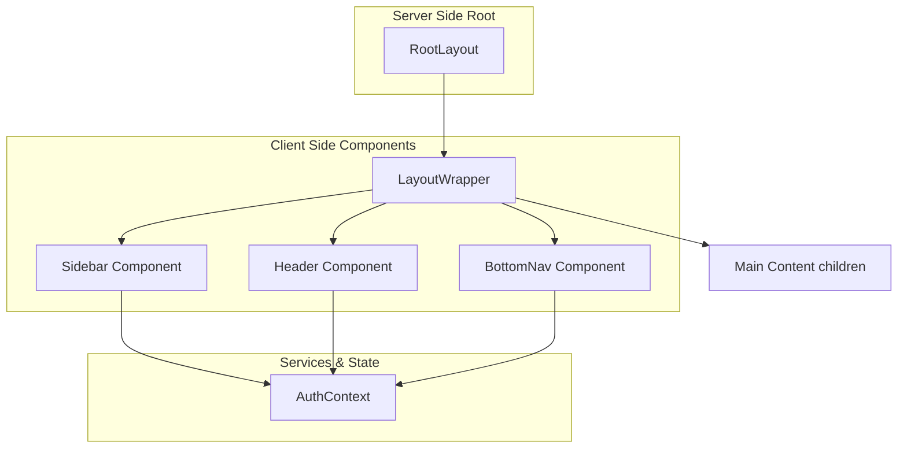
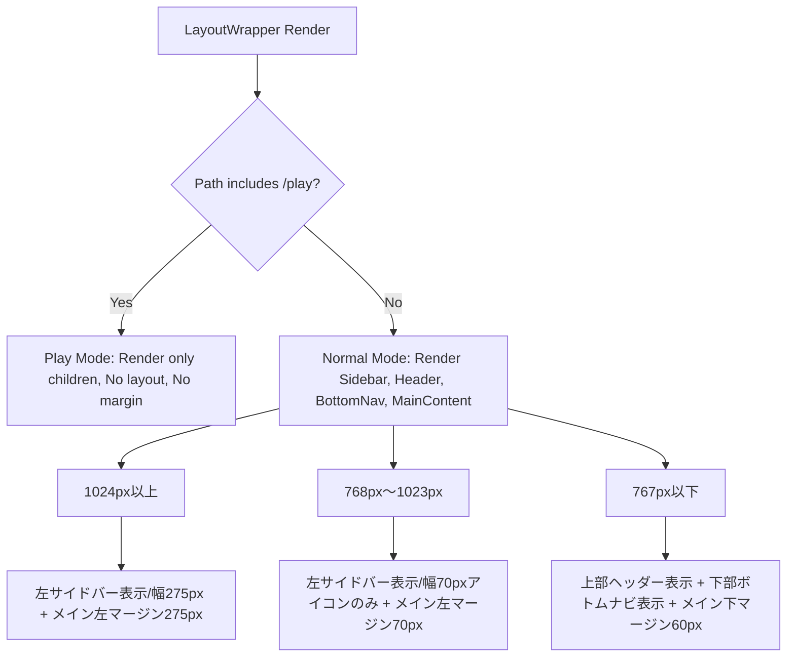

# Design Document: quizeum-sidebar-layout

## Overview
本機能は、Quizeumのグローバルナビゲーションおよび全体レイアウトを刷新し、PC/モバイルそれぞれの画面サイズに最適化したハイブリッドレイアウトへと移行するものです。

**Phase 22（2026-06-09）**: ディスカバリーホーム（`/`）と検索画面（`/search`）の IA 分離に伴い、Sidebar / BottomNav に「検索」導線を追加し、アクティブ状態を区別する。

**Phase 23（2026-06-09）**: ログイン時 Sidebar に「リスト」（`/lists`）・「マイクイズ」（`/my-quiz`）を追加し、アカウントポップアップに「設定」（`/settings`）を追加する。モバイルは BottomNav 5 項目を維持し、Header アバターのプロフィールポップアップで代替到達手段を提供する。

**Phase 26（2026-06-10）**: クイズリスト機能廃止に伴い、Sidebar および Header プロフィールポップアップから「リスト」（`/lists`）ナビを除去する。マイクイズ・設定導線は Phase 23 のまま維持する。

### Goals
- PC/タブレットサイズにおいて、画面左端にナビゲーション項目を一元化した左サイドバーを導入する。
- モバイルサイズ（767px以下）において、画面下部に主要遷移先を配置したボトムナビゲーションを導入し、上部ヘッダーを軽量なミニヘッダーへとリファクタリングする。
- 各デバイスサイズに合わせたメインコンテンツエリアの適切な余白とパディング制御を、App Routerのサーバーコンポーネント構造を崩さずに提供する。

### Non-Goals
- `/play` パス（クイズプレイ画面）におけるナビゲーション要素の表示およびレイアウト変更（非表示のまま維持）。
- 各画面内部（ホーム、プロフィール等）の表示内容やデータフェッチロジック自体の変更。

---

## Boundary Commitments

### This Spec Owns
- グローバルレイアウト用コンポーネントである `LayoutWrapper` の実装。
- PC/タブレット用 `Sidebar` コンポーネントおよびスタイルの実装。
- モバイル用 `BottomNav` コンポーネントおよびスタイルの実装。
- モバイル用軽量ミニヘッダー `Header` へのリファクタリング。
- `layout.tsx` におけるレイアウト構造の統合。
- デバイス幅に応じた余白（パディング）制御および `/play` プレイ画面除外ロジック。
- **Phase 22**: Sidebar / BottomNav への「検索」（`/search`）導線、`/` と `/search` のアクティブ状態区別、`data-testid` 付与。
- **Phase 23**: Sidebar ログイン時「リスト」「マイクイズ」導線、ポップアップ「設定」導線、active 判定、`data-testid` 付与。モバイル Header プロフィールポップアップによる `/lists`・`/my-quiz`・`/settings` 到達手段。

### Out of Boundary
- `useAuth` フックおよび Firebase 認証状態の管理（`quizeum-auth-profile-ui` に依存）。
- プロフィール画面、通知画面、ブックマーク画面、作問画面などの各ルーティング遷移先の中身（コンテンツ部）。
- **Phase 23**: リスト探索・マイクイズ・設定各ページのコンテンツ UI、`ThemeProvider` / `layout.tsx` へのテーマ Provider 統合（`quizeum-user-settings-ui` が担当）。

### Allowed Dependencies
- **`useAuth`** (from `@/context/auth-context`): ログイン状態、ユーザー情報、アバター画像の取得。
- **`usePathname` / `useRouter`** (from `next/navigation`): 現在のパスの判定、ページ遷移処理。
- **`lucide-react`**: メニュー用アイコンコンポーネント。

### Revalidation Triggers
- 認証コンテキスト (`useAuth`) の返り値の型定義の変更。
- アプリケーション全体のメディアクエリ（ブレークポイント）定義の変更。

---

## Architecture

### Existing Architecture Analysis
- 従来は `src/app/layout.tsx` が直接 `Header` を読み込んでレンダリングしていたため、画面全体の枠組みをクライアントのパス監視等に基づいて制御することが難しかった。
- `Header` はデスクトップとモバイルの全ロジックを含んでおり、コードが肥大化していた。

### Architecture Pattern & Boundary Map
App Router のサーバーコンポーネント特性を保護するため、`RootLayout` はサーバーコンポーネントのまま維持し、クライアントサイドの状態監視（パスや認証状態）が必要なレイアウト構築部分を `LayoutWrapper` としてクライアントコンポーネント化して分離します。



### Technology Stack

| Layer | Choice / Version | Role in Feature | Notes |
| :--- | :--- | :--- | :--- |
| Frontend | Next.js 16.2.6 (App Router) | 全体レイアウト、ナビゲーション | クライアントコンポーネントによるレイアウト切り替え |
| UI/Styling | Vanilla CSS (CSS Modules) | 各コンポーネントのレスポンシブ配置、パディング制御 | TailwindCSSは使用しない |
| Icons | Lucide React | ナビゲーションメニュー用アイコン | |

---

## File Structure Plan

### Directory Structure
```
src/
├── app/
│   ├── layout.tsx                 # [MODIFY] LayoutWrapper の読み込みに変更
│   └── globals.css                # [MODIFY] 必要に応じてレイアウト共通のグローバルCSSを追加
└── components/
    └── layout/
        ├── header.tsx             # [MODIFY] モバイル専用ミニヘッダーに軽量化
        ├── header.module.css      # [MODIFY]
        ├── layout-wrapper.tsx     # [NEW] レイアウト全体を包むラッパー (Client Component)
        ├── layout-wrapper.module.css # [NEW]
        ├── sidebar.tsx            # [NEW] 左サイドバーコンポーネント
        ├── sidebar.module.css     # [NEW]
        ├── bottom-nav.tsx         # [NEW] モバイル用ボトムナビ
        └── bottom-nav.module.css  # [NEW]
```

### Modified Files

#### [layout.tsx](file:///d:/quizeum/src/app/layout.tsx)
- `<Header />` を直接読み込むのをやめ、新規作成する `<LayoutWrapper>` で `{children}` を包むように変更する。

#### [header.tsx](file:///d:/quizeum/src/components/layout/header.tsx)
- PC用のナビゲーションリンク、ユーザーメニュー、ドロップダウンを削除。
- モバイルサイズ（767px以下）のみで機能するミニヘッダーとして再設計。
- ロゴ、作問ショートカットボタン（ログイン時のみ）、アバター（ログイン時のみ、またはログインリンク）のみを表示。
- ハンバーガーメニューとスライドドロワーメニューのコードを完全に削除。

#### [header.module.css](file:///d:/quizeum/src/components/layout/header.module.css)
- モバイルミニヘッダー専用のスタイルのみに絞り込み、PC用スタイルの記述を削除。

---

## System Flows

### 画面サイズによるレイアウト切り替え
`LayoutWrapper` は、メディアクエリ（CSS）を使用してコンポーネントの表示・非表示を切り替え、メインコンテンツの余白を動的に制御します。



---

## Requirements Traceability

| Requirement | Summary | Components | Interfaces | Flows |
| :--- | :--- | :--- | :--- | :--- |
| **1.1** | PC版サイドバー表示（幅275px・テキスト付） | `Sidebar` | `Sidebar.module.css` | `画面サイズによるレイアウト切り替え` |
| **1.2** | タブレット版サイドバー表示（幅70px・アイコンのみ） | `Sidebar` | `Sidebar.module.css` | `画面サイズによるレイアウト切り替え` |
| **1.3** | 未ログイン時のサイドバー（ログインボタン表示） | `Sidebar` | `useAuth` 連携 | - |
| **1.4** | ログイン時のサイドバー（アバター・名前表示） | `Sidebar` | `useAuth` 連携 | - |
| **1.5** | アクティブパスのハイライト表示 | `Sidebar` | `usePathname` 連携 | - |
| **1.6** | クイズプレイ画面（`/play`）でのサイドバー非表示 | `LayoutWrapper` | `usePathname` 連携 | `画面サイズによるレイアウト切り替え` |
| **2.1** | モバイルログイン時のボトムナビ（4つの主要リンク） | `BottomNav` | `useAuth` 連携 | - |
| **2.2** | モバイル未ログイン時のボトムナビ（ホームのみ） | `BottomNav` | `useAuth` 連携 | - |
| **2.3** | クイズプレイ画面でのボトムナビ非表示 | `LayoutWrapper` | `usePathname` 連携 | `画面サイズによるレイアウト切り替え` |
| **3.1** | モバイル軽量ヘッダー（ロゴ、作問、アバター） | `Header` | `useAuth` 連携 | - |
| **3.2** | PC版でのモバイルヘッダー非表示 | `Header` | `Header.module.css` | `画面サイズによるレイアウト切り替え` |
| **3.3** | クイズプレイ画面でのモバイルヘッダー非表示 | `LayoutWrapper` | `usePathname` 連携 | `画面サイズによるレイアウト切り替え` |
| **4.1** | PC版コンテンツ余白（左275px） | `LayoutWrapper` | `layout-wrapper.module.css` | `画面サイズによるレイアウト切り替え` |
| **4.2** | タブレット版コンテンツ余白（左70px） | `LayoutWrapper` | `layout-wrapper.module.css` | `画面サイズによるレイアウト切り替え` |
| **4.3** | モバイル版コンテンツ余白（下60px） | `LayoutWrapper` | `layout-wrapper.module.css` | `画面サイズによるレイアウト切り替え` |
| **4.4** | クイズプレイ画面での余白排除 | `LayoutWrapper` | `layout-wrapper.module.css` | `画面サイズによるレイアウト切り替え` |

---

## Components and Interfaces

| Component | Domain/Layer | Intent | Req Coverage | Key Dependencies | Contracts |
| :--- | :--- | :--- | :--- | :--- | :--- |
| `LayoutWrapper` | UI / Layout | パス監視に基づくレイアウト適用と余白制御 | 1.6, 2.3, 3.3, 4.1-4.4 | `Sidebar`, `Header`, `BottomNav` | State |
| `Sidebar` | UI / Layout | PC/タブレット用グローバル縦型ナビゲーション | 1.1-1.5 | `useAuth`, `usePathname` | State |
| `Header` | UI / Layout | モバイル用軽量ミニヘッダー | 3.1, 3.2 | `useAuth` | State |
| `BottomNav` | UI / Layout | モバイル用下部固定グローバルナビゲーション | 2.1, 2.2 | `useAuth`, `usePathname` | State |

### [UI / Layout]

#### LayoutWrapper
* **Intent**: 現在のパス（`/play` 判定）に基づいて全体レイアウトの出し分けを行い、メインコンテンツエリアをラップする。
* **Responsibilities & Constraints**:
  * パスに `/play` が含まれる場合、ナビゲーション要素を一切レンダリングせず、余白なしで `{children}` を描画する。
  * それ以外の場合、サイドバー、ヘッダー、ボトムナビ、および余白制御クラスを持つメインコンテナをレンダリングする。

##### Interface Definition
```typescript
interface LayoutWrapperProps {
  children: React.ReactNode;
}
```

---

#### Sidebar
* **Intent**: PC（1024px以上）およびタブレット（768px〜1023px）での縦型グローバルナビゲーションの表示とアカウントメニューの提供。
* **Responsibilities & Constraints**:
  * 1024px以上では幅275pxでロゴ、アイコン、ラベルテキストを表示する。
  * 768px〜1023pxでは幅70pxでアイコンのみを表示する。
  * 767px以下では非表示にする。
  * 最下部にプロフィールアバターとユーザー名を表示し、クリック時に「マイページ遷移」「ログアウト」等を含むドロップダウン（ポップアップ）を上方向に展開する。

##### Interface Definition
```typescript
interface SidebarProps {
  // 特別なPropsは不要、内部でグローバルフック（useAuth, usePathname）を監視
}
```

---

#### BottomNav
* **Intent**: モバイルサイズ（767px以下）での画面下部ナビゲーションの提供。
* **Responsibilities & Constraints**:
  * 767px以下でのみ画面最下部に固定表示する（高さ約60px）。
  * 768px以上では非表示にする。
  * ログイン時は、ホーム、通知、ブックマーク、プロフィール（アバター）の4項目を表示する。
  * 未ログイン時は、ホームリンクのみを表示する。

##### Interface Definition
```typescript
interface BottomNavProps {
  // 内部でグローバルフック（useAuth, usePathname）を監視
}
```

---

#### Header (Mobile Mini Header)
* **Intent**: モバイルサイズ（767px以下）用の必要最小限のブランドおよびアバターメニュー用ヘッダー。
* **Responsibilities & Constraints**:
  * 767px以下でのみ画面上部に固定表示する。
  * 768px以上では非表示にする。
  * 左端にロゴ、右端に「作問する（アイコン）」および「ユーザーアバター」を配置する。未ログイン時はログインリンクを表示する。

##### Interface Definition
```typescript
interface HeaderProps {
  // 内部でグローバルフック（useAuth）を監視
}
```

---

## Error Handling

### Error Strategy
レイアウトエラーおよび認証情報の取得失敗（`useAuth` のエラーやロード中状態）に対するハンドリング：
- **認証情報のロード中**:
  - `Sidebar` のアバター領域や `Header` のアバター領域では、ロード中であることを示すスケルトンアニメーション（`src/components/layout/header.tsx` に既存の `skeletonAvatar` クラス等）を表示し、レイアウトが崩れるのを防ぎます。
- **サインアウト失敗時**:
  - ログアウトボタン押下時に Firebase Auth のサインアウトが失敗した場合、コンソールにエラーを出力し、画面上に「ログアウトに失敗しました」等のフォールバックアラートを表示します。

---

## Testing Strategy

### Unit / Component Tests
- **Sidebar Component**:
  - 画面幅に応じたテキストの表示・非表示（1024px以上で表示、1023px以下で非表示）が正しくCSSクラスで制御されることの検証。
  - ログイン状態／未ログイン状態でのメニュー項目の出し分けテスト。
- **BottomNav Component**:
  - ログイン状態／未ログイン状態での表示アイコン数（4つ vs 1つ）の出し分けテスト。

### E2E / UI Tests
- **デスクトップレイアウトテスト (1200px)**:
  - 左サイドバー（ロゴ、メニュー、プロフィール）が表示され、上部ヘッダーおよびボトムナビが非表示であることを検証。
  - 各メニュー項目（ホーム、通知、ブックマーク）をクリックした際、対応するパスへ正しく遷移することを検証。
- **モバイルレイアウトテスト (375px)**:
  - 上部ミニヘッダーおよび下部ボトムナビが表示され、左サイドバーが非表示であることを検証。
  - ボトムナビのアイコンタップによる画面遷移を検証。
- **プレイ画面除外テスト**:
  - `/play/[quizId]` パスにアクセスした際、サイドバー、ヘッダー、ボトムナビがすべてレンダリングされず、メインコンテンツが余白なしで全画面表示されることを検証。

---

## Phase 22: ホーム／検索 IA 分離に伴うナビ更新

### 1. Overview

Sidebar および BottomNav に「検索」（`/search`）を追加し、ディスカバリーホーム（`/`）と検索画面をナビ上で区別する。ロゴリンクは引き続き `/` を正とする。

### 2. Boundary Commitments（Phase 22）

| Owns | Out |
|------|-----|
| Sidebar / BottomNav 項目追加 | カルーセル・フィルタ UI |
| `/` vs `/search` active 判定 | URL クエリ lib |
| `data-testid` 付与 | 検索画面コンテンツ |

### 3. Navigation Items

#### Sidebar `menuItems`（ログイン前後共通の先頭）

```typescript
const menuItems = [
  { href: '/', label: 'ホーム', icon: <Home />, testId: 'nav-home' },
  { href: '/search', label: '検索', icon: <Search />, testId: 'nav-search' },
  { href: '/pricing', label: 'Proプラン', icon: <Sparkles /> },
  // ... ログイン時: 通知、ブックマーク 等
];
```

- `Search` アイコン: `lucide-react` の `Search`
- active 判定:
  - `pathname === '/'` → ホーム active（`/search` は非 active）
  - `pathname === '/search' || pathname.startsWith('/search?')` → 検索 active

#### BottomNav（767px 以下）

| 状態 | 表示リンク |
|------|-----------|
| 未ログイン | ホーム（`/`）、検索（`/search`） |
| ログイン | ホーム、検索、通知、ブックマーク、プロフィール |

- 5 アイコン化に伴い、`bottom-nav.module.css` で `flex: 1` 均等配置を維持
- `data-testid`: `bottom-nav-home`（`/`）、`bottom-nav-search`（`/search`）

### 4. Active Path Logic

```typescript
function isHomeActive(pathname: string | null): boolean {
  return pathname === '/';
}

function isSearchActive(pathname: string | null): boolean {
  return pathname === '/search' || (pathname?.startsWith('/search/') ?? false);
}
```

- クエリ付き `/search?tab=trending` も Next.js App Router では `pathname === '/search'` のため追加判定不要

### 5. File Structure Plan（Phase 22）

| ファイル | 操作 | 責務 |
|----------|------|------|
| `src/components/layout/sidebar.tsx` | **Modify** | 検索項目、active 判定、testid |
| `src/components/layout/sidebar.module.css` | **Modify** | （必要時）項目数増の余白 |
| `src/components/layout/bottom-nav.tsx` | **Modify** | 検索リンク、5アイコン、testid |
| `src/components/layout/bottom-nav.module.css` | **Modify** | 5列均等レイアウト |
| `tests/components/sidebar-nav.test.tsx` | **New** | `/` vs `/search` active |
| `tests/components/bottom-nav.test.tsx` | **Modify** | 検索リンク・件数 |

### 6. Requirements Traceability（Phase 22）

| Req | Summary | Component |
|-----|---------|-----------|
| 1.6–1.10 | Sidebar 検索・active | `sidebar.tsx` |
| 2.1–2.4 | BottomNav 検索・active | `bottom-nav.tsx` |
| 5.1–5.6 | Phase 22 専項 | 同上 |

### 7. Testing Strategy（Phase 22）

| 種別 | 検証 |
|------|------|
| **Component** | `/search` で `nav-search` active、`nav-home` 非 active |
| **Component** | `/` で逆 |
| **E2E** | Sidebar「検索」→ `/search` 遷移 |
| **E2E** | BottomNav 検索アイコン → `/search` |

**Effort**: **S**（0.5–1日）

**Document Status（Phase 22 設計）**: 本節に反映。

---

## Phase 23: リスト・マイクイズ・設定ナビ拡張

### 1. Overview

ログインユーザー向けに Sidebar 主要ナビへ「リスト」（`/lists`）と「マイクイズ」（`/my-quiz`）を追加し、Sidebar フッターのアカウントポップアップに「設定」（`/settings`）を挿入する。未ログイン時はリスト・マイクイズを非表示とし、既存のログインボタン導線を維持する。

モバイル（767px 以下）では BottomNav を 5 項目（ホーム・検索・通知・ブックマーク・プロフィール）のまま維持し、**Header のアバタータップで Sidebar と同型のプロフィールポップアップ（シート）** を開き、リスト・マイクイズ・設定・マイページ・ログアウトへ到達できるようにする。BottomNav のプロフィールタップは従来どおりマイページ直行を維持し、Header アバターがモバイル専用の拡張メニュー入口となる。

`layout.tsx` への `ThemeProvider` 統合は **本フェーズのスコープ外** とし、`quizeum-user-settings-ui` が Provider を所有する。本スペックはシェル（Sidebar / Header / BottomNav / LayoutWrapper）のナビ整合のみを担当する。

### 2. Boundary Commitments（Phase 23）

| Owns | Out |
|------|-----|
| Sidebar ログイン時「リスト」「マイクイズ」項目追加 | リスト探索ページ UI（`quizeum-lists-discovery-ui`） |
| Sidebar ポップアップ「設定」リンク（`/settings`） | マイクイズページ UI（`quizeum-my-quiz-ui`） |
| `isListsActive` / `isMyQuizActive` active 判定 | 設定ページ・ThemeProvider（`quizeum-user-settings-ui`） |
| `data-testid`: `nav-lists`, `nav-my-quiz`, `sidebar-settings-link` | マイページからのリアクション履歴削除（`quizeum-auth-profile-ui`） |
| モバイル Header プロフィールポップアップ（代替到達手段） | `layout.tsx` への ThemeProvider 追加 |

**layout.tsx 協調メモ**: `quizeum-user-settings-ui` が `ThemeProvider` と inline テーマ初期化 script を `layout.tsx` に追加する。本フェーズでは `layout.tsx` を変更しない（ThemeProvider 未導入状態でも Sidebar / Header のナビ拡張は独立して実装可能）。両スペックのマージ順は user-settings → sidebar-layout を推奨。

### 3. Navigation Items

#### Sidebar `menuItems`（ログイン時のみ追加）

```typescript
// ログイン時、通知・ブックマークの直前に挿入
if (user) {
  menuItems.push(
    { href: '/lists', label: 'リスト', icon: <List size={22} />, testId: 'nav-lists' },
    { href: '/my-quiz', label: 'マイクイズ', icon: <ClipboardList size={22} />, testId: 'nav-my-quiz' },
    { href: '/notifications', label: '通知', icon: <Bell size={22} /> },
    { href: '/bookmarks', label: 'ブックマーク', icon: <Bookmark size={22} /> }
  );
}
```

- **リスト** アイコン: `lucide-react` の `List`
- **マイクイズ** アイコン: `lucide-react` の `ClipboardList`（代替候補: `BookMarked`。視認性比較後に確定可）
- 配置順: ホーム → 検索 → Proプラン → **リスト** → **マイクイズ** → 通知 → ブックマーク → ダッシュボード → 作問
- 未ログイン時: リスト・マイクイズは `menuItems.push` しない（Req 6.2）

#### Sidebar アカウントポップアップ（ログイン時）

```tsx
<Link href={`/profile/${user.id}`} className={styles.popupItem} onClick={() => setPopupOpen(false)}>
  <UserIcon size={18} />
  <span>マイページ</span>
</Link>
<Link
  href="/settings"
  className={styles.popupItem}
  onClick={() => setPopupOpen(false)}
  data-testid="sidebar-settings-link"
>
  <Settings size={18} />  {/* lucide-react Settings */}
  <span>設定</span>
</Link>
<hr className={styles.divider} />
<button onClick={handleLogout} ...>ログアウト</button>
```

- 「設定」は **マイページの直下・区切り線（`<hr>`）の上** に配置（Req 6.8）
- クリック時: `/settings` へ遷移し `setPopupOpen(false)`（Req 6.9）
- `/settings` 表示中の Sidebar 主要ナビ active 化は **任意**（Req 6.11）。初版は active なしでよい

#### BottomNav（767px 以下）— 変更最小

| 状態 | 表示リンク | Phase 23 変更 |
|------|-----------|---------------|
| 未ログイン | ホーム、検索 | なし |
| ログイン | ホーム、検索、通知、ブックマーク、プロフィール | **なし**（5 項目維持） |

- BottomNav プロフィールは引き続き `/profile/${user.id}` 直行
- リスト・マイクイズ・設定への到達は Header ポップアップが担う（Req 6.12–6.13）

#### モバイル Header プロフィールポップアップ（推奨案）

現状 Header アバターは `<Link href={/profile/...}>` で直行している。Phase 23 では Sidebar と同型のポップアップパターンに変更する。

```tsx
// header.tsx — ログイン時アバター
<button
  className={styles.avatarBtn}
  onClick={() => setPopupOpen(!popupOpen)}
  data-testid="header-profile-btn"
  aria-expanded={popupOpen}
>
  
</button>
{popupOpen && (
  <div className={styles.profileSheet} data-testid="header-profile-popup">
    <Link href="/lists" data-testid="header-nav-lists" onClick={close}>リスト</Link>
    <Link href="/my-quiz" data-testid="header-nav-my-quiz" onClick={close}>マイクイズ</Link>
    <Link href={`/profile/${user.id}`} onClick={close}>マイページ</Link>
    <Link href="/settings" data-testid="header-settings-link" onClick={close}>設定</Link>
    <button onClick={handleLogout}>ログアウト</button>
  </div>
)}
```

**モバイル代替案（設計記録）**

| 案 | 概要 | 評価 |
|----|------|------|
| **A（推奨）** | Header アバター → ポップアップシート（リスト・マイクイズ・設定含む） | BottomNav 5 項目維持。Sidebar ポップアップと UX 一貫。Header に既存アバターあり |
| B | BottomNav プロフィール長押し / 二段タップでシート | 発見性低。既存 E2E（プロフィール直行）への影響大 |
| C | BottomNav に 6–7 項目追加 | タップ領域過密。非推奨 |
| D | ハンバーガーメニュー復活 | Phase 1 で削除済み。回帰リスク |

初版は **案 A** を採用。`header.module.css` にポップアップ／バックドロップスタイルを追加（Sidebar の `popupMenu` / `popupItem` パターンを参考に共通化は任意、初版は Header 内完結で可）。

### 4. Active Path Logic

```typescript
function isListsActive(pathname: string | null): boolean {
  return pathname === '/lists' || (pathname?.startsWith('/lists/') ?? false);
}

function isMyQuizActive(pathname: string | null): boolean {
  return pathname === '/my-quiz' || (pathname?.startsWith('/my-quiz/') ?? false);
}
```

`isNavItemActive` を拡張:

```typescript
const isNavItemActive = (href: string): boolean => {
  if (href === '/') return pathname === '/';
  if (href === '/search') {
    return pathname === '/search' || (pathname?.startsWith('/search/') ?? false);
  }
  if (href === '/lists') return isListsActive(pathname);
  if (href === '/my-quiz') return isMyQuizActive(pathname);
  return pathname === href;
};
```

- `/lists/create` 等の子ルートもリスト active（Req 6.5）
- `/my-quiz/...` 子ルートもマイクイズ active（Req 6.6）
- `/settings` は Sidebar 主要ナビに含めないため active 判定不要（Req 6.11）

### 5. File Structure Plan（Phase 23）

| ファイル | 操作 | 責務 |
|----------|------|------|
| `src/components/layout/sidebar.tsx` | **Modify** | リスト・マイクイズ menuItems、設定ポップアップ、`isNavItemActive` 拡張、`Settings`/`List`/`ClipboardList` import |
| `src/components/layout/sidebar.module.css` | **Modify** | （必要時）ナビ項目増のスクロール・余白調整 |
| `src/components/layout/header.tsx` | **Modify** | モバイルアバター → ポップアップシート、リスト・マイクイズ・設定・マイページ・ログアウト |
| `src/components/layout/header.module.css` | **Modify** | ポップアップシート・バックドロップ・avatarBtn スタイル |
| `src/components/layout/bottom-nav.tsx` | **—** | Phase 23 変更なし（5 項目維持） |
| `tests/components/sidebar.test.tsx` | **Modify** | リスト・マイクイズ表示/非表示、active、設定リンク、testid |
| `tests/components/header.test.tsx` | **New or Modify** | モバイルポップアップ、リスト・マイクイズ・設定到達 |

**変更しないファイル**: `layout.tsx`（ThemeProvider は user-settings が担当）、`layout-wrapper.tsx`、`bottom-nav.module.css`

### 6. Requirements Traceability（Phase 23）

| Req | Summary | Component |
|-----|---------|-----------|
| 6.1 | ログイン時 Sidebar にリスト・マイクイズ | `sidebar.tsx` |
| 6.2 | 未ログイン時非表示 | `sidebar.tsx` |
| 6.3–6.4 | クリックで `/lists` / `/my-quiz` 遷移 | `sidebar.tsx` |
| 6.5–6.6 | lists / my-quiz active（startsWith） | `sidebar.tsx` |
| 6.7 | testid `nav-lists`, `nav-my-quiz` | `sidebar.tsx` |
| 6.8–6.10 | ポップアップ設定リンク | `sidebar.tsx` |
| 6.11 | `/settings` active 任意 | —（初版: 主要ナビ active なし） |
| 6.12–6.13 | モバイル代替到達（同一ルート） | `header.tsx` |
| 6.14–6.17 | 隣接スペック境界 | Out of scope |

### 7. Testing Strategy（Phase 23）

| 種別 | 検証 |
|------|------|
| **Component** | 未ログイン: `nav-lists` / `nav-my-quiz` 不在 |
| **Component** | ログイン: リスト・マイクイズ表示、`nav-lists` / `nav-my-quiz` testid |
| **Component** | `/lists` で `nav-lists` active、`/lists/create` でも active |
| **Component** | `/my-quiz` で `nav-my-quiz` active |
| **Component** | ポップアップ開閉 → `sidebar-settings-link` 表示 → クリックで閉じる |
| **Component** | Header `header-profile-btn` → ポップアップ → `header-nav-lists` / `header-settings-link` |
| **E2E** | Desktop: Sidebar「リスト」→ `/lists` 遷移 |
| **E2E** | Desktop: Sidebar ポップアップ「設定」→ `/settings` 遷移 |
| **E2E** | Mobile 375px: Header アバター → ポップアップ → 「マイクイズ」→ `/my-quiz` |
| **Regression** | BottomNav 5 項目・プロフィール直行が維持されること |

**Effort**: **S**（0.5–1日）

**Document Status（Phase 23 設計）**: 本節に反映。

---

## Phase 26: リストナビ項目の除去

### 1. Overview

`quizeum-core`・`quizeum-play-flow-ui`・`quizeum-creator-dash-ui`・`quizeum-my-quiz-ui` における Phase 26 リスト機能廃止に追随し、本スペックが所有するグローバルナビから廃止ルート `/lists` への導線を除去する。

**現状（実装ギャップ）**: `sidebar.tsx` に `nav-lists`（`/lists`）が残存し、`header.tsx` のプロフィールポップアップに `header-nav-lists` が残存している。`/lists` はルート削除済みのため 404 を返すが、ナビからの遷移は UX 上のデッドリンクとなる。

**変更後**: ログイン時 Sidebar は「マイクイズ」のみリスト関連項目を持たず（リスト項目なし）、Header ポップアップはマイクイズ・マイページ・設定・ログアウトのみ。BottomNav は変更なし（5 項目維持）。

### 2. Boundary Commitments（Phase 26）

| Owns | Out |
|------|-----|
| Sidebar から「リスト」menuItem 除去 | `/lists` ページ・ルート除去（`quizeum-play-flow-ui` 担当済み） |
| Header ポップアップから「リスト」リンク除去 | プロフィール「作成したリスト」タブ（`quizeum-auth-profile-ui`） |
| `nav-lists` / `header-nav-lists` testid 削除 | ブックマーク「リスト」タブ除去（`quizeum-play-flow-ui` 担当済み） |
| `/lists` active 判定の除去（残存時） | マイクイズのブックマークリストソース除去（`quizeum-my-quiz-ui` 担当済み） |
| 関連 Jest / E2E テスト更新 | `quizeum-lists-discovery-ui`（廃止） |

**維持（Phase 23 から変更なし）**

| 項目 | 到達先 | testid |
|------|--------|--------|
| Sidebar「マイクイズ」 | `/my-quiz` | `nav-my-quiz` |
| Sidebar ポップアップ「設定」 | `/settings` | `sidebar-settings-link` |
| Header ポップアップ「マイクイズ」 | `/my-quiz` | `header-nav-my-quiz` |
| Header ポップアップ「設定」 | `/settings` | `header-settings-link` |

### 3. Navigation Items（Phase 26 差分）

#### Sidebar `menuItems`（ログイン時 — リスト除去後）

```typescript
if (user) {
  menuItems.splice(
    2,
    0,
    { href: '/my-quiz', label: 'マイクイズ', icon: <ClipboardList size={22} />, testId: 'nav-my-quiz' },
  );
  menuItems.push(
    { href: '/notifications', label: '通知', icon: <Bell size={22} /> },
    { href: '/bookmarks', label: 'ブックマーク', icon: <Bookmark size={22} /> },
  );
}
```

- `List` アイコンおよび `nav-lists` を削除
- 配置順: ホーム → 検索 → **マイクイズ** → Proプラン → 通知 → ブックマーク → …

#### Header プロフィールポップアップ（リスト行削除後）

```tsx
<Link href="/my-quiz" data-testid="header-nav-my-quiz" onClick={close}>マイクイズ</Link>
<Link href={`/profile/${user.id}`} onClick={close}>マイページ</Link>
<Link href="/settings" data-testid="header-settings-link" onClick={close}>設定</Link>
<button onClick={handleLogout}>ログアウト</button>
```

- `header-nav-lists` 行を削除
- BottomNav は Phase 26 でも変更なし

#### Active Path Logic

- `isNavItemActive` から `href === '/lists'` 分岐を除去（`nav-active.ts` に残存する場合）
- `sidebar.tsx` 内の `isListsActive` 等のインライン判定があれば削除
- `/my-quiz` active 判定は Phase 23 のまま維持

### 4. File Structure Plan（Phase 26）

| ファイル | 操作 | 責務 |
|----------|------|------|
| `src/components/layout/sidebar.tsx` | **Modify** | `nav-lists` menuItem 削除、`List` import 削除 |
| `src/components/layout/header.tsx` | **Modify** | ポップアップ内 `/lists` リンク・`header-nav-lists` 削除 |
| `src/components/layout/nav-active.ts` | **Modify**（残存時） | `/lists` 分岐の除去確認 |
| `tests/components/sidebar.test.tsx` | **Modify** | `nav-lists` 関連アサーション削除、マイクイズ維持検証 |
| `tests/components/header-profile-popup.test.tsx` | **Modify** | `header-nav-lists` 削除、マイクイズ・設定維持 |
| `tests/components/layout/shell-smoke.test.tsx` | **Modify** | `nav-lists` 存在検証を削除 |
| `tests/components/nav-active.test.ts` | **Modify**（残存時） | `/lists` active ケース削除 |
| `e2e/layout.spec.ts` | **Modify** | Sidebar／Header から `/lists` 遷移テスト削除；Phase 26 404 テスト維持 |

**変更しないファイル**: `bottom-nav.tsx`、`layout-wrapper.tsx`、`sidebar.module.css`（項目数減のみでスタイル変更不要の見込み）

### 5. Requirements Traceability（Phase 26）

| Req | Summary | Component |
|-----|---------|-----------|
| 7.1–7.2 | Sidebar リスト項目・testid 除去 | `sidebar.tsx` |
| 7.3–7.4 | マイクイズ導線・active 維持 | `sidebar.tsx` |
| 7.5–7.7 | Header ポップアップリスト除去・他導線維持 | `header.tsx` |
| 7.8–7.9 | `/lists` active 判定除去 | `nav-active.ts` |
| 7.10–7.12 | テスト・E2E 更新 | `tests/`, `e2e/` |
| 7.13–7.16 | 隣接スペック境界 | Out of scope |

### 6. Testing Strategy（Phase 26）

| 種別 | 検証 |
|------|------|
| **Component** | ログイン時 Sidebar に `nav-lists` が存在しない |
| **Component** | ログイン時 Sidebar に `nav-my-quiz` が存在し、`/my-quiz` で active |
| **Component** | Header ポップアップに `header-nav-lists` が存在しない |
| **Component** | Header ポップアップに `header-nav-my-quiz`・`header-settings-link` が存在 |
| **Regression** | BottomNav 5 項目・設定ポップアップ（`sidebar-settings-link`）が維持 |
| **E2E** | `/lists` 直接アクセスが 404（既存 `layout.spec.ts` Phase 26 テスト） |
| **E2E** | Sidebar「リスト」→ `/lists`、Header「リスト」→ `/lists` シナリオが削除済み |

**Effort**: **S**（0.5日未満）

**Document Status（Phase 26 設計）**: 本節に反映。

---

## Phase 27: 管理者メニューへのナビ導線追加

### 1. Overview

システム管理者（Super Admin）向けに、PC用 Sidebar 主要ナビゲーション、Sidebar プロフィールポップアップ、モバイル用 Header プロフィールポップアップに「管理者メニュー」への遷移リンクを追加します。管理者判定は `quizeum-core` ですでに実装済みの `isAdminUser(user)` を使用します。

### 2. Boundary Commitments（Phase 27）

| Owns | Out |
|------|-----|
| Sidebar / Header における「管理者メニュー」リンク追加 | `/admin` 画面の実装（`quizeum-admin-users-ui` 等が担当） |
| `nav-admin`, `sidebar-admin-link`, `header-admin-link` testid | `isAdminUser` 判定ロジック（`quizeum-core` の既存ロジックを再利用） |
| `/admin` へのアクティブ状態の判定 | |

### 3. Navigation Items（Phase 27 差分）

#### Sidebar 主要ナビゲーション（`sidebar.tsx`）
`user` が存在し、かつ `isAdminUser(user)` が真の場合に、「ダッシュボード」リンクの下、「作問する」ボタンの上に「管理者メニュー」へのリンクを表示します。

```tsx
{user && isAdminUser(user) && (
  <Link
    href="/admin"
    className={cn(
      navLinkBase,
      (pathname === '/admin' || pathname?.startsWith('/admin/')) && navLinkActive
    )}
    data-testid="nav-admin"
  >
    <span className="flex size-6 shrink-0 items-center justify-center">
      <Shield size={22} />
    </span>
    <span className="nav-label max-lg:hidden">管理者メニュー</span>
  </Link>
)}
```

- **管理者メニュー** アイコン: `lucide-react` の `Shield`
- 配置位置: ダッシュボード（`/creator/dashboard`）リンクの下、作問する（`/quiz/create`）リンクの上。

#### Sidebar アカウントポップアップ（`sidebar.tsx`）
ドロップダウンメニューの先頭（マイページの上）に「管理者メニュー」を表示します。

```tsx
<DropdownMenuContent
  side="right"
  align="end"
  sideOffset={12}
  className="z-[100] w-[220px]"
>
  {isAdminUser(user) && (
    <DropdownMenuItem
      render={
        <Link
          href="/admin"
          onClick={() => setPopupOpen(false)}
          data-testid="sidebar-admin-link"
        />
      }
    >
      <Shield size={18} />
      <span>管理者メニュー</span>
    </DropdownMenuItem>
  )}
  <DropdownMenuItem
    render={
      <Link href={`/profile/${user.id}`} onClick={() => setPopupOpen(false)} />
    }
  >
    <UserIcon size={18} />
    <span>マイページ</span>
  </DropdownMenuItem>
...
```

#### Header プロフィールポップアップ（`header.tsx`）
ドロップダウンメニューの先頭（マイクイズの上）に「管理者メニュー」を表示します。

```tsx
<DropdownMenuContent
  align="end"
  sideOffset={12}
  className="w-[200px]"
  data-testid="header-profile-popup"
>
  {isAdminUser(user) && (
    <DropdownMenuItem
      render={
        <Link
          href="/admin"
          onClick={() => setPopupOpen(false)}
          data-testid="header-admin-link"
        />
      }
    >
      <Shield size={18} />
      <span>管理者メニュー</span>
    </DropdownMenuItem>
  )}
  <DropdownMenuItem
    render={
      <Link
        href="/my-quiz"
        onClick={() => setPopupOpen(false)}
        data-testid="header-nav-my-quiz"
      />
    }
  >
    <ClipboardList size={18} />
    <span>マイクイズ</span>
  </DropdownMenuItem>
...
```

### 4. File Structure Plan（Phase 27）

| ファイル | 操作 | 責務 |
|----------|------|------|
| `src/components/layout/sidebar.tsx` | **Modify** | 主要ナビに「管理者メニュー」リンク追加、プロフィールドロップダウンに「管理者メニュー」追加、`isAdminUser` と `Shield` のインポートおよび使用 |
| `src/components/layout/header.tsx` | **Modify** | プロフィールドロップダウンに「管理者メニュー」追加、`isAdminUser` と `Shield` のインポートおよび使用 |
| `tests/components/sidebar.test.tsx` | **Modify** | 管理者ログイン時の `nav-admin`・`sidebar-admin-link` の存在検証、一般ユーザー時の非表示検証 |
| `tests/components/header.test.tsx` | **Modify** | 管理者ログイン時の `header-admin-link` の存在検証、一般ユーザー時の非表示検証 |

### 5. Requirements Traceability（Phase 27）

| Req | Summary | Component |
|-----|---------|-----------|
| 8.1 | 管理者ログイン時の Sidebar 「管理者メニュー」主要ナビ表示 | `sidebar.tsx` |
| 8.2 | 未ログイン・非管理者時の「管理者メニュー」非表示 | `sidebar.tsx`, `header.tsx` |
| 8.3 | 「管理者メニュー」クリックで `/admin` への遷移 | `sidebar.tsx`, `header.tsx` |
| 8.4 | 現在のパスが `/admin` / `/admin/` のときのアクティブ表示 | `sidebar.tsx` |
| 8.5 | testid `nav-admin` の付与 | `sidebar.tsx` |
| 8.6 | 管理者ログイン時の Sidebar ポップアップ内表示 | `sidebar.tsx` |
| 8.7 | 管理者ログイン時の Header ポップアップ内表示 | `header.tsx` |
| 8.8 | testid `sidebar-admin-link` の付与 | `sidebar.tsx` |
| 8.9 | testid `header-admin-link` の付与 | `header.tsx` |

### 6. Testing Strategy（Phase 27）

| 種別 | 検証 |
|------|------|
| **Component** | 非管理者ユーザー（一般ユーザー、または未ログイン）: `nav-admin` / `sidebar-admin-link` / `header-admin-link` が表示されないこと。 |
| **Component** | 管理者ユーザー: `nav-admin` が主要ナビに表示され、`data-testid="nav-admin"` が付与されること。 |
| **Component** | 管理者ユーザー: PC用 Sidebar / モバイル用 Header のドロップダウンを開いた際、`sidebar-admin-link` / `header-admin-link` が表示されること。 |
| **Component** | パスが `/admin` の際、Sidebar の「管理者メニュー」がアクティブ（ハイライト）になること。 |

**Effort**: **S**（0.5日未満）

**Document Status（Phase 27 設計）**: 本節に反映。

---

## Phase 28: PC版サイドバー表示切り替えおよびミニ表示時のツールチップ表示

### 1. Overview

PC表示時（1024px以上）における、サイドバーの通常表示（275px）とミニ表示（70px）のトグル切り替え機能（状態は永続化しない）を実装し、メインコンテンツの余白も連動させます。ミニ表示時には、ホバーによるツールチップ形式のメニュー名（プロフィールはユーザー名）を表示します。また、アバタークリック時はドロップダウンを廃止し、直接プロフィールページ（`/profile/[userId]`）へ遷移するように変更します。

### 2. Boundary Commitments（Phase 28）

| Owns | Out |
|------|-----|
| `LayoutWrapper` 内での `isCollapsed` 状態の管理とパディング動的調整 | `/profile/[userId]` ページの中身やデータの制御 |
| `Sidebar` への `isCollapsed` / `onToggle` Props の引き渡し | `/settings`（設定）画面自体の遷移先中身 |
| `Sidebar` の幅（70px vs 275px）の動的スタイル切り替え | |
| `Sidebar` への折りたたみトグルボタンの追加 | |
| 各メニュー項目（プロフィールアバター含む）へのCSSツールチップの組み込み | |
| プロフィールアイコンをクリックした際の直接遷移（ドロップダウン廃止） | |

### 3. Components & Interfaces（Phase 28 差分）

#### `LayoutWrapper` ([layout-wrapper.tsx](file:///d:/quizeum/src/components/layout/layout-wrapper.tsx))
サイドバーの切り替え状態を保持し、メインコンテンツの左側パディングを動的に切り替えます。

```tsx
export const LayoutWrapper: React.FC<{ children: React.ReactNode }> = ({ children }) => {
  const pathname = usePathname();
  const [isCollapsed, setIsCollapsed] = useState(false); // [NEW] 切り替え状態の管理

  const isPlayPage = pathname ? pathname.includes('/play') : false;

  if (isPlayPage) {
    return <div className="min-h-screen bg-background">{children}</div>;
  }

  return (
    <div
      className={cn(
        "relative flex min-h-screen max-w-[100vw] overflow-x-hidden bg-background max-md:pb-[60px]",
        // isCollapsed に基づいてパディングを動的調整 (PC表示時 lg: のみ)
        isCollapsed ? "md:pl-[70px] lg:pl-[70px]" : "md:pl-[70px] lg:pl-[275px]"
      )}
    >
      {/* Sidebar に状態とトグル関数を渡す */}
      <Sidebar isCollapsed={isCollapsed} onToggle={() => setIsCollapsed(!isCollapsed)} />
      ...
    </div>
  );
};
```

#### `Sidebar` ([sidebar.tsx](file:///d:/quizeum/src/components/layout/sidebar.tsx))
Props を受け取り、サイドバーの幅やテキストラベルの表示・非表示を制御します。また、トグルボタンとツールチップを追加します。

##### Props の定義
```typescript
interface SidebarProps {
  isCollapsed: boolean;
  onToggle: () => void;
}
```

##### 主要コンポーネント構造
```tsx
export const Sidebar: React.FC<SidebarProps> = ({ isCollapsed, onToggle }) => {
  ...
  return (
    <aside
      className={cn(
        "fixed top-0 left-0 z-[90] box-border hidden h-screen flex-col border-r border-border bg-background/95 backdrop-blur supports-[backdrop-filter]:bg-background/80 md:flex max-md:hidden transition-all duration-200",
        // isCollapsed に基づいて幅を動的調整
        isCollapsed ? "md:w-[70px] md:px-2 lg:w-[70px] lg:px-2" : "md:w-[70px] md:px-2 lg:w-[275px] lg:px-4"
      )}
    >
      {/* [NEW] PC表示時のみ表示される折りたたみトグルボタン */}
      <button
        type="button"
        onClick={onToggle}
        className="absolute right-[-14px] top-6 z-[100] hidden lg:flex size-7 items-center justify-center rounded-full border border-border bg-background shadow-md hover:bg-muted text-muted-foreground transition-colors"
        data-testid="sidebar-toggle-btn"
        aria-label="Toggle Sidebar"
      >
        {isCollapsed ? <ChevronRight size={14} /> : <ChevronLeft size={14} />}
      </button>

      <div className="mb-8 px-2 md:max-lg:px-0">
        <Link href="/" className="flex items-center text-2xl font-extrabold tracking-tight lg:text-3xl">
          <span>Quiz</span>
          {/* 通常表示かつ非折りたたみ時のみテキストを表示 */}
          <span className={cn("lg:inline md:max-lg:hidden", isCollapsed && "lg:hidden")}>eum</span>
        </Link>
      </div>

      <nav className="flex flex-1 flex-col gap-3 ...">
        {menuItems.map((item) => {
          const isActive = isNavItemActive(pathname, item.href);
          return (
            <Link
              key={item.href}
              href={item.href}
              className={cn(navLinkBase, isActive && navLinkActive, "group relative")}
              {...(item.testId ? { 'data-testid': item.testId } : {})}
            >
              <span className="flex size-6 shrink-0 items-center justify-center">{item.icon}</span>
              {/* 通常表示かつ非折りたたみ時のみラベルを表示 */}
              <span className={cn("nav-label max-lg:hidden", isCollapsed && "lg:hidden")}>{item.label}</span>
              {/* [NEW] ミニサイドバー表示時（isCollapsedまたはタブレットサイズ）にホバーで出るツールチップ */}
              <span className={cn(
                "absolute left-full ml-3 z-[100] hidden bg-popover text-popover-foreground px-2 py-1 rounded text-xs pointer-events-none whitespace-nowrap border border-border shadow-md group-hover:block",
                isCollapsed ? "lg:group-hover:block" : "lg:group-hover:hidden"
              )}>
                {item.label}
              </span>
            </Link>
          );
        })}
      </nav>

      {/* [MODIFY] アカウント領域（DropdownMenuを廃止し、直接リンクとツールチップに変更） */}
      <div className="mt-auto border-t border-border pt-4">
        {loading ? (
          <Skeleton className="size-11 rounded-full" />
        ) : user ? (
          <Link
            href={`/profile/${user.id}`}
            className="flex w-full items-center gap-3 rounded-full p-2 text-left transition-colors hover:bg-muted/50 md:max-lg:mx-auto md:max-lg:size-11 md:max-lg:justify-center md:max-lg:p-0 group relative"
            data-testid="sidebar-profile-btn"
          >
            <Avatar size="sm" className="size-10">
              <AvatarImage src={user.avatarUrl} alt={user.displayName} />
              <AvatarFallback>{user.displayName.slice(0, 1)}</AvatarFallback>
            </Avatar>
            <div className={cn("min-w-0 flex-1 max-lg:hidden", isCollapsed && "lg:hidden")}>
              <span className="block truncate text-sm font-semibold">{user.displayName}</span>
            </div>
            {/* [NEW] アバターホバー時のツールチップ */}
            <span className={cn(
              "absolute left-full ml-3 z-[100] hidden bg-popover text-popover-foreground px-2 py-1 rounded text-xs pointer-events-none whitespace-nowrap border border-border shadow-md group-hover:block",
              isCollapsed ? "lg:group-hover:block" : "lg:group-hover:hidden"
            )}>
              {user.displayName}
            </span>
          </Link>
        ) : (
          <Link href="/login" className={cn(buttonVariants(), 'w-full justify-center')} data-analytics="nav-login">
            ログイン
          </Link>
        )}
      </div>
    </aside>
  );
};
```

### 4. File Structure Plan（Phase 28）

| ファイル | 操作 | 責務 |
|----------|------|------|
| `src/components/layout/layout-wrapper.tsx` | **Modify** | `isCollapsed` 状態の定義、`Sidebar` への props 伝播、左パディング（`pl`）の動的スタイル切り替え |
| `src/components/layout/sidebar.tsx` | **Modify** | props インタフェース拡張、トグルボタン（`ChevronLeft`, `ChevronRight`）の実装、アバターの直接リンク化（`DropdownMenu` 廃止）、CSS/Tailwindによるツールチップ（`group relative` / `absolute`）の追加 |
| `tests/components/sidebar.test.tsx` | **Modify** | トグルボタンのクリックテスト、アバター直接遷移テスト、ツールチップ要素の表示確認テスト |

### 5. Requirements Traceability（Phase 28）

| Req | Summary | Component |
|-----|---------|-----------|
| 9.1 | PCサイズ（1024px+）での切り替えトグルボタン表示 | `sidebar.tsx` |
| 9.2 | トグルボタンクリック時の幅および左余白の連動切り替え | `layout-wrapper.tsx`, `sidebar.tsx` |
| 9.3 | 切り替え状態を永続化せずデフォルト通常表示とすること | `layout-wrapper.tsx` |
| 9.4 | ミニサイドバー時のナビ項目のツールチップ表示 | `sidebar.tsx` |
| 9.5 | ミニサイドバー時のプロフィールアバターホバー時のユーザー名表示 | `sidebar.tsx` |
| 9.6 | プロフィールアイコンクリック時の直接マイページ遷移（ドロップダウン廃止） | `sidebar.tsx` |
| 9.7 | トグルボタンへの `data-testid="sidebar-toggle-btn"` 付与 | `sidebar.tsx` |

### 6. Testing Strategy（Phase 28）

| 種別 | 検証 |
|------|------|
| **Component** | 初期状態でサイドバーが通常表示（275px）であること。 |
| **Component** | トグルボタン（`sidebar-toggle-btn`）をクリックすると、サイドバーがミニ表示（70px）に縮小されること。 |
| **Component** | ミニ表示時、ナビゲーションアイテムおよびアバター領域に `group` とツールチップ用の絶対配置要素が存在すること。 |
| **Component** | アバター（`sidebar-profile-btn`）をクリックした際、ドロップダウンメニューが開かず、直接マイページへ遷移する構造になっていること。 |
| **E2E** | PC表示（1200px）でトグルボタンをクリックした際、`LayoutWrapper` に対応する縮小余白クラス（`lg:pl-[70px]`）が適用され、レイアウトが崩れないことを確認。 |

**Effort**: **S**（1日）

**Document Status（Phase 28 設計）**: 本節に反映。


