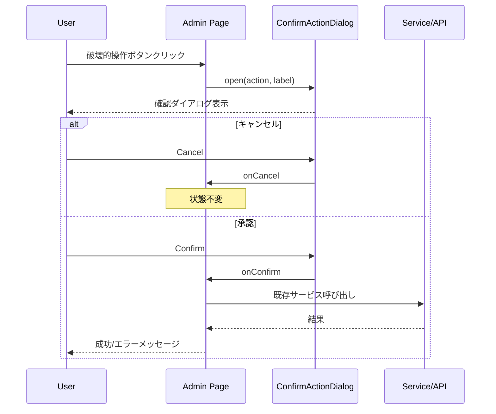

# Design Document: quizeum-ui-admin-creator

## Overview

本機能は Phase 24 UI 刷新の**第 7 スペック**であり、管理画面（ユーザー管理・モデレーション）、クリエイターダッシュボード、コミュニティツール（ジャンル管理・マージ投票）、および関連チャート・スケルトンを `quizeum-ui-foundation` の shadcn 標準テーマ上に再構築する。既存のデータ取得・認可・サービス呼び出しは維持し、スタイル層（CSS Modules → Tailwind + shadcn）のみを strangler パターンで置換する。

**Users**: 管理者・モデレーターは dense テーブル/フォームで運用業務を行う。クリエイターはダッシュボードで統計・クイズ・フィードバックを閲覧する。コミュニティ参加者はジャンル/マージ提案と投票を行う。

**Impact**: 9 つの `.module.css` を削除し、内部運用 UI を shadcn 標準のクリーンな見た目に統一。破壊的操作に AlertDialog 確認を追加し誤操作防止を強化する。

### Goals
- 5 ルート + チャート/スケルトンコンポーネントの Tailwind + shadcn 再実装
- dense テーブル（Table）、Tabs、Badge、Card、Chart による機能維持
- 破壊的操作の AlertDialog 確認（restore/delete/ban/reset）
- 認可ガード（middleware + クライアント）・`data-testid`/`id` 維持
- 関連 E2E・Jest 回帰グリーン

### Non-Goals
- middleware/API/認可ロジック変更
- reputation サービス・Firestore admin API 変更
- 新ルート・IA 変更
- シェルコンポーネント変更
- `variables.css` 削除

---

## Boundary Commitments

### This Spec Owns
- `src/app/admin/users/page.tsx` + `users.module.css` 削除
- `src/app/admin/moderation/page.tsx` + `moderation.module.css` 削除
- `src/app/creator/dashboard/*`（page, dashboard-client, dashboard-sections, dashboard-actions）+ `dashboard.module.css` 削除
- `src/app/community/genres/page.tsx` + `genres.module.css` 削除
- `src/app/community/merge/page.tsx` + `merge.module.css` 削除
- `src/components/charts/*`（analytics-chart, selection-pie, stats-skeleton, charts-skeleton）+ 関連 `.module.css` 削除
- `src/components/quiz/quiz-list-skeleton.tsx`, `feedback-skeleton.tsx` + 関連 `.module.css` 削除
- 共有 `ConfirmActionDialog` コンポーネント
- 関連 E2E・Jest テスト更新

### Out of Boundary
- `src/middleware.ts` および `/api/admin/*` ルートハンドラ
- `src/services/moderation.ts`, `reputation.ts`, `tagMerge.ts` のビジネスロジック
- `src/components/layout/*`（layout-shell）
- `src/lib/theme.ts`, `ThemeProvider`（foundation）
- `variables.css` 削除（`css-modules-cleanup`）

### Allowed Dependencies
- **`quizeum-ui-foundation`**: Tailwind, `cn()`, Button, Input, Dialog, Tabs, Skeleton, Badge, Card（P0）
- **`quizeum-ui-layout-shell`**: LayoutWrapper 内 `main` 描画（P0）
- **`useAuth` / `AuthProvider`**: 権限ガード・ユーザー情報（P0、読み取りのみ）
- **`isAdminUser` from `@/lib/middleware-auth-cookies`**: 管理者判定（P0）
- **既存サービス**: `resolveFlag`, `getQuizzesByAuthor`, `getReportsForCreator`, `tagMerge` 等（P0、呼び出し維持）
- **Firestore / REST API**: 既存 fetch パターン（P0）
- **`lucide-react`**: アイコン（P0）
- **foundation Primitive Wave 2**: Table, AlertDialog, Select, Textarea, Label, Chart（P0、存在確認のみ）
- **`recharts`**: shadcn Chart 依存（P1）

### Revalidation Triggers
- 管理/モデレーション/コミュニティの認可条件変更
- 破壊的操作の API 契約変更
- クリエイターダッシュボードの `data-testid` 削除・リネーム
- admin/community 操作ボタン `id` の変更
- foundation の CSS 変数名または Chart コンポーネント API の破壊的変更

---

## Architecture

### Existing Architecture Analysis
- **配置**: 全ページは root `layout.tsx` → `LayoutWrapper` → `main` 内で描画（`/play` 除外契約は本スペック非対象）
- **スタイル**: 各ページ/コンポーネントが専用 `.module.css` を import。`glass-card`, `--color-primary`, `--color-accent` 等の旧トークンに依存
- **認可**: middleware cookie 一次 + 各 page の `useAuth` + `moderationTier`/`isAdminUser` 二次ガード
- **データ**: Admin moderation は Firestore 直接、admin users は REST、creator は service 層、community は `tagMerge.ts`
- **チャート**: `analytics-chart` は div ベース棒グラフ（インライン style）、`selection-pie` は conic-gradient
- **テスト**: creator は `data-testid` 中心、admin/community は `id` 属性中心

### Architecture Pattern & Boundary Map

**Strangler Style Migration**: ページ責務・データフロー・認可は維持。スタイル層と確認 UX（AlertDialog 追加）のみ変更。

```mermaid
graph TD
    subgraph Foundation [quizeum-ui-foundation]
        Globals[globals.css CSS vars]
        CN[cn utility]
        BaseUI[Button Card Tabs Badge Skeleton Dialog Input]
    end

    subgraph AdminCreator [quizeum-ui-admin-creator]
        AddUI[Table AlertDialog Select Textarea Label Chart]
        ConfirmDlg[ConfirmActionDialog]
        AdminUsers[Admin Users Page]
        AdminMod[Admin Moderation Page]
        CreatorDash[Creator Dashboard]
        CommGenres[Community Genres]
        CommMerge[Community Merge]
        Charts[AnalyticsChart SelectionPie Skeletons]
    end

    subgraph Services [Out of Boundary]
        ModSvc[moderation.ts]
        QuizSvc[quiz.ts review.ts]
        TagSvc[tagMerge.ts]
        AdminAPI[/api/admin/users/*]
    end

    subgraph Auth [Out of Boundary]
        MW[middleware.ts]
        UseAuth[useAuth]
    end

    BaseUI --> AddUI
    CN --> AdminUsers
    CN --> AdminMod
    CN --> CreatorDash
    CN --> CommGenres
    CN --> CommMerge
    CN --> Charts
    AddUI --> AdminUsers
    AddUI --> AdminMod
    AddUI --> CommGenres
    AddUI --> CommMerge
    AddUI --> Charts
    ConfirmDlg --> AdminUsers
    ConfirmDlg --> AdminMod
    UseAuth --> AdminUsers
    UseAuth --> AdminMod
    UseAuth --> CreatorDash
    MW --> AdminUsers
    ModSvc --> AdminMod
    AdminAPI --> AdminUsers
    QuizSvc --> CreatorDash
    TagSvc --> CommGenres
    TagSvc --> CommMerge
```

**Architecture Integration**:
- Selected pattern: Strangler Fig（スタイル層置換 + 確認 UX 強化）
- Domain boundaries: 本スペックは admin/creator/community ページと charts のみ
- Existing patterns preserved: 二層認可、サービス呼び出し、redirect、testid/id
- New components rationale: Table/AlertDialog/Chart は dense UI の shadcn 標準化に必要
- Steering compliance: shadcn 標準テーマ、glass/neon 非再現

### Technology Stack

| Layer | Choice / Version | Role in Feature | Notes |
|-------|------------------|-----------------|-------|
| Frontend | Next.js 16, React 19 | Client Components (`'use client'`) | 既存維持 |
| Styling | Tailwind CSS v4 | ユーティリティクラス | foundation 経由 |
| UI | shadcn/ui | Table, AlertDialog, Chart 等 | foundation + 本 spec add |
| Charts | recharts (via shadcn Chart) | トレンド・円グラフ | CLI add chart |
| Icons | lucide-react | ダッシュボード・管理 UI | 既存 |
| Data | Firestore, REST API | 既存 fetch 維持 | 変更なし |
| Auth | useAuth, middleware cookies | ガード維持 | 読み取りのみ |
| Testing | Jest, Playwright | 単体・E2E 回帰 | 既存 spec 更新 |

---

## File Structure Plan

### Directory Structure
```
src/
├── app/
│   ├── admin/
│   │   ├── users/
│   │   │   ├── page.tsx              # [MODIFY] Tailwind + shadcn、module.css 削除
│   │   │   └── users.module.css      # [DELETE]
│   │   └── moderation/
│   │       ├── page.tsx              # [MODIFY] Tailwind + shadcn + AlertDialog
│   │       └── moderation.module.css # [DELETE]
│   ├── creator/dashboard/
│   │   ├── page.tsx                  # [MODIFY] ラッパー調整（必要時）
│   │   ├── dashboard-client.tsx      # [MODIFY] Tailwind 化
│   │   ├── dashboard-sections.tsx    # [MODIFY] shadcn Card/Badge/Chart
│   │   ├── dashboard-actions.tsx     # [MODIFY] shadcn Button
│   │   └── dashboard.module.css      # [DELETE]
│   └── community/
│       ├── genres/
│       │   ├── page.tsx              # [MODIFY] shadcn Tabs/Table/Form
│       │   └── genres.module.css     # [DELETE]
│       └── merge/
│           ├── page.tsx              # [MODIFY] shadcn Tabs/Table/Form
│           └── merge.module.css      # [DELETE]
├── components/
│   ├── admin/
│   │   └── confirm-action-dialog.tsx # [NEW] 破壊的操作確認ラッパー
│   ├── charts/
│   │   ├── analytics-chart.tsx       # [MODIFY] shadcn Chart (recharts)
│   │   ├── selection-pie.tsx         # [MODIFY] shadcn PieChart または Tailwind
│   │   ├── stats-skeleton.tsx        # [MODIFY] shadcn Skeleton
│   │   ├── charts-skeleton.tsx       # [MODIFY] shadcn Skeleton
│   │   ├── stats-skeleton.module.css # [DELETE]
│   │   └── charts-skeleton.module.css # [DELETE]
│   ├── quiz/
│   │   ├── quiz-list-skeleton.tsx      # [MODIFY] shadcn Skeleton
│   │   ├── feedback-skeleton.tsx     # [MODIFY] shadcn Skeleton
│   │   ├── quiz-list-skeleton.module.css  # [DELETE]
│   │   └── feedback-skeleton.module.css   # [DELETE]
│   └── ui/
│       ├── table.tsx                 # [NEW] shadcn Table
│       ├── alert-dialog.tsx          # [NEW] shadcn AlertDialog
│       ├── select.tsx                # [NEW] shadcn Select
│       ├── textarea.tsx              # [NEW] shadcn Textarea
│       ├── label.tsx                 # [NEW] shadcn Label
│       └── chart.tsx                 # [NEW] shadcn Chart (+ chart config)

tests/
├── app/admin/
│   └── moderation-seed.test.tsx      # [MODIFY] 必要時 DOM 更新
└── components/
    └── creator-skeleton-components.test.tsx  # [MODIFY] Tailwind 後も通過

e2e/
├── admin-users.spec.ts               # [MODIFY] AlertDialog 確認ステップ追加
├── creator-dashboard.spec.ts         # [UNCHANGED] 回帰確認
├── creator-streaming-skeleton.spec.ts # [UNCHANGED] 回帰確認
└── moderation-feedback.spec.ts       # [UNCHANGED] 回帰確認
```

### Modified Files
- `admin/users/page.tsx` — Table + Input + Textarea + Badge + AlertDialog。BAN/reset 前に ConfirmActionDialog。`id` 維持
- `admin/moderation/page.tsx` — Table/Card リスト + Badge + AlertDialog。restore/delete 前に確認。seed UI は Card + Button
- `creator/dashboard/dashboard-sections.tsx` — Card 統計グリッド、AnalyticsChart、SelectionPie、クイズ Card リスト。インライン neon style 削除
- `creator/dashboard/dashboard-client.tsx` — ローディング/エラー表示を shadcn Alert または既存パターン Tailwind 化
- `community/genres/page.tsx` — shadcn Tabs 3 区分、Table 投票/履歴、フォーム Input/Textarea/Select
- `community/merge/page.tsx` — 同上パターン
- `analytics-chart.tsx` — ChartContainer + BarChart（recharts）、props 維持（data, title, unit, color）
- `selection-pie.tsx` — PieChart + ChartLegend または Tailwind 円グラフ、props 維持

---

## System Flows

### 破壊的操作確認フロー



### クリエイターダッシュボード読み込みフロー

```mermaid
flowchart TD
    Start[dashboard-client mount] --> Auth{user authenticated?}
    Auth -->|No| Redirect[/login redirect]
    Auth -->|Yes| Loading[Show skeletons testid]
    Loading --> Fetch[Parallel: quizzes, reports, stats]
    Fetch --> Ready[Replace skeletons with sections]
    Ready --> Display[stats-section, analytics-section, creator-quiz-list]
```

---

## Requirements Traceability

| Requirement | Summary | Components | Interfaces | Flows |
|-------------|---------|------------|------------|-------|
| 1.1 | UID 検索・操作 | AdminUsersPage | /api/admin/users/* | — |
| 1.2 | テーブル表示 | AdminUsersPage, Table | — | — |
| 1.3 | 理由 10 文字 | AdminUsersPage, Textarea | — | — |
| 1.4 | moderation 導線 | AdminUsersPage | Link | — |
| 1.5 | 操作 id 維持 | AdminUsersPage | button id | — |
| 1.6 | shadcn 標準 | AdminUsersPage | Tailwind | — |
| 2.1 | 審査キュー | AdminModerationPage | resolveFlag | — |
| 2.2 | admin_review 遷移 | AdminModerationPage | Link | — |
| 2.3 | seed UI | AdminModerationPage | seed API | — |
| 2.4 | 操作 id | AdminModerationPage | button id | Confirm flow |
| 2.5 | users 導線 | AdminModerationPage | Link | — |
| 2.6 | shadcn 標準 | AdminModerationPage | Tailwind | — |
| 3.1 | ダッシュボード機能 | CreatorDashboard | quiz/review services | Loading flow |
| 3.2 | スケルトン表示 | Skeletons | data-testid | Loading flow |
| 3.3 | スケルトン置換 | dashboard-client | — | Loading flow |
| 3.4 | testid 維持 | dashboard-sections | data-testid | — |
| 3.5 | 導線維持 | dashboard-sections | router/link | — |
| 3.6 | shadcn Card | dashboard-sections | Card, Badge | — |
| 4.1–4.5 | ジャンル UI | CommunityGenresPage | tagMerge | — |
| 5.1–5.5 | マージ UI | CommunityMergePage | tagMerge | — |
| 6.1 | 棒グラフ | AnalyticsChart | Chart props | — |
| 6.2 | 円グラフ | SelectionPie | data[] | — |
| 6.3 | テーマ配色 | AnalyticsChart, Chart | CSS vars | — |
| 6.4 | フォールバック | SelectionPie | — | — |
| 6.5 | skeleton testid | ChartSkeletons | data-testid | — |
| 7.1–7.5 | 認可維持 | 全 page.tsx | useAuth, middleware | — |
| 8.1–8.5 | 確認ダイアログ | ConfirmActionDialog | AlertDialog | Confirm flow |
| 9.1 | E2E グリーン | — | Playwright | — |
| 9.2 | Jest グリーン | — | Jest | — |
| 9.3 | テーマ視認性 | 全コンポーネント | dark class | — |
| 9.4 | CSS 削除 | — | file delete | — |
| 9.5 | 契約不変 | — | services | — |

---

## Components and Interfaces

| Component | Domain/Layer | Intent | Req Coverage | Key Dependencies (P0/P1) | Contracts |
|-----------|--------------|--------|--------------|--------------------------|-----------|
| AdminPrimitives | UI | Table/AlertDialog 等追加 | 1, 2, 4, 5, 8 | foundation (P0), shadcn CLI (P1) | State |
| ConfirmActionDialog | UI | 破壊的操作確認 | 8.1–8.5 | AlertDialog (P0) | State |
| AdminUsersPage | Page | ユーザー管理 UI | 1, 7, 8 | useAuth, AdminAPI (P0) | API |
| AdminModerationPage | Page | モデレーション UI | 2, 7, 8 | resolveFlag, Firestore (P0) | Service |
| CreatorDashboard | Page | ダッシュボード UI | 3, 7 | quiz/review services (P0) | Service |
| CommunityGenresPage | Page | ジャンル管理 UI | 4, 7 | tagMerge (P0) | Service |
| CommunityMergePage | Page | マージ投票 UI | 5, 7 | tagMerge (P0) | Service |
| AnalyticsChart | Chart | トレンド棒グラフ | 6.1, 6.3 | Chart/recharts (P1) | State |
| SelectionPie | Chart | 選択分布円グラフ | 6.2, 6.4 | Chart (P1) | State |
| ChartSkeletons | UI | 読み込みプレースホルダ | 3.2, 6.5 | Skeleton (P0) | State |

### UI Layer

#### ConfirmActionDialog

| Field | Detail |
|-------|--------|
| Intent | 破壊的操作前の確認ダイアログを統一提供 |
| Requirements | 8.1, 8.2, 8.3, 8.4, 8.5 |

**Responsibilities & Constraints**
- shadcn AlertDialog をラップし、title/description/confirmLabel/cancelLabel を props で受け取る
- `onConfirm` は親がサービス呼び出しを実行。ダイアログは UI のみ担当
- 確認ボタンに `data-testid="confirm-action-btn"`、キャンセルに `data-testid="cancel-action-btn"` を付与（E2E 安定化）

**Dependencies**
- Inbound: AdminUsersPage, AdminModerationPage（P0）
- Outbound: AlertDialog プリミティブ（P0）

**Contracts**: State [x]

##### Service Interface
```typescript
interface ConfirmActionDialogProps {
  open: boolean;
  onOpenChange: (open: boolean) => void;
  title: string;
  description: string;
  confirmLabel?: string;
  cancelLabel?: string;
  onConfirm: () => void | Promise<void>;
  loading?: boolean;
}
```

**Implementation Notes**
- Integration: restore/delete は「この操作は取り消せません」文言を description に含める
- Validation: キャンセル時に `onConfirm` が呼ばれないことを Jest で検証可能
- Risks: E2E が既存の即時クリックを前提とする場合、確認ステップ追加で失敗 — admin-users spec を更新

#### AnalyticsChart

| Field | Detail |
|-------|--------|
| Intent | 7 日間トレンドの棒グラフ表示 |
| Requirements | 6.1, 6.3 |

**Responsibilities & Constraints**
- 既存 props を維持: `{ data: {label, value}[], title, unit, color? }`
- shadcn ChartContainer + recharts BarChart で実装
- `color` prop は ChartConfig の series color にマップ。未指定時は `--chart-1` CSS 変数を使用

**Dependencies**
- Inbound: dashboard-sections.tsx（P0）
- Outbound: chart.tsx, recharts（P1）

**Contracts**: State [x]

**Implementation Notes**
- Integration: 既存モックデータ `playsTrendData` / `ratingTrendData` は変更なし
- Risks: SSR で recharts が失敗する場合、`'use client'` 維持

#### AdminUsersPage（実装ノート）

| Field | Detail |
|-------|--------|
| Intent | UID 検索・BAN/UNBAN/リセット UI |
| Requirements | 1.1–1.6, 7.1, 7.2, 7.4, 7.5, 8.3, 8.4, 8.5 |

**Implementation Notes**
- `styles.*` を Tailwind + Table/Card/Badge/Textarea に置換
- BAN/reset: 理由 Textarea（min 10 文字バリデーション維持）→ ConfirmActionDialog → API 呼び出し
- UNBAN: 既存 `confirm()` を ConfirmActionDialog に置換
- `execute-reset-btn`, `execute-ban-btn`, `execute-unban-btn` id 維持

---

## Error Handling

### Error Strategy
- 既存の `errorMessage` / `successMessage` state パターンを維持
- shadcn 化後もページ上部またはインラインでエラー/成功を表示（destructive variant の Alert または既存テキスト + `text-destructive`）
- API/Firestore 失敗時は既存メッセージ文言を維持

### Error Categories and Responses
- **User Errors**: 理由 10 文字未満 → フィールド下バリデーション表示（既存維持）
- **Auth Errors**: 未認証 → `/login?redirect=...`、権限なし → `/not-found`（既存維持）
- **System Errors**: fetch 失敗 → エラーメッセージ state 表示、アクションローディング解除

---

## Testing Strategy

### Unit Tests
- `ConfirmActionDialog`: キャンセル時 onConfirm 未呼び出し、確認時 onConfirm 呼び出し
- `creator-skeleton-components.test.tsx`: Tailwind 移行後も skeleton testid 存在確認
- `moderation-seed.test.tsx`: seed UI の admin 限定表示維持

### Integration Tests
- Admin users: 理由バリデーション + AlertDialog 連携（モック API）
- AnalyticsChart: props 渡しで Chart レンダリング（@testing-library/react）

### E2E/UI Tests
- `e2e/admin-users.spec.ts`: アクセス制御、検索 UI、BAN 理由バリデーション、**AlertDialog 確認後 BAN**
- `e2e/creator-dashboard.spec.ts`: stats/analytics/quiz-card testid
- `e2e/creator-streaming-skeleton.spec.ts`: skeleton → content 遷移
- `e2e/moderation-feedback.spec.ts`: genres/moderation アクセス制御

### Performance
- recharts は creator dashboard のみ dynamic import 検討（初版は通常 import で可、ビルド確認）

---

## Security Considerations
- 本スペックは UI のみ。認可ロジック変更禁止
- AlertDialog は UX 強化であり、middleware/API 側の権限検証を代替しない
- 管理者操作ボタンは既存と同様、権限ガード通過後のみ表示
