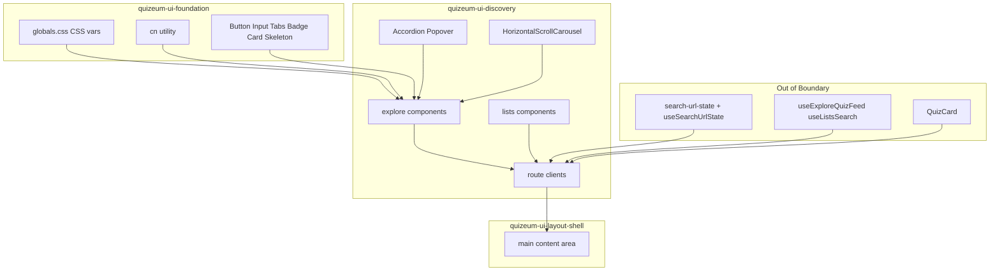
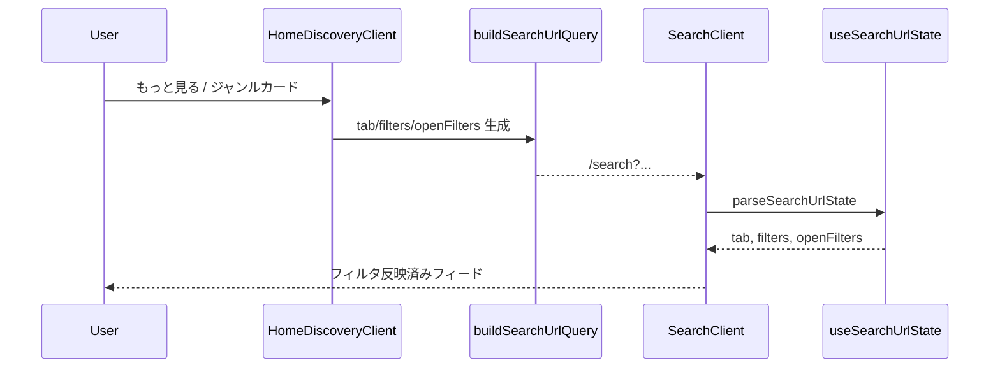
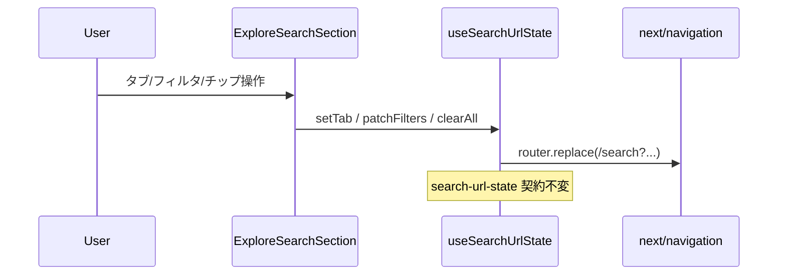
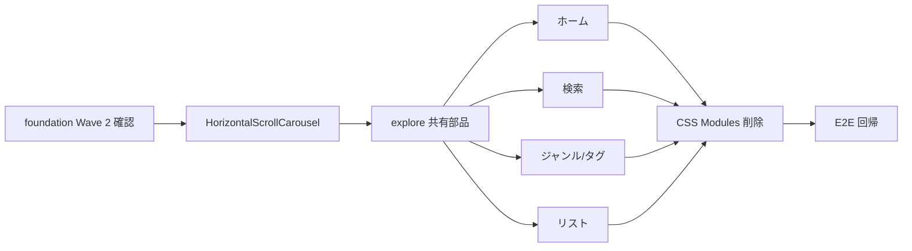

# Design Document: quizeum-ui-discovery

## Overview

本機能は Phase 24 UI 刷新の**第 3 スペック**であり、Quizeum の探索・リスト画面（ホーム、検索、ジャンル/タグ探索、リスト探索）を `quizeum-ui-foundation` の shadcn 標準テーマと Tailwind ユーティリティ上に再構築する。既存のデータフロー、URL 状態契約（Phase 22）、ルーティング、`data-testid` は変更しない。

**Users**: 全エンドユーザーがコンテンツ発見に本画面群を利用する。開発者は `src/components/explore/` と `src/components/lists/` の共有部品を後続スペックからも参照可能な状態にする。

**Impact**: 探索系 CSS Modules（`explore/*.module.css` 7 ファイル、`home-discovery.module.css`、`lists.module.css` ×2）を削除し、旧 glass/neon スタイルを shadcn 標準サーフェスに置換。`page.module.css` は未移行ドメイン（bookmarks, settings 等）が依存するため物理削除せず、探索コンポーネントからの参照のみ除去する。

### Goals
- 探索・リスト全ルートの Tailwind + shadcn 再実装
- 横スクロールカルーセル UX の維持（scroll-snap）
- Phase 22 URL ↔ フィルタ同期契約の維持
- 既存 E2E 3 spec グリーン
- 探索専用 `.module.css` 完全削除

### Non-Goals
- シェル再構築（`quizeum-ui-layout-shell`）
- `search-url-state` / `useSearchUrlState` ロジック変更
- `QuizCard` 全面再設計（`quizeum-ui-quiz-lifecycle`）
- `page.module.css` ファイル全体の削除
- `variables.css` 削除
- 新機能・IA 変更

---

## Boundary Commitments

### This Spec Owns
- `src/app/page.tsx`, `home-discovery-client.tsx` — ホームディスカバリー
- `src/app/search/page.tsx`, `search-client.tsx` — 検索画面
- `src/app/genres/[genreName]/page.tsx`, `genre-explore-client.tsx` — ジャンル探索
- `src/app/tags/[tagName]/page.tsx`, `tag-explore-client.tsx` — タグ探索
- `src/app/lists/page.tsx`, `lists-client.tsx` — リスト探索
- `src/app/list/[id]/page.tsx`, `list.module.css` — リスト詳細（edit 除く）
- `src/components/explore/*` — 探索共有コンポーネント 14 件
- `src/components/lists/*` — リスト UI 4 件
- `src/components/ui/grid-skeleton.tsx` — 検索フィード用（`page.module.css` 依存除去）
- 新規共有: `horizontal-scroll-carousel.tsx`（scroll-snap ラッパー）
- 探索専用 `.module.css` の削除
- 探索関連 E2E / Jest 回帰確認

### Out of Boundary
- `src/components/layout/*`（`quizeum-ui-layout-shell`）
- `src/lib/search-url-state.ts`, `src/hooks/useSearchUrlState.ts` — ロジック不変
- `src/hooks/useExploreQuizFeed.ts`, `useListsSearch.ts`, `useActiveGenres.ts` 等 — フック契約不変
- `src/components/quiz/quiz-card.tsx` — 全面移行は quiz-lifecycle。本 spec では import 継続
- `src/app/list/[id]/edit/` — リストエディタ（`quizeum-ui-editor`）
- `src/app/page.module.css` ファイル削除（bookmarks / settings / my-quiz が参照）
- Core API / Firestore / 認可
- `quizeum-play-flow-ui` / `quizeum-lists-discovery-ui` spec 文書更新（roadmap 既存 spec update）

### Allowed Dependencies
- **`quizeum-ui-foundation`**: Tailwind, `globals.css` CSS 変数, `cn()`, Button, Input, Tabs, Badge, Card, Skeleton（P0）
- **`quizeum-ui-layout-shell`**: シェル内 `main` レンダリング、余白契約（P0）
- **`useSearchUrlState`**: URL 状態読み書き（P0、読み取り/コールバックのみ）
- **`buildSearchUrlQuery` / `parseSearchUrlState`**: ホーム導線 URL 生成（P0）
- **`useAuth`**: ブックマーク・リスト非公開タブ（P0）
- **`QuizCard`**: フィード/カルーセル内カード表示（P0、既存 props 維持）
- **foundation Primitive Wave 2**: Accordion, Popover（P0、存在確認のみ）
- **`lucide-react`**: 既存アイコン（P0）

### Revalidation Triggers
- `search-url-state` のパラメータ名・パース契約変更
- 探索ルートパス（`/`, `/search`, `/genres/*`, `/tags/*`, `/lists`）の変更
- 既存 `data-testid` の削除・リネーム
- foundation の CSS 変数名または shadcn プリミティブ API の破壊的変更
- `QuizCard` props 契約の破壊的変更

---

## Architecture

### Existing Architecture Analysis
- **ホーム**: RSC `page.tsx` が SSR データ取得 → `HomeDiscoveryClient`（3 セクション × カルーセル）
- **検索**: `SearchClient` が `useSearchUrlState` + `useExploreQuizFeed` + `ExploreSearchSection` + `ActiveFilterChips` + `QuizCard` グリッド
- **ジャンル/タグ**: `GenreExploreClient` / `TagExploreClient` が `lockedGenreId` / タグロック付き `ExploreSearchSection` を再利用
- **リスト**: `ListsClient` が `useListsSearch` + タブ/検索/グリッド
- **スタイル**: CSS Modules + `page.module.css`（glass/neon）+ レガシー `btn btn-accent`
- **テスト**: E2E 3 ファイル、Jest `search-url-state.test.ts`

### Architecture Pattern & Boundary Map

**Strangler Style Migration**: コンポーネント責務・props・フック連携は維持。スタイル層のみ CSS Modules → Tailwind + shadcn プリミティブに置換。



**Architecture Integration**:
- Selected pattern: Strangler Fig（スタイル層のみ置換）
- Domain boundaries: 探索 UI chrome とリスト探索のみ。シェル・プレイ・詳細は他 spec
- Existing patterns preserved: URL 状態、無限スクロール、ブックマーク toggle、認証分岐
- New components rationale: `HorizontalScrollCarousel` は scroll-snap 統一。Accordion/Popover は shadcn 標準フィルタ UX
- Steering compliance: shadcn 標準テーマ、glass/neon 非再現

### Technology Stack

| Layer | Choice / Version | Role in Feature | Notes |
|-------|------------------|-----------------|-------|
| Frontend | Next.js 16, React 19 | RSC + Client Components | 既存維持 |
| Styling | Tailwind CSS v4 | レイアウト・カルーセル・フィルタ UI | foundation 経由 |
| UI | shadcn/ui | Input, Tabs, Badge, Card, Accordion, Popover | foundation Wave 1+2 |
| Scroll | CSS scroll-snap | 横スクロールカルーセル | embla 不採用 |
| State | useSearchUrlState | URL 同期 | ロジック不変 |
| Data | useExploreQuizFeed, useListsSearch | フィード取得 | 不変 |
| Testing | Jest, Playwright | 単体・E2E | 既存 spec 回帰 |

---

## File Structure Plan

### Directory Structure
```
src/
├── app/
│   ├── page.tsx                           # [MODIFY] container Tailwind 化
│   ├── home-discovery-client.tsx        # [MODIFY] Tailwind + shadcn
│   ├── home-discovery.module.css          # [DELETE]
│   ├── page.module.css                    # [UNCHANGED file] 探索参照除去のみ
│   ├── search/
│   │   ├── page.tsx                       # [MODIFY]
│   │   └── search-client.tsx              # [MODIFY]
│   ├── genres/[genreName]/
│   │   ├── page.tsx                       # [MODIFY]
│   │   └── genre-explore-client.tsx       # [MODIFY]
│   ├── tags/[tagName]/
│   │   ├── page.tsx                       # [MODIFY]
│   │   └── tag-explore-client.tsx         # [MODIFY]
│   ├── lists/
│   │   ├── page.tsx                       # [MODIFY]
│   │   ├── lists-client.tsx               # [MODIFY]
│   │   └── lists.module.css               # [DELETE]
│   └── list/[id]/
│       ├── page.tsx                       # [MODIFY] Tailwind + shadcn
│       └── list.module.css                # [DELETE]
├── components/
│   ├── explore/
│   │   ├── horizontal-scroll-carousel.tsx # [NEW] scroll-snap ラッパー
│   │   ├── quiz-carousel.tsx              # [MODIFY]
│   │   ├── genre-carousel.tsx             # [MODIFY]
│   │   ├── format-carousel.tsx            # [MODIFY]
│   │   ├── quiz-carousel-skeleton.tsx     # [MODIFY]
│   │   ├── genre-carousel-skeleton.tsx    # [MODIFY]
│   │   ├── unified-search-field.tsx       # [MODIFY]
│   │   ├── genre-search-field.tsx         # [MODIFY]
│   │   ├── active-filter-chips.tsx        # [MODIFY]
│   │   ├── explore-search-section.tsx     # [MODIFY]
│   │   ├── explore-sort-tabs.tsx          # [MODIFY]
│   │   ├── explore-accordion.tsx          # [MODIFY] shadcn Accordion
│   │   ├── explore-accordions-panel.tsx   # [MODIFY]
│   │   ├── genre-nav.tsx                  # [MODIFY]
│   │   ├── home-discovery-page-skeleton.tsx # [MODIFY]
│   │   └── *.module.css (7 files)         # [DELETE]
│   ├── lists/
│   │   ├── list-discovery-card.tsx        # [MODIFY]
│   │   ├── lists-search-bar.tsx           # [MODIFY]
│   │   ├── lists-visibility-tabs.tsx      # [MODIFY]
│   │   ├── lists-grid.tsx                 # [MODIFY]
│   │   └── lists.module.css               # [DELETE]
│   └── ui/
│       └── grid-skeleton.tsx              # [MODIFY] page.module.css 除去
tests/
└── components/
    └── horizontal-scroll-carousel.test.tsx  # [NEW] 任意スモーク
e2e/
├── home-discovery.spec.ts                 # [VERIFY] 回帰
├── quiz-search.spec.ts                    # [VERIFY] 回帰
└── lists-discovery.spec.ts                # [VERIFY] 回帰
```

### Modified Files（主要）
- `home-discovery-client.tsx` — `home-discovery.module.css` 削除、Tailwind セクション layout
- `search-client.tsx` — `page.module.css` 削除、shadcn Tabs/Grid レイアウト
- `explore-search-section.tsx` — 最大の共有コンポーネント。Input, Accordion, Badge, sticky bar を Tailwind 化
- `active-filter-chips.tsx` — shadcn Badge + dismiss ボタン
- `unified-search-field.tsx` / `genre-search-field.tsx` — shadcn Input + Popover サジェスト
- `lists-client.tsx` — `btn btn-accent` 除去、shadcn Button

---

## System Flows

### ホーム → 検索導線


### 検索フィルタ URL 同期


---

## Requirements Traceability

| Requirement | Summary | Components | Interfaces | Flows |
|-------------|---------|------------|------------|-------|
| 1.1–1.6 | ホーム 3 セクション | HomeDiscoveryClient, QuizCarousel, GenreCarousel | SSR props | ホーム→検索 |
| 2.1–2.7 | 検索フィード | SearchClient, ExploreSearchSection, ActiveFilterChips | useSearchUrlState, useExploreQuizFeed | URL 同期 |
| 3.1–3.4 | URL 契約維持 | useSearchUrlState（参照のみ） | search-url-state | ホーム→検索 |
| 4.1–4.4 | ジャンル/タグ | GenreExploreClient, TagExploreClient | lockedGenreId props | — |
| 5.1–5.6 | リスト探索 | ListsClient, ListsGrid, ListDiscoveryCard | useListsSearch | — |
| 6.1–6.4 | カルーセル UX | HorizontalScrollCarousel, *Carousel | — | — |
| 7.1–7.5 | shadcn ビジュアル | 全探索コンポーネント | foundation primitives | — |
| 8.1–8.4 | CSS 削除 | 全探索 routes/components | — | — |
| 9.1–9.5 | 回帰テスト | E2E + Jest | — | — |

---

## Components and Interfaces

| Component | Domain/Layer | Intent | Req Coverage | Key Dependencies (P0/P1) | Contracts |
|-----------|--------------|--------|--------------|--------------------------|-----------|
| HorizontalScrollCarousel | explore | scroll-snap 横スクロール容器 | 6 | cn (P0) | Props |
| QuizCarousel | explore | クイズ横スクロール | 1, 6 | QuizCard, useAuth (P0) | QuizCarouselProps |
| GenreCarousel | explore | ジャンル横スクロール | 1, 6 | search-url-state (P0) | GenreCarouselProps |
| FormatCarousel | explore | フォーマット選択 | 2, 6 | — | FormatCarouselProps |
| UnifiedSearchField | explore | 統合検索入力+サジェスト | 2, 7 | Input, Popover (P1) | controlled filters |
| GenreSearchField | explore | ジャンル検索入力 | 4, 7 | Input, Popover (P1) | genre suggestions |
| ActiveFilterChips | explore | フィルタチップ行 | 2, 7 | Badge (P0) | FilterChipKey |
| ExploreSearchSection | explore | 検索+フィルタ統合セクション | 2, 3, 7 | Accordion, Tabs (P0/P1) | ExploreSearchSectionProps |
| ExploreSortTabs | explore | ソートタブ | 2, 4, 7 | Tabs (P0) | tab ids |
| ExploreAccordion | explore | フィルタ折りたたみ | 2, 7 | Accordion (P1) | — |
| HomeDiscoveryClient | app | ホーム 3 セクション | 1, 3 | buildSearchUrlQuery (P0) | HomeDiscoveryClientProps |
| SearchClient | app | 検索ページ編成 | 2, 3 | useSearchUrlState (P0) | SearchClientProps |
| GenreExploreClient | app | ジャンル探索 | 4 | ExploreSearchSection (P0) | genreId lock |
| TagExploreClient | app | タグ探索 | 4 | ExploreSearchSection (P0) | tag lock |
| ListsClient | app | リスト探索編成 | 5 | useListsSearch (P0) | — |
| ListsVisibilityTabs | lists | 公開/非公開タブ | 5 | Tabs (P0) | ListsVisibility |
| ListsSearchBar | lists | キーワード検索 | 5 | Input (P0) | controlled keyword |
| ListsGrid | lists | リスト一覧 | 5 | ListDiscoveryCard (P0) | — |
| ListDiscoveryCard | lists | リストカード | 5, 7 | Card, Badge (P0) | ListSearchResult |
| GridSkeleton | ui | フィードスケルトン | 2 | Skeleton (P0) | — |

### explore / HorizontalScrollCarousel

| Field | Detail |
|-------|--------|
| Intent | 横スクロール + scroll-snap の共有容器 |
| Requirements | 6.1, 6.2 |

**Responsibilities & Constraints**
- `overflow-x-auto`, `snap-x`, `snap-mandatory`, `flex`, `gap-*` を Tailwind で適用
- 子要素に `snap-start`, `shrink-0` を付与するユーティリティ props または convention を文書化
- 矢印ナビは提供しない（現行同等）

**Contracts**: State [ ]

```typescript
interface HorizontalScrollCarouselProps {
  children: React.ReactNode;
  className?: string;
  'data-testid'?: string;
}
```

### explore / ExploreSearchSection

| Field | Detail |
|-------|--------|
| Intent | 検索・フィルタ・クイックサーチ・カルーセルブロックの統合 |
| Requirements | 2.1–2.7, 3.2, 7.1–7.5 |

**Responsibilities & Constraints**
- `ExploreSearchSectionProps` 既存 interface を維持（破壊的変更禁止）
- sticky 検索バー: `sticky top-0 z-40 bg-background/95 backdrop-blur`（glass 非使用）
- フィルタトグル: shadcn Button variant outline
- アコーディオン: shadcn Accordion で難易度・問題数・プレイ状況
- `data-testid` 契約: `search-search-bar-sticky`, `home-genre-carousel-block`, `quick-search-tags` 等維持

**Dependencies**
- Inbound: SearchClient, GenreExploreClient, TagExploreClient — filters/playStatus callbacks (P0)
- Outbound: UnifiedSearchField, GenreCarousel, FormatCarousel, ExploreAccordion (P0)

### app / SearchClient

| Field | Detail |
|-------|--------|
| Intent | 検索ページの状態管理とフィード描画 |
| Requirements | 2, 3 |

**State Management**
- `useSearchUrlState` から tab, filters, playStatus, openFilters を取得（変更なし）
- `useExploreQuizFeed` でフィード paginate（変更なし）
- ブックマーク state は client ローカル（既存維持）

---

## Data Models

本 spec は UI 層のみの移行のため、ドメインモデル・API スキーマの変更なし。

- `Quiz`, `GenreMetadata`, `TagMetadata`, `HomeFeedFilters`, `SearchUrlState` — 既存型をそのまま使用
- `ListSearchResult` — `useListsSearch` 戻り値型を維持

---

## Error Handling

### Error Strategy
- 既存の error + retry パターンを維持（カルーセル、フィード、リストグリッド）
- shadcn 化後も `error` prop 時にメッセージ + 再試行ボタン（shadcn Button）を表示

### Error Categories and Responses
- **データ取得失敗**: インラインエラーメッセージ + `onRetry` / `retry()` コールバック — 既存 UX 維持
- **空結果**: 「該当するクイズが見つかりませんでした。」等の既存文言維持（E2E 依存）
- **未ログイン（リスト非公開）**: `/login?redirect=/lists` リダイレクト — 既存維持

---

## Testing Strategy

### Unit Tests
- `HorizontalScrollCarousel` が `data-testid` を転送し scroll クラスを適用すること
- `ActiveFilterChips` が chip key に応じた `data-testid` を生成すること（既存 Jest があれば更新）
- `search-url-state.test.ts` — 変更なしでグリーン維持

### Integration Tests
- `ExploreSearchSection` が `initialOpenFilters` でアコーディオン展開状態を反映すること
- `ListsVisibilityTabs` タブ切替が `useListsSearch` の visibility に連動すること（既存フックテスト維持）

### E2E/UI Tests
- `e2e/home-discovery.spec.ts` — 3 セクション表示、もっと見る遷移、ジャンルカード → `/search?genreId=`
- `e2e/quiz-search.spec.ts` — タブ切替、キーワード検索、フィルタ展開、カルーセル、クイックサーチチップ
- `e2e/lists-discovery.spec.ts` — 公開タブ、検索バー、カード/空状態

### Performance
- カルーセルはネイティブ scroll のまま（Embla 不使用）— 既存同等
- 無限スクロール IntersectionObserver 契約は変更しない

---

## Migration Strategy



- **Phase 1**: foundation プリミティブ確認 + 共有カルーセル/チップ/検索フィールド
- **Phase 2**: `ExploreSearchSection` + `ExploreSortTabs`（search/genres/tags の前提）
- **Phase 3**: ルートクライアント並列移行（ホーム → 検索 → ジャンル/タグ ∥ リスト）
- **Phase 4**: `.module.css` 削除、`page.module.css` import ゼロ確認
- **Rollback**: 各ルートは独立 revert 可能（strangler）

---

## Supporting References
- `research.md` — カルーセル方式・page.module.css 共有の調査詳細
- `.kiro/specs/quizeum-ui-foundation/design.md` — プリミティブ一覧
- `.kiro/specs/quizeum-ui-layout-shell/design.md` — main 余白・z-index 文脈
