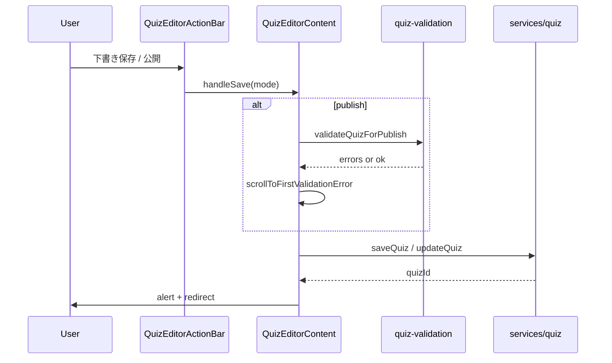
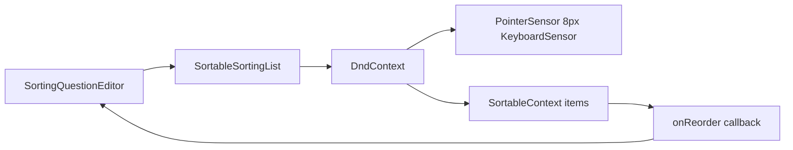
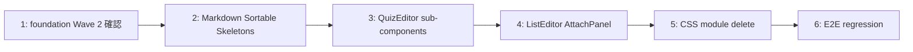

# Design Document: quizeum-ui-editor

## Overview

本機能は Phase 24 UI 刷新の**エディタスライス**である。Quizeum のクイズエディタ（約 2,028 LOC）、リストエディタ、問題添付パネル、および関連サブコンポーネント（@dnd-kit ソート、Markdown プレビュー、エディタスケルトン）を `quizeum-ui-foundation` の shadcn 標準テーマと Tailwind ユーティリティ上に再構築する。問題 CRUD、DnD 並べ替え、バリデーション表示、下書き/公開/テストプレイ/リスト保存フローは変更しない。

**Users**: クリエイターが `/quiz/create`, `/quiz/[id]/edit`, `/list/create`, `/list/[id]/edit` でコンテンツを編集する。開発者は foundation Primitive Wave 2 の Form 系プリミティブを利用する。

**Impact**: エディタ関連 CSS Modules（約 1,096 LOC）を削除し、最大ファイル `quiz-editor.tsx` を 8 サブコンポーネントへ分割。旧 glass/neon スタイルを shadcn 標準フォーム UI に置換する。

### Goals
- クイズ/リストエディタの shadcn + Tailwind 再実装
- @dnd-kit（sorting 問題）と HTML5 DnD（リスト並べ替え）の挙動維持
- バリデーション・保存/公開フロー・`data-testid` 契約の維持
- `quiz-editor.tsx` の段階的サブコンポーネント化（機能変更なし）
- エディタ関連 `.module.css` 完全削除
- エディタ E2E・Jest 回帰グリーン

### Non-Goals
- Firestore サービス層・バリデーション lib の変更
- AI 生成 API UI
- プレイ/結果 UI（`quizeum-ui-quiz-lifecycle`）
- @dnd-kit への HTML5 DnD 統一
- `variables.css` 削除
- react-hook-form 全面導入

---

## Boundary Commitments

### This Spec Owns
- `src/components/quiz/quiz-editor.tsx` および分割サブコンポーネント（`src/components/quiz/editor/*`）
- `src/components/quiz-list/quiz-list-editor.tsx`, `question-list-attach-panel.tsx`
- `src/components/quiz/genre-editor-select.tsx`, `list-type-selector.tsx`, `editor-skeleton.tsx`
- `src/components/quiz-list/list-skeleton.tsx`
- `src/components/sorting/sortable-sorting-list.tsx`
- `src/components/markdown/*`（preview, content, field-hint）
- エディタルート loader（`quiz-editor-loader.tsx`, `list-editor-loader.tsx`）の CSS import 除去
- エディタ関連 `.module.css` 削除
- エディタ E2E 回帰確認

### Out of Boundary
- `@/services/quiz`, `@/services/quiz-list`, `@/services/question`, `@/services/quiz-validation` 等のロジック
- `useQuestionAttachSearch` hook の検索ロジック
- `AuthorQuizReferencePanel`, `ReferenceQuestionBadge` の機能ロジック（スタイル追随のみ本スペックで touch 可）
- `AutoGrowTextarea`, `TrueFalseCorrectToggle`, `DifficultyVoteStars` の挙動ロジック（Tailwind 化は本スペック）
- クリエイターダッシュボード（`quizeum-ui-admin-creator`）
- シェルコンポーネント（`quizeum-ui-layout-shell`）

### Allowed Dependencies
- **`quizeum-ui-foundation`**: Tailwind, `globals.css`, `cn()`, Button, Input, Card, Dialog, Tabs, Skeleton, Badge（P0）
- **`quizeum-ui-layout-shell`**: シェル内 `main` 描画（P0）
- **`@dnd-kit/core`, `@dnd-kit/sortable`, `@dnd-kit/utilities`**: SortableSortingList（P0、設定変更禁止）
- **`useAuth`**: 認可・authorId（P0、読み取りのみ）
- **`useActiveGenres`, `useQuestionAttachSearch`**: データ取得 hook（P0、ロジック不変）
- **既存 services/lib**: quiz-validation, test-play, markdown sanitize 等（P0、import 維持）
- **foundation Primitive Wave 2**: Form, Textarea, Select, Switch, RadioGroup, Label, Alert（P0、存在確認のみ）

### Revalidation Triggers
- 問題タイプ追加・削除（QuestionCard / PerTypeEditor 影響）
- DnD ライブラリまたはセンサー設定変更
- 保存/公開フローの遷移先 URL 変更
- バリデーション lib のエラー shape 変更
- 既存 `data-testid` または DOM ID（`#field-*`, `#question-card-*`）の変更
- foundation の CSS 変数名または shadcn プリミティブ API の破壊的変更

---

## Architecture

### Existing Architecture Analysis
- **クイズエディタ**: 単一 `quiz-editor.tsx` に形式選択、メタデータ、タグ、問題 CRUD、参照問題、バリデーション、save/publish/test-play が集約。`create.module.css`（550 行）を import
- **リストエディタ**: `quiz-list-editor.tsx` + `question-list-attach-panel.tsx` が `edit.module.css`（344 行）を共有
- **DnD**: sorting 問題のみ `SortableSortingList`（@dnd-kit）。リストは HTML5 DnD
- **Markdown**: `MarkdownPreview` + `MarkdownContent` + `parseMarkdownToHtml` / sanitize
- **ルート**: Server loader が genres/tags/quiz/list を fetch し Client Editor に props 渡し
- **テスト**: E2E 6+ spec、Jest は限定的（エディタ専用単体テスト少）

### Architecture Pattern & Boundary Map

**Strangler Style Migration + Presentational Split**: スタイル層を CSS Modules → Tailwind + shadcn に置換。`quiz-editor.tsx` は Container（state/services）を残し UI を `editor/*` サブコンポーネントへ抽出。

```mermaid
graph TD
    subgraph Foundation [quizeum-ui-foundation]
        Globals[globals.css CSS vars]
        CN[cn utility]
        Primitives[Button Card Input Dialog Tabs]
    end

    subgraph EditorSpec [quizeum-ui-editor]
        QuizEditor[QuizEditorContent Container]
        SubComps[editor/* Presentational]
        ListEditor[QuizListEditor]
        AttachPanel[QuestionListAttachPanel]
        Sortable[SortableSortingList]
        Markdown[MarkdownPreview Content]
        EditorUI[Form Textarea Select Alert]
    end

    subgraph Services [Out of Boundary]
        QuizSvc[services/quiz]
        Validation[quiz-validation]
        AttachHook[useQuestionAttachSearch]
    end

    subgraph Routes [App Router]
        QuizCreate[/quiz/create]
        ListEdit[/list/id/edit]
    end

    Foundation --> EditorUI
    Foundation --> SubComps
    CN --> SubComps
    QuizEditor --> SubComps
    QuizEditor --> Sortable
    QuizEditor --> Markdown
    QuizEditor --> QuizSvc
    QuizEditor --> Validation
    ListEditor --> AttachPanel
    AttachPanel --> AttachHook
    Routes --> QuizEditor
    Routes --> ListEditor
```

**Architecture Integration**:
- Selected pattern: Strangler Fig + Presentational Component Split
- Domain boundaries: 本スペックはエディタ UI chrome のみ。永続化・バリデーションは services
- Existing patterns preserved: props 契約、save フロー、testid、DOM ID、@dnd-kit センサー
- New components rationale: 2,028 LOC 分割でレビュー可能単位を確保
- Steering compliance: shadcn 標準テーマ、glass/neon 非再現

### Technology Stack

| Layer | Choice / Version | Role in Feature | Notes |
|-------|------------------|-----------------|-------|
| Frontend | Next.js 16, React 19 | App Router, Client Components | 既存維持 |
| Styling | Tailwind CSS v4 | フォーム・カードレイアウト | foundation 経由 |
| UI | shadcn/ui | Form, Textarea, Select, Card, Alert 等 | foundation Wave 1+2 |
| DnD | @dnd-kit ^6.3 / ^10.0 | sorting 問題のみ | 設定不変 |
| DnD | HTML5 Drag API | リスト/問題並べ替え | 統一しない |
| Markdown | 既存 sanitize + parse | プレビュー | ロジック不変 |
| Testing | Jest, Playwright | 回帰 | 既存 spec |

---

## File Structure Plan

### Directory Structure
```
src/components/quiz/
├── quiz-editor.tsx                    # [MODIFY] Container のみ。UI を editor/* へ委譲
├── genre-editor-select.tsx            # [MODIFY] shadcn Select + Tailwind
├── editor-skeleton.tsx                # [MODIFY] shadcn Skeleton、module.css 削除
└── editor/
    ├── quiz-format-selector.tsx       # [NEW] 8 形式選択グリッド
    ├── quiz-metadata-section.tsx      # [NEW] タイトル/説明/サムネ/難易度/ジャンル
    ├── quiz-tag-editor.tsx            # [NEW] タグ入力・サジェスト・バッジ
    ├── quiz-editor-validation.tsx     # [NEW] FieldValidationMessages + エラー summary
    ├── question-card.tsx              # [NEW] 問題カード shell + type toggle
    ├── question-type-editors/
    │   ├── multiple-choice-editor.tsx # [NEW]
    │   ├── true-false-editor.tsx      # [NEW]
    │   ├── text-input-editor.tsx      # [NEW]
    │   ├── quick-press-editor.tsx     # [NEW]
    │   ├── sorting-question-editor.tsx # [NEW] SortableSortingList ラップ
    │   ├── association-editor.tsx     # [NEW]
    │   └── lateral-thinking-editor.tsx # [NEW]
    ├── reference-question-view.tsx    # [NEW] 参照問題読取 + COW detach
    └── quiz-editor-action-bar.tsx     # [NEW] 下書き/テストプレイ/公開

src/components/quiz-list/
├── quiz-list-editor.tsx               # [MODIFY] Tailwind + shadcn、module.css 削除
├── question-list-attach-panel.tsx     # [MODIFY] shadcn Tabs + Tailwind
└── list-skeleton.tsx                  # [MODIFY] shadcn Skeleton
├── list-type-selector.tsx             # [MODIFY] shadcn RadioGroup（quiz-list 配下または quiz/）

src/components/sorting/
└── sortable-sorting-list.tsx          # [MODIFY] Tailwind、module.css 削除

src/components/markdown/
├── markdown-preview.tsx               # [MODIFY] Tailwind
├── markdown-content.tsx               # [MODIFY] Tailwind
└── markdown-field-hint.tsx            # [MODIFY] Tailwind

src/app/quiz/create/
├── page.tsx                           # [UNCHANGED]
└── quiz-editor-loader.tsx             # [UNCHANGED]

src/app/quiz/[id]/edit/
├── page.tsx                           # [UNCHANGED]
└── quiz-editor-loader.tsx             # [UNCHANGED]

src/app/list/create/
├── page.tsx                           # [UNCHANGED]
└── list-editor-loader.tsx             # [UNCHANGED]

src/app/list/[id]/edit/
├── page.tsx                           # [UNCHANGED]
└── list-editor-loader.tsx             # [UNCHANGED]

tests/components/quiz/
└── quiz-editor-validation.test.tsx    # [NEW] バリデーション表示 smoke（任意）

[DELETE]
src/app/quiz/create/create.module.css
src/app/list/create/edit.module.css
src/components/sorting/sortable-sorting-list.module.css
src/components/markdown/markdown.module.css
src/components/quiz/editor-skeleton.module.css
src/components/quiz-list/list-skeleton.module.css
```

### Modified Files
- `quiz-editor.tsx` — state/handlers 保持。JSX を `editor/*` へ移設。`create.module.css` import 削除
- `quiz-list-editor.tsx` — `edit.module.css` 削除、shadcn Form 要素で再スタイル
- `question-list-attach-panel.tsx` — shadcn Tabs、共有 CSS 依存除去
- `sortable-sorting-list.tsx` — Tailwind クラスで list/item/handle スタイル。DnD ロジック不変
- `genre-editor-select.tsx` — shadcn Select、`genre-editor-select` testid 維持

---

## System Flows

### クイズ保存フロー（UI 層）



### sorting 問題 DnD フロー



---

## Requirements Traceability

| Requirement | Summary | Components | Interfaces | Flows |
|-------------|---------|------------|------------|-------|
| 1.1–1.6 | メタデータ・形式 UI | QuizMetadataSection, QuizFormatSelector, GenreEditorSelect, EditorSkeleton | QuizEditor props | — |
| 2.1–2.7 | 問題 CRUD・DnD | QuestionCard, question-type-editors/*, SortableSortingList, ReferenceQuestionView | onReorder, question state | DnD flow |
| 3.1–3.4 | Markdown | MarkdownPreview, MarkdownContent, MarkdownFieldHint | markdown string | — |
| 4.1–4.7 | リストエディタ | QuizListEditor, ListTypeSelector, ListSkeleton | list props, handleSave | Save flow |
| 5.1–5.6 | 問題添付 | QuestionListAttachPanel | useQuestionAttachSearch | — |
| 6.1–6.8 | バリデーション・保存 | QuizEditorValidation, ActionBar, handleSave | validation errors, scroll IDs | Save flow |
| 7.1–7.5 | shadcn ビジュアル | 全エディタコンポーネント | Tailwind + shadcn tokens | — |
| 8.1–8.6 | CSS 削除・回帰 | 全コンポーネント、E2E | testid, routes | — |

---

## Components and Interfaces

| Component | Domain/Layer | Intent | Req Coverage | Key Dependencies (P0/P1) | Contracts |
|-----------|--------------|--------|--------------|--------------------------|-----------|
| EditorPrimitives | UI | Form 系 shadcn 追加 | 7.5 | foundation cn() (P0) | State |
| SortableSortingList | UI | @dnd-kit ソート UI | 2.3, 2.4 | @dnd-kit (P0) | State |
| MarkdownPreview | UI | Markdown プレビュー | 3.1–3.4 | sanitize lib (P0) | State |
| QuizFormatSelector | UI | 8 形式選択 | 1.2, 1.3 | Card, Button (P0) | State |
| QuizMetadataSection | UI | メタデータフォーム | 1.1, 1.4, 1.5 | Input, Select, AutoGrowTextarea (P0) | State |
| QuizTagEditor | UI | タグ編集 | 1.1 | Badge, Input (P0) | State |
| QuestionCard | UI | 問題 shell | 2.1, 2.7 | Card, question-type-editors (P0) | State |
| SortingQuestionEditor | UI | sorting 問題 | 2.3, 2.4 | SortableSortingList (P0) | State |
| QuizEditorValidation | UI | エラー表示 | 6.1, 6.2, 7.4 | Alert, FormMessage (P0) | State |
| QuizEditorActionBar | UI | 保存アクション | 6.3–6.5, 6.8 | Button (P0) | Event |
| QuizListEditor | UI | リスト編集 | 4.1–4.7, 6.6–6.8 | Switch, RadioGroup (P0) | Event |
| QuestionListAttachPanel | UI | 問題添付 | 5.1–5.6 | Tabs, useQuestionAttachSearch (P0) | State |
| EditorSkeletons | UI | 読込中表示 | 1.6, 4.7 | Skeleton (P0) | State |

### UI Layer

#### QuizEditorContent（Container）

| Field | Detail |
|-------|--------|
| Intent | クイズ編集 state・services 呼び出しの単一 Container |
| Requirements | 1.1–2.7, 6.1–6.8 |

**Responsibilities & Constraints**
- 既存 `handleSave`, question state, format state を保持
- サブコンポーネントへ props/callbacks のみ渡す（presentational split）
- `QuizEditor` Suspense ラッパーと export 署名を維持

**Dependencies**
- Inbound: route loaders — initialGenres/Tags/Quiz（P0）
- Outbound: services/quiz, quiz-validation（P0）
- Outbound: editor/* サブコンポーネント（P0）

**Contracts**: State [x]

##### State Management
- State model: 既存 React useState/useMemo パターン維持
- 分割後も state は Container に集約。サブコンポーネントは controlled props

**Implementation Notes**
- Integration: 段階的に JSX ブロックをサブコンポーネント file へ cut-paste + props 抽出
- Validation: 各分割ステップ後 `npm run build` 通過
- Risks: props drilling — 深さ 1 段に抑え、QuestionCard が type editors を内包

#### SortableSortingList

| Field | Detail |
|-------|--------|
| Intent | @dnd-kit ベースの汎用ソートリスト |
| Requirements | 2.3, 2.4 |

**Responsibilities & Constraints**
- `DndContext`, `SortableContext`, `PointerSensor({ activationConstraint: { distance: 8 } })`, `KeyboardSensor` を維持
- `reindexCorrectOrder` export 維持
- CSS Modules → Tailwind（flex, gap, cursor-grab, opacity on drag）

**Contracts**: State [x]

#### QuizListEditor

| Field | Detail |
|-------|--------|
| Intent | リスト作成・編集フォーム |
| Requirements | 4.1–4.7, 6.6–6.8 |

**Responsibilities & Constraints**
- クイズリスト: 検索フォーム + 添付リスト + HTML5 DnD reorder
- 問題リスト: QuestionListAttachPanel 表示
- `handleSave`, `exportQuizList` ロジック不変

**Implementation Notes**
- Integration: shadcn Switch（公開）, RadioGroup（list type）, Card（セクション）
- Validation: `e2e/quiz-list.spec.ts` 通過

#### QuestionListAttachPanel

| Field | Detail |
|-------|--------|
| Intent | 問題検索・添付・並べ替え |
| Requirements | 5.1–5.6 |

**Responsibilities & Constraints**
- shadcn Tabs で 3 タブ UI
- `disabled={!listId}` 契約維持
- HTML5 DnD reorder → `reorderQuestionList` callback

---

## Error Handling

### Error Strategy
- バリデーションエラー: `QuizEditorValidation` が Alert + フィールド下 FormMessage で表示。`scrollToFirstValidationError` で DOM ID スクロール
- 保存失敗: 既存 alert/console パターン維持（Dialog 化は optional、初版は alert 維持）
- 添付パネル listId 未確定: `question-attach-disabled-hint` 表示、操作無効

### Error Categories and Responses
- **User Errors**: 必須未入力 → フィールドエラー + summary Alert
- **Validation lib Errors**: publish 時 → エラー一覧 + scroll-to-first
- **System Errors**: save 失敗 → 既存 alert 表示

---

## Testing Strategy

### Unit Tests
1. `SortableSortingList` — `reindexCorrectOrder` が正しい order 配列を返す（既存あれば維持）
2. `QuizEditorValidation` — エラー props 時にメッセージ DOM 出力（新規 smoke）
3. `nav-active` 相当 — 不要（エディタ scope 外）

### Integration Tests
1. QuizEditorContent — mock services で handleSave draft が saveQuiz を呼ぶ（既存パターンあれば維持）
2. GenreEditorSelect — orphan genre 表示（既存あれば維持）

### E2E/UI Tests
1. `e2e/quiz-creation.spec.ts` — 下書き保存フルフロー
2. `e2e/quiz-list.spec.ts` — リスト作成・添付・保存
3. `e2e/phase8.spec.ts` — 公開、list-type、question attach、reference panel
4. `e2e/creator-streaming-skeleton.spec.ts` — skeleton testid 非表示タイミング
5. `e2e/advanced-quiz-features.spec.ts` — genre-editor-select 経由 publish（回帰）
6. sorting 問題 DnD — 手動または E2E 拡張で並べ替え後 save 確認（design follow-up）

### Build/Lint Validation
1. `npm run build` 成功
2. `npm run lint` 新規エラーなし
3. エディタ関連 `.module.css` ゼロ件

---

## Migration Strategy



- **Phase 1**: shadcn プリミティブ追加
- **Phase 2**: 小コンポーネント（Markdown, Sortable, Skeletons, GenreSelect）
- **Phase 3**: QuizEditor 分割 + Tailwind 化（最大工数）
- **Phase 4**: ListEditor + AttachPanel
- **Phase 5**: CSS Modules 削除
- **Phase 6**: E2E 全通し

**Rollback**: スライス単位 revert。CSS Modules は削除前コミットから復元可能。
