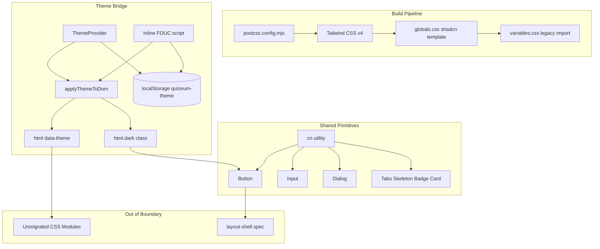
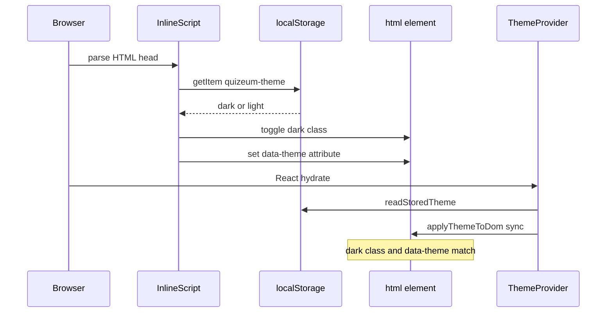
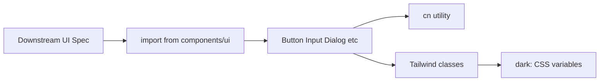
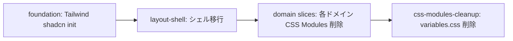

# Design Document: quizeum-ui-foundation

## Overview

本機能は Quizeum の Phase 24 UI 刷新における**基盤スペック**である。Tailwind CSS と shadcn/ui を Next.js 16 + React 19 ビルドパイプラインに統合し、shadcn 標準テーマ（neutral/zinc デフォルト）を正としたスタイル基盤、`cn()` ユーティリティ、および初期共通プリミティブ（Button, Input, Dialog, Tabs, Skeleton, Badge, Card）を `src/components/ui/` に提供する。

**Users**: 開発者は後続 6 スペック（layout-shell, discovery, personal, quiz-lifecycle, editor, admin-creator）で本基盤のプリミティブと Tailwind ユーティリティを利用する。エンドユーザーは既存のテーマ切替（ダーク/ライト）と永続化体験を維持しつつ、段階的に shadcn 標準の見た目へ移行する。

**Impact**: 現行の Vanilla CSS 正方針を Tailwind + shadcn 正に転換する起点となる。`globals.css` を shadcn テンプレートに置換し、旧ネオン/Glassmorphism トークンは新基盤では正としない。未移行ドメインは `variables.css` 共存により引き続き動作する。

### Goals
- Tailwind CSS v4 + PostCSS + shadcn/ui のビルドパイプライン統合（CI グリーン）
- shadcn 標準 CSS 変数によるライト/ダークテーマ（`dark` クラス）
- 既存 `ThemeProvider` / `quizeum-theme` / FOUC 防止の互換移行（dual bridge）
- `cn()` と shadcn プリミティブ Wave 1（7 種）+ Wave 2（17 種）の提供
- steering（`tech.md`, `structure.md`）のスタイリング方針改定

### Non-Goals
- 個別ページ・ドメインコンポーネントの Tailwind 移行
- Sidebar / Header / BottomNav / LayoutWrapper の再構築
- 旧 Quizeum ビジュアル（ネオン/Glassmorphism/body gradient）の再現
- `variables.css` の完全削除（`css-modules-cleanup` 候補へ委譲）
- Framer Motion 導入、API/認可変更

---

## Boundary Commitments

### This Spec Owns
- Tailwind CSS / PostCSS 設定（`postcss.config.mjs`, `package.json` 依存追加）
- shadcn 設定（`components.json`）と CLI 初期化
- `src/app/globals.css`（shadcn テンプレート + 移行期 legacy import）
- `src/lib/utils.ts`（`cn()` ユーティリティ）
- `src/lib/theme.ts` の `dark` クラス対応（FOUC script 含む）
- `src/context/theme-context.tsx` の `applyThemeToDom` 更新
- `src/app/layout.tsx` のフォント統合（Geist）およびスタイル import 確認
- **Primitive Wave 1** shadcn プリミティブ: `button.tsx`, `input.tsx`, `dialog.tsx`, `tabs.tsx`, `skeleton.tsx`, `badge.tsx`, `card.tsx`
- **Primitive Wave 2** shadcn プリミティブ: `form.tsx`, `label.tsx`, `select.tsx`, `switch.tsx`, `table.tsx`, `alert.tsx`, `accordion.tsx`, `radio-group.tsx`, `progress.tsx`, `popover.tsx`, `textarea.tsx`, `toggle-group.tsx`, `alert-dialog.tsx`, `chart.tsx`（recharts）, `avatar.tsx`, `dropdown-menu.tsx`, `separator.tsx`
- `.kiro/steering/tech.md` / `structure.md` のスタイリング記述更新
- foundation 単体 Jest テスト、ビルド/E2E 回帰確認

### Out of Boundary
- 設定画面テーマ切替 UI の見た目更新（`quizeum-user-settings-ui` — ただし `dark` クラス追随は隣接期待）
- シェルコンポーネント（`quizeum-ui-layout-shell`）
- 既存 `src/components/ui/` 独自プリミティブ（skeleton-card, number-stepper 等）の削除・置換
- 各ドメイン `.module.css` の削除
- `variables.css` の削除

### Allowed Dependencies
- **既存 `lib/theme.ts` API**（`Theme`, `parseTheme`, `readStoredTheme`, `writeStoredTheme`, `THEME_STORAGE_KEY`）: 公開インターフェース維持（P0）
- **既存 `ThemeProvider` / `useTheme`**: Context API 維持（P0）
- **`layout.tsx` の Provider ツリー順序**: `PostHogProvider` → `AuthProvider` → `ThemeProvider` → `LayoutWrapper`（P0）
- **`lucide-react`**: shadcn プリミティブ内アイコン（P1、既存導入済み）
- **`variables.css`**: 移行期のみ `globals.css` から import（P1）
- **Next.js 16 App Router / React 19**: フレームワーク基盤（P0）

### Revalidation Triggers
- `quizeum-theme` キー名または許可値の変更
- `dark` クラス適用ロジックの変更（全 shadcn コンポーネント影響）
- `data-theme` dual bridge の削除タイミング（未移行 CSS Modules 破綻リスク）
- `components.json` の `style` / `baseColor` 変更
- `src/components/ui/` プリミティブ API の破壊的変更

---

## Architecture

### Existing Architecture Analysis
- **スタイル**: `globals.css` が `variables.css` を import。body にネオングラデーション、`glass-card` ユーティリティ定義。約 80 CSS Modules が `--color-primary` 等の旧トークンを参照。
- **テーマ**: `data-theme` 属性方式。`getThemeInitScript()` が inline で同期設定。`ThemeProvider` が client 側で同期更新。
- **UI プリミティブ**: `src/components/ui/` に 7 ファイル（CSS Modules 付き）。shadcn 未導入。
- **ビルド**: Tailwind/PostCSS 未設定。`npm run build` / `npm run test` / `npm run test:e2e` が CI で実行される。

### Architecture Pattern & Boundary Map

**Strangler + Dual Theme Bridge**: 新スタイル基盤（Tailwind/shadcn）を追加し、旧 CSS Modules は移行完了まで共存。テーマは `dark` クラス（shadcn 正）と `data-theme` 属性（旧 CSS 正）を同時適用。



**Architecture Integration**:
- Selected pattern: Strangler Fig + Dual Theme Bridge
- Domain boundaries: foundation はスタイル基盤とプリミティブのみ。ページ/シェルは後続スペック
- Existing patterns preserved: `ThemeProvider` Context API、`quizeum-theme` キー、FOUC inline script 配置
- New components rationale: Tailwind/shadcn は Phase 24 全スライスの前提条件
- Steering compliance: `tech.md` を Tailwind + shadcn 正に改定

### Technology Stack

| Layer | Choice / Version | Role in Feature | Notes |
|-------|------------------|-----------------|-------|
| Frontend | Next.js 16.2.6, React 19.2.4 | App Router, RSC + Client | 既存バージョン維持 |
| Styling | Tailwind CSS v4, `@tailwindcss/postcss` | ユーティリティクラス基盤 | PostCSS 経由 |
| UI Library | shadcn/ui (CLI latest) | Radix ベースプリミティブ | `components.json` で init |
| Class Utils | `clsx`, `tailwind-merge`, `cva` | `cn()` 実装 | shadcn 標準 |
| Radix | `@radix-ui/react-dialog`, `react-tabs` 等 | アクセシブルプリミティブ | CLI add で追加 |
| Fonts | Geist Sans/Mono (`next/font`) | shadcn 推奨タイポグラフィ | Outfit 依存撤廃 |
| Theme | `dark` class + `data-theme` dual | 移行期ブリッジ | 完了後 data-theme 削除可 |
| Persistence | `localStorage` (`quizeum-theme`) | テーマ永続化 | 既存キー維持 |
| Icons | `lucide-react` ^1.16.0 | プリミティブ内アイコン | 既存導入済み |
| Testing | Jest 30, Playwright 1.60 | 単体・E2E 回帰 | 既存スイート |

---

## File Structure Plan

### Directory Structure
```
./
├── components.json                    # [NEW] shadcn CLI 設定
├── postcss.config.mjs                 # [NEW] Tailwind PostCSS プラグイン
├── package.json                       # [MODIFY] tailwind, shadcn 依存追加

.kiro/steering/
├── tech.md                            # [MODIFY] Tailwind + shadcn 方針
└── structure.md                       # [MODIFY] スタイル配置記述

src/
├── app/
│   ├── globals.css                    # [MODIFY] shadcn テンプレート + legacy import
│   └── layout.tsx                     # [MODIFY] Geist フォント追加
├── lib/
│   ├── utils.ts                       # [NEW] cn()
│   └── theme.ts                       # [MODIFY] dark class + dual bridge
├── context/
│   └── theme-context.tsx              # [MODIFY] applyThemeToDom 更新
└── components/ui/
    ├── button.tsx                     # [NEW] shadcn Button
    ├── input.tsx                      # [NEW] shadcn Input
    ├── dialog.tsx                     # [NEW] shadcn Dialog
    ├── tabs.tsx                       # [NEW] shadcn Tabs
    ├── skeleton.tsx                   # [NEW] shadcn Skeleton
    ├── badge.tsx                      # [NEW] shadcn Badge
    ├── card.tsx                       # [NEW] shadcn Card — Wave 1
    ├── form.tsx                       # [NEW] shadcn Form — Wave 2
    ├── label.tsx                      # [NEW] shadcn Label — Wave 2
    ├── select.tsx                     # [NEW] shadcn Select — Wave 2
    ├── switch.tsx                     # [NEW] shadcn Switch — Wave 2
    ├── table.tsx                      # [NEW] shadcn Table — Wave 2
    ├── alert.tsx                      # [NEW] shadcn Alert — Wave 2
    ├── accordion.tsx                  # [NEW] shadcn Accordion — Wave 2
    ├── radio-group.tsx                # [NEW] shadcn RadioGroup — Wave 2
    ├── progress.tsx                   # [NEW] shadcn Progress — Wave 2
    ├── popover.tsx                    # [NEW] shadcn Popover — Wave 2
    ├── textarea.tsx                   # [NEW] shadcn Textarea — Wave 2
    ├── toggle-group.tsx               # [NEW] shadcn ToggleGroup — Wave 2
    ├── alert-dialog.tsx               # [NEW] shadcn AlertDialog — Wave 2
    ├── chart.tsx                      # [NEW] shadcn Chart (recharts) — Wave 2
    ├── avatar.tsx                     # [NEW] shadcn Avatar — Wave 2
    ├── dropdown-menu.tsx              # [NEW] shadcn DropdownMenu — Wave 2
    ├── separator.tsx                  # [NEW] shadcn Separator — Wave 2
    ├── skeleton-card.tsx              # [UNCHANGED] 既存（後続で置換）
    ├── number-stepper.tsx             # [UNCHANGED] 既存
    └── ...                            # [UNCHANGED] 他既存 ui ファイル

src/styles/
└── variables.css                      # [UNCHANGED] 移行期共存

tests/
└── lib/
    ├── theme.test.ts                  # [MODIFY] dark class 適用テスト追加
    └── utils.test.ts                  # [NEW] cn() テスト
```

### Modified Files
- `package.json` — tailwindcss, @tailwindcss/postcss, postcss, clsx, tailwind-merge, class-variance-authority, @radix-ui/* 追加
- `src/app/globals.css` — shadcn テンプレートに置換。`@import "tailwindcss"`、CSS 変数、base layer。末尾に `@import "../styles/variables.css"` を移行期のみ残す。body gradient / glass-card ユーティリティは削除
- `src/lib/theme.ts` — `applyThemeToDocument(theme)` ヘルパー追加。`getThemeInitScript()` を `dark` クラス + `data-theme` dual 設定に更新
- `src/context/theme-context.tsx` — `applyThemeToDom` を共有ヘルパー経由に変更
- `src/app/layout.tsx` — `next/font` Geist 追加、`className` でフォント変数を body に適用
- `tests/lib/theme.test.ts` — dual bridge の DOM 適用テスト追加

---

## System Flows

### テーマ初期化フロー（初回描画 + ハイドレーション）



### shadcn プリミティブ利用フロー（後続スペック向け）



---

## Requirements Traceability

| Requirement | Summary | Components | Interfaces | Flows |
|-------------|---------|------------|------------|-------|
| 1.1 | 本番ビルド成功 | PostCSS, Tailwind, globals.css | package.json scripts | — |
| 1.2 | dev サーバー起動 | Next.js dev | — | — |
| 1.3 | lint エラーなし | ESLint config 互換 | — | — |
| 1.4 | TS strict 互換 | 全新規ファイル strict | — | — |
| 2.1 | ライト shadcn 表示 | globals.css CSS vars | — | Theme init |
| 2.2 | ダーク shadcn 表示 | globals.css + dark class | applyThemeToDom | Theme init |
| 2.3 | 旧ビジュアル非再現 | globals.css（gradient 削除） | — | — |
| 2.4 | Card border/shadow | card.tsx | Card props | — |
| 2.5 | Geist/Inter フォント | layout.tsx, globals.css | next/font | — |
| 3.1 | テーマ保存 | theme.ts, ThemeProvider | writeStoredTheme | — |
| 3.2 | テーマ復元 | theme.ts, ThemeProvider | readStoredTheme | Theme init |
| 3.3 | 同期初期化 | getThemeInitScript | inline script | Theme init |
| 3.4 | ハイドレーション一致 | ThemeProvider | useTheme | Theme init |
| 3.5 | デフォルト dark | theme.ts | DEFAULT_THEME | — |
| 3.6 | 不正値フォールバック | theme.ts | parseTheme | — |
| 4.1 | プリミティブ 7 種 | components/ui/* | shadcn exports | — |
| 4.2 | cn() 提供 | lib/utils.ts | cn() | — |
| 4.3 | 型付き API | 全プリミティブ | TypeScript props | — |
| 4.4 | shadcn デフォルトスタイル | CLI default theme | — | — |
| 5.1 | variables 共存 | globals.css import | — | — |
| 5.2 | gradient/glass 非正 | globals.css 整理 | — | — |
| 5.3 | DOM/testid 不変 | 本スペックはページ未変更 | — | — |
| 6.1 | E2E グリーン | 回帰確認タスク | Playwright | — |
| 6.2 | Jest グリーン | theme/utils tests | Jest | — |
| 6.3 | 機能契約不変 | ルート/認可未変更 | — | — |
| 7.1 | tech.md 更新 | steering | — | — |
| 7.2 | structure.md 更新 | steering | — | — |
| 7.3 | Tailwind 禁止撤廃可能 | steering 方針転換 | — | — |

---

## Components and Interfaces

| Component | Domain/Layer | Intent | Req Coverage | Key Dependencies (P0/P1) | Contracts |
|-----------|--------------|--------|--------------|--------------------------|-----------|
| BuildPipeline | Infra | Tailwind/PostCSS 統合 | 1.1, 1.2, 1.3 | Next.js (P0) | — |
| GlobalsStyles | Styling | shadcn CSS 変数 + base | 2.1–2.5, 5.1, 5.2 | variables.css (P1) | State |
| ThemeBridge | Theme | dark + data-theme dual | 3.1–3.6 | lib/theme.ts (P0) | State |
| CnUtility | Utility | クラス名結合 | 4.2 | clsx, tailwind-merge (P0) | Service |
| ShadcnPrimitives | UI | 共通プリミティブ | 4.1, 4.3, 4.4 | Radix, cva (P0) | State |
| SteeringDocs | Docs | 方針改定 | 7.1–7.3 | — | — |

### Styling Layer

#### GlobalsStyles

| Field | Detail |
|-------|--------|
| Intent | shadcn 標準 CSS 変数と Tailwind base をアプリ全体に適用 |
| Requirements | 2.1, 2.2, 2.3, 2.4, 2.5, 5.1, 5.2 |

**Responsibilities & Constraints**
- `@import "tailwindcss"` と shadcn テンプレート CSS 変数（`:root` / `.dark`）を定義
- 移行期のみ `@import "../styles/variables.css"` を末尾に配置
- body gradient、glass-card ユーティリティは削除（新基盤の正としない）
- `@theme inline` で Geist フォント変数を Tailwind に登録

**Dependencies**
- Inbound: layout.tsx — globals.css import（P0）
- Outbound: variables.css — 移行期 legacy トークン（P1）

**Contracts**: State [x]

##### State Management
- State model: CSS 変数（`--background`, `--foreground`, `--primary` 等）が `dark` クラスで切替
- Persistence: ブラウザ描画時のみ。永続化は ThemeBridge が担当

**Implementation Notes**
- Integration: shadcn CLI init が生成する globals.css をベースに、legacy import のみ手動追加
- Validation: ライト/ダーク切替時に `--background` 値が変化することを DevTools で確認
- Risks: variables.css の `:root` と shadcn `:root` の変数名衝突 — shadcn 変数を優先し、旧変数は `--color-primary` 等別名のため衝突リスク低

#### ThemeBridge

| Field | Detail |
|-------|--------|
| Intent | テーマ永続化・DOM 適用・FOUC 防止の一元管理 |
| Requirements | 3.1, 3.2, 3.3, 3.4, 3.5, 3.6 |

**Responsibilities & Constraints**
- `applyThemeToDocument(theme: Theme)` を `lib/theme.ts` に集約
- `theme === 'dark'` → `document.documentElement.classList.add('dark')`、light → `remove('dark')`
- 同時に `document.documentElement.dataset.theme = theme` を設定（dual bridge）
- `getThemeInitScript()` は `applyThemeToDocument` と同等ロジックを inline IIFE で実行
- 公開 API（`Theme`, `parseTheme`, `readStoredTheme`, `writeStoredTheme`, `useTheme`）は破壊的変更しない

**Dependencies**
- Inbound: layout.tsx — inline script（P0）
- Inbound: theme-context.tsx — client 更新（P0）
- Outbound: localStorage — `quizeum-theme`（P0）

**Contracts**: State [x]

##### Service Interface
```typescript
export type Theme = 'dark' | 'light';

export function applyThemeToDocument(theme: Theme): void;

export function parseTheme(value: string | null): Theme;
export function readStoredTheme(): Theme;
export function writeStoredTheme(theme: Theme): void;
export function getThemeInitScript(): string;
```

- Preconditions: `theme` は `'dark' | 'light'` のみ
- Postconditions: DOM の `dark` クラスと `data-theme` が `theme` と一致
- Invariants: `THEME_STORAGE_KEY` は `'quizeum-theme'` 固定

**Implementation Notes**
- Integration: `theme-context.tsx` の `applyThemeToDom` を `applyThemeToDocument` の thin wrapper に
- Validation: Jest jsdom で classList と dataset を検証
- Risks: 将来 `data-theme` 削除時は全 CSS Modules の `[data-theme]` セレクタ除去が前提

### Utility Layer

#### CnUtility

| Field | Detail |
|-------|--------|
| Intent | Tailwind クラス名の条件付き結合と競合解決 |
| Requirements | 4.2 |

**Contracts**: Service [x]

##### Service Interface
```typescript
import { type ClassValue } from 'clsx';

export function cn(...inputs: ClassValue[]): string;
```

**Implementation Notes**
- Integration: `clsx` + `tailwind-merge` の shadcn 標準実装
- Validation: `cn('px-2', 'px-4')` が `'px-4'` を返すことを Jest で確認

### UI Layer

#### ShadcnPrimitives

| Field | Detail |
|-------|--------|
| Intent | 後続スペック共有の Radix ベース UI プリミティブ |
| Requirements | 4.1, 4.3, 4.4 |

**Responsibilities & Constraints**
- shadcn CLI `add` で生成されたコンポーネントをそのまま配置（初版カスタム最小）
- 各コンポーネントは `'use client'` 要件に従う（Radix 利用コンポーネント）
- 既存 `skeleton-card.tsx` 等とは別ファイルで共存

**Dependencies**
- Inbound: CnUtility — 全プリミティブ（P0）
- External: @radix-ui/react-* — Dialog, Tabs（P0）

**Contracts**: State [x]

**Implementation Notes**
- Integration Wave 1: `npx shadcn@latest add button input dialog tabs skeleton badge card`
- Integration Wave 2: `npx shadcn@latest add form label select switch table alert accordion radio-group progress popover textarea toggle-group alert-dialog chart avatar dropdown-menu separator`
- Chart 追加時に `recharts` 依存が package.json に追加されることを確認する
- Validation: 各コンポーネントをテストページまたは Story なしで import してビルド通過を確認
- Risks: CLI 生成コードのバージョン差 — `components.json` をコミットし再現性を確保

#### ShadcnPrimitives Wave 2

| Field | Detail |
|-------|--------|
| Intent | 後続 6 ドメインスペック（layout-shell, discovery, personal, quiz-lifecycle, editor, admin-creator）が共有する拡張プリミティブ |
| Requirements | 4.1, 4.3, 4.4, 4.5 |

**Responsibilities & Constraints**
- Wave 2 は Wave 1 完了後に CLI `add` で一括生成する（下流スペックでの重複 `npx shadcn add` は禁止）
- Form は `react-hook-form` + `@hookform/resolvers` 依存を伴う（CLI デフォルト）
- Chart は recharts ベース。admin-creator の AnalyticsChart が直接利用する
- Avatar / DropdownMenu / Separator は layout-shell が消費するが、所有権は foundation に集約

**Dependencies**
- Inbound: CnUtility — 全プリミティブ（P0）
- Inbound: ShadcnPrimitives Wave 1 — ビルド・`components.json` 前提（P0）
- External: @radix-ui/react-* — 各 Wave 2 コンポーネント（P0）
- External: recharts — Chart プリミティブ（P1）

---

## Error Handling

### Error Strategy
- `localStorage` 読み書き失敗時は `DEFAULT_THEME`（`dark`）にフォールバックし、アプリ表示を継続（既存 `theme.ts` パターン踏襲）
- shadcn init / build 失敗時はマージをブロック。CI で `npm run build` を必須ゲートとする

### Error Categories and Responses
- **Build Errors**: Tailwind/PostCSS 設定不備 → 設定ファイル修正、再ビルド
- **Theme Errors**: 不正 localStorage 値 → `parseTheme` で `dark` フォールバック
- **Hydration Mismatch**: `suppressHydrationWarning` on `<html>` を維持（既存 layout.tsx パターン）

---

## Testing Strategy

### Unit Tests
1. `parseTheme` — 有効値・null・不正値のフォールバック（既存テスト拡張）
2. `applyThemeToDocument` — `dark` 時に `classList.contains('dark')` かつ `dataset.theme === 'dark'`
3. `applyThemeToDocument` — `light` 時に `dark` クラスなしかつ `dataset.theme === 'light'`
4. `cn()` — 条件付きクラス結合と tailwind-merge 競合解決
5. `getThemeInitScript` — 生成文字列が `quizeum-theme` キーを参照すること

### Integration Tests
1. `ThemeProvider` — `setTheme('light')` 後に DOM がライト状態になること
2. globals.css — ビルド後の CSS バンドルに Tailwind base が含まれること（build 成功で間接確認）

### E2E/UI Tests
1. 既存 Playwright スイート全体がグリーン（回帰）
2. 設定画面テーマ切替 E2E（`quizeum-user-settings-ui` 既存 spec）が dual bridge 下で通過
3. ホーム画面（`/`）がエラーなく描画されること

### Build/Lint Validation
1. `npm run build` 成功
2. `npm run lint` 新規エラーなし
3. `npm run test` 全パス

---

## Migration Strategy



- **Phase 1（本スペック）**: 基盤追加、variables 共存、dual theme bridge
- **Phase 2–7（後続スペック）**: ドメイン単位で CSS Modules → Tailwind/shadcn 置換
- **Phase 8（cleanup 候補）**: 未参照 `.module.css` と `variables.css` 削除、`data-theme` bridge 除去

**Rollback**: foundation マージ前のコミットに revert。`components.json` と PostCSS 設定の削除で旧ビルドに復帰可能。
