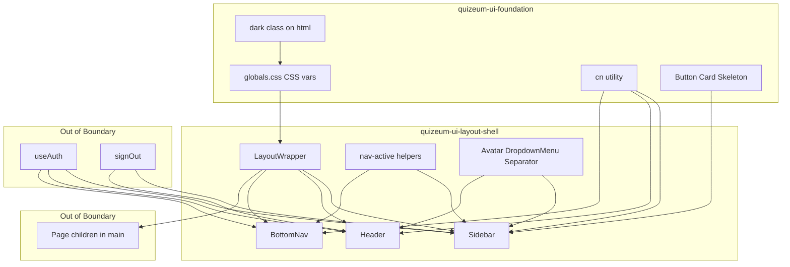
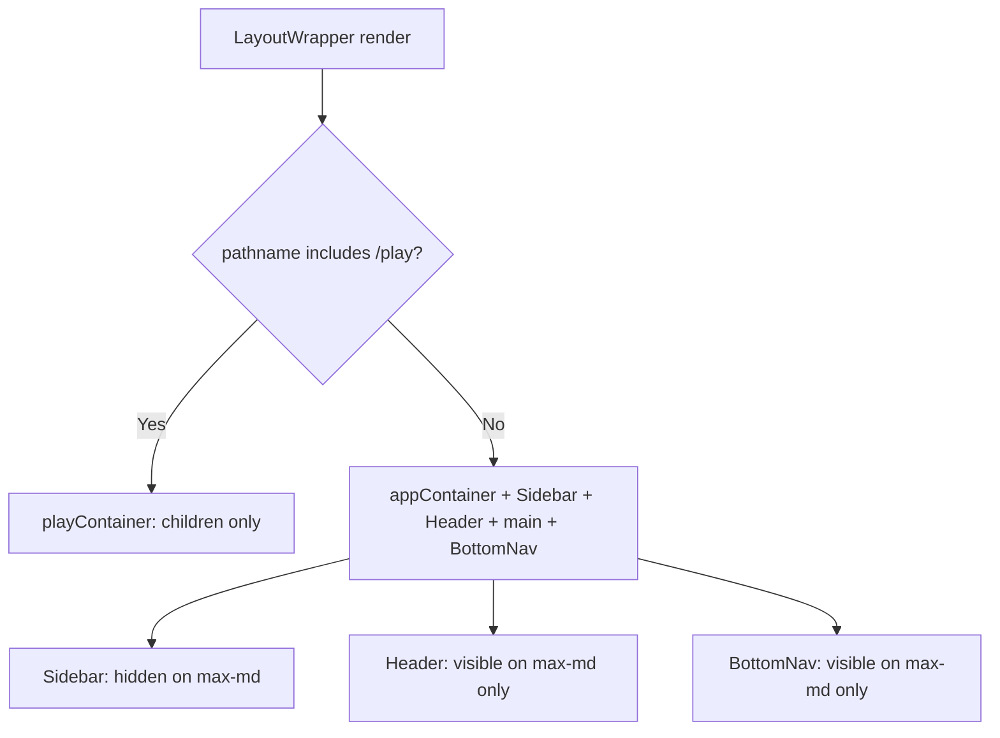
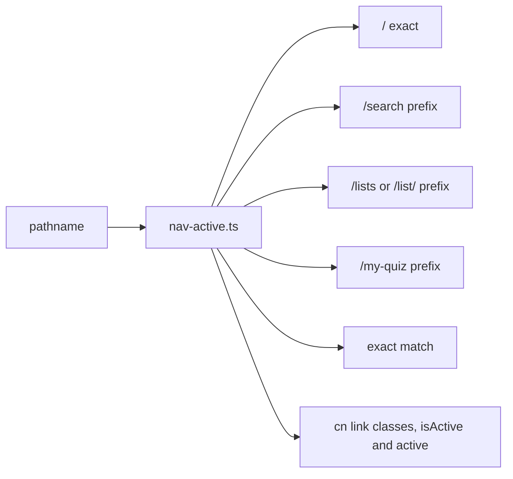
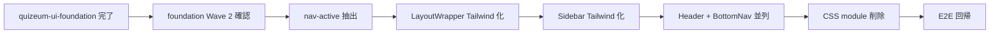

# Design Document: quizeum-ui-layout-shell

## Overview

本機能は Phase 24 UI 刷新の**第 2 スペック**であり、Quizeum のアプリシェル（`LayoutWrapper`, `Sidebar`, `Header`, `BottomNav`）を `quizeum-ui-foundation` の shadcn 標準テーマと Tailwind ユーティリティ上に再構築する。既存のナビゲーション IA、レスポンシブ契約、`/play` 没入型表示、認証連携、`data-testid` は変更しない。

**Users**: 全エンドユーザーがシェル経由でナビゲーションする。開発者は後続ドメインスライス（discovery, personal 等）がシェル内 `main` でページを描画する前提を利用する。

**Impact**: `src/components/layout/` の CSS Modules（4 ファイル）を削除し、旧 glass/neon スタイルを shadcn 標準サーフェスに置換。UI 刷新の最初のユーザー可視変更となる。

### Goals
- シェル 4 コンポーネントの Tailwind + shadcn 再実装
- レスポンシブ挙動（275px / 70px Sidebar、BottomNav 60px）の維持
- ライト/ダーク両テーマでの視認性確保（shadcn 標準パレット）
- `e2e/layout.spec.ts` および Jest 回帰グリーン
- シェル `.module.css` 完全削除

### Non-Goals
- ページコンテンツ移行（後続スペック）
- ThemeProvider / テーマ永続化変更
- BottomNav IA 変更
- `variables.css` 削除
- `quizeum-sidebar-layout` spec 文書の更新（roadmap 既存 spec update 候補）

---

## Boundary Commitments

### This Spec Owns
- `src/components/layout/layout-wrapper.tsx` — シェル骨格・`/play` 分岐・メイン余白
- `src/components/layout/sidebar.tsx` — PC/タブレット Sidebar ナビ・アカウントポップアップ
- `src/components/layout/header.tsx` — モバイル Header・プロフィールポップアップ
- `src/components/layout/bottom-nav.tsx` — モバイル BottomNav
- シェル関連 `.module.css` の削除
- `tests/components/layout-wrapper.test.tsx` の更新
- E2E `e2e/layout.spec.ts` 回帰確認

### Out of Boundary
- `src/app/layout.tsx` の Provider ツリー変更（foundation / 既存順序維持）
- `ThemeProvider`, `lib/theme.ts`, FOUC script（`quizeum-ui-foundation`）
- `AuthProvider`, `useAuth`, Firebase `signOut`（既存認証）
- 各ページルートのコンテンツコンポーネント
- 設定ページ UI・テーマ切替トグル（`quizeum-user-settings-ui`）
- `variables.css` および未移行ドメインの CSS Modules

### Allowed Dependencies
- **`quizeum-ui-foundation`**: Tailwind, `globals.css` CSS 変数, `cn()`, Button, Card, Skeleton（P0）
- **`useAuth` / `AuthProvider`**: ログイン状態・ユーザー情報（P0、読み取りのみ）
- **`next/link`, `next/navigation`**: ルーティング（P0）
- **`lucide-react`**: ナビアイコン（P0、既存）
- **`signOut` from `@/lib/firebase/auth`**: ログアウト（P0、既存呼び出し維持）
- **foundation Primitive Wave 2**: Avatar, DropdownMenu, Separator（P0、存在確認のみ）

### Revalidation Triggers
- レスポンシブブレークポイント（1024 / 768 / 767）または余白寸法（275 / 70 / 60）の変更
- `/play` シェル非表示条件の変更
- 既存 `data-testid` の削除・リネーム
- ナビ IA（メニュー項目・到達先ルート）の変更
- foundation の CSS 変数名または `dark` クラス戦略の破壊的変更

---

## Architecture

### Existing Architecture Analysis
- **配置**: `LayoutWrapper` は `layout.tsx` 内で `ThemeProvider` 直下。children を `main` でラップ
- **スタイル**: 各コンポーネントが専用 `.module.css` を import。`glass-card`, `text-neon-*`, `btn btn-accent` 等の旧グローバルクラスに依存
- **レスポンシブ**: CSS `@media` で Sidebar 表示/非表示、幅、ラベル非表示を制御。`layout-wrapper.module.css` が padding-left / padding-bottom を担当
- **ナビロジック**: Sidebar 内 `isNavItemActive`、BottomNav 内 `isHomeActive` / `isSearchActive`。Header/Sidebar は独立した `popupOpen` state
- **テスト**: `e2e/layout.spec.ts`（7 ケース）、`layout-wrapper.test.tsx`（モック子コンポーネント）

### Architecture Pattern & Boundary Map

**Strangler Style Migration**: コンポーネント責務・props・認証連携は維持。スタイル層のみ CSS Modules → Tailwind + shadcn プリミティブに置換。



**Architecture Integration**:
- Selected pattern: Strangler Fig（スタイル層のみ置換）
- Domain boundaries: シェルはナビゲーション chrome のみ。ページ本体は後続スペック
- Existing patterns preserved: `/play` 分岐、`useAuth` 連携、セマンティック HTML、`data-testid`
- New components rationale: shadcn Avatar/DropdownMenu/Separator はシェル UX の標準化に必要
- Steering compliance: shadcn 標準テーマ、glass/neon 非再現

### Technology Stack

| Layer | Choice / Version | Role in Feature | Notes |
|-------|------------------|-----------------|-------|
| Frontend | Next.js 16, React 19 | Client Components (`'use client'`) | 既存維持 |
| Styling | Tailwind CSS v4 | レイアウト・レスポンシブ | foundation 経由 |
| UI | shadcn/ui | Button, Avatar, DropdownMenu, Separator | foundation Wave 1+2 |
| Icons | lucide-react | ナビアイコン | 既存 |
| Routing | next/navigation | pathname 判定 | 既存 |
| Auth | useAuth context | 表示切替 | 読み取りのみ |
| Testing | Jest, Playwright | 単体・E2E | 既存 spec 回帰 |

---

## File Structure Plan

### Directory Structure
```
src/components/layout/
├── layout-wrapper.tsx       # [MODIFY] Tailwind 化、module.css 削除
├── sidebar.tsx              # [MODIFY] Tailwind + shadcn、module.css 削除
├── header.tsx               # [MODIFY] Tailwind + shadcn、module.css 削除
├── bottom-nav.tsx           # [MODIFY] Tailwind + shadcn、module.css 削除
├── nav-active.ts            # [NEW] 共有アクティブ判定ヘルパー
├── layout-wrapper.module.css  # [DELETE]
├── sidebar.module.css         # [DELETE]
├── header.module.css          # [DELETE]
└── bottom-nav.module.css      # [DELETE]

src/components/ui/
└── (avatar, dropdown-menu, separator は foundation Wave 2 で提供)

tests/components/
└── layout-wrapper.test.tsx  # [MODIFY] プレイ分岐テスト維持

e2e/
└── layout.spec.ts           # [UNCHANGED] 回帰確認のみ
```

### Modified Files
- `layout-wrapper.tsx` — `styles.*` を Tailwind クラスに置換。`appContainer` → `flex min-h-screen bg-background` 等。レスポンシブ余白は `lg:pl-[275px] md:pl-[70px] max-md:pb-[60px]`
- `sidebar.tsx` — `glass-card`/neon 削除。`fixed` Sidebar + shadcn Button/DropdownMenu/Avatar/Separator。`isNavItemActive` を `nav-active.ts` へ抽出
- `header.tsx` — モバイルのみ `fixed top-0` Header。DropdownMenu ポップアップ。testid 維持
- `bottom-nav.tsx` — `fixed bottom-0` + `border-t bg-background`。アクティブに `active` クラス付与
- `nav-active.ts` — `isNavItemActive`, `isHomeActive`, `isSearchActive` を集約（Sidebar/BottomNav 共有）

---

## System Flows

### レイアウト分岐（プレイ vs 通常）



### レスポンシブ表示マトリクス

| Viewport | Sidebar | Header | BottomNav | Content padding-left | Content padding-bottom |
|----------|---------|--------|-----------|---------------------|------------------------|
| ≥1024px | 275px 固定 | hidden | hidden | 275px | 0 |
| 768–1023px | 70px アイコンのみ | hidden | hidden | 70px | 0 |
| ≤767px | hidden | visible | fixed bottom | 0 | 60px |
| `/play` 全幅 | hidden | hidden | hidden | 0 | 0 |

### アクティブナビ判定フロー



---

## Requirements Traceability

| Requirement | Summary | Components | Interfaces | Flows |
|-------------|---------|------------|------------|-------|
| 1.1 | PC Sidebar 表示 | Sidebar, LayoutWrapper | responsive classes | Layout matrix |
| 1.2 | Tablet 縮小 Sidebar | Sidebar | w-[70px], label hidden | Layout matrix |
| 1.3 | Mobile Header+BottomNav | Header, BottomNav | max-md display | Layout matrix |
| 1.4 | Play シェル非表示 | LayoutWrapper | pathname check | Play flow |
| 1.5 | ブレークポイント維持 | All shell | tailwind breakpoints | Layout matrix |
| 2.1–2.7 | Sidebar ナビ・active | Sidebar, nav-active.ts | menuItems, isNavItemActive | Active flow |
| 2.8–2.9 | Sidebar testid | Sidebar | data-testid attrs | — |
| 3.1–3.4 | Header モバイル | Header | DropdownMenu | — |
| 3.5–3.8 | BottomNav | BottomNav, nav-active.ts | nav links, testid | Active flow |
| 4.1–4.5 | コンテンツ余白 | LayoutWrapper | padding classes | Layout matrix |
| 5.1–5.5 | shadcn ビジュアル | All shell | bg-background, border-border | Theme vars |
| 6.1 | CSS module 削除 | layout/*.module.css | — | — |
| 6.2–6.3 | 構造維持 | LayoutWrapper | semantic HTML | — |
| 6.4 | active class E2E | Sidebar, BottomNav | cn + 'active' | Active flow |
| 6.5 | data-analytics | Sidebar, Header | analytics attrs | — |
| 7.1–7.4 | 回帰テスト | tests, e2e | — | — |

---

## Components and Interfaces

| Component | Domain/Layer | Intent | Req Coverage | Key Dependencies (P0/P1) | Contracts |
|-----------|--------------|--------|--------------|--------------------------|-----------|
| LayoutWrapper | Layout | シェル骨格・play 分岐・main 余白 | 1, 4, 6 | usePathname (P0) | State |
| Sidebar | Navigation | PC/Tablet グローバルナビ | 1, 2, 5, 6 | useAuth, nav-active (P0) | State |
| Header | Navigation | モバイル上部 chrome | 1, 3, 5, 6 | useAuth, DropdownMenu (P1) | State |
| BottomNav | Navigation | モバイル下部ナビ | 1, 3, 5, 6 | useAuth, nav-active (P0) | State |
| NavActiveHelpers | Utility | パス→アクティブ判定 | 2, 3 | — | Service |
| ShellPrimitives | UI | Avatar, DropdownMenu, Separator | 2, 3, 5 | foundation cn (P0) | State |

### Layout Layer

#### LayoutWrapper

| Field | Detail |
|-------|--------|
| Intent | 子ページをシェルでラップし `/play` 時は没入表示 |
| Requirements | 1.1–1.4, 4.1–4.5, 6.2, 6.3 |

**Responsibilities & Constraints**
- `usePathname()` で `pathname.includes('/play')` を判定（既存ロジック維持）
- 非プレイ: `Sidebar` + `mainWrapper`(Header + main) + `BottomNav`
- プレイ: `min-h-screen bg-background` のみで children
- メイン `max-w-[1200px] mx-auto`、padding `p-6 max-md:p-4`

**Dependencies**
- Inbound: `layout.tsx` — children 渡し（P0）
- Outbound: Sidebar, Header, BottomNav（P0）

**Contracts**: State [x]

**Implementation Notes**
- Integration: CSS module import を削除し Tailwind のみ
- Validation: `layout-wrapper.test.tsx` で play 分岐を検証
- Risks: padding 値の誤りでコンテンツが Sidebar と重なる — 275/70/60 を design 表と一致させる

### Navigation Layer

#### Sidebar

| Field | Detail |
|-------|--------|
| Intent | PC/Tablet 固定 Sidebar とアカウントメニュー |
| Requirements | 1.1, 1.2, 2.1–2.9, 5.1–5.5, 6.4, 6.5 |

**Responsibilities & Constraints**
- `fixed left-0 top-0 h-screen z-90` — PC `w-[275px]`、tablet `md:w-[70px] lg:w-[275px]` 相当（`hidden md:flex max-md:hidden` は tablet+、mobile hidden）
- 正確なブレークポイント: `hidden md:flex lg:w-[275px] md:w-[70px] max-lg:...` — Tailwind: `max-md:hidden md:flex` + `lg:w-[275px] md:w-[70px]`
- Tablet ラベル非表示: `md:max-lg:[&_.nav-label]:hidden` またはコンポーネント内条件レンダリング
- メニュー構成・順序は現行 `menuItems` 配列を維持
- アクティブ: `cn('nav-link-styles', isActive && 'active')` — 見た目は `bg-accent/10 text-accent border-l-2 border-accent` 等
- ポップアップ: shadcn `DropdownMenu`（`DropdownMenuTrigger` = profileBtn、`data-testid="sidebar-profile-btn"`）
- ログインボタン: shadcn `Button` variant `default` または `secondary`

**Dependencies**
- Inbound: useAuth (P0), nav-active.ts (P0)
- Outbound: signOut, router.push (P0)

**Contracts**: State [x]

**Implementation Notes**
- Integration: `glass-card` → `border-r bg-background/95 backdrop-blur supports-[backdrop-filter]:bg-background/80`（glass 非再現、shadcn 標準サーフェス）
- Validation: E2E PC sidebar search active、Phase 23 lists 遷移
- Risks: tablet ポップアップ位置 — 現行は `left: calc(100% + 12px)`。DropdownMenu の `side="right"` で再現

#### Header

| Field | Detail |
|-------|--------|
| Intent | モバイル上部ロゴ・アクション行 |
| Requirements | 1.3, 3.1–3.4, 5.1–5.5, 6.5 |

**Responsibilities & Constraints**
- `md:hidden fixed top-0 w-full z-90 border-b bg-background`
- ログイン時: 作問 Link（`data-testid="mobile-header-create-btn"`）+ DropdownMenu プロフィール
- ポップアップ項目と testid は現行と同一
- PC (`md+`) では `return null` または `hidden`

**Dependencies**
- Inbound: useAuth (P0), DropdownMenu (P1)

**Contracts**: State [x]

#### BottomNav

| Field | Detail |
|-------|--------|
| Intent | モバイル下部固定ナビ |
| Requirements | 1.3, 3.5–3.8, 5.1–5.5, 6.4 |

**Responsibilities & Constraints**
- `md:hidden fixed bottom-0 inset-x-0 h-[60px] border-t bg-background z-90`
- ログイン/未ログインで表示項目分岐（現行維持）
- アクティブクラス `active` を E2E 互換で付与
- アバター画像は `rounded-full w-6 h-6` または shadcn Avatar size sm

**Dependencies**
- Inbound: useAuth (P0), nav-active.ts (P0)

**Contracts**: State [x]

### Utility Layer

#### NavActiveHelpers

| Field | Detail |
|-------|--------|
| Intent | パスと href の一致判定を Sidebar/BottomNav で共有 |
| Requirements | 2.5–2.7, 3.7 |

**Contracts**: Service [x]

##### Service Interface
```typescript
export function isNavItemActive(pathname: string | null, href: string): boolean;

export function isHomeActive(pathname: string | null): boolean;

export function isSearchActive(pathname: string | null): boolean;
```

- Preconditions: `pathname` は `usePathname()` の戻り値
- Postconditions: `/` と `/search` は相互排他で true にならない（各関数の責務範囲内）
- Invariants: `/lists` は `/lists` および `/list/` プレフィックスを含む（既存 Sidebar ロジック踏襲）

---

## Error Handling

### Error Strategy
- ログアウト失敗時は既存通り `console.error` のみ。UI はポップアップを開いたまま（既存挙動維持）
- 認証 loading 中は Skeleton（foundation）でアバター領域をプレースホルダ表示

### Error Categories and Responses
- **Auth loading**: Skeleton 表示、ナビ項目は user 依存部分のみ遅延
- **Missing avatarUrl**: BottomNav は UserIcon フォールバック（既存維持）

---

## Testing Strategy

### Unit Tests
1. `layout-wrapper.test.tsx` — `/play` パスで Sidebar/Header/BottomNav がレンダーされないこと
2. `layout-wrapper.test.tsx` — 非プレイパスで子コンポーネントが描画されること
3. `nav-active.test.ts` — `isNavItemActive` の `/`, `/search`, `/lists`, `/list/`, `/my-quiz` ケース
4. `nav-active.test.ts` — `isHomeActive` / `isSearchActive` の相互排他

### Integration Tests
1. Sidebar — ログイン/未ログインで menuItems 数が期待通り（RTL + mock useAuth）
2. Header — プロフィールボタンクリックでポップアップ項目が表示（mock useAuth）

### E2E/UI Tests
1. `e2e/layout.spec.ts` — 全 7 ケースグリーン（レスポンシブ表示、search active、Phase 23 導線、play 非表示）
2. ライト/ダーク手動確認 — Sidebar・BottomNav のコントラスト（タスク内チェックリスト）

### Build/Lint Validation
1. `npm run build` 成功
2. `npm run lint` 新規エラーなし
3. `npm run test` 全パス

---

## Migration Strategy



- **前提**: `quizeum-ui-foundation` マージ済み（Tailwind ビルド可能）
- **Rollback**: 個別コンポーネントを revert。CSS Modules 復元で旧ビルドに戻せる
- **完了定義**: 4 つの `.module.css` 削除 + `layout.spec.ts` グリーン
