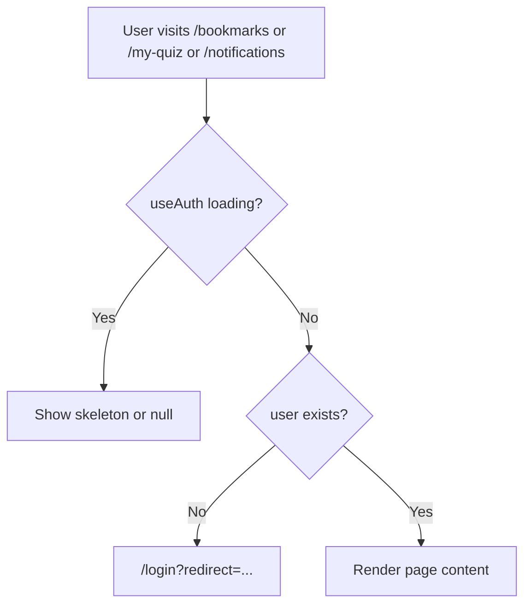
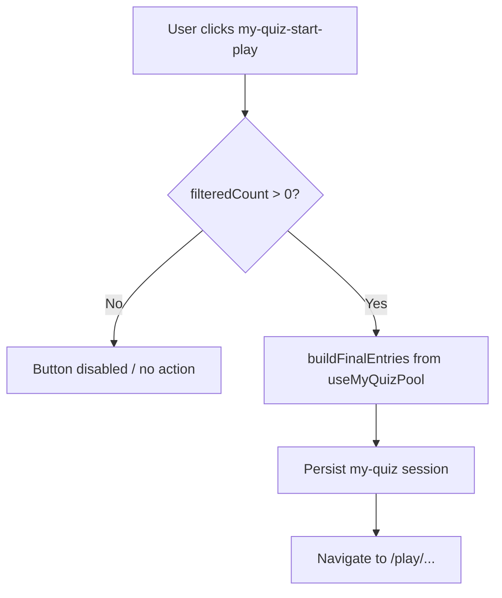
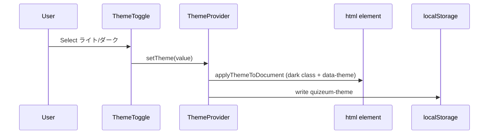

# Design Document: quizeum-ui-personal

## Overview

本機能は Phase 24 UI 刷新の**第 4 スペック**であり、Quizeum の個人ハブ（プロフィール、ブックマーク、通知、設定、マイクイズ、ログイン、料金）を `quizeum-ui-foundation` の shadcn 標準テーマと `quizeum-ui-layout-shell` のシェル内で Tailwind + shadcn プリミティブ上に再構築する。既存のルーティング、認証ガード、データフロー（hooks/services）、`data-testid` は変更しない。

**Users**: 全エンドユーザーが個人向け機能（プロフィール閲覧、ブックマーク管理、通知、テーマ設定、マイクイズ、ログイン、料金確認）を利用する。開発者は本移行後に downstream spec（auth-profile-ui, my-quiz-ui 等）の UI 記述を shadcn 正に更新する。

**Impact**: 個人ハブ境界内の約 15 CSS Modules を削除し、旧 glass/neon/`btn` グローバルクラス依存を解消。フォーム・タブ・グリッド・テーブル UI を shadcn パターンに統一する。

### Goals
- 7 ルート群の shadcn + Tailwind 再実装（shadcn 標準寄せ）
- settings `ThemeToggle` を foundation テーマ bridge と統合
- マイクイズ 4 ソース・出題設定・プレイ開始・非公開問題契約の維持
- ブックマーク/プロフィール/通知のタブ・グリッド UI 統一
- 個人ハブ `.module.css` 完全削除
- 関連 E2E（user-settings, my-quiz, auth-profile）グリーン

### Non-Goals
- シェル（Sidebar/Header/BottomNav）移行
- Firestore 取得・認可・`useMyQuizPool` ロジック変更
- プレイ画面 UI（quiz-lifecycle）
- Stripe Pricing Table iframe スタイル統一
- 新機能・IA 変更
- `variables.css` 削除

---

## Boundary Commitments

### This Spec Owns
- **Pages**: `src/app/profile/*`, `bookmarks/*`, `notifications/*`, `settings/*`, `my-quiz/*`, `login/*`, `pricing/*`
- **Components**: `src/components/profile/*`, `bookmark/*`, `my-quiz/*`, `settings/*`, `pricing/*`
- **共有 UI スケルトン**: `src/components/ui/bookmarks-skeleton.tsx`, `notifications-skeleton.tsx`（Tailwind 化、`*.module.css` 削除）
- **ThemeToggle** の shadcn 化（`theme-toggle.module.css` 削除）
- 個人ハブ関連 `.module.css` の削除
- 関連 E2E 回帰確認

### Out of Boundary
- `src/components/layout/*`（layout-shell）
- `src/lib/theme.ts`, `ThemeProvider`, FOUC script（foundation）
- `src/hooks/useMyQuizPool.ts`, `useBookmarkFeed.ts` 等フック実装
- `src/lib/my-quiz-pool.ts`, `src/services/*` データ層
- プレイルート `/play/*`（quiz-lifecycle）
- Stripe webhook / Checkout サーバー処理

### Allowed Dependencies
- **`quizeum-ui-foundation`**（P0）: Tailwind, `globals.css`, `cn()`, Button, Input, Dialog, Tabs, Skeleton, Badge, Card
- **`quizeum-ui-layout-shell`**（P0）: LayoutWrapper 内 `main` レンダリング前提
- **`useAuth` / `AuthProvider`**（P0）: 読み取り・リダイレクト
- **`useTheme` / `ThemeProvider`**（P0）: ThemeToggle のみ利用、API 変更禁止
- **`useMyQuizPool`, `useBookmarkFeed`, `useActiveGenres`, `useActiveTags`**（P0）: 読み取りのみ
- **Firebase auth**（P0）: login ページ既存呼び出し維持
- **`resolvePricingUiState`, Stripe Checkout**（P1）: pricing 既存契約
- **foundation Primitive Wave 2**（P0）: Form, Label, Textarea, Select, Switch, Table, Alert, ToggleGroup（存在確認のみ）

### Revalidation Triggers
- マイクイズ `data-testid` のリネーム・削除
- 非公開クイズ問題の取得元ルール変更
- `quizeum-theme` キーまたは Theme API 変更（foundation）
- 保護ルートのリダイレクト URL 変更
- shadcn プリミティブ API の破壊的変更

---

## Architecture

### Existing Architecture Analysis
- **配置**: 各ルートは App Router page.tsx + `*-client.tsx` Client Component。CSS Modules で page/client/components 双方にスタイル
- **認証**: 保護ページは `useEffect` で未ログイン → `/login?redirect=...`。my-quiz は `router.replace`
- **マイクイズ**: `MyQuizClient` が `useMyQuizPool` を orchestrate。子コンポーネント 5 つ + 共有 `my-quiz.module.css`
- **テーマ**: `ThemeToggle` が CSS Modules ボタン群。settings は section レイアウト + グローバル `btn` クラス
- **テスト**: E2E が testid 中心（my-quiz, bookmarks, settings）。auth-profile は text + role locator

### Architecture Pattern & Boundary Map

**Strangler Style Migration**: コンポーネント props・hooks 連携・testid は維持。スタイル層のみ CSS Modules → Tailwind + shadcn。

```mermaid
graph TD
    subgraph Foundation [quizeum-ui-foundation]
        Globals[globals.css + cn]
        Primitives[Button Card Tabs Input ...]
        ThemeBridge[ThemeProvider + dark class]
    end

    subgraph Shell [quizeum-ui-layout-shell]
        Main[main content area]
    end

    subgraph Personal [quizeum-ui-personal]
        Settings[Settings + ThemeToggle]
        Login[Login Page]
        Profile[Profile cluster]
        Bookmarks[Bookmarks]
        Notifications[Notifications]
        MyQuiz[My Quiz]
        Pricing[Pricing]
        PersonalUI[Form Table ToggleGroup ...]
    end

    subgraph Hooks [Out of Boundary]
        UseAuth[useAuth]
        UseMyQuiz[useMyQuizPool]
        UseBookmark[useBookmarkFeed]
        Services[services/*]
    end

    Foundation --> Personal
    Shell --> Main
    Main --> Personal
    ThemeBridge --> Settings
    UseAuth --> Login
    UseAuth --> Bookmarks
    UseAuth --> MyQuiz
    UseMyQuiz --> MyQuiz
    UseBookmark --> Bookmarks
    Services --> Profile
    Services --> Notifications
    PersonalUI --> Profile
    PersonalUI --> MyQuiz
    PersonalUI --> Bookmarks
```



**Architecture Integration**:
- Selected pattern: Strangler Fig（UI 層のみ）
- Domain boundaries: 個人ハブ 7 ドメイン。データ/hooks は触らない
- Existing patterns preserved: 認証リダイレクト、testid、my-quiz pool 契約
- New components rationale: Form/Table/ToggleGroup は shadcn 標準パターン統一に必要
- Steering compliance: Phase 24 shadcn 標準寄せ、glass/neon 非再現

### Technology Stack

| Layer | Choice / Version | Role in Feature | Notes |
|-------|------------------|-----------------|-------|
| Frontend | Next.js 16, React 19 | App Router Client Components | 既存維持 |
| Styling | Tailwind CSS v4 | レイアウト・spacing | foundation 経由 |
| UI | shadcn/ui | Form, Table, ToggleGroup, Card, Tabs, Switch | foundation + 本 spec add |
| Auth | Firebase Auth | login ソーシャル/E2E | 既存 |
| State | React hooks | useMyQuizPool 等 | Out of Boundary |
| Icons | lucide-react | 通知・プロフィール・pricing | 既存 |
| Testing | Jest, Playwright | 回帰 | 既存 spec |

---

## File Structure Plan

### Directory Structure
```
src/app/
├── profile/
│   ├── [uid]/
│   │   ├── page.tsx                    # [MODIFY] Suspense fallback Tailwind 化
│   │   ├── profile-client.tsx          # [MODIFY] shadcn Card/Tabs/Badge
│   │   ├── profile.module.css          # [DELETE]
│   │   ├── likes/
│   │   │   ├── likes-client.tsx        # [MODIFY]
│   │   │   └── likes.module.css        # [DELETE]
│   │   └── connections/
│   │       ├── connections-client.tsx  # [MODIFY]
│   │       └── connections.module.css  # [DELETE]
│   └── edit/
│       ├── profile-edit-client.tsx     # [MODIFY] shadcn Form
│       └── edit.module.css             # [DELETE]
├── bookmarks/
│   ├── page.tsx                        # [UNCHANGED]
│   ├── bookmarks-client.tsx            # [MODIFY]
│   └── bookmarks.module.css            # [DELETE]
├── notifications/
│   ├── notifications-client.tsx        # [MODIFY] Card list
│   └── notifications.module.css        # [DELETE]
├── settings/
│   ├── settings-client.tsx             # [MODIFY] Card sections
│   └── settings.module.css             # [DELETE]
├── my-quiz/
│   ├── page.tsx                        # [MODIFY] container Tailwind
│   ├── my-quiz-client.tsx              # [MODIFY]
│   └── my-quiz.module.css              # [DELETE]
├── login/
│   ├── page.tsx                        # [MODIFY] shadcn Card/Alert/Button
│   └── login.module.css                # [DELETE]
└── pricing/
    ├── page.tsx                        # [MODIFY] grid Card layout
    └── pricing.module.css              # [DELETE]

src/components/
├── profile/
│   ├── profile-list-card.tsx           # [MODIFY]
│   ├── profile-play-history-panel.tsx  # [MODIFY]
│   ├── profile-lists-panel.tsx         # [MODIFY]
│   ├── profile-skeleton.tsx            # [MODIFY] Tailwind skeleton
│   ├── profile-skeleton.module.css     # [DELETE]
│   ├── connections-skeleton.tsx        # [MODIFY]
│   ├── connections-skeleton.module.css # [DELETE]
│   └── likes-skeleton.tsx              # [MODIFY]
├── bookmark/
│   ├── bookmarks-tabs.tsx              # [MODIFY] shadcn Tabs
│   ├── bookmark-quiz-grid.tsx          # [MODIFY] Card grid
│   ├── bookmark-list-grid.tsx          # [MODIFY]
│   ├── bookmark-question-list.tsx      # [MODIFY]
│   ├── question-bookmark-toggle.tsx    # [MODIFY] Button variant
│   └── bookmark.module.css             # [DELETE]
├── my-quiz/
│   ├── my-quiz-source-panel.tsx        # [MODIFY] ToggleGroup
│   ├── my-quiz-search-section.tsx      # [MODIFY] Input/Select
│   ├── my-quiz-filtered-table.tsx      # [MODIFY] Table
│   ├── my-quiz-play-settings.tsx       # [MODIFY] ToggleGroup/Switch
│   ├── my-quiz-preview-bar.tsx         # [MODIFY] Button
│   └── my-quiz.module.css              # [DELETE]
├── settings/
│   ├── theme-toggle.tsx                # [MODIFY] ToggleGroup + useTheme
│   └── theme-toggle.module.css         # [DELETE]
└── pricing/
    ├── free-plan-card.tsx              # [MODIFY]
    ├── pro-plan-card.tsx               # [MODIFY]
    ├── checkout-feedback-banner.tsx    # [MODIFY] Alert
    ├── subscription-status-badge.tsx   # [MODIFY] Badge
    ├── checkout-feedback-banner.module.css   # [DELETE]
    ├── subscription-status-badge.module.css  # [DELETE]
    ├── free-plan-card.module.css       # [DELETE]
    └── pro-plan-card.module.css        # [DELETE]

src/components/ui/
├── form.tsx                            # [NEW] shadcn Form
├── label.tsx                           # [NEW]
├── textarea.tsx                        # [NEW]
├── select.tsx                          # [NEW]
├── switch.tsx                          # [NEW]
├── table.tsx                           # [NEW]
├── alert.tsx                           # [NEW]
└── toggle-group.tsx                    # [NEW] (+ toggle.tsx if CLI adds)
```

### Modified Files（要点）
- 全 `[MODIFY]` ファイル — `styles.*` / `glass-card` / `btn btn-*` を Tailwind + shadcn に置換
- `theme-toggle.tsx` — ToggleGroup でダーク/ライト 2 択。`data-testid="settings-theme-toggle"` 維持
- `my-quiz-*` — 全 testid 維持（grep チェックリスト参照 research.md）
- `login/page.tsx` — Card レイアウト、Alert でエラー、`#e2e-test-login-btn` 維持

---

## System Flows

### 保護ルートアクセス



### マイクイズプレイ開始



### テーマ切替（settings）



---

## Requirements Traceability

| Requirement | Summary | Components | Interfaces | Flows |
|-------------|---------|------------|------------|-------|
| 1.1–1.5 | shadcn 標準ビジュアル | 全 Personal コンポーネント | Tailwind + shadcn | — |
| 2.1–2.6 | 設定・テーマ | SettingsClient, ThemeToggle | useTheme | テーマ切替 |
| 3.1–3.6 | ログイン | login/page.tsx | Firebase auth, getSafeRedirectPath | 保護ルート |
| 4.1–4.8 | プロフィール群 | ProfileClient, ProfileEdit, Likes, Connections | user/quiz services | — |
| 5.1–5.6 | ブックマーク | BookmarksClient, BookmarksTabs, grids | useBookmarkFeed | 保護ルート |
| 6.1–6.5 | 通知 | NotificationsClient | notification service | 保護ルート |
| 7.1–7.9 | マイクイズ | MyQuizClient, 5 sub-panels | useMyQuizPool | プレイ開始 |
| 8.1–8.6 | 料金 | PricingPage, plan cards | resolvePricingUiState | checkout query |
| 9.1–9.4 | レガシー削除 | 全 boundary CSS | — | — |
| 10.1–10.5 | 回帰 | — | npm scripts | E2E |

---

## Components and Interfaces

| Component | Domain/Layer | Intent | Req Coverage | Key Dependencies (P0/P1) | Contracts |
|-----------|--------------|--------|--------------|--------------------------|-----------|
| PersonalPrimitives | UI foundation | Form/Table/ToggleGroup 等追加 | 1, 4, 7 | foundation cn() (P0) | — |
| ThemeToggle | settings | テーマ 2 択 UI | 2 | useTheme (P0) | State |
| SettingsClient | settings | 設定ページレイアウト | 2 | ThemeToggle, useAuth (P0) | — |
| LoginPage | login | 認証 UI | 3 | Firebase auth (P0) | — |
| ProfileClient | profile | プロフィール詳細 | 4 | user/quiz services (P0) | — |
| ProfileEditClient | profile | プロフィール編集 Form | 4 | Form primitives (P0) | — |
| BookmarksClient | bookmark | ブックマークハブ | 5 | useBookmarkFeed (P0) | — |
| BookmarksTabs | bookmark | 3 タブ切替 | 5 | shadcn Tabs (P0) | — |
| NotificationsClient | notifications | 通知一覧 | 6 | notification service (P0) | — |
| MyQuizClient | my-quiz | マイクイズ orchestrator | 7 | useMyQuizPool (P0) | — |
| MyQuizSourcePanel | my-quiz | 4 取得元 ToggleGroup | 7, 7.7, 7.8 | pool flags (P0) | State |
| MyQuizFilteredTable | my-quiz | 候補 Table + pagination | 7 | Table (P0) | — |
| MyQuizPlaySettings | my-quiz | 出題数・シャッフル | 7 | Switch/ToggleGroup (P0) | State |
| MyQuizPreviewBar | my-quiz | プレイ開始 CTA | 7 | buildEntries (P0) | — |
| PricingPageContent | pricing | 料金比較 | 8 | resolvePricingUiState (P1) | — |

### settings

#### ThemeToggle

| Field | Detail |
|-------|--------|
| Intent | ダーク/ライト 2 択。foundation dual bridge 経由で DOM 更新 |
| Requirements | 2.2, 2.3, 2.4 |

**Responsibilities & Constraints**
- `useTheme().setTheme` のみ呼び出し。`lib/theme.ts` 直接操作禁止
- `data-testid="settings-theme-toggle"` をルート要素に維持
- ボタンラベル「ダーク」「ライト」を維持（E2E role name 互換）

**Dependencies**
- Inbound: SettingsClient — 配置 (P0)
- Outbound: ThemeProvider — setTheme (P0)

**Contracts**: State [x]

##### State Management
- State model: `theme: 'dark' | 'light'` from context
- Persistence: ThemeProvider → localStorage `quizeum-theme`

**Implementation Notes**
- shadcn `ToggleGroup` type="single" で 2 ボタン
- `theme-toggle.module.css` 削除

#### SettingsClient

| Field | Detail |
|-------|--------|
| Intent | テーマセクション + 条件付きアカウントセクション |
| Requirements | 2.1, 2.5, 2.6 |

**Implementation Notes**
- shadcn `Card` + `CardHeader` + `CardContent` で section 再構成
- プロフィール編集 Link を shadcn `Button variant="secondary"` に
- `settings.module.css` 削除

### login

#### LoginPageContent

| Field | Detail |
|-------|--------|
| Intent | ソーシャルログイン + E2E ボタン + エラー表示 |
| Requirements | 3.1–3.6 |

**Implementation Notes**
- `glass-card` → shadcn `Card`
- エラー → shadcn `Alert variant="destructive"`
- ソーシャルボタン → shadcn `Button variant="outline"` full width
- `#e2e-test-login-btn` id 維持
- spinner → shadcn `Skeleton` または animate-spin div

### profile

#### ProfileClient

| Field | Detail |
|-------|--------|
| Intent | プロフィールヘッダー、バッジ、フォロー、コンテンツ Tabs |
| Requirements | 4.1–4.4, 4.8 |

**Implementation Notes**
- コンテンツ切替を shadcn `Tabs` に統一（quizzes/lists/history）
- tier badge は shadcn `Badge` variant で再実装（neon class 削除）
- `profile.module.css` 削除

#### ProfileEditClient

| Field | Detail |
|-------|--------|
| Intent | 表示名・bio 編集 Form |
| Requirements | 4.5 |

**Implementation Notes**
- shadcn Form + Label + Input + Textarea
- 保存ボタン shadcn Button。visible text「保存」維持（auth-profile E2E）

### bookmark

#### BookmarksTabs

| Field | Detail |
|-------|--------|
| Intent | クイズ/リスト/問題 3 タブ |
| Requirements | 5.3, 5.4 |

**Implementation Notes**
- shadcn `Tabs` — `data-testid="bookmarks-tabs"` を TabsList ラッパーに
- 各 TabsTrigger に既存 testid

### my-quiz

#### MyQuizSourcePanel

| Field | Detail |
|-------|--------|
| Intent | 4 取得元トグル |
| Requirements | 7.3, 7.4, 7.7, 7.8 |

**Implementation Notes**
- ToggleGroupItem per source。各 `data-testid` 維持
- `aria-pressed` 相当は ToggleGroup デフォルト

#### MyQuizFilteredTable

| Field | Detail |
|-------|--------|
| Intent | フィルタ済み候補 Table + ページネーション |
| Requirements | 7.4 |

**Implementation Notes**
- shadcn Table, TableHeader, TableBody, TableRow, TableCell
- pagination Button + 全 testid 維持

#### MyQuizPlaySettings

| Field | Detail |
|-------|--------|
| Intent | 出題数プリセット、カスタム input、シャッフル |
| Requirements | 7.5 |

**Implementation Notes**
- プリセット: ToggleGroup
- シャッフル: Switch — `data-testid="my-quiz-shuffle-toggle"`
- カスタム: shadcn Input type=number — `my-quiz-custom-count`

### pricing

#### PricingPageContent + Plan Cards

| Field | Detail |
|-------|--------|
| Intent | Free/Pro 比較、checkout feedback、Pro badge |
| Requirements | 8.1–8.6 |

**Implementation Notes**
- grid: `grid gap-6 md:grid-cols-2`
- Sparkles icon color を `text-primary` に（`#00ff66` 削除）
- CheckoutFeedbackBanner → Alert
- SubscriptionStatusBadge → Badge

---

## Error Handling

### Error Strategy
- 既存クライアント側エラー処理を維持（login Firebase code → 日本語、my-quiz pool error alert、notifications fetch console.error）
- shadcn `Alert` で視覚統一。新規エラーパス追加禁止

### Error Categories and Responses
**User Errors**: ログイン失敗 → Alert destructive。マイクイズ pool 空 → 既存 disabled/start 制御
**System Errors**: pool fetch 失敗 → `my-quiz-pool-error` + 再試行 Button

---

## Testing Strategy

### Unit Tests
- ThemeToggle: mount 時 testid 存在、クリックで setTheme 呼び出し（mock context）
- BookmarksTabs: タブ切替で onTabChange 発火
- nav-active 等は本 spec 外

### Integration Tests
- 不要（hooks は Out of Boundary）。optional smoke は Task 10

### E2E/UI Tests
- `e2e/user-settings.spec.ts`: settings container, theme toggle, data-theme, localStorage, reload
- `e2e/my-quiz.spec.ts`: redirect, my-quiz-page, start-play visible
- `e2e/auth-profile.spec.ts`: login flow, profile edit save, logout
- 追加: bookmarks/notifications 手動 smoke（testid 存在確認）

### Performance/Load
- 本 spec 対象外（UI のみ、データ取得変更なし）

---

## Supporting References
- `research.md` — codebase 分析、testid リスク、プリミティブ選定
- `.kiro/specs/quizeum-ui-foundation/design.md` — Theme bridge 詳細
- `.kiro/specs/quizeum-ui-layout-shell/design.md` — シェル境界
