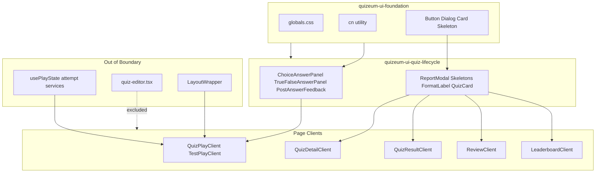
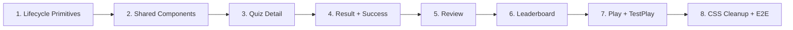
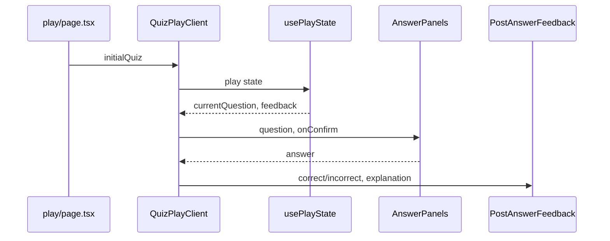
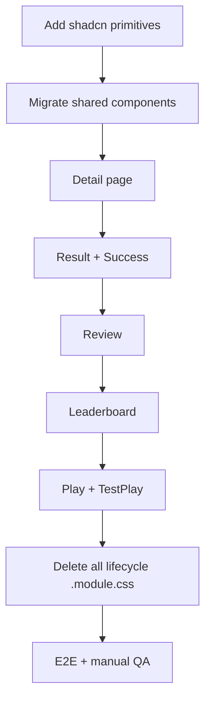

# Design Document: quizeum-ui-quiz-lifecycle

## Overview

本機能は Phase 24 UI 刷新の**クイズライフサイクル垂直スライス**である。クイズ詳細・プレイ・結果・投稿完了・復習・リーダーボードおよび関連コンポーネント（回答パネル、通報モーダル、スケルトン）を `quizeum-ui-foundation` の shadcn 標準テーマと Tailwind ユーティリティ上に再構築する。既存のルーティング・プレイ契約・attempt データフロー・`data-testid` は変更しない。

**Users**: プレイヤーは没入型プレイ、回答フィードバック、結果確認、復習、ランキング閲覧を利用する。開発者は後続スペック（editor 等）と分離されたライフサイクル境界で Tailwind 移行を完了する。

**Impact**: クイズライフサイクル領域の CSS Modules（`play.module.css` 約 773 行を含む計 24+ ファイル）を削除し、shadcn 標準サーフェスに置換。UI 刷新における最高リスク・最大 CSS 量のスライスとなる。

### Goals
- ライフサイクル全画面の Tailwind + shadcn 再実装（shadcn 標準寄せ）
- プレイ没入型 UX、回答フィードバック、タイマー/進捗表示の機能・体感維持
- `/play` および `/quiz/test-play/*` でのシェル非表示契約維持（layout-shell 委譲）
- 結果画面のリーダーボード・アコーディオン詳細の動作維持
- 当該 `.module.css` 完全削除と関連 E2E グリーン

### Non-Goals
- クイズエディタ UI（`quizeum-ui-editor`）
- プレイエンジン hooks / attempt services の変更
- 新ルート・新機能・API/認可変更
- 旧 Quizeum ビジュアル（ネオン/Glassmorphism）の再現
- `variables.css` 削除

---

## Boundary Commitments

### This Spec Owns
- `src/app/quiz/[id]/` — 詳細・プレイ・結果・成功（edit 除く）
- `src/app/quiz/review/` — 復習画面
- `src/app/quiz/test-play/` — テストプレイ
- `src/app/leaderboard/` — グローバルリーダーボード
- ライフサイクル用 `src/components/quiz/`（エディタ関連除く）:
  - 回答: `choice-answer-panel`, `true-false-answer-panel`, `post-answer-feedback`
  - 結果: `result-question-details-accordion`, `quiz-dual-leaderboard`, `difficulty-vote-stars`, `report-modal`
  - 表示: `quiz-card`, `format-label`, `quick-press-question-text`, `question-text-display`, `reference-question-badge`
  - スケルトン: `detail-skeleton`, `play-skeleton`, `result-skeleton`, `recommend-skeleton`, `leaderboard-skeleton`
- ライフサイクル関連 `.module.css` の削除
- E2E 回帰（`quiz-play.spec.ts`, `leaderboard.spec.ts` 等）

### Out of Boundary
- `src/app/quiz/create/`, `src/app/quiz/[id]/edit/` — エディタ（`quizeum-ui-editor`）
- `quiz-editor.tsx`, `genre-editor-select`, `author-quiz-reference-panel`, `editor-skeleton`, `quiz-list-skeleton`, `feedback-skeleton`（`quizeum-ui-admin-creator` が所有）
- `create.module.css`, `editor-skeleton.module.css`
- `LayoutWrapper` / シェル（`quizeum-ui-layout-shell`）
- `usePlayState`, `useAiPlayState`, `services/attempt`, `hooks/useQuickPressStream`
- `variables.css` 削除

### Allowed Dependencies
- **`quizeum-ui-foundation`**: Tailwind, `globals.css`, `cn()`, Button, Dialog, Card, Skeleton, Badge, Input（P0）
- **`quizeum-ui-layout-shell`**: `/play` シェル非表示（P0、読み取りのみ・変更しない）
- **`useAuth`**: ログイン状態表示（P0）
- **既存 hooks/services**: `usePlayState`, `usePlayedQuizIds`, `services/bookmark`, `services/attempt` 等（P0、契約維持）
- **foundation Primitive Wave 2**: RadioGroup, Progress, Accordion, Tabs, Label（P0、存在確認のみ）
- **`lucide-react`**: アイコン（P0）

### Revalidation Triggers
- プレイ画面 DOM 構造または `data-testid` の変更
- 回答パネル props 契約（`onConfirm`, `disabled`, `initialAnswer`）の変更
- `/play` シェル非表示条件の変更（layout-shell 連動）
- shadcn プリミティブ API の破壊的変更
- attempt / スコア表示ロジックの変更（quizeum-core 連動）

---

## Architecture

### Existing Architecture Analysis
- **ルーティング**: App Router。`/quiz/[id]` 詳細、`/play` プレイ、`/result` 結果、`/success` 投稿完了、`/quiz/review` 復習、`/leaderboard` グローバル
- **スタイル**: 各ページ・コンポーネントが専用 `.module.css`。`play.module.css` が最大（約 773 行）。旧 `glass-card`, `btn-accent`, ネオン色クラスに依存
- **プレイ**: `quiz-play-client.tsx` が `usePlayState` + 回答パネル + `PostAnswerFeedback` を編成。`test-play-client.tsx` が同一 `play.module.css` を共有
- **結果**: `quiz-result-client.tsx` がスコア・アコーディオン・リーダーボード・推薦を編成
- **テスト**: `e2e/quiz-play.spec.ts`（フルフロー）、`e2e/leaderboard.spec.ts`

### Architecture Pattern & Boundary Map

**Strangler Style Migration（垂直スライス）**: コンポーネント責務・props・データフローは維持。スタイル層のみ CSS Modules → Tailwind + shadcn に置換。移行順序: 共有コンポーネント → 詳細 → 結果/成功 → 復習 → リーダーボード → プレイ（最後）。



**Architecture Integration**:
- Selected pattern: Strangler Fig + 垂直スライス（画面単位段階移行）
- Domain boundaries: ライフサイクル UI のみ。プレイロジック・エディタ・シェルは境界外
- Existing patterns preserved: ルート、hooks 呼び出し、`data-testid`、RSC + Client 分割
- New components rationale: RadioGroup/Progress/Accordion/Tabs はライフサイクル UX の shadcn 標準化に必要
- Steering compliance: shadcn 標準テーマ、glass/neon 非再現

### Technology Stack

| Layer | Choice / Version | Role in Feature | Notes |
|-------|------------------|-----------------|-------|
| Frontend | Next.js 16, React 19 | App Router, Client Components | 既存維持 |
| Styling | Tailwind CSS v4 | ユーティリティクラス | foundation 経由 |
| UI | shadcn/ui | Button, RadioGroup, Progress, Accordion, Dialog, Tabs, Card, Skeleton | foundation Wave 1+2 |
| Icons | lucide-react | プレイ/結果アイコン | 既存 |
| State | usePlayState 等 | プレイ状態 | 変更しない |
| Data | Firebase / services | attempt, bookmark | 変更しない |
| Testing | Jest, Playwright | 単体・E2E 回帰 | 既存 spec 更新 |

---

## File Structure Plan

### Directory Structure
```
src/components/quiz/
├── choice-answer-panel.tsx           # [MODIFY] Tailwind + RadioGroup
├── true-false-answer-panel.tsx       # [MODIFY] Tailwind + Button
├── post-answer-feedback.tsx          # [MODIFY] Tailwind + Button
├── report-modal.tsx                  # [MODIFY] shadcn Dialog
├── result-question-details-accordion.tsx  # [MODIFY] shadcn Accordion
├── quiz-dual-leaderboard.tsx         # [MODIFY] shadcn Tabs + Card
├── difficulty-vote-stars.tsx         # [MODIFY] Tailwind
├── format-label.tsx                  # [MODIFY] shadcn Badge
├── quiz-card.tsx                     # [MODIFY] shadcn Card
├── quick-press-question-text.tsx     # [MODIFY] Tailwind
├── detail-skeleton.tsx               # [MODIFY] shadcn Skeleton
├── play-skeleton.tsx                 # [MODIFY] shadcn Skeleton
├── result-skeleton.tsx               # [MODIFY] shadcn Skeleton
├── recommend-skeleton.tsx            # [MODIFY] shadcn Skeleton
├── leaderboard-skeleton.tsx          # [MODIFY] shadcn Skeleton
├── *.module.css (lifecycle)          # [DELETE] 上記対応分

src/app/quiz/[id]/
├── page.tsx                          # [MODIFY] page.module.css 削除
├── quiz-detail-client.tsx            # [MODIFY] Tailwind + shadcn
├── page.module.css                   # [DELETE]
├── play/
│   ├── page.tsx                      # [MODIFY]
│   ├── quiz-play-client.tsx          # [MODIFY] 最大変更
│   └── play.module.css               # [DELETE]
├── result/
│   ├── page.tsx                      # [MODIFY]
│   ├── quiz-result-client.tsx        # [MODIFY]
│   ├── recommend-list-client.tsx     # [MODIFY]
│   └── result.module.css             # [DELETE]
└── success/
    ├── success-client.tsx            # [MODIFY]
    └── success.module.css            # [DELETE]

src/app/quiz/review/
├── page.tsx                          # [MODIFY]
├── review-client.tsx                 # [MODIFY]
└── review.module.css                 # [DELETE]

src/app/quiz/test-play/
├── play/page.tsx                     # [MODIFY]
├── play/test-play-client.tsx         # [MODIFY] play と同期
└── result/page.tsx                   # [MODIFY]

src/app/leaderboard/
├── page.tsx                          # [MODIFY]
├── leaderboard-client.tsx            # [MODIFY]
└── leaderboard.module.css            # [DELETE]

e2e/
├── quiz-play.spec.ts                 # [MODIFY] 必要時 selector 更新
└── leaderboard.spec.ts               # [MODIFY] 必要時 selector 更新
```

### Modified Files（要約）
- 共有コンポーネント 18 ファイル — CSS Modules import 削除、Tailwind + shadcn 適用
- ページ Client 8 ファイル — 同上。ロジック・hooks 呼び出しは不変
- `e2e/quiz-play.spec.ts` — class 依存 selector が破損した場合のみ `data-testid` へ更新

---

## System Flows

### 移行フェーズフロー



### プレイ画面レンダリング（変更なし・参照用）



---

## Requirements Traceability

| Requirement | Summary | Components | Interfaces | Flows |
|-------------|---------|------------|------------|-------|
| 1.1–1.7 | クイズ詳細 | QuizDetailClient, FormatLabel, QuizDualLeaderboard | Quiz props | Detail page |
| 2.1–2.7 | 結果・成功 | QuizResultClient, Accordion, DualLeaderboard, SuccessClient | Attempt display | Result flow |
| 3.1–3.4 | 復習 | ReviewClient | Genre filter | Review page |
| 4.1–4.4 | グローバル LB | LeaderboardClient | Tabs | Leaderboard |
| 5.1–5.5 | 回答 UI | ChoiceAnswerPanel, TrueFalseAnswerPanel, PostAnswerFeedback | onConfirm props | Play |
| 6.1–6.7 | プレイ没入 | QuizPlayClient, TestPlayClient, PlaySkeleton | usePlayState | Play |
| 7.1–7.4 | 通報・スケルトン | ReportModal, Skeletons | Dialog | Modal |
| 8.1–8.5 | shadcn ビジュアル | 全コンポーネント | Tailwind tokens | Theme |
| 9.1–9.4 | CSS 削除 | 全対象ファイル | — | Migration |
| 10.1–10.5 | 回帰テスト | E2E, Jest | Playwright | Validation |

---

## Components and Interfaces

| Component | Domain/Layer | Intent | Req Coverage | Key Dependencies (P0/P1) | Contracts |
|-----------|--------------|--------|--------------|--------------------------|-----------|
| LifecyclePrimitives | UI | RadioGroup/Progress/Accordion/Label add | 5.5, 7.4 | foundation cn() (P0) | State |
| ChoiceAnswerPanel | UI | 選択式回答 | 5.1, 5.4, 5.5 | RadioGroup, Button (P0) | Props |
| TrueFalseAnswerPanel | UI | 正誤回答 | 5.2, 5.4, 5.5 | Button (P0) | Props |
| PostAnswerFeedback | UI | 回答後フィードバック | 5.3 | Button (P0) | Props |
| ReportModal | UI | 通報 Dialog | 7.1–7.3 | Dialog (P0) | Props |
| ResultQuestionDetailsAccordion | UI | 結果問題詳細 | 2.2 | Accordion (P0) | Props |
| QuizDualLeaderboard | UI | クイズ内 LB | 2.5, 1.6 | Tabs, Card (P0) | Props |
| LifecycleSkeletons | UI | ローディング | 3.3, 6.4, 7.4 | Skeleton (P0) | Props |
| QuizDetailClient | Page | 詳細画面 | 1.1–1.7 | useAuth, usePlayedQuizIds (P0) | — |
| QuizResultClient | Page | 結果画面 | 2.1–2.5 | attempt display (P0) | — |
| SuccessClient | Page | 投稿完了 | 2.6 | Quiz (P0) | — |
| ReviewClient | Page | 復習 | 3.1–3.4 | genre services (P0) | — |
| LeaderboardClient | Page | グローバル LB | 4.1–4.4 | Firestore (P0) | — |
| QuizPlayClient | Page | 本番プレイ | 6.1–6.7 | usePlayState (P0) | — |
| TestPlayClient | Page | テストプレイ | 6.5 | usePlayState (P0) | — |

### UI Layer

#### ChoiceAnswerPanel

| Field | Detail |
|-------|--------|
| Intent | 単一/複数選択式問題の回答 UI |
| Requirements | 5.1, 5.4, 5.5 |

**Responsibilities & Constraints**
- `question`, `onConfirm`, `initialAnswer`, `disabled` props を維持
- 単一選択: shadcn RadioGroup。複数選択: checkbox パターン + Label
- 確定ボタン: shadcn Button。選択なし時は disabled
- `data-testid` は既存維持（選択肢 label 要素）

**Dependencies**
- Inbound: QuizPlayClient — 問題表示（P0）
- Outbound: choice-answer-utils — serialize/parse（P0）

**Contracts**: Props [x]

```typescript
type ChoiceAnswerPanelProps = {
  question: Question;
  onConfirm: (answer: string) => void;
  initialAnswer?: string;
  disabled?: boolean;
};
```

**Implementation Notes**
- Integration: `choice-answer-panel.module.css` 削除。Tailwind で panel/hint/choiceRow を再現
- Validation: 単一・複数選択とも確定後 `onConfirm` が呼ばれること
- Risks: E2E が `class*="choiceRow"` を参照 — 破損時は testid 追加を検討

#### QuizPlayClient

| Field | Detail |
|-------|--------|
| Intent | 没入型プレイ画面の編成（最大変更ファイル） |
| Requirements | 6.1–6.7 |

**Responsibilities & Constraints**
- `usePlayState` / `useAiPlayState` 呼び出しは不変
- 進捗: shadcn Progress + `play-elapsed-seconds` testid 維持
- 全画面レイアウト: `playContainer` 相当を Tailwind で再現（padding なし、シェル非表示は LayoutWrapper 委譲）
- `play-skip-question`, `quiz-play-skeleton`, `quiz-play-completing` testid 維持

**Dependencies**
- Inbound: play/page.tsx — initialQuiz（P0）
- Inbound: AnswerPanels, PostAnswerFeedback（P0）
- Outbound: attempt services（P0、変更しない）

**Implementation Notes**
- Integration: `play.module.css` 全スタイルを Tailwind クラスへ段階マッピング
- Validation: `e2e/quiz-play.spec.ts` フルフロー + 手動 QA（タイマー、フィードバック、スキップ）
- Risks: 最大リスクファイル。詳細・結果移行完了後に実施

#### ReportModal

| Field | Detail |
|-------|--------|
| Intent | クイズ/問題通報 Dialog |
| Requirements | 7.1–7.3 |

**Responsibilities & Constraints**
- foundation Dialog（DialogContent, DialogHeader, DialogFooter）を使用
- `report-modal-overlay`, `report-modal-content`, `report-reason-input`, `report-submit-btn`, `report-success-message` testid 維持
- 送信ロジック（親から渡される callback）は不変

**Contracts**: Props [x]

---

## Error Handling

### Error Strategy
本スペックはスタイル層のみ変更。既存のエラー表示（alert、console.error、role="alert"）を維持。新規エラーハンドリングは追加しない。

### Error Categories and Responses
- **User Errors**: 未ログイン時のログイン導線 — 既存 router.push 維持
- **System Errors**: attempt 保存失敗 — 既存 optimistic/offline 処理維持
- **UI Errors**: 通報送信失敗 — 既存メッセージ表示維持

---

## Testing Strategy

### Unit Tests
- `ChoiceAnswerPanel` — 単一/複数選択の確定コールバック
- `TrueFalseAnswerPanel` — true/false 選択と testid
- `PostAnswerFeedback` — 正誤表示と次問/結果ボタン
- `ReportModal` — Dialog 開閉と testid 存在
- `nav-active` 等の既存テスト — 変更なしでグリーン

### Integration Tests
- 詳細 Client — ブックマークトグル表示（モック useAuth）
- 結果 Client — アコーディオン展開（モック attempt データ）

### E2E/UI Tests
- `e2e/quiz-play.spec.ts` — 作成→検索→詳細→プレイ→結果→評価フルフロー（**必須**）
- `e2e/leaderboard.spec.ts` — タブ切替とランキング表示
- `e2e/streaming-skeleton.spec.ts` — スケルトン testid（該当時）
- `/play` パスで Sidebar/BottomNav 非表示 — `e2e/layout.spec.ts` 間接確認

### Manual / Visual Regression
- プレイ画面: 没入型レイアウト、回答フィードバック色、タイマー表示、ライト/ダーク両テーマ
- 結果画面: アコーディオン、デュアルリーダーボードタブ

---

## Migration Strategy



- **Rollback trigger**: `e2e/quiz-play.spec.ts` が 2 回連続失敗、またはプレイ没入型 UX の重大退行
- **Validation checkpoint**: 各フェーズ完了時に `npm run build` + 該当 E2E 部分確認
