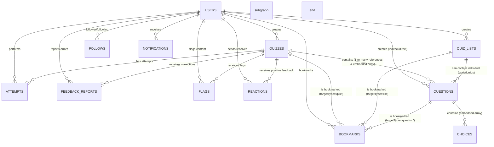

# quizeum 論理DB設計書 (Firestore Schema Specification)

本ドキュメントは、クイズ投稿SNS「quizeum」におけるデータの永続化設計、Firestore コレクション構造、データモデルの型定義、インデックス設計、および非正規化によるパフォーマンス最適化設計を定義します。

---

## 1. 論理ER図 (Mermaid)

FirestoreはNoSQLドキュメント指向データベースですが、データ整合性を担保するため、以下のリレーション関係（論理関係）を意識してスキーマを設計します。

---

## 2. コレクション・スキーマ詳細定義

### 2.1 `users` コレクション (ドキュメントID: `uid`)
ユーザーのプロフィール情報、興味があるジャンル、および獲得した称号バッジを管理します。

> [!IMPORTANT]
> **セキュリティと更新制限 (チート対策)**
> ユーザーの称号バッジ（`badges`）やプレイ回数（`totalPlayCount`）、作成数（`createdQuizzesCount`）、および信頼スコア（`reputationScore`）などのステータス情報は、クライアントからの不正な直接書き込みを完全に防止するため、Firestore Security Rules でクライアント側からの `update` を制限します。これらのフィールドは、クイズ公開やプレイ結果保存のトランザクション、または Cloud Functions 等のサーバーサイドでのみ安全に更新されます。

| フィールド名 | 論理物理型 | 必須 / 任意 | 初期値 / 制約 | 説明 |
| :--- | :--- | :--- | :--- | :--- |
| `id` | `string` | **必須** | Firebase Auth `uid` と一致 | ユーザーの一意なID。 |
| `email` | `string` | **必須** | ユニーク制約 | アカウントのメールアドレス。 |
| `displayName` | `string` | **必須** | 最大30文字 | サービス上の表示名。 |
| `avatarUrl` | `string` | **必須** | デフォルト画像URL | プロフィールアバターのストレージ画像参照先。**[SEC-08対策]** SVG-based XSS防御のため、SVG形式（image/svg+xml）のアップロードは完全禁止（PNG, JPEG, GIFのみ許容）。 |
| `bio` | `string` | 任意 | 最大200文字 / 空文字 | ユーザーの自己紹介・プロフィール説明文。 |
| `followedGenres`| `array (string)` | **必須** | `[]` | ユーザーがフォロー・関心のあるジャンル名の配列。 |
| `badges` | `array (Badge)` | **必須** | `[]` | 獲得した称号バッジオブジェクトのネスト配列。 |
| `createdQuizzesCount` | `number` | **必須** | `0` | 作成して公開したクイズの総数（称号判定の高速化用）。 |
| `totalPlayCount` | `number` | **必須** | `0` | 他者のクイズを完遂した累計プレイ回数（称号判定の高速化用）。 |
| `followersCount` | `number` | **必須** | `0` | このユーザーをフォローしているフォロワーの総数。 |
| `followingCount` | `number` | **必須** | `0` | このユーザーがフォローしているクリエイターの総数。 |
| `createdAt` | `timestamp` | **必須** | `request.time` (サーバー時間) | アカウントの新規登録日時。 |
| `updatedAt` | `timestamp` | **必須** | `request.time` (サーバー時間) | プロフィールの最終更新日時。 |
| `reputationScore` | `number` | **必須** | `0` | コミュニティへの貢献度を定量化した信頼スコア。日次バッチで再計算。下限は0（マイナスにならない）。 |
| `moderationTier` | `string` | **必須** | `'newcomer'` | モデレータ認資ティアー（`'newcomer' \| 'contributor' \| 'moderator' \| 'senior_moderator'`）。`reputationScore`に指定値で自動判定・変更。 |
| `reputationHistory` | `array (object)` | **必須** | `[]` | 直近30件 of スコア変動ログリスト（デバッグ・不正調査用）。各要素は `{ eventId, delta, reason, createdAt }` を持つ。最多30件を超えた場合は古い要素から履歴済みとして削除。 |
| `lastReputationCalculatedAt` | `timestamp` | **必須** | `null` | 日次バッチによるスコア再計算の最終実行日時。冪等性保証用（当日処理済みはスキップ）。 |
| `totalFailedQuestionsCount` | `number` | **必須** | `0` | 未復習の間違い問題の総数（プロフィール画面での弱点克服セクション表示用の高速化ショートカット）。 |
| `deleteStatus` | `string` | **必須** | `'active'` | **[NEW]** アカウントの削除状態（`'active' \| 'delete_pending'`）。退会処理は、IDトークン検証を含むセキュアなサーバーサイドAPI（/api/user/delete-account）を通じてアトミックに実行されます（CISO-SEC-05対策によるサーバー移行）。`delete_pending` に変更されると、Firestore Security Rulesにより本人以外の非公開情報へのアクセスを遮断し、退会済みユーザーと同等の制限がかかる。 |

#### ネストされる `Badge` オブジェクト型
* `id` (`string`): バッジ一意ID（例: `badge_play_100`, `badge_creator_tier1`）
* `title` (`string`): 称号の表示名（例: 「クイズ愛好家」「マスタークリエイター」）
* `description` (`string`): 獲得条件やバッジの説明文。
* `iconName` (`string`): Lucide Reactアイコン名。
* `unlockedAt` (`timestamp`): バッジ獲得日時のタイムスタンプ。

#### 2.1.1 `users/{uid}/reputationLimits` サブコレクション (ドキュメントID: `senderId`)
同一評価者（`senderId`）からこのクリエイターへの信頼スコア加算累計（最大 +5 pt制限）をアトミックに管理するサブコレクション。
* `id` (`string`): 評価者の `uid` (`senderId` と一致)。
* `totalDelta` (`number`): これまでに該当評価者の 👍 やリアクション等によってこのクリエイターに加算された信頼スコアの累計ポイント数（上限 5）。

---

### 2.2 `quizzes` コレクション (自動割り当てドキュメントID)
クイズのメタ情報と、そのクイズに紐づくすべての設問・選択肢配列を内包するドメインの中心的なモデルです。

| フィールド名 | 論理物理型 | 必須 / 任意 | 初期値 / 制約 | 説明 |
| :--- | :--- | :--- | :--- | :--- |
| `id` | `string` | **必須** | 自動割り当てID | ドキュメントの一意なID。 |
| `authorId` | `string` | **必須** | `users.id` 参照または `'deleted_user'` | クイズ作成者の `uid`。ユーザー削除（退会）時は `"deleted_user"` に更新される。 |
| `authorName` | `string` | **必須** | 非正規化保持 / `'退会済みユーザー'` | 高速描画のための作成者表示名（冗長保持）。ユーザー削除時は `"退会済みユーザー"` に更新される。 |
| `authorAvatar` | `string` | **必須** | 非正規化保持 / デフォルトURL | 高速描画のための作成者アバターURL（冗長保持）。ユーザー削除時は退会ユーザー用のデフォルトアバターURLに更新される。 |
| `title` | `string` | **必須** | 最大50文字 | クイズのメインタイトル。 |
| `description` | `string` | **必須** | 最大300文字 | クイズの概要説明文。 |
| `thumbnailUrl` | `string` | 任意 | カバー画像参照先 | クイズの一覧カード等に表示するカバー画像URL。 |
| `difficulty` | `number` | **必須** | `1` 〜 `10` の整数値 | クイズの全体的な難易度レベル（10段階評価。作成者による初期設定値、月次バッチで自動変化）。 |
| `genre` | `string` | **必須** | 1ジャンル名 | クイズのカテゴリジャンル。 |
| `tags` | `array (string)` | **必須** | 最大5要素 / `[]` | 表記揺れ（空白や大文字など）を排除した標準タグID配列（例：`['reactjs', '歴史']`）。通常時の画面表示用（ハッシュタグ表示に使用）。クイズの「新規作成」「編集」時のみ更新。 |
| `originalTags` | `array (string)` | **必須** | 最大5要素 / `[]` | **[NEW]** ユーザーが画面から入力した生のオリジナル文字列の配列（例：`['React.js', '歴史']`）。データの保護・復旧用マスターソース（不変フィールド）。モデレータの誤マージ発生時のロールバック再計算用。 |
| `questionIds` | `array (string)` | **必須** | 最低1要素 | **[NEW]** クイズに属する独立した `questions` コレクションのドキュメントID配列（順序を保持）。 |
| `questions` | `array (Question)`| **必須** | 最低1要素 | **[REDEFINED]** 表示・プレイ開始高速化（N+1問題回避）のために非正規化保持される設問データのコピー（構造は `questions` コレクションのドキュメントと同一）。クイズ公開・更新時に実体と同期される。 |
| `questionCount` | `number` | **必須** | 最低1以上 | 複合検索用の問題数フィールド（Firestoreの配列長検索不可の制約対策）。 |
| `status` | `string` | **必須** | `'draft' \| 'published' \| 'suspended'` | クイズのステータス（下書き、公開中、通報保留中）。`'published'` のみ検索・探索一覧に表示。 |
| `flagsCount` | `number` | **必須** | `0` | このクイズに対して送信された累計通報数（5回以上で自動保留化）。 |
| `playCount` | `number` | **必須** | `0` (非負整数) | クイズが完遂された総プレイ回数（カウンター）。 |
| `bookmarksCount`| `number` | **必須** | `0` (非負整数) | このクイズをブックマークに登録した総ユーザー数。 |
| `positiveCount` | `number` | **必須** | `0` (非負整数) | 良問（👍）と評価投票された総数（アトミック加減算）。 |
| `negativeCount` | `number` | **必須** | `0` (非負整数) | 悪問（👎）と評価投票された総数（アトミック加減算）。 |
| `tempPositiveCount` | `number` | **必須** | `0` (非負整数) | **[NEW]** 仮リセット期間中に新規投票された良問（👍）の総数。 |
| `tempNegativeCount` | `number` | **必須** | `0` (非負整数) | **[NEW]** 仮リセット期間中に新規投票された悪問（👎）の総数。 |
| `reviewScore` | `number \| null`| **必須** | `null` | 良問率（%）。評価数が10件以上の場合 `(positiveCount / (positiveCount + negativeCount)) * 100` で動的算出。10件未満は `null`。 |
| `reviewBadge` | `string \| null`| **必須** | `null` | 良問率と評価数に応じて週次で自動更新・付与される評価バッジ（例: `'overwhelmingly_positive'`, `'mostly_positive'`, `'needs_improvement'` 等）。 |
| `isReviewMasked` | `boolean` | **必須** | `false` | **[NEW]** クイズ作成者が「リセット」を申請し、7日間の仮リセット（再評価）期間中にある場合に `true` となり、画面上での評価やバッジ表示を一時的にマスク（非表示）する。 |
| `activeResetRequestId` | `string \| null` | 任意 | `null` | **[NEW]** 現在進行中の良問評価リセット申請ドキュメントのID。マスク解除時または申請解決時に `null` に戻される。 |
| `canonicalGenreId` | `string` | **必須** | 既存ジャンルID | 仮想統合の書き込み時解決用。タグ/ジャンルマージ関係を書き込み時に解決した、統合先の正規ジャンルID。 |
| `canonicalTagIds` | `array (string)` | **必須** | `[]` | 仮想統合の書き込み時解決用。クイズに付与された各タグIDの統合先正規タグIDの配列（例：`['react', '歴史']`）。検索（クエリ）の高速化専用。クイズ作成・編集時およびマージ可決時に非同期で更新される。 |
| `leaderboard` | `array (Record)`| **必須** | 最大5要素 / `[]` | 全問正解者のハイスコア＆最速全問正解ランキング。 |
| `format` | `string` | 任意 | `'mixed'` | **[NEW]** クイズ全体の出題形式。`mixed`（複合）／`multiple-choice`／`text-input`／`quick-press`／`sorting`／`association`／`lateral-thinking`。単一形式選択時は全設問の `type` と一致させる（公開時に `validateQuizForPublish` で検証）。 |
| `createdAt` | `timestamp` | **必須** | `request.time` | クイズ作成（下書き開始）日時。 |
| `updatedAt` | `timestamp` | **必須** | `request.time` | クイズ内容・問題等の最終更新日時。 |

#### ネストされる `Question` オブジェクト型
* `id` (`string`): 問題の一意ID（UUIDまたは連番）。
* `type` (`'true-false' \| 'multiple-choice' \| 'text-input' \| 'quick-press' \| 'sorting' \| 'association' \| 'lateral-thinking'`): 問題タイプ。
  - `text-input`（記述式）: テキスト入力による正解判定（旧称：短答式）。作問時に `textInputMode` で入力タイプ（通常／数値／文字数指定）を設定可能。
  - `quick-press`（早押し）: 問題文の一文字ずつ表示と早押しボタンによる解答。`correctTextAnswerList` 必須。プレイ時の早押しタイムは `localStorage`（`quizeum_qp_times_{attemptId}`）に一時保存（DB非永続）。
  - `sorting`（並び替えクイズ）: 提示された複数の要素（2〜6個）を、プレイ時・作問時ともに**ドラッグ＆ドロップ**で正しい順番（`correctOrder` に対応する表示インデックス）に並び替える形式です。上下ボタンによる順序変更UIは採用しません。
  - `association`（連想クイズ）: 段階的なヒント（連想ヒントリスト）を提示して、最終的な正解を導き出させる形式です。
* `questionText` (`string`): 問題文。
* `explanation` (`string`): 解説文。
* `imageUrl` (`string`, 任意): 参考イラスト・写真URL。
* `hint` (`string`, 任意): ヒントテキスト。
* `limitTime` (`number`, 任意): 制限秒数。
* `correctTextAnswerList` (`array (string)`, 任意): 正解パターンリスト。記述式・早押し・連想クイズの正解判定用。
* `textInputMode` (`'text' \| 'numeric' \| 'char-count'`, 任意): 記述式（`text-input`）専用の入力タイプ。未設定時は `'text'`（通常）として扱う。
  - `'text'`: 通常テキスト入力。正規化（トリム・小文字化・連続空白除去）後の完全一致で判定。
  - `'numeric'`: 数値入力（整数・小数）。全角数字・小数点・カンマ区切りに対応し、浮動小数点誤差を許容して数値比較。
  - `'char-count'`: 文字数指定。`textInputCharCount` で要求文字数（1〜100）を設定し、プレイ時は `maxLength`/`minLength` で入力を制約。正解候補の文字数も要求文字数と一致することを公開バリデーションで検証。
* `textInputCharCount` (`number`, 任意): `textInputMode === 'char-count'` 時の要求文字数（1〜100の整数）。
* `choices` (`array (Choice)`, 任意): 選択肢配列。〇×・多肢選択クイズ用。
* `sortingItems` (`array (SortingItem)`, 任意): 並び替えクイズ用のソート対象要素リスト（2〜6個）。作問エディタではドラッグ＆ドロップ後の表示順から各要素の `correctOrder`（0始まり連番）を自動設定し、プレイ時はシャッフル表示後にプレイヤーがドラッグ＆ドロップで並べ替え、確定時に要素IDの並び順を解答として送信します。
* `associationHints` (`array (string)`, 任意): 連想クイズ用の段階的ヒントリスト。最大5つのヒントを登録し、段階的にプレイヤーへ開示する。
* `aiContextDetails` (`string`, 任意): ウミガメのスープ用詳細裏設定（AI判定用コンテキスト）。20文字以上2000文字以内。
* `truthKeywords` (`array (string)`, 任意): ウミガメのスープ用自動真相判定必須キーワード。最低1つ以上の登録が必要。
* `sourceUrl` (`string | null`, 任意): 設問の出典・参考URLリンク。Wikipedia や公式ドキュメント等、解説の根拠となる外部ページを任意で登録する。
* `correctCount` (`number`): 正解した累計回数。
* `incorrectCount` (`number`): 不正解だった累計回数。

#### ネストされる `Choice` オブジェクト型
* `id` (`string`): 選択肢の一意ID.
* `choiceText` (`string`): 選択肢のテキスト。
* `isCorrect` (`boolean`): 正解フラグ。
* `selectedCount` (`number`): 選ばれた累計回数。

#### ネストされる `SortingItem` オブジェクト型 (並び替え用)
* `id` (`string`): 要素の一意ID。プレイ時の解答送信では、ドラッグ＆ドロップ後の表示順に並べたIDをカンマ区切りで連結して渡します。
* `text` (`string`): 並び替える要素の表示テキスト（最大50文字）。
* `correctOrder` (`number`): 正しい順番を示す0始まりのインデックス。作問エディタでドラッグ＆ドロップによりリスト順が変わるたび、上から `0, 1, …, N-1` に再採番されます。

#### ネストされる `LeaderboardRecord` オブジェクト型
* `userId` (`string`): ユーザーID。
* `displayName` (`string`): ユーザー表示名（非正規化）。
* `score` (`number`): スコア。
* `elapsedSeconds` (`number`): 経過秒数。
* `completedAt` (`timestamp`): 登録日時。

---

### 2.3 `questions` コレクション (自動割り当てドキュメントID) [NEW]
クイズから切り離され、単体で取得、ブックマーク、独自のリストへ追加可能な独立した設問エンティティです。

| フィールド名 | 論理物理型 | 必須 / 任意 | 初期値 / 制約 | 説明 |
| :--- | :--- | :--- | :--- | :--- |
| `id` | `string` | **必須** | 自動割り当てID | 設問の一意なID。 |
| `quizId` | `string` | **必須** | `quizzes.id` 参照 | この設問が元々作成された（または属している）親クイズのID。 |
| `authorId` | `string` | **必須** | `users.id` 参照または `'deleted_user'` | 設問作成者の `uid`。 |
| `authorName` | `string` | **必須** | 非正規化保持 | 作成者の表示名（冗長保持）。 |
| `authorAvatar` | `string` | **必須** | 非正規化保持 | 作成者のアバターURL（冗長保持）。 |
| `type` | `string` | **必須** | `true-false \| multiple-choice \| text-input \| quick-press \| sorting \| association \| lateral-thinking` | 問題タイプ（〇×、多肢選択、記述式、早押し、並び替え、連想、水平思考）。 |
| `questionText` | `string` | **必須** | 最大500文字 | 設問の文章。 |
| `explanation` | `string` | **必須** | 最大1000文字 | 解答後の解説文章。 |
| `imageUrl` | `string` | 任意 | 参考画像URL | 設問にアタッチされた参考画像のストレージURL。 |
| `hint` | `string` | 任意 | 最大200文字 | 設問のヒントテキスト。 |
| `limitTime` | `number` | 任意 | 5〜300秒 | 解答制限秒数。 |
| `correctTextAnswerList` | `array (string)` | 任意 | 記述・早押し形式の正解候補 | 記述式・早押し・連想クイズ用の正解判定文字列リスト。 |
| `textInputMode` | `string` | 任意 | `'text'` | 記述式専用。`'text'`（通常）／`'numeric'`（数値）／`'char-count'`（文字数指定）。 |
| `textInputCharCount` | `number` | 任意 | — | 文字数指定時の要求文字数（1〜100）。`textInputMode === 'char-count'` 時に使用。 |
| `choices` | `array (Choice)` | 任意 | 選択肢配列 | 〇×・多肢選択クイズ用の選択肢オブジェクト配列。 |
| `sortingItems` | `array (SortingItem)` | 任意 | 2〜6要素 | 並び替えクイズ用。各要素に `id`・`text`・`correctOrder` を保持。作問・プレイUIはドラッグ＆ドロップで順序を操作する。 |
| `associationHints` | `array (string)` | 任意 | 連想ヒント配列 | 連想クイズ用の段階的ヒントリスト。 |
| `aiContextDetails` | `string` | 任意 | 最大2000文字 | 水平思考クイズのAI判定用裏設定コンテキスト。 |
| `truthKeywords` | `array (string)` | 任意 | 真相自動判定キーワード | 水平思考クイズ用の必須正解キーワード。 |
| `sourceUrl` | `string \| null` | 任意 | 最大2048文字 / `null` | 設問の出典・参考URLリンク。解説の根拠となる外部ページ（Wikipedia、公式ドキュメント等）を任意で登録する。 |
| `correctCount` | `number` | **必須** | `0` | 正解した累計回数。 |
| `incorrectCount` | `number` | **必須** | `0` | 不正解だった累計回数。 |
| `bookmarksCount` | `number` | **必須** | `0` | この設問単体がブックマーク登録された総ユーザー数。 |
| `createdAt` | `timestamp` | **必須** | `request.time` | 設問の作成日時。 |
| `updatedAt` | `timestamp` | **必須** | `request.time` | 設問の最終更新日時。 |

---

### 2.4 `quizLists` コレクション (自動割り当てドキュメントID)
複数のクイズまたは特定の設問を一つのテーマや問題集としてパッケージ化するフォルダモデルです。

| フィールド名 | 論理物理型 | 必須 / 任意 | 初期値 / 制約 | 説明 |
| :--- | :--- | :--- | :--- | :--- |
| `id` | `string` | **必須** | 自動割り当てID | ドキュメントの一意なID。 |
| `authorId` | `string` | **必須** | `users.id` 参照または `'deleted_user'` | リストを作成したユーザーの `uid`。ユーザー削除時は `"deleted_user"` に更新される。 |
| `authorName` | `string` | **必須** | 非正規化保持 / `'退会済みユーザー'` | 作成者の表示名。ユーザー削除時は `"退会済みユーザー"` に更新される。 |
| `authorAvatar` | `string` | **必須** | 非正規化保持 / デフォルトURL | 作成者のアバターURL。ユーザー削除時は退会ユーザー用のデフォルトアバターURLに更新される。 |
| `title` | `string` | **必須** | 最大50文字 | リストのタイトル。 |
| `description` | `string` | **必須** | 最大300文字 | リストの概要・説明文。 |
| `quizIds` | `array (string)` | **必須** | `[]` | リストに組み込まれた `quizzes.id` の配列（登録されたクイズ全体）。 |
| `questionIds` | `array (string)` | **必須** | `[]` | **[NEW]** リストにアタッチされた個別の `questions.id` の配列（登録された設問単体）。 |
| `isPublished` | `boolean` | **必須** | `false` | 公開状態フラグ。 |
| `bookmarksCount`| `number` | **必須** | `0` | ブックマーク登録された総件数。 |
| `createdAt` | `timestamp` | **必須** | `request.time` | 新規作成日時. |
| `updatedAt` | `timestamp` | **必須** | `request.time` | 最終更新日時。 |

---

### 2.5 `follows` コレクション (ドキュメントID: `${followerId}_${followingId}`)
ユーザー同士のフォロー関係を管理する一意な中間結合コレクションです。

| フィールド名 | 論理物理型 | 必須 / 任意 | 制約 | 説明 |
| :--- | :--- | :--- | :--- | :--- |
| `id` | `string` | **必須** | `${followerId}_${followingId}` | 合成ID。 |
| `followerId` | `string` | **必須** | `users.id` 参照 | フォローした側のユーザーの `uid`。 |
| `followingId` | `string` | **必須** | `users.id` 参照 | フォローされた側のユーザーの `uid`。 |
| `createdAt` | `timestamp` | **必須** | `request.time` | フォロー成立日時。 |

---

### 2.6 `bookmarks` コレクション (ドキュメントID: `${userId}_${targetId}`)
ユーザーがクイズ、クイズリスト、または特定の設問をブックマーク（お気に入り）登録した情報を保持します。

| フィールド名 | 論理物理型 | 必須 / 任意 | 制約 | 説明 |
| :--- | :--- | :--- | :--- | :--- |
| `id` | `string` | **必須** | `${userId}_${targetId}` | 重複防止合成ID。 |
| `userId` | `string` | **必須** | `users.id` 参照 | ブックマークしたユーザーの `uid`。 |
| `targetId` | `string` | **必須** | クイズID、リストID、または設問ID | ブックマークした対象ドキュメントID。 |
| `targetType` | `string` | **必須** | `'quiz' \| 'list' \| 'question'` | 対象のカテゴリ。 |
| `createdAt` | `timestamp` | **必須** | `request.time` | ブックマーク登録日時。 |

---

### 2.7 `attempts` コレクション (自動割り当てドキュメントID)
クイズの解答履歴を記録するプレイ履歴モデルです。

| フィールド名 | 論理物理型 | 必須 / 任意 | 制約 | 説明 |
| :--- | :--- | :--- | :--- | :--- |
| `id` | `string` | **必須** | 自動割り当てID | ドキュメントの一意ID。 |
| `userId` | `string` | **必須** | `users.id` 参照 | クイズをプレイしたユーザーの `uid`。 |
| `quizId` | `string` | **必須** | `quizzes.id` 参照 | プレイした対象のクイズID。 |
| `listId` | `string` | 任意 | `quizLists.id` 参照 | クイズリストからプレイされた場合のリストID。 |
| `mode` | `string` | **必須** | `'normal' \| 'exam' \| 'flashcard' \| 'review' \| 'list'` | プレイモード。 |
| `score` | `number` | **必須** | 非負整数 | 正解した問題数。 |
| `totalQuestions`| `number` | **必須** | 非負整数 | クイズの総問題数。 |
| `elapsedSeconds`| `number` | **必須** | 秒数 | 解答経過時間（秒単位）。 |
| `failedQuestionIds`| `array (string)`| **必須** | `[]` | 間違えた問題のID配列。 |
| `questionAnswers` | `array (QuestionAnswerRecord)` | 任意 | `[]` | 設問ごとのユーザー回答。結果画面の「あなたの回答」表示に使用。`QuestionAnswerRecord` は `{ questionId: string, userAnswer: string }` の形式。選択式は選択肢ID、並び替えはカンマ区切り要素ID列、記述式は入力テキスト、フラッシュカードは `'correct'`/`'incorrect'`。旧レコードには存在しない場合があり、その場合は「（記録なし）」表示にフォールバックする。 |
| `difficultyVote` | `number` | 任意 | `1` 〜 `10` / `null` | 体感難易度投票。 |
| `aiQuestionsHistory`| `array (AiQuestion)`| 任意 | `[]` | 水平思考プレイの直近最大20ターン分の対話履歴（ステートフル対話の文脈参照用）。 |
| `aiTurnCount` | `number` | 任意 | `0` | 現在のセッションで発行した質問の総数（キャッシュヒット分を導く）。 |
| `aiTurnLimit` | `number \| null` | 任意 | `20`（無料）/ `null`（有料） | 適用されるターン制限値。`null` の場合は無制限（プレミアムプラン）。 |
| `completedAt` | `timestamp` | **必須** | `request.time` | プレイ完了日時。 |

#### ネストされる `AiQuestion` オブジェクト型
* `id` (`string`): 一意ID。
* `questionText` (`string`): 質問テキスト（最大100文字）。
* `answerType` (`'yes' \| 'no' \| 'irrelevant' \| 'unknown'`): AI自動判定結果。
* `aiComment` (`string`, 任意): AI補足コメント。
* `isFromCache` (`boolean`): 完全一致の過去質問からキャッシュされた回答であるかどうか。`true` の場合、AI呼び出しは発生していない。
* `createdAt` (`timestamp`): 質問日時。

---

### 2.8 `feedbackReports` コレクション (自動割り当てドキュメントID)
クローズドな間違い・別解指摘フィードバックです。

| フィールド名 | 論理物理型 | 必須 / 任意 | 初期値 / 制約 | 説明 |
| :--- | :--- | :--- | :--- | :--- |
| `id` | `string` | **必須** | 自動割り当てID | レポートの一意ID。 |
| `quizId` | `string` | **必須** | `quizzes.id` 参照 | 対象のクイズID。 |
| `quizTitle` | `string` | **必須** | 非正規化保持 | 対象クイズのタイトル。 |
| `questionId` | `string` | **必須** | ネストされた問題ID | 指摘対象の問題ID。 |
| `questionText` | `string` | **必須** | 非正規化保持 | 指摘された問題の設問文。 |
| `selectedChoiceText`| `string` | 任意 | 非正規化保持 | プレイヤーが選択していた選択肢テキスト。 |
| `reporterId` | `string` | **必須** | `users.id` 参照 | 指摘を報告したユーザーの `uid`。 |
| `creatorId` | `string` | **必須** | `users.id` 参照 | クイズの作成者の `uid`。 |
| `category` | `string` | **必須** | `'typo' \| 'fact' \| 'alternative'`| 指摘のカテゴリ（誤植、事実誤認、別解の提案）。 |
| `content` | `string` | **必須** | 最大1000文字 | 指摘の具体的な記述内容。 |
| `status` | `string` | **必須** | `'open' \| 'resolved'` | ステータス。作家が対応を終えると `resolved`。 |
| `createdAt` | `timestamp` | **必須** | `request.time` | 指摘報告の作成日時。 |

---

### 2.9 `flags` コレクション (自動割り当てドキュメントID)
不適切なコンテンツに対するユーザー通報履歴を管理します。

| フィールド名 | 論理物理型 | 必須 / 任意 | 制約 | 説明 |
| :--- | :--- | :--- | :--- | :--- |
| `id` | `string` | **必須** | 自動割り当てID | 通報の一意ID。 |
| `targetId` | `string` | **必須** | クイズID、リストID、またはユーザーUID | 通報された対象のFirestoreドキュメントID。 |
| `targetType` | `string` | **必須** | `'quiz' \| 'list' \| 'profile'` | 通報対象のカテゴリ。 |
| `reporterId` | `string` | **必須** | `users.id` 参照 | 通報したユーザーの `uid`。 |
| `reason` | `string` | **必須** | `'spam' \| 'harassment' \| ...` | 通報された具体的な理由カテゴリ。 |
| `content` | `string` | 任意 | 最大500文字 | 通報内容の詳細説明。 |
| `createdAt` | `timestamp` | **必須** | `request.time` | 通報の発生日時。 |

---

### 2.10 `reactions` コレクション (自動割り当てドキュメントID、または `${senderId}_${quizId}_${type}`)
プレイ結果画面から作家宛てに送られたリアクション履歴を管理します。

| フィールド名 | 論理物理型 | 必須 / 任意 | 初期値 / 制約 | 説明 |
| :--- | :--- | :--- | :--- | :--- |
| `id` | `string` | **必須** | 自動割り当てID | リアクションの一意ID。 |
| `senderId` | `string` | **必須** | `users.id` 参照 | リアクションを送信したユーザーの `uid`。 |
| `receiverId` | `string` | **必須** | `users.id` 参照 | クイズ作成者の `uid`。 |
| `quizId` | `string` | **必須** | `quizzes.id` 参照 | 対象のクイズID. |
| `quizTitle` | `string` | **必須** | 非正規化保持 | 対象のクイズタイトル。 |
| `type` | `string` | **必須** | `'like' \| 'thank'` | リアクションのタイプ（いいね、感謝）。 |
| `createdAt` | `timestamp` | **必須** | `request.time` | 送信日時。 |

---

### 2.11 `notifications` コレクション (自動割り当てドキュメントID)
ユーザー向けのアクティビティ通知（フォロー、ブックマーク、間違い指摘の修正完了オート通知）を時系列で管理します。

| フィールド名 | 論理物理型 | 必須 / 任意 | 初期値 / 制約 | 説明 |
| :--- | :--- | :--- | :--- | :--- |
| `id` | `string` | **必須** | 自動割り当てID | 通知の表示用一意ID。 |
| `userId` | `string` | **必須** | `users.id` 参照 | 通知の受信者（通知されるユーザー）の `uid`。 |
| `type` | `string` | **必須** | `'follow' \| 'bookmark' \| 'correction_resolved' \| 'badge_unlocked' \| 'quiz_review_warning'` | 通知のアクションタイプ。 |
| `senderId` | `string` | **必須** | `users.id` 参照 | 通知のトリガーとなったアクション実行者の `uid`。 |
| `senderName` | `string` | **必須** | 非正規化保持 | アクション実行者の表示名（高速描画用）。 |
| `senderAvatar` | `string` | **必須** | 非正規化保持 | アクション実行者のアバター画像URL（高速描画用）。 |
| `targetId` | `string` | 任意 | クイズID、リストIDなど | 通知に関連するドキュメントのID。 |
| `targetTitle` | `string` | 任意 | 非正規化保持 | 関連ドキュメントのタイトル（高速描画用）。 |
| `isRead` | `boolean` | **必須** | `false` | 既読状態フラグ（未読は `false`）。 |
| `createdAt` | `timestamp` | **必須** | `request.time` | 通知の作成日時。 |

---

### 2.12 `metadata_genres` コレクション (ドキュメントID: ジャンルID、例: `'programming'`)
ジャンルの仮想統合と表示情報を管理します。

| フィールド名 | 論理物理型 | 必須 / 任意 | 初期値 / 制約 | 説明 |
| :--- | :--- | :--- | :--- | :--- |
| `id` | `string` | **必須** | ドキュメントID | ジャンルの識別名（例: `'programming'`）。 |
| `displayName` | `string` | **必須** | 最大20文字 | 画面表示用の正式名（例: `'プログラミング'`）。 |
| `iconImageUrl` | `string` | **必須** | Firebase Storage画像URL | 表示に使用する正方形のアイコン画像またはSVGのURL。 |
| `canonicalId` | `string \| null` | 任意 | `null` / ジャンルID参照 | 統合先のジャンルID。自身が存続ジャンルの場合は `null`。 |
| `mergedGenreIds` | `array (string)` | **必須** | `[]` | 自身に統合された古いジャンルID of リスト（逆引き高速化用）。 |
| `isActive` | `boolean` | **必須** | `true` | システム全体で選択・検索可能な状態かどうか。 |
| `createdAt` | `timestamp` | **必須** | `request.time` | 登録日時。 |

---

### 2.13 `metadata_tags` コレクション (ドキュメントID: 小文字統一のタグID、例: `'reactjs'`)
フリータグのユーザー主導によるマージ・表記揺れ吸収を管理します。

| フィールド名 | 論理物理型 | 必須 / 任意 | 初期値 / 制約 | 説明 |
| :--- | :--- | :--- | :--- | :--- |
| `id` | `string` | **必須** | 空白排除・小文字化 | 表記揺れを防ぐための小文字統一ID（例: `'reactjs'`）。 |
| `tagName` | `string` | **必須** | 正規表記文字 | 正式な画面表示用の表記名（例: `'React'`）。 |
| `canonicalId` | `string \| null` | 任意 | `null` / タグID参照 | 統合先（マージ先）のタグID。自身が存続タグの場合は `null`。 |
| `mergedTagIds` | `array (string)` | **必須** | `[]` | 自身に統合された古いタグIDのリスト（逆引き高速化用）。 |
| `createdBy` | `string` | **必須** | `users.id` 参照 | このタグマスタを作成したユーザーの `uid`。 |
| `updatedAt` | `timestamp` | **必須** | `request.time` | 最終更新・マージ適用日時。 |

---

### 2.14 `mergeRequests` コレクション (自動割り当てドキュメントID)
タグ・ジャンルのマージ提案、投票進捗、および最終決定ステータスを時系列で追跡管理します。

| フィールド名 | 論理物理型 | 必須 / 任意 | 初期値 / 制約 | 説明 |
| :--- | :--- | :--- | :--- | :--- |
| `id` | `string` | **必須** | 自動割り当てID | マージリクエストの一意ID。 |
| `targetType` | `string` | **必須** | `'tag' \| 'genre'` | 統合対象のカテゴリ。 |
| `sourceId` | `string` | **必須** | 統合元タグ/ジャンルID | 吸収・非推奨化される側のID。 |
| `targetId` | `string` | **必須** | 統合先タグ/ジャンルID | 存続・正規表記化される側のID。 |
| `requesterId` | `string` | **必須** | `users.id` 参照 | リクエストを起案したモデレータの `uid`。 |
| `requesterName` | `string` | **必須** | 非正規化保持 | 起案モデレータの表示名（UI高速ロード用）。 |
| `reason` | `string` | **必須** | 最大200文字 | 統合を提案する具体的な理由。 |
| `status` | `string` | **必須** | `'pending'` | リクエスト状態（`'pending' \| 'approved' \| 'rejected'`）。 |
| `votesForCount` | `number` | **必須** | `1` | 賛成投票の総数（起案者は自動的に賛成）。 |
| `votesAgainstCount` | `number` | **必須** | `0` | 反対投票の総数。 |
| `weightedVotesFor` | `number` | **必須** | `1` | 重み付き賛成票合計（Senior Moderatorはx2）。 |
| `weightedVotesAgainst` | `number` | **必須** | `0` | 重み付き反対票合計。 |
| `votedUserIds` | `array (string)` | **必須** | `[requesterId]` | 重複投票防止用の、投票済みモデレータの `uid` 配列。 |
| `votes` | `array (object)` | **必須** | `[]` | 投票明細配列（`{ voterId, type, weight, votedAt }`）。 |
| `createdAt` | `timestamp` | **必須** | `request.time` | 提案の起案日時。 |
| `updatedAt` | `timestamp` | **必須** | `request.time` | 最終更新・決議日時。 |

---

### 2.15 `genreRequests` コレクション (自動割り当てドキュメントID)
ジャンルの新設申請、投票進捗、および自動有効化のイベントを管理します。

| フィールド名 | 論理物理型 | 必須 / 任意 | 初期値 / 制約 | 説明 |
| :--- | :--- | :--- | :--- | :--- |
| `id` | `string` | **必須** | 自動割り当てID | リクエストの一意ID。 |
| `genreId` | `string` | **必須** | 英小文字物理キー | 希望するジャンルの物理ID（例: `'retro-games'`）。 |
| `displayName` | `string` | **必須** | 最大20文字 | 画面表示用の日本語名（例: `'レトロゲーム'`）。 |
| `iconImageUrl` | `string` | **必須** | Firebase Storage URL | アップロードされたアイコン画像のURL。 |
| `requesterId` | `string` | **必須** | `users.id` 参照 | 申請したユーザーの `uid`。 |
| `status` | `string` | **必須** | `'pending'` | `'pending' \| 'approved' \| 'rejected'`。 |
| `votesForCount` | `number` | **必須** | `1` | 賛成票の総数。 |
| `votesAgainstCount` | `number` | **必須** | `0` | 反対票の総数。 |
| `weightedVotesFor` | `number` | **必須** | `1` | 重み付き賛成票合計。 |
| `weightedVotesAgainst` | `number` | **必須** | `0` | 重み付き反対票合計。 |
| `votedUserIds` | `array (string)` | **必須** | `[requesterId]` | 投票済みユーザーの `uid` 配列。 |
| `createdAt` | `timestamp` | **必須** | `request.time` | 申請日時。 |
| `updatedAt` | `timestamp` | **必須** | `request.time` | 最終更新日時。 |

---

### 2.16 `quizReviews` コレクション (自動割り当てドキュメントID)
プレイヤーからクイズへの「良問（👍）/ 悪問（👎）」評価（Steam風レビュー）を管理します。

| フィールド名 | 論理物理型 | 必須 / 任意 | 制約 | 説明 |
| :--- | :--- | :--- | :--- | :--- |
| `id` | `string` | **必須** | 自動割り当てID | 評価ドキュメントの一意ID。 |
| `quizId` | `string` | **必須** | `quizzes.id` 参照 | 対象クイズID。 |
| `reviewerId` | `string` | **必須** | `users.id` 参照 | 評価者のUID。自分のクイズは評価不可。 |
| `type` | `string` | **必須** | `'positive' \| 'negative'` | 良問（👍）または悪問（👎）評価。 |
| `reason` | `string \| null` | 任意 | フリーテキスト | `'negative'` 評価時に任意入力できる具体的な理由。 |
| `createdAt` | `timestamp` | **必須** | `request.time` | 評価日時。 |

> **複合インデックス**: `quizId ASC + createdAt DESC`。また、`quizId ASC + reviewerId ASC`で同一ユーザーの重複評価を防止するため、Firestoreトランザクション内で既存評価を検索・上書きする方式を採用（またはドキュメントIDを `${reviewerId}_${quizId}` の複合IDにすることで重複防止を実現可能）。
> 
> **リアルタイムアトミック更新仕様**:
> ユーザーが良問（👍/👎）を評価・変更・削除した際、同一トランザクション内で対象の `quizzes/{quizId}` の `positiveCount` / `negativeCount` をリアルタイムでアトミックに加減算更新します。これにより、週次バッチ処理での集計負荷を劇的に低減し、常に最新の評価数をクイズ詳細に反映させます。

---

### 2.17 `reviewResetRequests` コレクション (自動割り当てドキュメントID)
「要改善」バッジのクイズのクリエイターが大幅修正した後、`reviewScore`のリセットを申請するためのコレクションです。

| フィールド名 | 論理物理型 | 必須 / 任意 | 制約 | 説明 |
| :--- | :--- | :--- | :--- | :--- |
| `id` | `string` | **必須** | 自動割り当てID | リクエストの一意ID。 |
| `quizId` | `string` | **必須** | `quizzes.id` 参照 | リセット申請対象のクイズID。 |
| `requesterId` | `string` | **必須** | `users.id` 参照 | 申請したクリエイターの `uid`。クイズの作成者のみ申請可能。 |
| `status` | `string` | **必須** | `'pending'` | `'pending' \| 'approved' \| 'rejected'`。評価期間（7日間）を経て自動判定。 |
| `createdAt` | `timestamp` | **必須** | `request.time` | 申請日時。 |

---

### 2.18 `users/{uid}/reputationEvents` サブコレクション
信頼スコア日次再計算のソースデータとして、各アクション発生時に Cloud Functions が書き込むイベントログ。

| フィールド名 | 論理物理型 | 必須 / 任意 | 制約 | 説明 |
| :--- | :--- | :--- | :--- | :--- |
| `type` | `string` | **必須** | イベントID | イベント識別子（例: `'QUIZ_CREATED'`, `'QUIZ_PLAY_RECEIVED'`）。 |
| `delta` | `number` | **必須** | 小数点数値 | ポイント変動量（例: `+10` or `-30`）。 |
| `senderId` | `string` | **必須** | `users.id` 参照 | アクションを起こした（送信した）ユーザーの `uid`（チート検知・同一ユーザー加算上限チェック用）。 |
| `sourceId` | `string` | **必須** | 対象リソースID | イベントのトリガーとなったリソースID（quizId, requestId 等）。 |
| `createdAt` | `timestamp` | **必須** | `request.time` | イベント発生日時。 |
| `processedAt` | `timestamp | null` | **必須** | `null` | バッチ処理済みフラグ（`null` = 未処理）。バッチ処理はこの値が `null` のイベントのみを集計。 |

---

## 3. 主要インデックス設計 (Indexes)
パフォーマンスを最適化し、Firestoreクエリの遅延を抑えるための複合インデックスの配置計画です。

1. **タイムライン・フィード取得用**:
   * コレクション: `quizzes`
   * フィールド: `authorId` (昇順) ＋ `status` (昇順) ＋ `createdAt` (降順)
2. **複合検索フィルタ（ジャンル・難易度・問題数・ステータス・新着順）用**:
   * コレクション: `quizzes`
   * フィールド: `genre` (昇順) ＋ `difficulty` (昇順) ＋ `status` (昇順) ＋ `createdAt` (降順)
3. **人気順ランキング＆トレンドクエリ用**:
   * コレクション: `quizzes`
   * フィールド: `status` (昇順) ＋ `playCount` (降順) / `bookmarksCount` (降順)
4. **間違い指摘レポート作家一覧クエリ用**:
   * コレクション: `feedbackReports`
   * フィールド: `creatorId` (昇順) ＋ `status` (昇順) ＋ `createdAt` (降順)
5. **通知一覧クエリ用**:
   * コレクション: `notifications`
   * フィールド: `userId` (昇順) ＋ `createdAt` (降順)
6. **獲得リアクション履歴クエリ用**:
   * コレクション: `reactions`
   * フィールド: `receiverId` (昇順) ＋ `createdAt` (降順)
7. **送信リアクション履歴クエリ用**:
   * コレクション: `reactions`
   * フィールド: `senderId` (昇順) ＋ `createdAt` (降順)
8. **弱点克服・復習用最新履歴取得クエリ用**:
   * コレクション: `attempts`
   * フィールド: `userId` (昇順) ＋ `quizId` (昇順) ＋ `completedAt` (降順)
9. **良問評価クエリ用**:
   * コレクション: `quizReviews`
   * フィールド: `quizId` (昇順) ＋ `createdAt` (降順)
10. **ユーザー別良問評価重複防止用**:
    * コレクション: `quizReviews`
    * フィールド: `quizId` (昇順) ＋ `reviewerId` (昇順)
11. **信頼スコアイベントバッチ処理用**:
    * コレクション: `users/{uid}/reputationEvents` (サブコレクション)
    * フィールド: `processedAt` (昇順) ＋ `createdAt` (昇順)
12. **マージリクエスト一覧用**:
    * コレクション: `mergeRequests`
    * フィールド: `status` (昇順) ＋ `createdAt` (降順)

---

## 4. クイズデータエクスポートJSONスキーマ定義
ユーザーが作成したクイズやリストをエクスポート（ダウンロード）する際の標準データ構造を定義します。本パッケージ形式は、ユーザーが自身のクイズデータをバックアップする際などに利用されます。（※インポート機能は廃止されたため、本スキーマはエクスポート専用となります。）

#### 4.1 クイズ単体/一括エクスポートパッケージ (`QuizExportPackage`)
```json
{
  "version": "1.0",
  "exportedAt": "2026-05-28T08:20:00Z",
  "quizzes": [
    {
      "title": "歴史の謎クイズ",
      "description": "意外と知らない歴史の雑学クイズです。",
      "thumbnailUrl": "https://storage.googleapis.com/...",
      "difficulty": 5,
      "genre": "history",
      "tags": ["日本史", "雑学"],
      "questions": [
        {
          "id": "q-1",
          "type": "multiple-choice",
          "questionText": "本能寺の変が起きた年は？",
          "explanation": "1582年に明智光秀が織田信長を襲撃しました。",
          "imageUrl": null,
          "hint": "いちごパンツ",
          "limitTime": 30,
          "choices": [
            { "id": "c-1", "choiceText": "1582年", "isCorrect": true },
            { "id": "c-2", "choiceText": "1573年", "isCorrect": false },
            { "id": "c-3", "choiceText": "1600年", "isCorrect": false }
          ]
        }
      ]
    }
  ]
}
```

#### 4.2 クイズリスト・パッケージ (`QuizListExportPackage`)
```json
{
  "version": "1.0",
  "exportedAt": "2026-05-28T08:20:00Z",
  "list": {
    "title": "おすすめ歴史クイズ選",
    "description": "歴史好きのための厳選問題集です。",
    "isPublished": false
  },
  "quizzes": [
    {
      "title": "歴史の謎クイズ",
      "description": "意外と知らない歴史の雑学クイズです。",
      "difficulty": 5,
      "genre": "history",
      "tags": ["日本史"],
      "questions": [
        {
          "id": "q-1",
          "type": "multiple-choice",
          "questionText": "本能寺の変が起きた年は？",
          "explanation": "1582年です。",
          "choices": [
            { "id": "c-1", "choiceText": "1582年", "isCorrect": true },
            { "id": "c-2", "choiceText": "1600年", "isCorrect": false }
          ]
        }
      ]
    }
  ]
}
```

---

## 5. ストレージ画像自動クリーンアップ設計 [NEW]
Firebase Storage内の未使用画像・孤立したファイルを自動的にクリーンアップし、ストレージ容量の無駄な消費を削減する設計です。

### 5.1 アカウント削除時のアバター物理削除とデータ存続の整合性
* **トリガー**: `users/{uid}` ドキュメントの削除時（または退会処理の非同期イベント）。
* **処理フロー**:
  1. `users/{uid}` ドキュメントから削除されるユーザーの `avatarUrl` を取得。
  2. `avatarUrl` がデフォルトのアバター画像URLでない場合、Firebase Storageの対応するパス（例: `avatars/{uid}/...`）から該当画像ファイルを物理削除する。
* **安全性と整合性**: 
  - デフォルト画像（システム共有）を誤って物理削除しないよう、パスおよびURLのパターンマッチにより判定を行う。
  - ユーザー自身のプロフィール画像ファイルは物理削除されるが、作成したクイズ (`quizzes`) やクイズリスト (`quizLists`) は公開のまま存続する。これら存続データ側の非正規化フィールド `authorAvatar` は、アトミックな退会バッチ処理によってシステム共通の「退会済みユーザー用デフォルトアバターURL」へと安全に差し替えられるため、画像リンク切れや表示エラーは発生しない。

### 5.2 ジャンル新設申請の否決・却下時のアイコン自動物理削除
* **トリガー**: `genreRequests/{requestId}` ドキュメントの `status` が `'rejected'`（否決）に変更されたとき、または一定期間（30日間）経過して保留のまま処理されたとき。
* **処理フロー**:
  1. 対象の `genreRequests` ドキュメント内の `iconImageUrl`（Firebase Storage 内の申請パス、例: `requests/genres/{requestId}/icon.png`）を特定。
  2. `rejection` 決議を行うトランザクションのトリガーとして、または非同期バッチ処理として、対象のアイコン画像を Firebase Storage から物理削除する。
  3. 物理削除が成功した後、ドキュメントの `iconImageUrl` フィールドを空文字（`""`）に更新し、クリーンアップ完了とする。
* **整合性**: ジャンル申請が `approved`（可決）された場合、その画像は正式なジャンルアイコンとして `metadata_genres/{genreId}.iconImageUrl` にコピー（または移動）され、申請元のファイルは可決処理の中で安全にクリーンアップされる。
