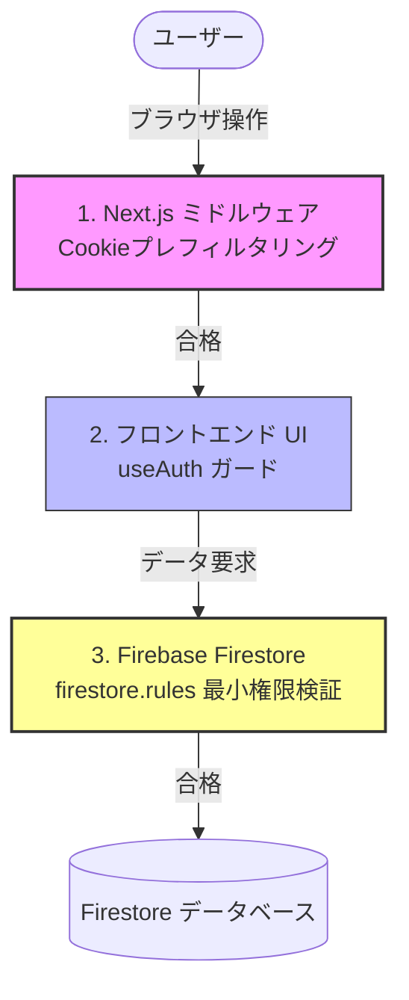

# セキュリティアーキテクチャ設計仕様書 (Security Architecture Specification)

本ドキュメントは、Quizeumにおける認証、認可、データアクセス保護、および環境分離に関わるセキュリティ設計の詳細を解説する仕様書です。

---

## 1. 多層防御（Defense in Depth）のアプローチ

Quizeumは、単一のセキュリティ対策の破綻がシステム全体の侵害に繋がらないよう、「多層防御」のアプローチを採用しています。



---

## 2. 認証と環境分離設計

### 2.1 Firebase Auth の永続化とテスト分離
- **本番・開発環境:** `getAuth(app)` を使用して、デフォルトの堅牢な永続セッション管理を行います。
- **E2Eテスト環境 (`NEXT_PUBLIC_ENV === 'test'`):** 
  - Playwright による状態保存（`storageState`）とエミュレータ動作を保証するため、`browserLocalPersistence` を明示的に初期化して `localStorage` に認証トークンを保持します。
  - ローカルの Firebase Local Emulator Suite（Auth, Firestore, Storage）にのみ自動接続し、本番環境の認証システムから完全に隔離します。

### 2.2 テストモック機能のコンパイル時排除 (Tree Shaking)
E2Eテスト用の簡易ログインロジックは、以下の静的ガードでカプセル化されています。
```typescript
const isMockAuthEnabled = process.env.NODE_ENV !== 'production' && process.env.NEXT_PUBLIC_ENV === 'test';
```
本番ビルド時にはこの変数は静的解析によって `false` と確定し、実行されることのないデッドコードとしてビルドプロセス（Next.js / SWC）で**完全に消去されます。** これにより、本番環境へのバックドア混入を100%防止します。

---

## 3. ミドルウェアとCookieの役割

### 3.1 `middleware.ts` によるプレ・フィルタリング
Next.jsのエッジミドルウェアは、アクセスされたリクエストに対し、Cookie（`quizeum_uid` や `quizeum_tier`）を検証して高速なリダイレクト処理を行います。
- **目的:** 権限のないユーザーが管理画面（`/admin/moderation`）やモデレータ画面（`/community/merge`）のページ構造・UI資産をロードするのを防ぎ、不要なネットワーク負荷を低減しUXを向上させること。

### 3.2 Cookie偽装リスクへの理解と対策
- **リスク:** Cookie情報はクライアントサイドで容易に書き換え可能であるため、攻撃者がブラウザのデベロッパーツール等で `quizeum_tier = senior_moderator` と書き換えることで、ミドルウェアによるページ遷移制限を回避できます。
- **防衛策:** 
  - フロントエンドおよびミドルウェアのチェックは「見かけ上の制限」であることを前提としています。
  - 実際に管理画面に遷移した際、表示するデータ（例: 保留中のクイズキュー）の取得にはFirestoreへのクエリが必要であり、この要求は後述の **Firestoreセキュリティルール** によって強固に拒否されます。したがって、Cookieが偽装されても、機密データが露出したり、管理者アクションが実行されたりすることはありません。

---

## 4. データベースアクセス制御 (`firestore.rules`)

データベースへの直接アクセスを防ぎ、リクエストをフィールドレベルで評価するためのセキュリティルールがルートディレクトリに定義されています。

### 4.1 コレクションごとの制御ポリシー

| コレクション | 読み取り権限 (read) | 作成権限 (create) | 更新権限 (update) | 削除権限 (delete) |
| :--- | :--- | :--- | :--- | :--- |
| **users** | 誰でも可能 (true) | 所有者本人のみ (uid一致) | 所有者本人のみ<br/>※特権フィールドの変更不可 | 管理者/シニアモデレータのみ |
| **quizzes** | 誰でも可能<br/>※`suspended` は管理者のみ | 認証済みユーザーのみ<br/>※初期値は `active` | 作成者本人（コンテンツ編集のみ）<br/>または モデレータ以上 | 作成者本人 または モデレータ以上 |
| **flags** | モデレータ以上のみ | 認証済みユーザーのみ | モデレータ以上のみ | モデレータ以上のみ |

### 4.2 特権昇格の防止ロジック
一般ユーザーが自身のアカウントに管理者ロール（`moderationTier = senior_moderator` / `admin`）を付与するのを防ぐため、`users` コレクションには以下のルールが適用されます。

```javascript
// 新規作成時: newcomer 以外での登録を拒否
allow create: if isOwner(userId) 
  && request.resource.data.moderationTier == 'newcomer';

// 更新時: 自身の moderationTier の変更を拒否 (既存データとの完全一致を要求)
allow update: if isOwner(userId)
  && request.resource.data.moderationTier == resource.data.moderationTier;
```
これにより、たとえフロントエンドの権限ステートを改ざんされても、データベース上での特権昇格は物理的に不可能です。

---

## 5. 静的セキュリティスキャン (SAST)

本プロジェクトでは、開発初期段階でのセキュリティ欠陥の発見・予防を目的として、静的コード解析ツールを統合しています。

- **採用技術:** `eslint-plugin-security`
- **対象となるリスク検知:**
  - `eval()` や危険な動的コード実行の検知。
  - 正規表現の脆弱性（ReDoS）を誘発する可能性のある危険な正規表現パターンの検知。
  - クライアントサイドでの不適切な文字列処理（XSSの温床となる処理）の検知。
  - `child_process` などのサーバーサイドにおけるコマンドインジェクションの検知。
- **実行方法:** `npm run lint` を実行することで、通常の型エラーやコードスタイル警告と合わせて、セキュリティ上の重大な懸念事項が機械的にハイライトされます。
